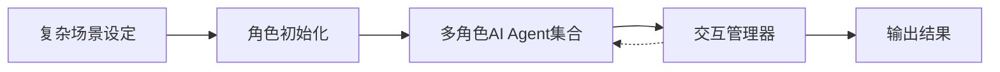

# 多角色扮演AI Agent：基于LLM的复杂场景模拟

> 关键词：多角色扮演、AI Agent、大语言模型（LLM）、复杂场景模拟、交互策略

> 摘要：本文聚焦于多角色扮演AI Agent基于大语言模型（LLM）的复杂场景模拟技术。详细介绍了该技术的背景，阐述了核心概念及相互联系，深入剖析了核心算法原理并给出具体操作步骤，同时给出了相关数学模型和公式。通过项目实战展示了代码实现及解读，探讨了实际应用场景。此外，推荐了学习资源、开发工具框架和相关论文著作，最后总结了未来发展趋势与挑战，并提供常见问题解答和扩展阅读参考资料，旨在为读者全面呈现多角色扮演AI Agent在复杂场景模拟中的技术全貌。

## 1. 背景介绍 

### 1.1 目的和范围
随着人工智能技术的不断发展，大语言模型（LLM）展现出了强大的语言理解和生成能力。多角色扮演AI Agent基于LLM进行复杂场景模拟的技术应运而生，其目的在于利用LLM的优势，创建能够模拟多个角色在复杂场景下进行交互的智能系统。本技术的范围涵盖了从教育、培训、娱乐到商业决策等多个领域，旨在为用户提供更加真实、智能的场景模拟体验。

### 1.2 预期读者
本文预期读者包括人工智能领域的研究人员、开发者、相关专业的学生以及对多角色扮演AI Agent和复杂场景模拟感兴趣的技术爱好者。对于希望深入了解该技术原理、实现方法以及应用前景的人群具有较高的参考价值。

### 1.3 文档结构概述
本文将按照以下结构进行阐述：首先介绍核心概念与联系，帮助读者建立对多角色扮演AI Agent和复杂场景模拟的基本认知；接着详细讲解核心算法原理和具体操作步骤，通过Python代码进行示例；然后给出相关数学模型和公式，并举例说明；通过项目实战展示代码的实际案例和详细解释；探讨该技术的实际应用场景；推荐学习资源、开发工具框架和相关论文著作；最后总结未来发展趋势与挑战，提供常见问题解答和扩展阅读参考资料。

### 1.4 术语表
#### 1.4.1 核心术语定义
- **多角色扮演AI Agent**：指一组能够分别模拟不同角色行为和语言的人工智能代理，每个代理具有独特的身份、目标和行为模式。
- **大语言模型（LLM）**：是一种基于深度学习的语言模型，通过在大规模文本数据上进行训练，能够生成高质量的自然语言文本。
- **复杂场景模拟**：模拟包含多个角色、多种因素和动态变化的现实场景，要求角色之间进行交互和协作。

#### 1.4.2 相关概念解释
- **角色行为模式**：每个角色在特定场景下的行为规律和决策方式，包括语言表达、行动选择等。
- **交互策略**：多角色之间进行交互的规则和方法，用于协调角色之间的行为和沟通。

#### 1.4.3 缩略词列表
- **LLM**：Large Language Model（大语言模型）
- **AI**：Artificial Intelligence（人工智能）

## 2. 核心概念与联系 

### 核心概念原理
多角色扮演AI Agent基于LLM的复杂场景模拟的核心原理是利用大语言模型的强大语言能力来实现多个角色的模拟和交互。每个AI Agent代表一个特定的角色，具有自己的身份信息、知识背景和行为偏好。在复杂场景模拟中，这些Agent根据场景的设定和其他Agent的交互信息，使用LLM生成相应的语言和行为。

具体来说，每个Agent会维护一个上下文信息，包括场景描述、历史交互记录等。当需要进行交互时，Agent将上下文信息输入到LLM中，LLM根据输入生成符合角色身份和场景的回复。通过不断更新上下文信息，Agent之间可以进行持续的交互，模拟出复杂场景下的动态变化。

### 架构的文本示意图
以下是多角色扮演AI Agent基于LLM的复杂场景模拟的架构示意图：

```plaintext
+----------------------+
|      复杂场景设定    |
+----------------------+
           |
           v
+----------------------+
|      角色初始化      |
|  （身份、知识、偏好） |
+----------------------+
           |
           v
+----------------------+
|  多角色AI Agent集合  |
|  （每个Agent包含    |
|   上下文信息和LLM） |
+----------------------+
           |
           v
+----------------------+
|      交互管理器      |
|  （协调Agent交互）   |
+----------------------+
           |
           v
+----------------------+
|      输出结果        |
|  （对话、行为等）    |
+----------------------+
```

### Mermaid流程图


该流程图展示了多角色扮演AI Agent基于LLM的复杂场景模拟的主要流程。首先进行复杂场景设定，然后对角色进行初始化。多个AI Agent根据初始化信息进行交互，交互过程由交互管理器进行协调，最后输出模拟结果。交互管理器会不断反馈信息给AI Agent集合，以实现持续的交互和场景更新。

## 3. 核心算法原理 & 具体操作步骤 

### 核心算法原理
多角色扮演AI Agent基于LLM的复杂场景模拟的核心算法主要包括角色建模、交互推理和语言生成三个部分。

#### 角色建模
角色建模的目的是为每个AI Agent定义其身份、知识背景和行为偏好。可以使用向量表示每个角色的特征，例如：
```python
class Role:
    def __init__(self, identity, knowledge, preference):
        self.identity = identity
        self.knowledge = knowledge
        self.preference = preference

# 示例角色
role1 = Role("医生", ["医学知识", "病例处理"], ["优先治疗重症患者"])
role2 = Role("患者", ["自身病情"], ["尽快得到治疗"])
```

#### 交互推理
交互推理根据当前场景和其他Agent的交互信息，决定每个Agent的下一步行动。可以使用规则引擎或机器学习模型来实现。以下是一个简单的规则引擎示例：
```python
def interaction_reasoning(agent1, agent2, scene):
    if agent1.identity == "医生" and agent2.identity == "患者":
        if "重症" in agent2.knowledge and "优先治疗重症患者" in agent1.preference:
            return "医生对患者进行紧急治疗"
        else:
            return "医生询问患者病情"
    return "无明确交互"

# 示例交互推理
result = interaction_reasoning(role1, role2, "医院场景")
print(result)
```

#### 语言生成
语言生成使用LLM根据角色的身份、上下文信息和交互推理结果生成相应的语言回复。可以使用开源的大语言模型，如Hugging Face的Transformers库：
```python
from transformers import AutoTokenizer, AutoModelForCausalLM

tokenizer = AutoTokenizer.from_pretrained("gpt2")
model = AutoModelForCausalLM.from_pretrained("gpt2")

def language_generation(role, context, action):
    input_text = f"角色：{role.identity}，上下文：{context}，行动：{action}"
    input_ids = tokenizer.encode(input_text, return_tensors="pt")
    output = model.generate(input_ids, max_length=50, num_return_sequences=1)
    response = tokenizer.decode(output[0], skip_special_tokens=True)
    return response

# 示例语言生成
context = "患者来到医院，看起来病情严重"
action = "医生对患者进行紧急治疗"
response = language_generation(role1, context, action)
print(response)
```

### 具体操作步骤
1. **场景设定**：定义复杂场景的基本信息，如场景类型、参与角色等。
2. **角色初始化**：为每个角色创建相应的AI Agent，初始化其身份、知识背景和行为偏好。
3. **交互循环**：在每个交互周期中，执行以下操作：
    - 收集当前场景信息和历史交互记录，作为上下文信息。
    - 对每个Agent进行交互推理，决定其下一步行动。
    - 根据交互推理结果，使用LLM进行语言生成，得到Agent的回复。
    - 更新上下文信息和场景状态。
4. **输出结果**：将每个交互周期的输出结果进行记录和展示。

## 4. 数学模型和公式 & 详细讲解 & 举例说明 

### 角色表示模型
角色可以用一个向量 $\mathbf{r} = [r_1, r_2, \cdots, r_n]$ 来表示，其中 $r_i$ 表示角色的某个特征，如身份、知识、偏好等。例如，对于医生角色 $\mathbf{r}_{doctor} = [1, 0.8, 0.9]$，其中第一个元素表示身份（1 表示医生），第二个元素表示医学知识水平（取值范围为 0 到 1），第三个元素表示优先治疗重症患者的偏好程度（取值范围为 0 到 1）。

### 交互推理模型
交互推理可以使用概率模型来表示。假设 $A$ 和 $B$ 是两个Agent，$S$ 是当前场景，$a$ 是 $A$ 的行动，$b$ 是 $B$ 的行动。则 $A$ 采取行动 $a$ 的概率可以表示为：

$$P(a|A, B, S) = \frac{\exp(\mathbf{w}_a^T \cdot \mathbf{f}(A, B, S))}{\sum_{i} \exp(\mathbf{w}_i^T \cdot \mathbf{f}(A, B, S))}$$

其中，$\mathbf{w}_a$ 是行动 $a$ 的权重向量，$\mathbf{f}(A, B, S)$ 是特征函数，用于提取 $A$、$B$ 和 $S$ 的相关特征。

### 语言生成模型
语言生成可以使用基于Transformer的语言模型，如GPT系列。假设输入文本为 $x$，输出文本为 $y$，则语言模型的目标是最大化条件概率 $P(y|x)$。在实际应用中，通常使用最大似然估计来训练模型，即最小化负对数似然损失：

$$L = -\sum_{i=1}^{N} \log P(y_i|x_i)$$

其中，$N$ 是训练样本的数量，$(x_i, y_i)$ 是第 $i$ 个训练样本。

### 举例说明
假设在一个医院场景中，有医生（$A$）和患者（$B$）两个Agent。医生的角色向量为 $\mathbf{r}_{doctor} = [1, 0.8, 0.9]$，患者的角色向量为 $\mathbf{r}_{patient} = [0, 0.2, 0.7]$。当前场景 $S$ 表示患者病情严重。

在交互推理阶段，根据特征函数 $\mathbf{f}(A, B, S)$ 提取相关特征，计算医生采取“紧急治疗”行动的概率 $P(\text{紧急治疗}|A, B, S)$。假设计算得到该概率为 0.8，则医生有 80% 的可能性采取紧急治疗行动。

在语言生成阶段，将医生的身份、上下文信息（患者病情严重）和行动（紧急治疗）作为输入 $x$，输入到语言模型中，生成相应的回复 $y$，如“请立即将患者送往急救室，准备进行紧急手术！”

## 5. 项目实战：代码实际案例和详细解释说明 

### 5.1  开发环境搭建
- **Python环境**：建议使用Python 3.7及以上版本。可以从Python官方网站（https://www.python.org/downloads/）下载并安装。
- **依赖库安装**：使用以下命令安装所需的依赖库：
```bash
pip install transformers torch
```
- **模型下载**：可以使用Hugging Face的Transformers库下载预训练的大语言模型，如GPT-2：
```python
from transformers import AutoTokenizer, AutoModelForCausalLM

tokenizer = AutoTokenizer.from_pretrained("gpt2")
model = AutoModelForCausalLM.from_pretrained("gpt2")
```

### 5.2  源代码详细实现和代码解读
```python
from transformers import AutoTokenizer, AutoModelForCausalLM

# 角色类定义
class Role:
    def __init__(self, identity, knowledge, preference):
        self.identity = identity
        self.knowledge = knowledge
        self.preference = preference

# 交互推理函数
def interaction_reasoning(agent1, agent2, scene):
    if agent1.identity == "医生" and agent2.identity == "患者":
        if "重症" in agent2.knowledge and "优先治疗重症患者" in agent1.preference:
            return "医生对患者进行紧急治疗"
        else:
            return "医生询问患者病情"
    return "无明确交互"

# 语言生成函数
def language_generation(role, context, action, tokenizer, model):
    input_text = f"角色：{role.identity}，上下文：{context}，行动：{action}"
    input_ids = tokenizer.encode(input_text, return_tensors="pt")
    output = model.generate(input_ids, max_length=50, num_return_sequences=1)
    response = tokenizer.decode(output[0], skip_special_tokens=True)
    return response

# 主函数
def main():
    # 初始化角色
    doctor = Role("医生", ["医学知识", "病例处理"], ["优先治疗重症患者"])
    patient = Role("患者", ["重症病情"], ["尽快得到治疗"])

    # 场景设定
    scene = "医院场景"
    context = "患者来到医院，看起来病情严重"

    # 加载模型和分词器
    tokenizer = AutoTokenizer.from_pretrained("gpt2")
    model = AutoModelForCausalLM.from_pretrained("gpt2")

    # 交互推理
    action = interaction_reasoning(doctor, patient, scene)

    # 语言生成
    response = language_generation(doctor, context, action, tokenizer, model)

    print(f"场景：{scene}")
    print(f"上下文：{context}")
    print(f"行动：{action}")
    print(f"回复：{response}")

if __name__ == "__main__":
    main()
```

### 代码解读与分析
1. **角色类定义**：`Role` 类用于表示每个角色，包含身份、知识和偏好三个属性。
2. **交互推理函数**：`interaction_reasoning` 函数根据角色的身份、知识和场景信息，决定角色的下一步行动。
3. **语言生成函数**：`language_generation` 函数使用预训练的大语言模型（GPT-2）根据角色的身份、上下文信息和行动生成相应的语言回复。
4. **主函数**：在主函数中，首先初始化角色和场景，然后加载模型和分词器。接着进行交互推理和语言生成，最后输出结果。

通过这个项目实战，我们可以看到如何使用Python和大语言模型实现多角色扮演AI Agent的复杂场景模拟。

## 6. 实际应用场景 
### 教育领域
- **角色扮演教学**：在历史、文学、医学等课程中，使用多角色扮演AI Agent模拟历史事件、文学作品中的场景或医疗案例，让学生扮演不同角色进行互动学习，提高学生的参与度和理解能力。
- **语言学习**：模拟真实的语言交流场景，如商务谈判、旅游对话等，让学生与AI Agent进行对话练习，提高语言表达和沟通能力。

### 培训领域
- **职业培训**：在金融、客服、销售等行业，使用多角色扮演AI Agent模拟实际工作场景，让学员进行角色扮演培训，提高职业技能和应对能力。
- **应急培训**：模拟自然灾害、火灾、恐怖袭击等应急场景，让学员扮演不同角色进行应急处置训练，提高应急反应能力和团队协作能力。

### 娱乐领域
- **游戏开发**：在角色扮演游戏中，使用多角色扮演AI Agent作为游戏角色，与玩家进行互动，增加游戏的趣味性和真实感。
- **影视制作**：使用多角色扮演AI Agent生成虚拟角色的对话和行为，辅助影视制作，降低制作成本和提高制作效率。

### 商业决策领域
- **市场调研**：模拟市场环境和消费者行为，让不同角色的AI Agent进行市场调研和分析，为企业决策提供参考。
- **战略规划**：模拟竞争对手的策略和市场变化，让企业决策者与AI Agent进行模拟对抗，制定更合理的战略规划。

## 7. 工具和资源推荐
### 7.1 学习资源推荐
#### 7.1.1 书籍推荐
- 《人工智能：一种现代方法》：全面介绍了人工智能的基本概念、算法和应用，是人工智能领域的经典教材。
- 《Python深度学习》：详细介绍了使用Python和深度学习框架进行深度学习的方法和实践，对于理解大语言模型的原理和应用有很大帮助。
- 《自然语言处理入门》：系统介绍了自然语言处理的基本技术和方法，包括词法分析、句法分析、语义理解等，是自然语言处理领域的入门佳作。

#### 7.1.2 在线课程
- Coursera上的“深度学习专项课程”：由深度学习领域的知名学者Andrew Ng教授授课，涵盖了深度学习的基础知识和应用。
- edX上的“自然语言处理”课程：详细介绍了自然语言处理的各种技术和方法，包括大语言模型的原理和应用。
- 哔哩哔哩（Bilibili）上的相关技术视频：有许多关于人工智能、自然语言处理和大语言模型的教学视频，适合初学者学习。

#### 7.1.3 技术博客和网站
- Hugging Face官方博客：提供了关于大语言模型、自然语言处理等领域的最新研究成果和技术应用。
- Medium上的人工智能相关博客：有许多优秀的技术文章和案例分享，涵盖了多角色扮演AI Agent等前沿技术。
- 机器之心：专注于人工智能领域的资讯和技术分析，提供了丰富的技术文章和研究报告。

### 7.2 开发工具框架推荐
#### 7.2.1 IDE和编辑器
- PyCharm：是一款专门为Python开发设计的集成开发环境（IDE），具有强大的代码编辑、调试和项目管理功能。
- Visual Studio Code：是一款轻量级的代码编辑器，支持多种编程语言，通过安装相关插件可以实现Python开发的高效编程。

#### 7.2.2 调试和性能分析工具
- PDB：Python自带的调试工具，可以帮助开发者定位代码中的问题和错误。
- cProfile：Python的性能分析工具，可以分析代码的运行时间和内存使用情况，帮助开发者优化代码性能。

#### 7.2.3 相关框架和库
- Hugging Face Transformers：是一个开源的自然语言处理库，提供了多种预训练的大语言模型和相关工具，方便开发者进行语言生成、文本分类等任务。
- PyTorch：是一个开源的深度学习框架，具有强大的计算能力和灵活性，广泛应用于自然语言处理、计算机视觉等领域。

### 7.3 相关论文著作推荐
#### 7.3.1 经典论文
- 《Attention Is All You Need》：提出了Transformer架构，是大语言模型的基础。
- 《BERT: Pre-training of Deep Bidirectional Transformers for Language Understanding》：介绍了BERT模型，开创了预训练语言模型的先河。

#### 7.3.2 最新研究成果
- 《GPT-3: Language Models are Few-Shot Learners》：介绍了GPT-3模型，展示了大语言模型在少样本学习方面的强大能力。
- 《XLNet: Generalized Autoregressive Pretraining for Language Understanding》：提出了XLNet模型，改进了BERT模型的一些局限性。

#### 7.3.3 应用案例分析
- 《Using AI Agents for Complex Scenario Simulation in Healthcare》：介绍了多角色扮演AI Agent在医疗领域的应用案例，分析了其在医疗培训和决策支持方面的优势。
- 《Role-Playing AI Agents in Educational Games: A Case Study》：研究了多角色扮演AI Agent在教育游戏中的应用，探讨了其对学生学习效果的影响。

## 8. 总结：未来发展趋势与挑战
### 未来发展趋势
- **更加真实的角色模拟**：未来的多角色扮演AI Agent将能够更加真实地模拟人类的情感、思维和行为，为用户提供更加逼真的场景模拟体验。
- **跨领域融合应用**：多角色扮演AI Agent将与其他技术，如计算机视觉、物联网等进行融合，应用于更多领域，如智能城市、智能家居等。
- **个性化定制**：根据用户的需求和偏好，为用户提供个性化的角色设定和场景模拟，提高用户的满意度和参与度。

### 挑战
- **模型训练成本**：大语言模型的训练需要大量的计算资源和数据，训练成本较高，限制了技术的普及和应用。
- **伦理和安全问题**：多角色扮演AI Agent可能会产生虚假信息、偏见等问题，需要建立相应的伦理和安全机制来规范其行为。
- **交互效果优化**：目前的多角色扮演AI Agent在交互效果方面还存在一定的不足，需要进一步优化交互策略和语言生成算法，提高交互的自然性和流畅性。

## 9. 附录：常见问题与解答
### 问题1：如何选择合适的大语言模型？
解答：选择大语言模型时，需要考虑模型的性能、适用场景、训练成本等因素。如果对计算资源和训练成本有较高要求，可以选择一些轻量级的模型；如果需要处理复杂的语言任务，可以选择一些大型的预训练模型，如GPT-3、BERT等。

### 问题2：如何提高多角色扮演AI Agent的交互效果？
解答：可以从以下几个方面提高交互效果：优化交互推理算法，使角色的行动更加合理；改进语言生成模型，提高生成回复的质量和自然度；增加角色的情感和个性特征，使交互更加生动有趣。

### 问题3：多角色扮演AI Agent是否可以应用于实时交互场景？
解答：可以，但需要考虑模型的推理速度和响应时间。可以使用一些优化技术，如模型压缩、并行计算等，提高模型的推理速度，以满足实时交互的需求。

## 10. 扩展阅读 & 参考资料
### 扩展阅读
- 《人工智能伦理与安全》：深入探讨了人工智能领域的伦理和安全问题，对于理解多角色扮演AI Agent的伦理和安全机制有很大帮助。
- 《复杂系统模拟与建模》：介绍了复杂系统模拟的方法和技术，对于设计和实现复杂场景模拟有一定的参考价值。

### 参考资料
- Hugging Face官方文档：https://huggingface.co/docs
- PyTorch官方文档：https://pytorch.org/docs/stable/index.html
- 相关学术期刊和会议论文：如《Journal of Artificial Intelligence Research》、《Proceedings of the Annual Conference on Neural Information Processing Systems》等。