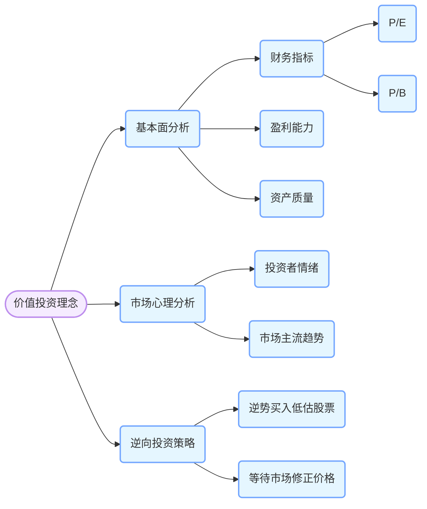

# 大卫·德雷曼的价值投资案例分析

> 关键词：大卫·德雷曼、价值投资、案例分析、投资策略、市场心理

> 摘要：本文聚焦于大卫·德雷曼的价值投资理念及相关案例。通过深入剖析其投资方法、核心概念，结合数学模型和公式进行解读，并给出具体的项目实战案例。旨在全面展示大卫·德雷曼价值投资的原理、应用及成效，为投资者提供参考和借鉴，同时探讨其在不同市场环境下的适用性及未来发展趋势与挑战。

## 1. 背景介绍 
### 1.1 目的和范围
本研究的目的在于深入分析大卫·德雷曼的价值投资案例，全面理解其投资策略的核心要点和实际应用效果。通过对具体案例的研究，总结其成功经验和可借鉴之处，为投资者提供有价值的参考。研究范围涵盖了德雷曼的投资理念、选股标准、投资决策过程以及多个实际投资案例的详细分析。

### 1.2 预期读者
本文预期读者主要包括对价值投资感兴趣的个人投资者、金融专业学生、投资研究人员以及从事资产管理的专业人士。这些读者希望通过了解大卫·德雷曼的投资方法，提升自己的投资能力和决策水平。

### 1.3 文档结构概述
本文将按照以下结构展开：首先介绍核心概念与联系，明确价值投资及相关概念的内涵和相互关系；接着阐述核心算法原理和具体操作步骤，通过Python代码进行详细说明；然后引入数学模型和公式，深入解读其投资策略的理论基础；之后通过项目实战案例，展示德雷曼价值投资方法的实际应用；再探讨其在不同领域的实际应用场景；推荐相关的学习资源、开发工具框架和论文著作；最后总结未来发展趋势与挑战，并解答常见问题，提供扩展阅读和参考资料。

### 1.4 术语表
#### 1.4.1 核心术语定义
- **价值投资**：一种基于对股票内在价值的评估，寻找被市场低估的股票进行投资的策略。投资者相信市场有时会对股票定价错误，通过深入分析公司的基本面，如财务状况、盈利能力等，以低于内在价值的价格买入股票，等待市场修正价格时获利。
- **市盈率（P/E）**：股票价格与每股收益的比率，反映了投资者为获得公司每一元盈利所愿意支付的价格。较低的市盈率通常被认为股票可能被低估。
- **市净率（P/B）**：股票价格与每股净资产的比率，衡量了股票价格相对于公司净资产的倍数。市净率较低的股票可能具有更高的投资价值。

#### 1.4.2 相关概念解释
- **市场心理**：投资者的情绪和心理因素对市场价格的影响。在市场恐慌或过度乐观时，股票价格可能会偏离其内在价值。德雷曼认为市场心理常常导致股票价格的不合理波动，价值投资者可以利用这种波动寻找投资机会。
- **逆向投资**：与市场主流趋势相反的投资策略。当市场普遍看淡某只股票或某个行业时，逆向投资者会进行深入研究，若发现其具有投资价值，则会逆势买入。

#### 1.4.3 缩略词列表
- **P/E**：Price-to-Earnings Ratio，市盈率
- **P/B**：Price-to-Book Ratio，市净率

## 2. 核心概念与联系 

### 核心概念原理
大卫·德雷曼的价值投资核心基于对股票内在价值的深入分析和对市场心理的把握。他认为市场并非总是有效的，投资者的情绪和心理因素会导致股票价格偏离其内在价值。价值投资者的任务就是通过研究公司的基本面，找到那些被市场低估的股票。

德雷曼强调关注公司的财务指标，如市盈率、市净率等。低市盈率和低市净率的股票往往被市场忽视或过度抛售，但实际上可能具有良好的盈利能力和资产质量。同时，他也注重公司的长期发展前景和行业地位。

### 架构的文本示意图
```plaintext
价值投资理念
|
|-- 基本面分析
|   |-- 财务指标（P/E、P/B等）
|   |-- 盈利能力
|   |-- 资产质量
|
|-- 市场心理分析
|   |-- 投资者情绪
|   |-- 市场主流趋势
|
|-- 逆向投资策略
|   |-- 逆势买入低估股票
|   |-- 等待市场修正价格
```

### Mermaid流程图


## 3. 核心算法原理 & 具体操作步骤 

### 核心算法原理
德雷曼的价值投资核心算法可以概括为通过筛选低市盈率和低市净率的股票，结合公司的基本面分析，评估其内在价值，寻找被市场低估的投资机会。以下是一个简化的算法步骤：

1. **数据收集**：收集股票的价格、每股收益、每股净资产等数据。
2. **计算指标**：计算市盈率（P/E）和市净率（P/B）。
3. **筛选股票**：设定市盈率和市净率的阈值，筛选出低于阈值的股票。
4. **基本面分析**：对筛选出的股票进行基本面分析，评估公司的盈利能力、资产质量、行业地位等。
5. **投资决策**：根据基本面分析结果，选择具有投资价值的股票进行投资。

### Python源代码实现
```python
import pandas as pd

# 模拟股票数据
data = {
    '股票代码': ['000001', '000002', '000003', '000004'],
    '股票价格': [10, 20, 15, 25],
    '每股收益': [1, 2, 1.5, 2.5],
    '每股净资产': [5, 10, 7.5, 12.5]
}

df = pd.DataFrame(data)

# 计算市盈率和市净率
df['P/E'] = df['股票价格'] / df['每股收益']
df['P/B'] = df['股票价格'] / df['每股净资产']

# 设定阈值
pe_threshold = 10
pb_threshold = 2

# 筛选股票
selected_stocks = df[(df['P/E'] < pe_threshold) & (df['P/B'] < pb_threshold)]

print(selected_stocks)
```

### 代码解释
1. **数据收集**：使用`pandas`库创建一个包含股票代码、股票价格、每股收益和每股净资产的`DataFrame`。
2. **计算指标**：通过`DataFrame`的列运算，计算市盈率（P/E）和市净率（P/B）。
3. **筛选股票**：使用布尔索引筛选出市盈率低于10且市净率低于2的股票。
4. **输出结果**：打印筛选出的股票信息。

## 4. 数学模型和公式 & 详细讲解 & 举例说明 

### 市盈率（P/E）公式
市盈率（P/E）的计算公式为：
$$P/E = \frac{股票价格}{每股收益}$$

#### 详细讲解
市盈率反映了投资者为获得公司每一元盈利所愿意支付的价格。较低的市盈率可能意味着股票被低估，具有更高的投资价值。但需要注意的是，市盈率也受到公司盈利增长预期、行业特点等因素的影响。

#### 举例说明
假设某股票的价格为20元，每股收益为2元，则该股票的市盈率为：
$$P/E = \frac{20}{2} = 10$$

如果同行业的平均市盈率为15，那么该股票的市盈率相对较低，可能被市场低估。

### 市净率（P/B）公式
市净率（P/B）的计算公式为：
$$P/B = \frac{股票价格}{每股净资产}$$

#### 详细讲解
市净率衡量了股票价格相对于公司净资产的倍数。较低的市净率可能表示股票被低估，公司的资产质量较好。但市净率也受到资产的流动性、盈利能力等因素的影响。

#### 举例说明
假设某股票的价格为15元，每股净资产为7.5元，则该股票的市净率为：
$$P/B = \frac{15}{7.5} = 2$$

如果同行业的平均市净率为3，那么该股票的市净率相对较低，可能具有投资价值。

## 5. 项目实战：代码实际案例和详细解释说明 

### 5.1 开发环境搭建
- **操作系统**：Windows、Linux或Mac OS均可。
- **编程语言**：Python 3.x
- **开发工具**：推荐使用Jupyter Notebook或PyCharm。
- **所需库**：`pandas`、`numpy`、`yfinance`（用于获取股票数据）

安装所需库的命令如下：
```sh
pip install pandas numpy yfinance
```

### 5.2 源代码详细实现和代码解读
```python
import yfinance as yf
import pandas as pd

# 定义股票列表
stock_list = ['AAPL', 'MSFT', 'GOOG', 'AMZN']

# 获取股票数据
data = yf.download(stock_list, start='2020-01-01', end='2023-01-01')

# 提取收盘价和财务数据
close_prices = data['Close']
financial_data = {}
for stock in stock_list:
    ticker = yf.Ticker(stock)
    financial_data[stock] = {
        '每股收益': ticker.info.get('trailingEps'),
        '每股净资产': ticker.info.get('bookValue')
    }

# 转换为DataFrame
financial_df = pd.DataFrame(financial_data).T

# 计算市盈率和市净率
financial_df['P/E'] = close_prices.iloc[-1] / financial_df['每股收益']
financial_df['P/B'] = close_prices.iloc[-1] / financial_df['每股净资产']

# 设定阈值
pe_threshold = 20
pb_threshold = 3

# 筛选股票
selected_stocks = financial_df[(financial_df['P/E'] < pe_threshold) & (financial_df['P/B'] < pb_threshold)]

print(selected_stocks)
```

### 代码解读与分析
1. **导入库**：导入`yfinance`和`pandas`库，分别用于获取股票数据和数据处理。
2. **定义股票列表**：定义要分析的股票列表，这里选择了苹果（AAPL）、微软（MSFT）、谷歌（GOOG）和亚马逊（AMZN）。
3. **获取股票数据**：使用`yfinance`库的`download`函数获取股票的历史价格数据。
4. **提取财务数据**：通过`yfinance`库的`Ticker`对象获取每只股票的每股收益和每股净资产。
5. **计算指标**：计算市盈率（P/E）和市净率（P/B）。
6. **筛选股票**：设定市盈率和市净率的阈值，筛选出低于阈值的股票。
7. **输出结果**：打印筛选出的股票信息。

## 6. 实际应用场景 
### 股票投资组合构建
投资者可以运用大卫·德雷曼的价值投资方法构建股票投资组合。通过筛选低市盈率和低市净率的股票，结合公司的基本面分析，选择具有投资价值的股票纳入组合。这种方法可以降低投资风险，提高投资回报率。

### 长期投资策略
价值投资是一种适合长期投资的策略。德雷曼的方法强调对公司内在价值的评估，投资者可以选择那些具有良好基本面和长期发展潜力的股票进行长期持有。在市场波动时，不被短期市场情绪所左右，等待市场修正价格，实现资产的增值。

### 逆向投资机会把握
当市场出现恐慌或过度乐观时，股票价格可能会偏离其内在价值。投资者可以利用德雷曼的逆向投资策略，逆势买入被低估的股票。例如，在行业整体低迷时，某些具有竞争力的公司股票可能被市场过度抛售，此时是逆向投资的好时机。

## 7. 工具和资源推荐
### 7.1 学习资源推荐
#### 7.1.1 书籍推荐
- 《逆向投资策略：背离大众，跑赢大势》（大卫·德雷曼著）：这是德雷曼的经典著作，详细阐述了他的价值投资和逆向投资理念，通过大量的案例分析展示了如何在市场中寻找被低估的股票。
- 《聪明的投资者》（本杰明·格雷厄姆著）：价值投资的经典之作，对价值投资的基本原理和方法进行了系统的阐述，是投资者的必读之书。
- 《证券分析》（本杰明·格雷厄姆、戴维·多德著）：被誉为投资界的“圣经”，深入探讨了证券分析的理论和方法，为价值投资提供了坚实的理论基础。

#### 7.1.2 在线课程
- Coursera上的“投资学原理”：该课程涵盖了投资的基本概念、资产定价模型、投资组合管理等内容，有助于投资者建立系统的投资知识体系。
- edX上的“价值投资：从基础到实践”：课程由专业的投资专家授课，结合实际案例，讲解价值投资的方法和技巧。

#### 7.1.3 技术博客和网站
- 雪球网：国内知名的投资社区，汇集了众多投资者的观点和分析，提供了丰富的股票研究报告和投资策略分享。
- Seeking Alpha：国外的投资研究网站，提供全球股票市场的分析和评论，有很多专业的投资者和分析师发布的研究文章。

### 7.2 开发工具框架推荐
#### 7.2.1 IDE和编辑器
- Jupyter Notebook：一种交互式的开发环境，适合数据探索和分析。可以方便地编写和运行Python代码，同时支持Markdown文本和可视化展示。
- PyCharm：专业的Python集成开发环境，具有强大的代码编辑、调试和项目管理功能，适合大规模的Python项目开发。

#### 7.2.2 调试和性能分析工具
- IPython：Python的交互式解释器，支持代码调试和快速测试。可以在代码执行过程中进行断点调试，查看变量的值。
- cProfile：Python的性能分析工具，可以分析代码的运行时间和函数调用次数，帮助优化代码性能。

#### 7.2.3 相关框架和库
- pandas：强大的数据处理和分析库，提供了高效的数据结构和数据操作方法，适用于股票数据的处理和分析。
- numpy：Python的数值计算库，提供了高效的多维数组和数学函数，用于科学计算和数据分析。
- yfinance：用于获取雅虎财经的股票数据，简单易用，可以方便地获取股票的历史价格、财务数据等。

### 7.3 相关论文著作推荐
#### 7.3.1 经典论文
- “The Cross-Section of Expected Stock Returns”（Eugene F. Fama和Kenneth R. French著）：该论文提出了著名的Fama-French三因子模型，对股票的预期收益率进行了深入研究，为价值投资提供了理论支持。
- “Behavioral Finance: A Review”（Richard H. Thaler著）：介绍了行为金融学的基本概念和研究成果，探讨了投资者的心理和行为因素对市场的影响，与德雷曼的市场心理分析理念相关。

#### 7.3.2 最新研究成果
- 关注《Journal of Finance》《Review of Financial Studies》等顶级金融学术期刊，这些期刊会发表关于价值投资、资产定价等领域的最新研究成果。
- 定期查阅金融学术会议的论文集，如美国金融协会（AFA）年会、西部金融协会（WFA）年会等，了解行业内的前沿研究动态。

#### 7.3.3 应用案例分析
- 许多金融研究机构和投资公司会发布价值投资的应用案例分析报告。可以关注晨星（Morningstar）、标准普尔（S&P）等机构的研究报告，学习他们在实际投资中的应用经验和策略。

## 8. 总结：未来发展趋势与挑战
### 未来发展趋势
- **数字化和智能化**：随着科技的发展，价值投资也将越来越多地借助数字化和智能化工具。例如，利用大数据分析和人工智能算法进行股票筛选和基本面分析，提高投资决策的效率和准确性。
- **全球投资机会增加**：经济全球化的趋势使得投资者可以更容易地参与全球股票市场。价值投资者可以在全球范围内寻找被低估的股票，扩大投资机会。
- **社会责任投资的融合**：越来越多的投资者开始关注企业的社会责任和可持续发展。未来，价值投资可能会与社会责任投资相结合，选择那些不仅具有良好财务状况，还积极履行社会责任的公司进行投资。

### 挑战
- **市场有效性提高**：随着信息传播的速度加快和投资者教育水平的提高，市场的有效性可能会逐渐增强。这意味着找到被市场低估的股票变得更加困难，价值投资者需要更加深入地研究和分析。
- **宏观经济不确定性**：全球宏观经济环境的不确定性增加，如经济衰退、通货膨胀、利率波动等，会对股票市场产生重大影响。价值投资者需要更好地应对宏观经济变化，调整投资策略。
- **新兴行业的估值难题**：随着科技的快速发展，新兴行业不断涌现。这些行业的公司往往具有独特的商业模式和盈利模式，传统的估值方法可能不再适用。价值投资者需要探索新的估值方法和分析框架。

## 9. 附录：常见问题与解答
### 问题1：价值投资是否适用于所有市场环境？
价值投资在大多数市场环境下都有一定的适用性，但并不是在所有情况下都能取得良好的效果。在市场泡沫时期，价值投资可能会错过一些短期的投资机会；而在市场低迷时期，价值投资可以帮助投资者寻找被低估的股票，获得长期的回报。

### 问题2：如何确定市盈率和市净率的合理阈值？
市盈率和市净率的合理阈值没有固定的标准，需要根据不同的行业、市场环境和公司特点来确定。一般来说，可以参考同行业的平均水平，并结合公司的盈利增长预期、资产质量等因素进行综合判断。

### 问题3：价值投资需要多长时间才能看到效果？
价值投资是一种长期投资策略，通常需要3 - 5年甚至更长的时间才能看到明显的效果。因为市场对股票价格的修正需要一定的时间，而且公司的基本面改善也需要一个过程。

## 10. 扩展阅读 & 参考资料
### 扩展阅读
- 《金融炼金术》（乔治·索罗斯著）：探讨了金融市场的反身性理论，对投资者理解市场的运行机制和投资决策有很大的启发。
- 《漫步华尔街》（伯顿·马尔基尔著）：介绍了各种投资策略和市场理论，帮助投资者理性看待投资，避免盲目跟风。

### 参考资料
- 大卫·德雷曼的官方网站和相关采访资料。
- 雅虎财经、晨星等金融数据网站提供的股票数据和研究报告。
- 相关的金融学术期刊和会议论文。