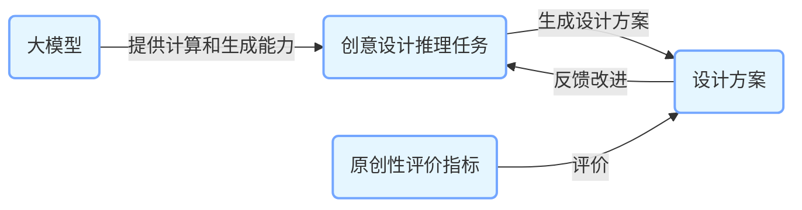

# 大模型在创意设计推理任务中的原创性评价指标研究

> 关键词：大模型、创意设计推理任务、原创性评价指标、人工智能、设计创意、模型评估、创新度量

> 摘要：本文聚焦于大模型在创意设计推理任务中的原创性评价指标。随着大模型在设计领域的广泛应用，其生成内容的原创性评估变得至关重要。文章首先介绍研究的背景、目的、预期读者等信息，接着阐述相关核心概念及联系，深入剖析核心算法原理并给出操作步骤，借助数学模型和公式进行理论讲解与实例说明。通过项目实战展示代码实现与解读，探讨实际应用场景，推荐相关工具和资源。最后总结未来发展趋势与挑战，提供常见问题解答及参考资料，旨在为大模型在创意设计推理任务中的原创性评价提供全面且深入的研究。

## 1. 背景介绍 
### 1.1 目的和范围
随着人工智能技术的飞速发展，大模型在各个领域的应用越来越广泛，尤其是在创意设计推理任务中。大模型能够快速生成大量的设计方案，但这些方案的原创性却参差不齐。本研究的目的在于建立一套科学、合理、有效的原创性评价指标体系，以准确评估大模型在创意设计推理任务中生成内容的原创性。

本研究的范围主要涵盖大模型在平面设计、产品设计、室内设计等常见创意设计领域的应用。通过对不同类型设计任务的分析，提炼出具有普遍适用性的原创性评价指标。

### 1.2 预期读者
本文预期读者包括人工智能领域的研究人员、创意设计专业的设计师、相关领域的学者以及对大模型和创意设计感兴趣的技术爱好者。对于研究人员，本文提供了原创性评价指标的理论基础和研究思路；对于设计师，有助于他们更好地理解大模型生成设计的特点，提高设计质量；对于学者，可作为相关研究的参考资料；对于技术爱好者，能帮助他们了解大模型在创意设计中的应用和评价方法。

### 1.3 文档结构概述
本文共分为十个部分。第一部分为背景介绍，阐述研究的目的、范围、预期读者和文档结构概述。第二部分介绍核心概念与联系，包括大模型、创意设计推理任务、原创性等概念的原理和架构，并通过文本示意图和 Mermaid 流程图展示它们之间的关系。第三部分讲解核心算法原理和具体操作步骤，使用 Python 源代码详细阐述算法实现。第四部分给出数学模型和公式，进行详细讲解并举例说明。第五部分通过项目实战展示代码实际案例和详细解释说明，包括开发环境搭建、源代码实现和代码解读。第六部分探讨实际应用场景。第七部分推荐相关工具和资源，包括学习资源、开发工具框架和相关论文著作。第八部分总结未来发展趋势与挑战。第九部分为附录，提供常见问题与解答。第十部分给出扩展阅读和参考资料。

### 1.4 术语表
#### 1.4.1 核心术语定义
- **大模型**：指具有大量参数和强大计算能力的人工智能模型，如 GPT 系列、BERT 等，能够处理各种自然语言处理和生成任务。
- **创意设计推理任务**：在创意设计过程中，通过对设计需求、目标和约束条件的分析，运用推理方法生成具有创新性的设计方案的任务。
- **原创性**：指设计作品在思想、形式、内容等方面具有独特性和新颖性，与已有的设计作品有明显的区别。

#### 1.4.2 相关概念解释
- **设计创意**：是指在设计过程中产生的具有创造性和创新性的想法和概念，是设计作品的核心价值所在。
- **模型评估**：对大模型的性能、效果、质量等方面进行评价和分析的过程，以确定模型是否满足特定的需求和标准。
- **创新度量**：对设计作品或创新成果的创新程度进行量化评估的方法和指标。

#### 1.4.3 缩略词列表
- **GPT**：Generative Pretrained Transformer（生成式预训练变换器）
- **BERT**：Bidirectional Encoder Representations from Transformers（基于变换器的双向编码器表示）

## 2. 核心概念与联系 
### 核心概念原理
#### 大模型
大模型基于深度学习技术，通过在大规模数据集上进行训练，学习到语言、图像等数据的内在模式和规律。其核心原理是利用神经网络的多层结构对输入数据进行特征提取和转换，从而实现对各种任务的处理。例如，GPT 系列模型采用了 Transformer 架构，通过自注意力机制能够捕捉输入序列中不同位置之间的依赖关系，从而生成高质量的文本。

#### 创意设计推理任务
创意设计推理任务涉及到对设计需求的理解、设计知识的运用和创新思维的发挥。在这个过程中，需要结合设计领域的专业知识和经验，对各种设计元素进行组合和优化，以生成满足用户需求的设计方案。例如，在平面设计中，需要考虑色彩搭配、图形布局、文字排版等因素，通过推理和决策生成具有吸引力的设计作品。

#### 原创性
原创性的核心在于设计作品的独特性和新颖性。它不仅仅是表面上的差异，更涉及到设计思想、创意来源和实现方式的创新。一个具有原创性的设计作品应该能够展现出独特的视角和创造力，为用户带来全新的体验。

### 架构的文本示意图
大模型、创意设计推理任务和原创性之间存在着密切的联系。大模型作为一种工具，为创意设计推理任务提供了强大的计算和生成能力。通过对设计需求的分析和理解，大模型可以生成多种设计方案。而原创性则是对这些设计方案进行评价的重要标准。一个优秀的创意设计推理任务应该能够充分发挥大模型的优势，生成具有较高原创性的设计作品。

### Mermaid 流程图


## 3. 核心算法原理 & 具体操作步骤 
### 核心算法原理
我们可以采用基于特征提取和相似度计算的算法来评估大模型在创意设计推理任务中生成内容的原创性。具体步骤如下：
1. **特征提取**：对设计作品的关键特征进行提取，例如在图像设计中，可以提取颜色特征、形状特征、纹理特征等；在文本设计中，可以提取词汇特征、语法特征、语义特征等。
2. **相似度计算**：将提取的特征与已有的设计作品进行相似度计算，常用的相似度计算方法包括欧几里得距离、余弦相似度等。
3. **原创性评估**：根据相似度计算的结果，评估设计作品的原创性。相似度越低，原创性越高。

### Python 源代码详细阐述
```python
import numpy as np

# 特征提取函数（示例，假设提取的特征是一个向量）
def extract_features(design):
    # 这里只是简单示例，实际应用中需要根据具体设计类型进行特征提取
    return np.random.rand(10)

# 计算欧几里得距离
def euclidean_distance(feature1, feature2):
    return np.sqrt(np.sum((feature1 - feature2) ** 2))

# 计算余弦相似度
def cosine_similarity(feature1, feature2):
    dot_product = np.dot(feature1, feature2)
    norm1 = np.linalg.norm(feature1)
    norm2 = np.linalg.norm(feature2)
    return dot_product / (norm1 * norm2)

# 原创性评估函数
def evaluate_originality(design, existing_designs):
    design_features = extract_features(design)
    min_similarity = 1
    for existing_design in existing_designs:
        existing_features = extract_features(existing_design)
        # 这里使用余弦相似度进行示例
        similarity = cosine_similarity(design_features, existing_features)
        if similarity < min_similarity:
            min_similarity = similarity
    # 原创性得分，相似度越低，原创性越高
    originality_score = 1 - min_similarity
    return originality_score

# 示例使用
design = "example_design"
existing_designs = ["design1", "design2", "design3"]
originality_score = evaluate_originality(design, existing_designs)
print(f"原创性得分: {originality_score}")
```

### 具体操作步骤
1. **数据准备**：收集大量的已有设计作品作为参考数据，同时准备好大模型生成的设计作品。
2. **特征提取**：使用合适的特征提取方法对设计作品进行特征提取。
3. **相似度计算**：将生成的设计作品的特征与参考数据中的设计作品的特征进行相似度计算。
4. **原创性评估**：根据相似度计算的结果，评估生成的设计作品的原创性得分。
5. **结果分析**：对评估结果进行分析，判断大模型生成的设计作品的原创性水平，并根据需要进行改进和优化。

## 4. 数学模型和公式 & 详细讲解 & 举例说明 
### 数学模型和公式
#### 欧几里得距离
欧几里得距离是计算两个向量之间距离的常用方法，其公式为：
$$d(x,y)=\sqrt{\sum_{i = 1}^{n}(x_i - y_i)^2}$$
其中，$x=(x_1,x_2,\cdots,x_n)$ 和 $y=(y_1,y_2,\cdots,y_n)$ 是两个 $n$ 维向量，$d(x,y)$ 表示它们之间的欧几里得距离。

#### 余弦相似度
余弦相似度是计算两个向量之间夹角余弦值的方法，其公式为：
$$\text{cosine}(x,y)=\frac{\mathbf{x}\cdot\mathbf{y}}{\|\mathbf{x}\|\|\mathbf{y}\|}=\frac{\sum_{i = 1}^{n}x_iy_i}{\sqrt{\sum_{i = 1}^{n}x_i^2}\sqrt{\sum_{i = 1}^{n}y_i^2}}$$
其中，$\mathbf{x}\cdot\mathbf{y}$ 表示向量 $\mathbf{x}$ 和 $\mathbf{y}$ 的点积，$\|\mathbf{x}\|$ 和 $\|\mathbf{y}\|$ 分别表示向量 $\mathbf{x}$ 和 $\mathbf{y}$ 的模。

### 详细讲解
欧几里得距离衡量的是两个向量在空间中的实际距离，距离越远表示两个向量越不相似。余弦相似度衡量的是两个向量之间的夹角，夹角越小表示两个向量越相似。在原创性评估中，我们希望找到与已有设计作品相似度较低的设计作品，因此可以使用欧几里得距离或余弦相似度来计算相似度，然后根据相似度计算原创性得分。

### 举例说明
假设我们有两个二维向量 $\mathbf{x}=(1,2)$ 和 $\mathbf{y}=(3,4)$，计算它们的欧几里得距离和余弦相似度。

#### 欧几里得距离计算
$$d(\mathbf{x},\mathbf{y})=\sqrt{(1 - 3)^2+(2 - 4)^2}=\sqrt{(-2)^2+(-2)^2}=\sqrt{4 + 4}=\sqrt{8}\approx2.83$$

#### 余弦相似度计算
$$\mathbf{x}\cdot\mathbf{y}=1\times3+2\times4=3 + 8 = 11$$
$$\|\mathbf{x}\|=\sqrt{1^2+2^2}=\sqrt{1 + 4}=\sqrt{5}\approx2.24$$
$$\|\mathbf{y}\|=\sqrt{3^2+4^2}=\sqrt{9 + 16}=\sqrt{25}=5$$
$$\text{cosine}(\mathbf{x},\mathbf{y})=\frac{11}{2.24\times5}\approx0.98$$

通过计算结果可以看出，这两个向量的欧几里得距离较大，余弦相似度较高，说明它们在空间中的位置有一定距离，但方向比较相似。

## 5. 项目实战：代码实际案例和详细解释说明 
### 5.1  开发环境搭建
#### 操作系统
可以选择 Windows、Linux 或 macOS 操作系统，本示例以 Ubuntu 20.04 为例。

#### Python 环境
安装 Python 3.8 或更高版本，可以使用以下命令进行安装：
```bash
sudo apt update
sudo apt install python3.8
```

#### 依赖库安装
安装项目所需的依赖库，如 NumPy、Pillow（用于图像特征提取）等：
```bash
pip install numpy pillow
```

### 5.2  源代码详细实现和代码解读
以下是一个基于图像的原创性评估的完整代码示例：
```python
import os
import numpy as np
from PIL import Image

# 特征提取函数，使用图像的直方图作为特征
def extract_image_features(image_path):
    image = Image.open(image_path)
    image = image.resize((100, 100))  # 统一图像大小
    histogram = image.histogram()
    return np.array(histogram)

# 计算欧几里得距离
def euclidean_distance(feature1, feature2):
    return np.sqrt(np.sum((feature1 - feature2) ** 2))

# 原创性评估函数
def evaluate_image_originality(image_path, existing_image_paths):
    design_features = extract_image_features(image_path)
    min_distance = float('inf')
    for existing_image_path in existing_image_paths:
        existing_features = extract_image_features(existing_image_path)
        distance = euclidean_distance(design_features, existing_features)
        if distance < min_distance:
            min_distance = distance
    # 原创性得分，距离越远，原创性越高
    originality_score = min_distance / np.max(design_features)
    return originality_score

# 示例使用
image_folder = "images"
existing_image_paths = [os.path.join(image_folder, f) for f in os.listdir(image_folder) if f.endswith(('.png', '.jpg', '.jpeg'))]
test_image_path = "test_image.jpg"
originality_score = evaluate_image_originality(test_image_path, existing_image_paths)
print(f"图像原创性得分: {originality_score}")
```

### 代码解读与分析
1. **特征提取**：`extract_image_features` 函数用于提取图像的直方图特征。首先，使用 `Pillow` 库打开图像并将其调整为统一大小，然后计算图像的直方图并将其转换为 NumPy 数组。
2. **相似度计算**：`euclidean_distance` 函数用于计算两个特征向量之间的欧几里得距离。
3. **原创性评估**：`evaluate_image_originality` 函数将测试图像的特征与已有图像的特征进行比较，找到最小的欧几里得距离，并根据该距离计算原创性得分。
4. **示例使用**：代码最后通过一个示例展示了如何使用上述函数进行图像原创性评估。

## 6. 实际应用场景 
### 平面设计
在平面设计领域，大模型可以生成各种海报、广告、包装等设计作品。通过原创性评价指标，可以筛选出具有较高原创性的设计方案，避免抄袭和模仿，提高设计作品的质量和独特性。例如，广告公司可以使用原创性评价指标来评估大模型生成的广告海报，选择最具创意和吸引力的设计方案进行投放。

### 产品设计
在产品设计中，大模型可以辅助设计师进行产品外观、功能等方面的创新设计。原创性评价指标可以帮助设计师判断大模型生成的产品设计方案是否具有独特的创意和竞争力。例如，汽车制造商可以使用原创性评价指标来评估大模型生成的汽车外观设计方案，选择最具创新性的设计进行生产。

### 室内设计
在室内设计领域，大模型可以根据用户的需求和空间特点生成不同风格的室内设计方案。通过原创性评价指标，可以评估这些方案的独特性和创新性，为用户提供更个性化的设计选择。例如，装修公司可以使用原创性评价指标来评估大模型生成的室内设计方案，为客户推荐最符合其需求和品味的设计。

## 7. 工具和资源推荐
### 7.1 学习资源推荐
#### 7.1.1 书籍推荐
- 《深度学习》（Deep Learning）：由 Ian Goodfellow、Yoshua Bengio 和 Aaron Courville 合著，是深度学习领域的经典教材，涵盖了深度学习的基本原理、算法和应用。
- 《Python 数据分析实战》（Python for Data Analysis）：由 Wes McKinney 著，介绍了使用 Python 进行数据分析的方法和技巧，对于理解和实现原创性评价指标中的数据处理和分析部分有很大帮助。
- 《设计心理学》（The Design of Everyday Things）：由 Don Norman 著，从心理学的角度探讨了设计的原则和方法，有助于深入理解创意设计的本质和用户需求。

#### 7.1.2 在线课程
- Coursera 上的“深度学习专项课程”（Deep Learning Specialization）：由 Andrew Ng 教授授课，系统地介绍了深度学习的理论和实践。
- edX 上的“人工智能基础”（Introduction to Artificial Intelligence）：涵盖了人工智能的基本概念、算法和应用，为学习大模型和创意设计推理任务提供了基础知识。
- Udemy 上的“Python 数据科学和机器学习实战”（Python for Data Science and Machine Learning Bootcamp）：通过实际项目讲解 Python 在数据科学和机器学习中的应用，对于实现原创性评价指标的代码实现有很大帮助。

#### 7.1.3 技术博客和网站
- Medium：是一个汇聚了众多技术专家和爱好者的平台，上面有很多关于大模型、创意设计和人工智能的优秀文章。
- arXiv：是一个预印本服务器，提供了大量的学术论文，包括大模型、创意设计推理任务和原创性评价指标的最新研究成果。
- AI 前线：专注于人工智能领域的技术资讯和深度报道，提供了很多关于大模型应用和设计创新的案例分析。

### 7.2 开发工具框架推荐
#### 7.2.1 IDE和编辑器
- PyCharm：是一款专业的 Python 集成开发环境，提供了丰富的代码编辑、调试和管理功能，适合开发原创性评价指标相关的 Python 代码。
- Visual Studio Code：是一款轻量级的代码编辑器，支持多种编程语言和插件扩展，可用于快速开发和调试代码。

#### 7.2.2 调试和性能分析工具
- PDB：是 Python 自带的调试器，可以帮助开发者定位和解决代码中的问题。
- cProfile：是 Python 标准库中的性能分析工具，可以分析代码的运行时间和资源消耗情况，帮助优化代码性能。

#### 7.2.3 相关框架和库
- TensorFlow：是一个开源的深度学习框架，提供了丰富的工具和接口，可用于构建和训练大模型。
- PyTorch：是另一个流行的深度学习框架，具有动态计算图的特点，适合快速开发和实验。
- Scikit-learn：是一个用于机器学习的 Python 库，提供了多种机器学习算法和工具，可用于特征提取、相似度计算等任务。

### 7.3 相关论文著作推荐
#### 7.3.1 经典论文
- “Attention Is All You Need”：介绍了 Transformer 架构，为大模型的发展奠定了基础。
- “Generative Adversarial Nets”：提出了生成对抗网络（GAN）的概念，在创意设计生成领域有广泛的应用。
- “A Framework for Understanding Creativity in Design”：探讨了设计创意的本质和评估方法，为原创性评价指标的研究提供了理论基础。

#### 7.3.2 最新研究成果
- 关注顶级学术会议如 NeurIPS、ICML、CVPR 等上发表的关于大模型、创意设计推理任务和原创性评价指标的最新研究论文。
- 查阅相关学术期刊如 Journal of Artificial Intelligence Research、ACM Transactions on Graphics 等上的研究成果。

#### 7.3.3 应用案例分析
- 分析一些实际应用中使用大模型进行创意设计并进行原创性评估的案例，如设计公司的内部报告、学术研究中的应用实例等，了解实际应用中的挑战和解决方案。

## 8. 总结：未来发展趋势与挑战
### 未来发展趋势
#### 多模态融合
未来的大模型将更加注重多模态信息的融合，如文本、图像、音频等。在创意设计推理任务中，多模态融合可以生成更加丰富和多样化的设计作品，同时也对原创性评价指标提出了更高的要求。例如，一个包含文本描述和图像的设计作品，需要综合考虑文本和图像的原创性。

#### 个性化原创性评估
随着用户需求的个性化趋势越来越明显，未来的原创性评价指标将更加注重个性化评估。不同的用户对原创性的理解和需求可能不同，因此需要根据用户的偏好和历史数据进行个性化的原创性评估。例如，对于一个追求时尚和潮流的用户，可能更注重设计作品的新颖性和独特性；而对于一个注重实用性的用户，可能更关注设计作品的功能和合理性。

#### 与人类创意的协同
大模型将与人类设计师更加紧密地协同工作，实现优势互补。大模型可以提供大量的创意灵感和设计方案，而人类设计师则可以发挥其创造力和判断力，对大模型生成的方案进行筛选和优化。在这个过程中，原创性评价指标将起到重要的作用，帮助人类设计师选择最具潜力的设计方案。

### 挑战
#### 数据隐私和安全
在原创性评价过程中，需要收集和使用大量的设计作品数据，这些数据可能包含用户的隐私信息。因此，如何保证数据的隐私和安全是一个重要的挑战。同时，大模型的训练和运行也需要大量的计算资源和数据支持，如何防止数据泄露和恶意攻击也是需要解决的问题。

#### 评价指标的主观性
原创性本身是一个相对主观的概念，不同的人对原创性的理解和评价可能存在差异。因此，如何建立一个客观、公正、科学的原创性评价指标体系是一个挑战。目前的评价指标主要基于特征提取和相似度计算，这些方法虽然可以在一定程度上评估原创性，但仍然存在局限性。

#### 大模型的可解释性
大模型通常是一个黑盒模型，其决策过程和生成机制难以理解和解释。在创意设计推理任务中，这可能会导致设计师对大模型生成的设计方案缺乏信任。因此，如何提高大模型的可解释性，让设计师能够理解和控制大模型的生成过程，是一个需要解决的问题。

## 9. 附录：常见问题与解答
### 1. 如何选择合适的特征提取方法？
选择合适的特征提取方法需要根据设计作品的类型和特点来决定。例如，对于图像设计，可以选择颜色特征、形状特征、纹理特征等；对于文本设计，可以选择词汇特征、语法特征、语义特征等。同时，还需要考虑特征提取方法的计算复杂度和有效性。可以通过实验和比较不同的特征提取方法，选择最适合的方法。

### 2. 原创性评价指标是否适用于所有类型的设计作品？
原创性评价指标可以适用于大多数类型的设计作品，但不同类型的设计作品可能需要不同的评价指标和方法。例如，对于平面设计和产品设计，可能更注重外观和功能的原创性；而对于室内设计，可能更注重空间布局和氛围的原创性。因此，在实际应用中，需要根据设计作品的类型和特点进行适当的调整和优化。

### 3. 如何处理大模型生成的设计作品与已有设计作品的相似度较高的情况？
如果大模型生成的设计作品与已有设计作品的相似度较高，可以采取以下措施：
- **调整大模型的参数和训练数据**：通过调整大模型的参数和训练数据，使其生成更加多样化和独特的设计作品。
- **人工干预和优化**：设计师可以对大模型生成的设计作品进行人工干预和优化，加入自己的创意和想法，提高设计作品的原创性。
- **使用其他创意设计方法**：可以结合其他创意设计方法，如头脑风暴、思维导图等，与大模型生成的设计作品相结合，生成更具原创性的设计方案。

### 4. 原创性评价指标是否可以完全替代人类的判断？
原创性评价指标不能完全替代人类的判断。虽然原创性评价指标可以提供客观的评估结果，但原创性本身是一个相对主观的概念，还需要考虑设计作品的文化背景、审美观念等因素。人类设计师具有丰富的创造力和判断力，可以从多个角度对设计作品进行评价和判断。因此，在实际应用中，应该将原创性评价指标与人类的判断相结合，以获得更准确和全面的评估结果。

## 10. 扩展阅读 & 参考资料
### 扩展阅读
- 《人工智能时代的设计创新》：探讨了人工智能技术对设计领域的影响和挑战，以及如何在人工智能时代进行设计创新。
- 《创意算法》：介绍了一些用于创意设计的算法和方法，包括遗传算法、模拟退火算法等，为创意设计推理任务提供了更多的思路和方法。
- 《设计的未来》：展望了设计领域的未来发展趋势，包括人工智能、虚拟现实、增强现实等技术对设计的影响，为未来的研究和实践提供了参考。

### 参考资料
- Goodfellow, I. J., Bengio, Y., & Courville, A. (2016). Deep Learning. MIT Press.
- McKinney, W. (2017). Python for Data Analysis: Data Wrangling with Pandas, NumPy, and IPython. O'Reilly Media.
- Norman, D. A. (2013). The Design of Everyday Things. Basic Books.
- Vaswani, A., Shazeer, N., Parmar, N., Uszkoreit, J., Jones, L., Gomez, A. N., ... & Polosukhin, I. (2017). Attention is all you need. In Advances in neural information processing systems (pp. 5998-6008).
- Goodfellow, I. J., Pouget-Abadie, J., Mirza, M., Xu, B., Warde-Farley, D., Ozair, S., ... & Bengio, Y. (2014). Generative adversarial nets. In Advances in neural information processing systems (pp. 2672-2680).
- Dorst, K. (2015). A framework for understanding creativity in design. Design Studies, 43, 5-18.