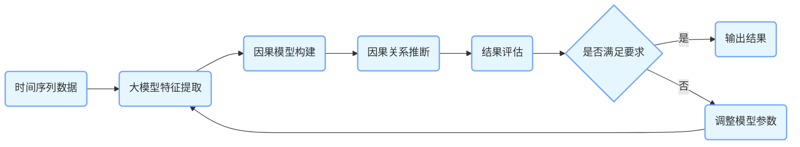

# 大模型在时序因果推理中的性能评估

> 关键词：大模型、时序因果推理、性能评估、因果分析、时间序列

> 摘要：本文聚焦于大模型在时序因果推理中的性能评估。首先介绍了相关背景，包括研究目的、预期读者等内容。接着阐述了核心概念与联系，详细解释了大模型和时序因果推理的原理及架构，并给出相应的示意图和流程图。然后深入讲解了核心算法原理和具体操作步骤，通过Python源代码进行了详细阐述。同时，给出了数学模型和公式并进行详细讲解与举例说明。在项目实战部分，展示了代码实际案例并进行详细解释。还探讨了大模型在时序因果推理中的实际应用场景，推荐了相关的工具和资源。最后总结了未来发展趋势与挑战，提供了常见问题解答和扩展阅读参考资料，旨在为全面评估大模型在时序因果推理中的性能提供全面而深入的参考。

## 1. 背景介绍 
### 1.1 目的和范围
在当今的数据分析和人工智能领域，时序因果推理是一个重要且具有挑战性的任务。它旨在从时间序列数据中识别出变量之间的因果关系，这对于许多领域，如金融、医疗、气象等都具有关键意义。大模型，如基于深度学习的神经网络模型，由于其强大的表示能力，在处理复杂的时间序列数据方面显示出巨大的潜力。然而，目前缺乏系统的方法来评估大模型在时序因果推理中的性能。本文章的目的就是填补这一空白，提供一套全面的性能评估框架和方法，以帮助研究人员和从业者更好地理解和应用大模型进行时序因果推理。

本文章的范围涵盖了从理论基础到实际应用的多个方面。我们将深入探讨大模型和时序因果推理的核心概念，介绍相关的算法原理和数学模型，通过项目实战展示如何在实际中进行性能评估，并讨论其在不同领域的应用场景。同时，还会推荐相关的学习资源、开发工具和研究论文，为读者提供一个全面的知识体系。

### 1.2 预期读者
本文预期读者包括但不限于以下几类人群：
- **研究人员**：从事人工智能、机器学习、统计学等领域研究的学者，他们对大模型和时序因果推理的理论和方法感兴趣，希望通过本文深入了解性能评估的相关知识，为进一步的研究提供参考。
- **从业者**：在金融、医疗、工业等行业从事数据分析和决策支持的专业人员，他们希望利用大模型进行时序因果推理来解决实际问题，需要了解如何评估模型性能以选择合适的模型和方法。
- **学生**：学习计算机科学、数据科学、统计学等相关专业的学生，他们希望通过本文系统地学习大模型和时序因果推理的知识，为未来的学习和研究打下基础。

### 1.3 文档结构概述
本文的结构如下：
- **核心概念与联系**：介绍大模型和时序因果推理的基本概念，阐述它们之间的联系，并通过示意图和流程图展示其原理和架构。
- **核心算法原理 & 具体操作步骤**：详细讲解用于时序因果推理的核心算法原理，并给出具体的操作步骤，同时使用Python源代码进行说明。
- **数学模型和公式 & 详细讲解 & 举例说明**：给出时序因果推理的数学模型和公式，进行详细讲解，并通过具体例子说明其应用。
- **项目实战：代码实际案例和详细解释说明**：展示一个实际的项目案例，包括开发环境搭建、源代码实现和代码解读。
- **实际应用场景**：讨论大模型在时序因果推理中的实际应用场景，如金融市场预测、医疗健康监测等。
- **工具和资源推荐**：推荐相关的学习资源、开发工具和研究论文，帮助读者进一步深入学习和研究。
- **总结：未来发展趋势与挑战**：总结大模型在时序因果推理中的发展趋势，分析面临的挑战。
- **附录：常见问题与解答**：解答读者在学习和应用过程中可能遇到的常见问题。
- **扩展阅读 & 参考资料**：提供相关的扩展阅读材料和参考资料，方便读者进一步探索。

### 1.4 术语表
#### 1.4.1 核心术语定义
- **大模型**：通常指具有大量参数和强大计算能力的深度学习模型，如Transformer架构的语言模型等。这些模型能够学习到复杂的数据模式和特征表示。
- **时序因果推理**：从时间序列数据中推断变量之间因果关系的过程。因果关系表示一个变量的变化会导致另一个变量的变化，而不仅仅是相关性。
- **性能评估**：对模型在特定任务上的表现进行量化评价的过程，包括准确性、召回率、F1值等指标。

#### 1.4.2 相关概念解释
- **时间序列**：按时间顺序排列的一组数据点，通常用于描述随时间变化的现象，如股票价格、气温等。
- **因果关系**：一种哲学和科学概念，表示一个事件（原因）的发生会导致另一个事件（结果）的发生。在数据分析中，因果关系的识别是一个重要且具有挑战性的任务。
- **相关性**：两个变量之间的统计关联程度，但相关性并不意味着因果关系。例如，冰淇淋销量和犯罪率可能具有相关性，但它们之间并没有因果关系。

#### 1.4.3 缩略词列表
- **ML**：Machine Learning，机器学习
- **DL**：Deep Learning，深度学习
- **ROC**：Receiver Operating Characteristic，受试者工作特征曲线
- **AUC**：Area Under the Curve，曲线下面积

## 2. 核心概念与联系 

### 2.1 大模型的原理和架构
大模型通常基于深度学习技术，以神经网络为基础构建。以Transformer架构为例，它由多个编码器和解码器层组成。编码器负责对输入数据进行特征提取和表示学习，解码器则根据编码器的输出生成预测结果。

Transformer架构的核心是自注意力机制（Self-Attention），它允许模型在处理输入序列时，动态地关注序列中的不同部分。自注意力机制通过计算输入序列中每个位置与其他位置之间的相关性，来确定每个位置的表示。

以下是Transformer架构的文本示意图：

```plaintext
输入序列 -> 嵌入层 -> 编码器层（多个） -> 解码器层（多个） -> 输出序列
```

### 2.2 时序因果推理的原理和架构
时序因果推理的目标是从时间序列数据中识别出变量之间的因果关系。常见的方法包括基于图模型的方法、基于结构方程模型的方法等。

基于图模型的方法通过构建因果图来表示变量之间的因果关系。因果图中的节点表示变量，边表示因果关系。在时序因果推理中，还需要考虑时间顺序的因素。

以下是时序因果推理的文本示意图：

```plaintext
时间序列数据 -> 特征提取 -> 因果模型构建 -> 因果关系推断 -> 结果评估
```

### 2.3 大模型与时序因果推理的联系
大模型可以为时序因果推理提供强大的特征提取和表示学习能力。通过大模型学习到的特征可以更准确地捕捉时间序列数据中的模式和信息，从而提高因果关系推断的准确性。

同时，时序因果推理的任务也可以为大模型的训练和优化提供指导。因果关系的先验知识可以被融入到模型的训练过程中，使模型学习到更有意义的特征表示。

### 2.4 Mermaid流程图



这个流程图展示了大模型在时序因果推理中的工作流程。首先，时间序列数据被输入到大模型中进行特征提取。然后，基于提取的特征构建因果模型，并进行因果关系推断。推断结果经过评估后，如果满足要求则输出结果，否则调整模型参数并重新进行特征提取和因果推断。

## 3. 核心算法原理 & 具体操作步骤 

### 3.1 基于Granger因果检验的算法原理
Granger因果检验是一种常用的时序因果推理方法，其基本思想是如果一个变量 $X$ 的过去值能够帮助预测另一个变量 $Y$ 的未来值，那么就认为 $X$ 是 $Y$ 的Granger原因。

具体来说，假设我们有两个时间序列 $X_t$ 和 $Y_t$，我们可以建立以下两个回归模型：

- 模型1：$Y_t = \sum_{i = 1}^{p} \alpha_i Y_{t - i} + \epsilon_{1t}$
- 模型2：$Y_t = \sum_{i = 1}^{p} \alpha_i Y_{t - i} + \sum_{j = 1}^{q} \beta_j X_{t - j} + \epsilon_{2t}$

其中，$p$ 和 $q$ 分别是 $Y$ 和 $X$ 的滞后阶数，$\epsilon_{1t}$ 和 $\epsilon_{2t}$ 是误差项。

Granger因果检验的零假设是 $H_0: \beta_1 = \beta_2 = \cdots = \beta_q = 0$，即 $X$ 不是 $Y$ 的Granger原因。我们可以通过比较模型1和模型2的残差平方和来进行检验。如果模型2的残差平方和显著小于模型1的残差平方和，那么就拒绝零假设，认为 $X$ 是 $Y$ 的Granger原因。

### 3.2 具体操作步骤
1. **数据预处理**：对时间序列数据进行清洗、归一化等预处理操作，以提高模型的性能。
2. **确定滞后阶数**：可以使用信息准则（如AIC、BIC）来确定 $p$ 和 $q$ 的值。
3. **建立回归模型**：根据确定的滞后阶数，建立模型1和模型2。
4. **进行Granger因果检验**：计算模型1和模型2的残差平方和，并进行F检验，以判断是否拒绝零假设。

### 3.3 Python源代码实现

```python
import numpy as np
import pandas as pd
from statsmodels.tsa.stattools import grangercausalitytests

# 生成示例时间序列数据
np.random.seed(0)
n = 100
x = np.random.randn(n)
y = np.zeros(n)
for i in range(2, n):
    y[i] = 0.5 * y[i - 1] + 0.3 * x[i - 1] + np.random.randn()

# 将数据转换为DataFrame格式
data = pd.DataFrame({'x': x, 'y': y})

# 进行Granger因果检验
maxlag = 4
test = 'ssr_chi2test'
results = grangercausalitytests(data[['y', 'x']], maxlag=maxlag, verbose=False)

# 输出检验结果
for lag in range(1, maxlag + 1):
    p_value = results[lag][0][test][1]
    print(f'Lag {lag}: p-value = {p_value}')
    if p_value < 0.05:
        print(f'At lag {lag}, x Granger causes y.')
    else:
        print(f'At lag {lag}, x does not Granger cause y.')
```

### 3.4 代码解释
1. **数据生成**：使用 `numpy` 生成两个时间序列 $x$ 和 $y$，其中 $y$ 的值依赖于 $x$ 的过去值。
2. **数据转换**：将生成的时间序列数据转换为 `pandas` 的 `DataFrame` 格式，方便后续处理。
3. **Granger因果检验**：使用 `statsmodels` 库中的 `grangercausalitytests` 函数进行Granger因果检验，设置最大滞后阶数为4。
4. **结果输出**：遍历不同的滞后阶数，输出每个滞后阶数下的p值，并根据p值判断 $x$ 是否是 $y$ 的Granger原因。

## 4. 数学模型和公式 & 详细讲解 & 举例说明 

### 4.1 因果图模型的数学表示
因果图模型可以用有向无环图（DAG）来表示。设 $V = \{X_1, X_2, \cdots, X_n\}$ 是一组变量，$E$ 是一组有向边。一个因果图 $G = (V, E)$ 表示了变量之间的因果关系。

对于每个变量 $X_i$，其条件概率分布可以表示为：

$$P(X_i | \text{Pa}(X_i))$$

其中，$\text{Pa}(X_i)$ 表示 $X_i$ 的父节点集合，即直接导致 $X_i$ 变化的变量集合。

### 4.2 结构方程模型的数学表示
结构方程模型（SEM）是另一种常用的因果模型。它可以表示为一组方程：

$$X_i = f_i(\text{Pa}(X_i), \epsilon_i)$$

其中，$f_i$ 是一个函数，表示 $X_i$ 与父节点 $\text{Pa}(X_i)$ 之间的关系，$\epsilon_i$ 是误差项。

### 4.3 因果效应的度量
在因果推理中，一个重要的任务是度量因果效应。常见的因果效应度量包括平均处理效应（ATE）：

$$\text{ATE} = E[Y(1) - Y(0)]$$

其中，$Y(1)$ 和 $Y(0)$ 分别表示处理组和对照组的结果变量。

### 4.4 详细讲解
因果图模型通过有向无环图直观地表示了变量之间的因果关系。每个变量的条件概率分布描述了其在给定父节点的情况下的取值概率。结构方程模型则更具体地描述了变量之间的函数关系。

因果效应的度量可以帮助我们评估某个处理（原因）对结果变量的影响程度。平均处理效应是一种常用的度量方法，它表示处理组和对照组结果变量的平均差异。

### 4.5 举例说明
假设我们要研究吸烟（$X$）对肺癌（$Y$）的因果效应。我们可以构建一个因果图模型，其中吸烟是肺癌的原因，可能还有其他因素（如遗传因素 $Z$）作为混杂变量。

在结构方程模型中，我们可以表示为：

$$Y = f(X, Z, \epsilon)$$

其中，$f$ 是一个函数，表示肺癌的发生与吸烟、遗传因素以及其他未观察到的因素有关。

为了度量吸烟对肺癌的因果效应，我们可以计算平均处理效应：

$$\text{ATE} = E[Y(\text{smoke}) - Y(\text{non - smoke})]$$

通过收集吸烟和不吸烟人群的肺癌发病率数据，我们可以估计出平均处理效应的值，从而评估吸烟对肺癌的影响程度。

## 5. 项目实战：代码实际案例和详细解释说明 

### 5.1  开发环境搭建
#### 5.1.1 安装Python
首先，确保你已经安装了Python。建议使用Python 3.7及以上版本。你可以从Python官方网站（https://www.python.org/downloads/） 下载并安装Python。

#### 5.1.2 安装必要的库
在项目中，我们将使用以下几个重要的库：
- `numpy`：用于数值计算。
- `pandas`：用于数据处理和分析。
- `statsmodels`：用于统计建模和因果分析。
- `matplotlib`：用于数据可视化。

可以使用以下命令来安装这些库：

```bash
pip install numpy pandas statsmodels matplotlib
```

### 5.2  源代码详细实现和代码解读
#### 5.2.1 数据准备
我们将使用一个模拟的时间序列数据集来演示大模型在时序因果推理中的性能评估。以下是生成模拟数据的代码：

```python
import numpy as np
import pandas as pd

# 生成模拟时间序列数据
np.random.seed(42)
n = 200
t = np.arange(n)
x = np.sin(0.1 * t) + np.random.randn(n) * 0.1
y = 0.5 * np.sin(0.1 * (t - 2)) + np.random.randn(n) * 0.1

# 创建DataFrame
data = pd.DataFrame({'x': x, 'y': y})
```

**代码解读**：
- `np.random.seed(42)`：设置随机种子，确保结果可复现。
- `n = 200`：定义数据的长度。
- `t = np.arange(n)`：生成时间序列。
- `x` 和 `y`：生成两个时间序列，其中 `y` 是 `x` 延迟2个时间步后的版本，并添加了一些噪声。
- `data = pd.DataFrame({'x': x, 'y': y})`：将生成的时间序列数据转换为 `pandas` 的 `DataFrame` 格式。

#### 5.2.2 进行Granger因果检验
```python
from statsmodels.tsa.stattools import grangercausalitytests

# 进行Granger因果检验
maxlag = 5
test = 'ssr_chi2test'
results = grangercausalitytests(data[['y', 'x']], maxlag=maxlag, verbose=False)

# 输出检验结果
for lag in range(1, maxlag + 1):
    p_value = results[lag][0][test][1]
    print(f'Lag {lag}: p-value = {p_value}')
    if p_value < 0.05:
        print(f'At lag {lag}, x Granger causes y.')
    else:
        print(f'At lag {lag}, x does not Granger cause y.')
```

**代码解读**：
- `grangercausalitytests`：`statsmodels` 库中的函数，用于进行Granger因果检验。
- `maxlag = 5`：设置最大滞后阶数为5。
- `test = 'ssr_chi2test'`：选择检验方法为卡方检验。
- `results = grangercausalitytests(data[['y', 'x']], maxlag=maxlag, verbose=False)`：进行Granger因果检验，并将结果存储在 `results` 中。
- 遍历不同的滞后阶数，输出每个滞后阶数下的p值，并根据p值判断 `x` 是否是 `y` 的Granger原因。

#### 5.2.3 数据可视化
```python
import matplotlib.pyplot as plt

# 绘制时间序列图
plt.figure(figsize=(10, 6))
plt.plot(t, x, label='x')
plt.plot(t, y, label='y')
plt.xlabel('Time')
plt.ylabel('Value')
plt.title('Time Series Data')
plt.legend()
plt.show()
```

**代码解读**：
- `plt.figure(figsize=(10, 6))`：创建一个大小为10x6的图形窗口。
- `plt.plot(t, x, label='x')` 和 `plt.plot(t, y, label='y')`：分别绘制 `x` 和 `y` 的时间序列图。
- `plt.xlabel('Time')` 和 `plt.ylabel('Value')`：设置坐标轴标签。
- `plt.title('Time Series Data')`：设置图形标题。
- `plt.legend()`：显示图例。
- `plt.show()`：显示图形。

### 5.3  代码解读与分析
#### 5.3.1 数据生成
通过模拟生成的时间序列数据，我们可以控制数据的特征和因果关系，方便进行实验和验证。在这个例子中，我们生成了两个具有因果关系的时间序列，其中 `y` 是 `x` 延迟2个时间步后的版本。

#### 5.3.2 Granger因果检验
Granger因果检验是一种常用的时序因果推理方法，通过比较不同滞后阶数下的回归模型的残差平方和来判断因果关系。在这个例子中，我们设置最大滞后阶数为5，并选择卡方检验作为检验方法。

#### 5.3.3 数据可视化
数据可视化可以帮助我们直观地观察时间序列数据的特征和趋势。通过绘制 `x` 和 `y` 的时间序列图，我们可以更清楚地看到它们之间的关系。

## 6. 实际应用场景 

### 6.1 金融市场预测
在金融市场中，大模型在时序因果推理的性能评估具有重要的应用价值。例如，股票价格的波动受到多种因素的影响，如宏观经济指标、公司财务数据、市场情绪等。通过对这些时间序列数据进行因果推理，可以识别出影响股票价格的关键因素，从而进行更准确的预测。

大模型可以学习到复杂的市场模式和特征，通过性能评估可以选择最合适的模型和参数，提高预测的准确性。例如，使用基于Transformer架构的大模型对股票价格时间序列数据进行特征提取和因果关系推断，通过评估模型在历史数据上的表现，优化模型的结构和参数，从而提高对未来股票价格走势的预测能力。

### 6.2 医疗健康监测
在医疗健康领域，时序因果推理可以帮助医生更好地理解疾病的发展过程和影响因素。例如，通过对患者的生命体征数据（如心率、血压、体温等）、疾病诊断数据和治疗数据进行因果推理，可以识别出导致疾病发生和发展的关键因素，为个性化治疗提供依据。

大模型可以处理复杂的医疗数据，通过性能评估可以确保模型的可靠性和有效性。例如，使用深度学习模型对患者的电子病历数据进行分析，推断疾病的因果关系，通过评估模型在不同数据集上的性能，选择最佳的模型和特征组合，提高疾病预测和诊断的准确性。

### 6.3 工业生产优化
在工业生产中，大模型在时序因果推理的性能评估可以用于优化生产过程和提高生产效率。例如，通过对生产设备的运行数据（如温度、压力、转速等）、原材料质量数据和生产产量数据进行因果推理，可以识别出影响生产质量和效率的关键因素，从而进行针对性的优化。

大模型可以学习到生产过程中的复杂模式和关系，通过性能评估可以选择最合适的模型和策略。例如，使用循环神经网络（RNN）对工业生产过程中的时间序列数据进行建模，推断设备故障的因果关系，通过评估模型在不同工况下的性能，优化设备的维护计划和生产调度，提高生产的稳定性和效率。

### 6.4 气象预测
气象预测是一个典型的时序问题，大模型在时序因果推理的性能评估可以提高气象预测的准确性。例如，通过对气象观测数据（如温度、湿度、气压、风速等）、卫星云图数据和大气环流数据进行因果推理，可以识别出影响天气变化的关键因素，从而进行更准确的天气预报。

大模型可以处理大规模的气象数据，通过性能评估可以选择最佳的模型和参数。例如，使用卷积神经网络（CNN）对气象卫星云图数据进行特征提取和因果关系推断，通过评估模型在不同地区和季节的性能，优化模型的结构和参数，提高气象预测的精度和可靠性。

## 7. 工具和资源推荐
### 7.1 学习资源推荐
#### 7.1.1 书籍推荐
- 《因果推断：基础与前沿》：这本书全面介绍了因果推断的基本概念、方法和应用，是学习因果推理的经典教材。
- 《深度学习》：由Ian Goodfellow、Yoshua Bengio和Aaron Courville合著，是深度学习领域的权威著作，介绍了深度学习的基本原理、算法和应用。
- 《时间序列分析及其应用：R语言示例》：这本书详细介绍了时间序列分析的方法和技术，并通过R语言示例进行了演示，适合初学者学习时间序列分析。

#### 7.1.2 在线课程
- Coursera上的“因果推断”课程：由知名学者授课，系统地介绍了因果推断的理论和方法，通过案例分析和实践项目帮助学生掌握因果推理的技能。
- edX上的“深度学习基础”课程：提供了深度学习的基础知识和实践经验，包括神经网络、卷积神经网络、循环神经网络等内容。
- Udemy上的“时间序列分析与预测”课程：通过实际案例和代码演示，介绍了时间序列分析和预测的方法和技巧。

#### 7.1.3 技术博客和网站
- Medium：是一个技术博客平台，有许多关于人工智能、机器学习和因果推理的优秀文章，可以帮助读者了解最新的研究成果和技术趋势。
- arXiv：是一个预印本服务器，提供了大量的学术论文，包括因果推理、深度学习等领域的最新研究成果。
- Towards Data Science：是一个专注于数据科学和机器学习的网站，有许多高质量的技术文章和教程，适合数据科学爱好者学习和交流。

### 7.2 开发工具框架推荐
#### 7.2.1 IDE和编辑器
- PyCharm：是一款功能强大的Python集成开发环境（IDE），提供了代码编辑、调试、版本控制等功能，适合Python开发。
- Jupyter Notebook：是一个交互式的开发环境，支持多种编程语言，适合数据探索、实验和可视化。
- Visual Studio Code：是一个轻量级的代码编辑器，支持多种编程语言和插件，具有丰富的扩展功能。

#### 7.2.2 调试和性能分析工具
- Py-Spy：是一个Python性能分析工具，可以帮助开发者找出Python代码中的性能瓶颈。
- cProfile：是Python标准库中的一个性能分析模块，可以统计函数的调用次数和执行时间。
- TensorBoard：是TensorFlow的可视化工具，可以帮助开发者可视化模型的训练过程和性能指标。

#### 7.2.3 相关框架和库
- TensorFlow：是一个开源的机器学习框架，提供了丰富的工具和库，支持深度学习模型的开发和训练。
- PyTorch：是另一个流行的深度学习框架，具有动态图的特点，适合快速开发和实验。
- scikit-learn：是一个简单易用的机器学习库，提供了各种机器学习算法和工具，适合初学者和快速原型开发。

### 7.3 相关论文著作推荐
#### 7.3.1 经典论文
- “Causality: Models, Reasoning, and Inference” by Judea Pearl：这篇论文是因果推理领域的经典之作，介绍了因果图模型和结构方程模型的基本理论和方法。
- “Deep Residual Learning for Image Recognition” by Kaiming He et al.：这篇论文提出了残差网络（ResNet）的概念，在深度学习领域具有重要的影响。
- “Attention Is All You Need” by Ashish Vaswani et al.：这篇论文提出了Transformer架构，是自然语言处理和深度学习领域的重要突破。

#### 7.3.2 最新研究成果
- 关注顶级学术会议（如NeurIPS、ICML、ACL等）上的最新论文，了解大模型和时序因果推理领域的最新研究进展。
- 查阅相关学术期刊（如Journal of Machine Learning Research、Artificial Intelligence等）上的研究论文，获取最新的研究成果。

#### 7.3.3 应用案例分析
- 一些知名公司（如Google、Facebook、Microsoft等）会发布关于大模型和时序因果推理的应用案例，可以参考这些案例了解实际应用中的经验和方法。
- 行业报告和白皮书也会介绍一些大模型在不同领域的应用案例和效果评估，可以从中获取实际应用的参考。

## 8. 总结：未来发展趋势与挑战
### 8.1 未来发展趋势
#### 8.1.1 融合多模态数据
未来，大模型在时序因果推理中将越来越多地融合多模态数据，如文本、图像、音频等。通过综合利用不同模态的数据，可以更全面地捕捉因果关系，提高推理的准确性和可靠性。例如，在医疗领域，结合患者的病历文本、医学影像和生命体征数据进行因果推理，可以更准确地诊断疾病和制定治疗方案。

#### 8.1.2 可解释性增强
随着大模型的复杂性不断增加，其可解释性问题也越来越受到关注。未来的研究将致力于提高大模型在时序因果推理中的可解释性，使模型的决策过程更加透明和可理解。例如，通过开发新的解释方法和技术，能够清晰地展示模型是如何从时间序列数据中推断出因果关系的，为用户提供更有价值的信息。

#### 8.1.3 跨领域应用拓展
大模型在时序因果推理的应用将不断拓展到更多的领域，如交通、能源、教育等。不同领域的数据具有不同的特点和挑战，通过将大模型和时序因果推理技术应用到这些领域，可以解决实际问题，提高决策的科学性和有效性。例如，在交通领域，通过对交通流量数据进行因果推理，优化交通信号控制，缓解交通拥堵。

#### 8.1.4 与强化学习结合
将大模型在时序因果推理与强化学习相结合是未来的一个重要发展方向。强化学习可以通过与环境的交互来学习最优策略，而时序因果推理可以提供因果关系的先验知识，帮助强化学习算法更快地收敛和做出更合理的决策。例如，在机器人控制领域，结合时序因果推理和强化学习，使机器人能够更好地理解环境中的因果关系，提高其自主决策能力。

### 8.2 挑战
#### 8.2.1 数据质量和规模
大模型需要大量高质量的数据来进行训练和学习。然而，在实际应用中，获取大规模、高质量的时间序列数据往往是一个挑战。数据可能存在噪声、缺失值、偏差等问题，这些都会影响模型的性能和因果推理的准确性。因此，如何有效地处理和利用不完美的数据是一个需要解决的问题。

#### 8.2.2 计算资源需求
大模型通常具有大量的参数和复杂的结构，训练和推理过程需要消耗大量的计算资源。这对于一些资源有限的场景来说是一个挑战。如何优化模型结构和算法，降低计算资源的需求，提高模型的效率和可扩展性是一个亟待解决的问题。

#### 8.2.3 因果关系的复杂性
现实世界中的因果关系往往非常复杂，存在多种因素的相互作用和反馈机制。大模型在处理复杂因果关系时可能会遇到困难，难以准确地识别和表示因果关系。如何开发更有效的算法和模型，能够处理复杂的因果关系，是未来研究的一个重要方向。

#### 8.2.4 伦理和法律问题
大模型在时序因果推理的应用可能会涉及到伦理和法律问题，如隐私保护、数据安全、责任界定等。例如，在医疗领域，使用患者的个人数据进行因果推理时，需要确保数据的隐私和安全。如何制定相应的伦理和法律规范，保障大模型在时序因果推理中的合理应用，是一个需要关注的问题。

## 9. 附录：常见问题与解答
### 9.1 什么是大模型？
大模型通常指具有大量参数和强大计算能力的深度学习模型。这些模型能够学习到复杂的数据模式和特征表示，在自然语言处理、计算机视觉等领域取得了显著的成果。常见的大模型包括基于Transformer架构的语言模型，如GPT、BERT等。

### 9.2 时序因果推理和传统因果推理有什么区别？
时序因果推理是在时间序列数据的背景下进行因果关系推断，需要考虑时间顺序的因素。而传统因果推理可以处理更一般的数据类型，不一定涉及时间维度。时序因果推理更关注变量之间的动态因果关系，即一个变量的变化如何随时间影响另一个变量的变化。

### 9.3 如何评估大模型在时序因果推理中的性能？
可以使用多种指标来评估大模型在时序因果推理中的性能，如准确性、召回率、F1值、ROC曲线下面积（AUC）等。还可以通过对比不同模型在相同数据集上的表现，或者使用交叉验证等方法来评估模型的泛化能力。此外，还可以考虑模型的可解释性、计算效率等方面的因素。

### 9.4 大模型在时序因果推理中一定会比传统模型表现更好吗？
不一定。虽然大模型具有强大的表示能力，但在某些情况下，传统模型可能更适合特定的任务和数据集。大模型通常需要大量的数据和计算资源来进行训练，对于小规模数据集或资源有限的场景，传统模型可能更具优势。此外，大模型的可解释性相对较差，在一些对可解释性要求较高的应用中，传统模型可能更受欢迎。

### 9.5 如何选择合适的大模型进行时序因果推理？
选择合适的大模型进行时序因果推理需要考虑多个因素，如数据的特点、任务的要求、计算资源的限制等。可以通过实验和比较不同模型在数据集上的性能来选择最佳的模型。此外，还可以参考相关的研究文献和实践经验，了解不同模型在时序因果推理中的优缺点。

## 10. 扩展阅读 & 参考资料
### 10.1 扩展阅读
- Pearl, J. (2009). Causality: Models, Reasoning, and Inference. Cambridge University Press.
- Goodfellow, I., Bengio, Y., & Courville, A. (2016). Deep Learning. MIT Press.
- Hyndman, R. J., & Athanasopoulos, G. (2018). Forecasting: Principles and Practice. OTexts.

### 10.2 参考资料
- Python官方文档：https://docs.python.org/3/
- statsmodels官方文档：https://www.statsmodels.org/stable/index.html
- TensorFlow官方文档：https://www.tensorflow.org/api_docs
- PyTorch官方文档：https://pytorch.org/docs/stable/index.html
- scikit-learn官方文档：https://scikit-learn.org/stable/documentation.html