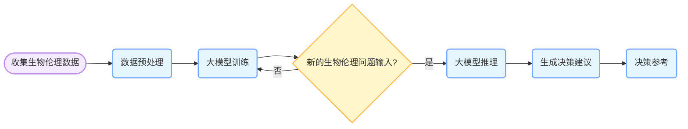

# 大模型在生物伦理推理中的决策分析

> 关键词：大模型、生物伦理推理、决策分析、人工智能、伦理决策、模型评估、生物医学

> 摘要：本文聚焦于大模型在生物伦理推理中的决策分析。随着人工智能技术的快速发展，大模型在生物医学等多个领域的应用日益广泛，其在生物伦理推理中的作用也备受关注。文章首先介绍了相关背景，包括目的、预期读者等内容。接着阐述了大模型与生物伦理推理的核心概念及联系，深入讲解了核心算法原理和具体操作步骤，并给出了相应的数学模型和公式。通过项目实战展示了大模型在生物伦理推理决策分析中的代码实现和详细解释。探讨了其实际应用场景，推荐了相关的工具和资源。最后总结了未来发展趋势与挑战，还提供了常见问题解答和扩展阅读参考资料，旨在为大模型在生物伦理推理决策分析方面的研究和应用提供全面的技术指导和理论支持。

## 1. 背景介绍 
### 1.1 目的和范围
本研究的主要目的在于深入探讨大模型在生物伦理推理中进行决策分析的机制、效果和应用潜力。随着生物医学技术的飞速发展，如基因编辑、干细胞研究等，带来了一系列复杂的伦理问题。大模型作为一种强大的人工智能工具，具备处理复杂信息和进行推理的能力，有望为生物伦理推理提供新的方法和思路。本研究的范围涵盖了大模型的基本原理、生物伦理推理的相关理论、大模型在生物伦理决策分析中的具体应用案例，以及对其未来发展的展望等方面。

### 1.2 预期读者
本文预期读者包括人工智能领域的研究人员、生物伦理学家、生物医学科研工作者、医疗从业者以及对人工智能和生物伦理交叉领域感兴趣的学生和爱好者。对于人工智能研究人员，本文可提供在生物伦理领域应用大模型的新视角和技术思路；生物伦理学家可以从中了解大模型在伦理推理中的潜力和局限性，为伦理决策提供新的依据；生物医学科研工作者和医疗从业者能够借助大模型的决策分析，更好地处理科研和临床实践中的伦理问题；学生和爱好者则可以通过本文初步了解这一前沿交叉领域的知识。

### 1.3 文档结构概述
本文将按照以下结构进行阐述：首先介绍大模型与生物伦理推理的背景知识，包括目的、读者群体和文档结构等；接着深入讲解大模型与生物伦理推理的核心概念及其联系，通过文本示意图和 Mermaid 流程图进行直观展示；然后详细阐述核心算法原理和具体操作步骤，结合 Python 源代码进行说明；再给出相关的数学模型和公式，并通过举例进行详细讲解；通过项目实战展示大模型在生物伦理推理决策分析中的代码实现和详细解释；探讨大模型在生物伦理推理中的实际应用场景；推荐相关的学习资源、开发工具框架和论文著作；总结未来发展趋势与挑战；提供常见问题解答和扩展阅读参考资料。

### 1.4 术语表
#### 1.4.1 核心术语定义
- **大模型**：指具有大量参数和强大计算能力的人工智能模型，通常基于深度学习架构，如Transformer架构，能够处理大规模的数据和复杂的任务。
- **生物伦理推理**：指在生物医学领域中，依据伦理原则和价值观，对各种生物医学行为、决策和研究进行道德判断和推理的过程。
- **决策分析**：指通过对各种决策方案的评估和比较，综合考虑各种因素，选择最优决策方案的过程。

#### 1.4.2 相关概念解释
- **人工智能**：是一门研究如何使计算机系统能够模拟人类智能的学科，包括机器学习、深度学习、自然语言处理等多个领域。
- **伦理原则**：是生物伦理推理的基础，常见的伦理原则包括尊重自主、不伤害、有益和公正等。
- **模型评估**：指对大模型的性能、准确性、可靠性等方面进行评估的过程，常用的评估指标包括准确率、召回率、F1值等。

#### 1.4.3 缩略词列表
- **AI**：Artificial Intelligence，人工智能
- **ML**：Machine Learning，机器学习
- **DL**：Deep Learning，深度学习
- **NLP**：Natural Language Processing，自然语言处理

## 2. 核心概念与联系 

### 核心概念原理
#### 大模型原理
大模型通常基于深度学习技术，特别是Transformer架构。Transformer架构由编码器和解码器组成，通过自注意力机制能够捕捉输入序列中不同位置之间的依赖关系。以GPT（Generative Pretrained Transformer）系列模型为例，其通过在大规模文本数据上进行无监督预训练，学习到语言的模式和规律。在预训练阶段，模型通过预测下一个单词来学习语言的概率分布。然后在微调阶段，针对具体任务进行有监督训练，使其能够适应不同的应用场景。

#### 生物伦理推理原理
生物伦理推理基于一系列伦理原则和价值观，这些原则为判断生物医学行为的道德性提供了标准。例如，尊重自主原则要求尊重患者的自主决策权，不伤害原则要求避免对患者造成不必要的伤害。在进行生物伦理推理时，需要考虑具体的情境和相关的事实信息，结合伦理原则进行综合判断。例如，在基因编辑技术的应用中，需要考虑其对人类健康、遗传多样性和社会伦理的影响，依据伦理原则来判断是否应该进行基因编辑操作。

### 架构的文本示意图
大模型在生物伦理推理中的决策分析架构可以描述如下：首先，收集生物伦理相关的数据，包括伦理案例、伦理原则文本等。这些数据经过预处理后，输入到大模型中进行训练。训练好的大模型可以对新的生物伦理问题进行推理和决策分析。在推理过程中，大模型会结合伦理原则和已知的案例信息，生成决策建议。这些决策建议可以为生物医学从业者和伦理学家提供参考，帮助他们做出更加合理的决策。

### Mermaid 流程图


## 3. 核心算法原理 & 具体操作步骤 

### 核心算法原理
大模型在生物伦理推理中的决策分析主要基于自然语言处理技术。以BERT（Bidirectional Encoder Representations from Transformers）模型为例，其核心思想是通过双向的Transformer编码器对输入的文本进行编码，学习到文本的上下文表示。在生物伦理推理中，将伦理问题和相关的伦理原则文本作为输入，BERT模型会输出每个输入词的语义表示。然后，通过一个分类器或回归器对这些表示进行处理，生成决策结果。

### 具体操作步骤

#### 步骤1：数据收集与预处理
收集生物伦理相关的数据，包括伦理案例、伦理原则文本等。对数据进行清洗，去除噪声和无关信息。将文本数据进行分词处理，将其转换为适合模型输入的格式。

```python
import re
import nltk
from nltk.tokenize import word_tokenize
nltk.download('punkt')

def preprocess_text(text):
    # 去除特殊字符
    text = re.sub(r'[^\w\s]', '', text)
    # 转换为小写
    text = text.lower()
    # 分词
    tokens = word_tokenize(text)
    return tokens
```

#### 步骤2：模型训练
使用预训练的BERT模型，并在生物伦理数据集上进行微调。在微调过程中，定义损失函数和优化器，通过反向传播算法更新模型的参数。

```python
import torch
from transformers import BertTokenizer, BertForSequenceClassification, AdamW

# 加载预训练的BERT模型和分词器
tokenizer = BertTokenizer.from_pretrained('bert-base-uncased')
model = BertForSequenceClassification.from_pretrained('bert-base-uncased', num_labels=2)

# 定义优化器
optimizer = AdamW(model.parameters(), lr=2e-5)

# 训练数据
train_texts = ["This is a bioethical case 1", "This is a bioethical case 2"]
train_labels = [0, 1]

# 数据编码
train_encodings = tokenizer(train_texts, truncation=True, padding=True)
train_dataset = torch.utils.data.TensorDataset(
    torch.tensor(train_encodings['input_ids']),
    torch.tensor(train_encodings['attention_mask']),
    torch.tensor(train_labels)
)

# 训练循环
train_loader = torch.utils.data.DataLoader(train_dataset, batch_size=16, shuffle=True)
device = torch.device('cuda') if torch.cuda.is_available() else torch.device('cpu')
model.to(device)
model.train()
for epoch in range(3):
    for batch in train_loader:
        batch = tuple(t.to(device) for t in batch)
        input_ids, attention_mask, labels = batch
        optimizer.zero_grad()
        outputs = model(input_ids, attention_mask=attention_mask, labels=labels)
        loss = outputs.loss
        loss.backward()
        optimizer.step()
```

#### 步骤3：模型推理
使用训练好的模型对新的生物伦理问题进行推理，生成决策结果。

```python
# 新的生物伦理问题
new_text = "This is a new bioethical case"
new_encoding = tokenizer(new_text, truncation=True, padding=True, return_tensors='pt')
new_encoding = new_encoding.to(device)

# 推理
model.eval()
with torch.no_grad():
    outputs = model(**new_encoding)
    logits = outputs.logits
    predicted_class_id = torch.argmax(logits, dim=-1).item()
    print("Predicted class:", predicted_class_id)
```

## 4. 数学模型和公式 & 详细讲解 & 举例说明 

### 数学模型
在大模型的训练过程中，通常使用交叉熵损失函数来衡量模型预测结果与真实标签之间的差异。交叉熵损失函数的公式如下：

$$L = -\frac{1}{N}\sum_{i=1}^{N}\sum_{j=1}^{C}y_{ij}\log(p_{ij})$$

其中，$N$ 是样本数量，$C$ 是类别数量，$y_{ij}$ 是第 $i$ 个样本属于第 $j$ 类的真实标签（$y_{ij} \in \{0, 1\}$），$p_{ij}$ 是模型预测第 $i$ 个样本属于第 $j$ 类的概率。

### 详细讲解
交叉熵损失函数的目的是最小化模型预测结果与真实标签之间的差异。当模型的预测结果与真实标签完全一致时，交叉熵损失为 0；当预测结果与真实标签差异较大时，交叉熵损失会增大。在训练过程中，通过反向传播算法计算损失函数对模型参数的梯度，并使用优化器更新模型的参数，使得损失函数逐渐减小，从而提高模型的性能。

### 举例说明
假设我们有一个二分类问题，即生物伦理问题的决策结果为“可行”和“不可行”。有 3 个样本，真实标签分别为 $[1, 0, 1]$，模型的预测概率分别为 $[0.8, 0.2, 0.3, 0.7, 0.9, 0.1]$（每个样本对应两个概率，分别表示属于“可行”和“不可行”的概率）。则交叉熵损失的计算过程如下：

对于第一个样本，真实标签 $y_1 = [0, 1]$，预测概率 $p_1 = [0.2, 0.8]$，则该样本的交叉熵损失为：

$$L_1 = -(0\times\log(0.2) + 1\times\log(0.8)) \approx 0.223$$

对于第二个样本，真实标签 $y_2 = [1, 0]$，预测概率 $p_2 = [0.3, 0.7]$，则该样本的交叉熵损失为：

$$L_2 = -(1\times\log(0.3) + 0\times\log(0.7)) \approx 1.204$$

对于第三个样本，真实标签 $y_3 = [0, 1]$，预测概率 $p_3 = [0.1, 0.9]$，则该样本的交叉熵损失为：

$$L_3 = -(0\times\log(0.1) + 1\times\log(0.9)) \approx 0.105$$

总的交叉熵损失为：

$$L = \frac{1}{3}(L_1 + L_2 + L_3) \approx \frac{1}{3}(0.223 + 1.204 + 0.105) \approx 0.511$$

## 5. 项目实战：代码实际案例和详细解释说明 

### 5.1  开发环境搭建
#### 安装 Python
首先，确保你已经安装了 Python 3.6 或更高版本。可以从 Python 官方网站（https://www.python.org/downloads/） 下载并安装适合你操作系统的 Python 版本。

#### 安装必要的库
使用 pip 安装以下必要的库：
```bash
pip install torch transformers nltk
```

### 5.2  源代码详细实现和代码解读
以下是一个完整的大模型在生物伦理推理中决策分析的代码示例：

```python
import re
import nltk
from nltk.tokenize import word_tokenize
import torch
from transformers import BertTokenizer, BertForSequenceClassification, AdamW

nltk.download('punkt')

# 数据预处理函数
def preprocess_text(text):
    # 去除特殊字符
    text = re.sub(r'[^\w\s]', '', text)
    # 转换为小写
    text = text.lower()
    # 分词
    tokens = word_tokenize(text)
    return tokens

# 加载预训练的BERT模型和分词器
tokenizer = BertTokenizer.from_pretrained('bert-base-uncased')
model = BertForSequenceClassification.from_pretrained('bert-base-uncased', num_labels=2)

# 定义优化器
optimizer = AdamW(model.parameters(), lr=2e-5)

# 训练数据
train_texts = ["This is a bioethical case 1 with a positive outcome", "This is a bioethical case 2 with a negative outcome"]
train_labels = [1, 0]

# 数据编码
train_encodings = tokenizer(train_texts, truncation=True, padding=True)
train_dataset = torch.utils.data.TensorDataset(
    torch.tensor(train_encodings['input_ids']),
    torch.tensor(train_encodings['attention_mask']),
    torch.tensor(train_labels)
)

# 训练循环
train_loader = torch.utils.data.DataLoader(train_dataset, batch_size=16, shuffle=True)
device = torch.device('cuda') if torch.cuda.is_available() else torch.device('cpu')
model.to(device)
model.train()
for epoch in range(3):
    for batch in train_loader:
        batch = tuple(t.to(device) for t in batch)
        input_ids, attention_mask, labels = batch
        optimizer.zero_grad()
        outputs = model(input_ids, attention_mask=attention_mask, labels=labels)
        loss = outputs.loss
        loss.backward()
        optimizer.step()

# 新的生物伦理问题
new_text = "This is a new bioethical case that seems to have a positive outcome"
new_encoding = tokenizer(new_text, truncation=True, padding=True, return_tensors='pt')
new_encoding = new_encoding.to(device)

# 推理
model.eval()
with torch.no_grad():
    outputs = model(**new_encoding)
    logits = outputs.logits
    predicted_class_id = torch.argmax(logits, dim=-1).item()
    print("Predicted class:", predicted_class_id)
```

### 5.3  代码解读与分析
- **数据预处理**：`preprocess_text` 函数用于对输入的文本进行预处理，包括去除特殊字符、转换为小写和分词操作，以提高模型的训练效果。
- **模型加载**：使用 `BertTokenizer` 和 `BertForSequenceClassification` 从预训练的 BERT 模型中加载分词器和分类模型。
- **数据编码**：使用分词器对训练数据进行编码，将文本转换为模型可以接受的输入格式。
- **训练循环**：通过多个 epoch 对模型进行训练，在每个 epoch 中，将数据分批输入到模型中，计算损失并更新模型的参数。
- **推理**：使用训练好的模型对新的生物伦理问题进行推理，输出预测的类别。

## 6. 实际应用场景 
### 临床医疗决策
在临床医疗中，大模型可以帮助医生进行伦理决策。例如，在面对复杂的治疗方案选择时，大模型可以综合考虑患者的病情、治疗风险、患者的意愿等因素，结合伦理原则进行分析，为医生提供决策建议。比如，对于一位患有晚期癌症的患者，是否进行积极的手术治疗可能涉及到患者的生活质量、预后效果和医疗资源的合理分配等伦理问题。大模型可以通过分析大量的临床案例和伦理原则，为医生提供关于手术治疗的伦理决策参考。

### 生物医学研究伦理审查
在生物医学研究中，大模型可以辅助伦理审查委员会进行伦理审查。例如，在基因编辑研究、干细胞研究等前沿领域，研究方案的伦理合理性需要进行严格审查。大模型可以对研究方案进行分析，评估其是否符合伦理原则，如是否尊重受试者的自主权益、是否会对人类健康和社会造成潜在风险等。通过大模型的辅助审查，可以提高伦理审查的效率和准确性。

### 公共卫生政策制定
在公共卫生政策制定过程中，大模型可以考虑到不同政策方案的伦理影响。例如，在制定疫苗接种政策时，需要考虑到公平性、效益性和自主性等伦理原则。大模型可以分析不同的疫苗接种策略对不同人群的影响，评估其伦理合理性，为政策制定者提供决策支持，确保公共卫生政策既符合科学规律，又符合伦理要求。

## 7. 工具和资源推荐
### 7.1 学习资源推荐
#### 7.1.1 书籍推荐
- 《人工智能伦理》：全面介绍了人工智能领域的伦理问题和挑战，包括大模型在伦理推理中的应用等内容。
- 《生物伦理学》：系统阐述了生物伦理的基本理论和原则，为理解生物伦理推理提供了理论基础。
- 《深度学习》：详细介绍了深度学习的基本原理和算法，包括大模型的架构和训练方法。

#### 7.1.2 在线课程
- Coursera 上的“人工智能伦理”课程：由知名学者授课，深入探讨了人工智能伦理的各个方面。
- edX 上的“生物医学伦理”课程：提供了生物医学伦理的系统学习资源。
- 吴恩达的“深度学习专项课程”：帮助学习者掌握深度学习的核心知识和技能。

#### 7.1.3 技术博客和网站
- arXiv.org：提供了大量的学术论文，包括大模型和生物伦理相关的最新研究成果。
- Medium 上的人工智能和生物伦理相关博客：有许多专家和学者分享的前沿观点和技术文章。
- 中国生物医学工程学会伦理分会官网：提供了生物医学伦理的最新动态和相关政策解读。

### 7.2 开发工具框架推荐
#### 7.2.1 IDE和编辑器
- PyCharm：功能强大的 Python 集成开发环境，提供了代码编辑、调试、版本控制等功能。
- Jupyter Notebook：交互式的开发环境，适合进行数据探索和模型训练的实验。

#### 7.2.2 调试和性能分析工具
- TensorBoard：用于可视化深度学习模型的训练过程和性能指标，帮助开发者优化模型。
- PyTorch Profiler：可以对 PyTorch 模型的性能进行分析，找出性能瓶颈。

#### 7.2.3 相关框架和库
- Transformers：Hugging Face 开发的深度学习框架，提供了丰富的预训练模型和工具，方便进行自然语言处理任务。
- scikit-learn：用于机器学习的工具库，提供了多种分类、回归和聚类算法，可用于模型评估和比较。

### 7.3 相关论文著作推荐
#### 7.3.1 经典论文
- “Attention Is All You Need”：介绍了 Transformer 架构，为大模型的发展奠定了基础。
- “BERT: Pre-training of Deep Bidirectional Transformers for Language Understanding”：提出了 BERT 模型，推动了自然语言处理技术的发展。

#### 7.3.2 最新研究成果
- 关于大模型在生物伦理推理中应用的最新研究论文，可在 arXiv.org 等学术平台上搜索。

#### 7.3.3 应用案例分析
- 一些关于大模型在临床医疗、生物医学研究等领域应用的案例分析论文，可帮助读者了解实际应用中的经验和挑战。

## 8. 总结：未来发展趋势与挑战
### 未来发展趋势
- **模型性能提升**：随着计算能力的不断提高和算法的不断优化，大模型的性能将不断提升，能够更准确地进行生物伦理推理和决策分析。
- **多模态融合**：将文本、图像、视频等多模态数据融合到生物伦理推理中，使大模型能够获取更全面的信息，提高决策的准确性和可靠性。
- **跨领域合作**：大模型在生物伦理推理中的应用将促进人工智能、生物医学、伦理学等多个领域的跨领域合作，推动相关学科的共同发展。

### 挑战
- **伦理问题本身的复杂性**：生物伦理问题往往涉及到多个利益相关者和复杂的价值观冲突，大模型如何准确理解和处理这些复杂的伦理问题是一个挑战。
- **数据隐私和安全**：生物伦理数据通常包含敏感信息，如患者的个人信息和医疗记录等。如何保证数据的隐私和安全，防止数据泄露和滥用，是大模型应用中需要解决的重要问题。
- **模型的可解释性**：大模型通常是黑盒模型，其决策过程难以理解和解释。在生物伦理推理中，需要模型能够提供可解释的决策依据，以便用户能够理解和信任模型的决策结果。

## 9. 附录：常见问题与解答
### 问题1：大模型在生物伦理推理中的决策结果是否可靠？
大模型的决策结果受到多种因素的影响，如数据质量、模型架构和训练方法等。在实际应用中，需要对模型进行严格的评估和验证，结合专家的意见和伦理原则进行综合判断，以提高决策结果的可靠性。

### 问题2：如何保证大模型在生物伦理推理中不违反伦理原则？
在模型训练过程中，需要将伦理原则融入到数据和算法中。例如，在数据标注过程中，确保标注结果符合伦理原则；在算法设计中，引入伦理约束机制，使模型的决策结果能够遵循伦理原则。同时，需要对模型进行伦理审查和监督，及时发现和纠正可能出现的伦理问题。

### 问题3：大模型在生物伦理推理中的应用是否会取代人类的决策？
大模型在生物伦理推理中的应用是为了辅助人类进行决策，而不是取代人类。生物伦理问题往往涉及到复杂的价值观和情感因素，人类的判断力和决策能力仍然是不可替代的。大模型可以提供决策建议和参考，帮助人类做出更加合理和科学的决策。

## 10. 扩展阅读 & 参考资料
### 扩展阅读
- 《人工智能时代的伦理挑战与应对》
- 《生物医学研究中的伦理问题与实践》

### 参考资料
- 相关的学术论文和研究报告
- 人工智能和生物伦理领域的官方网站和技术博客
- 相关的书籍和教材