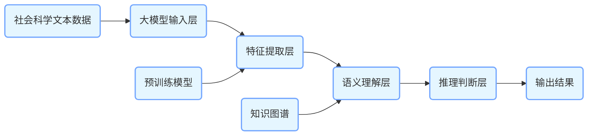

# 大模型在社会科学定性推理中的表现分析与优化

> 关键词：大模型、社会科学、定性推理、表现分析、优化策略

> 摘要：本文聚焦于大模型在社会科学定性推理中的应用，深入分析其表现，并探讨相应的优化策略。首先介绍了研究的背景、目的、预期读者和文档结构，明确相关术语。接着阐述大模型在社会科学定性推理中的核心概念与联系，给出原理和架构的示意图及流程图。详细讲解核心算法原理，结合 Python 代码说明具体操作步骤，并引入数学模型和公式进行深入剖析。通过项目实战案例，展示代码实现与解读。分析大模型在社会科学领域的实际应用场景，推荐相关学习资源、开发工具和论文著作。最后总结大模型在社会科学定性推理中的未来发展趋势与挑战，提供常见问题解答和扩展阅读参考资料。

## 1. 背景介绍 
### 1.1 目的和范围
社会科学研究涉及对人类社会现象的理解、解释和预测，定性推理在其中起着关键作用。随着人工智能技术的发展，大模型如 GPT 系列等在自然语言处理方面取得了显著成就，其在社会科学定性推理中的应用潜力逐渐受到关注。本研究的目的是全面分析大模型在社会科学定性推理中的表现，找出存在的问题，并提出针对性的优化策略。研究范围涵盖了大模型在社会科学不同领域（如社会学、政治学、经济学等）定性推理中的应用，包括文本分析、概念理解、因果推断等方面。

### 1.2 预期读者
本文预期读者包括社会科学研究人员、人工智能领域的研究者和开发者、对大模型应用感兴趣的学者以及相关行业的从业者。社会科学研究人员可以通过本文了解大模型在定性推理中的优势和不足，为其研究提供新的方法和工具；人工智能领域的人员可以从中获取在社会科学领域应用大模型的实践经验和优化思路；其他读者可以对大模型在社会科学中的应用有更深入的认识。

### 1.3 文档结构概述
本文将按照以下结构展开：首先介绍大模型在社会科学定性推理中的核心概念与联系，通过示意图和流程图直观展示；接着详细阐述核心算法原理和具体操作步骤，结合 Python 代码进行说明；引入数学模型和公式，对大模型的推理过程进行深入分析；通过项目实战案例，展示代码实现和解读；分析大模型在社会科学中的实际应用场景；推荐相关的学习资源、开发工具和论文著作；最后总结大模型在社会科学定性推理中的未来发展趋势与挑战，提供常见问题解答和扩展阅读参考资料。

### 1.4 术语表
#### 1.4.1 核心术语定义
- **大模型**：指具有大量参数和强大计算能力的人工智能模型，如 GPT - 3、BERT 等，能够处理复杂的自然语言任务。
- **社会科学定性推理**：在社会科学研究中，基于非量化的数据（如文本、案例等）进行逻辑分析和推理，以理解和解释社会现象的过程。
- **表现分析**：对大模型在社会科学定性推理任务中的准确性、可靠性、效率等方面进行评估和分析。
- **优化策略**：为提高大模型在社会科学定性推理中的表现而采取的一系列改进措施。

#### 1.4.2 相关概念解释
- **自然语言处理（NLP）**：人工智能的一个分支，旨在让计算机理解和处理人类语言，大模型在 NLP 中得到了广泛应用。
- **知识图谱**：一种以图形结构表示知识的方式，将实体和它们之间的关系进行可视化展示，可辅助大模型进行推理。
- **迁移学习**：将在一个任务上训练好的模型应用到另一个相关任务上的技术，可提高模型的训练效率和性能。

#### 1.4.3 缩略词列表
- **GPT**：Generative Pretrained Transformer，生成式预训练变换器
- **BERT**：Bidirectional Encoder Representations from Transformers，基于变换器的双向编码器表示
- **NLP**：Natural Language Processing，自然语言处理

## 2. 核心概念与联系 
### 核心概念原理
大模型在社会科学定性推理中的核心原理基于其对自然语言的理解和生成能力。大模型通过大规模的文本数据进行预训练，学习到语言的语法、语义和上下文信息。在社会科学定性推理中，大模型接收社会科学相关的文本数据（如研究报告、访谈记录等），对其进行分析和理解，提取关键信息和概念，并根据这些信息进行推理和判断。

例如，在社会学研究中，大模型可以分析关于社会群体行为的文本，识别出不同群体的特征和行为模式，进而推断出社会现象背后的原因和机制。大模型的推理过程是基于其内部的神经网络结构，通过多层的神经元计算和信息传递，将输入的文本数据转化为有意义的输出。

### 架构示意图
以下是大模型在社会科学定性推理中的架构示意图：



### 流程解释
1. **输入层**：接收社会科学相关的文本数据，如研究报告、访谈记录等。
2. **特征提取层**：对输入的文本数据进行特征提取，将文本转化为计算机能够处理的向量表示。预训练模型的知识在这一层被应用，帮助提取更有意义的特征。
3. **语义理解层**：对提取的特征进行语义分析，理解文本的含义和上下文信息。知识图谱在这一层提供额外的背景知识，辅助模型进行语义理解。
4. **推理判断层**：根据语义理解的结果，进行推理和判断，得出关于社会科学现象的结论。
5. **输出层**：将推理结果以自然语言的形式输出，供研究人员使用。

## 3. 核心算法原理 & 具体操作步骤 
### 核心算法原理
大模型在社会科学定性推理中常用的算法是基于 Transformer 架构的。Transformer 架构由编码器和解码器组成，其中编码器负责对输入的文本进行特征提取和表示，解码器负责生成输出文本。

Transformer 的核心是多头注意力机制（Multi - Head Attention），它允许模型在处理输入序列时，关注不同位置的信息。多头注意力机制的计算公式如下：

$$
\text{Attention}(Q, K, V) = \text{softmax}\left(\frac{QK^T}{\sqrt{d_k}}\right)V
$$

其中，$Q$ 是查询矩阵，$K$ 是键矩阵，$V$ 是值矩阵，$d_k$ 是键向量的维度。多头注意力机制将多个注意力头的结果拼接起来，得到最终的输出。

### Python 代码实现
以下是一个使用 PyTorch 实现简单多头注意力机制的示例代码：

```python
import torch
import torch.nn as nn

class MultiHeadAttention(nn.Module):
    def __init__(self, embed_dim, num_heads):
        super(MultiHeadAttention, self).__init__()
        self.embed_dim = embed_dim
        self.num_heads = num_heads
        self.head_dim = embed_dim // num_heads

        assert (
            self.head_dim * num_heads == embed_dim
        ), "Embedding dimension needs to be divisible by number of heads"

        self.qkv_proj = nn.Linear(embed_dim, 3 * embed_dim)
        self.out_proj = nn.Linear(embed_dim, embed_dim)

    def forward(self, x):
        batch_size, seq_length, embed_dim = x.size()
        qkv = self.qkv_proj(x)

        q, k, v = qkv.chunk(3, dim=-1)

        q = q.reshape(batch_size, seq_length, self.num_heads, self.head_dim).permute(0, 2, 1, 3)
        k = k.reshape(batch_size, seq_length, self.num_heads, self.head_dim).permute(0, 2, 1, 3)
        v = v.reshape(batch_size, seq_length, self.num_heads, self.head_dim).permute(0, 2, 1, 3)

        attn_scores = torch.matmul(q, k.transpose(-2, -1)) / (self.head_dim ** 0.5)
        attn_probs = torch.softmax(attn_scores, dim=-1)
        attn_output = torch.matmul(attn_probs, v)

        attn_output = attn_output.permute(0, 2, 1, 3).reshape(batch_size, seq_length, embed_dim)
        output = self.out_proj(attn_output)
        return output
```

### 具体操作步骤
1. **数据预处理**：将社会科学文本数据进行清洗、分词等预处理操作，将文本转化为适合模型输入的格式。
2. **模型初始化**：初始化大模型，设置模型的参数，如嵌入维度、头数等。
3. **训练模型**：使用预处理后的数据对模型进行训练，调整模型的参数，使其能够更好地进行定性推理。
4. **推理过程**：将待推理的文本数据输入到训练好的模型中，得到推理结果。

## 4. 数学模型和公式 & 详细讲解 & 举例说明 
### 数学模型和公式
在大模型的推理过程中，除了多头注意力机制的公式外，还涉及到损失函数和优化算法。常用的损失函数是交叉熵损失函数（Cross - Entropy Loss），其公式如下：

$$
L = -\frac{1}{N}\sum_{i=1}^{N}\sum_{j=1}^{C}y_{ij}\log(p_{ij})
$$

其中，$N$ 是样本数量，$C$ 是类别数量，$y_{ij}$ 是第 $i$ 个样本的真实标签的第 $j$ 个分量，$p_{ij}$ 是模型预测的第 $i$ 个样本属于第 $j$ 个类别的概率。

优化算法常用的是随机梯度下降（SGD）及其变种，如 Adam 优化器。Adam 优化器的更新公式如下：

$$
m_t = \beta_1m_{t - 1}+(1 - \beta_1)g_t
$$
$$
v_t = \beta_2v_{t - 1}+(1 - \beta_2)g_t^2
$$
$$
\hat{m}_t=\frac{m_t}{1 - \beta_1^t}
$$
$$
\hat{v}_t=\frac{v_t}{1 - \beta_2^t}
$$
$$
\theta_{t+1}=\theta_t-\frac{\alpha}{\sqrt{\hat{v}_t}+\epsilon}\hat{m}_t
$$

其中，$m_t$ 和 $v_t$ 分别是梯度的一阶矩估计和二阶矩估计，$\beta_1$ 和 $\beta_2$ 是衰减率，$g_t$ 是当前的梯度，$\alpha$ 是学习率，$\epsilon$ 是一个小的常数，$\theta_t$ 是模型的参数。

### 详细讲解
交叉熵损失函数用于衡量模型预测结果与真实标签之间的差异。在大模型的训练过程中，我们的目标是最小化损失函数，使得模型的预测结果尽可能接近真实标签。

Adam 优化器结合了动量和自适应学习率的思想，通过对梯度的一阶矩和二阶矩进行估计，自适应地调整每个参数的学习率，从而提高模型的训练效率和稳定性。

### 举例说明
假设我们有一个文本分类任务，将社会科学文本分为政治、经济、社会三个类别。我们使用大模型进行训练，输入文本经过模型处理后输出每个类别的概率。假设某个样本的真实标签是政治类别（$y = [1, 0, 0]$），模型预测的概率是 $p = [0.8, 0.1, 0.1]$。则该样本的交叉熵损失为：

$$
L = - (1\times\log(0.8)+0\times\log(0.1)+0\times\log(0.1))\approx0.223
$$

在训练过程中，我们使用 Adam 优化器不断更新模型的参数，使得损失函数逐渐减小，模型的分类性能不断提高。

## 5. 项目实战：代码实际案例和详细解释说明 
### 5.1  开发环境搭建
- **操作系统**：推荐使用 Linux 系统，如 Ubuntu 18.04 及以上版本。
- **编程语言**：Python 3.7 及以上版本。
- **深度学习框架**：PyTorch 1.7 及以上版本。
- **其他库**：`transformers`、`numpy`、`pandas` 等。

可以使用以下命令安装所需的库：

```bash
pip install torch transformers numpy pandas
```

### 5.2  源代码详细实现和代码解读
以下是一个使用 `transformers` 库进行社会科学文本分类的示例代码：

```python
import torch
from torch.utils.data import Dataset, DataLoader
from transformers import BertTokenizer, BertForSequenceClassification, AdamW
import pandas as pd
from sklearn.model_selection import train_test_split

# 定义数据集类
class SocialScienceDataset(Dataset):
    def __init__(self, texts, labels, tokenizer, max_length):
        self.texts = texts
        self.labels = labels
        self.tokenizer = tokenizer
        self.max_length = max_length

    def __len__(self):
        return len(self.texts)

    def __getitem__(self, idx):
        text = str(self.texts[idx])
        label = self.labels[idx]
        encoding = self.tokenizer.encode_plus(
            text,
            add_special_tokens=True,
            max_length=self.max_length,
            padding='max_length',
            truncation=True,
            return_tensors='pt'
        )
        return {
            'input_ids': encoding['input_ids'].flatten(),
            'attention_mask': encoding['attention_mask'].flatten(),
            'labels': torch.tensor(label, dtype=torch.long)
        }

# 加载数据
data = pd.read_csv('social_science_data.csv')
texts = data['text'].tolist()
labels = data['label'].tolist()

# 划分训练集和测试集
train_texts, test_texts, train_labels, test_labels = train_test_split(texts, labels, test_size=0.2, random_state=42)

# 初始化分词器和模型
tokenizer = BertTokenizer.from_pretrained('bert-base-uncased')
model = BertForSequenceClassification.from_pretrained('bert-base-uncased', num_labels=3)

# 创建数据集和数据加载器
train_dataset = SocialScienceDataset(train_texts, train_labels, tokenizer, max_length=128)
test_dataset = SocialScienceDataset(test_texts, test_labels, tokenizer, max_length=128)

train_dataloader = DataLoader(train_dataset, batch_size=16, shuffle=True)
test_dataloader = DataLoader(test_dataset, batch_size=16, shuffle=False)

# 定义优化器和损失函数
optimizer = AdamW(model.parameters(), lr=2e-5)
criterion = torch.nn.CrossEntropyLoss()

# 训练模型
device = torch.device('cuda' if torch.cuda.is_available() else 'cpu')
model.to(device)

for epoch in range(3):
    model.train()
    total_loss = 0
    for batch in train_dataloader:
        input_ids = batch['input_ids'].to(device)
        attention_mask = batch['attention_mask'].to(device)
        labels = batch['labels'].to(device)

        optimizer.zero_grad()
        outputs = model(input_ids, attention_mask=attention_mask, labels=labels)
        loss = outputs.loss
        total_loss += loss.item()

        loss.backward()
        optimizer.step()

    print(f'Epoch {epoch + 1}, Loss: {total_loss / len(train_dataloader)}')

# 评估模型
model.eval()
correct = 0
total = 0
with torch.no_grad():
    for batch in test_dataloader:
        input_ids = batch['input_ids'].to(device)
        attention_mask = batch['attention_mask'].to(device)
        labels = batch['labels'].to(device)

        outputs = model(input_ids, attention_mask=attention_mask)
        logits = outputs.logits
        predictions = torch.argmax(logits, dim=1)
        total += labels.size(0)
        correct += (predictions == labels).sum().item()

print(f'Accuracy: {correct / total}')
```

### 5.3  代码解读与分析
- **数据集类 `SocialScienceDataset`**：继承自 `torch.utils.data.Dataset`，用于封装社会科学文本数据。在 `__getitem__` 方法中，使用 `BertTokenizer` 对文本进行分词和编码，将其转化为适合模型输入的格式。
- **数据加载**：使用 `pandas` 读取 CSV 文件中的数据，将文本和标签分别存储在 `texts` 和 `labels` 列表中。使用 `sklearn.model_selection.train_test_split` 方法将数据划分为训练集和测试集。
- **模型初始化**：使用 `BertTokenizer` 和 `BertForSequenceClassification` 初始化分词器和模型。`BertForSequenceClassification` 是基于 BERT 预训练模型的文本分类模型。
- **训练过程**：使用 `AdamW` 优化器和交叉熵损失函数对模型进行训练。在每个 epoch 中，遍历训练数据加载器，计算损失并进行反向传播更新模型参数。
- **评估过程**：在训练完成后，使用测试数据加载器对模型进行评估，计算模型的准确率。

## 6. 实际应用场景 
### 社会学研究
在社会学研究中，大模型可以用于分析社交媒体数据、访谈记录等文本信息，识别社会群体的特征和行为模式。例如，通过分析社交媒体上关于某个社会事件的讨论，大模型可以识别出不同观点的群体，并分析这些群体的特征和行为差异。此外，大模型还可以用于预测社会现象的发展趋势，为社会政策的制定提供参考。

### 政治学研究
在政治学研究中，大模型可以用于分析政治演讲、政策文件等文本信息，理解政治观点和政策意图。例如，通过分析政治家的演讲内容，大模型可以识别出其政治立场和政策主张，并对不同政治家的观点进行比较和分析。此外，大模型还可以用于预测选举结果、分析政治事件的影响等。

### 经济学研究
在经济学研究中，大模型可以用于分析经济新闻、市场报告等文本信息，预测经济趋势和市场变化。例如，通过分析经济新闻中的关键词和情感倾向，大模型可以预测股票市场的走势、分析消费者信心指数等。此外，大模型还可以用于分析企业的财务报告和商业策略，为投资决策提供参考。

## 7. 工具和资源推荐
### 7.1 学习资源推荐
#### 7.1.1 书籍推荐
- 《深度学习》（Deep Learning）：由 Ian Goodfellow、Yoshua Bengio 和 Aaron Courville 合著，是深度学习领域的经典教材，介绍了深度学习的基本概念、算法和应用。
- 《自然语言处理入门》：作者何晗，适合初学者，系统介绍了自然语言处理的基本技术和方法。
- 《社会科学研究方法》：提供了社会科学研究的基本方法和理论，帮助读者了解社会科学研究的流程和方法。

#### 7.1.2 在线课程
- Coursera 上的“Deep Learning Specialization”：由 Andrew Ng 教授授课，是深度学习领域的经典在线课程，涵盖了深度学习的各个方面。
- edX 上的“Natural Language Processing with Deep Learning”：介绍了自然语言处理中深度学习的应用，包括文本分类、机器翻译等任务。
- 中国大学 MOOC 上的“社会科学研究方法”：国内高校开设的课程，结合中国的社会科学研究实际，介绍了社会科学研究的方法和技巧。

#### 7.1.3 技术博客和网站
- Medium 上的 Towards Data Science：发布了大量关于人工智能、机器学习和数据科学的技术文章，包括大模型的最新研究成果和应用案例。
- Hugging Face 的博客：提供了关于自然语言处理模型和技术的详细介绍和教程，特别是关于 `transformers` 库的使用。
- 社会科学研究网：提供了社会科学研究的最新动态、研究方法和案例分析，对社会科学研究人员有很大的帮助。

### 7.2 开发工具框架推荐
#### 7.2.1 IDE和编辑器
- PyCharm：功能强大的 Python 集成开发环境，提供了代码编辑、调试、版本控制等功能，适合大规模项目的开发。
- Jupyter Notebook：交互式的编程环境，适合进行数据分析和模型实验，方便代码的展示和分享。
- Visual Studio Code：轻量级的代码编辑器，支持多种编程语言和插件，可用于快速开发和调试。

#### 7.2.2 调试和性能分析工具
- TensorBoard：用于可视化深度学习模型的训练过程和性能指标，帮助开发者监控模型的训练情况和调试模型。
- PyTorch Profiler：PyTorch 提供的性能分析工具，可用于分析模型的运行时间和内存使用情况，优化模型的性能。
- NVIDIA Nsight Systems：用于分析 GPU 加速程序的性能，可帮助开发者找出程序中的性能瓶颈。

#### 7.2.3 相关框架和库
- `transformers`：Hugging Face 开发的自然语言处理库，提供了大量预训练的模型和工具，方便开发者进行自然语言处理任务的开发。
- `Scikit - learn`：用于机器学习的 Python 库，提供了各种机器学习算法和工具，可用于数据预处理、模型选择和评估等任务。
- `NLTK`：自然语言工具包，提供了丰富的自然语言处理工具和语料库，适合初学者学习和实践。

### 7.3 相关论文著作推荐
#### 7.3.1 经典论文
- “Attention Is All You Need”：提出了 Transformer 架构，是自然语言处理领域的重要论文，为大模型的发展奠定了基础。
- “BERT: Pre - training of Deep Bidirectional Transformers for Language Understanding”：介绍了 BERT 模型的预训练方法和应用，推动了自然语言处理领域的发展。
- “Generative Pretrained Transformer 3 (GPT - 3): Language Models Are Few - Shot Learners”：介绍了 GPT - 3 模型的特点和应用，展示了大模型在自然语言处理任务中的强大能力。

#### 7.3.2 最新研究成果
- 关注 arXiv 上关于大模型和社会科学研究的最新论文，了解该领域的最新研究动态和技术进展。
- 参加相关的学术会议，如 ACL（Association for Computational Linguistics）、EMNLP（Conference on Empirical Methods in Natural Language Processing）等，获取最新的研究成果和交流经验。

#### 7.3.3 应用案例分析
- 阅读相关的研究报告和案例分析，了解大模型在社会科学领域的实际应用情况和效果。例如，一些咨询公司和研究机构发布的关于大模型在市场调研、政策分析等方面的应用案例。

## 8. 总结：未来发展趋势与挑战
### 未来发展趋势
- **模型性能提升**：随着计算能力的不断提高和算法的不断优化，大模型的性能将不断提升，能够处理更复杂的社会科学定性推理任务。
- **跨领域融合**：大模型将与社会科学的其他领域（如统计学、心理学等）进行更深入的融合，为社会科学研究提供更全面的方法和工具。
- **个性化应用**：根据不同用户的需求和场景，大模型将提供个性化的服务和解决方案，提高社会科学研究的效率和质量。

### 挑战
- **数据质量和隐私问题**：社会科学数据往往具有多样性和复杂性，数据质量参差不齐。同时，数据隐私和安全问题也是大模型应用中的重要挑战，需要采取有效的措施来保护数据的隐私和安全。
- **可解释性问题**：大模型的决策过程往往是黑盒的，难以解释其推理结果。在社会科学研究中，可解释性是非常重要的，需要开发新的方法和技术来提高大模型的可解释性。
- **伦理和社会影响问题**：大模型的应用可能会带来一些伦理和社会问题，如算法偏见、就业影响等。需要建立相应的伦理准则和监管机制，确保大模型的应用符合社会的利益和价值观。

## 9. 附录：常见问题与解答
### 问题 1：大模型在社会科学定性推理中的准确性如何保证？
解答：可以通过以下方法保证大模型在社会科学定性推理中的准确性：
- 使用高质量的训练数据，确保数据的准确性和代表性。
- 进行模型的评估和调优，选择合适的评估指标（如准确率、召回率等），通过交叉验证等方法调整模型的参数。
- 引入外部知识，如知识图谱，辅助模型进行推理，提高推理的准确性。

### 问题 2：如何解决大模型在社会科学定性推理中的可解释性问题？
解答：可以采用以下方法解决可解释性问题：
- 开发可解释的模型架构，如基于规则的模型或具有可视化结构的模型。
- 使用解释性技术，如特征重要性分析、注意力可视化等，帮助理解模型的决策过程。
- 结合人类专家的知识和判断，对模型的推理结果进行解释和验证。

### 问题 3：大模型在社会科学定性推理中的计算资源需求如何？
解答：大模型通常需要大量的计算资源，包括 GPU 等硬件设备。在进行模型训练和推理时，需要考虑计算资源的成本和可用性。可以采用以下方法降低计算资源需求：
- 使用预训练模型，避免从头开始训练模型。
- 进行模型压缩和量化，减少模型的参数数量和计算量。
- 采用分布式训练和推理技术，提高计算效率。

## 10. 扩展阅读 & 参考资料
### 扩展阅读
- 《社会科学中的人工智能方法》：深入探讨了人工智能在社会科学研究中的应用方法和案例。
- 《人工智能伦理》：介绍了人工智能应用中的伦理问题和应对策略，对大模型在社会科学中的应用具有重要的参考价值。

### 参考资料
- Hugging Face 官方文档：https://huggingface.co/docs
- PyTorch 官方文档：https://pytorch.org/docs/stable/index.html
- 相关学术期刊：如《Journal of Artificial Intelligence Research》、《Journal of Computational Social Science》等。