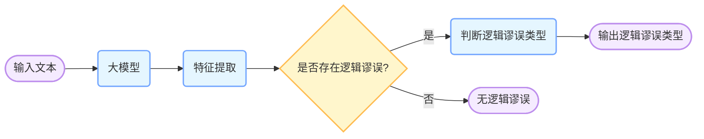

# 大模型在逻辑谬误识别中的能力分析

> 关键词：大模型、逻辑谬误识别、自然语言处理、能力分析、机器学习算法

> 摘要：本文聚焦于大模型在逻辑谬误识别领域的能力表现。通过深入剖析大模型的核心概念、算法原理，结合数学模型和具体的项目实战案例，全面探讨了大模型在逻辑谬误识别中的优势与不足。同时，介绍了相关的实际应用场景、工具和资源，并对大模型在该领域的未来发展趋势与挑战进行了总结。旨在为研究人员和开发者提供全面且深入的参考，以推动大模型在逻辑谬误识别中的进一步发展。

## 1. 背景介绍 
### 1.1 目的和范围
在当今信息爆炸的时代，大量的文本信息充斥着各种逻辑谬误。准确识别这些逻辑谬误对于保证信息的准确性、合理性以及在诸多领域如学术研究、法律辩论、新闻传播等具有至关重要的意义。本文章的目的在于深入分析大模型在逻辑谬误识别方面的能力，探讨其优势和局限性，为相关领域的研究和应用提供有价值的参考。

研究范围涵盖了常见的大模型，如GPT系列、BERT等，对它们在不同类型逻辑谬误（如诉诸情感、滑坡谬误、稻草人谬误等）识别中的表现进行评估和分析。同时，结合实际的应用场景，探讨大模型在逻辑谬误识别中的可行性和有效性。

### 1.2 预期读者
本文的预期读者包括自然语言处理领域的研究人员、开发者，对人工智能技术在逻辑推理和谬误识别方面感兴趣的学者，以及需要进行文本逻辑分析的专业人士，如律师、记者、编辑等。通过阅读本文，读者可以了解大模型在逻辑谬误识别中的技术原理、应用现状和未来发展趋势，为其研究和实践提供参考。

### 1.3 文档结构概述
本文将按照以下结构进行组织：
1. **核心概念与联系**：介绍大模型和逻辑谬误识别的核心概念，以及它们之间的联系，并通过文本示意图和Mermaid流程图进行直观展示。
2. **核心算法原理 & 具体操作步骤**：详细讲解大模型用于逻辑谬误识别的核心算法原理，并给出Python源代码进行具体说明。
3. **数学模型和公式 & 详细讲解 & 举例说明**：介绍相关的数学模型和公式，对其进行详细讲解，并通过具体的例子进行说明。
4. **项目实战：代码实际案例和详细解释说明**：提供一个实际的项目案例，包括开发环境搭建、源代码实现和代码解读。
5. **实际应用场景**：探讨大模型在逻辑谬误识别中的实际应用场景。
6. **工具和资源推荐**：推荐相关的学习资源、开发工具框架和论文著作。
7. **总结：未来发展趋势与挑战**：总结大模型在逻辑谬误识别中的发展趋势和面临的挑战。
8. **附录：常见问题与解答**：解答读者在阅读过程中可能遇到的常见问题。
9. **扩展阅读 & 参考资料**：提供相关的扩展阅读材料和参考资料。

### 1.4 术语表
#### 1.4.1 核心术语定义
- **大模型**：指具有大量参数和强大计算能力的深度学习模型，如GPT（Generative Pretrained Transformer）、BERT（Bidirectional Encoder Representations from Transformers）等。这些模型通过在大规模数据集上进行预训练，学习到丰富的语言知识和模式。
- **逻辑谬误识别**：指通过计算机技术对文本中的逻辑错误进行检测和分类的过程。逻辑谬误包括各种不合理的推理和论证方式，如诉诸权威、虚假因果等。
- **自然语言处理（NLP）**：是计算机科学与语言学的交叉领域，旨在让计算机理解和处理人类语言。大模型在逻辑谬误识别中的应用属于自然语言处理的范畴。

#### 1.4.2 相关概念解释
- **预训练**：大模型在大规模无监督数据集上进行训练的过程，通过学习文本的统计特征和语义信息，获得通用的语言表示能力。
- **微调**：在预训练的基础上，使用特定任务的有监督数据集对大模型进行进一步训练，使其适应具体的任务需求，如逻辑谬误识别。
- **Transformer架构**：一种基于自注意力机制的深度学习架构，被广泛应用于大模型中。它能够捕捉文本中的长距离依赖关系，提高模型的性能。

#### 1.4.3 缩略词列表
- **NLP**：Natural Language Processing（自然语言处理）
- **GPT**：Generative Pretrained Transformer（生成式预训练变换器）
- **BERT**：Bidirectional Encoder Representations from Transformers（基于变换器的双向编码器表示）
- **RNN**：Recurrent Neural Network（循环神经网络）
- **LSTM**：Long Short-Term Memory（长短期记忆网络）

## 2. 核心概念与联系 

### 大模型的核心概念
大模型通常基于深度学习技术，特别是Transformer架构。Transformer架构通过自注意力机制能够有效地处理序列数据，捕捉文本中的长距离依赖关系。大模型在大规模无监督数据集上进行预训练，学习到丰富的语言知识和模式，从而能够对输入的文本进行理解和生成。

### 逻辑谬误识别的核心概念
逻辑谬误识别是自然语言处理中的一个重要任务，旨在检测文本中存在的逻辑错误。逻辑谬误可以分为多种类型，如形式谬误和非形式谬误。形式谬误是指违反逻辑规则的推理错误，如三段论中的错误；非形式谬误则是指基于语言、情感、权威等因素产生的不合理推理，如诉诸情感、诉诸权威等。

### 大模型与逻辑谬误识别的联系
大模型可以为逻辑谬误识别提供强大的语言理解能力。通过在大规模数据集上的预训练，大模型能够学习到丰富的语言知识和语义信息，从而能够更好地理解文本的含义和逻辑结构。在逻辑谬误识别任务中，可以使用大模型对文本进行特征提取和分类，判断文本中是否存在逻辑谬误以及属于哪种类型的逻辑谬误。

### 文本示意图
```plaintext
大模型
|
|-- 预训练（大规模无监督数据集）
|   |-- 学习语言知识和模式
|
|-- 微调（特定任务有监督数据集）
|   |-- 适应逻辑谬误识别任务
|
|-- 逻辑谬误识别
    |-- 输入文本
    |-- 特征提取
    |-- 分类判断
    |-- 输出逻辑谬误类型
```

### Mermaid流程图


## 3. 核心算法原理 & 具体操作步骤 

### 核心算法原理
大模型在逻辑谬误识别中通常采用基于Transformer架构的分类算法。以BERT为例，其基本原理如下：

BERT是一种双向编码器，通过在大规模无监督语料上进行预训练，学习到文本的双向语义表示。在逻辑谬误识别任务中，将输入的文本经过BERT模型进行编码，得到文本的特征表示。然后，将这些特征输入到一个全连接层进行分类，判断文本中是否存在逻辑谬误以及属于哪种类型的逻辑谬误。

### 具体操作步骤
#### 步骤1：数据预处理
将原始的文本数据进行清洗和预处理，包括去除噪声、分词、转换为词向量等操作。以下是一个简单的Python代码示例：
```python
import re
import torch
from transformers import BertTokenizer

# 初始化BERT分词器
tokenizer = BertTokenizer.from_pretrained('bert-base-uncased')

def preprocess_text(text):
    # 去除特殊字符
    text = re.sub(r'[^\w\s]', '', text)
    # 转换为小写
    text = text.lower()
    # 分词
    tokens = tokenizer.tokenize(text)
    # 转换为词ID
    input_ids = tokenizer.convert_tokens_to_ids(tokens)
    return input_ids

# 示例文本
text = "This is an example sentence."
input_ids = preprocess_text(text)
print(input_ids)
```
#### 步骤2：加载预训练模型
使用Hugging Face的`transformers`库加载预训练的BERT模型，并添加一个全连接层用于分类。以下是代码示例：
```python
from transformers import BertModel
import torch.nn as nn

# 加载预训练的BERT模型
bert_model = BertModel.from_pretrained('bert-base-uncased')

# 定义分类器
class LogicFallacyClassifier(nn.Module):
    def __init__(self, num_classes):
        super(LogicFallacyClassifier, self).__init__()
        self.bert = bert_model
        self.fc = nn.Linear(bert_model.config.hidden_size, num_classes)

    def forward(self, input_ids, attention_mask):
        outputs = self.bert(input_ids=input_ids, attention_mask=attention_mask)
        pooled_output = outputs.pooler_output
        logits = self.fc(pooled_output)
        return logits

# 初始化分类器
num_classes = 5  # 假设存在5种逻辑谬误类型
classifier = LogicFallacyClassifier(num_classes)
```
#### 步骤3：训练模型
使用有监督的数据集对模型进行训练，调整模型的参数以提高分类准确率。以下是一个简单的训练代码示例：
```python
import torch.optim as optim
from torch.utils.data import DataLoader, Dataset

# 定义数据集类
class LogicFallacyDataset(Dataset):
    def __init__(self, input_ids_list, labels):
        self.input_ids_list = input_ids_list
        self.labels = labels

    def __len__(self):
        return len(self.input_ids_list)

    def __getitem__(self, idx):
        input_ids = self.input_ids_list[idx]
        label = self.labels[idx]
        return torch.tensor(input_ids), torch.tensor(label)

# 示例数据集
input_ids_list = [[101, 2023, 2003, 2019, 2008, 2004, 102], [101, 2003, 2023, 2019, 2008, 2004, 102]]
labels = [0, 1]
dataset = LogicFallacyDataset(input_ids_list, labels)
dataloader = DataLoader(dataset, batch_size=2, shuffle=True)

# 定义损失函数和优化器
criterion = nn.CrossEntropyLoss()
optimizer = optim.Adam(classifier.parameters(), lr=1e-5)

# 训练模型
num_epochs = 3
for epoch in range(num_epochs):
    for input_ids, labels in dataloader:
        attention_mask = (input_ids != 0).float()
        logits = classifier(input_ids, attention_mask)
        loss = criterion(logits, labels)
        optimizer.zero_grad()
        loss.backward()
        optimizer.step()
    print(f'Epoch {epoch+1}/{num_epochs}, Loss: {loss.item()}')
```
#### 步骤4：模型评估
使用测试数据集对训练好的模型进行评估，计算模型的准确率、召回率、F1值等指标。以下是一个简单的评估代码示例：
```python
from sklearn.metrics import accuracy_score, precision_score, recall_score, f1_score

# 示例测试数据集
test_input_ids_list = [[101, 2023, 2003, 2019, 2008, 2004, 102], [101, 2003, 2023, 2019, 2008, 2004, 102]]
test_labels = [0, 1]
test_dataset = LogicFallacyDataset(test_input_ids_list, test_labels)
test_dataloader = DataLoader(test_dataset, batch_size=2, shuffle=False)

# 模型评估
predictions = []
true_labels = []
with torch.no_grad():
    for input_ids, labels in test_dataloader:
        attention_mask = (input_ids != 0).float()
        logits = classifier(input_ids, attention_mask)
        preds = torch.argmax(logits, dim=1)
        predictions.extend(preds.tolist())
        true_labels.extend(labels.tolist())

# 计算评估指标
accuracy = accuracy_score(true_labels, predictions)
precision = precision_score(true_labels, predictions, average='weighted')
recall = recall_score(true_labels, predictions, average='weighted')
f1 = f1_score(true_labels, predictions, average='weighted')

print(f'Accuracy: {accuracy}, Precision: {precision}, Recall: {recall}, F1: {f1}')
```

## 4. 数学模型和公式 & 详细讲解 & 举例说明 

### 数学模型
在大模型用于逻辑谬误识别的分类任务中，通常使用的数学模型是基于softmax函数的多分类模型。假设输入的文本经过大模型编码后得到的特征向量为 $\mathbf{x} \in \mathbb{R}^d$，其中 $d$ 是特征向量的维度。模型的输出是一个长度为 $C$ 的向量 $\mathbf{y} \in \mathbb{R}^C$，其中 $C$ 是逻辑谬误的类别数。

### 公式
#### 线性变换
首先，将特征向量 $\mathbf{x}$ 经过一个线性变换得到中间向量 $\mathbf{z}$：
$$\mathbf{z} = \mathbf{W}\mathbf{x} + \mathbf{b}$$
其中 $\mathbf{W} \in \mathbb{R}^{C \times d}$ 是权重矩阵，$\mathbf{b} \in \mathbb{R}^C$ 是偏置向量。

#### Softmax函数
然后，使用softmax函数将中间向量 $\mathbf{z}$ 转换为概率分布 $\mathbf{p}$：
$$p_i = \frac{e^{z_i}}{\sum_{j=1}^{C} e^{z_j}}, \quad i = 1, 2, \cdots, C$$
其中 $p_i$ 表示输入文本属于第 $i$ 类逻辑谬误的概率。

#### 交叉熵损失函数
在训练过程中，使用交叉熵损失函数来衡量模型预测的概率分布 $\mathbf{p}$ 与真实标签 $\mathbf{y}^*$ 之间的差异：
$$L = -\sum_{i=1}^{C} y_i^* \log(p_i)$$
其中 $y_i^*$ 是真实标签的第 $i$ 个分量，当输入文本属于第 $i$ 类逻辑谬误时，$y_i^* = 1$，否则 $y_i^* = 0$。

### 详细讲解
线性变换的作用是将输入的特征向量 $\mathbf{x}$ 映射到一个更高维的空间，以便模型能够学习到更复杂的模式。权重矩阵 $\mathbf{W}$ 和偏置向量 $\mathbf{b}$ 是模型需要学习的参数。

Softmax函数的作用是将中间向量 $\mathbf{z}$ 转换为概率分布，使得所有类别的概率之和为1。这样，模型的输出就可以解释为输入文本属于各个类别的概率。

交叉熵损失函数的作用是衡量模型预测的概率分布与真实标签之间的差异。在训练过程中，通过最小化交叉熵损失函数来调整模型的参数，使得模型的预测结果尽可能接近真实标签。

### 举例说明
假设我们有一个逻辑谬误识别任务，有3种逻辑谬误类型：诉诸情感、滑坡谬误、稻草人谬误。输入的文本经过大模型编码后得到的特征向量 $\mathbf{x} = [0.1, 0.2, 0.3, 0.4]$，维度 $d = 4$。权重矩阵 $\mathbf{W}$ 和偏置向量 $\mathbf{b}$ 如下：
$$\mathbf{W} = \begin{bmatrix}
0.1 & 0.2 & 0.3 & 0.4 \\
0.2 & 0.3 & 0.4 & 0.5 \\
0.3 & 0.4 & 0.5 & 0.6
\end{bmatrix}, \quad \mathbf{b} = [0.1, 0.2, 0.3]$$

首先，计算中间向量 $\mathbf{z}$：
$$\mathbf{z} = \mathbf{W}\mathbf{x} + \mathbf{b} = \begin{bmatrix}
0.1 & 0.2 & 0.3 & 0.4 \\
0.2 & 0.3 & 0.4 & 0.5 \\
0.3 & 0.4 & 0.5 & 0.6
\end{bmatrix} \begin{bmatrix}
0.1 \\
0.2 \\
0.3 \\
0.4
\end{bmatrix} + \begin{bmatrix}
0.1 \\
0.2 \\
0.3
\end{bmatrix} = \begin{bmatrix}
0.3 \\
0.4 \\
0.5
\end{bmatrix}$$

然后，使用softmax函数计算概率分布 $\mathbf{p}$：
$$p_1 = \frac{e^{0.3}}{e^{0.3} + e^{0.4} + e^{0.5}} \approx 0.26$$
$$p_2 = \frac{e^{0.4}}{e^{0.3} + e^{0.4} + e^{0.5}} \approx 0.33$$
$$p_3 = \frac{e^{0.5}}{e^{0.3} + e^{0.4} + e^{0.5}} \approx 0.41$$

假设真实标签为 $\mathbf{y}^* = [0, 0, 1]$，表示输入文本属于稻草人谬误。则交叉熵损失函数为：
$$L = -\sum_{i=1}^{3} y_i^* \log(p_i) = - (0 \times \log(0.26) + 0 \times \log(0.33) + 1 \times \log(0.41)) \approx 0.89$$

在训练过程中，通过调整权重矩阵 $\mathbf{W}$ 和偏置向量 $\mathbf{b}$ 的值，使得交叉熵损失函数 $L$ 不断减小，从而提高模型的分类准确率。

## 5. 项目实战：代码实际案例和详细解释说明 

### 5.1  开发环境搭建
#### 安装Python
首先，确保你已经安装了Python 3.6或更高版本。可以从Python官方网站（https://www.python.org/downloads/）下载并安装Python。

#### 创建虚拟环境
为了避免不同项目之间的依赖冲突，建议使用虚拟环境。可以使用`venv`模块创建虚拟环境：
```bash
python -m venv logic_fallacy_env
```
激活虚拟环境：
- 在Windows上：
```bash
logic_fallacy_env\Scripts\activate
```
- 在Linux或Mac上：
```bash
source logic_fallacy_env/bin/activate
```

#### 安装依赖库
在激活的虚拟环境中，安装所需的依赖库，包括`transformers`、`torch`、`sklearn`等：
```bash
pip install transformers torch scikit-learn
```

### 5.2  源代码详细实现和代码解读
#### 数据准备
假设我们有一个包含文本和对应逻辑谬误标签的数据集，存储在一个CSV文件中。以下是一个简单的数据加载和预处理的代码示例：
```python
import pandas as pd
from transformers import BertTokenizer

# 加载数据集
data = pd.read_csv('logic_fallacy_dataset.csv')
texts = data['text'].tolist()
labels = data['label'].tolist()

# 初始化BERT分词器
tokenizer = BertTokenizer.from_pretrained('bert-base-uncased')

# 数据预处理
input_ids = []
attention_masks = []
for text in texts:
    encoded_dict = tokenizer.encode_plus(
                        text,                      # 输入文本
                        add_special_tokens = True, # 添加特殊标记 [CLS] 和 [SEP]
                        max_length = 128,          # 最大序列长度
                        pad_to_max_length = True,  # 填充到最大长度
                        return_attention_mask = True,   # 返回注意力掩码
                        return_tensors = 'pt',     # 返回PyTorch张量
                   )
    input_ids.append(encoded_dict['input_ids'])
    attention_masks.append(encoded_dict['attention_mask'])

# 转换为PyTorch张量
input_ids = torch.cat(input_ids, dim=0)
attention_masks = torch.cat(attention_masks, dim=0)
labels = torch.tensor(labels)
```
#### 模型定义
使用Hugging Face的`transformers`库加载预训练的BERT模型，并添加一个全连接层用于分类：
```python
from transformers import BertModel
import torch.nn as nn

# 加载预训练的BERT模型
bert_model = BertModel.from_pretrained('bert-base-uncased')

# 定义分类器
class LogicFallacyClassifier(nn.Module):
    def __init__(self, num_classes):
        super(LogicFallacyClassifier, self).__init__()
        self.bert = bert_model
        self.fc = nn.Linear(bert_model.config.hidden_size, num_classes)

    def forward(self, input_ids, attention_mask):
        outputs = self.bert(input_ids=input_ids, attention_mask=attention_mask)
        pooled_output = outputs.pooler_output
        logits = self.fc(pooled_output)
        return logits

# 初始化分类器
num_classes = len(set(labels.tolist()))
classifier = LogicFallacyClassifier(num_classes)
```
#### 模型训练
使用PyTorch的`DataLoader`和`Adam`优化器对模型进行训练：
```python
import torch.optim as optim
from torch.utils.data import TensorDataset, DataLoader, RandomSampler

# 创建数据集和数据加载器
dataset = TensorDataset(input_ids, attention_masks, labels)
sampler = RandomSampler(dataset)
dataloader = DataLoader(dataset, sampler=sampler, batch_size=16)

# 定义损失函数和优化器
criterion = nn.CrossEntropyLoss()
optimizer = optim.Adam(classifier.parameters(), lr=1e-5)

# 训练模型
num_epochs = 3
for epoch in range(num_epochs):
    classifier.train()
    total_loss = 0
    for batch in dataloader:
        b_input_ids = batch[0]
        b_input_mask = batch[1]
        b_labels = batch[2]

        optimizer.zero_grad()
        logits = classifier(b_input_ids, b_input_mask)
        loss = criterion(logits, b_labels)
        loss.backward()
        optimizer.step()
        total_loss += loss.item()

    avg_train_loss = total_loss / len(dataloader)
    print(f'Epoch {epoch+1}/{num_epochs}, Loss: {avg_train_loss}')
```
#### 模型评估
使用测试数据集对训练好的模型进行评估：
```python
from sklearn.metrics import accuracy_score, precision_score, recall_score, f1_score

# 假设我们有一个测试数据集
test_data = pd.read_csv('test_logic_fallacy_dataset.csv')
test_texts = test_data['text'].tolist()
test_labels = test_data['label'].tolist()

# 数据预处理
test_input_ids = []
test_attention_masks = []
for text in test_texts:
    encoded_dict = tokenizer.encode_plus(
                        text,                      # 输入文本
                        add_special_tokens = True, # 添加特殊标记 [CLS] 和 [SEP]
                        max_length = 128,          # 最大序列长度
                        pad_to_max_length = True,  # 填充到最大长度
                        return_attention_mask = True,   # 返回注意力掩码
                        return_tensors = 'pt',     # 返回PyTorch张量
                   )
    test_input_ids.append(encoded_dict['input_ids'])
    test_attention_masks.append(encoded_dict['attention_mask'])

# 转换为PyTorch张量
test_input_ids = torch.cat(test_input_ids, dim=0)
test_attention_masks = torch.cat(test_attention_masks, dim=0)
test_labels = torch.tensor(test_labels)

# 创建测试数据集和数据加载器
test_dataset = TensorDataset(test_input_ids, test_attention_masks, test_labels)
test_dataloader = DataLoader(test_dataset, batch_size=16, shuffle=False)

# 模型评估
classifier.eval()
predictions = []
true_labels = []
with torch.no_grad():
    for batch in test_dataloader:
        b_input_ids = batch[0]
        b_input_mask = batch[1]
        b_labels = batch[2]

        logits = classifier(b_input_ids, b_input_mask)
        preds = torch.argmax(logits, dim=1)
        predictions.extend(preds.tolist())
        true_labels.extend(b_labels.tolist())

# 计算评估指标
accuracy = accuracy_score(true_labels, predictions)
precision = precision_score(true_labels, predictions, average='weighted')
recall = recall_score(true_labels, predictions, average='weighted')
f1 = f1_score(true_labels, predictions, average='weighted')

print(f'Accuracy: {accuracy}, Precision: {precision}, Recall: {recall}, F1: {f1}')
```

### 5.3  代码解读与分析
#### 数据准备部分
- 使用`pandas`库加载CSV文件中的数据集，并将文本和标签分别存储在`texts`和`labels`列表中。
- 使用`BertTokenizer`对文本进行分词和编码，将文本转换为词ID和注意力掩码。
- 将词ID和注意力掩码转换为PyTorch张量，方便后续的模型训练和评估。

#### 模型定义部分
- 加载预训练的BERT模型，并定义一个自定义的分类器`LogicFallacyClassifier`。
- 分类器在BERT模型的基础上添加了一个全连接层，用于将BERT的输出特征映射到逻辑谬误的类别数。

#### 模型训练部分
- 使用`TensorDataset`和`DataLoader`创建数据集和数据加载器，方便批量处理数据。
- 定义交叉熵损失函数和Adam优化器，用于计算损失和更新模型参数。
- 在每个epoch中，遍历数据加载器，计算损失并进行反向传播和参数更新。

#### 模型评估部分
- 对测试数据集进行同样的数据预处理，得到测试数据的词ID和注意力掩码。
- 创建测试数据集和数据加载器，使用训练好的模型对测试数据进行预测。
- 计算预测结果的准确率、精确率、召回率和F1值，评估模型的性能。

## 6. 实际应用场景 

### 学术研究
在学术研究中，逻辑谬误的存在会影响研究的可靠性和可信度。大模型可以用于自动检测学术论文、研究报告等文本中的逻辑谬误，帮助研究人员提高研究质量。例如，在社会科学研究中，大模型可以检测研究方法、数据分析和结论推导过程中的逻辑错误，避免因逻辑谬误导致的研究偏差。

### 法律辩论
在法律辩论中，准确的逻辑推理和论证是至关重要的。大模型可以用于分析法律文书、辩论发言等文本中的逻辑谬误，帮助律师和法官更好地理解案件的逻辑结构，做出更准确的判断。例如，在合同审查中，大模型可以检测合同条款中的逻辑漏洞和歧义，避免潜在的法律风险。

### 新闻传播
在新闻传播中，逻辑清晰、准确的报道是吸引读者和维护媒体公信力的关键。大模型可以用于检测新闻稿件中的逻辑谬误，确保新闻报道的真实性和客观性。例如，在政治新闻报道中，大模型可以检测记者对政治事件的分析和评论中的逻辑错误，避免误导读者。

### 教育领域
在教育领域，培养学生的逻辑思维能力是重要的教学目标之一。大模型可以用于开发逻辑思维训练工具，帮助学生识别和分析文本中的逻辑谬误，提高学生的逻辑推理能力。例如，在语文教学中，大模型可以用于分析文学作品中的逻辑结构，帮助学生理解作者的写作意图和论证方式。

## 7. 工具和资源推荐
### 7.1 学习资源推荐
#### 7.1.1 书籍推荐
- 《自然语言处理入门》：这本书系统地介绍了自然语言处理的基本概念、算法和技术，适合初学者入门。
- 《深度学习》：由Ian Goodfellow、Yoshua Bengio和Aaron Courville撰写，是深度学习领域的经典教材，对大模型的原理和应用有深入的讲解。
- 《逻辑思维简易入门》：帮助读者了解逻辑思维的基本原理和方法，以及如何识别和避免逻辑谬误。

#### 7.1.2 在线课程
- Coursera上的“Natural Language Processing Specialization”：由斯坦福大学的教授授课，涵盖了自然语言处理的各个方面，包括大模型的应用。
- edX上的“Deep Learning Specialization”：由Andrew Ng教授授课，是深度学习领域的经典课程，对大模型的原理和训练方法有详细的讲解。
- 哔哩哔哩上的一些自然语言处理和深度学习相关的视频教程，如“李宏毅机器学习”，内容生动有趣，适合初学者学习。

#### 7.1.3 技术博客和网站
- Hugging Face的官方博客（https://huggingface.co/blog）：提供了大模型的最新研究成果和应用案例，是了解大模型技术的重要渠道。
- Medium上的一些自然语言处理和人工智能相关的博客，如“Towards Data Science”，有很多高质量的技术文章和教程。
- 开源中国（https://www.oschina.net/）：提供了丰富的开源项目和技术文章，对大模型的应用和开发有很多参考价值。

### 7.2 开发工具框架推荐
#### 7.2.1 IDE和编辑器
- PyCharm：是一款专业的Python集成开发环境，提供了丰富的代码编辑、调试和版本控制功能，适合开发大模型相关的项目。
- Visual Studio Code：是一款轻量级的代码编辑器，支持多种编程语言和插件扩展，对Python开发也有很好的支持。
- Jupyter Notebook：是一个交互式的编程环境，适合进行数据探索、模型训练和可视化等工作，在大模型开发中广泛应用。

#### 7.2.2 调试和性能分析工具
- TensorBoard：是TensorFlow提供的一个可视化工具，可以用于监控模型的训练过程、查看模型的结构和性能指标等。
- PyTorch Profiler：是PyTorch提供的一个性能分析工具，可以帮助开发者找出模型训练和推理过程中的性能瓶颈，进行优化。
- NVIDIA Nsight Systems：是NVIDIA提供的一个性能分析工具，主要用于分析GPU的性能，对大模型在GPU上的训练和推理有很好的支持。

#### 7.2.3 相关框架和库
- Hugging Face Transformers：是一个用于自然语言处理的开源库，提供了各种预训练的大模型，如GPT、BERT等，以及方便的模型加载和微调接口。
- PyTorch：是一个开源的深度学习框架，具有动态图和丰富的神经网络层，对大模型的开发和训练有很好的支持。
- scikit-learn：是一个用于机器学习的开源库，提供了各种机器学习算法和工具，如分类、回归、聚类等，可用于大模型的评估和优化。

### 7.3 相关论文著作推荐
#### 7.3.1 经典论文
- “Attention Is All You Need”：提出了Transformer架构，是大模型发展的重要里程碑。
- “BERT: Pre-training of Deep Bidirectional Transformers for Language Understanding”：介绍了BERT模型的预训练和微调方法，在自然语言处理领域取得了很好的效果。
- “GPT-3: Language Models are Few-Shot Learners”：介绍了GPT-3模型的强大语言生成能力和少样本学习能力。

#### 7.3.2 最新研究成果
- 关注各大顶级学术会议，如ACL（Association for Computational Linguistics）、EMNLP（Conference on Empirical Methods in Natural Language Processing）等，这些会议上会发表大模型在逻辑谬误识别等领域的最新研究成果。
- 关注顶级学术期刊，如Journal of Artificial Intelligence Research（JAIR）、Artificial Intelligence等，这些期刊上会发表大模型相关的高质量研究论文。

#### 7.3.3 应用案例分析
- 一些企业和研究机构会发布大模型在实际应用中的案例分析报告，如谷歌、微软等公司的技术博客，这些报告可以帮助我们了解大模型在不同领域的应用实践和经验。

## 8. 总结：未来发展趋势与挑战

### 未来发展趋势
#### 模型性能提升
随着计算资源的不断增加和算法的不断改进，大模型的性能将不断提升。未来的大模型将能够更准确地识别各种类型的逻辑谬误，提高识别的准确率和召回率。同时，模型的泛化能力也将得到增强，能够在不同领域和场景中都有良好的表现。

#### 多模态融合
未来的大模型可能会融合多种模态的信息，如文本、图像、音频等，以更全面地理解和分析信息中的逻辑关系。例如，在视频新闻报道中，大模型可以同时分析视频中的画面、语音和文字信息，更准确地识别其中的逻辑谬误。

#### 可解释性增强
目前的大模型大多是黑盒模型，其决策过程难以解释。未来的研究将更加注重提高大模型的可解释性，使得模型的决策过程能够被人类理解和信任。例如，通过可视化技术和特征重要性分析，展示模型识别逻辑谬误的依据和推理过程。

#### 与人类协作
大模型将与人类进行更紧密的协作，成为人类的智能助手。在逻辑谬误识别中，大模型可以帮助人类快速检测和分析文本中的逻辑错误，而人类可以根据自己的经验和知识对模型的结果进行进一步的验证和修正。这种人机协作的方式将提高逻辑谬误识别的效率和准确性。

### 面临的挑战
#### 数据质量和标注问题
逻辑谬误的识别需要大量高质量的标注数据，但目前相关的标注数据相对较少，且标注的质量参差不齐。同时，逻辑谬误的定义和分类在不同的领域和文化中可能存在差异，这给数据的标注和模型的训练带来了挑战。

#### 计算资源和成本
大模型的训练和推理需要大量的计算资源和时间，这使得模型的开发和应用成本较高。特别是在一些资源有限的场景中，如移动设备和边缘计算环境，大模型的应用受到了限制。

#### 对抗攻击
大模型容易受到对抗攻击的影响，即通过对输入文本进行微小的修改，使得模型产生错误的识别结果。在逻辑谬误识别中，攻击者可能会故意构造包含逻辑谬误的文本，以误导模型的判断。如何提高大模型的鲁棒性，抵抗对抗攻击，是一个亟待解决的问题。

#### 伦理和法律问题
大模型在逻辑谬误识别中的应用可能会涉及到伦理和法律问题。例如，模型的决策结果可能会对个人或组织的声誉和利益产生影响，如何确保模型的决策过程公平、公正、透明，以及如何处理因模型错误导致的责任问题，是需要考虑的重要问题。

## 9. 附录：常见问题与解答

### 问题1：大模型在逻辑谬误识别中的准确率能达到多高？
大模型在逻辑谬误识别中的准确率受到多种因素的影响，如数据集的质量和规模、模型的结构和参数、训练方法等。目前，在一些公开的数据集上，大模型的准确率可以达到70% - 90%左右，但在实际应用中，由于数据的多样性和复杂性，准确率可能会有所下降。

### 问题2：如何选择适合逻辑谬误识别的大模型？
选择适合逻辑谬误识别的大模型需要考虑以下几个因素：
- **模型的性能**：可以参考模型在相关任务上的评估指标，如准确率、召回率、F1值等。
- **模型的可解释性**：对于一些对解释性要求较高的场景，如法律和医疗领域，需要选择可解释性较好的模型。
- **模型的训练成本**：不同的模型训练所需的计算资源和时间不同，需要根据实际情况选择合适的模型。
- **模型的适用性**：需要考虑模型是否适合处理特定类型的逻辑谬误和文本数据。

### 问题3：大模型在逻辑谬误识别中存在哪些局限性？
大模型在逻辑谬误识别中存在以下局限性：
- **对复杂逻辑的理解能力有限**：对于一些复杂的逻辑推理和论证，大模型可能难以准确理解和识别其中的逻辑谬误。
- **缺乏常识和背景知识**：大模型在训练过程中主要学习文本的统计特征，缺乏对常识和背景知识的理解，这可能会影响其对逻辑谬误的识别能力。
- **容易受到语言表达的影响**：不同的语言表达可能会导致相同的逻辑谬误在模型中的表现不同，大模型可能会受到语言表达的干扰，出现误判。

### 问题4：如何提高大模型在逻辑谬误识别中的性能？
可以从以下几个方面提高大模型在逻辑谬误识别中的性能：
- **增加高质量的标注数据**：使用更多、更准确的标注数据进行模型训练，提高模型的泛化能力。
- **优化模型结构和参数**：尝试不同的模型结构和参数设置，找到最适合逻辑谬误识别任务的模型。
- **结合外部知识**：将外部的常识和背景知识融入到模型中，提高模型对逻辑谬误的理解能力。
- **进行模型融合**：将多个不同的模型进行融合，综合利用它们的优势，提高识别的准确率。

## 10. 扩展阅读 & 参考资料
### 扩展阅读
- 《人工智能：现代方法》：全面介绍了人工智能的各个领域，包括自然语言处理、机器学习等，对大模型的发展和应用有更深入的探讨。
- 《思考，快与慢》：作者丹尼尔·卡尼曼是诺贝尔经济学奖得主，这本书介绍了人类思维的两种模式，以及在决策过程中容易出现的逻辑谬误，有助于我们从人类认知的角度理解逻辑谬误的本质。
- 《自然语言处理实战：基于Python和深度学习》：通过实际的项目案例，介绍了自然语言处理的各种技术和方法，包括大模型的应用和开发。

### 参考资料
- Hugging Face官方文档（https://huggingface.co/docs/transformers/index）：提供了关于Hugging Face Transformers库的详细文档和教程，是使用大模型进行自然语言处理的重要参考资料。
- PyTorch官方文档（https://pytorch.org/docs/stable/index.html）：提供了关于PyTorch框架的详细文档和教程，对大模型的开发和训练有很好的指导作用。
- ACL、EMNLP等学术会议的论文集：可以在这些会议的官方网站上找到大模型在逻辑谬误识别等领域的最新研究成果。