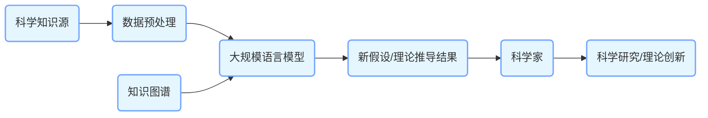

# 大规模语言模型在科学理论创新中的推理应用

> 关键词：大规模语言模型、科学理论创新、推理应用、知识图谱、模型评估

> 摘要：本文深入探讨了大规模语言模型在科学理论创新中的推理应用。首先介绍了研究的背景、目的、预期读者等内容，接着阐述了大规模语言模型及科学理论创新的核心概念与联系，详细讲解了相关核心算法原理和操作步骤，包括使用Python代码示例。同时给出了数学模型和公式，并进行详细讲解与举例。通过项目实战展示了代码实现与解读，分析了实际应用场景。最后推荐了学习工具和资源，总结了未来发展趋势与挑战，还提供了常见问题解答和扩展阅读参考资料，旨在为相关领域的研究者和从业者提供全面的技术指导和研究方向。

## 1. 背景介绍 
### 1.1 目的和范围
随着人工智能技术的飞速发展，大规模语言模型如GPT - 3、ChatGPT等不断涌现，展现出了强大的语言理解和生成能力。本研究的目的在于探索大规模语言模型在科学理论创新领域的推理应用，分析其如何助力科学家进行理论推导、假设生成和知识发现。研究范围涵盖了多个科学领域，包括物理学、化学、生物学等，旨在揭示大规模语言模型在不同科学场景下的应用潜力和局限性。

### 1.2 预期读者
本文预期读者包括人工智能领域的研究者、科学家、科学理论创新工作者以及对科学与技术交叉领域感兴趣的爱好者。对于人工智能研究者，本文提供了大规模语言模型在科学应用中的新视角和研究方向；对于科学家和科学理论创新工作者，本文介绍了如何利用大规模语言模型来加速科学理论的发展；对于爱好者，本文可以帮助他们了解科学与人工智能结合的前沿动态。

### 1.3 文档结构概述
本文首先介绍了研究的背景信息，包括目的、预期读者和文档结构。接着阐述了大规模语言模型和科学理论创新的核心概念以及它们之间的联系，并给出了相应的示意图和流程图。然后详细讲解了核心算法原理和具体操作步骤，同时给出了数学模型和公式。通过项目实战展示了代码实现和分析，探讨了实际应用场景。之后推荐了相关的工具和资源，最后总结了未来发展趋势与挑战，提供了常见问题解答和扩展阅读参考资料。

### 1.4 术语表
#### 1.4.1 核心术语定义
- **大规模语言模型（Large - Scale Language Model）**：基于深度学习技术，通过在大规模文本数据上进行训练得到的语言模型，具有强大的语言理解和生成能力。
- **科学理论创新（Scientific Theory Innovation）**：在科学研究中，提出新的理论、假设或对现有理论进行改进和拓展的过程。
- **推理应用（Reasoning Application）**：利用模型的能力进行逻辑推理、问题求解和知识发现的应用。

#### 1.4.2 相关概念解释
- **知识图谱（Knowledge Graph）**：一种用于表示实体之间关系的语义网络，在科学理论创新中可用于存储和组织科学知识。
- **自然语言处理（Natural Language Processing，NLP）**：让计算机理解和处理人类语言的技术，大规模语言模型是NLP领域的重要成果。

#### 1.4.3 缩略词列表
- **GPT（Generative Pretrained Transformer）**：生成式预训练变换器，是一类广泛应用的大规模语言模型架构。
- **NLP**：自然语言处理（Natural Language Processing）

## 2. 核心概念与联系 

### 核心概念原理
#### 大规模语言模型
大规模语言模型通常基于Transformer架构，通过在大规模文本语料上进行无监督预训练来学习语言的统计规律。其核心原理是利用多头自注意力机制捕捉文本中的长距离依赖关系，从而能够对输入的文本进行有效的编码和解码。例如，GPT系列模型通过自回归的方式生成文本，根据已有的上下文预测下一个可能的单词。

#### 科学理论创新
科学理论创新是一个复杂的认知过程，涉及观察、假设、实验、验证等多个环节。科学家通过对自然现象的观察和分析，提出假设，然后通过实验和推理来验证假设的正确性。在这个过程中，需要整合已有的科学知识，进行逻辑推理和创造性思维。

### 架构的文本示意图
大规模语言模型在科学理论创新中的应用架构可以描述如下：

科学知识源（如科学文献、实验数据等）作为输入，经过数据预处理（如清洗、标注等）后，输入到大规模语言模型中。模型根据输入的知识进行推理和生成，输出新的假设、理论推导结果等。这些输出结果可以进一步反馈给科学家，用于科学研究和理论创新。同时，知识图谱可以作为辅助工具，为模型提供结构化的知识支持，帮助模型更好地理解和推理科学知识。

### Mermaid流程图


这个流程图展示了大规模语言模型在科学理论创新中的应用流程。科学知识源经过预处理后输入到模型中，知识图谱为模型提供支持，模型输出的结果反馈给科学家用于科学研究和理论创新。

## 3. 核心算法原理 & 具体操作步骤 

### 核心算法原理
大规模语言模型的核心算法基于Transformer架构，下面我们将详细介绍Transformer的主要组件和工作原理，并给出Python代码示例。

#### Transformer架构
Transformer主要由编码器（Encoder）和解码器（Decoder）组成。编码器负责对输入的文本进行编码，提取文本的特征表示；解码器则根据编码器的输出和已有的上下文信息生成输出文本。

##### 多头自注意力机制
多头自注意力机制是Transformer的核心组件之一，它允许模型在不同的表示子空间中并行地关注输入序列的不同部分。其计算公式如下：

$$Attention(Q, K, V) = softmax(\frac{QK^T}{\sqrt{d_k}})V$$

其中，$Q$、$K$、$V$ 分别是查询（Query）、键（Key）和值（Value）矩阵，$d_k$ 是键向量的维度。

多头自注意力机制将多个自注意力头的输出拼接起来，然后通过一个线性变换得到最终的输出：

$$MultiHead(Q, K, V) = Concat(head_1, \cdots, head_h)W^O$$

其中，$head_i = Attention(QW_i^Q, KW_i^K, VW_i^V)$，$W_i^Q$、$W_i^K$、$W_i^V$ 和 $W^O$ 是可学习的参数矩阵。

#### Python代码实现
```python
import torch
import torch.nn as nn
import torch.nn.functional as F

class MultiHeadAttention(nn.Module):
    def __init__(self, num_heads, d_model):
        super(MultiHeadAttention, self).__init__()
        self.num_heads = num_heads
        self.d_model = d_model
        self.d_k = d_model // num_heads

        self.W_q = nn.Linear(d_model, d_model)
        self.W_k = nn.Linear(d_model, d_model)
        self.W_v = nn.Linear(d_model, d_model)
        self.W_o = nn.Linear(d_model, d_model)

    def forward(self, Q, K, V, mask=None):
        batch_size = Q.size(0)

        # 线性变换
        Q = self.W_q(Q).view(batch_size, -1, self.num_heads, self.d_k).transpose(1, 2)
        K = self.W_k(K).view(batch_size, -1, self.num_heads, self.d_k).transpose(1, 2)
        V = self.W_v(V).view(batch_size, -1, self.num_heads, self.d_k).transpose(1, 2)

        # 计算注意力分数
        scores = torch.matmul(Q, K.transpose(-2, -1)) / torch.sqrt(torch.tensor(self.d_k, dtype=torch.float32))

        if mask is not None:
            scores = scores.masked_fill(mask == 0, -1e9)

        # 计算注意力分布
        attn_dist = F.softmax(scores, dim=-1)

        # 计算输出
        output = torch.matmul(attn_dist, V)
        output = output.transpose(1, 2).contiguous().view(batch_size, -1, self.d_model)
        output = self.W_o(output)

        return output
```

### 具体操作步骤
#### 数据准备
收集科学领域的相关文本数据，如科学文献、实验报告等，并进行清洗和预处理。可以使用正则表达式去除噪声信息，使用分词工具将文本分割成单词或子词。

#### 模型训练
使用预处理后的数据对大规模语言模型进行训练。可以使用预训练的模型作为基础，然后在特定的科学领域数据上进行微调。训练过程中需要设置合适的超参数，如学习率、批量大小等。

#### 推理应用
在训练好的模型上进行推理应用。输入科学问题或相关的科学知识，模型将输出推理结果，如假设生成、理论推导等。可以通过调整输入的文本和模型的参数来优化推理结果。

## 4. 数学模型和公式 & 详细讲解 & 举例说明 

### 数学模型和公式
#### 损失函数
在大规模语言模型的训练中，通常使用交叉熵损失函数来衡量模型的预测结果与真实标签之间的差异。对于一个序列 $y_1, y_2, \cdots, y_n$，模型的预测概率分布为 $p_1, p_2, \cdots, p_n$，交叉熵损失函数的计算公式为：

$$L = -\frac{1}{n}\sum_{i = 1}^{n}\sum_{j = 1}^{|V|}y_{i,j}\log(p_{i,j})$$

其中，$|V|$ 是词汇表的大小，$y_{i,j}$ 是真实标签的第 $j$ 个元素，$p_{i,j}$ 是模型预测的第 $j$ 个元素的概率。

#### 梯度下降优化算法
为了最小化损失函数，通常使用梯度下降优化算法来更新模型的参数。以随机梯度下降（SGD）为例，其更新公式为：

$$\theta_{t + 1} = \theta_t - \eta\nabla L(\theta_t)$$

其中，$\theta_t$ 是第 $t$ 步的模型参数，$\eta$ 是学习率，$\nabla L(\theta_t)$ 是损失函数关于参数 $\theta_t$ 的梯度。

### 详细讲解
#### 交叉熵损失函数
交叉熵损失函数衡量了两个概率分布之间的差异。在语言模型中，真实标签是一个one - hot向量，表示正确的单词，模型的预测概率分布表示模型对每个单词的预测概率。通过最小化交叉熵损失函数，模型可以学习到更准确的预测概率分布。

#### 梯度下降优化算法
梯度下降算法通过不断地沿着损失函数的负梯度方向更新模型的参数，使得损失函数逐渐减小。随机梯度下降算法在每次迭代中只使用一个样本或一小批样本进行参数更新，这样可以提高训练效率。

### 举例说明
假设我们有一个简单的语言模型，词汇表大小为 $|V| = 3$，输入的序列长度为 $n = 2$。真实标签为 $y_1 = [1, 0, 0]$ 和 $y_2 = [0, 1, 0]$，模型的预测概率分布为 $p_1 = [0.8, 0.1, 0.1]$ 和 $p_2 = [0.2, 0.7, 0.1]$。

则交叉熵损失函数为：

$$L = -\frac{1}{2}[(1\times\log(0.8)+0\times\log(0.1)+0\times\log(0.1))+(0\times\log(0.2)+1\times\log(0.7)+0\times\log(0.1))]$$

$$L = -\frac{1}{2}(\log(0.8)+\log(0.7)) \approx 0.21$$

在训练过程中，我们使用梯度下降算法更新模型的参数，使得损失函数逐渐减小。

## 5. 项目实战：代码实际案例和详细解释说明 

### 5.1  开发环境搭建
#### 硬件环境
建议使用具有GPU加速的服务器或工作站，例如NVIDIA的GPU，以提高模型的训练和推理速度。

#### 软件环境
- **操作系统**：推荐使用Linux系统，如Ubuntu 18.04或更高版本。
- **Python环境**：使用Python 3.7或更高版本。可以使用Anaconda来管理Python环境。
- **深度学习框架**：使用PyTorch作为深度学习框架，版本建议为1.8或更高。

#### 安装依赖库
```bash
pip install torch torchvision torchaudio
pip install transformers
```

### 5.2  源代码详细实现和代码解读
#### 代码实现
```python
from transformers import AutoTokenizer, AutoModelForCausalLM
import torch

# 加载预训练的语言模型和分词器
model_name = "gpt2"
tokenizer = AutoTokenizer.from_pretrained(model_name)
model = AutoModelForCausalLM.from_pretrained(model_name)

# 输入科学问题
input_text = "在物理学中，如何解释量子纠缠现象？"
input_ids = tokenizer.encode(input_text, return_tensors='pt')

# 生成推理结果
output = model.generate(input_ids, max_length=200, num_return_sequences=1)
output_text = tokenizer.decode(output[0], skip_special_tokens=True)

print("输入问题：", input_text)
print("推理结果：", output_text)
```

#### 代码解读
1. **加载预训练的语言模型和分词器**：使用 `transformers` 库加载预训练的GPT - 2模型和对应的分词器。
2. **输入科学问题**：定义一个科学问题作为输入，并使用分词器将其编码为输入ID。
3. **生成推理结果**：使用模型的 `generate` 方法生成推理结果，设置最大长度为200，并只返回一个生成序列。
4. **解码输出**：使用分词器将生成的输出ID解码为文本，并打印输入问题和推理结果。

### 5.3  代码解读与分析
#### 优点
- 代码简单易懂，使用了 `transformers` 库提供的高级API，无需手动实现复杂的模型架构。
- 可以快速进行推理应用，通过调整输入文本和生成参数，可以得到不同的推理结果。

#### 局限性
- 预训练的模型可能对特定科学领域的知识掌握不够准确，需要在特定领域的数据上进行微调。
- 生成的结果可能存在一定的不确定性，需要人工进行评估和筛选。

## 6. 实际应用场景 
### 科学假设生成
大规模语言模型可以根据已有的科学知识和数据，生成新的科学假设。例如，在生物学领域，模型可以根据基因序列数据和相关的生物学知识，提出关于基因功能和疾病机制的新假设，为科学家的研究提供方向。

### 理论推导和验证
在物理学、数学等领域，模型可以帮助科学家进行理论推导和验证。例如，模型可以根据已知的物理定律和数学公式，推导新的理论结果，并通过与实验数据进行对比来验证理论的正确性。

### 知识发现和整合
大规模语言模型可以对海量的科学文献进行分析和挖掘，发现隐藏在其中的知识和关系。例如，模型可以识别不同科学领域之间的交叉点和潜在的研究方向，促进科学知识的整合和创新。

### 科学教育和科普
模型可以作为科学教育和科普的工具，帮助学生和公众更好地理解科学理论和概念。例如，模型可以用通俗易懂的语言解释复杂的科学问题，提供生动的示例和可视化的解释。

## 7. 工具和资源推荐
### 7.1 学习资源推荐
#### 7.1.1 书籍推荐
- 《深度学习》（Deep Learning）：由Ian Goodfellow、Yoshua Bengio和Aaron Courville编写，是深度学习领域的经典教材，涵盖了神经网络、优化算法、卷积神经网络等内容。
- 《自然语言处理入门》（Natural Language Processing in Action）：介绍了自然语言处理的基本概念和技术，包括分词、词性标注、命名实体识别等。

#### 7.1.2 在线课程
- Coursera上的“深度学习专项课程”（Deep Learning Specialization）：由Andrew Ng教授讲授，包括神经网络、卷积神经网络、循环神经网络等多个主题。
- edX上的“自然语言处理”（Natural Language Processing）：提供了自然语言处理的全面介绍，包括语言模型、机器翻译、问答系统等内容。

#### 7.1.3 技术博客和网站
- Hugging Face博客（https://huggingface.co/blog）：提供了关于大规模语言模型和自然语言处理的最新研究成果和技术应用。
- arXiv（https://arxiv.org/）：是一个开放获取的学术预印本平台，包含了大量的科学研究论文，特别是在人工智能和机器学习领域。

### 7.2 开发工具框架推荐
#### 7.2.1 IDE和编辑器
- PyCharm：是一款专业的Python集成开发环境，提供了代码编辑、调试、版本控制等功能。
- Jupyter Notebook：是一个交互式的开发环境，适合进行数据分析和模型实验，支持Python、R等多种编程语言。

#### 7.2.2 调试和性能分析工具
- TensorBoard：是TensorFlow提供的可视化工具，可以用于监控模型的训练过程、可视化模型的结构和性能指标。
- PyTorch Profiler：是PyTorch提供的性能分析工具，可以帮助开发者找出模型训练和推理过程中的性能瓶颈。

#### 7.2.3 相关框架和库
- Transformers：是Hugging Face开发的一个用于自然语言处理的库，提供了多种预训练的语言模型和工具，方便开发者进行模型的加载、微调和解码。
- NLTK（Natural Language Toolkit）：是一个流行的自然语言处理库，提供了分词、词性标注、命名实体识别等多种工具和数据集。

### 7.3 相关论文著作推荐
#### 7.3.1 经典论文
- “Attention Is All You Need”：介绍了Transformer架构，是大规模语言模型的基础。
- “BERT: Pre - training of Deep Bidirectional Transformers for Language Understanding”：提出了BERT模型，开创了预训练语言模型的新时代。

#### 7.3.2 最新研究成果
- 关注arXiv上关于大规模语言模型和科学理论创新的最新论文，了解该领域的前沿研究动态。

#### 7.3.3 应用案例分析
- 可以参考一些顶级学术会议（如ACL、NeurIPS等）上的论文，了解大规模语言模型在不同科学领域的应用案例和实践经验。

## 8. 总结：未来发展趋势与挑战
### 未来发展趋势
#### 模型性能提升
随着计算资源的不断增加和算法的不断改进，大规模语言模型的性能将不断提升。模型将能够处理更复杂的科学问题，生成更准确和有价值的推理结果。

#### 跨领域融合
大规模语言模型将与其他技术（如知识图谱、计算机视觉等）进行更深入的融合，实现跨领域的科学理论创新。例如，结合计算机视觉技术，模型可以对科学实验中的图像和视频数据进行分析和理解。

#### 个性化服务
根据科学家的研究兴趣和需求，为其提供个性化的科学理论创新支持。模型可以学习科学家的研究习惯和偏好，为其推荐更合适的假设和研究方向。

### 挑战
#### 知识准确性
大规模语言模型在学习和推理过程中可能会引入错误的知识，需要建立有效的机制来验证和纠正模型的输出结果。

#### 可解释性
模型的决策过程往往是黑盒的，难以解释其推理结果的依据。在科学理论创新中，需要提高模型的可解释性，以便科学家能够理解和信任模型的输出。

#### 数据隐私和安全
科学研究数据通常包含敏感信息，在使用大规模语言模型进行推理应用时，需要确保数据的隐私和安全，防止数据泄露和滥用。

## 9. 附录：常见问题与解答
### 大规模语言模型能否完全替代科学家进行科学理论创新？
不能。大规模语言模型可以为科学家提供辅助支持，如生成假设、进行理论推导等，但科学理论创新是一个复杂的创造性过程，需要科学家的专业知识、经验和判断力。模型的输出结果需要经过科学家的评估和验证。

### 如何提高大规模语言模型在科学领域的推理能力？
可以通过以下方法提高模型的推理能力：
- 在特定科学领域的数据上进行微调，使模型学习到更多的专业知识。
- 结合知识图谱等结构化知识，为模型提供更准确的背景信息。
- 改进模型的架构和算法，提高模型的逻辑推理能力。

### 大规模语言模型在科学理论创新中的应用是否存在伦理问题？
存在一定的伦理问题。例如，模型的输出结果可能会影响科学家的研究方向和决策，如果模型引入了错误的信息或偏见，可能会导致科学研究的偏差。此外，数据隐私和安全问题也是需要关注的伦理问题。

## 10. 扩展阅读 & 参考资料
- Goodfellow, I., Bengio, Y., & Courville, A. (2016). Deep Learning. MIT Press.
- Rao, D., & McMahan, B. (2019). Natural Language Processing in Action. Manning Publications.
- Vaswani, A., Shazeer, N., Parmar, N., et al. (2017). Attention Is All You Need. Advances in Neural Information Processing Systems.
- Devlin, J., Chang, M. - W., Lee, K., & Toutanova, K. (2019). BERT: Pre - training of Deep Bidirectional Transformers for Language Understanding. Proceedings of the 2019 Conference of the North American Chapter of the Association for Computational Linguistics: Human Language Technologies.

以上是关于“大规模语言模型在科学理论创新中的推理应用”的详细技术博客文章，涵盖了从背景介绍到未来发展趋势等多个方面的内容，希望对相关领域的研究和实践有所帮助。