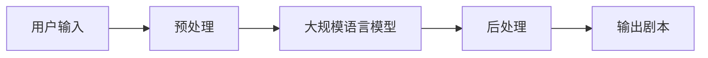

# 大规模语言模型在自动剧本创作中的探索与突破

> 关键词：大规模语言模型、自动剧本创作、自然语言处理、创意生成、文本生成技术

> 摘要：本文聚焦于大规模语言模型在自动剧本创作领域的应用，深入探讨其核心概念、算法原理、数学模型等内容。通过详细的项目实战案例，展示大规模语言模型在实际剧本创作中的具体实现过程。分析其在影视、游戏等多个实际应用场景中的表现，推荐相关的学习资源、开发工具和研究论文。最后总结大规模语言模型在自动剧本创作中的未来发展趋势与挑战，为该领域的研究者和从业者提供全面且深入的参考。

## 1. 背景介绍 
### 1.1 目的和范围
随着人工智能技术的飞速发展，大规模语言模型在自然语言处理领域取得了显著的成果。自动剧本创作作为一个具有挑战性和创新性的应用方向，吸引了众多研究者和创作者的关注。本文的目的在于全面探索大规模语言模型在自动剧本创作中的应用，深入分析其原理、技术和实际效果，为该领域的进一步发展提供理论和实践支持。

本文的范围涵盖了大规模语言模型在自动剧本创作中的核心概念、算法原理、数学模型、项目实战、实际应用场景等方面。同时，还会推荐相关的学习资源、开发工具和研究论文，帮助读者更全面地了解和掌握这一领域的知识和技术。

### 1.2 预期读者
本文的预期读者包括自然语言处理领域的研究者、人工智能开发者、剧本创作者、影视和游戏行业的从业者以及对自动剧本创作感兴趣的技术爱好者。通过阅读本文，读者可以深入了解大规模语言模型在自动剧本创作中的应用原理和技术细节，获取实际项目的开发经验，为自己的研究和创作提供有益的参考。

### 1.3 文档结构概述
本文将按照以下结构进行组织：
1. **背景介绍**：介绍本文的目的和范围、预期读者以及文档结构概述，并给出相关的术语定义和解释。
2. **核心概念与联系**：阐述大规模语言模型和自动剧本创作的核心概念，分析它们之间的联系，并通过文本示意图和 Mermaid 流程图进行直观展示。
3. **核心算法原理 & 具体操作步骤**：详细讲解大规模语言模型在自动剧本创作中使用的核心算法原理，并给出具体的操作步骤和 Python 源代码示例。
4. **数学模型和公式 & 详细讲解 & 举例说明**：介绍大规模语言模型在自动剧本创作中的数学模型和公式，对其进行详细讲解，并通过具体的例子进行说明。
5. **项目实战：代码实际案例和详细解释说明**：通过一个实际的项目案例，展示大规模语言模型在自动剧本创作中的具体实现过程，包括开发环境搭建、源代码详细实现和代码解读。
6. **实际应用场景**：分析大规模语言模型在影视、游戏等实际应用场景中的表现和优势。
7. **工具和资源推荐**：推荐相关的学习资源、开发工具和研究论文，帮助读者更全面地了解和掌握这一领域的知识和技术。
8. **总结：未来发展趋势与挑战**：总结大规模语言模型在自动剧本创作中的发展现状，分析其未来发展趋势和面临的挑战。
9. **附录：常见问题与解答**：解答读者在阅读本文过程中可能遇到的常见问题。
10. **扩展阅读 & 参考资料**：提供相关的扩展阅读材料和参考资料，方便读者进一步深入研究。

### 1.4 术语表
#### 1.4.1 核心术语定义
- **大规模语言模型**：是一种基于深度学习的自然语言处理模型，通过在大规模文本数据上进行训练，学习语言的统计规律和语义信息，能够生成高质量的自然语言文本。
- **自动剧本创作**：指利用计算机技术和人工智能算法，自动生成剧本的过程。自动剧本创作可以帮助编剧提高创作效率，拓展创作思路，同时也为影视和游戏行业提供了新的创作方式。
- **自然语言处理**：是人工智能的一个重要分支，主要研究如何让计算机理解、处理和生成自然语言。自然语言处理技术包括文本分类、信息抽取、机器翻译、文本生成等多个方面。
- **文本生成**：是自然语言处理的一个重要任务，指根据给定的输入信息，自动生成符合语法和语义要求的自然语言文本。文本生成技术可以应用于自动写作、对话系统、机器翻译等多个领域。

#### 1.4.2 相关概念解释
- **预训练模型**：大规模语言模型通常采用预训练 - 微调的方式进行训练。预训练是指在大规模无监督文本数据上进行训练，学习语言的通用特征和规律。微调是指在特定的任务数据集上对预训练模型进行进一步训练，使其适应具体的任务需求。
- **注意力机制**：是一种在深度学习中广泛应用的技术，用于模拟人类的注意力行为。注意力机制可以帮助模型在处理序列数据时，自动关注输入序列中的重要部分，提高模型的性能和效率。
- **Transformer 架构**：是一种基于注意力机制的深度学习架构，具有并行计算能力强、长序列处理能力好等优点。大规模语言模型如 GPT、BERT 等都采用了 Transformer 架构。

#### 1.4.3 缩略词列表
- **NLP**：Natural Language Processing，自然语言处理
- **GPT**：Generative Pretrained Transformer，生成式预训练 Transformer
- **BERT**：Bidirectional Encoder Representations from Transformers，基于 Transformer 的双向编码器表示

## 2. 核心概念与联系 
### 核心概念原理
#### 大规模语言模型
大规模语言模型是基于深度学习的自然语言处理模型，其核心原理是通过在大规模文本数据上进行训练，学习语言的统计规律和语义信息。这些模型通常采用神经网络架构，如 Transformer 架构，通过多层的注意力机制和前馈神经网络来处理输入的文本序列。

在训练过程中，大规模语言模型使用无监督学习方法，如自监督学习，通过预测文本中的下一个单词或掩码单词来学习语言的表示。经过大规模的预训练后，模型可以学习到丰富的语言知识，包括语法、语义、语用等方面的信息。

#### 自动剧本创作
自动剧本创作是指利用计算机技术和人工智能算法，自动生成剧本的过程。其核心原理是将大规模语言模型的文本生成能力应用于剧本创作领域。通过向大规模语言模型提供相关的主题、情节、角色等信息，模型可以根据这些输入生成符合剧本格式和逻辑要求的文本。

自动剧本创作需要考虑剧本的结构、情节发展、角色塑造、对话设计等多个方面。为了生成高质量的剧本，还需要对大规模语言模型进行微调，使其适应剧本创作的特定需求。

### 架构的文本示意图
大规模语言模型在自动剧本创作中的架构可以描述如下：

输入层接收用户提供的剧本创作相关信息，如主题、情节、角色等。这些信息经过预处理后，输入到大规模语言模型中。大规模语言模型根据输入信息生成剧本的文本内容。生成的文本可能需要经过后处理，如格式调整、逻辑检查等，最终输出符合要求的剧本。

```plaintext
用户输入（主题、情节、角色等） -> 预处理 -> 大规模语言模型 -> 后处理 -> 输出剧本
```

### Mermaid 流程图


## 3. 核心算法原理 & 具体操作步骤 
### 核心算法原理
大规模语言模型在自动剧本创作中主要使用的算法是基于 Transformer 架构的生成式模型，如 GPT 系列模型。Transformer 架构的核心是多头注意力机制，它可以让模型在处理输入序列时，自动关注不同位置的信息。

多头注意力机制的计算公式如下：

$$
\text{Attention}(Q, K, V) = \text{softmax}(\frac{QK^T}{\sqrt{d_k}})V
$$

其中，$Q$ 是查询矩阵，$K$ 是键矩阵，$V$ 是值矩阵，$d_k$ 是键的维度。

在生成剧本时，模型采用自回归的方式，即根据已经生成的文本，预测下一个单词。具体来说，模型在每个时间步根据当前的输入和之前生成的文本，计算下一个单词的概率分布，然后根据这个概率分布采样得到下一个单词。

### 具体操作步骤
#### 步骤 1：数据准备
收集和整理与剧本创作相关的文本数据，如电影剧本、电视剧剧本、小说等。对数据进行清洗和预处理，包括去除噪声、分词、标注等操作。

#### 步骤 2：模型选择和加载
选择合适的大规模语言模型，如 GPT - 3、ChatGPT 等。可以使用开源的预训练模型，也可以使用商业的 API。加载模型并进行必要的配置。

#### 步骤 3：模型微调（可选）
如果需要让模型更好地适应剧本创作的特定需求，可以对模型进行微调。微调的过程是在特定的剧本数据集上对预训练模型进行进一步训练。

#### 步骤 4：生成剧本
向模型提供剧本创作的相关信息，如主题、情节、角色等。模型根据输入信息生成剧本的文本内容。可以通过调整生成参数，如温度、最大长度等，来控制生成的文本质量和风格。

#### 步骤 5：后处理
对生成的剧本进行后处理，包括格式调整、逻辑检查、语法纠错等操作。可以使用自然语言处理工具和规则来完成后处理任务。

### Python 源代码示例
```python
import openai

# 设置 API 密钥
openai.api_key = "your_api_key"

# 定义生成剧本的函数
def generate_script(prompt, max_length=1000, temperature=0.7):
    response = openai.Completion.create(
        engine="text-davinci-003",
        prompt=prompt,
        max_tokens=max_length,
        temperature=temperature
    )
    return response.choices[0].text

# 示例输入
prompt = "以科幻为主题，创作一个关于未来世界人类与机器人战争的剧本开头"

# 生成剧本
script = generate_script(prompt)
print(script)
```

## 4. 数学模型和公式 & 详细讲解 & 举例说明 
### 数学模型
大规模语言模型在自动剧本创作中主要基于概率语言模型。概率语言模型的目标是计算给定文本序列 $x_1, x_2, \cdots, x_n$ 的概率 $P(x_1, x_2, \cdots, x_n)$。根据链式法则，这个概率可以分解为：

$$
P(x_1, x_2, \cdots, x_n) = \prod_{i=1}^{n} P(x_i | x_1, x_2, \cdots, x_{i-1})
$$

在生成剧本时，模型根据已经生成的文本 $x_1, x_2, \cdots, x_{i-1}$，预测下一个单词 $x_i$ 的概率分布 $P(x_i | x_1, x_2, \cdots, x_{i-1})$。

### 公式详细讲解
#### 交叉熵损失函数
在训练大规模语言模型时，通常使用交叉熵损失函数来衡量模型预测的概率分布与真实概率分布之间的差异。交叉熵损失函数的计算公式如下：

$$
L = -\sum_{i=1}^{n} y_i \log(p_i)
$$

其中，$y_i$ 是真实的概率分布，$p_i$ 是模型预测的概率分布。

#### 自注意力机制
自注意力机制是 Transformer 架构的核心组件之一。它允许模型在处理输入序列时，自动关注不同位置的信息。自注意力机制的计算公式如下：

$$
\text{Attention}(Q, K, V) = \text{softmax}(\frac{QK^T}{\sqrt{d_k}})V
$$

其中，$Q$ 是查询矩阵，$K$ 是键矩阵，$V$ 是值矩阵，$d_k$ 是键的维度。

### 举例说明
假设我们有一个简单的文本序列 "The cat sat on the mat"，我们想要预测下一个单词。模型会根据已经生成的文本，计算每个可能的下一个单词的概率分布。例如，模型可能预测下一个单词是 "and" 的概率为 0.2，是 "then" 的概率为 0.3，是 "it" 的概率为 0.5 等。然后，根据这个概率分布采样得到下一个单词。

在训练过程中，模型会根据交叉熵损失函数来调整自身的参数，使得预测的概率分布尽可能接近真实的概率分布。例如，如果真实的下一个单词是 "it"，那么模型会调整参数，使得预测 "it" 的概率尽可能高。

## 5. 项目实战：代码实际案例和详细解释说明 
### 5.1  开发环境搭建
#### 安装 Python
首先，需要安装 Python 环境。可以从 Python 官方网站（https://www.python.org/downloads/）下载并安装适合自己操作系统的 Python 版本。建议使用 Python 3.7 及以上版本。

#### 安装必要的库
使用 pip 安装必要的库，如 openai、transformers 等。可以使用以下命令进行安装：

```sh
pip install openai transformers
```

#### 获取 API 密钥
如果使用 OpenAI 的 API，需要在 OpenAI 官方网站（https://platform.openai.com/）上注册并获取 API 密钥。

### 5.2  源代码详细实现和代码解读
```python
import openai
import os

# 设置 API 密钥
openai.api_key = os.getenv("OPENAI_API_KEY")

# 定义生成剧本的函数
def generate_script(prompt, max_length=1000, temperature=0.7):
    """
    该函数用于根据给定的提示生成剧本
    :param prompt: 生成剧本的提示信息
    :param max_length: 生成剧本的最大长度
    :param temperature: 生成文本的随机性程度
    :return: 生成的剧本文本
    """
    try:
        response = openai.Completion.create(
            engine="text-davinci-003",
            prompt=prompt,
            max_tokens=max_length,
            temperature=temperature
        )
        return response.choices[0].text
    except Exception as e:
        print(f"生成剧本时出现错误: {e}")
        return None

# 示例输入
prompt = "以校园为主题，创作一个关于学生之间友情和成长的剧本开头"

# 生成剧本
script = generate_script(prompt)
if script:
    print(script)
```

### 代码解读与分析
- **导入必要的库**：导入 openai 库用于调用 OpenAI 的 API，导入 os 库用于获取环境变量。
- **设置 API 密钥**：从环境变量中获取 OpenAI 的 API 密钥，确保代码的安全性。
- **定义生成剧本的函数**：该函数接受提示信息、最大长度和温度作为参数，调用 OpenAI 的 API 生成剧本。
- **示例输入**：定义一个以校园为主题的剧本开头的提示信息。
- **生成剧本**：调用生成剧本的函数，生成剧本并打印输出。

## 6. 实际应用场景 
### 影视行业
在影视行业，大规模语言模型在自动剧本创作中具有广泛的应用前景。编剧可以利用自动剧本创作工具快速生成剧本的初稿，节省创作时间和精力。同时，自动剧本创作工具可以提供多种创意和情节方案，帮助编剧拓展创作思路。

例如，在电影项目的前期开发阶段，制片人可以使用自动剧本创作工具生成多个不同的剧本大纲，然后从中选择最有潜力的方案进行进一步的开发。此外，自动剧本创作工具还可以用于电视剧的编剧工作，提高编剧团队的工作效率。

### 游戏行业
在游戏行业，大规模语言模型在自动剧本创作中也有着重要的应用。游戏的剧情和对话是吸引玩家的重要因素之一，自动剧本创作工具可以帮助游戏开发者快速生成丰富的剧情和对话内容。

例如，在角色扮演游戏中，开发者可以使用自动剧本创作工具生成游戏的主线剧情和支线剧情，以及角色之间的对话。这样可以节省开发者的时间和成本，同时提高游戏的剧情质量和趣味性。

### 教育领域
在教育领域，大规模语言模型在自动剧本创作中可以用于教学和学习。教师可以使用自动剧本创作工具生成教学剧本，用于课堂表演和教学活动。学生可以通过参与剧本创作，提高自己的写作能力和创造力。

例如，在语文教学中，教师可以让学生使用自动剧本创作工具创作一个关于历史故事的剧本，然后组织学生进行表演。这样可以让学生更加深入地理解历史知识，同时提高学生的综合素质。

## 7. 工具和资源推荐
### 7.1 学习资源推荐
#### 7.1.1 书籍推荐
- 《自然语言处理入门》：这本书全面介绍了自然语言处理的基本概念、算法和应用，适合初学者入门。
- 《深度学习》：这本书是深度学习领域的经典教材，详细介绍了深度学习的理论和实践，对于理解大规模语言模型的原理有很大帮助。
- 《Python 自然语言处理实战》：这本书通过实际案例介绍了如何使用 Python 进行自然语言处理，包括文本分类、信息抽取、文本生成等方面的内容。

#### 7.1.2 在线课程
- Coursera 上的“Natural Language Processing Specialization”：这是一门由斯坦福大学教授开设的自然语言处理专项课程，涵盖了自然语言处理的各个方面，包括大规模语言模型的应用。
- edX 上的“Deep Learning for Natural Language Processing”：这门课程介绍了深度学习在自然语言处理中的应用，包括 Transformer 架构、预训练模型等内容。
- 哔哩哔哩上的相关技术视频：哔哩哔哩上有很多关于自然语言处理和大规模语言模型的技术视频，这些视频由不同的博主制作，内容丰富多样，可以帮助学习者快速了解相关知识。

#### 7.1.3 技术博客和网站
- Hugging Face Blog：Hugging Face 是一个专注于自然语言处理的开源社区，其博客上有很多关于大规模语言模型的技术文章和研究成果。
- Towards Data Science：这是一个数据科学和机器学习领域的技术博客，上面有很多关于自然语言处理和大规模语言模型的文章和案例。
- arXiv：这是一个学术预印本平台，上面有很多关于自然语言处理和大规模语言模型的最新研究论文。

### 7.2 开发工具框架推荐
#### 7.2.1 IDE和编辑器
- PyCharm：这是一个专业的 Python 集成开发环境，具有代码编辑、调试、版本控制等功能，适合 Python 开发者使用。
- Visual Studio Code：这是一个轻量级的代码编辑器，支持多种编程语言，具有丰富的插件和扩展功能，适合快速开发和调试。
- Jupyter Notebook：这是一个交互式的笔记本环境，适合进行数据探索、模型训练和可视化等工作。

#### 7.2.2 调试和性能分析工具
- TensorBoard：这是 TensorFlow 提供的一个可视化工具，可以用于查看模型的训练过程、损失函数曲线、模型结构等信息。
- PyTorch Profiler：这是 PyTorch 提供的一个性能分析工具，可以用于分析模型的性能瓶颈和资源使用情况。
- cProfile：这是 Python 标准库中的一个性能分析工具，可以用于分析 Python 代码的执行时间和调用关系。

#### 7.2.3 相关框架和库
- Transformers：这是 Hugging Face 开发的一个开源库，提供了多种预训练的大规模语言模型，如 GPT、BERT 等，以及相应的工具和接口，方便开发者进行文本生成、文本分类等任务。
- OpenAI API：这是 OpenAI 提供的一个 API 接口，开发者可以通过调用该接口使用 OpenAI 的大规模语言模型，如 GPT - 3、ChatGPT 等。
- NLTK：这是一个自然语言处理工具包，提供了多种自然语言处理的工具和算法，如分词、词性标注、命名实体识别等。

### 7.3 相关论文著作推荐
#### 7.3.1 经典论文
- “Attention Is All You Need”：这篇论文介绍了 Transformer 架构，是大规模语言模型发展的重要里程碑。
- “BERT: Pre-training of Deep Bidirectional Transformers for Language Understanding”：这篇论文介绍了 BERT 模型，开创了预训练 - 微调的自然语言处理范式。
- “Generative Pretrained Transformer”：这篇论文介绍了 GPT 模型，展示了生成式预训练模型在文本生成任务中的强大能力。

#### 7.3.2 最新研究成果
- 在 arXiv 上搜索“Large Language Models in Script Writing”等关键词，可以找到很多关于大规模语言模型在自动剧本创作中的最新研究成果。
- 参加自然语言处理领域的学术会议，如 ACL、EMNLP 等，可以了解到该领域的最新研究动态和成果。

#### 7.3.3 应用案例分析
- 一些科技媒体和行业网站会发布关于大规模语言模型在自动剧本创作中的应用案例分析，这些案例可以帮助读者更好地了解实际应用中的问题和解决方案。

## 8. 总结：未来发展趋势与挑战
### 未来发展趋势
#### 提高生成质量
未来，大规模语言模型在自动剧本创作中的生成质量将不断提高。通过改进模型架构、增加训练数据和优化训练方法，模型可以生成更加自然、流畅、富有创意的剧本。

#### 个性化创作
随着技术的发展，自动剧本创作工具将能够实现个性化创作。根据用户的喜好、风格和需求，生成符合用户特定要求的剧本。例如，为不同类型的影视公司、游戏开发者和编剧提供个性化的剧本创作服务。

#### 与其他技术融合
大规模语言模型将与其他技术如计算机视觉、语音识别等进行融合，实现更加丰富和多样化的剧本创作。例如，结合计算机视觉技术生成带有场景描述和角色形象的剧本，结合语音识别技术实现语音输入和输出的剧本创作。

#### 跨语言创作
未来的自动剧本创作工具将支持跨语言创作。可以为不同语言的用户提供服务，促进不同文化之间的交流和合作。

### 面临的挑战
#### 创意和情感表达
虽然大规模语言模型在文本生成方面取得了很大的进展，但在创意和情感表达方面仍然存在不足。剧本创作需要丰富的想象力和情感表达能力，如何让模型更好地理解和表达创意和情感是一个挑战。

#### 版权和伦理问题
自动剧本创作涉及到版权和伦理问题。例如，生成的剧本可能会与已有的作品存在相似性，如何确保生成的剧本具有原创性和合法性是一个需要解决的问题。此外，还需要考虑自动剧本创作对编剧职业的影响等伦理问题。

#### 计算资源和成本
大规模语言模型的训练和推理需要大量的计算资源和成本。如何降低计算资源的需求和成本，提高模型的效率和可扩展性是一个挑战。

#### 评估和评价标准
目前，缺乏统一的评估和评价标准来衡量自动剧本创作的质量和效果。如何建立科学、合理的评估和评价标准，是推动自动剧本创作技术发展的关键。

## 9. 附录：常见问题与解答
### 问题 1：大规模语言模型生成的剧本质量如何？
大规模语言模型生成的剧本质量在不断提高，但仍然存在一定的局限性。模型可以生成符合语法和逻辑的文本，但在创意和情感表达方面可能不如人类编剧。生成的剧本通常可以作为初稿，需要经过人类编剧的修改和完善。

### 问题 2：使用大规模语言模型进行自动剧本创作需要具备哪些技术基础？
使用大规模语言模型进行自动剧本创作需要具备一定的自然语言处理和编程基础。需要了解大规模语言模型的基本原理和使用方法，掌握 Python 编程和相关的自然语言处理库，如 Transformers、OpenAI API 等。

### 问题 3：自动剧本创作会取代人类编剧吗？
自动剧本创作不会取代人类编剧。虽然自动剧本创作工具可以提高创作效率和提供创意灵感，但剧本创作是一个需要丰富的生活经验、情感表达能力和创造力的工作，人类编剧在这些方面具有不可替代的优势。自动剧本创作工具可以作为人类编剧的辅助工具，帮助他们更好地完成创作任务。

### 问题 4：如何确保生成的剧本具有原创性？
为了确保生成的剧本具有原创性，可以采取以下措施：
1. 提供独特的输入信息，避免使用常见的主题和情节。
2. 对生成的剧本进行修改和完善，加入自己的创意和想法。
3. 使用版权检测工具对生成的剧本进行检测，确保没有抄袭他人的作品。

### 问题 5：大规模语言模型在自动剧本创作中的应用有哪些限制？
大规模语言模型在自动剧本创作中的应用存在以下限制：
1. 缺乏对现实世界的理解：模型无法真正理解现实世界的复杂性和多样性，可能会生成一些不符合实际情况的内容。
2. 难以处理复杂的情节和角色关系：对于复杂的情节和角色关系，模型可能无法准确地把握和表达。
3. 生成的文本可能存在逻辑漏洞：由于模型是基于统计规律生成文本，可能会出现一些逻辑上的漏洞和不合理之处。

## 10. 扩展阅读 & 参考资料
### 扩展阅读
- 《人工智能时代的编剧艺术》：这本书探讨了人工智能技术对编剧艺术的影响和挑战，以及编剧如何在人工智能时代发挥自己的优势。
- 《创意生成的人工智能方法》：这本书介绍了人工智能在创意生成领域的应用方法和技术，对于理解自动剧本创作的原理和方法有很大帮助。

### 参考资料
- OpenAI 官方文档：https://platform.openai.com/docs/
- Hugging Face 官方文档：https://huggingface.co/docs/
- ACL Anthology：https://aclanthology.org/ ，这是自然语言处理领域的学术文献库，包含了大量的研究论文和会议记录。