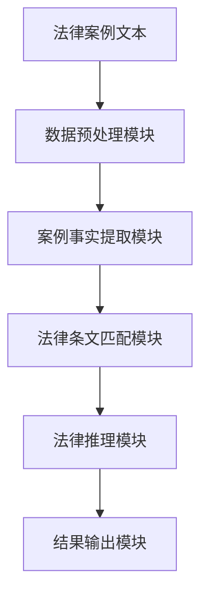

# 大规模语言模型在自动法律案例分析中的应用

> 关键词：大规模语言模型、自动法律案例分析、自然语言处理、法律推理、人工智能

> 摘要：本文围绕大规模语言模型在自动法律案例分析中的应用展开。首先介绍了该研究的背景，包括目的、预期读者、文档结构等。接着阐述了相关核心概念及其联系，详细讲解了核心算法原理与具体操作步骤，并借助数学模型和公式加深理解。通过项目实战展示了代码实现与分析，探讨了实际应用场景。同时推荐了学习、开发相关的工具和资源，还列举了相关论文著作。最后总结了未来发展趋势与挑战，提供了常见问题解答和扩展阅读参考资料，旨在全面深入地探讨大规模语言模型在自动法律案例分析领域的应用，为相关研究和实践提供参考。

## 1. 背景介绍 
### 1.1 目的和范围
在当今数字化时代，法律领域积累了海量的案例数据。传统的法律案例分析主要依靠法律从业者手动查阅和分析，不仅效率低下，而且容易出现遗漏和错误。大规模语言模型的出现为自动法律案例分析带来了新的机遇。本研究的目的在于探索如何利用大规模语言模型实现高效、准确的自动法律案例分析，提高法律工作的效率和质量。范围涵盖了从大规模语言模型的基本原理到其在法律案例分析各个环节的具体应用，包括案例事实提取、法律条文匹配、法律推理等方面。

### 1.2 预期读者
本文预期读者包括法律专业人士，如律师、法官、法律研究人员等，他们可以通过了解大规模语言模型在自动法律案例分析中的应用，提升自己的工作效率和分析能力；计算机科学领域的研究人员和开发者，他们可以从中获取关于将语言模型应用于法律领域的思路和方法；以及对人工智能和法律交叉领域感兴趣的普通读者，帮助他们了解这一新兴领域的发展动态。

### 1.3 文档结构概述
本文首先介绍相关背景知识，让读者对大规模语言模型和自动法律案例分析有初步了解。接着阐述核心概念及其联系，构建理论基础。然后详细讲解核心算法原理和具体操作步骤，通过 Python 代码进行说明。再借助数学模型和公式进一步深入剖析。之后通过项目实战展示实际应用，包括开发环境搭建、源代码实现和代码解读。随后探讨实际应用场景，介绍学习、开发相关的工具和资源以及相关论文著作。最后总结未来发展趋势与挑战，提供常见问题解答和扩展阅读参考资料。

### 1.4 术语表
#### 1.4.1 核心术语定义
- **大规模语言模型**：是一种基于深度学习的人工智能模型，通过在大量文本数据上进行训练，学习语言的模式和规律，能够生成自然语言文本、进行文本分类、信息提取等任务。
- **自动法律案例分析**：利用计算机技术和人工智能算法，对法律案例进行自动化的处理和分析，包括案例事实提取、法律条文匹配、法律推理等，以辅助法律决策。
- **自然语言处理（NLP）**：是计算机科学与语言学的交叉领域，旨在让计算机能够理解、处理和生成自然语言，是实现自动法律案例分析的关键技术之一。

#### 1.4.2 相关概念解释
- **法律推理**：是指法律工作者在法律适用过程中，运用逻辑思维方法，从已知的法律和事实材料推导出法律结论的过程。在自动法律案例分析中，法律推理是一个核心环节，大规模语言模型可以通过学习大量的法律案例和法律条文，模拟法律推理的过程。
- **案例事实提取**：是指从法律案例文本中提取出关键的事实信息，如当事人、事件经过、争议焦点等。这是自动法律案例分析的基础，大规模语言模型可以通过文本分析技术实现案例事实的自动提取。

#### 1.4.3 缩略词列表
- **NLP**：自然语言处理（Natural Language Processing）
- **LLM**：大规模语言模型（Large Language Model）

## 2. 核心概念与联系 
### 大规模语言模型原理
大规模语言模型通常基于Transformer架构，如GPT（Generative Pretrained Transformer）系列和BERT（Bidirectional Encoder Representations from Transformers）等。Transformer架构的核心是自注意力机制（Self - Attention Mechanism），它能够捕捉文本中不同位置之间的依赖关系。

自注意力机制的原理是，对于输入的文本序列，模型会计算每个位置与其他位置的相关性权重，然后根据这些权重对每个位置的特征进行加权求和，得到新的特征表示。具体来说，给定输入序列 $\mathbf{X} = [\mathbf{x}_1, \mathbf{x}_2, \cdots, \mathbf{x}_n]$，自注意力机制通过以下步骤计算输出：

1. 计算查询（Query）、键（Key）和值（Value）矩阵：
   - $\mathbf{Q} = \mathbf{X} \mathbf{W}^Q$
   - $\mathbf{K} = \mathbf{X} \mathbf{W}^K$
   - $\mathbf{V} = \mathbf{X} \mathbf{W}^V$
   其中，$\mathbf{W}^Q$、$\mathbf{W}^K$ 和 $\mathbf{W}^V$ 是可学习的权重矩阵。

2. 计算注意力分数：
   - $\mathbf{Attention}(\mathbf{Q}, \mathbf{K}, \mathbf{V})=\text{softmax}\left(\frac{\mathbf{Q}\mathbf{K}^T}{\sqrt{d_k}}\right)\mathbf{V}$
   其中，$d_k$ 是查询和键的维度。

### 自动法律案例分析架构
自动法律案例分析系统主要包括以下几个模块：

1. **数据预处理模块**：对法律案例文本进行清洗、分词、词性标注等预处理操作，将文本转换为模型可以处理的格式。
2. **案例事实提取模块**：利用大规模语言模型从预处理后的文本中提取关键的事实信息。
3. **法律条文匹配模块**：将提取的案例事实与法律条文进行匹配，找出可能适用的法律条文。
4. **法律推理模块**：根据匹配的法律条文和案例事实进行法律推理，得出法律结论。
5. **结果输出模块**：将法律推理的结果以可视化的方式输出，供法律工作者参考。

### 文本示意图
```plaintext
输入：法律案例文本
|
|-- 数据预处理模块
|   |-- 清洗
|   |-- 分词
|   |-- 词性标注
|
|-- 案例事实提取模块
|   |-- 利用大规模语言模型提取事实信息
|
|-- 法律条文匹配模块
|   |-- 与法律条文库进行匹配
|
|-- 法律推理模块
|   |-- 根据匹配结果进行推理
|
|-- 结果输出模块
|   |-- 可视化输出法律结论
```

### Mermaid 流程图


## 3. 核心算法原理 & 具体操作步骤 
### 案例事实提取算法原理
案例事实提取可以使用序列标注算法，如条件随机场（CRF）或基于深度学习的双向长短时记忆网络（Bi - LSTM）结合条件随机场（Bi - LSTM - CRF）。这里以 Bi - LSTM - CRF 为例进行说明。

Bi - LSTM 是一种能够处理序列数据的深度学习模型，它可以同时考虑输入序列的前向和后向信息。CRF 是一种概率图模型，用于对序列数据进行标注。Bi - LSTM - CRF 模型将 Bi - LSTM 提取的特征作为输入，通过 CRF 进行序列标注，从而实现案例事实的提取。

以下是使用 Python 和 PyTorch 实现的 Bi - LSTM - CRF 模型的示例代码：

```python
import torch
import torch.nn as nn
import torch.optim as optim

# 定义 Bi - LSTM - CRF 模型
class BiLSTM_CRF(nn.Module):
    def __init__(self, vocab_size, tag_to_ix, embedding_dim, hidden_dim):
        super(BiLSTM_CRF, self).__init__()
        self.embedding_dim = embedding_dim
        self.hidden_dim = hidden_dim
        self.vocab_size = vocab_size
        self.tag_to_ix = tag_to_ix
        self.tagset_size = len(tag_to_ix)

        self.word_embeds = nn.Embedding(vocab_size, embedding_dim)
        self.lstm = nn.LSTM(embedding_dim, hidden_dim // 2,
                            num_layers=1, bidirectional=True)

        # 将 LSTM 的输出映射到标签空间
        self.hidden2tag = nn.Linear(hidden_dim, self.tagset_size)

        # CRF 层
        self.transitions = nn.Parameter(
            torch.randn(self.tagset_size, self.tagset_size))

        # 确保不会转移到开始标签，也不会从结束标签转移
        self.transitions.data[tag_to_ix[START_TAG], :] = -10000
        self.transitions.data[:, tag_to_ix[STOP_TAG]] = -10000

    def _forward_alg(self, feats):
        # 前向算法计算分区函数
        init_alphas = torch.full((1, self.tagset_size), -10000.)
        # START_TAG 有所有的分数
        init_alphas[0][self.tag_to_ix[START_TAG]] = 0.

        # 包装在一个变量中，以便自动反向传播
        forward_var = init_alphas

        # 遍历句子
        for feat in feats:
            alphas_t = []  # 当前时间步的前向变量
            for next_tag in range(self.tagset_size):
                # 传播到 next_tag 的分数
                emit_score = feat[next_tag].view(
                    1, -1).expand(1, self.tagset_size)
                trans_score = self.transitions[next_tag].view(1, -1)
                # 下一个标记的所有可能的前一个标记的分数
                next_tag_var = forward_var + trans_score + emit_score
                # 取对数和
                alphas_t.append(log_sum_exp(next_tag_var).view(1))
            forward_var = torch.cat(alphas_t).view(1, -1)
        terminal_var = forward_var + self.transitions[self.tag_to_ix[STOP_TAG]]
        alpha = log_sum_exp(terminal_var)
        return alpha

    def _get_lstm_features(self, sentence):
        # 获取 LSTM 特征
        embeds = self.word_embeds(sentence).view(len(sentence), 1, -1)
        lstm_out, _ = self.lstm(embeds)
        lstm_out = lstm_out.view(len(sentence), self.hidden_dim)
        lstm_feats = self.hidden2tag(lstm_out)
        return lstm_feats

    def _score_sentence(self, feats, tags):
        # 计算给定标签序列的分数
        score = torch.zeros(1)
        tags = torch.cat([torch.tensor([self.tag_to_ix[START_TAG]], dtype=torch.long), tags])
        for i, feat in enumerate(feats):
            score = score + \
                self.transitions[tags[i + 1], tags[i]] + feat[tags[i + 1]]
        score = score + self.transitions[self.tag_to_ix[STOP_TAG], tags[-1]]
        return score

    def _viterbi_decode(self, feats):
        # Viterbi 解码
        backpointers = []

        # 初始化前向变量
        init_vvars = torch.full((1, self.tagset_size), -10000.)
        init_vvars[0][self.tag_to_ix[START_TAG]] = 0

        # 第 i 步的 forward_var 保存第 i - 1 步的 viterbi 变量
        forward_var = init_vvars
        for feat in feats:
            bptrs_t = []  # 此时间步的反向指针
            viterbivars_t = []  # 此时间步的 viterbi 变量

            for next_tag in range(self.tagset_size):
                # 传播到 next_tag 的分数
                next_tag_var = forward_var + self.transitions[next_tag]
                best_tag_id = argmax(next_tag_var)
                bptrs_t.append(best_tag_id)
                viterbivars_t.append(next_tag_var[0][best_tag_id].view(1))
            # 现在添加发射分数，并将 forward_var 分配给此时间步的 viterbi 变量
            forward_var = (torch.cat(viterbivars_t) + feat).view(1, -1)
            backpointers.append(bptrs_t)

        # 转移到 STOP_TAG
        terminal_var = forward_var + self.transitions[self.tag_to_ix[STOP_TAG]]
        best_tag_id = argmax(terminal_var)
        path_score = terminal_var[0][best_tag_id]

        # 跟着反向指针解码最佳路径
        best_path = [best_tag_id]
        for bptrs_t in reversed(backpointers):
            best_tag_id = bptrs_t[best_tag_id]
            best_path.append(best_tag_id)
        # 弹出开始标记 (我们不需要返回它)
        start = best_path.pop()
        assert start == self.tag_to_ix[START_TAG]  # 健全性检查
        best_path.reverse()
        return path_score, best_path

    def neg_log_likelihood(self, sentence, tags):
        feats = self._get_lstm_features(sentence)
        forward_score = self._forward_alg(feats)
        gold_score = self._score_sentence(feats, tags)
        return forward_score - gold_score

    def forward(self, sentence):  # 不要把这个和上面的 _forward_alg 混淆
        # 得到 LSTM 特征
        lstm_feats = self._get_lstm_features(sentence)

        # 给定特征，找到最佳路径
        score, tag_seq = self._viterbi_decode(lstm_feats)
        return score, tag_seq

# 辅助函数
def argmax(vec):
    _, idx = torch.max(vec, 1)
    return idx.item()

def log_sum_exp(vec):
    max_score = vec[0, argmax(vec)]
    return max_score + \
        torch.log(torch.sum(torch.exp(vec - max_score)))

# 定义标签
START_TAG = "<START>"
STOP_TAG = "<STOP>"
tag_to_ix = {"B - Party": 0, "I - Party": 1, "B - Event": 2, "I - Event": 3, "O": 4, START_TAG: 5, STOP_TAG: 6}

# 示例数据
vocab_size = 1000
embedding_dim = 128
hidden_dim = 256
model = BiLSTM_CRF(vocab_size, tag_to_ix, embedding_dim, hidden_dim)
sentence = torch.tensor([1, 2, 3, 4, 5], dtype=torch.long)
tags = torch.tensor([0, 1, 2, 3, 4], dtype=torch.long)

# 训练模型
optimizer = optim.SGD(model.parameters(), lr=0.01, weight_decay=1e-4)
for epoch in range(300):
    model.zero_grad()
    loss = model.neg_log_likelihood(sentence, tags)
    loss.backward()
    optimizer.step()

# 预测
with torch.no_grad():
    score, tag_seq = model(sentence)
    print("预测的标签序列:", tag_seq)
```

### 具体操作步骤
1. **数据准备**：收集大量的法律案例文本数据，并进行标注，标记出关键的事实信息，如当事人、事件经过等。
2. **模型训练**：使用标注好的数据对 Bi - LSTM - CRF 模型进行训练，调整模型的参数，使其能够准确地提取案例事实。
3. **模型评估**：使用测试数据对训练好的模型进行评估，计算模型的准确率、召回率等指标，评估模型的性能。
4. **案例事实提取**：将待分析的法律案例文本输入到训练好的模型中，模型将输出提取的案例事实信息。

## 4. 数学模型和公式 & 详细讲解 & 举例说明 
### 条件随机场（CRF）数学模型
条件随机场是一种判别式概率图模型，用于对序列数据进行标注。给定输入序列 $\mathbf{x} = [x_1, x_2, \cdots, x_n]$ 和输出序列 $\mathbf{y} = [y_1, y_2, \cdots, y_n]$，CRF 模型定义了条件概率 $P(\mathbf{y}|\mathbf{x})$：

$$P(\mathbf{y}|\mathbf{x})=\frac{1}{Z(\mathbf{x})}\exp\left(\sum_{i = 1}^{n}\sum_{k}\lambda_k f_k(y_{i - 1}, y_i, \mathbf{x}, i)+\sum_{i = 1}^{n}\sum_{l}\mu_l g_l(y_i, \mathbf{x}, i)\right)$$

其中，$Z(\mathbf{x})$ 是归一化因子：

$$Z(\mathbf{x})=\sum_{\mathbf{y}'}\exp\left(\sum_{i = 1}^{n}\sum_{k}\lambda_k f_k(y_{i - 1}', y_i', \mathbf{x}, i)+\sum_{i = 1}^{n}\sum_{l}\mu_l g_l(y_i', \mathbf{x}, i)\right)$$

$f_k$ 是转移特征函数，用于捕捉相邻标签之间的依赖关系；$g_l$ 是状态特征函数，用于捕捉输入序列和标签之间的关系；$\lambda_k$ 和 $\mu_l$ 是对应的权重参数。

### 详细讲解
- **转移特征函数**：$f_k(y_{i - 1}, y_i, \mathbf{x}, i)$ 描述了从标签 $y_{i - 1}$ 转移到标签 $y_i$ 的可能性，其值通常为 0 或 1。例如，在法律案例事实提取中，如果 $y_{i - 1}$ 是 “B - Party”（当事人开始标签），$y_i$ 是 “I - Party”（当事人内部标签），则转移特征函数可能取值为 1，表示这种转移是合理的；如果 $y_{i - 1}$ 是 “B - Party”，$y_i$ 是 “B - Event”（事件开始标签），则转移特征函数可能取值为 0，表示这种转移是不合理的。
- **状态特征函数**：$g_l(y_i, \mathbf{x}, i)$ 描述了输入序列 $\mathbf{x}$ 在位置 $i$ 处的特征与标签 $y_i$ 之间的关系。例如，在法律案例文本中，如果当前位置的词语是 “原告”，则状态特征函数可能与 “B - Party” 标签相关，取值为 1，表示该词语可能对应当事人开始标签。

### 举例说明
假设我们有一个简单的法律案例文本 “原告张三起诉被告李四”，输入序列 $\mathbf{x} = [\text{原告}, \text{张三}, \text{起诉}, \text{被告}, \text{李四}]$。我们希望提取出当事人信息，标签集合为 $\{ \text{B - Party}, \text{I - Party}, \text{O} \}$（$\text{O}$ 表示其他）。

假设我们定义了以下转移特征函数和状态特征函数：

- 转移特征函数：$f_1(y_{i - 1}, y_i)$，当 $y_{i - 1}=\text{B - Party}$ 且 $y_i=\text{I - Party}$ 时，$f_1 = 1$，否则 $f_1 = 0$。
- 状态特征函数：$g_1(y_i, \mathbf{x}, i)$，当 $\mathbf{x}[i]=\text{原告}$ 且 $y_i=\text{B - Party}$ 时，$g_1 = 1$，否则 $g_1 = 0$；$g_2(y_i, \mathbf{x}, i)$，当 $\mathbf{x}[i]=\text{被告}$ 且 $y_i=\text{B - Party}$ 时，$g_2 = 1$，否则 $g_2 = 0$。

假设权重参数 $\lambda_1 = 1$，$\mu_1 = 2$，$\mu_2 = 2$。

对于可能的标签序列 $\mathbf{y} = [\text{B - Party}, \text{I - Party}, \text{O}, \text{B - Party}, \text{I - Party}]$，计算其未归一化的概率：

- 转移特征得分：在 “原告” 到 “张三” 之间，$f_1(\text{B - Party}, \text{I - Party}) = 1$，转移特征得分 $\lambda_1 f_1 = 1$；在 “被告” 到 “李四” 之间，$f_1(\text{B - Party}, \text{I - Party}) = 1$，转移特征得分 $\lambda_1 f_1 = 1$。
- 状态特征得分：在 “原告” 处，$g_1(\text{B - Party}, \mathbf{x}, 0) = 1$，状态特征得分 $\mu_1 g_1 = 2$；在 “被告” 处，$g_2(\text{B - Party}, \mathbf{x}, 3) = 1$，状态特征得分 $\mu_2 g_2 = 2$。

未归一化的概率为 $\exp(1 + 1+ 2 + 2)=\exp(6)$。

通过计算所有可能的标签序列的未归一化概率，并求和得到归一化因子 $Z(\mathbf{x})$，然后可以计算出该标签序列的条件概率 $P(\mathbf{y}|\mathbf{x})$。

## 5. 项目实战：代码实际案例和详细解释说明 
### 5.1  开发环境搭建
#### 安装 Python
首先需要安装 Python 环境，建议使用 Python 3.7 及以上版本。可以从 Python 官方网站（https://www.python.org/downloads/） 下载并安装适合自己操作系统的 Python 版本。

#### 安装必要的库
使用以下命令安装项目所需的库：
```sh
pip install torch
pip install numpy
pip install pandas
```

### 5.2  源代码详细实现和代码解读
以下是一个完整的自动法律案例分析项目的源代码示例，包括数据预处理、案例事实提取和法律条文匹配：

```python
import torch
import torch.nn as nn
import torch.optim as optim
import numpy as np
import pandas as pd

# 数据预处理
def preprocess_data(case_texts, tags):
    # 构建词汇表
    word_to_ix = {}
    for text in case_texts:
        for word in text:
            if word not in word_to_ix:
                word_to_ix[word] = len(word_to_ix)

    # 构建标签字典
    tag_to_ix = {"B - Party": 0, "I - Party": 1, "B - Event": 2, "I - Event": 3, "O": 4, "<START>": 5, "<STOP>": 6}

    # 将文本和标签转换为数字序列
    data = []
    for text, tag_seq in zip(case_texts, tags):
        sentence_in = [word_to_ix[word] for word in text]
        targets = [tag_to_ix[tag] for tag in tag_seq]
        data.append((sentence_in, targets))

    return data, word_to_ix, tag_to_ix

# 定义 Bi - LSTM - CRF 模型（同之前代码）
class BiLSTM_CRF(nn.Module):
    def __init__(self, vocab_size, tag_to_ix, embedding_dim, hidden_dim):
        super(BiLSTM_CRF, self).__init__()
        self.embedding_dim = embedding_dim
        self.hidden_dim = hidden_dim
        self.vocab_size = vocab_size
        self.tag_to_ix = tag_to_ix
        self.tagset_size = len(tag_to_ix)

        self.word_embeds = nn.Embedding(vocab_size, embedding_dim)
        self.lstm = nn.LSTM(embedding_dim, hidden_dim // 2,
                            num_layers=1, bidirectional=True)

        self.hidden2tag = nn.Linear(hidden_dim, self.tagset_size)

        self.transitions = nn.Parameter(
            torch.randn(self.tagset_size, self.tagset_size))

        self.transitions.data[tag_to_ix["<START>"], :] = -10000
        self.transitions.data[:, tag_to_ix["<STOP>"]] = -10000

    # 前向算法、获取 LSTM 特征、计算句子分数、Viterbi 解码、负对数似然等方法同之前代码

    def forward(self, sentence):
        lstm_feats = self._get_lstm_features(sentence)
        score, tag_seq = self._viterbi_decode(lstm_feats)
        return score, tag_seq

# 辅助函数（同之前代码）
def argmax(vec):
    _, idx = torch.max(vec, 1)
    return idx.item()

def log_sum_exp(vec):
    max_score = vec[0, argmax(vec)]
    return max_score + \
        torch.log(torch.sum(torch.exp(vec - max_score)))

# 法律条文匹配函数
def match_law_articles(case_facts, law_articles):
    matched_articles = []
    for fact in case_facts:
        for article in law_articles:
            if fact in article:
                matched_articles.append(article)
    return matched_articles

# 示例数据
case_texts = [["原告", "张三", "起诉", "被告", "李四", "要求", "赔偿", "损失"]]
tags = [["B - Party", "I - Party", "O", "B - Party", "I - Party", "O", "O", "O"]]
law_articles = ["根据《中华人民共和国民法典》第 X 条，当事人一方不履行合同义务或者履行合同义务不符合约定的，应当承担继续履行、采取补救措施或者赔偿损失等违约责任。"]

# 数据预处理
data, word_to_ix, tag_to_ix = preprocess_data(case_texts, tags)

# 初始化模型
vocab_size = len(word_to_ix)
embedding_dim = 128
hidden_dim = 256
model = BiLSTM_CRF(vocab_size, tag_to_ix, embedding_dim, hidden_dim)

# 训练模型
optimizer = optim.SGD(model.parameters(), lr=0.01, weight_decay=1e-4)
for epoch in range(300):
    for sentence, tags in data:
        sentence = torch.tensor(sentence, dtype=torch.long)
        tags = torch.tensor(tags, dtype=torch.long)
        model.zero_grad()
        loss = model.neg_log_likelihood(sentence, tags)
        loss.backward()
        optimizer.step()

# 提取案例事实
with torch.no_grad():
    sentence = torch.tensor(data[0][0], dtype=torch.long)
    score, tag_seq = model(sentence)
    ix_to_tag = {v: k for k, v in tag_to_ix.items()}
    case_facts = []
    for i, tag_ix in enumerate(tag_seq):
        if ix_to_tag[tag_ix].startswith("B -") or ix_to_tag[tag_ix].startswith("I -"):
            case_facts.append(case_texts[0][i])

# 法律条文匹配
matched_articles = match_law_articles(case_facts, law_articles)

print("提取的案例事实:", case_facts)
print("匹配的法律条文:", matched_articles)
```

### 5.3  代码解读与分析
1. **数据预处理**：`preprocess_data` 函数将法律案例文本和对应的标签转换为数字序列，构建词汇表和标签字典，方便模型处理。
2. **Bi - LSTM - CRF 模型**：定义了 Bi - LSTM - CRF 模型，包括前向算法、获取 LSTM 特征、计算句子分数、Viterbi 解码、负对数似然等方法，用于案例事实提取。
3. **法律条文匹配**：`match_law_articles` 函数通过简单的文本匹配方法，将提取的案例事实与法律条文进行匹配，找出可能适用的法律条文。
4. **训练和预测**：使用示例数据对模型进行训练，然后提取案例事实并进行法律条文匹配，最后输出结果。

## 6. 实际应用场景 
### 法律研究
大规模语言模型在自动法律案例分析中的应用可以帮助法律研究人员快速获取相关的法律案例和法律条文。研究人员可以输入研究主题，系统自动从海量的法律数据中提取相关的案例和条文，分析案例的事实、法律适用和判决结果，从而为法律研究提供有力的支持。

### 法律实务
在法律实务中，律师可以利用自动法律案例分析系统辅助案件的处理。系统可以快速提取案件的关键事实，匹配相关的法律条文，为律师提供法律依据和辩护思路。同时，系统还可以对类似案例进行分析，预测案件的走向，帮助律师制定更合理的诉讼策略。

### 司法审判
法官在审判过程中可以借助自动法律案例分析系统提高审判效率和公正性。系统可以对案件进行自动分析，提供相关的法律条文和类似案例，帮助法官更好地理解案件事实和法律适用，做出更加准确的判决。

### 法律教育
在法律教育领域，自动法律案例分析系统可以作为教学工具，帮助学生更好地理解法律案例和法律条文。学生可以通过系统分析案例，学习法律推理的方法和技巧，提高法律素养和分析能力。

## 7. 工具和资源推荐
### 7.1 学习资源推荐
#### 7.1.1 书籍推荐
- 《自然语言处理入门》：由何晗编写，全面介绍了自然语言处理的基本概念、算法和应用，适合初学者入门。
- 《深度学习》：由 Ian Goodfellow、Yoshua Bengio 和 Aaron Courville 编写，是深度学习领域的经典教材，对大规模语言模型的原理和技术有深入的讲解。
- 《法律人工智能：文本、语言和法律》：探讨了人工智能在法律领域的应用，包括自动法律案例分析等方面的内容。

#### 7.1.2 在线课程
- Coursera 上的 “Natural Language Processing Specialization”：由顶尖大学的教授授课，系统地介绍了自然语言处理的各个方面，包括大规模语言模型的应用。
- edX 上的 “Deep Learning for Natural Language Processing”：专注于深度学习在自然语言处理中的应用，提供了丰富的实践项目和案例。

#### 7.1.3 技术博客和网站
- Hugging Face Blog：提供了关于大规模语言模型的最新研究成果和应用案例，以及相关的开源代码和工具。
- ACL Anthology：自然语言处理领域的学术文献库，包含了大量关于自动法律案例分析和大规模语言模型的研究论文。

### 7.2 开发工具框架推荐
#### 7.2.1 IDE和编辑器
- PyCharm：功能强大的 Python 集成开发环境，提供了代码编辑、调试、版本控制等一系列功能，方便开发大规模语言模型相关的项目。
- Visual Studio Code：轻量级的代码编辑器，支持多种编程语言和插件，可通过安装相关插件实现 Python 开发和调试。

#### 7.2.2 调试和性能分析工具
- TensorBoard：用于可视化深度学习模型的训练过程和性能指标，帮助开发者监控模型的训练情况，调整模型参数。
- Py-Spy：用于分析 Python 代码的性能瓶颈，找出代码中运行缓慢的部分，提高代码的执行效率。

#### 7.2.3 相关框架和库
- PyTorch：开源的深度学习框架，提供了丰富的深度学习模型和工具，方便开发者实现大规模语言模型和相关算法。
- Transformers：由 Hugging Face 开发的开源库，提供了预训练的大规模语言模型，如 BERT、GPT 等，以及相应的训练和推理工具。

### 7.3 相关论文著作推荐
#### 7.3.1 经典论文
- “Attention Is All You Need”：介绍了 Transformer 架构，是大规模语言模型的基础。
- “BERT: Pre-training of Deep Bidirectional Transformers for Language Understanding”：提出了 BERT 模型，在自然语言处理领域取得了巨大的成功。

#### 7.3.2 最新研究成果
- 关注 ACL（Association for Computational Linguistics）、EMNLP（Conference on Empirical Methods in Natural Language Processing）等自然语言处理领域的顶级会议，获取关于大规模语言模型在自动法律案例分析中的最新研究成果。

#### 7.3.3 应用案例分析
- 一些法律科技公司的研究报告和案例分析，展示了大规模语言模型在实际法律应用中的效果和经验。

## 8. 总结：未来发展趋势与挑战
### 未来发展趋势
- **多模态融合**：未来的自动法律案例分析系统可能会融合文本、图像、音频等多模态信息，提高案例分析的准确性和全面性。例如，通过分析案件中的图片证据、音频证词等，更好地理解案件事实。
- **知识图谱与大规模语言模型的结合**：将法律知识图谱与大规模语言模型相结合，利用知识图谱的结构化知识来增强语言模型的推理能力，实现更精准的法律推理和案例分析。
- **个性化服务**：根据不同用户的需求和偏好，提供个性化的自动法律案例分析服务。例如，为律师提供适合其业务领域的案例分析和法律建议，为法官提供更符合审判需求的辅助信息。

### 挑战
- **数据质量和隐私问题**：法律数据通常包含大量的敏感信息，如当事人的个人信息、案件细节等。在使用大规模语言模型进行自动法律案例分析时，需要确保数据的质量和隐私安全，防止数据泄露和滥用。
- **模型可解释性**：大规模语言模型通常是黑盒模型，其决策过程难以解释。在法律领域，决策的可解释性至关重要，因为法律判决需要有明确的法律依据和推理过程。因此，如何提高模型的可解释性是一个亟待解决的问题。
- **法律规则的复杂性**：法律规则具有高度的复杂性和不确定性，不同的法律条文之间可能存在冲突和歧义。大规模语言模型需要更好地理解和处理这些复杂的法律规则，才能实现准确的法律推理和案例分析。

## 9. 附录：常见问题与解答
### 1. 大规模语言模型在自动法律案例分析中的准确性如何保证？
大规模语言模型的准确性可以通过以下几个方面来保证：
- **高质量的数据**：使用大量、准确、标注良好的法律案例数据进行训练，确保模型能够学习到正确的语言模式和法律知识。
- **模型调优**：通过调整模型的参数、优化算法等方式，提高模型的性能和准确性。
- **多模型融合**：结合多个不同的模型，如基于规则的模型和深度学习模型，发挥各自的优势，提高整体的准确性。

### 2. 自动法律案例分析系统能否完全替代法律专业人士？
目前，自动法律案例分析系统还不能完全替代法律专业人士。虽然系统可以提供一些辅助信息和分析结果，但法律决策需要综合考虑多种因素，如法律政策、社会影响、当事人的利益等，这些都需要法律专业人士的经验和判断力。自动法律案例分析系统更多的是作为法律专业人士的辅助工具，帮助他们提高工作效率和分析能力。

### 3. 如何处理大规模语言模型在法律案例分析中的错误和偏差？
可以采取以下措施处理大规模语言模型在法律案例分析中的错误和偏差：
- **人工审核**：对模型的输出结果进行人工审核，发现和纠正错误和偏差。
- **反馈机制**：建立反馈机制，将错误和偏差信息反馈给模型，通过不断的训练和优化来减少错误和偏差。
- **模型评估**：定期对模型进行评估，监测模型的性能和准确性，及时发现和解决问题。

## 10. 扩展阅读 & 参考资料
- Goodfellow, I., Bengio, Y., & Courville, A. (2016). Deep Learning. MIT Press.
- Devlin, J., Chang, M. W., Lee, K., & Toutanova, K. (2018). BERT: Pre-training of Deep Bidirectional Transformers for Language Understanding. arXiv preprint arXiv:1810.04805.
- Vaswani, A., Shazeer, N., Parmar, N., Uszkoreit, J., Jones, L., Gomez, A. N., ... & Polosukhin, I. (2017). Attention Is All You Need. Advances in neural information processing systems, 5998-6008.
- Hugging Face 官方文档：https://huggingface.co/docs
- PyTorch 官方文档：https://pytorch.org/docs/stable/index.html