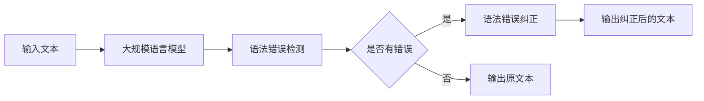

# 大规模语言模型在自动语法纠错中的应用

> 关键词：大规模语言模型、自动语法纠错、自然语言处理、Transformer、预训练模型

> 摘要：本文深入探讨了大规模语言模型在自动语法纠错中的应用。首先介绍了相关背景，包括目的范围、预期读者等内容。接着阐述了核心概念与联系，分析了核心算法原理并给出具体操作步骤，同时借助数学模型和公式详细讲解。通过项目实战展示了代码实际案例及详细解释。还探讨了实际应用场景，推荐了相关工具和资源。最后总结了未来发展趋势与挑战，解答常见问题并提供扩展阅读和参考资料，旨在全面剖析大规模语言模型在自动语法纠错领域的应用，为相关研究和实践提供参考。

## 1. 背景介绍 
### 1.1 目的和范围
自动语法纠错是自然语言处理领域的一个重要任务，其目的在于检测和纠正文本中的语法错误，提高文本的质量和可读性。随着信息技术的飞速发展，人们每天都会产生大量的文本数据，这些文本中不可避免地会存在各种语法错误。大规模语言模型的出现为自动语法纠错带来了新的机遇和挑战。本文的范围主要聚焦于大规模语言模型在自动语法纠错中的应用，包括其核心概念、算法原理、实际案例以及未来发展趋势等方面。

### 1.2 预期读者
本文预期读者包括自然语言处理领域的研究人员、开发者、对人工智能和语言技术感兴趣的学生以及相关行业的从业者。通过阅读本文，读者可以深入了解大规模语言模型在自动语法纠错中的工作原理和应用方法，为进一步的研究和实践提供参考。

### 1.3 文档结构概述
本文共分为十个部分。第一部分为背景介绍，阐述了文章的目的、预期读者和文档结构。第二部分介绍核心概念与联系，包括大规模语言模型和自动语法纠错的基本原理和架构。第三部分详细讲解核心算法原理和具体操作步骤，并给出Python源代码示例。第四部分介绍数学模型和公式，并进行详细讲解和举例说明。第五部分通过项目实战展示代码实际案例和详细解释。第六部分探讨实际应用场景。第七部分推荐相关的工具和资源。第八部分总结未来发展趋势与挑战。第九部分为附录，解答常见问题。第十部分提供扩展阅读和参考资料。

### 1.4 术语表
#### 1.4.1 核心术语定义
- **大规模语言模型**：基于海量文本数据进行训练的语言模型，通常具有数十亿甚至上万亿的参数，能够学习到丰富的语言知识和模式。
- **自动语法纠错**：利用计算机技术自动检测和纠正文本中语法错误的过程。
- **Transformer**：一种基于注意力机制的深度学习架构，在自然语言处理领域取得了显著的成果。
- **预训练模型**：在大规模无监督数据上进行预训练的模型，能够学习到通用的语言表示，然后在特定任务上进行微调。

#### 1.4.2 相关概念解释
- **注意力机制**：一种能够自动关注输入序列中不同部分的机制，使得模型能够更好地捕捉序列中的长距离依赖关系。
- **微调**：在预训练模型的基础上，使用特定任务的标注数据对模型进行进一步训练，以适应具体的任务需求。
- **语言表示**：将文本转换为计算机能够处理的向量表示，使得模型能够对文本进行分析和处理。

#### 1.4.3 缩略词列表
- **NLP**：Natural Language Processing（自然语言处理）
- **LM**：Language Model（语言模型）
- **GPT**：Generative Pretrained Transformer（生成式预训练Transformer）
- **BERT**：Bidirectional Encoder Representations from Transformers（基于Transformer的双向编码器表示）

## 2. 核心概念与联系 
### 2.1 大规模语言模型原理
大规模语言模型通常基于Transformer架构，Transformer架构由编码器和解码器组成。编码器负责对输入序列进行特征提取，解码器则根据编码器的输出生成目标序列。Transformer的核心是注意力机制，通过注意力机制，模型能够自动关注输入序列中不同部分的重要性，从而更好地捕捉序列中的长距离依赖关系。

下面是Transformer架构的文本示意图：

```plaintext
输入序列 -> 嵌入层 -> 编码器（多个编码器层） -> 解码器（多个解码器层） -> 输出序列
```

### 2.2 自动语法纠错原理
自动语法纠错的基本原理是首先对输入文本进行语法错误检测，然后根据检测结果对错误进行纠正。大规模语言模型在自动语法纠错中主要通过学习大量的文本数据，掌握语言的语法规则和模式，从而能够对输入文本进行分析和判断，找出其中的语法错误并进行纠正。

### 2.3 两者的联系
大规模语言模型为自动语法纠错提供了强大的语言理解和生成能力。通过预训练，大规模语言模型能够学习到丰富的语言知识和模式，这些知识和模式可以用于语法错误的检测和纠正。同时，自动语法纠错任务也可以作为大规模语言模型的一个应用场景，通过在该任务上进行微调，进一步提高模型的性能。

### 2.4 Mermaid流程图


## 3. 核心算法原理 & 具体操作步骤 
### 3.1 核心算法原理
大规模语言模型在自动语法纠错中通常采用基于序列到序列（Seq2Seq）的模型结构。Seq2Seq模型由编码器和解码器组成，编码器将输入文本编码为一个固定长度的向量表示，解码器则根据这个向量表示生成纠正后的文本。

在训练过程中，模型通过最小化预测结果与真实标签之间的损失函数来学习语法规则和模式。常用的损失函数包括交叉熵损失函数。

### 3.2 具体操作步骤
1. **数据准备**：收集包含语法错误的文本数据，并对其进行标注，生成训练集、验证集和测试集。
2. **模型选择**：选择合适的大规模语言模型，如GPT、BERT等。
3. **模型微调**：在训练集上对预训练模型进行微调，使其适应自动语法纠错任务。
4. **模型评估**：在验证集和测试集上对微调后的模型进行评估，计算准确率、召回率等指标。
5. **模型部署**：将训练好的模型部署到实际应用中，进行语法纠错。

### 3.3 Python源代码示例
```python
import torch
from transformers import AutoTokenizer, AutoModelForSeq2SeqLM

# 加载预训练模型和分词器
tokenizer = AutoTokenizer.from_pretrained("t5-base")
model = AutoModelForSeq2SeqLM.from_pretrained("t5-base")

# 输入文本
input_text = "I is a student."

# 对输入文本进行编码
input_ids = tokenizer.encode("grammar_correction: " + input_text, return_tensors="pt")

# 生成纠正后的文本
output_ids = model.generate(input_ids)
output_text = tokenizer.decode(output_ids[0], skip_special_tokens=True)

print("输入文本:", input_text)
print("纠正后的文本:", output_text)
```

## 4. 数学模型和公式 & 详细讲解 & 举例说明 
### 4.1 交叉熵损失函数
交叉熵损失函数是一种常用的损失函数，用于衡量模型预测结果与真实标签之间的差异。对于一个分类问题，假设模型的预测概率分布为 $p(y|x)$，真实标签的概率分布为 $q(y|x)$，则交叉熵损失函数定义为：

$$H(p,q)=-\sum_{y}q(y|x)\log p(y|x)$$

在自动语法纠错任务中，我们可以将每个可能的纠正结果看作一个类别，通过交叉熵损失函数来训练模型。

### 4.2 注意力机制公式
注意力机制的核心是计算注意力分数，用于衡量输入序列中不同部分的重要性。注意力分数的计算通常使用点积注意力机制，公式如下：

$$Attention(Q,K,V)=\text{softmax}\left(\frac{QK^T}{\sqrt{d_k}}\right)V$$

其中，$Q$ 是查询矩阵，$K$ 是键矩阵，$V$ 是值矩阵，$d_k$ 是键向量的维度。

### 4.3 举例说明
假设我们有一个输入序列 $x=[x_1,x_2,x_3]$，对应的查询矩阵 $Q$、键矩阵 $K$ 和值矩阵 $V$ 分别为：

$$Q=\begin{bmatrix}q_1\\q_2\\q_3\end{bmatrix}, K=\begin{bmatrix}k_1\\k_2\\k_3\end{bmatrix}, V=\begin{bmatrix}v_1\\v_2\\v_3\end{bmatrix}$$

首先计算注意力分数：

$$\text{scores}=\frac{QK^T}{\sqrt{d_k}}=\begin{bmatrix}q_1\cdot k_1/\sqrt{d_k}&q_1\cdot k_2/\sqrt{d_k}&q_1\cdot k_3/\sqrt{d_k}\\q_2\cdot k_1/\sqrt{d_k}&q_2\cdot k_2/\sqrt{d_k}&q_2\cdot k_3/\sqrt{d_k}\\q_3\cdot k_1/\sqrt{d_k}&q_3\cdot k_2/\sqrt{d_k}&q_3\cdot k_3/\sqrt{d_k}\end{bmatrix}$$

然后对注意力分数进行 softmax 操作，得到注意力权重：

$$\text{weights}=\text{softmax}(\text{scores})$$

最后根据注意力权重计算输出：

$$\text{output}=\text{weights}V$$

## 5. 项目实战：代码实际案例和详细解释说明 
### 5.1 开发环境搭建
1. **安装Python**：确保你的系统中已经安装了Python 3.6或更高版本。
2. **安装依赖库**：使用以下命令安装所需的依赖库：
```sh
pip install torch transformers
```

### 5.2 源代码详细实现和代码解读
```python
import torch
from transformers import AutoTokenizer, AutoModelForSeq2SeqLM

# 加载预训练模型和分词器
tokenizer = AutoTokenizer.from_pretrained("t5-base")
model = AutoModelForSeq2SeqLM.from_pretrained("t5-base")

# 输入文本
input_text = "I is a student."

# 对输入文本进行编码
# 在输入文本前添加任务提示 "grammar_correction: "，告诉模型这是一个语法纠错任务
input_ids = tokenizer.encode("grammar_correction: " + input_text, return_tensors="pt")

# 生成纠正后的文本
# 使用模型的 generate 方法生成输出序列
output_ids = model.generate(input_ids)
# 对生成的输出序列进行解码，得到纠正后的文本
output_text = tokenizer.decode(output_ids[0], skip_special_tokens=True)

print("输入文本:", input_text)
print("纠正后的文本:", output_text)
```

### 5.3 代码解读与分析
1. **加载预训练模型和分词器**：使用 `AutoTokenizer.from_pretrained` 和 `AutoModelForSeq2SeqLM.from_pretrained` 方法加载预训练的 T5 模型和对应的分词器。
2. **输入文本编码**：在输入文本前添加任务提示 `grammar_correction: `，然后使用分词器将输入文本编码为模型可以接受的输入格式。
3. **生成纠正后的文本**：使用模型的 `generate` 方法生成输出序列，然后使用分词器对输出序列进行解码，得到纠正后的文本。

## 6. 实际应用场景 
### 6.1 教育领域
在教育领域，自动语法纠错系统可以帮助学生检查作文、作业中的语法错误，提高学生的写作水平。教师可以使用这些系统快速批改学生的作业，节省时间和精力。

### 6.2 内容创作
在内容创作领域，自动语法纠错系统可以帮助作者检查文章中的语法错误，提高文章的质量。特别是在新闻、博客等领域，快速准确的语法纠错可以提高内容的可信度和专业性。

### 6.3 智能客服
在智能客服领域，自动语法纠错系统可以帮助客服人员准确理解用户的问题，提高客服效率和质量。同时，也可以帮助用户纠正输入中的语法错误，提高沟通效果。

### 6.4 翻译领域
在翻译领域，自动语法纠错系统可以帮助翻译人员检查源语言和目标语言中的语法错误，提高翻译的准确性和质量。

## 7. 工具和资源推荐
### 7.1 学习资源推荐
#### 7.1.1 书籍推荐
- 《自然语言处理入门》：介绍了自然语言处理的基本概念和方法，适合初学者阅读。
- 《深度学习》：全面介绍了深度学习的理论和实践，对于理解大规模语言模型的原理有很大帮助。
- 《基于Transformer的自然语言处理》：专门介绍了Transformer架构在自然语言处理中的应用，是学习大规模语言模型的重要参考书籍。

#### 7.1.2 在线课程
- Coursera上的“Natural Language Processing Specialization”：由知名教授授课，系统介绍了自然语言处理的各个方面。
- edX上的“Deep Learning for Natural Language Processing”：深入讲解了深度学习在自然语言处理中的应用，包括大规模语言模型的原理和实践。

#### 7.1.3 技术博客和网站
- Hugging Face博客：提供了关于大规模语言模型和自然语言处理的最新研究成果和实践经验。
- Medium上的自然语言处理相关博客：有很多专业人士分享的关于自然语言处理的技术文章和案例分析。

### 7.2 开发工具框架推荐
#### 7.2.1 IDE和编辑器
- PyCharm：功能强大的Python集成开发环境，适合进行大规模语言模型的开发和调试。
- Jupyter Notebook：交互式的开发环境，方便进行代码的测试和演示。

#### 7.2.2 调试和性能分析工具
- TensorBoard：用于可视化深度学习模型的训练过程和性能指标。
- PyTorch Profiler：用于分析PyTorch模型的性能瓶颈，优化模型的运行效率。

#### 7.2.3 相关框架和库
- Transformers：Hugging Face开发的用于自然语言处理的框架，提供了丰富的预训练模型和工具。
- PyTorch：深度学习框架，广泛应用于大规模语言模型的开发和训练。

### 7.3 相关论文著作推荐
#### 7.3.1 经典论文
- “Attention Is All You Need”：介绍了Transformer架构的原理和实现，是大规模语言模型的重要基础。
- “BERT: Pre-training of Deep Bidirectional Transformers for Language Understanding”：提出了BERT模型，开创了预训练模型在自然语言处理中的应用先河。

#### 7.3.2 最新研究成果
- 关注ACL、EMNLP等自然语言处理领域的顶级会议，了解最新的研究成果和技术进展。

#### 7.3.3 应用案例分析
- 可以参考一些实际应用大规模语言模型进行自动语法纠错的案例分析，了解模型在实际场景中的应用效果和优化方法。

## 8. 总结：未来发展趋势与挑战
### 8.1 未来发展趋势
- **模型规模不断增大**：随着计算资源的不断提升，大规模语言模型的参数规模将继续增大，模型的性能也将不断提高。
- **多模态融合**：将语言信息与图像、音频等多模态信息进行融合，提高自动语法纠错的准确性和实用性。
- **个性化纠错**：根据用户的语言习惯和历史数据，提供个性化的语法纠错服务。

### 8.2 挑战
- **计算资源需求大**：大规模语言模型的训练和推理需要大量的计算资源，这限制了模型的应用范围。
- **数据隐私和安全问题**：大规模语言模型的训练需要大量的文本数据，这些数据可能包含用户的隐私信息，需要解决数据隐私和安全问题。
- **语义理解的局限性**：虽然大规模语言模型在语法纠错方面取得了很大的进展，但在语义理解方面仍然存在一定的局限性，需要进一步提高模型的语义理解能力。

## 9. 附录：常见问题与解答
### 9.1 大规模语言模型在自动语法纠错中的准确率如何？
大规模语言模型在自动语法纠错中的准确率受到多种因素的影响，如模型的规模、训练数据的质量和数量、任务的复杂度等。一般来说，随着模型规模的增大和训练数据的增多，模型的准确率会不断提高。但在一些复杂的语法错误和语义理解方面，模型的准确率仍然有待提高。

### 9.2 如何选择适合的大规模语言模型进行自动语法纠错？
选择适合的大规模语言模型需要考虑多个因素，如模型的性能、计算资源需求、任务的复杂度等。一般来说，可以选择一些在自然语言处理领域取得较好效果的预训练模型，如GPT、BERT等，然后在具体任务上进行微调。

### 9.3 大规模语言模型在自动语法纠错中的训练时间和计算资源需求如何？
大规模语言模型的训练时间和计算资源需求通常比较大。训练时间取决于模型的规模、训练数据的数量和复杂度等因素，可能需要数天甚至数周的时间。计算资源需求主要包括GPU的数量和内存大小等，需要根据具体情况进行选择。

## 10. 扩展阅读 & 参考资料
### 10.1 扩展阅读
- 可以阅读一些关于自然语言处理和深度学习的最新研究成果和技术文章，了解该领域的最新发展趋势。
- 参与相关的技术社区和论坛，与其他专业人士进行交流和讨论。

### 10.2 参考资料
- Hugging Face官方文档：https://huggingface.co/docs
- PyTorch官方文档：https://pytorch.org/docs/stable/index.html
- ACL、EMNLP等自然语言处理领域的顶级会议论文集。