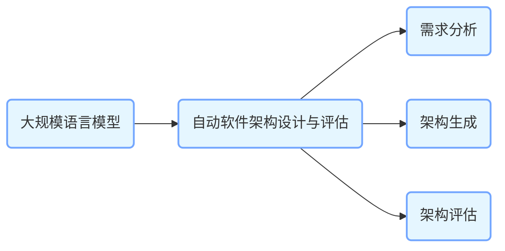

# 大规模语言模型在自动软件架构设计与评估中的应用

> 关键词：大规模语言模型、自动软件架构设计、软件架构评估、人工智能、软件工程

> 摘要：本文深入探讨了大规模语言模型在自动软件架构设计与评估中的应用。首先介绍了相关背景，包括目的、预期读者、文档结构等内容。接着阐述了核心概念及联系，详细讲解了大规模语言模型的原理与架构。在算法原理部分，使用 Python 代码进行了详细阐述。同时给出了相关数学模型和公式，并结合实际例子进行说明。通过项目实战展示了如何将大规模语言模型应用于自动软件架构设计与评估，包括开发环境搭建、源代码实现与解读。还介绍了其实际应用场景，推荐了相关的学习资源、开发工具框架和论文著作。最后总结了未来发展趋势与挑战，提供了常见问题解答和参考资料，旨在为相关领域的研究和实践提供全面且深入的指导。

## 1. 背景介绍 
### 1.1 目的和范围
在当今软件开发领域，软件系统的规模和复杂度不断增加，软件架构设计与评估的重要性日益凸显。传统的软件架构设计与评估方法往往依赖于人工经验，存在效率低、主观性强等问题。大规模语言模型作为人工智能领域的重要成果，具有强大的自然语言处理能力和知识推理能力，为自动软件架构设计与评估提供了新的思路和方法。

本文的目的在于深入探讨大规模语言模型在自动软件架构设计与评估中的应用，详细介绍其原理、方法和实践案例，为软件开发人员、研究人员提供全面的技术参考。范围涵盖大规模语言模型的基本概念、相关算法原理、数学模型，以及在实际项目中的应用案例和工具资源推荐等方面。

### 1.2 预期读者
本文预期读者包括软件开发工程师、软件架构师、人工智能研究人员、计算机科学专业的学生以及对自动软件架构设计与评估感兴趣的技术爱好者。通过阅读本文，读者可以了解大规模语言模型在该领域的应用现状和发展趋势，掌握相关的技术原理和实践方法。

### 1.3 文档结构概述
本文共分为 10 个部分。第一部分为背景介绍，阐述了文章的目的、预期读者和文档结构。第二部分介绍核心概念与联系，包括大规模语言模型、自动软件架构设计与评估的基本概念及它们之间的关系。第三部分讲解核心算法原理及具体操作步骤，使用 Python 代码进行详细说明。第四部分给出数学模型和公式，并进行详细讲解和举例。第五部分是项目实战，包括开发环境搭建、源代码实现与解读。第六部分介绍实际应用场景。第七部分推荐相关的工具和资源，包括学习资源、开发工具框架和论文著作。第八部分总结未来发展趋势与挑战。第九部分是附录，提供常见问题与解答。第十部分为扩展阅读和参考资料。

### 1.4 术语表
#### 1.4.1 核心术语定义
- **大规模语言模型**：是一种基于深度学习的自然语言处理模型，通过在大规模文本数据上进行训练，学习语言的统计规律和语义信息，能够生成自然流畅的文本、回答问题、进行知识推理等。
- **自动软件架构设计**：指利用计算机技术和算法，自动生成满足特定需求的软件架构的过程。
- **软件架构评估**：对软件架构的质量、性能、可维护性、可扩展性等方面进行分析和评价的过程。

#### 1.4.2 相关概念解释
- **自然语言处理**：是人工智能领域的一个重要分支，研究如何让计算机理解和处理人类语言，包括文本分类、情感分析、机器翻译等任务。
- **深度学习**：是一种基于人工神经网络的机器学习方法，通过构建多层神经网络模型，自动学习数据中的特征和模式。
- **软件工程**：是一门研究用工程化方法构建和维护有效、实用和高质量的软件的学科，包括软件需求分析、设计、开发、测试、维护等过程。

#### 1.4.3 缩略词列表
- **LLM**：大规模语言模型（Large Language Model）
- **AI**：人工智能（Artificial Intelligence）
- **NLP**：自然语言处理（Natural Language Processing）
- **ML**：机器学习（Machine Learning）

## 2. 核心概念与联系 

### 大规模语言模型原理
大规模语言模型通常基于Transformer架构，Transformer架构由编码器和解码器组成，其中编码器负责对输入的文本进行特征提取和编码，解码器负责根据编码器的输出生成相应的文本。

Transformer架构的核心是自注意力机制（Self-Attention），自注意力机制允许模型在处理输入序列时，关注序列中不同位置的信息，从而捕捉长距离依赖关系。自注意力机制的计算过程如下：
1. 对于输入序列中的每个位置，将其表示为一个向量。
2. 计算该位置向量与其他位置向量之间的相似度得分。
3. 根据相似度得分对其他位置向量进行加权求和，得到该位置的上下文表示。

### 自动软件架构设计与评估的概念
自动软件架构设计是根据软件需求和约束条件，自动生成软件架构的过程。软件架构通常包括软件的模块划分、模块之间的交互关系、数据流向等信息。自动软件架构设计的目标是生成满足需求、具有良好质量属性的软件架构。

软件架构评估是对软件架构的质量、性能、可维护性、可扩展性等方面进行分析和评价的过程。评估的方法包括基于模型的评估、基于场景的评估、基于度量的评估等。软件架构评估的目的是发现软件架构中存在的问题，为软件架构的优化和改进提供依据。

### 大规模语言模型与自动软件架构设计与评估的联系
大规模语言模型可以在自动软件架构设计与评估中发挥重要作用。在自动软件架构设计方面，大规模语言模型可以根据自然语言描述的软件需求，生成相应的软件架构设计方案。通过学习大量的软件架构设计文档和代码示例，大规模语言模型可以理解软件架构的设计原则和模式，从而生成合理的设计方案。

在软件架构评估方面，大规模语言模型可以对软件架构文档进行分析和理解，提取关键信息，评估软件架构的质量属性。例如，大规模语言模型可以分析软件架构的模块划分是否合理、模块之间的依赖关系是否清晰、是否满足可维护性和可扩展性要求等。

### 文本示意图
```plaintext
+----------------------+         +----------------------+
| 大规模语言模型       |         | 自动软件架构设计与评估 |
+----------------------+         +----------------------+
| - Transformer架构     |         | - 需求分析           |
| - 自注意力机制       |         | - 架构生成           |
| - 预训练与微调       |         | - 架构评估           |
+----------------------+         +----------------------+
           |                                   |
           |  提供自然语言处理能力和知识推理能力 |
           |                                   |
           v                                   v
+-----------------------------------------------------+
| 自动软件架构设计与评估系统                            |
+-----------------------------------------------------+
```

### Mermaid 流程图


## 3. 核心算法原理 & 具体操作步骤 

### 大规模语言模型的核心算法 - Transformer
Transformer 是大规模语言模型的核心架构，下面我们将详细介绍 Transformer 的算法原理，并使用 Python 代码进行实现。

#### Transformer 架构概述
Transformer 架构主要由编码器（Encoder）和解码器（Decoder）组成。编码器负责对输入的文本进行编码，提取文本的特征表示；解码器负责根据编码器的输出和之前生成的文本，生成下一个词。

#### 自注意力机制
自注意力机制是 Transformer 架构的核心组件，它允许模型在处理输入序列时，关注序列中不同位置的信息。自注意力机制的计算步骤如下：
1. 对于输入序列中的每个位置，将其表示为一个向量。
2. 计算该位置向量与其他位置向量之间的相似度得分。
3. 根据相似度得分对其他位置向量进行加权求和，得到该位置的上下文表示。

#### Python 代码实现
```python
import torch
import torch.nn as nn
import torch.nn.functional as F

class SelfAttention(nn.Module):
    def __init__(self, input_dim, output_dim, num_heads):
        super(SelfAttention, self).__init__()
        self.input_dim = input_dim
        self.output_dim = output_dim
        self.num_heads = num_heads
        self.head_dim = output_dim // num_heads

        self.query = nn.Linear(input_dim, output_dim)
        self.key = nn.Linear(input_dim, output_dim)
        self.value = nn.Linear(input_dim, output_dim)
        self.out = nn.Linear(output_dim, output_dim)

    def forward(self, x):
        batch_size, seq_len, _ = x.size()

        # 计算 Q, K, V
        Q = self.query(x).view(batch_size, seq_len, self.num_heads, self.head_dim).transpose(1, 2)
        K = self.key(x).view(batch_size, seq_len, self.num_heads, self.head_dim).transpose(1, 2)
        V = self.value(x).view(batch_size, seq_len, self.num_heads, self.head_dim).transpose(1, 2)

        # 计算注意力分数
        scores = torch.matmul(Q, K.transpose(-2, -1)) / (self.head_dim ** 0.5)
        attention = F.softmax(scores, dim=-1)

        # 计算加权和
        out = torch.matmul(attention, V)
        out = out.transpose(1, 2).contiguous().view(batch_size, seq_len, self.output_dim)

        # 线性变换
        out = self.out(out)
        return out
```

#### 具体操作步骤
1. **数据预处理**：将输入的文本数据进行分词、编码等处理，转换为模型可以接受的输入格式。
2. **模型初始化**：初始化 Transformer 模型的参数，包括编码器、解码器、自注意力机制等组件的参数。
3. **前向传播**：将预处理后的输入数据输入到模型中，进行前向传播计算，得到模型的输出。
4. **损失计算**：根据模型的输出和真实标签，计算损失函数。
5. **反向传播**：根据损失函数，进行反向传播计算，更新模型的参数。
6. **模型评估**：使用测试数据对训练好的模型进行评估，计算模型的性能指标。

## 4. 数学模型和公式 & 详细讲解 & 举例说明 

### 自注意力机制的数学模型
自注意力机制的核心是计算注意力分数和加权和。假设输入序列为 $X = [x_1, x_2, \cdots, x_n]$，其中 $x_i$ 是第 $i$ 个位置的向量表示。

#### 计算 Q, K, V
首先，通过线性变换将输入向量 $x_i$ 转换为查询向量 $q_i$、键向量 $k_i$ 和值向量 $v_i$：
$$
Q = XW^Q \\
K = XW^K \\
V = XW^V
$$
其中，$W^Q$、$W^K$、$W^V$ 是可学习的权重矩阵。

#### 计算注意力分数
注意力分数表示查询向量 $q_i$ 与键向量 $k_j$ 之间的相似度：
$$
\text{score}(q_i, k_j) = \frac{q_i^T k_j}{\sqrt{d_k}}
$$
其中，$d_k$ 是键向量的维度。

#### 计算注意力分布
将注意力分数进行 softmax 操作，得到注意力分布：
$$
\text{attention}(i, j) = \frac{\exp(\text{score}(q_i, k_j))}{\sum_{k=1}^n \exp(\text{score}(q_i, k_k))}
$$

#### 计算加权和
根据注意力分布，对值向量进行加权求和，得到输出向量：
$$
\text{output}_i = \sum_{j=1}^n \text{attention}(i, j) v_j
$$

### 多头自注意力机制的数学模型
多头自注意力机制通过多个头并行计算自注意力，增加模型的表达能力。假设多头自注意力机制有 $h$ 个头，每个头的维度为 $d_{head}$，则：
$$
\text{MultiHead}(Q, K, V) = \text{Concat}(\text{head}_1, \cdots, \text{head}_h)W^O
$$
其中，$\text{head}_i = \text{Attention}(QW_i^Q, KW_i^K, VW_i^V)$，$W_i^Q$、$W_i^K$、$W_i^V$ 是第 $i$ 个头的权重矩阵，$W^O$ 是输出的权重矩阵。

### 举例说明
假设输入序列 $X = [x_1, x_2, x_3]$，其中 $x_i \in \mathbb{R}^4$，$W^Q, W^K, W^V \in \mathbb{R}^{4 \times 3}$。

1. **计算 Q, K, V**
$$
Q = XW^Q = \begin{bmatrix} x_1^T \\ x_2^T \\ x_3^T \end{bmatrix} W^Q \\
K = XW^K = \begin{bmatrix} x_1^T \\ x_2^T \\ x_3^T \end{bmatrix} W^K \\
V = XW^V = \begin{bmatrix} x_1^T \\ x_2^T \\ x_3^T \end{bmatrix} W^V
$$

2. **计算注意力分数**
以 $q_1$ 为例：
$$
\text{score}(q_1, k_1) = \frac{q_1^T k_1}{\sqrt{3}} \\
\text{score}(q_1, k_2) = \frac{q_1^T k_2}{\sqrt{3}} \\
\text{score}(q_1, k_3) = \frac{q_1^T k_3}{\sqrt{3}}
$$

3. **计算注意力分布**
$$
\text{attention}(1, 1) = \frac{\exp(\text{score}(q_1, k_1))}{\exp(\text{score}(q_1, k_1)) + \exp(\text{score}(q_1, k_2)) + \exp(\text{score}(q_1, k_3))} \\
\text{attention}(1, 2) = \frac{\exp(\text{score}(q_1, k_2))}{\exp(\text{score}(q_1, k_1)) + \exp(\text{score}(q_1, k_2)) + \exp(\text{score}(q_1, k_3))} \\
\text{attention}(1, 3) = \frac{\exp(\text{score}(q_1, k_3))}{\exp(\text{score}(q_1, k_1)) + \exp(\text{score}(q_1, k_2)) + \exp(\text{score}(q_1, k_3))}
$$

4. **计算加权和**
$$
\text{output}_1 = \text{attention}(1, 1) v_1 + \text{attention}(1, 2) v_2 + \text{attention}(1, 3) v_3
$$

## 5. 项目实战：代码实际案例和详细解释说明 

### 5.1  开发环境搭建
#### 硬件环境
- **CPU**：Intel Core i7 及以上
- **GPU**：NVIDIA GeForce GTX 1080 及以上（可选，用于加速训练过程）
- **内存**：16GB 及以上

#### 软件环境
- **操作系统**：Windows 10、Ubuntu 18.04 及以上
- **Python**：3.7 及以上
- **深度学习框架**：PyTorch 1.7 及以上

#### 安装依赖库
```bash
pip install torch torchvision
pip install transformers
```

### 5.2  源代码详细实现和代码解读
```python
import torch
from transformers import AutoTokenizer, AutoModelForCausalLM

# 加载预训练的语言模型和分词器
tokenizer = AutoTokenizer.from_pretrained("gpt2")
model = AutoModelForCausalLM.from_pretrained("gpt2")

# 定义软件需求描述
software_requirement = "设计一个简单的图书管理系统，实现图书的添加、删除、查询功能。"

# 对需求描述进行分词
input_ids = tokenizer.encode(software_requirement, return_tensors="pt")

# 生成软件架构设计方案
output = model.generate(input_ids, max_length=200, num_beams=5, no_repeat_ngram_size=2, early_stopping=True)

# 解码生成的文本
architecture_design = tokenizer.decode(output[0], skip_special_tokens=True)

print("软件架构设计方案：")
print(architecture_design)
```

### 5.3  代码解读与分析
1. **加载预训练的语言模型和分词器**：使用 `transformers` 库加载预训练的 GPT-2 语言模型和对应的分词器。
2. **定义软件需求描述**：将软件需求以自然语言的形式进行描述。
3. **对需求描述进行分词**：使用分词器将需求描述转换为模型可以接受的输入格式。
4. **生成软件架构设计方案**：使用模型的 `generate` 方法，根据输入的需求描述生成软件架构设计方案。
5. **解码生成的文本**：使用分词器将模型生成的输出解码为自然语言文本。

### 代码优化与扩展
- **调整生成参数**：可以调整 `generate` 方法的参数，如 `max_length`、`num_beams` 等，以控制生成文本的长度和质量。
- **多轮交互**：可以实现多轮交互，让用户对生成的架构设计方案进行反馈和修改，进一步优化设计方案。
- **结合领域知识**：可以将领域知识融入到模型中，提高生成的架构设计方案的专业性和实用性。

## 6. 实际应用场景 

### 快速原型设计
在软件开发的早期阶段，快速原型设计可以帮助开发团队快速验证软件的可行性和需求的合理性。大规模语言模型可以根据用户的需求描述，快速生成软件架构设计方案，为快速原型设计提供指导。例如，在开发一个电商应用时，开发团队可以使用大规模语言模型生成电商应用的架构设计方案，包括用户界面、业务逻辑、数据存储等方面的设计，然后根据设计方案快速搭建原型系统。

### 架构评估与优化
在软件架构设计完成后，需要对架构进行评估和优化，以确保架构的质量和性能。大规模语言模型可以对软件架构文档进行分析和理解，提取关键信息，评估架构的质量属性，如可维护性、可扩展性、性能等。例如，大规模语言模型可以分析架构的模块划分是否合理、模块之间的依赖关系是否清晰、是否存在性能瓶颈等问题，并给出相应的优化建议。

### 代码生成与重构
大规模语言模型可以根据软件架构设计方案生成相应的代码，提高开发效率。例如，在设计一个数据库应用时，大规模语言模型可以根据数据库架构设计方案生成创建数据库表、插入数据、查询数据等操作的代码。此外，大规模语言模型还可以对现有代码进行重构，优化代码结构和性能。

### 智能辅助开发
在软件开发过程中，开发人员可能会遇到各种问题，如语法错误、逻辑错误、性能问题等。大规模语言模型可以作为智能辅助工具，帮助开发人员解决这些问题。例如，开发人员可以向大规模语言模型提问，获取代码示例、调试建议、性能优化方案等信息。

## 7. 工具和资源推荐
### 7.1 学习资源推荐
#### 7.1.1 书籍推荐
- 《深度学习》（Deep Learning）：由 Ian Goodfellow、Yoshua Bengio 和 Aaron Courville 合著，是深度学习领域的经典教材，介绍了深度学习的基本原理、算法和应用。
- 《Python 深度学习》（Deep Learning with Python）：由 Francois Chollet 著，是一本介绍如何使用 Python 和 Keras 进行深度学习的实践指南。
- 《自然语言处理入门》（Natural Language Processing with Python）：由 Steven Bird、Ewan Klein 和 Edward Loper 合著，介绍了自然语言处理的基本概念、算法和工具。

#### 7.1.2 在线课程
- Coursera 上的《深度学习专项课程》（Deep Learning Specialization）：由 Andrew Ng 教授授课，包括深度学习基础、卷积神经网络、循环神经网络等内容。
- edX 上的《自然语言处理》（Natural Language Processing）：由 Columbia University 提供，介绍了自然语言处理的基本原理、算法和应用。
- 哔哩哔哩上的《动手学深度学习》（Dive into Deep Learning）：由李沐等作者讲解，结合代码实践，深入介绍深度学习的理论和应用。

#### 7.1.3 技术博客和网站
- Medium：是一个技术博客平台，有许多关于深度学习、自然语言处理等领域的优秀文章。
- Towards Data Science：是一个专注于数据科学和机器学习的技术博客，提供了大量的技术文章和案例分析。
- arXiv：是一个预印本论文库，包含了许多最新的学术研究成果，包括大规模语言模型、自动软件架构设计等领域的研究。

### 7.2 开发工具框架推荐
#### 7.2.1 IDE和编辑器
- PyCharm：是一款专门为 Python 开发设计的集成开发环境，提供了代码编辑、调试、版本控制等功能。
- Visual Studio Code：是一款轻量级的代码编辑器，支持多种编程语言，具有丰富的插件生态系统。
- Jupyter Notebook：是一个交互式的开发环境，适合进行数据分析、机器学习等实验和开发。

#### 7.2.2 调试和性能分析工具
- PyTorch Profiler：是 PyTorch 提供的性能分析工具，可以帮助开发人员分析模型的性能瓶颈，优化模型的训练和推理速度。
- TensorBoard：是 TensorFlow 提供的可视化工具，可以帮助开发人员可视化模型的训练过程、性能指标等信息。
- cProfile：是 Python 标准库中的性能分析工具，可以帮助开发人员分析 Python 代码的性能瓶颈。

#### 7.2.3 相关框架和库
- PyTorch：是一个开源的深度学习框架，提供了丰富的神经网络层、优化器、损失函数等组件，支持 GPU 加速。
- Transformers：是 Hugging Face 开发的自然语言处理库，提供了多种预训练的语言模型，如 GPT-2、BERT 等，方便开发人员进行自然语言处理任务。
- scikit-learn：是一个开源的机器学习库，提供了多种机器学习算法和工具，如分类、回归、聚类等。

### 7.3 相关论文著作推荐
#### 7.3.1 经典论文
- 《Attention Is All You Need》：介绍了 Transformer 架构，是大规模语言模型的核心架构。
- 《BERT: Pre-training of Deep Bidirectional Transformers for Language Understanding》：介绍了 BERT 模型，是自然语言处理领域的重要突破。
- 《GPT-3: Language Models are Few-Shot Learners》：介绍了 GPT-3 模型，展示了大规模语言模型在少样本学习方面的强大能力。

#### 7.3.2 最新研究成果
- 《Improving Language Understanding by Generative Pre-Training》：介绍了 GPT 系列模型的预训练方法，提高了语言模型的理解能力。
- 《XLNet: Generalized Autoregressive Pretraining for Language Understanding》：提出了 XLNet 模型，结合了自回归和自编码的优点。
- 《T5: Exploring the Limits of Transfer Learning with a Unified Text-to-Text Transformer》：提出了 T5 模型，将所有自然语言处理任务统一为文本到文本的转换任务。

#### 7.3.3 应用案例分析
- 《Automated Software Architecture Design Using Deep Learning》：介绍了如何使用深度学习技术进行自动软件架构设计的应用案例。
- 《Evaluating Software Architectures with Machine Learning》：介绍了如何使用机器学习技术进行软件架构评估的应用案例。
- 《Applying Large Language Models in Software Engineering》：介绍了大规模语言模型在软件工程领域的应用案例和实践经验。

## 8. 总结：未来发展趋势与挑战
### 未来发展趋势
#### 模型性能不断提升
随着计算资源的不断增加和算法的不断优化，大规模语言模型的性能将不断提升。模型的参数规模将不断增大，语言理解和生成能力将更加出色，能够处理更加复杂和多样化的自然语言任务。

#### 与领域知识深度融合
未来的大规模语言模型将更加注重与领域知识的深度融合。通过将领域知识融入到模型的训练和推理过程中，模型可以更好地理解和处理特定领域的自然语言任务，如医疗、金融、法律等领域的软件架构设计与评估。

#### 多模态融合
大规模语言模型将与图像、音频、视频等多模态数据进行融合，实现更加丰富和全面的信息处理。例如，在软件架构设计中，可以结合图像和文本信息，更加直观地展示软件架构的设计方案。

#### 智能协作与交互
大规模语言模型将与人类开发者实现更加智能的协作与交互。模型可以作为智能助手，帮助开发者进行需求分析、架构设计、代码生成等工作，并根据开发者的反馈不断优化和改进。

### 挑战
#### 数据隐私和安全问题
大规模语言模型的训练需要大量的数据，这些数据可能包含用户的隐私信息。如何保护数据的隐私和安全，防止数据泄露和滥用，是一个亟待解决的问题。

#### 模型可解释性问题
大规模语言模型通常是基于深度学习的黑盒模型，其决策过程和推理逻辑难以解释。在软件架构设计与评估等关键领域，模型的可解释性至关重要，如何提高模型的可解释性是一个挑战。

#### 计算资源需求问题
大规模语言模型的训练和推理需要大量的计算资源，如 GPU、TPU 等。如何降低模型的计算资源需求，提高模型的效率和可扩展性，是一个需要解决的问题。

#### 伦理和社会问题
大规模语言模型的应用可能会带来一些伦理和社会问题，如虚假信息传播、偏见和歧视等。如何引导大规模语言模型的正确应用，避免其带来的负面影响，是一个需要关注的问题。

## 9. 附录：常见问题与解答
### 1. 大规模语言模型在自动软件架构设计与评估中的准确性如何保证？
可以通过以下方法保证准确性：
- **数据质量**：使用高质量的训练数据，包括软件架构设计文档、代码示例、评估报告等。
- **模型选择和调优**：选择合适的大规模语言模型，并对模型进行调优，如调整超参数、进行预训练和微调等。
- **人工审核和验证**：对模型生成的软件架构设计方案和评估结果进行人工审核和验证，确保其准确性和合理性。

### 2. 大规模语言模型在处理复杂软件架构设计与评估任务时是否有效？
大规模语言模型在处理复杂软件架构设计与评估任务时具有一定的有效性，但也存在一定的局限性。对于复杂任务，模型可能无法完全理解任务的需求和约束条件，生成的设计方案和评估结果可能存在偏差。可以结合领域知识和人工经验，对模型的输出进行补充和修正，提高处理复杂任务的能力。

### 3. 如何将大规模语言模型集成到现有的软件开发流程中？
可以按照以下步骤将大规模语言模型集成到现有的软件开发流程中：
- **需求分析阶段**：使用大规模语言模型对用户需求进行分析和理解，生成初步的软件架构设计方案。
- **设计阶段**：根据模型生成的设计方案，结合领域知识和人工经验，进行详细的软件架构设计。
- **开发阶段**：使用大规模语言模型生成代码示例，辅助开发人员进行代码编写。
- **评估阶段**：使用大规模语言模型对软件架构进行评估，发现潜在的问题和风险。

### 4. 大规模语言模型的训练成本高吗？
大规模语言模型的训练成本通常较高，主要包括计算资源成本、数据收集和预处理成本、时间成本等。训练大规模语言模型需要大量的 GPU 或 TPU 资源，并且需要花费大量的时间进行训练。可以使用预训练的模型进行微调，降低训练成本。

## 10. 扩展阅读 & 参考资料
### 扩展阅读
- 《人工智能：现代方法》（Artificial Intelligence: A Modern Approach）：介绍了人工智能的基本概念、算法和应用，是人工智能领域的经典教材。
- 《软件架构实践》（Software Architecture in Practice）：介绍了软件架构的设计、评估和演化等方面的实践经验和方法。
- 《深度学习实战》（Deep Learning in Practice）：结合实际案例，介绍了深度学习在各个领域的应用和实践经验。

### 参考资料
- Hugging Face 官方文档：https://huggingface.co/docs
- PyTorch 官方文档：https://pytorch.org/docs/stable/index.html
- arXiv 预印本论文库：https://arxiv.org/
- IEEE Xplore 数字图书馆：https://ieeexplore.ieee.org/
- ACM Digital Library：https://dl.acm.org/