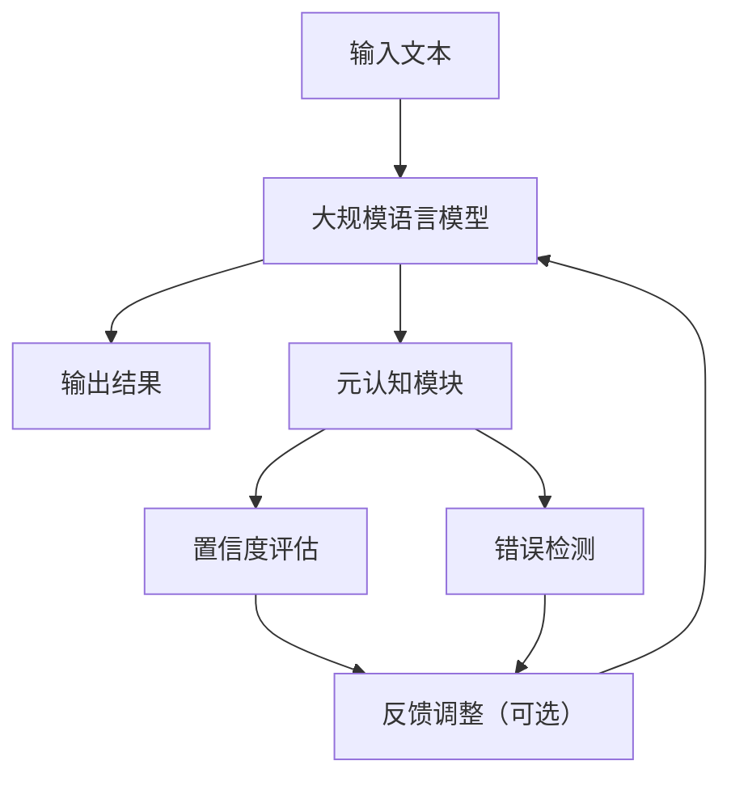

# 大规模语言模型的元认知能力评估与增强

> 关键词：大规模语言模型、元认知能力、评估、增强、人工智能

> 摘要：本文聚焦于大规模语言模型的元认知能力评估与增强这一前沿领域。首先介绍了相关背景，包括目的、预期读者、文档结构和术语表。接着阐述了大规模语言模型元认知能力的核心概念与联系，给出了原理和架构的示意图及流程图。详细讲解了核心算法原理，通过Python代码进行说明，并介绍了相关数学模型和公式。通过项目实战展示了代码实现与解读。探讨了实际应用场景，推荐了学习资源、开发工具框架以及相关论文著作。最后总结了未来发展趋势与挑战，提供了常见问题解答和扩展阅读参考资料，旨在为深入理解和提升大规模语言模型的元认知能力提供全面的技术指导。

## 1. 背景介绍 
### 1.1 目的和范围
随着大规模语言模型（LLMs）如GPT - 3、BERT等的广泛应用，其在各种自然语言处理任务中展现出了强大的能力。然而，这些模型是否具备元认知能力，即对自身知识和认知过程的认识与监控，成为了研究的热点。本文的目的在于深入探讨大规模语言模型元认知能力的评估方法和增强策略。范围涵盖了元认知能力的理论基础、评估指标和方法、增强技术以及实际应用案例等方面。

### 1.2 预期读者
本文预期读者包括人工智能领域的研究人员、开发者、学生以及对大规模语言模型技术感兴趣的专业人士。对于希望深入了解大规模语言模型元认知能力的读者，本文将提供全面的技术知识和实践指导。

### 1.3 文档结构概述
本文共分为十个部分。背景介绍部分阐述了研究的目的、预期读者和文档结构；核心概念与联系部分介绍了大规模语言模型元认知能力的基本概念和架构；核心算法原理 & 具体操作步骤部分详细讲解了评估和增强元认知能力的算法；数学模型和公式部分给出了相关的数学描述和示例；项目实战部分通过具体代码案例展示了如何实现元认知能力的评估和增强；实际应用场景部分探讨了元认知能力在不同领域的应用；工具和资源推荐部分推荐了学习、开发和研究所需的资源；总结部分分析了未来发展趋势与挑战；附录部分解答了常见问题；扩展阅读 & 参考资料部分提供了进一步学习的参考。

### 1.4 术语表
#### 1.4.1 核心术语定义
- **大规模语言模型（Large - Scale Language Model, LLM）**：指基于大规模语料库进行训练的语言模型，通常具有数十亿甚至数万亿的参数，能够处理各种自然语言处理任务，如文本生成、问答系统等。
- **元认知能力（Metacognitive Ability）**：是指个体对自己的认知过程和结果的意识和控制能力。在大规模语言模型中，元认知能力表现为模型对自身知识的理解、对任务执行情况的监控以及对错误的识别和纠正能力。
- **评估指标（Evaluation Metrics）**：用于衡量大规模语言模型元认知能力的量化指标，如置信度评估的准确性、错误检测的召回率等。
- **增强策略（Enhancement Strategy）**：旨在提高大规模语言模型元认知能力的方法和技术，如模型微调、引入外部知识等。

#### 1.4.2 相关概念解释
- **自我评估（Self - Assessment）**：大规模语言模型对自身输出的正确性和可靠性进行评估的过程。
- **错误检测（Error Detection）**：模型识别自身输出中错误的能力。
- **知识校准（Knowledge Calibration）**：调整模型对自身知识的置信度，使其与实际知识水平相匹配的过程。

#### 1.4.3 缩略词列表
- **LLM**：Large - Scale Language Model（大规模语言模型）
- **NLP**：Natural Language Processing（自然语言处理）
- **GPT**：Generative Pretrained Transformer（生成式预训练变换器）
- **BERT**：Bidirectional Encoder Representations from Transformers（基于变换器的双向编码器表示）

## 2. 核心概念与联系 

### 大规模语言模型元认知能力的原理
大规模语言模型的元认知能力可以从认知心理学的角度来理解。在人类认知中，元认知包括元认知知识和元认知监控两个方面。在大规模语言模型中，元认知知识可以看作是模型对自身知识结构和能力边界的了解，而元认知监控则是模型在执行任务过程中对自身状态和输出的实时监测。

模型通过对输入文本的处理，生成输出结果。同时，它还会对这个输出结果进行评估，判断其正确性和可靠性。例如，在问答系统中，模型不仅要给出答案，还要评估自己对这个答案的置信度。如果置信度较低，模型可能会提示用户其答案的不确定性。

### 架构的文本示意图
```plaintext
输入文本 -> 大规模语言模型 -> 输出结果
               |
               v
        元认知模块
               |
               v
        置信度评估、错误检测等
               |
               v
        反馈调整（可选）
```
在这个架构中，输入文本首先进入大规模语言模型进行处理，生成输出结果。元认知模块对输出结果进行分析，进行置信度评估、错误检测等操作。根据评估结果，模型可以选择进行反馈调整，以提高后续输出的质量。

### Mermaid 流程图

这个流程图清晰地展示了大规模语言模型元认知能力的工作流程。输入文本经过模型处理后得到输出结果，元认知模块对输出进行评估，根据评估结果可以进行反馈调整，从而形成一个闭环的优化过程。

## 3. 核心算法原理 & 具体操作步骤 

### 置信度评估算法
置信度评估是大规模语言模型元认知能力的重要组成部分。一种常见的方法是基于模型的概率输出。以基于Transformer架构的语言模型为例，模型在生成每个词时会输出一个概率分布，表示每个词在当前位置出现的概率。我们可以通过计算输出序列的概率来评估模型对整个输出的置信度。

以下是一个简单的Python代码示例，用于计算一个句子的置信度：
```python
import torch
import transformers

# 加载预训练的语言模型
tokenizer = transformers.GPT2Tokenizer.from_pretrained('gpt2')
model = transformers.GPT2LMHeadModel.from_pretrained('gpt2')

def calculate_confidence(sentence):
    # 对句子进行分词
    input_ids = tokenizer.encode(sentence, return_tensors='pt')
    # 模型前向传播
    with torch.no_grad():
        outputs = model(input_ids)
        logits = outputs.logits
    # 计算每个词的概率
    probabilities = torch.softmax(logits, dim=-1)
    # 取出每个位置的预测词的概率
    seq_probabilities = []
    for i in range(input_ids.shape[1] - 1):
        token_prob = probabilities[0, i, input_ids[0, i + 1]].item()
        seq_probabilities.append(token_prob)
    # 计算整个句子的置信度
    confidence = 1
    for prob in seq_probabilities:
        confidence *= prob
    return confidence

# 测试句子
sentence = "The sun rises in the east."
confidence = calculate_confidence(sentence)
print(f"句子的置信度: {confidence}")
```
### 具体操作步骤
1. **加载预训练模型和分词器**：使用`transformers`库加载预训练的语言模型和对应的分词器。
2. **对输入句子进行分词**：将输入的句子转换为模型可以处理的输入ID。
3. **模型前向传播**：将输入ID输入到模型中，得到模型的输出。
4. **计算概率分布**：对模型的输出进行softmax操作，得到每个词的概率分布。
5. **计算句子置信度**：取出每个位置预测词的概率，将它们相乘得到整个句子的置信度。

### 错误检测算法
错误检测可以通过比较模型的输出与一些基准数据或规则来实现。例如，在语法检查任务中，我们可以使用语法规则库来检测模型输出中的语法错误。

以下是一个简单的语法错误检测代码示例：
```python
import language_tool_python

# 初始化语法检查工具
tool = language_tool_python.LanguageTool('en-US')

def detect_errors(sentence):
    matches = tool.check(sentence)
    if matches:
        return True
    return False

# 测试句子
sentence = "The sun rise in the east."
has_error = detect_errors(sentence)
print(f"句子是否有错误: {has_error}")
```
### 具体操作步骤
1. **初始化语法检查工具**：使用`language_tool_python`库初始化一个语法检查工具。
2. **检查句子**：将输入的句子传入语法检查工具，得到检查结果。
3. **判断是否有错误**：如果检查结果不为空，则说明句子存在错误。

## 4. 数学模型和公式 & 详细讲解 & 举例说明 

### 置信度评估的数学模型
设一个句子 $S = [w_1, w_2, \cdots, w_n]$ ，其中 $w_i$ 表示句子中的第 $i$ 个词。模型在生成第 $i + 1$ 个词时，会输出一个概率分布 $P(w_{i+1}|w_1, w_2, \cdots, w_i)$ ，表示在已知前 $i$ 个词的情况下，第 $i + 1$ 个词为 $w_{i+1}$ 的概率。

整个句子的置信度 $C(S)$ 可以表示为：
$$C(S)=\prod_{i = 1}^{n - 1}P(w_{i+1}|w_1, w_2, \cdots, w_i)$$

例如，对于句子 "The sun rises in the east."，假设模型在生成 "sun" 时，在已知 "The" 的情况下，"sun" 的概率为 $P(\text{sun}|\text{The}) = 0.8$ ；在生成 "rises" 时，在已知 "The sun" 的情况下，"rises" 的概率为 $P(\text{rises}|\text{The sun}) = 0.9$ ，以此类推。则整个句子的置信度为这些概率的乘积。

### 错误检测的数学模型
错误检测可以看作是一个二分类问题。设 $x$ 为模型的输出句子，$y$ 为标签，$y = 1$ 表示句子存在错误，$y = 0$ 表示句子没有错误。我们可以使用一个分类器 $f(x)$ 来判断句子是否有错误，分类器的输出 $f(x)$ 可以表示为：
$$f(x)=\begin{cases}1, & \text{如果 } x \text{ 被判定为有错误}\\0, & \text{如果 } x \text{ 被判定为没有错误}\end{cases}$$

分类器的准确性可以用准确率（Accuracy）来衡量：
$$\text{Accuracy}=\frac{\text{正确分类的样本数}}{\text{总样本数}}$$

例如，我们有一个包含100个句子的数据集，其中50个句子有错误，50个句子没有错误。分类器正确分类了80个句子，则准确率为 $\frac{80}{100}=0.8$ 。

## 5. 项目实战：代码实际案例和详细解释说明 

### 5.1  开发环境搭建
#### 安装Python
首先，确保你已经安装了Python 3.6或更高版本。可以从Python官方网站（https://www.python.org/downloads/）下载并安装。

#### 安装必要的库
使用`pip`命令安装所需的库：
```sh
pip install torch transformers language_tool_python
```
`torch`是PyTorch深度学习框架，`transformers`是Hugging Face提供的用于处理预训练模型的库，`language_tool_python`是用于语法检查的库。

### 5.2  源代码详细实现和代码解读
以下是一个完整的项目代码示例，用于评估大规模语言模型的元认知能力并进行错误检测：
```python
import torch
import transformers
import language_tool_python

# 加载预训练的语言模型
tokenizer = transformers.GPT2Tokenizer.from_pretrained('gpt2')
model = transformers.GPT2LMHeadModel.from_pretrained('gpt2')

# 初始化语法检查工具
tool = language_tool_python.LanguageTool('en-US')

def calculate_confidence(sentence):
    # 对句子进行分词
    input_ids = tokenizer.encode(sentence, return_tensors='pt')
    # 模型前向传播
    with torch.no_grad():
        outputs = model(input_ids)
        logits = outputs.logits
    # 计算每个词的概率
    probabilities = torch.softmax(logits, dim=-1)
    # 取出每个位置的预测词的概率
    seq_probabilities = []
    for i in range(input_ids.shape[1] - 1):
        token_prob = probabilities[0, i, input_ids[0, i + 1]].item()
        seq_probabilities.append(token_prob)
    # 计算整个句子的置信度
    confidence = 1
    for prob in seq_probabilities:
        confidence *= prob
    return confidence

def detect_errors(sentence):
    matches = tool.check(sentence)
    if matches:
        return True
    return False

# 测试句子
sentences = [
    "The sun rises in the east.",
    "The sun rise in the east."
]

for sentence in sentences:
    confidence = calculate_confidence(sentence)
    has_error = detect_errors(sentence)
    print(f"句子: {sentence}")
    print(f"置信度: {confidence}")
    print(f"是否有错误: {has_error}")
    print()
```
### 代码解读与分析
1. **加载模型和工具**：使用`transformers`库加载预训练的GPT - 2模型和分词器，使用`language_tool_python`库初始化语法检查工具。
2. **置信度评估函数**：`calculate_confidence`函数用于计算句子的置信度。它首先对句子进行分词，然后将分词后的输入ID输入到模型中，得到模型的输出。通过对输出进行softmax操作，计算每个词的概率，最后将这些概率相乘得到整个句子的置信度。
3. **错误检测函数**：`detect_errors`函数用于检测句子中的语法错误。它将句子传入语法检查工具，根据检查结果判断句子是否有错误。
4. **测试部分**：定义了一个包含两个句子的列表，分别对每个句子进行置信度评估和错误检测，并输出结果。

## 6. 实际应用场景 
### 智能问答系统
在智能问答系统中，大规模语言模型的元认知能力可以提高回答的准确性和可靠性。模型可以对自己给出的答案进行置信度评估，如果置信度较低，系统可以提示用户答案的不确定性，或者提供多个可能的答案供用户选择。同时，错误检测功能可以帮助系统及时发现并纠正回答中的错误，提高用户体验。

### 自动写作辅助
在自动写作过程中，模型可以实时监测自己生成的文本，进行语法检查和逻辑判断。如果发现错误或不合理的地方，模型可以自动进行修正或提供修改建议。例如，在写作一篇文章时，模型可以对段落的连贯性、句子的语法正确性等进行评估，帮助作者提高写作质量。

### 教育领域
在教育领域，大规模语言模型的元认知能力可以用于智能辅导系统。模型可以评估学生的回答，判断其正确性和完整性，并提供相应的反馈和指导。例如，在英语语法练习中，模型可以检测学生的句子是否存在语法错误，并解释错误原因，帮助学生提高语言能力。

## 7. 工具和资源推荐
### 7.1 学习资源推荐
#### 7.1.1 书籍推荐
- 《深度学习》（Deep Learning）：由Ian Goodfellow、Yoshua Bengio和Aaron Courville所著，是深度学习领域的经典教材，涵盖了神经网络、优化算法等基础知识。
- 《自然语言处理入门》（Natural Language Processing with Python）：介绍了使用Python进行自然语言处理的基本方法和技术，包括分词、词性标注、命名实体识别等。
- 《人工智能：一种现代方法》（Artificial Intelligence: A Modern Approach）：全面介绍了人工智能的各个领域，包括搜索算法、机器学习、知识表示等。

#### 7.1.2 在线课程
- Coursera上的“深度学习专项课程”（Deep Learning Specialization）：由Andrew Ng教授授课，包括神经网络、卷积神经网络、循环神经网络等内容。
- edX上的“自然语言处理”（Natural Language Processing）：介绍了自然语言处理的基本概念和方法，以及最新的研究成果。
- 哔哩哔哩上有许多关于大规模语言模型和人工智能的教学视频，可以根据自己的需求进行选择。

#### 7.1.3 技术博客和网站
- Hugging Face博客（https://huggingface.co/blog）：提供了关于预训练模型、自然语言处理技术的最新研究和应用案例。
- Medium上的人工智能和自然语言处理相关博客：有许多专业人士分享的技术文章和经验。
- arXiv（https://arxiv.org/）：是一个预印本平台，提供了大量的学术论文，包括大规模语言模型的最新研究成果。

### 7.2 开发工具框架推荐
#### 7.2.1 IDE和编辑器
- PyCharm：是一款专门为Python开发设计的集成开发环境，具有代码自动补全、调试等功能。
- Visual Studio Code：是一款轻量级的代码编辑器，支持多种编程语言，有丰富的插件可以扩展功能。
- Jupyter Notebook：是一个交互式的开发环境，适合进行数据分析和模型实验。

#### 7.2.2 调试和性能分析工具
- PyTorch Profiler：是PyTorch提供的性能分析工具，可以帮助开发者分析模型的运行时间、内存使用等情况。
- TensorBoard：是TensorFlow提供的可视化工具，也可以用于PyTorch模型的可视化和性能分析。
- cProfile：是Python内置的性能分析工具，可以分析Python代码的执行时间和函数调用情况。

#### 7.2.3 相关框架和库
- PyTorch：是一个开源的深度学习框架，提供了丰富的神经网络层和优化算法，易于使用和扩展。
- TensorFlow：是另一个广泛使用的深度学习框架，具有强大的分布式训练和部署能力。
- Hugging Face Transformers：是一个用于处理预训练模型的库，提供了多种预训练的语言模型，如GPT - 2、BERT等。

### 7.3 相关论文著作推荐
#### 7.3.1 经典论文
- "Attention Is All You Need"：介绍了Transformer架构，是现代大规模语言模型的基础。
- "BERT: Pre - training of Deep Bidirectional Transformers for Language Understanding"：提出了BERT模型，在自然语言处理任务中取得了很好的效果。
- "GPT: Generative Pretrained Transformer"：介绍了GPT模型的原理和训练方法。

#### 7.3.2 最新研究成果
- 关注arXiv上关于大规模语言模型元认知能力的最新论文，了解该领域的最新研究进展。
- 阅读顶级学术会议（如ACL、NeurIPS等）上的相关论文，获取最新的技术和方法。

#### 7.3.3 应用案例分析
- 可以在相关的技术博客和研究报告中找到大规模语言模型元认知能力在不同领域的应用案例，学习其实现方法和经验教训。

## 8. 总结：未来发展趋势与挑战
### 未来发展趋势
- **更强的元认知能力**：未来的大规模语言模型将具备更强大的元认知能力，能够更准确地评估自己的知识和能力，更好地处理不确定性和错误。
- **多模态元认知**：除了文本信息，模型将能够结合图像、音频等多模态信息进行元认知，提高对复杂场景的理解和处理能力。
- **个性化元认知**：根据用户的需求和偏好，模型可以提供个性化的元认知服务，如个性化的错误提示和学习建议。

### 挑战
- **数据质量和标注**：元认知能力的评估和增强需要大量高质量的数据和标注，数据的获取和标注成本较高。
- **计算资源需求**：训练和优化大规模语言模型需要巨大的计算资源，如何降低计算成本是一个挑战。
- **伦理和安全问题**：随着模型元认知能力的增强，如何确保模型的行为符合伦理和安全标准是一个重要问题，如避免模型产生有害的建议或偏见。

## 9. 附录：常见问题与解答
### 问题1：大规模语言模型的元认知能力和人类的元认知能力有什么区别？
答：人类的元认知能力是基于复杂的生物神经系统和长期的学习经验形成的，具有高度的灵活性和适应性。而大规模语言模型的元认知能力是通过算法和数据训练得到的，目前还比较局限，主要集中在对知识的置信度评估和错误检测等方面。

### 问题2：如何提高大规模语言模型的元认知能力？
答：可以通过以下方法提高模型的元认知能力：引入更多的监督信号，如置信度标签；进行模型微调，使其更好地适应元认知任务；引入外部知识，如知识图谱，帮助模型更好地理解和评估自身知识。

### 问题3：元认知能力对大规模语言模型的性能有什么影响？
答：元认知能力可以提高模型的可靠性和准确性。通过对自身输出的评估和监控，模型可以及时发现并纠正错误，提供更合理的回答。同时，元认知能力也可以帮助模型更好地处理不确定性，提高用户体验。

## 10. 扩展阅读 & 参考资料
### 扩展阅读
- 《元认知：改变大脑的顽固思维》：从心理学角度深入介绍了元认知的概念和应用。
- 《人工智能哲学》：探讨了人工智能领域的哲学问题，包括模型的认知能力和意识等方面。

### 参考资料
- Hugging Face官方文档（https://huggingface.co/docs）
- PyTorch官方文档（https://pytorch.org/docs/stable/index.html）
- 相关学术论文和研究报告

以上就是关于大规模语言模型的元认知能力评估与增强的详细介绍，希望对读者有所帮助。在未来的研究和实践中，我们可以不断探索和创新，提高大规模语言模型的元认知能力，推动人工智能技术的发展。