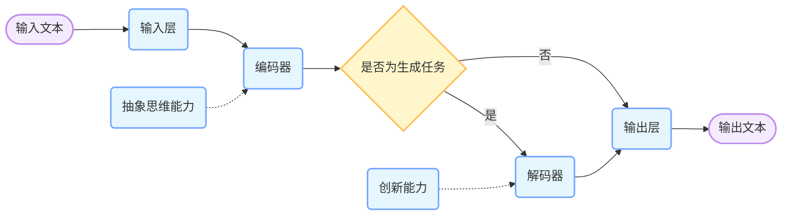

# 大规模语言模型的抽象思维与创新能力培养

> 关键词：大规模语言模型、抽象思维、创新能力培养、人工智能、自然语言处理、机器学习、Transformer架构

> 摘要：本文聚焦于大规模语言模型的抽象思维与创新能力培养这一前沿课题。首先介绍了研究的背景、目的、预期读者和文档结构等内容。接着深入阐述了大规模语言模型、抽象思维和创新能力等核心概念及其联系，并给出相应的文本示意图和Mermaid流程图。详细讲解了核心算法原理，包括基于Transformer架构的算法，同时用Python源代码进行说明。通过数学模型和公式对其工作机制进行了深入剖析，并举例说明。在项目实战部分，提供了开发环境搭建步骤、源代码实现与解读。探讨了大规模语言模型在多个实际场景中的应用，推荐了相关的学习资源、开发工具框架以及论文著作。最后总结了未来发展趋势与挑战，解答了常见问题，并给出扩展阅读和参考资料，旨在为相关领域的研究和实践提供全面而深入的指导。

## 1. 背景介绍 
### 1.1 目的和范围
近年来，大规模语言模型在自然语言处理领域取得了显著的进展，如GPT系列、BERT等模型在文本生成、问答系统、机器翻译等任务中表现出色。然而，目前的大规模语言模型在抽象思维和创新能力方面仍存在一定的局限性。本研究的目的在于深入探讨如何培养大规模语言模型的抽象思维与创新能力，以提升其在复杂任务中的表现和应用价值。

本研究的范围涵盖了大规模语言模型的核心概念、算法原理、数学模型，以及通过项目实战来验证培养方法的有效性。同时，分析其在实际场景中的应用，并推荐相关的学习资源和开发工具。

### 1.2 预期读者
本文预期读者包括人工智能领域的研究人员、开发者、学生，以及对大规模语言模型感兴趣的技术爱好者。对于研究人员，本文可提供新的研究思路和方法；对于开发者，可帮助其在实际项目中应用相关技术；对于学生，能作为学习大规模语言模型的参考资料；对于技术爱好者，可增进对该领域的理解和认识。

### 1.3 文档结构概述
本文共分为十个部分。第一部分为背景介绍，阐述研究的目的、范围、预期读者和文档结构。第二部分介绍核心概念与联系，包括大规模语言模型、抽象思维和创新能力的定义和相互关系，并给出示意图和流程图。第三部分讲解核心算法原理和具体操作步骤，用Python代码详细说明。第四部分通过数学模型和公式深入剖析其工作机制，并举例说明。第五部分进行项目实战，包括开发环境搭建、源代码实现和解读。第六部分探讨实际应用场景。第七部分推荐相关的学习资源、开发工具框架和论文著作。第八部分总结未来发展趋势与挑战。第九部分为附录，解答常见问题。第十部分提供扩展阅读和参考资料。

### 1.4 术语表
#### 1.4.1 核心术语定义
- **大规模语言模型**：基于深度学习技术，通过在大规模文本数据上进行训练得到的语言模型，具有强大的语言理解和生成能力。
- **抽象思维**：指从具体的语言数据中提取一般性的概念、模式和规律的能力。
- **创新能力**：在语言处理任务中，能够生成新颖、有创意的文本内容的能力。
- **Transformer架构**：一种基于自注意力机制的深度学习架构，广泛应用于大规模语言模型的构建。
- **自注意力机制**：一种能够让模型在处理序列数据时，自动关注序列中不同位置元素之间关系的机制。

#### 1.4.2 相关概念解释
- **预训练**：在大规模无监督文本数据上对语言模型进行训练，以学习通用的语言知识和模式。
- **微调**：在预训练的基础上，针对特定的任务，使用少量的有监督数据对模型进行进一步训练，以提高模型在该任务上的性能。
- **注意力分数**：在自注意力机制中，用于衡量序列中不同位置元素之间相关性的数值。

#### 1.4.3 缩略词列表
- **NLP**：自然语言处理（Natural Language Processing）
- **GPT**：生成式预训练变压器（Generative Pretrained Transformer）
- **BERT**：双向编码器表示来自变换器（Bidirectional Encoder Representations from Transformers）
- **RNN**：循环神经网络（Recurrent Neural Network）
- **LSTM**：长短期记忆网络（Long Short-Term Memory）

## 2. 核心概念与联系 

### 核心概念原理
#### 大规模语言模型
大规模语言模型是基于深度学习的自然语言处理模型，其核心思想是通过在大规模文本数据上进行训练，学习语言的统计规律和语义信息。这些模型通常采用神经网络架构，如Transformer架构，能够处理变长的文本序列，并生成自然流畅的文本。

#### 抽象思维
抽象思维是指从具体的语言数据中提取一般性的概念、模式和规律的能力。在大规模语言模型中，抽象思维体现在模型能够理解文本的语义结构，识别不同文本之间的相似性和差异性，并从中归纳出一般性的知识。

#### 创新能力
创新能力是指在语言处理任务中，能够生成新颖、有创意的文本内容的能力。对于大规模语言模型来说，创新能力表现为能够在给定的语境下，生成与已有文本不同但又合理的文本，如创作故事、诗歌等。

### 架构的文本示意图
大规模语言模型的架构通常包括输入层、编码器、解码器（在生成任务中）和输出层。输入层将文本数据转换为模型能够处理的向量表示，编码器对输入的向量进行特征提取和表示学习，解码器根据编码器的输出生成目标文本，输出层将解码器的输出转换为最终的文本结果。

抽象思维和创新能力贯穿于整个模型的训练和推理过程。在训练过程中，模型通过学习大量的文本数据，逐渐形成抽象思维能力；在推理过程中，模型利用所学的知识和抽象思维能力，生成具有创新能力的文本。

### Mermaid流程图


该流程图展示了大规模语言模型的基本工作流程。输入文本首先经过输入层进行处理，然后进入编码器进行特征提取。如果是生成任务，编码器的输出将进入解码器进行文本生成；否则，直接进入输出层得到最终结果。抽象思维能力影响编码器的特征提取过程，创新能力影响解码器的文本生成过程。

## 3. 核心算法原理 & 具体操作步骤 

### 核心算法原理
目前，大规模语言模型大多基于Transformer架构，其核心是自注意力机制。自注意力机制能够让模型在处理序列数据时，自动关注序列中不同位置元素之间的关系，从而更好地捕捉文本的语义信息。

自注意力机制的计算过程如下：
1. 对于输入序列 $X = [x_1, x_2, \cdots, x_n]$，首先将其分别与三个可学习的权重矩阵 $W_Q$、$W_K$ 和 $W_V$ 相乘，得到查询向量 $Q$、键向量 $K$ 和值向量 $V$：
   - $Q = XW_Q$
   - $K = XW_K$
   - $V = XW_V$
2. 计算注意力分数：
   - 对于每个查询向量 $q_i$，计算其与所有键向量 $k_j$ 的点积，得到注意力分数 $a_{ij}$：
     - $a_{ij} = q_i^T k_j$
3. 对注意力分数进行归一化处理，得到注意力权重：
   - 使用softmax函数对注意力分数进行归一化，得到注意力权重 $\alpha_{ij}$：
     - $\alpha_{ij} = \frac{\exp(a_{ij})}{\sum_{k=1}^{n} \exp(a_{ik})}$
4. 根据注意力权重对值向量进行加权求和，得到输出向量 $y_i$：
   - $y_i = \sum_{j=1}^{n} \alpha_{ij} v_j$

### Python源代码实现
```python
import torch
import torch.nn as nn
import torch.nn.functional as F

class SelfAttention(nn.Module):
    def __init__(self, input_dim, output_dim):
        super(SelfAttention, self).__init__()
        self.W_Q = nn.Linear(input_dim, output_dim)
        self.W_K = nn.Linear(input_dim, output_dim)
        self.W_V = nn.Linear(input_dim, output_dim)

    def forward(self, x):
        Q = self.W_Q(x)
        K = self.W_K(x)
        V = self.W_V(x)

        attention_scores = torch.matmul(Q, K.transpose(-2, -1))
        attention_weights = F.softmax(attention_scores, dim=-1)
        output = torch.matmul(attention_weights, V)
        return output

# 示例使用
input_dim = 128
output_dim = 64
seq_length = 10
batch_size = 4

x = torch.randn(batch_size, seq_length, input_dim)
self_attention = SelfAttention(input_dim, output_dim)
output = self_attention(x)
print(output.shape)
```

### 具体操作步骤
1. **数据预处理**：将文本数据进行分词、编码等处理，转换为模型能够处理的向量表示。
2. **模型构建**：使用Transformer架构构建大规模语言模型，包括编码器和解码器。
3. **预训练**：在大规模无监督文本数据上对模型进行预训练，使用自监督学习任务，如掩码语言模型（Masked Language Model）。
4. **微调**：针对特定的任务，使用少量的有监督数据对模型进行微调，以提高模型在该任务上的性能。
5. **推理**：使用训练好的模型进行文本生成、问答等任务。

## 4. 数学模型和公式 & 详细讲解 & 举例说明 

### 数学模型和公式
#### 自注意力机制
如前所述，自注意力机制的核心公式如下：
- 查询向量 $Q$、键向量 $K$ 和值向量 $V$ 的计算：
  - $Q = XW_Q$
  - $K = XW_K$
  - $V = XW_V$
- 注意力分数 $a_{ij}$ 的计算：
  - $a_{ij} = q_i^T k_j$
- 注意力权重 $\alpha_{ij}$ 的计算：
  - $\alpha_{ij} = \frac{\exp(a_{ij})}{\sum_{k=1}^{n} \exp(a_{ik})}$
- 输出向量 $y_i$ 的计算：
  - $y_i = \sum_{j=1}^{n} \alpha_{ij} v_j$

#### 多头注意力机制
为了增强模型的表达能力，通常使用多头注意力机制。多头注意力机制将自注意力机制并行执行多次，然后将结果拼接起来。其公式如下：
- 第 $h$ 个头的输出：
  - $y_i^h = \text{SelfAttention}^h(x)$
- 多头注意力机制的输出：
  - $y_i = \text{Concat}(y_i^1, y_i^2, \cdots, y_i^H)W_O$
  其中，$H$ 是头的数量，$W_O$ 是可学习的权重矩阵。

### 详细讲解
自注意力机制的核心思想是通过计算查询向量和键向量之间的相似度，来确定每个位置的输入对其他位置的影响程度。注意力权重表示了这种影响程度，通过对值向量进行加权求和，得到最终的输出向量。

多头注意力机制通过并行执行多个自注意力头，能够捕捉不同的语义信息，从而增强模型的表达能力。每个头可以关注不同的方面，如语法结构、语义关系等。

### 举例说明
假设输入序列 $X = [x_1, x_2, x_3]$，其中 $x_i$ 是一个长度为 $d$ 的向量。经过自注意力机制的计算，我们可以得到每个位置的输出向量 $y_i$。

例如，当计算 $y_1$ 时，首先计算注意力分数 $a_{11}$、$a_{12}$ 和 $a_{13}$，表示 $x_1$ 与 $x_1$、$x_2$ 和 $x_3$ 之间的相关性。然后对注意力分数进行归一化处理，得到注意力权重 $\alpha_{11}$、$\alpha_{12}$ 和 $\alpha_{13}$。最后，根据注意力权重对值向量 $v_1$、$v_2$ 和 $v_3$ 进行加权求和，得到 $y_1$。

多头注意力机制则是将多个自注意力头的输出拼接起来，得到更丰富的语义信息。例如，第一个头可能关注文本的语法结构，第二个头可能关注文本的语义关系，通过将它们的输出拼接起来，模型能够更好地理解文本的含义。

## 5. 项目实战：代码实际案例和详细解释说明 

### 5.1  开发环境搭建
#### 操作系统
推荐使用Linux系统，如Ubuntu 18.04或更高版本，因为Linux系统在深度学习开发中具有良好的稳定性和兼容性。

#### 编程语言和框架
- **Python**：选择Python 3.7或更高版本，Python是深度学习开发中最常用的编程语言，具有丰富的库和工具。
- **PyTorch**：选择PyTorch 1.7或更高版本，PyTorch是一个开源的深度学习框架，具有动态图特性，方便模型的开发和调试。

#### 安装步骤
1. 安装Python：可以从Python官方网站下载并安装Python 3.7或更高版本。
2. 创建虚拟环境：使用`venv`或`conda`创建虚拟环境，以隔离项目的依赖。
```bash
# 使用venv创建虚拟环境
python -m venv myenv
source myenv/bin/activate

# 使用conda创建虚拟环境
conda create -n myenv python=3.8
conda activate myenv
```
3. 安装PyTorch：根据自己的CUDA版本和操作系统，从PyTorch官方网站选择合适的安装命令进行安装。
```bash
# 安装CPU版本的PyTorch
pip install torch torchvision torchaudio

# 安装CUDA版本的PyTorch
pip install torch torchvision torchaudio --extra-index-url https://download.pytorch.org/whl/cu113
```
4. 安装其他依赖库：安装一些常用的依赖库，如`transformers`、`numpy`、`pandas`等。
```bash
pip install transformers numpy pandas
```

### 5.2  源代码详细实现和代码解读
#### 任务描述
本项目的任务是使用大规模语言模型进行文本生成，我们将使用Hugging Face的`transformers`库来实现。

#### 代码实现
```python
from transformers import GPT2LMHeadModel, GPT2Tokenizer

# 加载预训练的模型和分词器
tokenizer = GPT2Tokenizer.from_pretrained('gpt2')
model = GPT2LMHeadModel.from_pretrained('gpt2')

# 输入文本
input_text = "Once upon a time"

# 对输入文本进行编码
input_ids = tokenizer.encode(input_text, return_tensors='pt')

# 生成文本
output = model.generate(input_ids, max_length=100, num_beams=5, no_repeat_ngram_size=2, early_stopping=True)

# 对生成的文本进行解码
generated_text = tokenizer.decode(output[0], skip_special_tokens=True)

print(generated_text)
```

#### 代码解读
1. **加载预训练的模型和分词器**：使用`GPT2Tokenizer`和`GPT2LMHeadModel`从Hugging Face的模型库中加载预训练的GPT-2模型和分词器。
2. **输入文本**：定义输入文本`input_text`，作为生成文本的起始点。
3. **编码输入文本**：使用分词器对输入文本进行编码，将其转换为模型能够处理的输入ID。
4. **生成文本**：使用`model.generate`方法生成文本，设置生成文本的最大长度、束搜索的束数、避免重复的n-gram大小等参数。
5. **解码生成的文本**：使用分词器对生成的文本ID进行解码，得到最终的文本结果。

### 5.3  代码解读与分析
#### 模型选择
选择GPT-2模型是因为它是一个强大的生成式语言模型，在文本生成任务中表现出色。`transformers`库提供了方便的接口，使得我们可以轻松地加载和使用预训练的模型。

#### 参数设置
- `max_length`：设置生成文本的最大长度，避免生成过长的文本。
- `num_beams`：束搜索的束数，束搜索是一种用于生成文本的搜索算法，增加束数可以提高生成文本的质量，但会增加计算时间。
- `no_repeat_ngram_size`：避免重复的n-gram大小，设置该参数可以防止生成的文本中出现重复的n-gram。
- `early_stopping`：是否提前停止生成，当生成的文本满足一定条件时，提前停止生成过程，以节省计算资源。

#### 性能分析
生成文本的性能受到多种因素的影响，如模型的大小、输入文本的质量、参数的设置等。在实际应用中，需要根据具体的任务和需求，选择合适的模型和参数，以达到最佳的生成效果。

## 6. 实际应用场景 
### 内容创作
大规模语言模型在内容创作领域具有广泛的应用，如文章写作、故事创作、诗歌创作等。模型可以根据给定的主题和要求，生成高质量的文本内容，为创作者提供灵感和参考。例如，新闻媒体可以使用语言模型生成新闻稿件的初稿，然后由编辑进行修改和完善；作家可以借助语言模型的创新能力，创作更富有想象力的故事和诗歌。

### 智能客服
在智能客服领域，大规模语言模型可以理解用户的问题，并生成准确、自然的回答。通过训练模型在大量的客服对话数据上，模型可以学习到常见问题的解决方案和回答方式，从而提高客服的效率和质量。例如，电商平台的智能客服可以使用语言模型快速响应用户的咨询，解决用户的问题。

### 机器翻译
大规模语言模型在机器翻译领域也取得了显著的进展。模型可以学习到不同语言之间的语义和语法关系，从而实现高质量的翻译。例如，谷歌翻译等翻译工具已经开始使用大规模语言模型来提高翻译的准确性和流畅性。

### 教育领域
在教育领域，大规模语言模型可以用于辅助教学、智能批改作业等。模型可以根据学生的问题提供详细的解答和指导，帮助学生更好地理解知识。例如，在线教育平台可以使用语言模型为学生提供个性化的学习建议和辅导。

## 7. 工具和资源推荐
### 7.1 学习资源推荐
#### 7.1.1 书籍推荐
- 《深度学习》（Deep Learning）：由Ian Goodfellow、Yoshua Bengio和Aaron Courville合著，是深度学习领域的经典教材，全面介绍了深度学习的基本概念、算法和应用。
- 《自然语言处理入门》（Natural Language Processing in Action）：由Jakub Adamczyk和Jan Kocon合著，适合初学者学习自然语言处理的基础知识和技术。
- 《Python自然语言处理》（Natural Language Processing with Python）：由Steven Bird、Ewan Klein和Edward Loper合著，介绍了使用Python进行自然语言处理的方法和工具。

#### 7.1.2 在线课程
- Coursera上的“深度学习专项课程”（Deep Learning Specialization）：由Andrew Ng教授授课，系统介绍了深度学习的理论和实践。
- edX上的“自然语言处理”（Natural Language Processing）：由哥伦比亚大学教授授课，深入讲解了自然语言处理的核心技术和算法。
- 哔哩哔哩上的“深度学习入门教程”：由一些知名博主制作，适合初学者快速入门深度学习。

#### 7.1.3 技术博客和网站
- Hugging Face博客：提供了关于大规模语言模型和自然语言处理的最新研究成果和技术应用。
- OpenAI博客：分享了OpenAI在人工智能领域的最新进展和研究成果。
- 机器之心：关注人工智能领域的前沿技术和应用，提供了丰富的技术文章和资讯。

### 7.2 开发工具框架推荐
#### 7.2.1 IDE和编辑器
- PyCharm：一款专业的Python集成开发环境，具有代码编辑、调试、版本控制等功能，适合大规模项目的开发。
- Visual Studio Code：一款轻量级的代码编辑器，支持多种编程语言和插件，适合快速开发和调试。
- Jupyter Notebook：一种交互式的编程环境，适合数据探索、模型训练和可视化。

#### 7.2.2 调试和性能分析工具
- TensorBoard：TensorFlow的可视化工具，可以用于监控模型的训练过程、查看模型的结构和性能指标。
- PyTorch Profiler：PyTorch的性能分析工具，可以帮助开发者找出模型训练和推理过程中的性能瓶颈。
- NVIDIA Nsight Systems：NVIDIA提供的性能分析工具，用于分析GPU的使用情况和性能瓶颈。

#### 7.2.3 相关框架和库
- Hugging Face Transformers：一个开源的自然语言处理库，提供了多种预训练的语言模型和工具，方便开发者进行模型的加载、微调和解码。
- AllenNLP：一个深度学习框架，专注于自然语言处理任务，提供了丰富的模型和工具，方便开发者进行模型的开发和实验。
- spaCy：一个高效的自然语言处理库，提供了快速的分词、词性标注、命名实体识别等功能，适合大规模文本数据的处理。

### 7.3 相关论文著作推荐
#### 7.3.1 经典论文
- “Attention Is All You Need”：提出了Transformer架构，是大规模语言模型的基础。
- “BERT: Pre-training of Deep Bidirectional Transformers for Language Understanding”：介绍了BERT模型，开创了预训练语言模型的先河。
- “Generative Pretrained Transformer 3 (GPT-3): Language Models are Few-Shot Learners”：介绍了GPT-3模型，展示了大规模语言模型在少样本学习中的强大能力。

#### 7.3.2 最新研究成果
- “Improving Language Understanding by Generative Pre-Training”：介绍了GPT系列模型的预训练方法和技术。
- “XLNet: Generalized Autoregressive Pretraining for Language Understanding”：提出了XLNet模型，改进了BERT模型的一些局限性。
- “T5: Exploring the Limits of Transfer Learning with a Unified Text-to-Text Transformer”：提出了T5模型，统一了自然语言处理任务的形式。

#### 7.3.3 应用案例分析
- “Using Large Language Models for Automated Essay Scoring”：介绍了使用大规模语言模型进行自动作文评分的应用案例。
- “Large Language Models for Customer Service: A Case Study”：分析了大规模语言模型在客户服务领域的应用案例和效果。
- “Machine Translation with Large Language Models: A Comparative Study”：比较了不同大规模语言模型在机器翻译任务中的性能和效果。

## 8. 总结：未来发展趋势与挑战
### 未来发展趋势
#### 模型规模不断增大
未来，大规模语言模型的规模可能会继续增大，以提高模型的性能和表达能力。更大的模型可以学习到更多的语言知识和模式，从而在各种自然语言处理任务中取得更好的效果。

#### 多模态融合
大规模语言模型将与图像、音频等其他模态的数据进行融合，实现多模态的自然语言处理。例如，模型可以同时处理文本和图像信息，进行图像描述生成、视觉问答等任务。

#### 个性化和定制化
未来的大规模语言模型将更加注重个性化和定制化，根据用户的需求和偏好，提供更加个性化的服务和内容。例如，智能写作助手可以根据用户的写作风格和需求，生成符合用户要求的文本内容。

#### 跨语言和跨文化应用
随着全球化的发展，大规模语言模型将在跨语言和跨文化应用中发挥重要作用。模型可以实现不同语言之间的翻译和交流，促进不同文化之间的理解和融合。

### 挑战
#### 计算资源需求
大规模语言模型的训练和推理需要大量的计算资源，包括GPU、TPU等。这对于研究机构和企业来说是一个巨大的挑战，需要投入大量的资金和人力来支持。

#### 数据隐私和安全
大规模语言模型的训练需要大量的数据，这些数据可能包含用户的隐私信息。因此，如何保护数据的隐私和安全是一个重要的问题。此外，模型的输出也可能存在虚假信息、偏见等问题，需要进行有效的监管和控制。

#### 可解释性和透明度
大规模语言模型通常是基于深度学习的黑盒模型，其决策过程和内部机制难以解释。这对于一些对可解释性要求较高的应用场景，如医疗、金融等，是一个挑战。如何提高模型的可解释性和透明度，是未来研究的一个重要方向。

#### 伦理和社会影响
大规模语言模型的发展可能会对社会产生深远的影响，如就业结构的变化、信息传播的方式等。因此，需要考虑模型的伦理和社会影响，制定相应的政策和法规，引导模型的健康发展。

## 9. 附录：常见问题与解答
### 问题1：大规模语言模型的训练时间通常需要多久？
大规模语言模型的训练时间取决于多个因素，如模型的规模、训练数据的大小、计算资源的配置等。一般来说，训练一个中等规模的语言模型可能需要数天到数周的时间，而训练一个大规模的语言模型可能需要数月甚至数年的时间。

### 问题2：如何评估大规模语言模型的抽象思维和创新能力？
目前，评估大规模语言模型的抽象思维和创新能力还没有统一的标准和方法。一些常用的评估指标包括文本生成的质量、多样性、新颖性等。此外，还可以通过人工评估的方式，让人类评判模型生成的文本是否具有抽象思维和创新能力。

### 问题3：大规模语言模型在实际应用中存在哪些局限性？
大规模语言模型在实际应用中存在一些局限性，如对输入文本的理解可能不够准确、生成的文本可能存在语法错误和逻辑问题、模型的输出可能受到训练数据的影响等。此外，模型的计算资源需求较大，部署和应用成本较高。

### 问题4：如何提高大规模语言模型的创新能力？
提高大规模语言模型的创新能力可以从多个方面入手，如增加训练数据的多样性、采用更复杂的模型架构、引入强化学习等技术、进行模型的微调等。此外，还可以通过设计合适的任务和评价指标，引导模型生成更具创新性的文本。

## 10. 扩展阅读 & 参考资料
### 扩展阅读
- 《人工智能：现代方法》（Artificial Intelligence: A Modern Approach）：全面介绍了人工智能的基本概念、算法和应用，是人工智能领域的经典教材。
- 《深度学习与自然语言处理》（Deep Learning for Natural Language Processing）：深入讲解了深度学习在自然语言处理中的应用和技术。
- 《自然语言处理前沿技术》（Advanced Natural Language Processing Techniques）：介绍了自然语言处理领域的最新研究成果和前沿技术。

### 参考资料
- Hugging Face官方文档：https://huggingface.co/docs
- PyTorch官方文档：https://pytorch.org/docs/stable/index.html
- OpenAI官方网站：https://openai.com/
- 相关学术会议和期刊，如ACL、EMNLP、NeurIPS等。