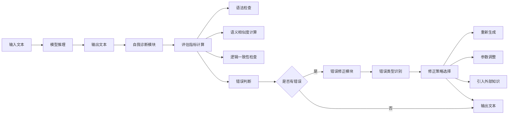

# 大规模语言模型的自我诊断与错误修正能力研究

> 关键词：大规模语言模型、自我诊断、错误修正、自然语言处理、人工智能

> 摘要：本文聚焦于大规模语言模型的自我诊断与错误修正能力。首先介绍了相关研究的背景，包括目的、预期读者、文档结构和术语表。接着阐述了核心概念及其联系，给出了原理和架构的文本示意图与 Mermaid 流程图。详细讲解了核心算法原理并给出 Python 源代码示例，介绍了相关数学模型和公式。通过项目实战，展示了代码的实际案例和详细解释。分析了大规模语言模型自我诊断与错误修正能力在不同场景的实际应用，推荐了学习资源、开发工具框架和相关论文著作。最后总结了未来发展趋势与挑战，提供了常见问题解答和扩展阅读参考资料，旨在全面深入地探讨大规模语言模型在自我诊断与错误修正方面的技术原理、实现方法和应用前景。

## 1. 背景介绍 
### 1.1 目的和范围
随着大规模语言模型（LLMs）在自然语言处理（NLP）领域的广泛应用，如智能问答系统、机器翻译、文本生成等，其输出的准确性和可靠性变得至关重要。然而，由于训练数据的局限性、模型结构的复杂性等因素，LLMs 在实际应用中难免会出现各种错误。本研究的目的是深入探讨大规模语言模型的自我诊断与错误修正能力，旨在提高模型输出的质量和可靠性。

研究范围涵盖了大规模语言模型自我诊断的方法、错误修正的策略，以及如何在不同的应用场景中实现有效的自我诊断与错误修正。同时，将分析相关技术的优缺点和适用范围，为进一步的研究和应用提供参考。

### 1.2 预期读者
本文的预期读者包括自然语言处理领域的研究人员、人工智能工程师、软件开发者以及对大规模语言模型技术感兴趣的专业人士。对于希望深入了解大规模语言模型内部机制、提高模型性能的读者，本文将提供有价值的技术信息和实践指导。

### 1.3 文档结构概述
本文将按照以下结构进行组织：
- 核心概念与联系：介绍大规模语言模型自我诊断与错误修正的核心概念，包括相关原理和架构，并通过文本示意图和 Mermaid 流程图进行直观展示。
- 核心算法原理 & 具体操作步骤：详细讲解实现自我诊断与错误修正的核心算法，并给出 Python 源代码示例。
- 数学模型和公式 & 详细讲解 & 举例说明：介绍相关的数学模型和公式，通过具体例子加深读者的理解。
- 项目实战：代码实际案例和详细解释说明：通过实际项目案例，展示如何在实践中实现大规模语言模型的自我诊断与错误修正。
- 实际应用场景：分析大规模语言模型自我诊断与错误修正能力在不同场景中的应用。
- 工具和资源推荐：推荐学习资源、开发工具框架和相关论文著作。
- 总结：未来发展趋势与挑战：总结大规模语言模型自我诊断与错误修正技术的未来发展趋势和面临的挑战。
- 附录：常见问题与解答：解答读者在阅读过程中可能遇到的常见问题。
- 扩展阅读 & 参考资料：提供相关的扩展阅读材料和参考资料。

### 1.4 术语表
#### 1.4.1 核心术语定义
- 大规模语言模型（Large Language Model, LLM）：指基于深度学习技术，使用大量文本数据进行训练的语言模型，如 GPT、BERT 等。
- 自我诊断（Self - Diagnosis）：指语言模型能够自动检测自身输出中的错误或异常。
- 错误修正（Error Correction）：指语言模型在检测到错误后，对错误进行纠正的能力。

#### 1.4.2 相关概念解释
- 自然语言处理（Natural Language Processing, NLP）：是人工智能的一个重要领域，研究如何让计算机理解和处理人类语言。
- 深度学习（Deep Learning）：是一种基于人工神经网络的机器学习技术，在自然语言处理等领域取得了显著的成果。

#### 1.4.3 缩略词列表
- LLM：Large Language Model
- NLP：Natural Language Processing

## 2. 核心概念与联系 
### 核心概念原理
大规模语言模型的自我诊断与错误修正能力基于模型对自身输出的评估和分析。自我诊断的原理是通过设计合适的评估指标和方法，判断模型输出是否符合预期或存在错误。常见的评估指标包括语法正确性、语义合理性、逻辑一致性等。

例如，对于语法正确性的评估，可以使用语法检查器来检测输出文本中是否存在语法错误。对于语义合理性的评估，可以通过计算输出文本与上下文的语义相似度来判断。

错误修正的原理是在自我诊断发现错误后，根据错误的类型和特征，采用相应的修正策略。修正策略可以包括重新生成输出、调整模型参数、引入外部知识等。

### 架构的文本示意图
```plaintext
大规模语言模型
|
|-- 输入文本
|
|-- 模型推理
|     |
|     |-- 输出文本
|
|-- 自我诊断模块
|     |
|     |-- 评估指标计算
|     |     |
|     |     |-- 语法检查
|     |     |-- 语义相似度计算
|     |     |-- 逻辑一致性检查
|     |
|     |-- 错误判断
|
|-- 错误修正模块
|     |
|     |-- 错误类型识别
|     |
|     |-- 修正策略选择
|     |     |
|     |     |-- 重新生成
|     |     |-- 参数调整
|     |     |-- 引入外部知识
|
|-- 修正后输出文本
```

### Mermaid 流程图


## 3. 核心算法原理 & 具体操作步骤 
### 自我诊断算法原理
自我诊断的核心算法可以基于规则或机器学习方法。基于规则的方法是通过定义一系列的规则来判断输出是否存在错误。例如，语法规则可以用于检测句子中的语法错误，如主谓不一致、时态错误等。

以下是一个简单的基于规则的语法检查的 Python 代码示例：
```python
import re

# 定义语法规则
grammar_rules = [
    # 检查主谓一致（简单示例）
    (re.compile(r'^He/She [a-zA-Z]+s .*$'), lambda x: True),
    (re.compile(r'^I/You/We/They [a-zA-Z]+ .*$'), lambda x: True)
]

def grammar_check(sentence):
    for rule, check in grammar_rules:
        if rule.match(sentence):
            return True
    return False

# 测试句子
test_sentence = "He play football."
if not grammar_check(test_sentence):
    print(f"语法错误: {test_sentence}")
```

基于机器学习的方法则是使用训练好的模型来预测输出是否存在错误。例如，可以使用分类模型来判断句子是否符合语法规则。

### 错误修正算法原理
错误修正的算法可以根据错误的类型进行分类处理。对于语法错误，可以使用语言模型重新生成正确的句子。对于语义错误，可以引入外部知识来修正。

以下是一个简单的错误修正示例，使用语言模型重新生成句子：
```python
import torch
from transformers import GPT2LMHeadModel, GPT2Tokenizer

# 加载模型和分词器
tokenizer = GPT2Tokenizer.from_pretrained('gpt2')
model = GPT2LMHeadModel.from_pretrained('gpt2')

# 输入错误句子
input_text = "He play football."
input_ids = tokenizer.encode(input_text, return_tensors='pt')

# 生成修正后的句子
output = model.generate(input_ids, max_length=50, num_beams=5, no_repeat_ngram_size=2, early_stopping=True)
corrected_text = tokenizer.decode(output[0], skip_special_tokens=True)

print(f"修正前: {input_text}")
print(f"修正后: {corrected_text}")
```

### 具体操作步骤
1. **数据预处理**：对输入文本进行分词、词性标注等预处理操作，以便后续的分析和处理。
2. **自我诊断**：使用定义好的评估指标和方法，对模型输出进行自我诊断，判断是否存在错误。
3. **错误类型识别**：如果发现错误，确定错误的类型，如语法错误、语义错误、逻辑错误等。
4. **修正策略选择**：根据错误的类型，选择合适的修正策略，如重新生成、参数调整、引入外部知识等。
5. **错误修正**：执行选择的修正策略，得到修正后的输出文本。

## 4. 数学模型和公式 & 详细讲解 & 举例说明 
### 语法正确性评估的数学模型
可以使用语言模型的概率来评估句子的语法正确性。假设 $S$ 是一个句子，$w_1, w_2, \cdots, w_n$ 是句子中的单词，语言模型可以计算句子的概率 $P(S)$ 如下：
$$P(S) = P(w_1)P(w_2|w_1)P(w_3|w_1, w_2)\cdots P(w_n|w_1, w_2, \cdots, w_{n - 1})$$

一般来说，语法正确的句子的概率会相对较高。可以通过设定一个阈值 $\theta$，当 $P(S) < \theta$ 时，认为句子可能存在语法错误。

例如，假设有两个句子 $S_1$ = "He plays football." 和 $S_2$ = "He play football."，使用语言模型计算它们的概率 $P(S_1)$ 和 $P(S_2)$，由于 $S_2$ 存在语法错误，$P(S_2)$ 会明显低于 $P(S_1)$。

### 语义相似度计算的数学模型
可以使用余弦相似度来计算两个句子的语义相似度。假设 $\vec{v}_1$ 和 $\vec{v}_2$ 是两个句子的向量表示，余弦相似度 $cosine(\vec{v}_1, \vec{v}_2)$ 定义如下：
$$cosine(\vec{v}_1, \vec{v}_2) = \frac{\vec{v}_1 \cdot \vec{v}_2}{\|\vec{v}_1\|\|\vec{v}_2\|}$$

其中，$\vec{v}_1 \cdot \vec{v}_2$ 是向量的点积，$\|\vec{v}_1\|$ 和 $\|\vec{v}_2\|$ 分别是向量的模。

例如，假设有两个句子 $S_1$ = "The cat is on the mat." 和 $S_2$ = "A cat is lying on the mat."，可以将它们转换为向量表示 $\vec{v}_1$ 和 $\vec{v}_2$，然后计算余弦相似度。如果 $cosine(\vec{v}_1, \vec{v}_2)$ 接近 1，则说明两个句子的语义相似度较高。

### 逻辑一致性检查的数学模型
逻辑一致性检查可以通过逻辑推理和规则匹配来实现。例如，在一个知识图谱中，如果有规则 "如果 A 是 B 的父亲，那么 B 是 A 的儿子/女儿"，可以通过检查输入文本是否违反该规则来判断逻辑一致性。

假设输入文本中提到 "John is the father of Tom." 和 "Tom is not John's son."，可以通过规则匹配发现这两个陈述存在逻辑矛盾。

## 5. 项目实战：代码实际案例和详细解释说明 
### 5.1  开发环境搭建
#### 安装 Python
首先，确保你已经安装了 Python 3.x 版本。可以从 Python 官方网站（https://www.python.org/downloads/） 下载并安装。

#### 安装必要的库
使用以下命令安装必要的库：
```bash
pip install torch transformers
```
`torch` 是 PyTorch 深度学习框架，`transformers` 是用于自然语言处理的库，提供了预训练的语言模型。

### 5.2  源代码详细实现和代码解读
```python
import torch
from transformers import GPT2LMHeadModel, GPT2Tokenizer

# 加载模型和分词器
tokenizer = GPT2Tokenizer.from_pretrained('gpt2')
model = GPT2LMHeadModel.from_pretrained('gpt2')

# 定义输入文本
input_text = "He play football."

# 分词并转换为输入 ID
input_ids = tokenizer.encode(input_text, return_tensors='pt')

# 生成修正后的句子
output = model.generate(input_ids, max_length=50, num_beams=5, no_repeat_ngram_size=2, early_stopping=True)

# 解码输出 ID 为文本
corrected_text = tokenizer.decode(output[0], skip_special_tokens=True)

# 打印修正前后的文本
print(f"修正前: {input_text}")
print(f"修正后: {corrected_text}")
```

### 代码解读与分析
1. **加载模型和分词器**：使用 `GPT2Tokenizer.from_pretrained('gpt2')` 加载 GPT - 2 分词器，使用 `GPT2LMHeadModel.from_pretrained('gpt2')` 加载 GPT - 2 语言模型。
2. **输入文本处理**：将输入文本使用分词器进行编码，转换为输入 ID。
3. **生成修正后的句子**：使用 `model.generate()` 方法生成修正后的句子。`max_length` 控制生成句子的最大长度，`num_beams` 是束搜索的束宽，`no_repeat_ngram_size` 用于避免生成重复的 n - gram，`early_stopping` 表示在生成完成后停止搜索。
4. **解码输出**：将生成的输出 ID 使用分词器解码为文本。
5. **打印结果**：打印修正前后的文本，方便对比。

## 6. 实际应用场景 
### 智能问答系统
在智能问答系统中，大规模语言模型的自我诊断与错误修正能力可以提高回答的准确性。当用户提出问题时，模型生成回答后，首先进行自我诊断，检查回答是否存在语法错误、语义错误或逻辑错误。如果发现错误，及时进行修正，然后再将修正后的回答返回给用户。

例如，用户问 "中国的首都是哪里？"，模型可能生成回答 "中国的首都十北京。"，通过自我诊断发现 "十" 是语法错误，使用错误修正功能将其修正为 "中国的首都是北京。"

### 机器翻译
在机器翻译中，自我诊断与错误修正能力可以提高翻译的质量。翻译完成后，模型对翻译结果进行自我诊断，检查翻译是否准确、通顺。如果发现错误，根据错误类型进行修正。

例如，将英文句子 "The dog is running." 翻译成中文，可能出现 "狗在跑了。" 这样不太自然的翻译，通过自我诊断和修正，可以将其改为 "狗正在跑。"

### 文本生成
在文本生成任务中，如文章写作、故事创作等，自我诊断与错误修正能力可以避免生成的文本出现错误。模型在生成文本的过程中，不断进行自我诊断，及时发现并修正语法、语义等方面的错误，提高文本的质量。

例如，在生成一篇新闻报道时，可能会出现时间表述错误、事实不符等问题，通过自我诊断和修正功能可以保证报道的准确性。

## 7. 工具和资源推荐
### 7.1 学习资源推荐
#### 7.1.1 书籍推荐
- 《自然语言处理入门》：介绍了自然语言处理的基础知识和常用技术，适合初学者。
- 《深度学习》：深度学习领域的经典教材，涵盖了神经网络、卷积神经网络、循环神经网络等内容。
- 《Transformers 自然语言处理实战》：详细介绍了 Transformers 架构和相关的预训练模型，如 BERT、GPT 等。

#### 7.1.2 在线课程
- Coursera 上的 "Natural Language Processing Specialization"：由顶尖大学的教授授课，系统地介绍了自然语言处理的各个方面。
- edX 上的 "Deep Learning for Natural Language Processing"：专注于深度学习在自然语言处理中的应用。

#### 7.1.3 技术博客和网站
- Hugging Face Blog：提供了关于自然语言处理、预训练模型等方面的最新技术文章和研究成果。
- Medium 上的自然语言处理相关专栏：有很多专业人士分享的技术经验和研究心得。

### 7.2 开发工具框架推荐
#### 7.2.1 IDE和编辑器
- PyCharm：功能强大的 Python 集成开发环境，提供了代码编辑、调试、版本控制等功能。
- Visual Studio Code：轻量级的代码编辑器，支持多种编程语言，有丰富的插件可以扩展功能。

#### 7.2.2 调试和性能分析工具
- PyTorch Profiler：用于分析 PyTorch 模型的性能，找出性能瓶颈。
- TensorBoard：可以可视化模型的训练过程和性能指标。

#### 7.2.3 相关框架和库
- PyTorch：开源的深度学习框架，广泛应用于自然语言处理领域。
- Hugging Face Transformers：提供了大量预训练的语言模型和工具，方便进行自然语言处理任务。
- NLTK：自然语言处理工具包，提供了分词、词性标注、命名实体识别等功能。

### 7.3 相关论文著作推荐
#### 7.3.1 经典论文
- "Attention Is All You Need"：介绍了 Transformers 架构，是自然语言处理领域的重要突破。
- "BERT: Pre-training of Deep Bidirectional Transformers for Language Understanding"：提出了 BERT 预训练模型，在自然语言处理任务中取得了优异的成绩。

#### 7.3.2 最新研究成果
可以关注 ACL（Association for Computational Linguistics）、EMNLP（Conference on Empirical Methods in Natural Language Processing）等自然语言处理领域的顶级会议，获取最新的研究成果。

#### 7.3.3 应用案例分析
一些科技公司的博客和研究报告中会分享大规模语言模型在实际应用中的案例分析，如 Google、Microsoft、OpenAI 等公司的官方博客。

## 8. 总结：未来发展趋势与挑战
### 未来发展趋势
- **更强大的自我诊断能力**：未来的大规模语言模型将具备更精细的自我诊断能力，能够检测到更复杂的错误，如语义歧义、隐含逻辑错误等。
- **智能化的错误修正策略**：错误修正策略将更加智能化，能够根据不同的错误类型和上下文信息，自动选择最合适的修正方法。
- **与外部知识的深度融合**：模型将更好地融合外部知识，如知识图谱、百科全书等，以提高错误修正的准确性和可靠性。
- **跨领域应用拓展**：大规模语言模型的自我诊断与错误修正能力将在更多领域得到应用，如医疗、金融、法律等。

### 挑战
- **训练数据的局限性**：训练数据可能存在噪声、偏差等问题，影响模型的自我诊断和错误修正能力。
- **计算资源的需求**：实现复杂的自我诊断和错误修正算法需要大量的计算资源，如何在有限的资源下提高性能是一个挑战。
- **错误类型的复杂性**：自然语言中的错误类型多种多样，如何准确识别和处理各种错误是一个难题。
- **可解释性问题**：大规模语言模型的决策过程往往缺乏可解释性，如何让模型的自我诊断和错误修正过程变得可解释是未来需要解决的问题。

## 9. 附录：常见问题与解答
### 问题 1：大规模语言模型的自我诊断和错误修正能力是否可以完全避免错误？
答：不能完全避免错误。虽然自我诊断和错误修正能力可以提高模型输出的质量，但由于自然语言的复杂性和训练数据的局限性，仍然可能存在一些难以检测和修正的错误。

### 问题 2：如何选择合适的修正策略？
答：选择合适的修正策略需要考虑错误的类型、上下文信息和模型的特点。一般来说，对于语法错误可以使用重新生成的方法，对于语义错误可以引入外部知识进行修正。

### 问题 3：自我诊断和错误修正会增加模型的计算开销吗？
答：会增加一定的计算开销。自我诊断和错误修正需要额外的计算步骤，如评估指标计算、错误类型识别等。但可以通过优化算法和使用高效的计算资源来降低开销。

### 问题 4：大规模语言模型的自我诊断和错误修正能力与模型的大小有关吗？
答：有一定关系。一般来说，较大的模型可能具有更强的学习能力和更丰富的知识表示，在自我诊断和错误修正方面可能表现更好。但模型大小不是唯一的决定因素，模型的架构、训练方法等也会影响其能力。

## 10. 扩展阅读 & 参考资料
### 扩展阅读
- 《人工智能时代的自然语言处理》：深入探讨了自然语言处理在人工智能时代的发展和应用。
- 《语言与机器：自然语言处理的计算模型》：介绍了自然语言处理的计算模型和算法。

### 参考资料
- Hugging Face 官方文档：https://huggingface.co/docs
- PyTorch 官方文档：https://pytorch.org/docs/stable/index.html
- ACL Anthology：https://aclanthology.org/ ，包含了大量自然语言处理领域的学术论文。