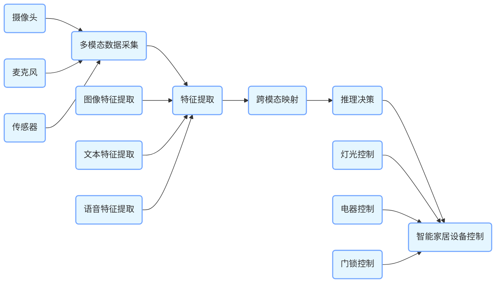

# 大规模语言模型的跨模态推理在智能家居系统中的创新应用

> 关键词：大规模语言模型、跨模态推理、智能家居系统、创新应用、多模态融合

> 摘要：本文聚焦于大规模语言模型的跨模态推理在智能家居系统中的创新应用。首先介绍了研究的背景、目的、预期读者等内容，接着阐述了核心概念与联系，包括大规模语言模型、跨模态推理和智能家居系统的原理及架构，并给出相应的流程图。详细讲解了核心算法原理，通过Python代码进行说明，同时给出数学模型和公式。以实际项目为例，展示了代码的实现和解读。探讨了该技术在智能家居系统中的实际应用场景，推荐了相关的学习资源、开发工具框架和论文著作。最后总结了未来发展趋势与挑战，解答了常见问题，并提供了扩展阅读和参考资料，旨在为该领域的研究和应用提供全面的技术指导。

## 1. 背景介绍 
### 1.1 目的和范围
随着科技的飞速发展，智能家居系统已经逐渐走进人们的生活。大规模语言模型的出现为智能家居系统带来了新的发展机遇。本研究的目的在于探索大规模语言模型的跨模态推理技术如何在智能家居系统中实现创新应用，提高智能家居系统的智能化水平和用户体验。

研究范围涵盖了大规模语言模型的基本原理、跨模态推理的技术方法、智能家居系统的架构和功能，以及如何将大规模语言模型的跨模态推理技术融入到智能家居系统中，实现诸如语音控制、图像识别、场景感知等多模态交互功能。

### 1.2 预期读者
本文预期读者包括智能家居系统的开发者、研究人员，大规模语言模型和跨模态推理领域的技术专家，以及对智能家居技术感兴趣的爱好者。通过阅读本文，读者可以深入了解大规模语言模型的跨模态推理在智能家居系统中的应用原理、技术实现和发展趋势，为相关领域的研究和开发提供参考。

### 1.3 文档结构概述
本文将按照以下结构进行阐述：首先介绍核心概念与联系，包括大规模语言模型、跨模态推理和智能家居系统的原理和架构；接着讲解核心算法原理和具体操作步骤，并给出Python代码示例；然后介绍数学模型和公式，并通过举例说明；以实际项目为例，展示代码的实现和详细解释；探讨该技术在智能家居系统中的实际应用场景；推荐相关的学习资源、开发工具框架和论文著作；最后总结未来发展趋势与挑战，解答常见问题，并提供扩展阅读和参考资料。

### 1.4 术语表
#### 1.4.1 核心术语定义
- **大规模语言模型**：是指具有大量参数和强大语言理解与生成能力的人工智能模型，如GPT系列、BERT等。这些模型通过在大规模文本数据上进行训练，能够学习到丰富的语言知识和语义信息。
- **跨模态推理**：是指在不同模态（如文本、图像、语音等）之间进行信息融合和推理的技术。通过将不同模态的数据进行关联和分析，实现更全面、准确的信息理解和决策。
- **智能家居系统**：是指利用计算机技术、网络通信技术、自动控制技术等，将家居设备（如灯光、电器、门锁等）连接成一个智能化的网络，实现远程控制、自动化管理和个性化服务的系统。

#### 1.4.2 相关概念解释
- **多模态数据**：是指包含多种不同模态信息的数据，如文本、图像、音频、视频等。在智能家居系统中，多模态数据可以来自于各种传感器和设备，如摄像头、麦克风、智能电表等。
- **信息融合**：是指将来自不同数据源、不同模态的信息进行整合和处理，以获得更全面、准确的信息。在跨模态推理中，信息融合是实现不同模态数据之间关联和分析的关键步骤。

#### 1.4.3 缩略词列表
- **LLM**：Large Language Model，大规模语言模型
- **AI**：Artificial Intelligence，人工智能
- **IoT**：Internet of Things，物联网

## 2. 核心概念与联系 
### 核心概念原理
#### 大规模语言模型
大规模语言模型基于深度学习技术，通常采用Transformer架构。Transformer架构由编码器和解码器组成，通过自注意力机制（Self-Attention）来捕捉文本中的长距离依赖关系。在训练过程中，模型使用大规模的文本数据进行无监督学习，学习语言的语法、语义和上下文信息。例如，GPT系列模型通过自回归的方式生成文本，不断预测下一个单词，从而学习到语言的生成模式。

#### 跨模态推理
跨模态推理的核心是将不同模态的数据进行映射和关联。首先，需要对不同模态的数据进行特征提取，将其转换为低维的特征向量。例如，对于图像数据，可以使用卷积神经网络（CNN）提取图像特征；对于文本数据，可以使用预训练的语言模型提取文本特征。然后，通过跨模态映射网络将不同模态的特征向量映射到同一特征空间，使得不同模态的数据可以在该空间中进行比较和关联。最后，利用这些关联信息进行推理和决策。

#### 智能家居系统
智能家居系统基于物联网技术，将各种家居设备连接到网络中。系统通常包括传感器层、网络层、平台层和应用层。传感器层负责采集各种环境信息和设备状态信息，如温度、湿度、光照强度等；网络层负责将传感器采集的数据传输到平台层；平台层负责对数据进行处理和分析，实现设备的管理和控制；应用层为用户提供各种交互界面和服务，如手机APP、语音控制等。

### 架构的文本示意图
```plaintext
大规模语言模型跨模态推理在智能家居系统中的架构：

|-- 多模态数据采集层
|   |-- 摄像头（图像数据）
|   |-- 麦克风（语音数据）
|   |-- 各种传感器（环境数据）
|
|-- 特征提取层
|   |-- 图像特征提取（CNN）
|   |-- 文本特征提取（LLM）
|   |-- 语音特征提取（ASR）
|
|-- 跨模态映射层
|   |-- 跨模态映射网络
|
|-- 推理决策层
|   |-- 基于大规模语言模型的推理引擎
|
|-- 智能家居设备控制层
|   |-- 灯光控制
|   |-- 电器控制
|   |-- 门锁控制
```

### Mermaid流程图


## 3. 核心算法原理 & 具体操作步骤 
### 核心算法原理
#### 特征提取算法
- **图像特征提取**：使用卷积神经网络（CNN）进行图像特征提取。以ResNet为例，ResNet通过残差块解决了深度神经网络训练中的梯度消失问题，能够有效地提取图像的特征。以下是使用PyTorch实现的ResNet图像特征提取代码示例：
```python
import torch
import torchvision.models as models

# 加载预训练的ResNet模型
resnet = models.resnet18(pretrained=True)
# 去掉最后一层全连接层，只保留特征提取部分
feature_extractor = torch.nn.Sequential(*list(resnet.children())[:-1])

# 示例图像
image = torch.randn(1, 3, 224, 224)
# 提取图像特征
image_features = feature_extractor(image).squeeze()
print("图像特征形状:", image_features.shape)
```
- **文本特征提取**：使用预训练的大规模语言模型进行文本特征提取。以BERT为例，BERT通过双向编码器表示从大规模文本数据中学习到丰富的语言知识。以下是使用Hugging Face的transformers库实现的BERT文本特征提取代码示例：
```python
from transformers import BertModel, BertTokenizer
import torch

# 加载预训练的BERT模型和分词器
tokenizer = BertTokenizer.from_pretrained('bert-base-uncased')
model = BertModel.from_pretrained('bert-base-uncased')

# 示例文本
text = "This is an example sentence."
# 对文本进行分词
inputs = tokenizer(text, return_tensors='pt')
# 提取文本特征
outputs = model(**inputs)
text_features = outputs.last_hidden_state.mean(dim=1).squeeze()
print("文本特征形状:", text_features.shape)
```

#### 跨模态映射算法
跨模态映射的目的是将不同模态的特征向量映射到同一特征空间。可以使用多层感知机（MLP）来实现跨模态映射。以下是一个简单的MLP跨模态映射网络的Python代码示例：
```python
import torch
import torch.nn as nn

class CrossModalMapper(nn.Module):
    def __init__(self, input_dim1, input_dim2, output_dim):
        super(CrossModalMapper, self).__init__()
        self.mlp1 = nn.Sequential(
            nn.Linear(input_dim1, 256),
            nn.ReLU(),
            nn.Linear(256, output_dim)
        )
        self.mlp2 = nn.Sequential(
            nn.Linear(input_dim2, 256),
            nn.ReLU(),
            nn.Linear(256, output_dim)
        )

    def forward(self, features1, features2):
        mapped_features1 = self.mlp1(features1)
        mapped_features2 = self.mlp2(features2)
        return mapped_features1, mapped_features2

# 示例输入维度
input_dim1 = 512  # 图像特征维度
input_dim2 = 768  # 文本特征维度
output_dim = 256  # 映射后的特征维度

mapper = CrossModalMapper(input_dim1, input_dim2, output_dim)
image_features = torch.randn(1, input_dim1)
text_features = torch.randn(1, input_dim2)
mapped_image_features, mapped_text_features = mapper(image_features, text_features)
print("映射后的图像特征形状:", mapped_image_features.shape)
print("映射后的文本特征形状:", mapped_text_features.shape)
```

#### 推理决策算法
在跨模态特征映射后，可以使用大规模语言模型进行推理决策。以GPT为例，可以将跨模态特征和用户的指令作为输入，让GPT生成相应的决策结果。以下是一个简单的模拟推理决策的代码示例：
```python
from transformers import GPT2LMHeadModel, GPT2Tokenizer
import torch

# 加载预训练的GPT模型和分词器
tokenizer = GPT2Tokenizer.from_pretrained('gpt2')
model = GPT2LMHeadModel.from_pretrained('gpt2')

# 示例跨模态特征和用户指令
cross_modal_features = torch.randn(1, 256)
user_instruction = "Turn on the lights."
input_text = f"Cross-modal features: {cross_modal_features.tolist()}, Instruction: {user_instruction}"
inputs = tokenizer(input_text, return_tensors='pt')
outputs = model.generate(**inputs, max_length=50, num_beams=5, no_repeat_ngram_size=2)
decision = tokenizer.decode(outputs[0], skip_special_tokens=True)
print("推理决策结果:", decision)
```

### 具体操作步骤
1. **数据采集**：使用摄像头、麦克风和各种传感器采集图像、语音和环境数据。
2. **特征提取**：对采集到的多模态数据进行特征提取，分别得到图像特征、文本特征和语音特征。
3. **跨模态映射**：将不同模态的特征向量映射到同一特征空间，以便进行比较和关联。
4. **推理决策**：将跨模态特征和用户的指令作为输入，使用大规模语言模型进行推理决策，生成相应的控制指令。
5. **设备控制**：将推理决策得到的控制指令发送到智能家居设备，实现对设备的控制。

## 4. 数学模型和公式 & 详细讲解 & 举例说明 
### 特征提取数学模型
#### 图像特征提取
在使用卷积神经网络（CNN）进行图像特征提取时，卷积层的数学模型可以表示为：
$$
y_{i,j}^l = \sum_{m=0}^{M - 1} \sum_{n=0}^{N - 1} x_{i + m,j + n}^{l - 1} \cdot w_{m,n}^l + b^l
$$
其中，$y_{i,j}^l$ 是第 $l$ 层卷积层在位置 $(i, j)$ 处的输出值，$x_{i + m,j + n}^{l - 1}$ 是第 $l - 1$ 层的输入值，$w_{m,n}^l$ 是第 $l$ 层的卷积核权重，$b^l$ 是偏置项，$M$ 和 $N$ 是卷积核的大小。

例如，对于一个 $3 \times 3$ 的卷积核，$M = N = 3$。假设输入图像的大小为 $10 \times 10$，卷积核的权重为：
$$
w = \begin{bmatrix}
0.1 & 0.2 & 0.3 \\
0.4 & 0.5 & 0.6 \\
0.7 & 0.8 & 0.9
\end{bmatrix}
$$
偏置项 $b = 0.1$。在进行卷积操作时，卷积核会在输入图像上滑动，计算每个位置的卷积结果。

#### 文本特征提取
在使用BERT进行文本特征提取时，BERT的输入是一系列的词向量，经过多层Transformer编码器的处理后，输出每个词的上下文表示。Transformer编码器的核心是自注意力机制，其数学模型可以表示为：
$$
\text{Attention}(Q, K, V) = \text{softmax}(\frac{QK^T}{\sqrt{d_k}})V
$$
其中，$Q$、$K$ 和 $V$ 分别是查询矩阵、键矩阵和值矩阵，$d_k$ 是键向量的维度。

例如，假设输入文本有 $n$ 个词，每个词的词向量维度为 $d$，则 $Q$、$K$ 和 $V$ 的维度分别为 $n \times d$。通过自注意力机制，每个词可以关注到文本中其他词的信息，从而得到更丰富的上下文表示。

### 跨模态映射数学模型
跨模态映射可以使用多层感知机（MLP）来实现，MLP的数学模型可以表示为：
$$
h_1 = \sigma(W_1x_1 + b_1)
$$
$$
h_2 = \sigma(W_2x_2 + b_2)
$$
其中，$x_1$ 和 $x_2$ 分别是不同模态的输入特征向量，$W_1$ 和 $W_2$ 是权重矩阵，$b_1$ 和 $b_2$ 是偏置项，$\sigma$ 是激活函数（如ReLU），$h_1$ 和 $h_2$ 是映射后的特征向量。

例如，假设输入的图像特征向量 $x_1$ 的维度为 $512$，文本特征向量 $x_2$ 的维度为 $768$，MLP的隐藏层维度为 $256$，则 $W_1$ 的维度为 $256 \times 512$，$W_2$ 的维度为 $256 \times 768$。

### 推理决策数学模型
在使用大规模语言模型进行推理决策时，模型的目标是根据输入的跨模态特征和用户指令生成最可能的输出序列。可以使用最大似然估计来训练模型，其数学模型可以表示为：
$$
\theta^* = \arg\max_{\theta} \sum_{i = 1}^{N} \log P(y_i | x_i; \theta)
$$
其中，$\theta$ 是模型的参数，$x_i$ 是输入序列（包括跨模态特征和用户指令），$y_i$ 是对应的输出序列，$N$ 是训练样本的数量。

例如，在训练GPT模型时，通过最大化训练数据的似然函数来调整模型的参数，使得模型能够更好地生成与输入相关的输出。

## 5. 项目实战：代码实际案例和详细解释说明 
### 5.1  开发环境搭建
#### 硬件环境
- 计算机：具有足够的计算资源，建议使用NVIDIA GPU进行加速计算。
- 摄像头：用于采集图像数据。
- 麦克风：用于采集语音数据。
- 智能家居设备：如智能灯光、智能电器等。

#### 软件环境
- 操作系统：推荐使用Ubuntu 20.04或Windows 10。
- Python：版本3.7及以上。
- 深度学习框架：PyTorch、TensorFlow等。
- 相关库：torchvision、transformers、opencv-python等。

可以使用以下命令安装所需的Python库：
```bash
pip install torch torchvision
pip install transformers
pip install opencv-python
```

### 5.2  源代码详细实现和代码解读
以下是一个完整的项目实战代码示例，实现了大规模语言模型的跨模态推理在智能家居系统中的应用：
```python
import torch
import torchvision.models as models
from transformers import BertModel, BertTokenizer, GPT2LMHeadModel, GPT2Tokenizer
import cv2
import numpy as np

# 图像特征提取
def extract_image_features(image_path):
    # 加载预训练的ResNet模型
    resnet = models.resnet18(pretrained=True)
    feature_extractor = torch.nn.Sequential(*list(resnet.children())[:-1])
    image = cv2.imread(image_path)
    image = cv2.resize(image, (224, 224))
    image = np.transpose(image, (2, 0, 1))
    image = torch.tensor(image, dtype=torch.float32).unsqueeze(0)
    image_features = feature_extractor(image).squeeze()
    return image_features

# 文本特征提取
def extract_text_features(text):
    # 加载预训练的BERT模型和分词器
    tokenizer = BertTokenizer.from_pretrained('bert-base-uncased')
    model = BertModel.from_pretrained('bert-base-uncased')
    inputs = tokenizer(text, return_tensors='pt')
    outputs = model(**inputs)
    text_features = outputs.last_hidden_state.mean(dim=1).squeeze()
    return text_features

# 跨模态映射
class CrossModalMapper(torch.nn.Module):
    def __init__(self, input_dim1, input_dim2, output_dim):
        super(CrossModalMapper, self).__init__()
        self.mlp1 = torch.nn.Sequential(
            torch.nn.Linear(input_dim1, 256),
            torch.nn.ReLU(),
            torch.nn.Linear(256, output_dim)
        )
        self.mlp2 = torch.nn.Sequential(
            torch.nn.Linear(input_dim2, 256),
            torch.nn.ReLU(),
            torch.nn.Linear(256, output_dim)
        )

    def forward(self, features1, features2):
        mapped_features1 = self.mlp1(features1)
        mapped_features2 = self.mlp2(features2)
        return mapped_features1, mapped_features2

# 推理决策
def inference_decision(cross_modal_features, user_instruction):
    # 加载预训练的GPT模型和分词器
    tokenizer = GPT2Tokenizer.from_pretrained('gpt2')
    model = GPT2LMHeadModel.from_pretrained('gpt2')
    input_text = f"Cross-modal features: {cross_modal_features.tolist()}, Instruction: {user_instruction}"
    inputs = tokenizer(input_text, return_tensors='pt')
    outputs = model.generate(**inputs, max_length=50, num_beams=5, no_repeat_ngram_size=2)
    decision = tokenizer.decode(outputs[0], skip_special_tokens=True)
    return decision

# 主函数
if __name__ == "__main__":
    # 示例图像路径和用户指令
    image_path = "example_image.jpg"
    user_instruction = "Turn on the lights."

    # 提取图像和文本特征
    image_features = extract_image_features(image_path)
    text_features = extract_text_features(user_instruction)

    # 跨模态映射
    input_dim1 = image_features.shape[0]
    input_dim2 = text_features.shape[0]
    output_dim = 256
    mapper = CrossModalMapper(input_dim1, input_dim2, output_dim)
    mapped_image_features, mapped_text_features = mapper(image_features, text_features)
    cross_modal_features = (mapped_image_features + mapped_text_features) / 2

    # 推理决策
    decision = inference_decision(cross_modal_features, user_instruction)
    print("推理决策结果:", decision)
```
### 5.3  代码解读与分析
- **图像特征提取**：`extract_image_features` 函数使用预训练的ResNet模型提取图像特征。首先，读取图像并进行预处理，将其调整为224x224的大小，然后输入到ResNet模型中，去掉最后一层全连接层，得到图像的特征向量。
- **文本特征提取**：`extract_text_features` 函数使用预训练的BERT模型提取文本特征。对输入的文本进行分词，然后输入到BERT模型中，取最后一层隐藏状态的均值作为文本的特征向量。
- **跨模态映射**：`CrossModalMapper` 类是一个多层感知机，用于将不同模态的特征向量映射到同一特征空间。通过两个MLP分别对图像特征和文本特征进行映射，得到映射后的特征向量。
- **推理决策**：`inference_decision` 函数使用预训练的GPT模型进行推理决策。将跨模态特征和用户指令作为输入，输入到GPT模型中，生成相应的决策结果。
- **主函数**：在主函数中，首先调用 `extract_image_features` 和 `extract_text_features` 函数提取图像和文本特征，然后调用 `CrossModalMapper` 进行跨模态映射，最后调用 `inference_decision` 进行推理决策，并输出决策结果。

## 6. 实际应用场景 
### 智能语音控制
用户可以通过语音指令控制智能家居设备。例如，用户说“打开客厅的灯”，系统通过麦克风采集语音数据，进行语音识别和文本特征提取，同时结合摄像头采集的图像数据提取图像特征。通过跨模态推理，系统可以准确理解用户的意图，并控制客厅的灯光打开。

### 场景感知与自动化控制
智能家居系统可以根据不同的场景自动调整设备的状态。例如，当摄像头检测到房间内光线较暗，同时用户在房间内活动时，系统可以自动打开灯光；当检测到用户离开房间时，自动关闭电器设备，实现节能和智能化管理。

### 安防监控与预警
结合图像识别和语音分析技术，智能家居系统可以实现安防监控和预警功能。例如，当摄像头检测到有陌生人进入房间时，系统可以自动发出警报，并将相关信息发送到用户的手机上；同时，系统可以通过语音询问陌生人的身份，根据回答进行进一步的判断和处理。

### 健康监测与关怀
智能家居系统可以集成健康监测设备，如智能手环、血压计等，采集用户的健康数据。通过跨模态推理，系统可以对用户的健康状况进行分析和评估，并提供相应的健康建议和关怀服务。例如，当检测到用户的心率异常时，系统可以提醒用户及时就医，并通知用户的家人。

## 7. 工具和资源推荐
### 7.1 学习资源推荐
#### 7.1.1 书籍推荐
- 《深度学习》（Deep Learning）：由Ian Goodfellow、Yoshua Bengio和Aaron Courville所著，是深度学习领域的经典教材，涵盖了深度学习的基本概念、算法和应用。
- 《Python深度学习》（Deep Learning with Python）：由Francois Chollet所著，介绍了如何使用Python和Keras进行深度学习开发，适合初学者入门。
- 《自然语言处理入门》（Natural Language Processing with Python）：由Steven Bird、Ewan Klein和Edward Loper所著，介绍了自然语言处理的基本概念、算法和工具，是自然语言处理领域的入门书籍。

#### 7.1.2 在线课程
- Coursera上的“深度学习专项课程”（Deep Learning Specialization）：由Andrew Ng教授授课，涵盖了深度学习的各个方面，包括神经网络、卷积神经网络、循环神经网络等。
- edX上的“人工智能基础”（Introduction to Artificial Intelligence）：由麻省理工学院（MIT）的教师授课，介绍了人工智能的基本概念、算法和应用。
- 哔哩哔哩（Bilibili）上有许多关于深度学习和人工智能的免费教程，如“李沐深度学习”系列课程，讲解详细，适合初学者学习。

#### 7.1.3 技术博客和网站
- Medium：是一个技术博客平台，有许多关于深度学习、人工智能和智能家居的文章和教程。
- Towards Data Science：是一个专注于数据科学和人工智能的技术博客，提供了许多高质量的技术文章和案例分析。
- 开源中国（OSChina）：是国内知名的开源技术社区，有许多关于智能家居和人工智能的技术文章和项目分享。

### 7.2 开发工具框架推荐
#### 7.2.1 IDE和编辑器
- PyCharm：是一款专门为Python开发设计的集成开发环境（IDE），具有强大的代码编辑、调试和项目管理功能。
- Visual Studio Code：是一款轻量级的代码编辑器，支持多种编程语言，具有丰富的插件和扩展功能，适合快速开发和调试。

#### 7.2.2 调试和性能分析工具
- TensorBoard：是TensorFlow的可视化工具，可以用于可视化训练过程中的损失函数、准确率等指标，帮助开发者分析模型的性能。
- PyTorch Profiler：是PyTorch的性能分析工具，可以用于分析模型的运行时间、内存使用等情况，帮助开发者优化模型的性能。

#### 7.2.3 相关框架和库
- PyTorch：是一个开源的深度学习框架，具有动态图和静态图两种模式，易于使用和调试，广泛应用于深度学习研究和开发。
- TensorFlow：是另一个开源的深度学习框架，具有强大的分布式训练和部署能力，被许多大型科技公司广泛使用。
- Hugging Face Transformers：是一个用于自然语言处理的开源库，提供了许多预训练的语言模型，如GPT、BERT等，方便开发者快速实现自然语言处理任务。

### 7.3 相关论文著作推荐
#### 7.3.1 经典论文
- “Attention Is All You Need”：提出了Transformer架构，是深度学习领域的经典论文之一，为大规模语言模型的发展奠定了基础。
- “BERT: Pre-training of Deep Bidirectional Transformers for Language Understanding”：介绍了BERT模型，通过双向编码器表示在自然语言处理任务中取得了优异的成绩。
- “Generative Pretrained Transformer 3 (GPT-3): Language Models are Few-Shot Learners”：介绍了GPT-3模型，展示了大规模语言模型在少样本学习方面的强大能力。

#### 7.3.2 最新研究成果
- 关注顶级学术会议，如NeurIPS（神经信息处理系统大会）、ICML（国际机器学习会议）、ACL（计算语言学协会年会）等，这些会议上会发布许多关于大规模语言模型和跨模态推理的最新研究成果。
- 关注知名学术期刊，如Journal of Artificial Intelligence Research（JAIR）、Artificial Intelligence等，这些期刊上会发表高质量的学术论文。

#### 7.3.3 应用案例分析
- 许多科技公司会发布关于智能家居系统的应用案例分析，如Google、Amazon、小米等。可以通过这些公司的官方网站和技术博客了解他们在智能家居领域的最新应用和实践经验。

## 8. 总结：未来发展趋势与挑战
### 未来发展趋势
- **多模态融合的深度和广度不断提升**：未来，大规模语言模型的跨模态推理将不仅仅局限于图像、语音和文本的融合，还将涉及到更多的模态，如触觉、嗅觉等，实现更加全面和深入的多模态交互。
- **个性化和智能化程度不断提高**：智能家居系统将根据用户的个性化需求和习惯，提供更加智能化的服务和建议。例如，根据用户的睡眠习惯自动调整卧室的温度、湿度和灯光亮度。
- **与物联网和云计算的深度融合**：智能家居系统将与物联网和云计算技术深度融合，实现设备的远程控制和数据的云端存储与分析。用户可以通过手机APP随时随地控制智能家居设备，并获取设备的状态信息。
- **安全和隐私保护得到重视**：随着智能家居系统的广泛应用，安全和隐私保护将成为重要的发展方向。未来的智能家居系统将采用更加先进的加密技术和安全机制，保障用户的隐私和数据安全。

### 挑战
- **数据质量和标注问题**：大规模语言模型的训练需要大量高质量的数据，而跨模态数据的标注更加困难和复杂。如何获取高质量的跨模态数据，并进行准确的标注，是一个亟待解决的问题。
- **计算资源和能耗问题**：大规模语言模型的训练和推理需要大量的计算资源和能耗，这对于智能家居设备的性能和续航能力提出了挑战。如何在有限的计算资源和能耗下实现高效的跨模态推理，是一个需要研究的问题。
- **模型的可解释性和可靠性问题**：大规模语言模型通常是黑盒模型，其决策过程难以解释和理解。在智能家居系统中，模型的决策直接影响到用户的生活安全和舒适度，因此需要提高模型的可解释性和可靠性。
- **标准和规范的缺失**：目前，智能家居行业缺乏统一的标准和规范，不同厂商的设备和系统之间存在兼容性问题。如何建立统一的标准和规范，促进智能家居系统的互联互通和互操作性，是一个需要解决的问题。

## 9. 附录：常见问题与解答
### 1. 大规模语言模型的跨模态推理在智能家居系统中的应用有哪些优势？
- 提高用户体验：通过多模态交互，用户可以更加自然和便捷地控制智能家居设备，如语音控制、手势控制等。
- 增强系统的智能化水平：跨模态推理可以综合分析不同模态的数据，更准确地理解用户的意图和环境信息，实现更加智能化的决策和控制。
- 实现个性化服务：根据用户的历史行为和偏好，结合跨模态推理技术，智能家居系统可以提供个性化的服务和建议。

### 2. 如何选择适合的大规模语言模型和跨模态推理算法？
- 考虑任务需求：根据具体的应用场景和任务需求，选择具有相应能力的大规模语言模型和跨模态推理算法。例如，如果需要处理自然语言文本，可以选择GPT、BERT等预训练语言模型；如果需要处理图像数据，可以选择ResNet、VGG等卷积神经网络。
- 考虑计算资源：大规模语言模型的训练和推理需要大量的计算资源，因此需要根据实际的计算资源情况选择合适的模型和算法。如果计算资源有限，可以选择轻量级的模型和算法。
- 参考相关研究和实践：可以参考相关的学术研究和实际应用案例，了解不同模型和算法的性能和优缺点，从而做出选择。

### 3. 跨模态推理在智能家居系统中的安全性如何保障？
- 数据加密：对采集到的多模态数据进行加密处理，防止数据在传输和存储过程中被窃取和篡改。
- 访问控制：对智能家居系统的访问进行严格的控制，只有授权的用户和设备才能访问系统和控制设备。
- 安全审计：对系统的操作和行为进行审计，及时发现和处理异常情况。
- 模型安全：对大规模语言模型进行安全评估和测试，防止模型被攻击和利用。

### 4. 如何解决跨模态推理中的数据融合问题？
- 特征提取和映射：对不同模态的数据进行特征提取，将其转换为低维的特征向量，然后通过跨模态映射网络将不同模态的特征向量映射到同一特征空间。
- 信息融合算法：可以使用各种信息融合算法，如加权平均、贝叶斯融合等，将不同模态的特征信息进行融合。
- 模型训练：在模型训练过程中，使用多模态数据进行联合训练，让模型学习到不同模态数据之间的关联和互补信息。

## 10. 扩展阅读 & 参考资料
### 扩展阅读
- 《人工智能：现代方法》（Artificial Intelligence: A Modern Approach）：全面介绍了人工智能的基本概念、算法和应用，是人工智能领域的经典教材。
- 《智能时代》：由吴军所著，探讨了人工智能对社会和经济的影响，以及未来的发展趋势。
- 《物联网：技术、应用与创新》：介绍了物联网的基本概念、技术架构和应用场景，对于理解智能家居系统的物联网基础有很大帮助。

### 参考资料
- 相关学术论文和研究报告：可以通过学术数据库（如IEEE Xplore、ACM Digital Library等）查找关于大规模语言模型、跨模态推理和智能家居系统的学术论文和研究报告。
- 开源项目和代码库：可以通过GitHub等开源代码托管平台查找相关的开源项目和代码库，学习和参考他人的实现经验。
- 厂商官方文档和技术博客：许多智能家居设备厂商和科技公司会发布官方文档和技术博客，介绍他们的产品和技术，如Google Home、Amazon Echo等。