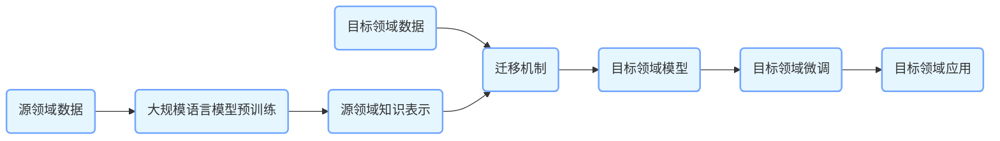

# 大规模语言模型的跨领域知识迁移与创新应用研究

> 关键词：大规模语言模型、跨领域知识迁移、创新应用、知识融合、自然语言处理

> 摘要：本文围绕大规模语言模型的跨领域知识迁移与创新应用展开深入研究。首先介绍了研究的背景、目的、预期读者等基础信息，接着阐述了大规模语言模型及跨领域知识迁移的核心概念与联系，详细讲解了相关核心算法原理及操作步骤，通过数学模型和公式进行理论支撑并举例说明。然后通过项目实战展示代码案例与实现细节，探讨了实际应用场景。同时推荐了相关的学习资源、开发工具框架以及论文著作。最后总结了未来发展趋势与挑战，还设置了常见问题解答和扩展阅读参考资料，旨在全面深入地探讨大规模语言模型在跨领域知识迁移方面的重要性、方法及应用前景。

## 1. 背景介绍 
### 1.1 目的和范围
随着人工智能技术的飞速发展，大规模语言模型如GPT系列、BERT等取得了显著的成果。这些模型在自然语言处理的多个任务中表现出色，但大多是在特定领域的数据上进行训练的。然而，现实世界中的问题往往涉及多个领域的知识。因此，研究大规模语言模型的跨领域知识迁移具有重要意义。本研究的目的在于探索如何让大规模语言模型在不同领域之间有效地迁移知识，以实现更广泛、更深入的创新应用。范围涵盖了自然语言处理、计算机科学、医学、金融、教育等多个领域，研究如何将一个领域的知识和能力迁移到其他领域，提高模型的通用性和适应性。

### 1.2 预期读者
本文的预期读者包括自然语言处理领域的研究人员、人工智能开发者、对跨领域知识迁移和大规模语言模型应用感兴趣的科研工作者、高校相关专业的师生以及企业中从事智能应用开发的技术人员等。这些读者可以从本文中获取关于大规模语言模型跨领域知识迁移的理论、方法和实践经验，为他们的研究和开发工作提供参考和启发。

### 1.3 文档结构概述
本文首先介绍研究的背景信息，包括目的、预期读者和文档结构概述等。接着阐述大规模语言模型及跨领域知识迁移的核心概念与联系，通过文本示意图和Mermaid流程图进行直观展示。然后详细讲解核心算法原理及具体操作步骤，并使用Python源代码进行阐述。再通过数学模型和公式进行理论支撑并举例说明。之后通过项目实战展示代码案例与实现细节，包括开发环境搭建、源代码实现和代码解读。随后探讨大规模语言模型跨领域知识迁移的实际应用场景。接着推荐相关的学习资源、开发工具框架以及论文著作。最后总结未来发展趋势与挑战，设置常见问题解答和扩展阅读参考资料。

### 1.4 术语表
#### 1.4.1 核心术语定义
- **大规模语言模型**：指基于深度学习技术，在大规模文本数据上进行训练的语言模型，通常具有数十亿甚至更多的参数，如GPT - 3、BERT等。这些模型能够学习到丰富的语言知识和模式，在自然语言处理任务中表现出色。
- **跨领域知识迁移**：将在一个领域中学习到的知识、技能或模式应用到另一个不同领域的过程。在大规模语言模型的背景下，是指将模型在一个领域的训练成果迁移到其他领域，以提高模型在新领域的性能。
- **知识融合**：将来自不同领域、不同来源的知识进行整合和协调，形成一个统一的知识体系，以便更好地利用和应用这些知识。

#### 1.4.2 相关概念解释
- **预训练**：大规模语言模型通常采用预训练的方式，在大规模无标注文本数据上进行自监督学习，学习到通用的语言特征和模式。预训练可以让模型在多个任务中具有较好的初始状态，减少后续训练的工作量。
- **微调**：在预训练的基础上，针对特定任务或领域，使用少量有标注的数据对模型进行进一步训练，以调整模型的参数，使其更适合该任务或领域的需求。

#### 1.4.3 缩略词列表
- **NLP**：Natural Language Processing，自然语言处理
- **GPT**：Generative Pretrained Transformer，生成式预训练变换器
- **BERT**：Bidirectional Encoder Representations from Transformers，基于变换器的双向编码器表示

## 2. 核心概念与联系 

### 大规模语言模型原理
大规模语言模型通常基于Transformer架构，Transformer由编码器和解码器组成，其中编码器负责对输入的文本进行特征提取和表示，解码器负责生成输出文本。以GPT系列为例，它是基于Transformer的解码器架构，通过自回归的方式生成文本。模型在大规模文本数据上进行预训练，学习到语言的统计规律和语义信息。

### 跨领域知识迁移原理
跨领域知识迁移的核心思想是利用模型在一个领域中学习到的通用知识和特征，将其应用到另一个领域。这可以通过多种方式实现，例如特征迁移、参数迁移等。特征迁移是指将一个领域的特征表示迁移到另一个领域，让模型在新领域中能够利用这些特征进行学习。参数迁移是指将模型在一个领域的部分或全部参数迁移到新领域的模型中，作为新模型的初始参数，从而加快新模型的训练速度和提高性能。

### 文本示意图
大规模语言模型跨领域知识迁移可以看作是一个从源领域到目标领域的知识传递过程。源领域是模型最初训练的领域，目标领域是需要应用知识的新领域。模型在源领域学习到的知识通过迁移机制传递到目标领域，在目标领域进行微调或进一步训练，以适应目标领域的任务需求。

### Mermaid流程图


## 3. 核心算法原理 & 具体操作步骤 

### 特征迁移算法原理
特征迁移的核心思想是找到源领域和目标领域之间的共同特征空间，将源领域的特征映射到这个共同特征空间，然后再将其映射到目标领域。一种常见的方法是使用对抗训练的方式，通过一个判别器来区分特征是来自源领域还是目标领域，同时让生成器将源领域的特征映射到目标领域的特征空间，使得判别器无法准确区分。

以下是一个简单的Python示例代码，使用PyTorch实现一个简单的特征迁移模型：
```python
import torch
import torch.nn as nn
import torch.optim as optim

# 定义生成器
class Generator(nn.Module):
    def __init__(self, input_dim, output_dim):
        super(Generator, self).__init__()
        self.fc = nn.Linear(input_dim, output_dim)

    def forward(self, x):
        return self.fc(x)

# 定义判别器
class Discriminator(nn.Module):
    def __init__(self, input_dim):
        super(Discriminator, self).__init__()
        self.fc = nn.Linear(input_dim, 1)
        self.sigmoid = nn.Sigmoid()

    def forward(self, x):
        return self.sigmoid(self.fc(x))

# 初始化模型
input_dim = 100
output_dim = 100
generator = Generator(input_dim, output_dim)
discriminator = Discriminator(output_dim)

# 定义损失函数和优化器
criterion = nn.BCELoss()
g_optimizer = optim.Adam(generator.parameters(), lr=0.001)
d_optimizer = optim.Adam(discriminator.parameters(), lr=0.001)

# 训练过程
num_epochs = 100
for epoch in range(num_epochs):
    # 生成源领域数据
    source_data = torch.randn(100, input_dim)
    # 生成目标领域数据
    target_data = torch.randn(100, output_dim)

    # 训练判别器
    d_optimizer.zero_grad()
    # 计算判别器对目标领域数据的输出
    real_output = discriminator(target_data)
    real_labels = torch.ones(100, 1)
    d_loss_real = criterion(real_output, real_labels)

    # 计算判别器对生成数据的输出
    fake_data = generator(source_data)
    fake_labels = torch.zeros(100, 1)
    fake_output = discriminator(fake_data.detach())
    d_loss_fake = criterion(fake_output, fake_labels)

    d_loss = d_loss_real + d_loss_fake
    d_loss.backward()
    d_optimizer.step()

    # 训练生成器
    g_optimizer.zero_grad()
    fake_output = discriminator(fake_data)
    g_loss = criterion(fake_output, real_labels)
    g_loss.backward()
    g_optimizer.step()

    if (epoch + 1) % 10 == 0:
        print(f'Epoch [{epoch + 1}/{num_epochs}], D_loss: {d_loss.item():.4f}, G_loss: {g_loss.item():.4f}')
```

### 具体操作步骤
1. **数据准备**：收集源领域和目标领域的数据，并进行预处理，如分词、向量化等。
2. **模型预训练**：在源领域数据上对大规模语言模型进行预训练，得到源领域的知识表示。
3. **特征迁移**：使用特征迁移算法，将源领域的特征迁移到目标领域的特征空间。
4. **目标领域微调**：在目标领域数据上对迁移后的模型进行微调，使其适应目标领域的任务需求。
5. **评估和优化**：使用评估指标对模型在目标领域的性能进行评估，并根据评估结果对模型进行优化。

## 4. 数学模型和公式 & 详细讲解 & 举例说明 

### 特征迁移的数学模型
假设源领域的特征表示为 $X_s \in \mathbb{R}^{n_s \times d_s}$，其中 $n_s$ 是源领域样本的数量，$d_s$ 是源领域特征的维度。目标领域的特征表示为 $X_t \in \mathbb{R}^{n_t \times d_t}$，其中 $n_t$ 是目标领域样本的数量，$d_t$ 是目标领域特征的维度。

我们希望找到一个映射函数 $G: \mathbb{R}^{d_s} \to \mathbb{R}^{d_t}$，将源领域的特征映射到目标领域的特征空间。同时，我们使用一个判别器 $D: \mathbb{R}^{d_t} \to [0, 1]$ 来区分特征是来自目标领域还是生成的特征。

判别器的目标是最大化以下损失函数：
$$
L_D = -\frac{1}{n_t} \sum_{i=1}^{n_t} \log(D(X_{t,i})) - \frac{1}{n_s} \sum_{i=1}^{n_s} \log(1 - D(G(X_{s,i})))
$$
其中 $X_{t,i}$ 是目标领域的第 $i$ 个样本，$X_{s,i}$ 是源领域的第 $i$ 个样本。

生成器的目标是最小化以下损失函数：
$$
L_G = -\frac{1}{n_s} \sum_{i=1}^{n_s} \log(D(G(X_{s,i})))
$$

### 详细讲解
判别器的损失函数 $L_D$ 由两部分组成，第一部分是对目标领域真实样本的对数似然损失，第二部分是对生成样本的对数似然损失。判别器的目标是尽可能准确地区分真实样本和生成样本。

生成器的损失函数 $L_G$ 是对生成样本被判别器判断为真实样本的对数似然损失。生成器的目标是生成能够骗过判别器的样本，使得判别器无法区分生成样本和真实样本。

### 举例说明
假设源领域是文本分类任务，目标领域是情感分析任务。源领域的特征是文本的词向量表示，目标领域的特征是情感倾向的表示。我们可以使用上述的特征迁移算法，将文本分类任务中的词向量特征迁移到情感分析任务中，帮助模型更好地理解文本的情感倾向。

在实际应用中，我们可以使用预训练的词向量模型，如Word2Vec或GloVe，得到源领域的词向量表示。然后使用生成器将这些词向量映射到目标领域的特征空间，判别器则尝试区分这些特征是来自目标领域的真实数据还是生成的数据。通过不断地训练生成器和判别器，最终实现特征的迁移。

## 5. 项目实战：代码实际案例和详细解释说明 

### 5.1  开发环境搭建
1. **安装Python**：建议使用Python 3.7及以上版本，可以从Python官方网站（https://www.python.org/downloads/）下载安装。
2. **安装深度学习框架**：本项目使用PyTorch作为深度学习框架，可以根据自己的CUDA版本和操作系统，从PyTorch官方网站（https://pytorch.org/get-started/locally/）选择合适的安装命令进行安装。
3. **安装其他依赖库**：安装一些常用的Python库，如numpy、pandas、scikit-learn等，可以使用pip命令进行安装：
```bash
pip install numpy pandas scikit-learn
```

### 5.2  源代码详细实现和代码解读
以下是一个使用大规模语言模型进行跨领域知识迁移的代码示例，我们将使用Hugging Face的Transformers库，以BERT模型为例，将在新闻文本分类任务上预训练的模型迁移到影评情感分析任务中。

```python
import torch
from torch.utils.data import Dataset, DataLoader
from transformers import BertTokenizer, BertForSequenceClassification, AdamW
from sklearn.model_selection import train_test_split
import pandas as pd

# 定义数据集类
class MovieReviewDataset(Dataset):
    def __init__(self, texts, labels, tokenizer, max_length):
        self.texts = texts
        self.labels = labels
        self.tokenizer = tokenizer
        self.max_length = max_length

    def __len__(self):
        return len(self.texts)

    def __getitem__(self, idx):
        text = str(self.texts[idx])
        label = self.labels[idx]
        encoding = self.tokenizer.encode_plus(
            text,
            add_special_tokens=True,
            max_length=self.max_length,
            padding='max_length',
            truncation=True,
            return_tensors='pt'
        )
        return {
            'input_ids': encoding['input_ids'].flatten(),
            'attention_mask': encoding['attention_mask'].flatten(),
            'labels': torch.tensor(label, dtype=torch.long)
        }

# 加载数据
data = pd.read_csv('movie_reviews.csv')
texts = data['text'].tolist()
labels = data['label'].tolist()

# 划分训练集和测试集
train_texts, test_texts, train_labels, test_labels = train_test_split(texts, labels, test_size=0.2, random_state=42)

# 加载预训练的BERT模型和分词器
tokenizer = BertTokenizer.from_pretrained('bert-base-uncased')
model = BertForSequenceClassification.from_pretrained('bert-base-uncased', num_labels=2)

# 定义数据集和数据加载器
max_length = 128
train_dataset = MovieReviewDataset(train_texts, train_labels, tokenizer, max_length)
test_dataset = MovieReviewDataset(test_texts, test_labels, tokenizer, max_length)

train_dataloader = DataLoader(train_dataset, batch_size=16, shuffle=True)
test_dataloader = DataLoader(test_dataset, batch_size=16, shuffle=False)

# 定义优化器和训练参数
optimizer = AdamW(model.parameters(), lr=2e-5)
device = torch.device('cuda' if torch.cuda.is_available() else 'cpu')
model.to(device)

# 训练模型
num_epochs = 3
for epoch in range(num_epochs):
    model.train()
    total_loss = 0
    for batch in train_dataloader:
        input_ids = batch['input_ids'].to(device)
        attention_mask = batch['attention_mask'].to(device)
        labels = batch['labels'].to(device)

        optimizer.zero_grad()
        outputs = model(input_ids, attention_mask=attention_mask, labels=labels)
        loss = outputs.loss
        loss.backward()
        optimizer.step()
        total_loss += loss.item()

    print(f'Epoch {epoch + 1}/{num_epochs}, Loss: {total_loss / len(train_dataloader)}')

# 评估模型
model.eval()
correct_predictions = 0
total_predictions = 0
with torch.no_grad():
    for batch in test_dataloader:
        input_ids = batch['input_ids'].to(device)
        attention_mask = batch['attention_mask'].to(device)
        labels = batch['labels'].to(device)

        outputs = model(input_ids, attention_mask=attention_mask)
        logits = outputs.logits
        predictions = torch.argmax(logits, dim=1)
        correct_predictions += (predictions == labels).sum().item()
        total_predictions += labels.size(0)

accuracy = correct_predictions / total_predictions
print(f'Test Accuracy: {accuracy}')
```

### 5.3  代码解读与分析
1. **数据集类定义**：`MovieReviewDataset` 类继承自 `torch.utils.data.Dataset`，用于封装影评数据。在 `__getitem__` 方法中，使用BERT的分词器将文本转换为输入ID和注意力掩码，并将标签转换为张量。
2. **数据加载**：使用 `pandas` 库加载影评数据，并使用 `sklearn` 库的 `train_test_split` 函数将数据划分为训练集和测试集。
3. **模型加载**：使用Hugging Face的 `transformers` 库加载预训练的BERT模型和分词器，并将模型的输出类别数设置为2，以适应情感分析任务。
4. **数据加载器**：使用 `torch.utils.data.DataLoader` 类创建训练集和测试集的数据加载器，设置批量大小和是否打乱数据。
5. **优化器和训练参数**：使用 `AdamW` 优化器，并将模型移动到GPU（如果可用）上进行训练。
6. **训练过程**：在每个训练周期中，将模型设置为训练模式，遍历训练集的每个批次，计算损失并进行反向传播和参数更新。
7. **评估过程**：在训练完成后，将模型设置为评估模式，遍历测试集的每个批次，计算预测结果并统计正确预测的数量，最后计算测试集的准确率。

通过这个代码示例，我们可以看到如何使用预训练的大规模语言模型进行跨领域知识迁移，将在新闻文本分类任务上预训练的BERT模型迁移到影评情感分析任务中，提高模型在新领域的性能。

## 6. 实际应用场景 

### 医疗领域
在医疗领域，大规模语言模型的跨领域知识迁移可以发挥重要作用。例如，将在医学文献领域预训练的语言模型迁移到临床诊断领域。医学文献中包含了大量的医学知识和研究成果，通过知识迁移，模型可以将这些知识应用到临床诊断中，帮助医生更好地理解患者的症状和病历信息，提供更准确的诊断建议。

另外，在药物研发领域，语言模型可以将化学、生物学等领域的知识进行融合，通过跨领域知识迁移，预测药物的疗效和副作用，加速药物研发的进程。

### 金融领域
在金融领域，跨领域知识迁移可以用于风险评估和投资决策。例如，将在宏观经济领域预训练的语言模型迁移到股票市场分析中。宏观经济数据和新闻中包含了大量的经济信息，通过知识迁移，模型可以将这些信息应用到股票市场的分析中，预测股票价格的走势，帮助投资者做出更明智的投资决策。

同时，在信贷风险评估中，语言模型可以将在信用评级领域的知识迁移到企业和个人的信贷风险评估中，提高风险评估的准确性。

### 教育领域
在教育领域，跨领域知识迁移可以用于智能辅导和个性化学习。例如，将在教育心理学领域预训练的语言模型迁移到在线教育平台中。教育心理学知识可以帮助模型更好地理解学生的学习行为和心理状态，通过知识迁移，模型可以为学生提供个性化的学习建议和辅导，提高学习效果。

此外，在课程设计和教学评估中，语言模型可以将不同学科的知识进行融合，为教师提供更全面的教学参考和评估依据。

### 法律领域
在法律领域，跨领域知识迁移可以用于法律文书的起草和法律案例的分析。例如，将在法律条文领域预训练的语言模型迁移到具体的法律案件分析中。法律条文是法律知识的重要来源，通过知识迁移，模型可以将法律条文的规定应用到具体案件中，帮助律师和法官更好地理解案件的法律性质，提供更准确的法律意见。

同时，在法律文书起草中，语言模型可以将不同类型法律文书的模板和规范进行融合，提高法律文书的质量和效率。

## 7. 工具和资源推荐
### 7.1 学习资源推荐
#### 7.1.1 书籍推荐
- 《深度学习》（Deep Learning）：由Ian Goodfellow、Yoshua Bengio和Aaron Courville所著，是深度学习领域的经典教材，全面介绍了深度学习的基本原理、算法和应用。
- 《自然语言处理入门》：作者何晗，本书系统地介绍了自然语言处理的基础知识和常用技术，适合初学者入门。
- 《Python自然语言处理》（Natural Language Processing with Python）：由Steven Bird、Ewan Klein和Edward Loper所著，通过Python代码示例详细介绍了自然语言处理的各个方面。

#### 7.1.2 在线课程
- Coursera上的“深度学习专项课程”（Deep Learning Specialization）：由Andrew Ng教授授课，涵盖了深度学习的多个方面，包括神经网络、卷积神经网络、循环神经网络等。
- edX上的“自然语言处理基础”（Foundations of Natural Language Processing）：介绍了自然语言处理的基本概念、算法和应用。
- 哔哩哔哩（Bilibili）上有许多关于自然语言处理和大规模语言模型的教程和讲解视频，可以作为学习的参考。

#### 7.1.3 技术博客和网站
- Hugging Face博客（https://huggingface.co/blog）：提供了关于大规模语言模型和自然语言处理的最新研究成果和应用案例。
- arXiv.org（https://arxiv.org/）：是一个开放获取的学术预印本平台，包含了大量关于人工智能和自然语言处理的最新研究论文。
- Medium上的人工智能和自然语言处理相关博客：许多研究人员和开发者会在Medium上分享他们的研究成果和经验。

### 7.2 开发工具框架推荐
#### 7.2.1 IDE和编辑器
- PyCharm：是一款专门为Python开发设计的集成开发环境（IDE），具有强大的代码编辑、调试和项目管理功能。
- Visual Studio Code：是一款轻量级的代码编辑器，支持多种编程语言和插件扩展，非常适合快速开发和调试。
- Jupyter Notebook：是一个交互式的笔记本环境，适合进行数据分析、模型训练和实验验证，方便代码的展示和分享。

#### 7.2.2 调试和性能分析工具
- PyTorch Profiler：是PyTorch提供的性能分析工具，可以帮助开发者分析模型的性能瓶颈，优化代码的运行效率。
- TensorBoard：是TensorFlow提供的可视化工具，也可以与PyTorch结合使用，用于可视化模型的训练过程和性能指标。
- cProfile：是Python内置的性能分析工具，可以帮助开发者分析代码的运行时间和函数调用关系。

#### 7.2.3 相关框架和库
- Hugging Face Transformers：是一个开源的自然语言处理库，提供了各种预训练的大规模语言模型，如GPT、BERT等，以及相应的训练和推理工具。
- PyTorch：是一个开源的深度学习框架，具有动态计算图和丰富的深度学习模型库，广泛应用于自然语言处理和计算机视觉等领域。
- scikit-learn：是一个开源的机器学习库，提供了各种机器学习算法和工具，如分类、回归、聚类等，方便进行数据预处理和模型评估。

### 7.3 相关论文著作推荐
#### 7.3.1 经典论文
- “Attention Is All You Need”：提出了Transformer架构，为大规模语言模型的发展奠定了基础。
- “BERT: Pre-training of Deep Bidirectional Transformers for Language Understanding”：介绍了BERT模型的预训练方法和应用，在自然语言处理领域引起了广泛关注。
- “Generative Pretrained Transformer 3 (GPT - 3): Language Models Are Few - Shot Learners”：介绍了GPT - 3模型的特点和性能，展示了大规模语言模型在少样本学习方面的强大能力。

#### 7.3.2 最新研究成果
- 关注arXiv.org上关于大规模语言模型和跨领域知识迁移的最新研究论文，了解该领域的前沿动态。
- 阅读顶级学术会议（如ACL、EMNLP、NeurIPS等）上的相关论文，掌握最新的研究方法和技术。

#### 7.3.3 应用案例分析
- 研究一些实际应用案例，如谷歌、微软等公司在大规模语言模型应用方面的案例，学习他们的经验和方法。
- 分析一些开源项目中的应用案例，了解如何将大规模语言模型和跨领域知识迁移技术应用到实际项目中。

## 8. 总结：未来发展趋势与挑战

### 未来发展趋势
1. **更强大的跨领域迁移能力**：未来的大规模语言模型将具备更强大的跨领域知识迁移能力，能够在更多领域之间实现高效的知识迁移，提高模型的通用性和适应性。
2. **知识融合的深度和广度提升**：随着技术的发展，大规模语言模型将能够更好地融合不同领域的知识，实现更深度和广度的知识融合，为解决复杂的跨领域问题提供更有力的支持。
3. **与其他技术的融合**：大规模语言模型将与计算机视觉、语音识别等其他人工智能技术进行更深入的融合，实现多模态的跨领域知识迁移和应用，创造更多的创新应用场景。
4. **低资源领域的应用拓展**：未来的研究将更加关注低资源领域的跨领域知识迁移，通过知识迁移技术，帮助低资源领域利用其他领域的知识和经验，提升其发展水平。

### 挑战
1. **知识表示和融合的困难**：不同领域的知识具有不同的表示方式和语义，如何有效地将这些知识进行表示和融合是一个挑战。需要研究更有效的知识表示方法和融合算法，以提高跨领域知识迁移的效果。
2. **数据隐私和安全问题**：在跨领域知识迁移过程中，需要使用大量的数据，这些数据可能涉及到用户的隐私和敏感信息。如何保证数据的隐私和安全，防止数据泄露和滥用，是一个亟待解决的问题。
3. **模型可解释性**：大规模语言模型通常是黑盒模型，其决策过程和结果难以解释。在跨领域知识迁移中，模型的可解释性尤为重要，因为用户需要了解模型是如何利用不同领域的知识进行决策的。需要研究更有效的模型可解释性方法，提高模型的可信度和用户接受度。
4. **计算资源和成本**：训练和运行大规模语言模型需要大量的计算资源和成本，这限制了其在一些领域的应用。需要研究更高效的算法和模型结构，降低计算资源的需求和成本，提高大规模语言模型的可扩展性和实用性。

## 9. 附录：常见问题与解答

### 1. 大规模语言模型跨领域知识迁移的效果如何评估？
可以使用多种评估指标来评估跨领域知识迁移的效果，如准确率、召回率、F1值等。对于分类任务，可以计算模型在目标领域测试集上的分类准确率；对于回归任务，可以计算均方误差（MSE）、平均绝对误差（MAE）等。此外，还可以使用人工评估的方法，让领域专家对模型的输出结果进行评估和打分。

### 2. 如何选择合适的源领域和目标领域进行知识迁移？
选择源领域和目标领域时，需要考虑它们之间的相关性和互补性。源领域应该具有丰富的知识和数据，并且与目标领域有一定的关联。例如，如果目标领域是医疗诊断，可以选择医学文献领域作为源领域，因为医学文献中包含了大量的医学知识和研究成果，与医疗诊断有密切的关系。同时，还需要考虑目标领域的需求和特点，选择能够为目标领域提供有效支持的源领域。

### 3. 跨领域知识迁移是否会导致模型在源领域的性能下降？
一般情况下，合理的跨领域知识迁移不会导致模型在源领域的性能下降。在进行知识迁移时，可以采用一些策略，如冻结部分源领域的参数、使用正则化方法等，来保证模型在源领域的性能。同时，通过在目标领域的微调，可以使模型在目标领域获得更好的性能，而不会对源领域的性能产生负面影响。

### 4. 如何处理不同领域数据的格式和语义差异？
处理不同领域数据的格式和语义差异是跨领域知识迁移的关键问题之一。可以采用数据预处理的方法，将不同格式的数据转换为统一的格式。对于语义差异，可以使用词向量、预训练语言模型等技术，将不同领域的文本数据转换为向量表示，从而在向量空间中进行知识迁移。此外，还可以使用领域自适应的方法，学习不同领域之间的语义映射关系，减少语义差异的影响。

## 10. 扩展阅读 & 参考资料
1. Goodfellow, I., Bengio, Y., & Courville, A. (2016). Deep Learning. MIT Press.
2. Bird, S., Klein, E., & Loper, E. (2009). Natural Language Processing with Python. O'Reilly Media.
3. Devlin, J., Chang, M. - W., Lee, K., & Toutanova, K. (2018). BERT: Pre - training of Deep Bidirectional Transformers for Language Understanding. arXiv preprint arXiv:1810.04805.
4. Brown, T. B., Mann, B., Ryder, N., Subbiah, M., Kaplan, J. D., Dhariwal, P.,... & Amodei, D. (2020). Language Models Are Few - Shot Learners. arXiv preprint arXiv:2005.14165.
5. Vaswani, A., Shazeer, N., Parmar, N., Uszkoreit, J., Jones, L., Gomez, A. N.,... & Polosukhin, I. (2017). Attention Is All You Need. Advances in Neural Information Processing Systems, 5998 - 6008.
6. Hugging Face官方文档（https://huggingface.co/docs）
7. PyTorch官方文档（https://pytorch.org/docs/stable/index.html）
8. scikit - learn官方文档（https://scikit - learn.org/stable/documentation.html）