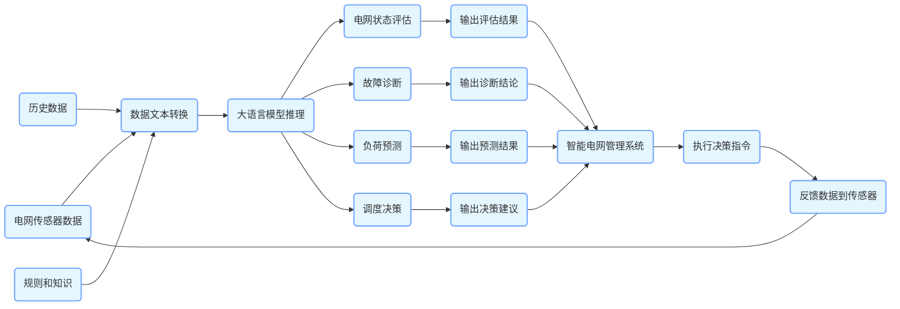

# 大语言模型在智能电网管理中的推理应用

> 关键词：大语言模型、智能电网管理、推理应用、电力系统、能源优化

> 摘要：本文深入探讨了大语言模型在智能电网管理中的推理应用。首先介绍了研究的背景、目的、预期读者和文档结构，解释了相关术语。接着阐述了大语言模型与智能电网管理的核心概念及联系，给出了原理和架构的文本示意图与 Mermaid 流程图。详细讲解了核心算法原理并给出 Python 源代码，分析了数学模型和公式。通过项目实战展示了代码实现与解读，探讨了实际应用场景。推荐了学习资源、开发工具框架和相关论文著作。最后总结了未来发展趋势与挑战，提供了常见问题解答和扩展阅读参考资料，旨在为大语言模型在智能电网管理中的应用提供全面且深入的技术指导。

## 1. 背景介绍 
### 1.1 目的和范围
智能电网作为现代电力系统的发展方向，其管理涉及到复杂的决策过程，包括电力调度、故障诊断、负荷预测等。大语言模型具有强大的语言理解和推理能力，本研究的目的在于探索如何将大语言模型的推理能力应用于智能电网管理中，以提高管理的效率和准确性。范围涵盖了从理论分析到实际应用案例，包括大语言模型在智能电网各个环节的推理应用原理、算法实现、项目实践等方面。

### 1.2 预期读者
本文预期读者包括电力系统工程师、人工智能研究人员、智能电网管理人员以及对大语言模型和智能电网交叉领域感兴趣的科研人员和学生。这些读者具备一定的电力系统和人工智能基础知识，希望深入了解大语言模型在智能电网管理中的具体应用和技术细节。

### 1.3 文档结构概述
本文首先介绍相关背景知识，包括研究目的、预期读者和文档结构。然后阐述大语言模型与智能电网管理的核心概念及联系，展示原理和架构。接着详细讲解核心算法原理和具体操作步骤，给出数学模型和公式。通过项目实战展示代码实现和解读。之后探讨实际应用场景，推荐学习资源、开发工具框架和相关论文著作。最后总结未来发展趋势与挑战，提供常见问题解答和扩展阅读参考资料。

### 1.4 术语表
#### 1.4.1 核心术语定义
- **大语言模型（Large Language Model）**：基于深度学习技术，通过在大规模文本数据上进行训练得到的语言模型，能够理解和生成自然语言文本，具有强大的语言推理和知识表达能力。
- **智能电网（Smart Grid）**：将先进的信息技术、通信技术、控制技术与电力系统相结合，实现电力系统的智能化管理和运行，包括发电、输电、变电、配电和用电等各个环节。
- **推理应用（Inference Application）**：利用大语言模型的推理能力，对智能电网管理中的各种问题进行分析、判断和决策，如故障诊断、负荷预测、电力调度等。

#### 1.4.2 相关概念解释
- **电力系统（Power System）**：由发电、输电、变电、配电和用电等环节组成的电能生产与消费系统，是智能电网的基础。
- **深度学习（Deep Learning）**：一种基于人工神经网络的机器学习方法，通过构建多层神经网络模型，自动从大量数据中学习特征和模式，大语言模型就是基于深度学习技术构建的。
- **自然语言处理（Natural Language Processing）**：研究如何让计算机理解和处理人类自然语言的技术领域，大语言模型是自然语言处理领域的重要成果。

#### 1.4.3 缩略词列表
- **AI**：Artificial Intelligence，人工智能
- **ML**：Machine Learning，机器学习
- **DL**：Deep Learning，深度学习
- **NLP**：Natural Language Processing，自然语言处理
- **SG**：Smart Grid，智能电网

## 2. 核心概念与联系 

### 核心概念原理
大语言模型基于深度学习架构，通常采用Transformer架构，通过在大规模文本数据上进行预训练，学习到丰富的语言知识和模式。在智能电网管理中，大语言模型可以将电网相关的数据和信息转化为自然语言描述，然后利用其强大的推理能力对这些描述进行分析和处理，从而实现对电网状态的评估、故障诊断、负荷预测等功能。

例如，大语言模型可以接收电网中各种传感器采集到的实时数据，如电压、电流、功率等，将这些数据转化为自然语言文本“当前节点A的电压为220V，电流为10A，功率为2200W”。然后，模型根据预训练学到的知识和推理能力，对这些文本进行分析，判断电网是否处于正常运行状态。如果电压超出了正常范围，模型可以推理出可能存在的故障原因，并给出相应的解决方案。

### 架构的文本示意图
```plaintext
+----------------------+
| 大语言模型           |
|                      |
| 输入：               |
| - 电网实时数据文本   |
| - 历史数据文本       |
| - 规则和知识文本     |
|                      |
| 处理：               |
| - 语言理解           |
| - 推理分析           |
|                      |
| 输出：               |
| - 电网状态评估结果   |
| - 故障诊断结论       |
| - 负荷预测结果       |
| - 调度决策建议       |
+----------------------+
|                      |
| 与智能电网系统交互： |
| - 接收传感器数据     |
| - 发送决策指令       |
+----------------------+
```

### Mermaid 流程图


## 3. 核心算法原理 & 具体操作步骤 

### 核心算法原理
大语言模型在智能电网管理中的推理应用主要基于以下几个核心算法原理：

#### 语言理解算法
大语言模型通过预训练学习到了丰富的语言知识和模式，能够对输入的自然语言文本进行理解。在智能电网管理中，输入的文本通常是电网相关的数据和信息，如“当前节点A的电压为220V，电流为10A，功率为2200W”。语言理解算法的目标是将这些文本转化为模型能够处理的语义表示，以便后续进行推理分析。

#### 推理分析算法
推理分析算法是大语言模型的核心，它基于预训练学到的知识和推理能力，对语言理解算法输出的语义表示进行分析和处理。在智能电网管理中，推理分析算法可以实现以下功能：
- **电网状态评估**：根据输入的电网数据，判断电网是否处于正常运行状态。
- **故障诊断**：如果电网出现异常，分析可能的故障原因。
- **负荷预测**：根据历史数据和当前电网状态，预测未来一段时间内的电力负荷。
- **调度决策**：根据电网状态评估、故障诊断和负荷预测结果，给出相应的调度决策建议。

### 具体操作步骤

#### 数据准备
- 收集智能电网中各种传感器采集到的实时数据，如电压、电流、功率等。
- 整理历史数据，包括电网的运行记录、故障记录等。
- 收集电网的规则和知识，如安全标准、调度规则等。
- 将上述数据转化为自然语言文本格式，作为大语言模型的输入。

#### 模型选择和微调
- 选择合适的大语言模型，如GPT系列、BERT等。
- 根据智能电网管理的具体任务，对大语言模型进行微调，使其更好地适应电网数据和任务需求。

#### 推理过程
- 将准备好的输入文本输入到微调后的大语言模型中。
- 大语言模型进行语言理解和推理分析，输出电网状态评估结果、故障诊断结论、负荷预测结果和调度决策建议。

#### 结果应用
- 将大语言模型的输出结果反馈给智能电网管理系统。
- 智能电网管理系统根据输出结果执行相应的决策指令，如调整电力调度、进行故障修复等。

### Python源代码示例
```python
import torch
from transformers import AutoTokenizer, AutoModelForSequenceClassification

# 选择合适的大语言模型
model_name = "bert-base-uncased"
tokenizer = AutoTokenizer.from_pretrained(model_name)
model = AutoModelForSequenceClassification.from_pretrained(model_name)

# 准备输入文本
input_text = "当前节点A的电压为220V，电流为10A，功率为2200W"
inputs = tokenizer(input_text, return_tensors="pt")

# 进行推理
with torch.no_grad():
    outputs = model(**inputs)

# 获取推理结果
logits = outputs.logits
predicted_class_id = logits.argmax().item()
print(f"预测结果：{predicted_class_id}")
```

## 4. 数学模型和公式 & 详细讲解 & 举例说明 

### 语言模型的基本数学模型
大语言模型通常基于概率语言模型，其核心思想是计算给定输入文本序列 $x = [x_1, x_2, \cdots, x_n]$ 的概率分布 $P(x)$。在实践中，为了便于计算和处理，通常将 $P(x)$ 分解为条件概率的乘积：

$$P(x) = \prod_{i=1}^{n} P(x_i | x_1, x_2, \cdots, x_{i-1})$$

其中，$P(x_i | x_1, x_2, \cdots, x_{i-1})$ 表示在给定前面 $i-1$ 个词的条件下，第 $i$ 个词出现的概率。

### Transformer架构中的注意力机制
Transformer架构是大语言模型的核心组件，其中的注意力机制用于计算输入序列中不同位置之间的相关性。注意力机制的计算公式如下：

$$Attention(Q, K, V) = softmax(\frac{QK^T}{\sqrt{d_k}})V$$

其中，$Q$ 是查询矩阵，$K$ 是键矩阵，$V$ 是值矩阵，$d_k$ 是键向量的维度。$QK^T$ 计算查询和键之间的相似度，$\frac{QK^T}{\sqrt{d_k}}$ 用于缩放相似度得分，$softmax$ 函数将相似度得分转化为概率分布，最后与值矩阵 $V$ 相乘得到注意力输出。

### 举例说明
假设我们有一个简单的输入序列 $x = [“当前节点A”，“电压为”，“220V”]$，我们可以将其表示为词向量序列 $[v_1, v_2, v_3]$。在计算注意力时，我们首先将词向量输入到查询、键和值的线性变换层中，得到 $Q$、$K$ 和 $V$ 矩阵。然后，根据上述注意力公式计算注意力输出。

例如，当计算“当前节点A”这个词的注意力输出时，我们首先计算它与其他词的相似度得分：

$$sim_{12} = \frac{q_1^T k_2}{\sqrt{d_k}}$$
$$sim_{13} = \frac{q_1^T k_3}{\sqrt{d_k}}$$

其中，$q_1$ 是“当前节点A”的查询向量，$k_2$ 和 $k_3$ 分别是“电压为”和“220V”的键向量。然后，使用 $softmax$ 函数将相似度得分转化为概率分布：

$$p_{12} = \frac{exp(sim_{12})}{exp(sim_{12}) + exp(sim_{13})}$$
$$p_{13} = \frac{exp(sim_{13})}{exp(sim_{12}) + exp(sim_{13})}$$

最后，计算“当前节点A”的注意力输出：

$$a_1 = p_{12} v_2 + p_{13} v_3$$

通过这种方式，注意力机制可以捕捉输入序列中不同位置之间的相关性，从而提高模型的语言理解和推理能力。

## 5. 项目实战：代码实际案例和详细解释说明 

### 5.1  开发环境搭建
#### 硬件环境
- 服务器：建议使用具有GPU加速的服务器，如NVIDIA GPU，以提高模型的训练和推理速度。
- 内存：至少16GB，推荐32GB或以上。
- 存储：至少500GB的硬盘空间，用于存储数据和模型。

#### 软件环境
- 操作系统：Ubuntu 18.04或以上版本。
- Python：Python 3.7或以上版本。
- 深度学习框架：PyTorch 1.8或以上版本。
- 自然语言处理库：transformers库，用于加载和使用大语言模型。

#### 安装步骤
1. 安装CUDA和cuDNN，以支持GPU加速。
2. 创建Python虚拟环境：
```bash
python3 -m venv myenv
source myenv/bin/activate
```
3. 安装所需的Python库：
```bash
pip install torch torchvision torchaudio --extra-index-url https://download.pytorch.org/whl/cu113
pip install transformers
```

### 5.2  源代码详细实现和代码解读
以下是一个完整的项目实战代码示例，用于实现大语言模型在智能电网故障诊断中的推理应用：

```python
import torch
from transformers import AutoTokenizer, AutoModelForSequenceClassification

# 选择合适的大语言模型
model_name = "bert-base-uncased"
tokenizer = AutoTokenizer.from_pretrained(model_name)
model = AutoModelForSequenceClassification.from_pretrained(model_name, num_labels=2)

# 准备训练数据
train_texts = [
    "当前节点A的电压异常升高，可能存在短路故障",
    "节点B的电流突然下降，可能是线路断开",
    "节点C的功率正常，运行状态良好"
]
train_labels = [1, 1, 0]

# 对训练数据进行编码
train_encodings = tokenizer(train_texts, truncation=True, padding=True)
train_dataset = torch.utils.data.TensorDataset(
    torch.tensor(train_encodings['input_ids']),
    torch.tensor(train_encodings['attention_mask']),
    torch.tensor(train_labels)
)

# 定义训练参数
train_loader = torch.utils.data.DataLoader(train_dataset, batch_size=2, shuffle=True)
optimizer = torch.optim.AdamW(model.parameters(), lr=5e-5)

# 训练模型
device = torch.device('cuda') if torch.cuda.is_available() else torch.device('cpu')
model.to(device)
model.train()
for epoch in range(3):
    for batch in train_loader:
        batch = tuple(t.to(device) for t in batch)
        input_ids, attention_mask, labels = batch
        optimizer.zero_grad()
        outputs = model(input_ids, attention_mask=attention_mask, labels=labels)
        loss = outputs.loss
        loss.backward()
        optimizer.step()

# 进行推理
test_text = "当前节点D的电压急剧下降，可能有故障"
test_encoding = tokenizer(test_text, truncation=True, padding=True, return_tensors='pt')
test_encoding = {k: v.to(device) for k, v in test_encoding.items()}
model.eval()
with torch.no_grad():
    outputs = model(**test_encoding)
    logits = outputs.logits
    predicted_class_id = logits.argmax().item()
    print(f"预测结果：{'故障' if predicted_class_id == 1 else '正常'}")
```

### 代码解读与分析
1. **模型选择和加载**：选择了`bert-base-uncased`模型，并使用`transformers`库中的`AutoTokenizer`和`AutoModelForSequenceClassification`进行加载。
2. **数据准备**：准备了训练数据和标签，使用`tokenizer`对训练数据进行编码，将其转化为模型可以处理的输入格式。
3. **模型训练**：定义了训练参数，如批量大小、优化器等，使用`DataLoader`加载训练数据，然后进行模型训练。
4. **推理过程**：准备测试文本，对其进行编码，将编码后的输入传入模型进行推理，最后根据模型输出的logits选择预测结果。

## 6. 实际应用场景 
### 故障诊断
大语言模型可以接收电网中各种传感器采集到的实时数据，如电压、电流、功率等，将这些数据转化为自然语言文本，然后利用其推理能力分析可能的故障原因。例如，当某个节点的电压突然升高时，模型可以根据预训练学到的知识和推理能力，判断可能是短路故障，并给出相应的解决方案。

### 负荷预测
大语言模型可以根据历史负荷数据和当前电网状态，预测未来一段时间内的电力负荷。通过对大量历史数据的学习，模型可以捕捉到负荷变化的规律和趋势，从而提高负荷预测的准确性。例如，在夏季高温天气时，模型可以预测到电力负荷会大幅增加，以便电网管理部门提前做好调度准备。

### 电力调度
大语言模型可以根据电网状态评估、故障诊断和负荷预测结果，给出相应的调度决策建议。例如，当某个地区的电力负荷过高时，模型可以建议从其他地区调配电力资源，以保证电网的稳定运行。

### 设备维护管理
大语言模型可以分析设备的运行数据和维护记录，预测设备的故障概率和剩余使用寿命，从而制定合理的维护计划。例如，当某个设备的运行参数出现异常时，模型可以提醒维护人员及时进行检查和维修。

## 7. 工具和资源推荐
### 7.1 学习资源推荐
#### 7.1.1 书籍推荐
- 《深度学习》（Deep Learning）：由Ian Goodfellow、Yoshua Bengio和Aaron Courville合著，是深度学习领域的经典教材，全面介绍了深度学习的基本原理、算法和应用。
- 《自然语言处理入门》（Natural Language Processing in Action）：由Jakub Adamczyk、Janusz Tracz和Joanna Rybka合著，系统介绍了自然语言处理的基本概念、技术和应用，包括大语言模型的相关内容。
- 《智能电网基础》（Fundamentals of Smart Grid）：由Ali Keyhani主编，详细介绍了智能电网的基本概念、技术和应用，是学习智能电网的重要参考书籍。

#### 7.1.2 在线课程
- Coursera上的“深度学习专项课程”（Deep Learning Specialization）：由Andrew Ng教授授课，全面介绍了深度学习的基本原理、算法和应用，包括大语言模型的相关内容。
- edX上的“自然语言处理基础”（Foundations of Natural Language Processing）：由哥伦比亚大学的教授授课，系统介绍了自然语言处理的基本概念、技术和应用。
- Udemy上的“智能电网技术与应用”（Smart Grid Technology and Applications）：详细介绍了智能电网的基本概念、技术和应用，包括大语言模型在智能电网管理中的应用。

#### 7.1.3 技术博客和网站
- Medium：是一个技术博客平台，上面有很多关于大语言模型和智能电网的技术文章和研究成果。
- arXiv：是一个预印本服务器，上面有很多关于大语言模型和智能电网的最新研究论文。
- IEEE Xplore：是电气和电子工程师协会（IEEE）的数字图书馆，上面有很多关于智能电网和人工智能的学术论文和技术报告。

### 7.2 开发工具框架推荐
#### 7.2.1 IDE和编辑器
- PyCharm：是一款专门为Python开发设计的集成开发环境（IDE），具有强大的代码编辑、调试和分析功能。
- Jupyter Notebook：是一个交互式笔记本，支持Python、R等多种编程语言，非常适合进行数据探索和模型实验。
- Visual Studio Code：是一款轻量级的代码编辑器，支持多种编程语言和插件，具有丰富的扩展功能。

#### 7.2.2 调试和性能分析工具
- PyTorch Profiler：是PyTorch自带的性能分析工具，可以帮助开发者分析模型的训练和推理时间、内存使用等性能指标。
- TensorBoard：是TensorFlow的可视化工具，也可以用于PyTorch模型的可视化和性能分析。
- cProfile：是Python标准库中的性能分析工具，可以帮助开发者分析Python代码的执行时间和调用关系。

#### 7.2.3 相关框架和库
- PyTorch：是一个开源的深度学习框架，具有强大的GPU加速能力和灵活的模型构建功能，广泛应用于大语言模型的开发和训练。
- transformers：是Hugging Face开发的自然语言处理库，提供了多种预训练的大语言模型，如GPT、BERT等，方便开发者快速使用和微调。
- Pandas：是一个数据处理和分析库，提供了丰富的数据结构和数据操作函数，方便开发者处理和分析智能电网数据。

### 7.3 相关论文著作推荐
#### 7.3.1 经典论文
- “Attention Is All You Need”：介绍了Transformer架构，是大语言模型的核心技术之一。
- “BERT: Pre-training of Deep Bidirectional Transformers for Language Understanding”：介绍了BERT模型，开创了预训练语言模型的先河。
- “Power System State Estimation: A Generalized Approach”：介绍了电力系统状态估计的基本原理和方法，是智能电网管理中的重要研究领域。

#### 7.3.2 最新研究成果
- 关注arXiv上关于大语言模型和智能电网的最新研究论文，了解该领域的最新发展动态。
- 关注IEEE Transactions on Smart Grid等学术期刊上的相关研究成果，获取高质量的学术论文。

#### 7.3.3 应用案例分析
- 可以参考一些实际的智能电网项目案例，了解大语言模型在实际应用中的效果和挑战。例如，某些电网公司在故障诊断和负荷预测中应用大语言模型的案例分析。

## 8. 总结：未来发展趋势与挑战
### 未来发展趋势
- **模型融合与创新**：未来大语言模型可能会与其他人工智能技术，如强化学习、计算机视觉等进行融合，以实现更复杂的智能电网管理任务。例如，结合计算机视觉技术对电网设备进行图像识别和故障检测，再利用大语言模型进行故障原因分析和决策建议。
- **多模态数据处理**：智能电网管理中会产生大量的多模态数据，如文本、图像、音频等。大语言模型将逐渐具备处理多模态数据的能力，从而更全面地理解电网状态和问题。
- **边缘计算与分布式应用**：随着边缘计算技术的发展，大语言模型可能会在边缘设备上进行部署和推理，以减少数据传输延迟，提高响应速度。同时，分布式大语言模型的应用也将成为一个发展方向，多个模型可以协同工作，提高整体的推理效率和准确性。

### 挑战
- **数据隐私和安全**：智能电网管理涉及到大量的敏感数据，如用户用电信息、电网拓扑结构等。在使用大语言模型进行推理应用时，需要确保数据的隐私和安全，防止数据泄露和恶意攻击。
- **模型可解释性**：大语言模型通常是基于深度学习架构构建的，其决策过程往往是黑盒的，难以解释。在智能电网管理中，需要模型的决策具有可解释性，以便管理人员能够理解和信任模型的输出结果。
- **计算资源需求**：大语言模型的训练和推理需要大量的计算资源，包括GPU、内存等。在实际应用中，需要解决计算资源的限制问题，提高模型的运行效率。

## 9. 附录：常见问题与解答
### 大语言模型在智能电网管理中的推理准确性如何保证？
大语言模型的推理准确性可以通过以下几个方面来保证：
- **数据质量**：确保输入的数据准确、完整、及时，对数据进行清洗和预处理，去除噪声和异常值。
- **模型微调**：根据智能电网管理的具体任务，对大语言模型进行微调，使其更好地适应电网数据和任务需求。
- **多模型融合**：可以将多个不同的大语言模型进行融合，或者结合其他传统的机器学习模型，提高推理的准确性和可靠性。
- **验证和评估**：使用历史数据和实际测试数据对模型进行验证和评估，不断优化模型的参数和结构。

### 大语言模型在智能电网管理中的应用成本高吗？
大语言模型的应用成本主要包括计算资源成本、数据处理成本和模型训练成本。在计算资源方面，大语言模型的训练和推理需要大量的GPU和内存，成本相对较高。但是，随着技术的发展和硬件成本的降低，计算资源成本会逐渐下降。在数据处理和模型训练方面，可以通过优化算法和数据管理方式来降低成本。同时，大语言模型在智能电网管理中的应用可以带来显著的效益，如提高电网的运行效率、降低故障发生率等，从长远来看，其应用成本是可以接受的。

### 大语言模型在智能电网管理中的可扩展性如何？
大语言模型具有较好的可扩展性。一方面，随着数据量的增加和任务需求的变化，可以对大语言模型进行持续的训练和微调，以适应新的数据和任务。另一方面，大语言模型可以与其他人工智能技术和系统进行集成，实现更复杂的功能。例如，可以将大语言模型与智能电网的监控系统、调度系统等进行集成，实现数据的实时交互和决策的自动执行。

## 10. 扩展阅读 & 参考资料
### 扩展阅读
- 《人工智能：现代方法》（Artificial Intelligence: A Modern Approach）：全面介绍了人工智能的基本概念、技术和应用，包括大语言模型的相关内容。
- 《电力系统自动化》（Power System Automation）：介绍了电力系统自动化的基本原理和技术，是学习智能电网管理的重要参考书籍。
- 《自然语言处理：理论、算法与应用》（Natural Language Processing: Principles, Algorithms, and Applications）：深入介绍了自然语言处理的理论和算法，对于理解大语言模型的原理和应用有很大帮助。

### 参考资料
- Hugging Face官方文档：https://huggingface.co/docs/transformers/index
- PyTorch官方文档：https://pytorch.org/docs/stable/index.html
- IEEE Transactions on Smart Grid期刊：https://ieeexplore.ieee.org/xpl/RecentIssue.jsp?punumber=6770783