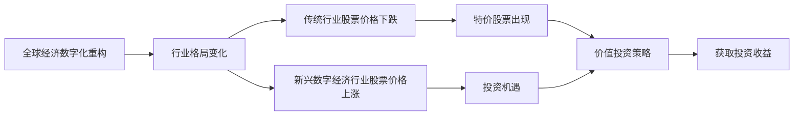

# 如何利用特价股票投资应对全球经济数字化重构

> 关键词：特价股票、投资策略、全球经济数字化重构、股票分析、风险控制

> 摘要：本文围绕如何利用特价股票投资应对全球经济数字化重构展开。在全球经济数字化加速的背景下，股票市场格局发生着深刻变化，特价股票蕴含着特殊的投资机遇。文章首先介绍了相关背景知识，包括目的范围、预期读者等内容。接着阐述核心概念，分析特价股票与全球经济数字化重构之间的联系。详细讲解核心算法原理与具体操作步骤，通过数学模型和公式进行深入剖析。结合项目实战给出实际案例及详细解释。探讨了实际应用场景，推荐了相关的工具和资源。最后总结未来发展趋势与挑战，解答常见问题并提供扩展阅读和参考资料，旨在为投资者在全球经济数字化重构的大环境下，利用特价股票投资提供全面且专业的指导。

## 1. 背景介绍 
### 1.1 目的和范围
本文章的目的在于为投资者提供一套系统的方法，以利用特价股票投资来应对全球经济数字化重构带来的机遇和挑战。范围涵盖了对特价股票的定义、分析方法，全球经济数字化重构的趋势解读，以及如何将两者结合制定有效的投资策略。同时，还包括了从理论到实践的各个环节，如核心算法原理、数学模型、项目实战案例等，旨在为投资者提供全方位的参考。

### 1.2 预期读者
预期读者主要包括有一定投资经验的个人投资者、金融机构从业人员、投资研究人员等。对于那些希望在全球经济数字化重构的大背景下，寻找新的投资机会，优化投资组合的人群具有较高的参考价值。对于初学者，也可以作为了解特价股票投资和全球经济数字化趋势的入门资料。

### 1.3 文档结构概述
本文将按照以下结构进行阐述：首先介绍背景知识，包括目的、预期读者和文档结构等内容。接着讲解核心概念，分析特价股票与全球经济数字化重构之间的联系，并给出相应的示意图和流程图。然后详细讲解核心算法原理和具体操作步骤，结合数学模型和公式进行深入分析。通过项目实战案例展示如何在实际中运用这些方法。探讨实际应用场景，推荐相关的工具和资源。最后总结未来发展趋势与挑战，解答常见问题并提供扩展阅读和参考资料。

### 1.4 术语表
#### 1.4.1 核心术语定义
- **特价股票**：指价格相对其内在价值被低估的股票。这些股票可能由于市场短期波动、行业负面消息、公司短期困境等原因，导致股价低于其应有的价值。
- **全球经济数字化重构**：指全球经济在数字技术的推动下，进行的全方位、深层次的结构调整和变革。包括产业数字化转型、数字经济的快速发展、经济活动的数字化升级等方面。
- **内在价值**：股票所代表的公司的真实价值，通常通过对公司的财务状况、盈利能力、发展前景等多方面因素进行综合评估得出。

#### 1.4.2 相关概念解释
- **价值投资**：一种投资策略，强调通过分析股票的内在价值，寻找被低估的股票进行投资，长期持有以获取股票价格回归内在价值带来的收益。
- **数字化转型**：企业或行业利用数字技术对业务流程、商业模式、组织架构等进行全面改造和升级，以提高效率、创新能力和竞争力。

#### 1.4.3 缩略词列表
- **GDP**：国内生产总值（Gross Domestic Product）
- **AI**：人工智能（Artificial Intelligence）
- **IoT**：物联网（Internet of Things）

## 2. 核心概念与联系 

### 核心概念原理
#### 特价股票原理
特价股票的出现主要是由于市场的非有效性。市场参与者的情绪、信息不对称、短期事件冲击等因素，会导致股票价格偏离其内在价值。例如，当市场整体处于恐慌情绪时，即使一些公司的基本面没有发生实质性变化，其股价也可能大幅下跌，从而形成特价股票。投资者通过对公司基本面的深入分析，识别出这些被低估的股票，在价格回归内在价值的过程中获取收益。

#### 全球经济数字化重构原理
全球经济数字化重构是数字技术不断发展和应用的结果。数字技术如大数据、人工智能、物联网等的出现，改变了传统的生产、消费和交易模式。企业通过数字化转型，提高生产效率、降低成本、拓展市场，从而推动整个经济结构的变革。例如，电子商务的发展改变了零售业的格局，智能制造提高了制造业的竞争力。

### 架构的文本示意图
全球经济数字化重构与特价股票投资之间存在着密切的联系。全球经济数字化重构会导致行业格局的变化，一些传统行业可能面临挑战，而新兴的数字经济相关行业则可能迎来发展机遇。这会反映在股票市场上，传统行业的股票可能因业绩下滑而价格下跌，成为特价股票；而数字经济相关行业的股票可能因前景看好而价格上涨。投资者可以通过分析全球经济数字化重构的趋势，寻找那些具有潜力的特价股票进行投资。



## 3. 核心算法原理 & 具体操作步骤 

### 核心算法原理
在寻找特价股票时，可以使用市盈率（P/E）、市净率（P/B）等指标结合基本面分析来评估股票的价值。以下是一个简单的Python代码示例，用于计算股票的市盈率和市净率：

```python
# 定义股票类
class Stock:
    def __init__(self, price, earnings_per_share, book_value_per_share):
        self.price = price
        self.earnings_per_share = earnings_per_share
        self.book_value_per_share = book_value_per_share

    # 计算市盈率
    def calculate_pe_ratio(self):
        if self.earnings_per_share == 0:
            return None
        return self.price / self.earnings_per_share

    # 计算市净率
    def calculate_pb_ratio(self):
        if self.book_value_per_share == 0:
            return None
        return self.price / self.book_value_per_share

# 示例股票数据
stock = Stock(50, 5, 20)

# 计算市盈率和市净率
pe_ratio = stock.calculate_pe_ratio()
pb_ratio = stock.calculate_pb_ratio()

print(f"市盈率: {pe_ratio}")
print(f"市净率: {pb_ratio}")
```

### 具体操作步骤
1. **数据收集**：收集股票的相关数据，包括股价、每股收益、每股净资产等财务数据，以及行业信息、公司公告等非财务数据。
2. **指标计算**：使用上述代码计算市盈率、市净率等指标。
3. **筛选股票**：根据计算得到的指标，筛选出市盈率和市净率低于行业平均水平的股票，这些股票可能是特价股票的候选对象。
4. **基本面分析**：对筛选出的股票进行基本面分析，包括公司的盈利能力、偿债能力、发展前景等方面，以确定其是否真正被低估。
5. **风险评估**：评估投资这些股票可能面临的风险，如行业竞争风险、政策风险等。
6. **投资决策**：综合考虑股票的价值和风险，做出投资决策。

## 4. 数学模型和公式 & 详细讲解 & 举例说明 

### 市盈率（P/E）模型
市盈率是股票价格与每股收益的比值，公式为：
$$P/E = \frac{Price}{Earnings\ per\ Share}$$
其中，$Price$ 是股票的当前价格，$Earnings\ per\ Share$ 是每股收益。市盈率反映了投资者为获取公司每一元盈利所愿意支付的价格。一般来说，市盈率较低的股票可能被低估。

例如，某股票的当前价格为50元，每股收益为5元，则其市盈率为：
$$P/E = \frac{50}{5} = 10$$

### 市净率（P/B）模型
市净率是股票价格与每股净资产的比值，公式为：
$$P/B = \frac{Price}{Book\ Value\ per\ Share}$$
其中，$Price$ 是股票的当前价格，$Book\ Value\ per\ Share$ 是每股净资产。市净率反映了股票价格相对于公司净资产的倍数。一般来说，市净率较低的股票可能被低估。

例如，某股票的当前价格为50元，每股净资产为20元，则其市净率为：
$$P/B = \frac{50}{20} = 2.5$$

### 举例说明
假设市场上有两家公司A和B，A公司的股票价格为30元，每股收益为3元，每股净资产为15元；B公司的股票价格为60元，每股收益为6元，每股净资产为30元。

计算A公司的市盈率和市净率：
$$P/E_A = \frac{30}{3} = 10$$
$$P/B_A = \frac{30}{15} = 2$$

计算B公司的市盈率和市净率：
$$P/E_B = \frac{60}{6} = 10$$
$$P/B_B = \frac{60}{30} = 2$$

从市盈率和市净率来看，两家公司的估值水平相同。但如果进一步分析公司的基本面，发现A公司处于一个新兴的数字经济行业，具有较好的发展前景，而B公司处于一个传统行业，面临着一定的竞争压力。那么在这种情况下，A公司的股票可能更具有投资价值，即使两家公司的估值指标相同。

## 5. 项目实战：代码实际案例和详细解释说明 

### 5.1  开发环境搭建
为了进行股票投资分析，我们可以使用Python进行数据处理和分析。以下是开发环境搭建的步骤：
1. **安装Python**：从Python官方网站（https://www.python.org/downloads/）下载并安装Python 3.x版本。
2. **安装必要的库**：使用pip命令安装以下库：
    - `pandas`：用于数据处理和分析。
    - `numpy`：用于数值计算。
    - `matplotlib`：用于数据可视化。
    - `yfinance`：用于获取股票数据。

```bash
pip install pandas numpy matplotlib yfinance
```

### 5.2  源代码详细实现和代码解读
以下是一个完整的Python代码示例，用于获取股票数据，计算市盈率和市净率，并筛选出特价股票：

```python
import yfinance as yf
import pandas as pd

# 定义股票列表
stock_symbols = ['AAPL', 'MSFT', 'GOOG', 'AMZN']

# 获取股票数据
stock_data = {}
for symbol in stock_symbols:
    stock = yf.Ticker(symbol)
    info = stock.info
    price = info['regularMarketPrice']
    earnings_per_share = info.get('trailingEps', None)
    book_value_per_share = info.get('bookValue', None)
    stock_data[symbol] = {
        'price': price,
        'earnings_per_share': earnings_per_share,
        'book_value_per_share': book_value_per_share
    }

# 转换为DataFrame
df = pd.DataFrame.from_dict(stock_data, orient='index')

# 计算市盈率和市净率
df['pe_ratio'] = df['price'] / df['earnings_per_share']
df['pb_ratio'] = df['price'] / df['book_value_per_share']

# 筛选出市盈率和市净率低于行业平均水平的股票（假设行业平均市盈率为20，市净率为3）
industry_avg_pe = 20
industry_avg_pb = 3
bargain_stocks = df[(df['pe_ratio'] < industry_avg_pe) & (df['pb_ratio'] < industry_avg_pb)]

print("特价股票筛选结果:")
print(bargain_stocks)
```

### 5.3  代码解读与分析
1. **导入必要的库**：导入`yfinance`库用于获取股票数据，`pandas`库用于数据处理和分析。
2. **定义股票列表**：定义要分析的股票列表，这里选择了苹果（AAPL）、微软（MSFT）、谷歌（GOOG）和亚马逊（AMZN）。
3. **获取股票数据**：使用`yfinance`库获取每只股票的信息，包括当前价格、每股收益和每股净资产。
4. **转换为DataFrame**：将获取的股票数据转换为`pandas`的DataFrame，方便进行数据处理和分析。
5. **计算市盈率和市净率**：使用DataFrame的计算功能，计算每只股票的市盈率和市净率。
6. **筛选特价股票**：根据假设的行业平均市盈率和市净率，筛选出市盈率和市净率低于行业平均水平的股票，作为特价股票的候选对象。
7. **输出结果**：打印出筛选出的特价股票信息。

## 6. 实际应用场景 
### 个人投资者
个人投资者可以利用特价股票投资来应对全球经济数字化重构。通过学习和掌握本文介绍的方法，个人投资者可以筛选出具有投资价值的特价股票，构建自己的投资组合。在全球经济数字化重构的过程中，关注新兴数字经济行业的特价股票，有望获得较高的投资收益。例如，在互联网电商行业快速发展的时期，一些具有潜力的电商股票可能在发展初期被市场低估，个人投资者可以通过分析和研究，提前布局这些股票，分享行业发展带来的红利。

### 金融机构
金融机构如基金公司、证券公司等，可以将特价股票投资策略纳入其投资组合管理中。金融机构拥有更丰富的资源和专业的研究团队，可以对全球经济数字化重构的趋势进行更深入的分析，挖掘更多的特价股票投资机会。同时，金融机构可以通过分散投资的方式，降低投资风险。例如，基金公司可以发行专门的特价股票投资基金，吸引投资者的资金，为投资者提供专业的投资服务。

### 企业战略投资
企业在进行战略投资时，也可以考虑利用特价股票投资来应对全球经济数字化重构。企业可以通过收购被低估的股票，实现对相关企业的战略布局。例如，一家传统制造业企业可以收购一家具有先进数字技术的企业的特价股票，实现自身的数字化转型，提升企业的竞争力。

## 7. 工具和资源推荐
### 7.1 学习资源推荐
#### 7.1.1 书籍推荐
- 《聪明的投资者》（The Intelligent Investor）：本杰明·格雷厄姆（Benjamin Graham）著，被誉为投资界的圣经，详细阐述了价值投资的理念和方法。
- 《金融炼金术》（The Alchemy of Finance）：乔治·索罗斯（George Soros）著，介绍了索罗斯的投资哲学和操作方法，对理解市场的复杂性和不确定性有很大帮助。
- 《漫步华尔街》（A Random Walk Down Wall Street）：伯顿·马尔基尔（Burton Malkiel）著，全面介绍了股票投资的各种理论和方法，适合初学者阅读。

#### 7.1.2 在线课程
- Coursera平台上的“投资学原理”（Principles of Investing）课程，由知名大学的教授授课，系统讲解投资的基本原理和方法。
- edX平台上的“金融市场”（Financial Markets）课程，深入分析金融市场的运行机制和投资策略。
- 网易云课堂上的“股票投资实战教程”，结合实际案例，讲解股票投资的技巧和方法。

#### 7.1.3 技术博客和网站
- 雪球网（https://xueqiu.com/）：国内知名的投资交流社区，提供股票行情、资讯、分析和交流平台。
- 东方财富网（https://www.eastmoney.com/）：提供全面的金融信息和数据，包括股票、基金、债券等。
- Seeking Alpha（https://seekingalpha.com/）：国际知名的投资研究网站，提供专业的股票分析和投资建议。

### 7.2 开发工具框架推荐
#### 7.2.1 IDE和编辑器
- PyCharm：功能强大的Python集成开发环境，提供代码编辑、调试、版本控制等功能。
- Jupyter Notebook：交互式的开发环境，适合进行数据分析和实验，方便展示代码和结果。
- Visual Studio Code：轻量级的代码编辑器，支持多种编程语言，具有丰富的插件生态系统。

#### 7.2.2 调试和性能分析工具
- PDB：Python自带的调试工具，可以帮助开发者定位和解决代码中的问题。
- cProfile：Python的性能分析工具，可以分析代码的执行时间和函数调用情况，帮助优化代码性能。
- Py-Spy：一个跨平台的Python性能分析工具，可以实时监测Python程序的性能。

#### 7.2.3 相关框架和库
- Pandas：强大的数据处理和分析库，提供了丰富的数据结构和数据操作方法。
- Numpy：用于数值计算的基础库，提供了高效的数组和矩阵运算功能。
- Matplotlib：用于数据可视化的库，可以绘制各种类型的图表，如折线图、柱状图、散点图等。
- Scikit-learn：用于机器学习的库，提供了各种机器学习算法和工具，可用于股票价格预测等任务。

### 7.3 相关论文著作推荐
#### 7.3.1 经典论文
- Eugene F. Fama的“Efficient Capital Markets: A Review of Theory and Empirical Work”，该论文提出了有效市场假说，对金融市场的研究产生了深远影响。
- Harry Markowitz的“Portfolio Selection”，该论文提出了现代投资组合理论，为投资组合的优化提供了理论基础。

#### 7.3.2 最新研究成果
- 关注顶级金融学术期刊，如《Journal of Finance》、《Review of Financial Studies》等，这些期刊上发表了许多关于股票投资和金融市场的最新研究成果。

#### 7.3.3 应用案例分析
- 一些知名金融机构的研究报告和案例分析，如高盛、摩根士丹利等发布的关于股票投资策略和市场趋势的报告，可以为投资者提供实际应用的参考。

## 8. 总结：未来发展趋势与挑战
### 未来发展趋势
- **数字化投资分析工具的发展**：随着人工智能和大数据技术的不断发展，数字化投资分析工具将越来越智能化和精准化。投资者可以利用这些工具更快速、准确地筛选出特价股票，制定投资策略。
- **新兴数字经济行业的崛起**：全球经济数字化重构将推动新兴数字经济行业的快速发展，如人工智能、物联网、区块链等。这些行业的股票将成为投资的热点，其中可能蕴含着大量的特价股票投资机会。
- **跨境投资的增加**：随着全球经济的一体化和数字化的发展，跨境投资将变得更加便捷。投资者可以更加容易地投资于全球范围内的特价股票，获取更高的投资收益。

### 挑战
- **信息过载**：在数字化时代，投资者面临着海量的信息。如何从这些信息中筛选出有价值的信息，准确判断股票的价值和风险，是投资者面临的一大挑战。
- **市场不确定性增加**：全球经济数字化重构带来了市场的快速变化和不确定性。新兴技术的发展、政策的调整等因素都可能导致股票市场的波动，增加了投资的风险。
- **技术壁垒**：数字化投资分析工具和算法的应用需要投资者具备一定的技术知识和技能。对于一些缺乏技术背景的投资者来说，可能难以充分利用这些工具和算法进行投资决策。

## 9. 附录：常见问题与解答
### 如何确定股票的内在价值？
确定股票的内在价值需要综合考虑多个因素，包括公司的财务状况、盈利能力、发展前景、行业竞争等。常用的方法有市盈率法、市净率法、现金流折现法等。但这些方法都有一定的局限性，需要结合其他因素进行综合分析。

### 特价股票一定能获得投资收益吗？
不一定。特价股票只是价格相对其内在价值被低估，但并不意味着其价格一定会回归内在价值。股票价格的走势受到多种因素的影响，如市场整体环境、公司的经营状况、行业竞争等。投资特价股票仍然存在风险，需要投资者进行充分的研究和分析。

### 如何控制投资特价股票的风险？
可以通过以下方法控制投资特价股票的风险：
- **分散投资**：不要把所有的资金都投资于一只特价股票，而是分散投资于多只不同行业、不同类型的股票，降低单一股票的风险。
- **严格止损**：设定止损点，当股票价格下跌到一定程度时，及时卖出股票，避免损失进一步扩大。
- **深入研究**：对投资的股票进行深入的研究，了解公司的基本面和行业情况，降低信息不对称带来的风险。

## 10. 扩展阅读 & 参考资料
### 扩展阅读
- 《金融市场与金融机构基础》（Fundamentals of Financial Markets and Institutions）：全面介绍金融市场和金融机构的基本原理和运作机制。
- 《行为金融学》（Behavioral Finance）：探讨投资者的心理和行为对金融市场的影响，为投资决策提供新的视角。

### 参考资料
- 金融数据来源：雅虎财经（https://finance.yahoo.com/）、新浪财经（https://finance.sina.com.cn/）等。
- 学术文献数据库：Web of Science、EBSCOhost等。
- 相关法律法规：中国证券监督管理委员会发布的相关法律法规和政策文件。