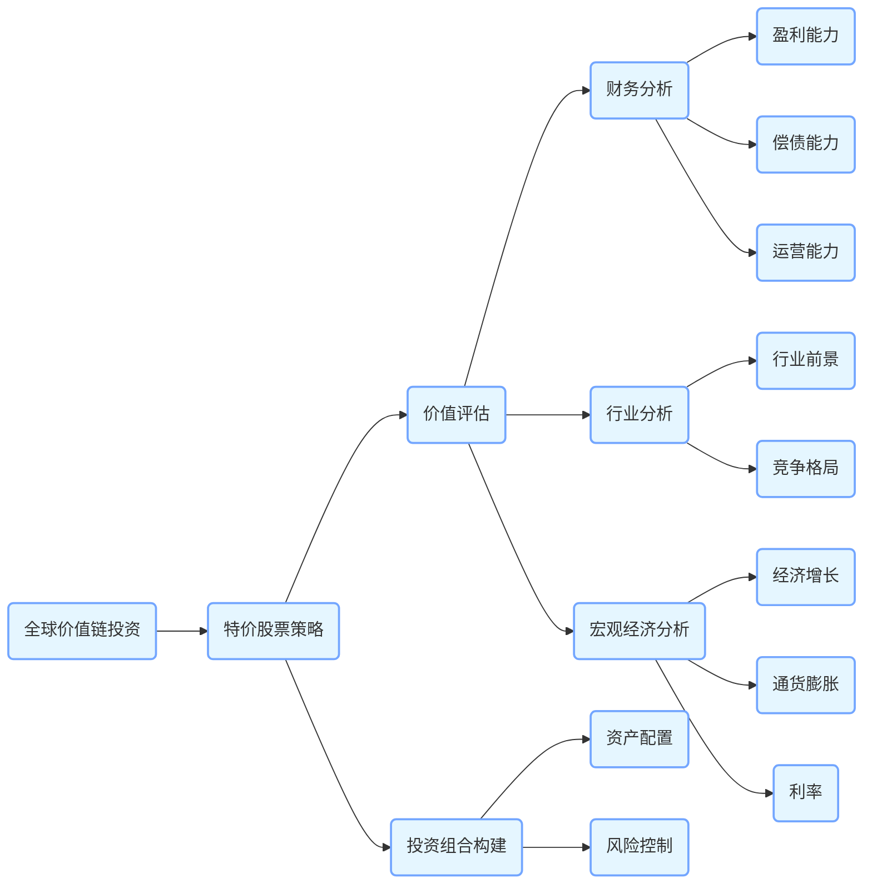

# 如何利用特价股票策略进行全球价值链投资

> 关键词：特价股票策略、全球价值链投资、价值评估、风险控制、投资组合

> 摘要：本文旨在深入探讨如何利用特价股票策略进行全球价值链投资。首先介绍了相关背景知识，包括目的范围、预期读者等。接着阐述了核心概念与联系，详细讲解了核心算法原理和具体操作步骤，借助数学模型和公式加深理解。通过项目实战给出代码实际案例及详细解释，分析了该策略在实际应用中的场景。同时推荐了学习资源、开发工具框架以及相关论文著作。最后总结了未来发展趋势与挑战，并给出常见问题解答和参考资料，帮助投资者更好地掌握利用特价股票策略进行全球价值链投资的方法和技巧。

## 1. 背景介绍 
### 1.1 目的和范围
在当今全球化的经济环境下，全球价值链投资已成为投资者获取更高收益的重要途径。特价股票策略作为一种价值投资方法，旨在寻找被市场低估的股票，以实现资产的增值。本文的目的在于为投资者提供一套系统的方法，指导他们如何利用特价股票策略进行全球价值链投资。范围涵盖了特价股票策略的基本原理、核心算法、数学模型，以及在实际投资中的应用和相关资源推荐等方面。

### 1.2 预期读者
本文预期读者包括对股票投资有一定了解，希望深入学习价值投资策略的个人投资者；从事金融投资研究和实践的专业人士，如基金经理、投资顾问等；以及对全球价值链投资和特价股票策略感兴趣的金融专业学生和研究人员。

### 1.3 文档结构概述
本文首先介绍背景知识，让读者了解研究的目的和范围等信息。接着阐述核心概念与联系，帮助读者建立起对相关概念的清晰认识。然后详细讲解核心算法原理和具体操作步骤，通过数学模型和公式进一步加深理解。通过项目实战部分给出代码实际案例和详细解释，让读者了解如何在实际中应用该策略。之后分析实际应用场景，推荐相关工具和资源。最后总结未来发展趋势与挑战，解答常见问题并提供参考资料。

### 1.4 术语表
#### 1.4.1 核心术语定义
- **特价股票**：指市场价格低于其内在价值的股票，通常由于市场短期波动、公司暂时困境等原因导致。
- **全球价值链投资**：投资者基于全球产业分工和价值链的视角，对处于不同国家和地区、不同产业环节的企业进行投资，以获取全球经济发展带来的收益。
- **价值评估**：对股票的内在价值进行评估的过程，通过分析公司的财务状况、行业前景等因素，确定股票的合理价值。
- **投资组合**：投资者将资金分散投资于多种资产，以降低风险并实现预期收益的资产配置方式。

#### 1.4.2 相关概念解释
- **市场效率**：指市场价格反映所有可用信息的程度。在有效市场中，股票价格能够迅速反映公司的基本面信息，而在非有效市场中，可能存在价格与价值偏离的情况，为特价股票策略提供了机会。
- **行业竞争格局**：指某个行业内企业之间的竞争关系和市场份额分布情况。了解行业竞争格局有助于评估公司的竞争力和未来发展前景。
- **宏观经济环境**：包括经济增长、通货膨胀、利率等宏观经济因素，这些因素会对企业的经营和股票价格产生影响。

#### 1.4.3 缩略词列表
- **PE**：市盈率（Price - Earnings Ratio），指股票价格与每股收益的比率，用于衡量股票的估值水平。
- **PB**：市净率（Price - Book Ratio），指股票价格与每股净资产的比率，反映了股票的市场价格相对于净资产的倍数。
- **ROE**：净资产收益率（Return on Equity），指公司净利润与净资产的比率，衡量公司运用自有资本的效率。

## 2. 核心概念与联系 
### 核心概念原理
特价股票策略的核心原理基于价值投资理论，即股票的市场价格会围绕其内在价值波动。当市场价格低于内在价值时，股票被认为是特价股票，具有投资价值。投资者通过深入分析公司的基本面，包括财务报表、行业前景、管理团队等因素，评估股票的内在价值。全球价值链投资则是从全球产业分工的角度出发，寻找在全球价值链中具有竞争优势的企业进行投资。

在全球价值链中，不同国家和地区的企业处于不同的产业环节，如研发、生产、销售等。具有核心技术、品牌优势或成本优势的企业往往能够在全球价值链中占据有利地位，获得更高的利润和市场份额。投资者可以通过特价股票策略，在全球范围内寻找被低估的、处于全球价值链关键环节的企业股票进行投资。

### 架构的文本示意图
```plaintext
全球价值链投资
|
|-- 特价股票策略
|   |-- 价值评估
|   |   |-- 财务分析
|   |   |   |-- 盈利能力
|   |   |   |-- 偿债能力
|   |   |   |-- 运营能力
|   |   |-- 行业分析
|   |   |   |-- 行业前景
|   |   |   |-- 竞争格局
|   |   |-- 宏观经济分析
|   |       |-- 经济增长
|   |       |-- 通货膨胀
|   |       |-- 利率
|   |-- 投资组合构建
|       |-- 资产配置
|       |-- 风险控制
```

### Mermaid 流程图


## 3. 核心算法原理 & 具体操作步骤 
### 核心算法原理
特价股票策略的核心算法主要围绕股票的价值评估展开。一种常用的方法是基于财务指标的估值模型，如股息折现模型（Dividend Discount Model, DDM）、自由现金流折现模型（Discounted Cash Flow Model, DCF）等。这里以简单的市盈率（PE）和市净率（PB）估值方法为例进行说明。

市盈率估值法的基本思想是，通过比较目标股票的市盈率与同行业平均市盈率，判断股票是否被低估。如果目标股票的市盈率低于同行业平均市盈率，且公司的基本面良好，则可能是一只特价股票。市净率估值法同理，通过比较目标股票的市净率与同行业平均市净率来判断股票的估值水平。

### 具体操作步骤
1. **数据收集**：收集目标股票的财务数据，包括每股收益（EPS）、每股净资产（BVPS）等，以及同行业其他公司的相关数据，计算同行业平均市盈率和市净率。
2. **计算估值指标**：计算目标股票的市盈率和市净率。
3. **比较估值**：将目标股票的市盈率和市净率与同行业平均水平进行比较。
4. **基本面分析**：对目标公司的基本面进行分析，包括盈利能力、偿债能力、运营能力等，确保公司具有良好的发展前景。
5. **决策投资**：如果目标股票的市盈率和市净率低于同行业平均水平，且基本面良好，则可以考虑投资。

### Python 源代码实现
```python
import pandas as pd

# 示例数据：目标股票和同行业其他股票的财务数据
data = {
    '股票代码': ['A', 'B', 'C', 'D'],
    '每股收益': [2, 1.5, 1.8, 2.2],
    '每股净资产': [10, 8, 9, 11],
    '股价': [20, 12, 15, 25]
}
df = pd.DataFrame(data)

# 计算市盈率和市净率
df['市盈率'] = df['股价'] / df['每股收益']
df['市净率'] = df['股价'] / df['每股净资产']

# 计算同行业平均市盈率和市净率（除目标股票 A 外）
industry_avg_pe = df[df['股票代码'] != 'A']['市盈率'].mean()
industry_avg_pb = df[df['股票代码'] != 'A']['市净率'].mean()

# 目标股票 A 的市盈率和市净率
target_pe = df[df['股票代码'] == 'A']['市盈率'].values[0]
target_pb = df[df['股票代码'] == 'A']['市净率'].values[0]

# 比较估值
if target_pe < industry_avg_pe and target_pb < industry_avg_pb:
    print("目标股票 A 可能是特价股票，具有投资价值。")
else:
    print("目标股票 A 可能不是特价股票，需进一步分析。")
```

## 4. 数学模型和公式 & 详细讲解 & 举例说明 
### 市盈率（PE）模型
市盈率（PE）的计算公式为：
$$PE = \frac{P}{EPS}$$
其中，$P$ 为股票价格，$EPS$ 为每股收益。

市盈率反映了投资者为获取公司每一元盈利所愿意支付的价格。一般来说，较低的市盈率可能意味着股票被低估，但也可能反映了市场对公司未来发展前景的担忧。

举例说明：假设某股票的价格为 20 元，每股收益为 2 元，则该股票的市盈率为：
$$PE = \frac{20}{2} = 10$$

如果同行业平均市盈率为 15，则该股票的市盈率低于同行业平均水平，可能是一只特价股票。

### 市净率（PB）模型
市净率（PB）的计算公式为：
$$PB = \frac{P}{BVPS}$$
其中，$P$ 为股票价格，$BVPS$ 为每股净资产。

市净率反映了股票的市场价格相对于每股净资产的倍数。较低的市净率可能表示股票被低估，具有一定的安全边际。

举例说明：假设某股票的价格为 15 元，每股净资产为 10 元，则该股票的市净率为：
$$PB = \frac{15}{10} = 1.5$$

如果同行业平均市净率为 2，则该股票的市净率低于同行业平均水平，可能是一只特价股票。

### 股息折现模型（DDM）
股息折现模型的基本思想是，股票的内在价值等于其未来股息的现值之和。其公式为：
$$V = \sum_{t = 1}^{\infty} \frac{D_t}{(1 + r)^t}$$
其中，$V$ 为股票的内在价值，$D_t$ 为第 $t$ 期的股息，$r$ 为折现率。

在实际应用中，通常会对股息的增长情况进行假设，如股息固定增长模型：
$$V = \frac{D_1}{r - g}$$
其中，$D_1$ 为下一期的股息，$g$ 为股息的固定增长率。

举例说明：假设某股票下一期的股息为 1 元，股息固定增长率为 5%，折现率为 10%，则该股票的内在价值为：
$$V = \frac{1}{0.1 - 0.05} = 20$$

如果该股票的市场价格低于 20 元，则可能是一只特价股票。

## 5. 项目实战：代码实际案例和详细解释说明 
### 5.1  开发环境搭建
- **Python 环境**：安装 Python 3.x 版本，可以从 Python 官方网站（https://www.python.org/downloads/）下载安装。
- **开发工具**：推荐使用 PyCharm 或 Jupyter Notebook 作为开发工具。
- **相关库**：安装 pandas、numpy、matplotlib 等库，用于数据处理和分析。可以使用以下命令进行安装：
```sh
pip install pandas numpy matplotlib
```

### 5.2  源代码详细实现和代码解读
```python
import pandas as pd
import numpy as np
import matplotlib.pyplot as plt

# 模拟全球不同地区股票数据
data = {
    '地区': ['亚洲', '欧洲', '美洲', '亚洲', '欧洲', '美洲'],
    '股票代码': ['A1', 'B1', 'C1', 'A2', 'B2', 'C2'],
    '每股收益': [2, 1.5, 1.8, 2.2, 1.6, 1.9],
    '每股净资产': [10, 8, 9, 11, 8.5, 9.5],
    '股价': [20, 12, 15, 25, 13, 16]
}
df = pd.DataFrame(data)

# 按地区分组计算同地区平均市盈率和市净率
grouped = df.groupby('地区')
df['同地区平均市盈率'] = grouped['股价'].transform(lambda x: x / df.loc[x.index, '每股收益']).mean()
df['同地区平均市净率'] = grouped['股价'].transform(lambda x: x / df.loc[x.index, '每股净资产']).mean()

# 计算每只股票的市盈率和市净率
df['市盈率'] = df['股价'] / df['每股收益']
df['市净率'] = df['股价'] / df['每股净资产']

# 判断是否为特价股票
df['是否特价股票'] = (df['市盈率'] < df['同地区平均市盈率']) & (df['市净率'] < df['同地区平均市净率'])

# 筛选出特价股票
bargain_stocks = df[df['是否特价股票']]

# 打印特价股票信息
print("特价股票信息：")
print(bargain_stocks)

# 可视化不同地区股票的市盈率和市净率
fig, axes = plt.subplots(1, 2, figsize=(12, 6))
df.groupby('地区')['市盈率'].mean().plot(kind='bar', ax=axes[0], title='不同地区平均市盈率')
df.groupby('地区')['市净率'].mean().plot(kind='bar', ax=axes[1], title='不同地区平均市净率')
plt.tight_layout()
plt.show()
```

### 5.3  代码解读与分析
1. **数据模拟**：使用字典 `data` 模拟全球不同地区的股票数据，包括地区、股票代码、每股收益、每股净资产和股价。
2. **分组计算**：使用 `groupby` 方法按地区分组，计算同地区的平均市盈率和市净率。
3. **计算估值指标**：计算每只股票的市盈率和市净率。
4. **判断特价股票**：通过比较每只股票的市盈率和市净率与同地区平均水平，判断是否为特价股票。
5. **筛选特价股票**：使用布尔索引筛选出特价股票，并打印其信息。
6. **可视化分析**：使用 `matplotlib` 库绘制不同地区股票的平均市盈率和市净率的柱状图，直观展示不同地区的估值水平。

## 6. 实际应用场景 
### 跨境投资
投资者可以利用特价股票策略在全球范围内寻找被低估的股票进行跨境投资。通过分析不同国家和地区的宏观经济环境、行业前景和公司基本面，筛选出具有投资价值的特价股票。例如，在新兴市场国家，由于市场效率相对较低，可能存在更多被低估的股票机会。投资者可以关注这些市场中处于全球价值链关键环节的企业，如制造业中的零部件供应商、科技行业中的芯片制造商等。

### 行业轮动投资
随着全球经济的发展和产业结构的调整，不同行业的发展前景和估值水平会发生变化。投资者可以利用特价股票策略进行行业轮动投资，即在不同行业之间切换投资组合。当某个行业的股票被普遍低估时，投资者可以增加对该行业特价股票的投资；当该行业的估值水平上升时，再将资金转移到其他被低估的行业。例如，在经济复苏初期，周期性行业如钢铁、汽车等可能会首先受益，投资者可以关注这些行业中的特价股票；而在经济增长后期，消费、科技等非周期性行业可能表现更好，投资者可以适时调整投资组合。

### 长期价值投资
对于长期投资者来说，特价股票策略可以帮助他们寻找具有长期投资价值的公司。通过深入分析公司的基本面和在全球价值链中的地位，选择那些具有核心竞争力、业绩稳定增长的公司股票进行长期持有。即使短期内股票价格可能会受到市场波动的影响，但从长期来看，这些公司的内在价值会不断提升，为投资者带来丰厚的回报。例如，一些具有强大品牌优势和创新能力的跨国公司，在全球价值链中占据着重要地位，是长期价值投资的优质标的。

## 7. 工具和资源推荐
### 7.1 学习资源推荐
#### 7.1.1 书籍推荐
- 《聪明的投资者》（The Intelligent Investor）：作者本杰明·格雷厄姆（Benjamin Graham）是价值投资理论的奠基人，本书是价值投资领域的经典著作，对特价股票策略的理论和实践有深入的阐述。
- 《证券分析》（Security Analysis）：同样是本杰明·格雷厄姆的著作，被认为是投资领域的圣经，详细介绍了股票估值的方法和技巧。
- 《巴菲特致股东的信》（Letters to Shareholders of Berkshire Hathaway）：沃伦·巴菲特（Warren Buffett）是价值投资的杰出代表，本书收录了他多年来致股东的信，通过这些信件可以了解巴菲特的投资理念和策略。

#### 7.1.2 在线课程
- Coursera 平台上的“投资学原理”（Principles of Investing）课程：由知名教授授课，系统介绍了投资学的基本原理和方法，包括股票估值、投资组合管理等内容。
- edX 平台上的“金融市场”（Financial Markets）课程：耶鲁大学教授罗伯特·席勒（Robert Shiller）主讲，涵盖了金融市场的各个方面，对理解股票市场和投资策略有很大帮助。

#### 7.1.3 技术博客和网站
- 雪球网（https://xueqiu.com/）：国内知名的投资交流社区，有大量的投资者分享投资经验和研究报告，可以从中获取关于特价股票策略和全球价值链投资的信息。
- Seeking Alpha（https://seekingalpha.com/）：国外知名的金融分析网站，提供全球股票市场的分析和评论，对投资者了解国际市场动态和寻找投资机会有很大帮助。

### 7.2 开发工具框架推荐
#### 7.2.1 IDE和编辑器
- PyCharm：功能强大的 Python 集成开发环境，具有代码自动补全、调试、版本控制等功能，适合专业开发者使用。
- Jupyter Notebook：交互式的开发环境，支持 Python 等多种编程语言，方便进行数据分析和可视化，适合数据科学家和研究人员使用。

#### 7.2.2 调试和性能分析工具
- pdb：Python 内置的调试工具，可以帮助开发者逐行调试代码，查找问题。
- cProfile：Python 标准库中的性能分析工具，可以分析代码的运行时间和函数调用次数，帮助开发者优化代码性能。

#### 7.2.3 相关框架和库
- pandas：强大的数据处理和分析库，提供了高效的数据结构和数据操作方法，方便处理股票数据。
- numpy：用于科学计算的基础库，提供了高效的数组操作和数学函数，在股票数据计算中经常使用。
- matplotlib：常用的绘图库，可以绘制各种类型的图表，帮助投资者可视化分析股票数据。

### 7.3 相关论文著作推荐
#### 7.3.1 经典论文
- Fama, E. F., & French, K. R. (1992). The cross - section of expected stock returns. The Journal of Finance, 47(2), 427 - 465. 该论文提出了著名的 Fama - French 三因子模型，对股票收益的影响因素进行了深入研究，为股票估值和投资策略提供了理论基础。
- Graham, B., & Dodd, D. L. (1934). Security analysis. McGraw - Hill. 本杰明·格雷厄姆和戴维·多德的经典著作，系统阐述了价值投资的理论和方法，是特价股票策略的重要理论来源。

#### 7.3.2 最新研究成果
- 关注《金融研究》《管理世界》等国内顶级金融学术期刊，以及 The Journal of Finance、The Review of Financial Studies 等国际知名金融学术期刊，获取关于全球价值链投资和特价股票策略的最新研究成果。

#### 7.3.3 应用案例分析
- 可以参考各大金融机构的研究报告和案例分析，了解他们在全球价值链投资和特价股票策略方面的实践经验和应用案例。例如，高盛、摩根士丹利等国际知名投资银行的研究报告，对投资者有很大的参考价值。

## 8. 总结：未来发展趋势与挑战
### 未来发展趋势
- **数字化和智能化**：随着科技的不断发展，数字化和智能化将在全球价值链投资和特价股票策略中发挥越来越重要的作用。投资者可以利用大数据、人工智能等技术，更高效地收集和分析股票数据，挖掘潜在的特价股票机会。例如，通过自然语言处理技术分析新闻报道和社交媒体信息，了解市场情绪和公司动态；利用机器学习算法建立股票估值模型，提高估值的准确性。
- **绿色投资和可持续发展**：在全球气候变化和可持续发展的背景下，绿色投资和可持续发展将成为未来投资的重要方向。投资者将更加关注企业的环境、社会和治理（ESG）表现，寻找那些在可持续发展方面具有优势的企业股票进行投资。这也为特价股票策略带来了新的机遇，一些具有良好 ESG 表现但被市场低估的企业股票可能成为投资的热点。
- **全球产业链重构**：受贸易保护主义、疫情等因素的影响，全球产业链正在经历重构。一些企业可能会将生产环节从成本较高的地区转移到成本较低的地区，或者加强在本地的产业链布局。这将导致全球价值链的结构发生变化，投资者需要及时调整投资策略，关注那些在产业链重构中受益的企业股票。

### 挑战
- **信息不对称**：在全球价值链投资中，由于不同国家和地区的信息披露标准和市场环境不同，投资者可能面临信息不对称的问题。这增加了获取准确信息和评估股票价值的难度，需要投资者具备更强的信息收集和分析能力。
- **市场波动和不确定性**：全球股票市场受到宏观经济环境、政治局势、自然灾害等多种因素的影响，市场波动和不确定性较大。特价股票策略需要投资者具备较强的风险承受能力和耐心，在市场波动中坚守价值投资理念。
- **竞争加剧**：随着越来越多的投资者关注全球价值链投资和特价股票策略，市场竞争将加剧。这可能导致特价股票的机会减少，投资者需要不断创新和优化投资策略，以获取更高的收益。

## 9. 附录：常见问题与解答
### 问题 1：如何确定股票的内在价值？
确定股票的内在价值是一个复杂的过程，需要综合考虑多个因素。常用的方法包括股息折现模型、自由现金流折现模型、市盈率估值法、市净率估值法等。这些方法各有优缺点，投资者可以根据具体情况选择合适的方法。同时，还需要对公司的基本面进行深入分析，包括财务状况、行业前景、管理团队等，以提高估值的准确性。

### 问题 2：特价股票策略是否适用于所有市场？
特价股票策略在不同市场的适用性有所不同。在有效市场中，股票价格能够迅速反映所有可用信息，很难找到被低估的股票。而在非有效市场中，由于市场效率较低，可能存在更多价格与价值偏离的情况，为特价股票策略提供了机会。因此，特价股票策略更适用于新兴市场和一些成熟市场中的特定行业或板块。

### 问题 3：如何控制特价股票投资的风险？
控制特价股票投资风险的方法包括：
- **分散投资**：构建投资组合，将资金分散投资于不同地区、不同行业、不同公司的股票，以降低单一股票的风险。
- **深入研究**：对目标公司进行深入的基本面分析，了解其经营状况、财务状况、行业前景等，确保投资的安全性。
- **设定止损点**：在投资前设定止损点，当股票价格下跌到一定程度时，及时卖出股票，避免损失进一步扩大。
- **关注宏观经济环境**：宏观经济环境的变化会对股票市场产生影响，投资者需要关注宏观经济数据和政策变化，及时调整投资策略。

### 问题 4：如何获取全球股票市场的数据？
可以通过以下途径获取全球股票市场的数据：
- **金融数据提供商**：如 Bloomberg、Wind、东方财富等，这些数据提供商提供丰富的金融数据，包括股票价格、财务报表、行业数据等。
- **证券交易所官网**：不同国家和地区的证券交易所官网会公布上市公司的相关信息，可以从中获取股票的基本数据。
- **新闻媒体和研究机构**：一些新闻媒体和研究机构会发布股票市场的分析和研究报告，从中可以获取相关数据和信息。

## 10. 扩展阅读 & 参考资料
### 扩展阅读
- 《漫步华尔街》（A Random Walk Down Wall Street）：作者伯顿·马尔基尔（Burton Malkiel）在书中介绍了各种投资理论和策略，对投资者理解股票市场和投资方法有很大帮助。
- 《财务报表分析与股票估值》（Financial Statement Analysis and Security Valuation）：作者斯蒂芬·佩因曼（Stephen Penman）详细介绍了如何通过分析财务报表来评估股票价值，是一本实用的投资分析工具书。

### 参考资料
- 相关金融学术期刊和研究报告，如《金融研究》《管理世界》《The Journal of Finance》《The Review of Financial Studies》等。
- 各大金融机构的官方网站和研究报告，如高盛、摩根士丹利、中信证券等。
- 股票交易软件和金融数据平台的帮助文档和使用说明。