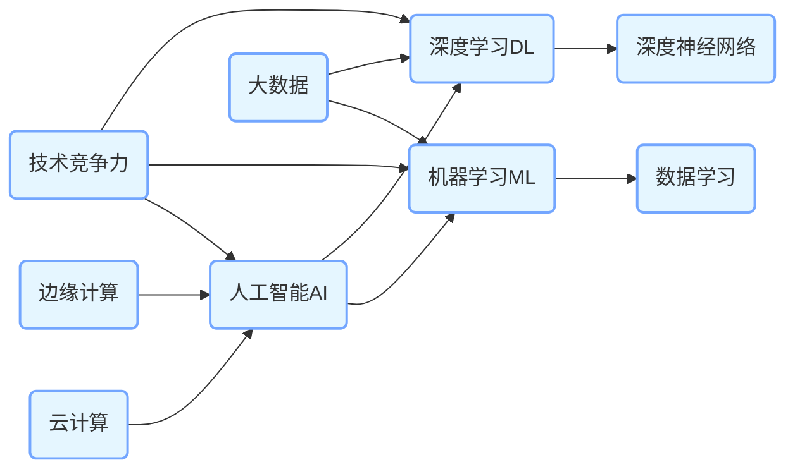

# 如何在AI时代保持技术竞争力

> 关键词：AI时代、技术竞争力、人工智能、技术学习、职业发展

> 摘要：在当今AI时代，技术的快速发展和变革给人们的职业发展和技术能力带来了巨大挑战。本文旨在探讨如何在AI时代保持技术竞争力，通过对背景的介绍，阐述核心概念与联系，深入剖析核心算法原理和具体操作步骤，借助数学模型和公式进行讲解，结合项目实战案例，分析实际应用场景，推荐相关工具和资源，总结未来发展趋势与挑战，解答常见问题等，为读者提供全面且深入的指导，帮助其在AI浪潮中不断提升自身技术能力，保持竞争力。

## 1. 背景介绍 
### 1.1 目的和范围
本文章的目的在于为广大技术从业者以及有志于在AI时代有所发展的人群提供系统性的指导，帮助他们了解如何在快速变化的AI环境中保持和提升技术竞争力。范围涵盖了从理论概念到实际操作，从核心算法到项目实战，从学习资源到未来趋势等多个方面，力求为读者构建一个全面且深入的知识体系。

### 1.2 预期读者
预期读者包括但不限于软件开发工程师、数据科学家、人工智能研究员、技术管理人员以及对人工智能技术感兴趣并希望在该领域发展的爱好者。无论你是初入行业的新手，还是经验丰富的技术专家，都能从本文中获取有价值的信息和启示。

### 1.3 文档结构概述
本文将按照以下结构进行阐述：首先介绍背景信息，让读者对文章的目的和适用范围有清晰的了解；接着讲解核心概念与联系，帮助读者建立起对相关技术的基础认知；然后深入剖析核心算法原理和具体操作步骤，并结合数学模型和公式进行详细说明；通过项目实战案例，让读者了解如何将理论知识应用到实际项目中；分析实际应用场景，展示技术的实际价值；推荐相关的工具和资源，为读者的学习和实践提供支持；总结未来发展趋势与挑战，使读者对行业的发展方向有前瞻性的认识；最后通过附录解答常见问题，并提供扩展阅读和参考资料。

### 1.4 术语表
#### 1.4.1 核心术语定义
- **人工智能（AI）**：是指计算机系统能够执行通常需要人类智能才能完成的任务，如学习、推理、解决问题、感知和语言理解等。
- **机器学习（ML）**：是人工智能的一个子集，它使计算机能够通过数据学习模式和规律，而无需明确的编程指令。
- **深度学习（DL）**：是机器学习的一个分支，基于人工神经网络，通过多层神经网络来学习数据的复杂表示。
- **技术竞争力**：指个人或组织在技术领域中相对于竞争对手所具备的优势和能力，包括技术知识、技能、创新能力等。

#### 1.4.2 相关概念解释
- **大数据**：指海量、高增长率和多样化的信息资产，它为机器学习和人工智能提供了丰富的数据资源。
- **云计算**：是一种基于互联网的计算方式，通过将计算资源（如服务器、存储、软件等）提供给用户，使得用户可以按需使用和扩展资源。
- **边缘计算**：是一种将计算和数据存储靠近数据源的计算模式，减少数据传输延迟，提高系统的响应速度和效率。

#### 1.4.3 缩略词列表
- **AI**：Artificial Intelligence（人工智能）
- **ML**：Machine Learning（机器学习）
- **DL**：Deep Learning（深度学习）
- **GPU**：Graphics Processing Unit（图形处理单元）
- **CPU**：Central Processing Unit（中央处理单元）

## 2. 核心概念与联系 
在AI时代，要保持技术竞争力，需要深入理解一些核心概念及其相互联系。以下是这些核心概念的原理和架构的文本示意图：

人工智能作为一个广泛的领域，涵盖了机器学习和深度学习等子领域。机器学习通过数据驱动的方式，让计算机自动学习模式和规律，从而实现预测、分类等任务。深度学习则是机器学习的一种特殊形式，它利用深度神经网络来处理复杂的数据，如图像、语音和自然语言。

而技术竞争力则建立在对这些人工智能技术的掌握和应用能力之上。同时，大数据为人工智能提供了丰富的训练数据，云计算和边缘计算则为人工智能的计算和存储提供了支持。

下面是一个Mermaid流程图，展示了这些核心概念之间的联系：



从这个流程图中可以看出，人工智能、机器学习、深度学习等核心概念相互关联，大数据、云计算和边缘计算为其提供支持，而技术竞争力则贯穿于整个过程中。

## 3. 核心算法原理 & 具体操作步骤 
在AI时代，机器学习和深度学习是非常重要的技术领域，下面我们以机器学习中的线性回归算法为例，详细阐述其核心算法原理和具体操作步骤，并使用Python源代码进行说明。

### 3.1 线性回归算法原理
线性回归是一种用于建立自变量和因变量之间线性关系的统计模型。其基本思想是通过找到一条最佳的直线（在二维空间中）或超平面（在多维空间中），使得数据点到该直线或超平面的距离之和最小。

线性回归的数学模型可以表示为：

$$y = \theta_0 + \theta_1x_1 + \theta_2x_2 + \cdots + \theta_nx_n + \epsilon$$

其中，$y$ 是因变量，$x_1, x_2, \cdots, x_n$ 是自变量，$\theta_0, \theta_1, \theta_2, \cdots, \theta_n$ 是模型的参数，$\epsilon$ 是误差项。

我们的目标是找到一组最佳的参数 $\theta$，使得预测值 $\hat{y}$ 与真实值 $y$ 之间的误差最小。通常使用均方误差（Mean Squared Error, MSE）作为损失函数：

$$MSE = \frac{1}{m} \sum_{i=1}^{m} (y^{(i)} - \hat{y}^{(i)})^2$$

其中，$m$ 是样本数量，$y^{(i)}$ 是第 $i$ 个样本的真实值，$\hat{y}^{(i)}$ 是第 $i$ 个样本的预测值。

### 3.2 具体操作步骤
1. **数据准备**：收集和整理数据集，将其分为特征矩阵 $X$ 和目标向量 $y$。
2. **模型训练**：使用训练数据来估计模型的参数 $\theta$。
3. **模型评估**：使用测试数据来评估模型的性能，计算均方误差等指标。
4. **模型预测**：使用训练好的模型对新的数据进行预测。

### 3.3 Python源代码实现
```python
import numpy as np
from sklearn.model_selection import train_test_split
from sklearn.linear_model import LinearRegression
from sklearn.metrics import mean_squared_error

# 生成一些示例数据
np.random.seed(42)
X = 2 * np.random.rand(100, 1)
y = 4 + 3 * X + np.random.randn(100, 1)

# 划分训练集和测试集
X_train, X_test, y_train, y_test = train_test_split(X, y, test_size=0.2, random_state=42)

# 创建线性回归模型
model = LinearRegression()

# 模型训练
model.fit(X_train, y_train)

# 模型预测
y_pred = model.predict(X_test)

# 模型评估
mse = mean_squared_error(y_test, y_pred)
print(f"均方误差: {mse}")
```

### 3.4 代码解释
1. **数据生成**：使用 `np.random.rand` 生成随机的特征矩阵 $X$，并根据线性关系生成目标向量 $y$，同时添加一些噪声。
2. **数据划分**：使用 `train_test_split` 函数将数据集划分为训练集和测试集，测试集占比为 20%。
3. **模型创建**：使用 `LinearRegression` 类创建线性回归模型。
4. **模型训练**：使用 `fit` 方法对模型进行训练，估计模型的参数。
5. **模型预测**：使用 `predict` 方法对测试集进行预测，得到预测值 $y_pred$。
6. **模型评估**：使用 `mean_squared_error` 函数计算预测值和真实值之间的均方误差。

通过以上步骤，我们就完成了一个简单的线性回归模型的训练和评估过程。

## 4. 数学模型和公式 & 详细讲解 & 举例说明 
### 4.1 线性回归的数学模型
如前面所述，线性回归的数学模型可以表示为：

$$y = \theta_0 + \theta_1x_1 + \theta_2x_2 + \cdots + \theta_nx_n + \epsilon$$

这个公式描述了自变量 $x_1, x_2, \cdots, x_n$ 与因变量 $y$ 之间的线性关系。其中，$\theta_0$ 是截距项，$\theta_1, \theta_2, \cdots, \theta_n$ 是斜率项，$\epsilon$ 是误差项，表示模型无法解释的随机因素。

### 4.2 均方误差损失函数
均方误差（MSE）是线性回归中常用的损失函数，其公式为：

$$MSE = \frac{1}{m} \sum_{i=1}^{m} (y^{(i)} - \hat{y}^{(i)})^2$$

其中，$m$ 是样本数量，$y^{(i)}$ 是第 $i$ 个样本的真实值，$\hat{y}^{(i)}$ 是第 $i$ 个样本的预测值。均方误差的意义是计算所有样本的预测误差的平方的平均值，它衡量了模型预测值与真实值之间的平均误差程度。

### 4.3 最小二乘法求解参数
为了找到使均方误差最小的参数 $\theta$，我们可以使用最小二乘法。最小二乘法的目标是最小化均方误差，即求解以下优化问题：

$$\min_{\theta} MSE(\theta) = \min_{\theta} \frac{1}{m} \sum_{i=1}^{m} (y^{(i)} - \theta_0 - \theta_1x_1^{(i)} - \cdots - \theta_nx_n^{(i)})^2$$

对于简单的线性回归（只有一个自变量），最小二乘法的解可以通过以下公式得到：

$$\theta_1 = \frac{\sum_{i=1}^{m} (x^{(i)} - \bar{x})(y^{(i)} - \bar{y})}{\sum_{i=1}^{m} (x^{(i)} - \bar{x})^2}$$

$$\theta_0 = \bar{y} - \theta_1\bar{x}$$

其中，$\bar{x}$ 和 $\bar{y}$ 分别是 $x$ 和 $y$ 的平均值。

### 4.4 举例说明
假设我们有以下数据集：

| $x$ | $y$ |
| --- | --- |
| 1 | 3 |
| 2 | 5 |
| 3 | 7 |
| 4 | 9 |
| 5 | 11 |

首先，计算 $x$ 和 $y$ 的平均值：

$$\bar{x} = \frac{1 + 2 + 3 + 4 + 5}{5} = 3$$

$$\bar{y} = \frac{3 + 5 + 7 + 9 + 11}{5} = 7$$

然后，计算 $\theta_1$：

$$\sum_{i=1}^{5} (x^{(i)} - \bar{x})(y^{(i)} - \bar{y}) = (1 - 3)(3 - 7) + (2 - 3)(5 - 7) + (3 - 3)(7 - 7) + (4 - 3)(9 - 7) + (5 - 3)(11 - 7) = 20$$

$$\sum_{i=1}^{5} (x^{(i)} - \bar{x})^2 = (1 - 3)^2 + (2 - 3)^2 + (3 - 3)^2 + (4 - 3)^2 + (5 - 3)^2 = 10$$

$$\theta_1 = \frac{20}{10} = 2$$

最后，计算 $\theta_0$：

$$\theta_0 = \bar{y} - \theta_1\bar{x} = 7 - 2 \times 3 = 1$$

所以，线性回归模型为 $y = 1 + 2x$。

通过这个例子，我们可以更直观地理解线性回归的数学模型和最小二乘法的求解过程。

## 5. 项目实战：代码实际案例和详细解释说明 
### 5.1  开发环境搭建
在进行项目实战之前，我们需要搭建一个合适的开发环境。以下是具体的步骤：

1. **安装Python**：从Python官方网站（https://www.python.org/downloads/）下载并安装Python 3.x 版本。
2. **安装虚拟环境**：虚拟环境可以帮助我们隔离不同项目的依赖，避免版本冲突。可以使用 `venv` 或 `conda` 来创建虚拟环境。
    - 使用 `venv`：
```bash
python -m venv myenv
source myenv/bin/activate  # 在Windows上使用 myenv\Scripts\activate
```
    - 使用 `conda`：
```bash
conda create -n myenv python=3.8
conda activate myenv
```
3. **安装必要的库**：在虚拟环境中安装所需的库，如 `numpy`、`pandas`、`scikit-learn`、`matplotlib` 等。
```bash
pip install numpy pandas scikit-learn matplotlib
```

### 5.2  源代码详细实现和代码解读
我们以一个简单的房价预测项目为例，使用线性回归模型来预测房价。以下是完整的源代码：

```python
import numpy as np
import pandas as pd
from sklearn.model_selection import train_test_split
from sklearn.linear_model import LinearRegression
from sklearn.metrics import mean_squared_error
import matplotlib.pyplot as plt

# 加载数据集
data = pd.read_csv('housing.csv')

# 提取特征和目标变量
X = data[['RM']].values  # RM 表示平均房间数
y = data['MEDV'].values  # MEDV 表示房价中位数

# 划分训练集和测试集
X_train, X_test, y_train, y_test = train_test_split(X, y, test_size=0.2, random_state=42)

# 创建线性回归模型
model = LinearRegression()

# 模型训练
model.fit(X_train, y_train)

# 模型预测
y_pred = model.predict(X_test)

# 模型评估
mse = mean_squared_error(y_test, y_pred)
print(f"均方误差: {mse}")

# 可视化结果
plt.scatter(X_test, y_test, color='b', label='实际值')
plt.plot(X_test, y_pred, color='r', linewidth=2, label='预测值')
plt.xlabel('平均房间数')
plt.ylabel('房价中位数')
plt.title('房价预测')
plt.legend()
plt.show()
```

### 5.3  代码解读与分析
1. **数据加载**：使用 `pandas` 库的 `read_csv` 函数加载房价数据集。
2. **特征提取**：从数据集中提取平均房间数（`RM`）作为特征，房价中位数（`MEDV`）作为目标变量。
3. **数据划分**：使用 `train_test_split` 函数将数据集划分为训练集和测试集，测试集占比为 20%。
4. **模型创建**：使用 `LinearRegression` 类创建线性回归模型。
5. **模型训练**：使用 `fit` 方法对模型进行训练，估计模型的参数。
6. **模型预测**：使用 `predict` 方法对测试集进行预测，得到预测值 $y_pred$。
7. **模型评估**：使用 `mean_squared_error` 函数计算预测值和真实值之间的均方误差。
8. **结果可视化**：使用 `matplotlib` 库绘制散点图和直线图，直观地展示实际值和预测值之间的关系。

通过这个项目实战，我们可以更好地理解线性回归模型的应用过程，以及如何使用Python进行数据处理、模型训练和评估。

## 6. 实际应用场景 
在AI时代，技术的应用场景非常广泛，以下是一些常见的实际应用场景：

### 6.1 医疗保健
- **疾病诊断**：利用机器学习和深度学习算法对医学影像（如X光、CT扫描等）进行分析，辅助医生进行疾病诊断，提高诊断的准确性和效率。
- **药物研发**：通过分析大量的生物数据和药物信息，预测药物的疗效和副作用，加速药物研发的过程。
- **健康管理**：结合可穿戴设备和传感器收集的健康数据，提供个性化的健康建议和预警，帮助人们预防疾病。

### 6.2 金融服务
- **风险评估**：使用机器学习算法对客户的信用风险进行评估，帮助银行和金融机构做出更准确的贷款决策。
- **投资预测**：通过分析市场数据和经济指标，预测股票、债券等金融产品的价格走势，为投资者提供决策支持。
- **欺诈检测**：利用人工智能技术实时监测金融交易，识别潜在的欺诈行为，保障客户的资金安全。

### 6.3 交通运输
- **自动驾驶**：深度学习和计算机视觉技术是自动驾驶的核心，通过对传感器数据的分析和处理，实现车辆的自主导航和决策。
- **交通流量预测**：基于大数据和机器学习算法，预测交通流量的变化，优化交通信号控制，缓解交通拥堵。
- **物流优化**：利用人工智能技术对物流网络进行优化，提高货物运输的效率和准确性。

### 6.4 教育领域
- **个性化学习**：根据学生的学习习惯和能力，提供个性化的学习方案和资源，提高学习效果。
- **智能辅导**：使用自然语言处理和机器学习技术，开发智能辅导系统，为学生提供实时的辅导和答疑。
- **教育评估**：通过分析学生的学习数据，评估教学质量和学生的学习成果，为教育改革提供依据。

### 6.5 工业制造
- **质量检测**：利用机器视觉和深度学习算法对产品进行质量检测，及时发现缺陷和故障，提高产品质量。
- **生产优化**：通过对生产数据的分析和建模，优化生产流程和资源配置，提高生产效率和降低成本。
- **设备预测性维护**：基于传感器数据和机器学习算法，预测设备的故障和维护需求，实现设备的预防性维护。

这些实际应用场景展示了AI技术在各个领域的巨大潜力和价值，也为技术从业者提供了广阔的发展空间。

## 7. 工具和资源推荐
### 7.1 学习资源推荐
#### 7.1.1 书籍推荐
- 《Python机器学习》（Sebastian Raschka 著）：这本书详细介绍了Python在机器学习中的应用，包括数据预处理、模型选择、评估和优化等内容。
- 《深度学习》（Ian Goodfellow、Yoshua Bengio 和 Aaron Courville 著）：被誉为深度学习领域的“圣经”，全面介绍了深度学习的理论和实践。
- 《统计学习方法》（李航 著）：系统地介绍了统计学习的基本概念、方法和算法，是机器学习领域的经典教材。

#### 7.1.2 在线课程
- Coursera上的“机器学习”课程（Andrew Ng 教授）：这是一门非常经典的机器学习入门课程，涵盖了机器学习的基本概念、算法和应用。
- edX上的“深度学习微硕士项目”：由多家知名高校联合推出，提供了深度学习领域的系统学习路径。
- 吴恩达的“深度学习专项课程”：包括《神经网络和深度学习》、《改善深层神经网络：超参数调试、正则化以及优化》等多门课程，深入讲解了深度学习的技术和应用。

#### 7.1.3 技术博客和网站
- Medium：是一个技术博客平台，有很多关于AI、机器学习和深度学习的优质文章。
- Towards Data Science：专注于数据科学和机器学习领域，提供了大量的技术文章和案例分析。
- arXiv：是一个预印本服务器，收录了很多最新的学术论文，对于了解AI领域的前沿研究非常有帮助。

### 7.2 开发工具框架推荐
#### 7.2.1 IDE和编辑器
- PyCharm：是一款专门为Python开发设计的集成开发环境（IDE），具有强大的代码编辑、调试和项目管理功能。
- Jupyter Notebook：是一个交互式的开发环境，适合进行数据探索、模型实验和可视化展示。
- Visual Studio Code：是一款轻量级的代码编辑器，支持多种编程语言和插件，可用于AI开发。

#### 7.2.2 调试和性能分析工具
- TensorBoard：是TensorFlow提供的可视化工具，可以帮助用户监控模型的训练过程、分析模型的性能和结构。
- PyTorch Profiler：是PyTorch提供的性能分析工具，用于分析模型的运行时间、内存使用等性能指标。
- cProfile：是Python标准库中的性能分析工具，可以帮助用户找出代码中的性能瓶颈。

#### 7.2.3 相关框架和库
- TensorFlow：是一个开源的机器学习框架，由Google开发，广泛应用于深度学习领域。
- PyTorch：是另一个流行的深度学习框架，由Facebook开发，具有动态图和易于使用的特点。
- Scikit-learn：是一个简单而高效的机器学习库，提供了丰富的算法和工具，适用于数据挖掘、数据分析和预测建模。

### 7.3 相关论文著作推荐
#### 7.3.1 经典论文
- “Gradient-Based Learning Applied to Document Recognition”（Yann LeCun 等人）：介绍了卷积神经网络（CNN）的基本原理和应用，是深度学习领域的经典论文之一。
- “Long Short-Term Memory”（Sepp Hochreiter 和 Jürgen Schmidhuber）：提出了长短期记忆网络（LSTM），解决了循环神经网络（RNN）中的梯度消失问题。
- “Attention Is All You Need”（Ashish Vaswani 等人）：提出了Transformer架构，在自然语言处理领域取得了巨大的成功。

#### 7.3.2 最新研究成果
- 关注顶级学术会议（如NeurIPS、ICML、CVPR等）的最新论文，了解AI领域的最新研究进展。
- 关注知名研究机构（如OpenAI、DeepMind等）的研究成果，他们通常会发布一些具有影响力的研究论文和技术报告。

#### 7.3.3 应用案例分析
- 一些知名公司（如Google、Amazon、Microsoft等）会在其官方博客或技术论坛上分享AI技术的应用案例，可以从中学习到实际应用中的经验和技巧。
- 一些专业的技术媒体（如InfoQ、TechCrunch等）也会报道AI技术的应用案例和行业动态。

## 8. 总结：未来发展趋势与挑战
### 8.1 未来发展趋势
- **多模态融合**：未来的AI系统将更加注重多模态数据的融合，如将图像、语音、文本等不同类型的数据结合起来，实现更全面、更智能的理解和决策。
- **强化学习的应用拓展**：强化学习在机器人控制、自动驾驶、游戏等领域已经取得了显著的成果，未来将在更多的领域得到应用，如医疗保健、金融服务等。
- **AI与边缘计算的结合**：随着物联网的发展，大量的数据将在边缘设备上产生。AI与边缘计算的结合可以实现数据的实时处理和分析，减少数据传输延迟，提高系统的效率和安全性。
- **AI的可解释性和可信性**：随着AI技术的广泛应用，人们对AI系统的可解释性和可信性提出了更高的要求。未来的研究将更加注重开发可解释的AI模型，提高AI系统的透明度和可靠性。

### 8.2 挑战
- **数据隐私和安全**：AI系统需要大量的数据来进行训练和学习，如何保护数据的隐私和安全是一个重要的挑战。需要加强数据保护法规的制定和执行，开发安全可靠的数据处理技术。
- **算法偏见**：由于训练数据的局限性和算法的设计问题，AI系统可能会产生偏见和歧视。需要采取措施来减少算法偏见，确保AI系统的公平性和公正性。
- **人才短缺**：AI领域的快速发展导致了对专业人才的需求急剧增加，而目前相关人才的供给相对不足。需要加强教育和培训，培养更多的AI专业人才。
- **伦理和法律问题**：AI技术的发展带来了一系列的伦理和法律问题，如自动驾驶汽车的责任认定、AI系统的道德决策等。需要建立相应的伦理和法律框架，规范AI技术的发展和应用。

在AI时代保持技术竞争力需要不断学习和掌握新的技术知识，关注行业的发展趋势，积极应对各种挑战。只有这样，才能在激烈的竞争中立于不败之地。

## 9. 附录：常见问题与解答
### 9.1 如何选择适合自己的学习资源？
选择学习资源时，需要考虑自己的基础和学习目标。如果是初学者，可以选择一些入门级的书籍和在线课程，如《Python机器学习》和Coursera上的“机器学习”课程。如果已经有一定的基础，可以选择一些深入的专业书籍和研究论文，如《深度学习》和顶级学术会议的论文。同时，也可以参考他人的推荐和评价，选择适合自己的学习资源。

### 9.2 如何提高自己的编程能力？
提高编程能力需要不断地实践和学习。可以通过做练习题、参加开源项目、阅读优秀的代码等方式来提高自己的编程水平。同时，也需要学习一些编程规范和最佳实践，提高代码的质量和可维护性。另外，多与其他程序员交流和分享经验，也可以帮助自己不断进步。

### 9.3 如何应对AI技术的快速变化？
AI技术发展迅速，需要保持学习的热情和积极性，不断关注行业的最新动态和研究成果。可以通过参加学术会议、阅读技术博客、加入技术社区等方式来获取最新的信息。同时，也需要培养自己的学习能力和适应能力，能够快速掌握新的技术和知识。

### 9.4 如何将AI技术应用到实际项目中？
将AI技术应用到实际项目中需要以下几个步骤：首先，明确项目的需求和目标；然后，选择合适的AI算法和模型；接着，收集和整理相关的数据；再进行模型的训练和优化；最后，将训练好的模型部署到实际系统中，并进行测试和评估。在整个过程中，需要不断地进行调整和改进，以确保项目的成功。

### 9.5 如何解决AI模型的过拟合和欠拟合问题？
过拟合是指模型在训练数据上表现很好，但在测试数据上表现很差的情况；欠拟合是指模型在训练数据和测试数据上的表现都不好的情况。解决过拟合问题可以采用正则化、增加训练数据、减少模型复杂度等方法；解决欠拟合问题可以采用增加模型复杂度、增加特征数量等方法。

## 10. 扩展阅读 & 参考资料
- 《人工智能：现代方法》（Stuart Russell 和 Peter Norvig 著）
- 《动手学深度学习》（李沐 等著）
- 《AI未来进行式》（李开复、王咏刚 著）
- Coursera官方网站（https://www.coursera.org/）
- edX官方网站（https://www.edx.org/）
- arXiv官方网站（https://arxiv.org/）
- TensorFlow官方文档（https://www.tensorflow.org/）
- PyTorch官方文档（https://pytorch.org/）
- Scikit-learn官方文档（https://scikit-learn.org/）