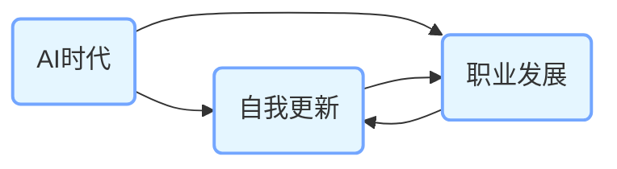

# 如何在AI时代实现自我更新与职业发展

> 关键词：AI时代、自我更新、职业发展、技能提升、终身学习

> 摘要：随着人工智能（AI）技术的迅猛发展，我们正处在一个前所未有的变革时代。AI的广泛应用对各个行业和职业都产生了深远影响，这既带来了新的机遇，也带来了挑战。本文旨在探讨在AI时代个人如何实现自我更新与职业发展，通过对相关核心概念的阐述、具体策略的分析、结合实际案例的讲解，以及对未来趋势的展望，为读者提供全面且实用的指导，帮助读者在这个充满变化的时代中保持竞争力，实现自身的职业目标和人生价值。

## 1. 背景介绍 
### 1.1 目的和范围
在当今这个科技飞速发展的时代，AI已经渗透到了社会的各个角落，从日常的消费、娱乐到工业生产、医疗健康等领域，AI的应用无处不在。本文章的目的在于深入探讨在这样的大背景下，个人应如何积极应对AI带来的影响，实现自我更新和职业发展。文章的范围将涵盖AI对不同行业和职业的影响、个人自我更新和职业发展的核心概念、具体的实现策略和方法，以及结合实际案例进行分析和讨论，同时对未来的发展趋势进行展望。

### 1.2 预期读者
本文预期读者包括各个行业的从业者、即将步入职场的学生、职业规划师以及对AI时代个人发展感兴趣的人士。无论您是已经在某个领域深耕多年，还是刚刚踏上职业道路，都能从本文中获取有价值的信息和启示，帮助您更好地应对AI时代的挑战和机遇。

### 1.3 文档结构概述
本文将按照以下结构展开：首先介绍背景信息，包括目的、预期读者和文档结构概述；接着阐述核心概念与联系，帮助读者理解AI时代自我更新和职业发展的相关概念和内在逻辑；然后详细讲解核心算法原理和具体操作步骤，为读者提供实用的方法和策略；再通过数学模型和公式进行深入分析，并举例说明；之后通过项目实战，展示实际案例和详细解释；接着探讨实际应用场景；推荐相关的工具和资源；总结未来发展趋势与挑战；附录部分解答常见问题；最后提供扩展阅读和参考资料，方便读者进一步深入学习。

### 1.4 术语表
#### 1.4.1 核心术语定义
- **AI（Artificial Intelligence）**：人工智能，是指计算机系统能够执行通常需要人类智能才能完成的任务，如学习、推理、解决问题、感知和语言理解等。
- **自我更新**：指个人在知识、技能、思维方式等方面进行持续的学习和提升，以适应不断变化的环境和需求。
- **职业发展**：个人在职业生涯中所经历的一系列阶段和变化，包括职业选择、职业晋升、职业转型等，旨在实现个人的职业目标和价值。

#### 1.4.2 相关概念解释
- **数字化转型**：企业或组织利用数字技术来改进业务流程、产品和服务，以提高效率和竞争力。在AI时代，数字化转型是企业发展的必然趋势，也对个人的职业发展产生了重要影响。
- **终身学习**：指个人在一生中持续不断地学习，以适应社会的发展和变化。在AI时代，知识和技术更新换代的速度越来越快，终身学习成为了个人实现自我更新和职业发展的关键。

#### 1.4.3 缩略词列表
- **AI**：Artificial Intelligence（人工智能）
- **ML**：Machine Learning（机器学习）
- **DL**：Deep Learning（深度学习）

## 2. 核心概念与联系 

### 2.1 AI时代的特征
AI时代具有以下几个显著特征：
- **技术创新加速**：AI技术不断取得突破，新的算法、模型和应用层出不穷。例如，深度学习技术在图像识别、语音识别等领域取得了巨大成功，推动了相关产业的快速发展。
- **数据爆炸式增长**：随着互联网、物联网等技术的发展，数据量呈现出爆炸式增长。这些数据为AI的发展提供了丰富的资源，同时也对数据的处理和分析能力提出了更高的要求。
- **产业变革深刻**：AI技术的应用正在深刻改变各个行业的商业模式和竞争格局。例如，在金融领域，AI技术可以用于风险评估、投资决策等，提高了金融服务的效率和质量；在医疗领域，AI技术可以辅助医生进行疾病诊断和治疗，提高了医疗水平。

### 2.2 自我更新的内涵
自我更新包括以下几个方面的内涵：
- **知识更新**：随着科技的发展和社会的进步，知识也在不断更新。个人需要不断学习新的知识，以跟上时代的步伐。例如，在AI时代，学习计算机科学、数学、统计学等相关知识是非常必要的。
- **技能提升**：除了知识更新，个人还需要不断提升自己的技能。例如，学习编程技能、数据分析技能、沟通协作技能等，以提高自己的职业竞争力。
- **思维方式转变**：AI时代的发展需要个人具备创新思维、批判性思维等新的思维方式。个人需要不断调整自己的思维方式，以适应新的环境和需求。

### 2.3 职业发展的阶段与目标
职业发展通常可以分为以下几个阶段：
- **探索期**：主要是在学生时期，通过学习和实践，了解自己的兴趣、能力和职业倾向，为未来的职业选择做好准备。
- **建立期**：进入职场后，开始积累工作经验，建立自己的职业形象和声誉，争取在工作中取得一定的成绩。
- **发展期**：在工作中不断提升自己的能力和水平，争取晋升机会，实现职业的发展和突破。
- **维持期**：在职业生涯的中后期，保持自己的职业地位和成就，同时为下一代的职业发展提供指导和帮助。
- **衰退期**：临近退休时，逐渐减少工作的投入，为退休生活做好准备。

个人的职业发展目标应该根据自己的兴趣、能力和价值观来确定，同时也要考虑到AI时代的发展趋势和市场需求。例如，在AI时代，一些新兴的职业如AI工程师、数据分析师、机器学习专家等具有很大的发展潜力。

### 2.4 核心概念的联系
AI时代的发展对个人的自我更新和职业发展提出了更高的要求。个人需要通过自我更新来提升自己的知识、技能和思维方式，以适应AI时代的变化和需求。而职业发展则是个人自我更新的重要动力和目标，通过职业发展，个人可以实现自己的人生价值和社会价值。同时，自我更新和职业发展也相互促进，个人在职业发展的过程中不断进行自我更新，而自我更新又为职业发展提供了有力的支持。

以下是核心概念联系的Mermaid流程图：


## 3. 核心算法原理 & 具体操作步骤 

### 3.1 核心算法原理：成长路径规划算法
我们可以将个人的自我更新和职业发展看作是一个优化问题，目标是在有限的时间和资源下，实现个人价值的最大化。以下是一个简单的成长路径规划算法的Python实现：

```python
import numpy as np

# 定义技能列表
skills = ["编程", "数据分析", "沟通协作", "项目管理", "AI知识"]

# 定义每个技能的初始水平（0-10分）
initial_skills = np.array([3, 2, 4, 3, 1])

# 定义每个技能的重要性权重（0-1之间）
skill_weights = np.array([0.3, 0.2, 0.2, 0.15, 0.15])

# 定义每个技能的学习成本（学习该技能所需的时间和资源）
learning_costs = np.array([5, 4, 3, 4, 6])

# 定义总学习资源（时间和精力）
total_resources = 20

# 定义一个函数来计算个人价值
def calculate_value(skills, weights):
    return np.dot(skills, weights)

# 定义一个函数来模拟学习过程
def learn(skills, learning_costs, resource_allocation):
    new_skills = skills.copy()
    for i in range(len(skills)):
        if resource_allocation[i] > 0:
            new_skills[i] += resource_allocation[i] / learning_costs[i]
    return new_skills

# 初始化最优价值和最优资源分配
best_value = calculate_value(initial_skills, skill_weights)
best_allocation = np.zeros(len(skills))

# 穷举所有可能的资源分配方案
for i in range(0, total_resources + 1):
    for j in range(0, total_resources - i + 1):
        for k in range(0, total_resources - i - j + 1):
            for l in range(0, total_resources - i - j - k + 1):
                m = total_resources - i - j - k - l
                allocation = np.array([i, j, k, l, m])
                new_skills = learn(initial_skills, learning_costs, allocation)
                value = calculate_value(new_skills, skill_weights)
                if value > best_value:
                    best_value = value
                    best_allocation = allocation

print("最优资源分配方案:", best_allocation)
print("最优个人价值:", best_value)
```

### 3.2 具体操作步骤
#### 3.2.1 自我评估
- **技能评估**：对自己现有的知识和技能进行全面评估，了解自己的优势和劣势。可以使用在线的技能评估工具，也可以请教专业人士。
- **兴趣和价值观评估**：了解自己的兴趣爱好和价值观，明确自己在职业发展中最看重的是什么。这有助于确定自己的职业方向和目标。

#### 3.2.2 设定目标
- **短期目标**：设定在1-2年内可以实现的目标，如学习一门新的技能、获得一个职业证书等。
- **中期目标**：设定在3-5年内可以实现的目标，如晋升到一个更高的职位、进入一个新的领域等。
- **长期目标**：设定在5年以上可以实现的目标，如成为行业内的专家、创办自己的企业等。

#### 3.2.3 制定计划
根据自己的目标和现有资源，制定详细的学习和发展计划。计划应该包括学习内容、学习时间、学习方式等。例如，如果目标是学习编程技能，可以制定一个学习计划，包括学习Python语言、数据结构和算法等内容，每周安排一定的时间进行学习，并选择在线课程、书籍等学习方式。

#### 3.2.4 实施计划
按照制定的计划，认真实施学习和发展活动。在实施过程中，要保持积极的学习态度，不断克服困难和挑战。同时，要及时调整计划，根据实际情况进行优化。

#### 3.2.5 评估和反馈
定期对自己的学习和发展情况进行评估和反馈。可以通过考试、项目实践、他人评价等方式进行评估。根据评估结果，总结经验教训，发现问题并及时解决。同时，要根据反馈调整自己的目标和计划，以确保自己的职业发展方向正确。

## 4. 数学模型和公式 & 详细讲解 & 举例说明 

### 4.1 个人价值模型
我们可以用一个线性组合的数学模型来表示个人价值 $V$：

$$V = \sum_{i=1}^{n} w_i s_i$$

其中，$n$ 是技能的数量，$w_i$ 是第 $i$ 个技能的重要性权重，$s_i$ 是第 $i$ 个技能的水平。

### 4.2 学习模型
学习过程可以用以下公式来表示：

$$s_i^{new} = s_i^{old} + \frac{r_i}{c_i}$$

其中，$s_i^{new}$ 是学习后的第 $i$ 个技能水平，$s_i^{old}$ 是学习前的第 $i$ 个技能水平，$r_i$ 是分配给第 $i$ 个技能的学习资源，$c_i$ 是第 $i$ 个技能的学习成本。

### 4.3 举例说明
假设我们有三个技能：编程、数据分析和沟通协作，它们的初始水平分别为 $s_1 = 3$，$s_2 = 2$，$s_3 = 4$，重要性权重分别为 $w_1 = 0.4$，$w_2 = 0.3$，$w_3 = 0.3$，学习成本分别为 $c_1 = 5$，$c_2 = 4$，$c_3 = 3$，总学习资源为 $R = 10$。

我们可以通过穷举所有可能的资源分配方案，找到最优的资源分配方案，从而最大化个人价值。例如，假设我们分配给编程、数据分析和沟通协作的资源分别为 $r_1 = 3$，$r_2 = 3$，$r_3 = 4$，则学习后的技能水平分别为：

$$s_1^{new} = 3 + \frac{3}{5} = 3.6$$
$$s_2^{new} = 2 + \frac{3}{4} = 2.75$$
$$s_3^{new} = 4 + \frac{4}{3} \approx 5.33$$

个人价值为：

$$V = 0.4 \times 3.6 + 0.3 \times 2.75 + 0.3 \times 5.33 \approx 3.78$$

通过不断尝试不同的资源分配方案，我们可以找到使个人价值最大的方案。

## 5. 项目实战：代码实际案例和详细解释说明 

### 5.1  开发环境搭建
#### 5.1.1 安装Python
首先，我们需要安装Python开发环境。可以从Python官方网站（https://www.python.org/downloads/）下载适合自己操作系统的Python安装包，然后按照安装向导进行安装。

#### 5.1.2 安装必要的库
在Python中，我们可以使用一些第三方库来辅助开发。例如，`numpy` 库可以用于数值计算，`matplotlib` 库可以用于数据可视化。可以使用以下命令来安装这些库：

```sh
pip install numpy matplotlib
```

### 5.2  源代码详细实现和代码解读
以下是一个完整的Python代码示例，用于实现个人成长路径规划：

```python
import numpy as np
import matplotlib.pyplot as plt

# 定义技能列表
skills = ["编程", "数据分析", "沟通协作", "项目管理", "AI知识"]

# 定义每个技能的初始水平（0-10分）
initial_skills = np.array([3, 2, 4, 3, 1])

# 定义每个技能的重要性权重（0-1之间）
skill_weights = np.array([0.3, 0.2, 0.2, 0.15, 0.15])

# 定义每个技能的学习成本（学习该技能所需的时间和资源）
learning_costs = np.array([5, 4, 3, 4, 6])

# 定义总学习资源（时间和精力）
total_resources = 20

# 定义一个函数来计算个人价值
def calculate_value(skills, weights):
    return np.dot(skills, weights)

# 定义一个函数来模拟学习过程
def learn(skills, learning_costs, resource_allocation):
    new_skills = skills.copy()
    for i in range(len(skills)):
        if resource_allocation[i] > 0:
            new_skills[i] += resource_allocation[i] / learning_costs[i]
    return new_skills

# 初始化最优价值和最优资源分配
best_value = calculate_value(initial_skills, skill_weights)
best_allocation = np.zeros(len(skills))

# 穷举所有可能的资源分配方案
all_values = []
all_allocations = []
for i in range(0, total_resources + 1):
    for j in range(0, total_resources - i + 1):
        for k in range(0, total_resources - i - j + 1):
            for l in range(0, total_resources - i - j - k + 1):
                m = total_resources - i - j - k - l
                allocation = np.array([i, j, k, l, m])
                new_skills = learn(initial_skills, learning_costs, allocation)
                value = calculate_value(new_skills, skill_weights)
                all_values.append(value)
                all_allocations.append(allocation)
                if value > best_value:
                    best_value = value
                    best_allocation = allocation

print("最优资源分配方案:", best_allocation)
print("最优个人价值:", best_value)

# 可视化结果
plt.figure(figsize=(10, 6))
plt.bar(skills, best_allocation)
plt.xlabel("技能")
plt.ylabel("分配的资源")
plt.title("最优资源分配方案")
plt.show()
```

### 5.3  代码解读与分析
- **数据定义**：首先，我们定义了技能列表、初始技能水平、技能重要性权重、学习成本和总学习资源。这些数据是我们进行成长路径规划的基础。
- **函数定义**：`calculate_value` 函数用于计算个人价值，`learn` 函数用于模拟学习过程。
- **穷举法**：通过四重循环穷举所有可能的资源分配方案，计算每种方案下的个人价值，并找到最优方案。
- **可视化**：使用 `matplotlib` 库将最优资源分配方案可视化，方便我们直观地了解资源的分配情况。

## 6. 实际应用场景 

### 6.1 职场新人
对于职场新人来说，在AI时代实现自我更新和职业发展尤为重要。新人可以通过以下方式来提升自己：
- **学习AI基础知识**：了解AI的基本概念、算法和应用，为未来的职业发展打下基础。
- **培养跨学科能力**：AI的发展需要跨学科的知识和技能，新人可以学习计算机科学、数学、统计学等相关知识，培养自己的跨学科能力。
- **参与项目实践**：通过参与实际项目，积累实践经验，提高自己的解决问题的能力。

### 6.2 在职人员
在职人员面临着AI技术带来的职业挑战和机遇。他们可以采取以下措施来实现自我更新和职业发展：
- **持续学习**：不断学习新的知识和技能，跟上AI时代的发展步伐。例如，学习新的编程语言、算法和工具。
- **转型发展**：如果所在的行业受到AI技术的冲击较大，可以考虑转型到其他有发展潜力的行业或领域。例如，从传统制造业转型到智能制造、从传统金融行业转型到金融科技等。
- **提升软技能**：在AI时代，软技能如沟通协作、领导力、创新能力等变得更加重要。在职人员可以通过培训、实践等方式提升自己的软技能。

### 6.3 创业者
创业者在AI时代需要具备敏锐的市场洞察力和创新能力。他们可以利用AI技术来推动企业的发展：
- **寻找新的商业机会**：AI技术的发展带来了许多新的商业机会，创业者可以通过研究市场需求和技术趋势，寻找适合自己的商业机会。
- **应用AI技术提升企业竞争力**：创业者可以将AI技术应用到企业的产品和服务中，提高企业的效率和质量，提升企业的竞争力。例如，在电商领域，利用AI技术进行精准营销、智能客服等。
- **培养AI人才**：创业者需要培养和吸引AI领域的人才，为企业的发展提供技术支持。

## 7. 工具和资源推荐
### 7.1 学习资源推荐
#### 7.1.1 书籍推荐
- 《人工智能：一种现代的方法》：这是一本经典的人工智能教材，全面介绍了人工智能的基本概念、算法和应用。
- 《Python机器学习》：详细介绍了使用Python进行机器学习的方法和技巧，适合初学者学习。
- 《深度学习》：由深度学习领域的三位顶尖专家撰写，是深度学习领域的权威著作。

#### 7.1.2 在线课程
- Coursera：提供了许多关于AI、机器学习、深度学习等方面的在线课程，由世界知名大学和机构的教授授课。
- edX：同样提供了丰富的AI相关课程，课程质量高，内容丰富。
- 中国大学MOOC：国内的在线课程平台，有许多国内高校的AI相关课程，适合国内学习者。

#### 7.1.3 技术博客和网站
- Medium：有许多AI领域的专家和从业者在上面分享自己的经验和见解，是获取最新技术动态的好地方。
- AI研习社：专注于AI技术的交流和分享，提供了丰富的技术文章、视频教程和案例分析。
- 机器之心：及时报道AI领域的最新消息和技术进展，是了解AI行业动态的重要渠道。

### 7.2 开发工具框架推荐
#### 7.2.1 IDE和编辑器
- PyCharm：是一款专门为Python开发设计的集成开发环境，功能强大，使用方便。
- Jupyter Notebook：是一个交互式的开发环境，适合进行数据分析和机器学习实验。
- Visual Studio Code：是一款轻量级的代码编辑器，支持多种编程语言，有丰富的插件可以扩展功能。

#### 7.2.2 调试和性能分析工具
- PDB：Python自带的调试工具，可以帮助开发者快速定位和解决代码中的问题。
- cProfile：Python的性能分析工具，可以分析代码的运行时间和内存使用情况，帮助开发者优化代码性能。
- TensorBoard：是TensorFlow的可视化工具，可以帮助开发者可视化训练过程和模型结构。

#### 7.2.3 相关框架和库
- TensorFlow：是一个开源的机器学习框架，被广泛应用于深度学习领域。
- PyTorch：是另一个流行的深度学习框架，具有简洁易用的特点。
- Scikit-learn：是一个简单高效的机器学习库，提供了许多常用的机器学习算法和工具。

### 7.3 相关论文著作推荐
#### 7.3.1 经典论文
- "A Logical Calculus of the Ideas Immanent in Nervous Activity"：由Warren McCulloch和Walter Pitts发表于1943年，提出了神经元模型，是人工智能领域的经典论文之一。
- "Perceptrons: An Introduction to Computational Geometry"：由Frank Rosenblatt发表于1962年，介绍了感知机模型，对神经网络的发展产生了重要影响。
- "ImageNet Classification with Deep Convolutional Neural Networks"：由Alex Krizhevsky、Ilya Sutskever和Geoffrey Hinton发表于2012年，提出了AlexNet模型，开启了深度学习在计算机视觉领域的热潮。

#### 7.3.2 最新研究成果
- 可以通过arXiv（https://arxiv.org/）等预印本平台获取AI领域的最新研究成果。许多研究人员会在上面发布自己的最新论文，方便同行交流和讨论。
- 顶级学术会议如NeurIPS（神经信息处理系统大会）、ICML（国际机器学习会议）、CVPR（计算机视觉与模式识别会议）等的会议论文也是获取最新研究成果的重要来源。

#### 7.3.3 应用案例分析
- 《AI未来进行式》：由李开复和王咏刚所著，通过大量的实际案例分析了AI技术在各个领域的应用和发展趋势。
- 各大科技公司的官方博客和年报中也会分享一些AI技术的应用案例，如谷歌、微软、亚马逊等公司的博客。

## 8. 总结：未来发展趋势与挑战
### 8.1 未来发展趋势
- **AI技术持续创新**：未来，AI技术将不断取得新的突破和创新，如量子计算与AI的结合、脑机接口技术的发展等，将为AI的发展带来新的机遇。
- **AI与各行业深度融合**：AI技术将越来越广泛地应用于各个行业，推动各行业的数字化转型和智能化升级。例如，在医疗领域，AI技术将在疾病诊断、药物研发等方面发挥更大的作用；在交通领域，自动驾驶技术将逐渐普及。
- **终身学习成为常态**：随着AI技术的发展，知识和技术更新换代的速度越来越快，终身学习将成为人们的必然选择。个人需要不断学习新的知识和技能，以适应社会的发展和变化。

### 8.2 挑战
- **就业结构调整**：AI技术的发展将导致一些传统职业的消失，同时也会创造一些新的职业。个人需要适应就业结构的调整，及时进行职业转型和技能提升。
- **伦理和法律问题**：AI技术的应用也带来了一些伦理和法律问题，如隐私保护、算法偏见、责任认定等。需要建立相应的伦理和法律框架，规范AI技术的发展和应用。
- **教育体系改革**：现有的教育体系需要进行改革，以培养适应AI时代需求的人才。教育内容需要更加注重培养学生的创新能力、批判性思维能力和实践能力。

## 9. 附录：常见问题与解答
### 9.1 AI时代是否会导致大量失业？
虽然AI技术的发展会导致一些传统职业的消失，但同时也会创造一些新的职业。例如，AI技术的应用需要大量的AI工程师、数据分析师等专业人才。此外，AI技术也会推动各行业的发展，创造更多的就业机会。因此，AI时代不一定会导致大量失业，但个人需要不断提升自己的技能，以适应就业结构的调整。

### 9.2 如何选择适合自己的学习方向？
选择适合自己的学习方向需要考虑以下几个因素：
- **个人兴趣**：选择自己感兴趣的学习方向，会更有动力和热情去学习。
- **市场需求**：了解市场对不同技能的需求情况，选择有发展潜力的学习方向。
- **个人优势**：结合自己的优势和特长，选择适合自己的学习方向。例如，如果自己擅长数学和逻辑思维，可以选择学习AI、机器学习等相关领域。

### 9.3 如何平衡工作和学习？
平衡工作和学习需要合理安排时间和精力。可以采取以下方法：
- **制定计划**：制定详细的学习计划，合理安排学习时间。例如，可以利用晚上和周末的时间进行学习。
- **提高效率**：在工作和学习中，提高自己的效率，避免浪费时间。例如，可以采用番茄工作法等时间管理方法。
- **寻求支持**：可以向家人、朋友和同事寻求支持和帮助，让他们理解和支持自己的学习。

## 10. 扩展阅读 & 参考资料
### 10.1 扩展阅读
- 《人类简史：从动物到上帝》：作者尤瓦尔·赫拉利从宏观的角度探讨了人类的发展历程，对于理解AI时代人类的发展和变化有一定的启示。
- 《智能时代》：由吴军所著，介绍了AI技术的发展和应用对社会和经济的影响。

### 10.2 参考资料
- 相关学术论文和研究报告，可以从IEEE Xplore、ACM Digital Library等学术数据库中获取。
- 各大科技公司的官方网站和技术博客，如谷歌、微软、亚马逊等公司的网站。
- 政府部门发布的相关政策文件和统计数据，如国家统计局、工业和信息化部等部门的网站。