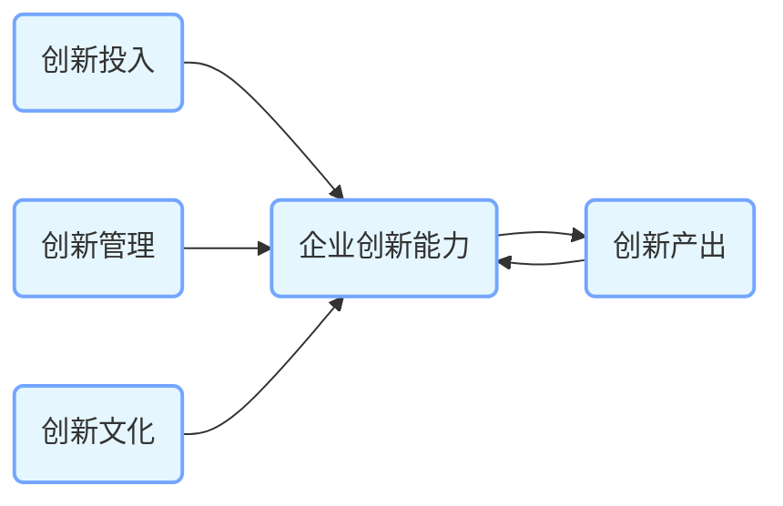

# 如何评估企业的创新能力

> 关键词：企业创新能力、评估指标、创新管理、创新文化、创新绩效

> 摘要：本文围绕如何评估企业的创新能力展开，旨在为企业管理者、投资者等相关人士提供全面且系统的评估方法。首先介绍了评估企业创新能力的背景，包括目的、预期读者、文档结构和相关术语。接着阐述了企业创新能力的核心概念及各要素之间的联系，并给出了相应的文本示意图和 Mermaid 流程图。深入分析了核心算法原理，结合 Python 源代码详细说明了操作步骤，同时给出了相关的数学模型和公式并举例。通过项目实战，展示了代码实际案例并进行详细解释。探讨了企业创新能力评估在不同场景下的实际应用，推荐了相关的学习资源、开发工具框架和论文著作。最后总结了企业创新能力评估的未来发展趋势与挑战，提供了常见问题的解答和扩展阅读参考资料。

## 1. 背景介绍 
### 1.1 目的和范围
评估企业的创新能力具有多方面的重要意义。对于企业自身而言，了解自身的创新能力有助于明确优势和不足，从而有针对性地制定创新战略，提高企业的竞争力和可持续发展能力。对于投资者来说，准确评估企业的创新能力可以帮助他们做出更明智的投资决策。对于政策制定者，评估结果可以为制定促进企业创新的政策提供依据。

本文章的范围涵盖了企业创新能力评估的各个方面，包括创新能力的概念、评估指标体系、评估方法、实际应用场景以及相关的工具和资源等。

### 1.2 预期读者
本文的预期读者包括企业管理者、投资者、政策制定者、研究人员以及对企业创新能力评估感兴趣的人士。企业管理者可以通过本文了解如何评估自身企业的创新能力，以便更好地管理和提升企业的创新水平；投资者可以借助评估方法来筛选具有创新潜力的投资对象；政策制定者可以根据评估结果制定更有效的创新政策；研究人员可以从本文中获取相关的理论和实践参考；对该领域感兴趣的人士可以通过阅读本文了解企业创新能力评估的基本知识和方法。

### 1.3 文档结构概述
本文首先介绍了评估企业创新能力的背景，包括目的、预期读者、文档结构和相关术语。接着阐述了企业创新能力的核心概念及各要素之间的联系，并给出了相应的文本示意图和 Mermaid 流程图。然后深入分析了核心算法原理，结合 Python 源代码详细说明了操作步骤，同时给出了相关的数学模型和公式并举例。通过项目实战，展示了代码实际案例并进行详细解释。探讨了企业创新能力评估在不同场景下的实际应用，推荐了相关的学习资源、开发工具框架和论文著作。最后总结了企业创新能力评估的未来发展趋势与挑战，提供了常见问题的解答和扩展阅读参考资料。

### 1.4 术语表
#### 1.4.1 核心术语定义
- **企业创新能力**：企业在市场竞争中，通过引入新的产品、服务、技术、管理方法等，创造价值并实现可持续发展的能力。
- **创新投入**：企业为开展创新活动而投入的各种资源，包括资金、人力、设备等。
- **创新产出**：企业通过创新活动所取得的成果，如新产品、新技术、新专利等。
- **创新管理**：企业对创新活动进行规划、组织、协调和控制的过程。
- **创新文化**：企业内部形成的鼓励创新、支持创新的价值观、氛围和行为准则。

#### 1.4.2 相关概念解释
- **创新生态系统**：由企业、供应商、客户、科研机构、政府等相关主体组成的，相互作用、相互影响的创新环境。
- **开放式创新**：企业不仅依靠内部资源进行创新，还积极与外部合作伙伴共享知识和资源，实现创新的一种模式。
- **颠覆性创新**：能够打破现有市场格局，创造新的市场需求和商业模式的创新。

#### 1.4.3 缩略词列表
- **R&D**：Research and Development，研究与开发
- **IP**：Intellectual Property，知识产权

## 2. 核心概念与联系 

企业的创新能力是一个复杂的系统，由多个相互关联的要素组成。这些要素包括创新投入、创新管理、创新文化、创新产出等。

### 核心概念原理
- **创新投入**：是企业开展创新活动的基础。足够的资金投入可以支持企业进行研发项目、引进先进设备和技术；优秀的研发人员是创新的关键力量，他们的专业知识和创新思维决定了创新的方向和质量。
- **创新管理**：有效的创新管理可以提高创新效率，降低创新风险。创新管理包括创新战略的制定、创新流程的优化、创新资源的配置等方面。
- **创新文化**：良好的创新文化能够激发员工的创新积极性和创造力。创新文化鼓励员工勇于尝试、容忍失败，营造一种开放、合作、进取的氛围。
- **创新产出**：是企业创新能力的最终体现。创新产出包括新产品、新技术、新专利等，这些成果可以为企业带来竞争优势和经济效益。

### 架构的文本示意图
企业创新能力架构可以用以下文本描述：

企业创新能力处于核心位置，其受到创新投入、创新管理和创新文化的共同影响。创新投入为创新活动提供资源支持，创新管理确保创新活动的高效进行，创新文化则为创新活动提供精神动力。这三个要素相互作用、相互促进，共同推动企业实现创新产出。创新产出又会反馈到企业的创新能力中，进一步提升企业的创新水平。

### Mermaid 流程图


## 3. 核心算法原理 & 具体操作步骤 

### 核心算法原理
评估企业的创新能力可以采用综合评价法，通过构建评价指标体系，对各个指标进行量化打分，然后根据指标的权重计算企业的创新能力得分。常用的综合评价方法有层次分析法（AHP）、模糊综合评价法等。

### 具体操作步骤及 Python 源代码

以下以层次分析法为例，详细说明评估企业创新能力的具体操作步骤，并给出相应的 Python 源代码。

#### 步骤 1：构建评价指标体系
假设我们构建的企业创新能力评价指标体系包括创新投入、创新管理、创新文化和创新产出四个一级指标，每个一级指标下又包含若干个二级指标。具体指标体系如下：

| 一级指标 | 二级指标 |
| --- | --- |
| 创新投入 | 研发资金投入、研发人员数量、研发设备投入 |
| 创新管理 | 创新战略制定、创新流程优化、创新资源配置 |
| 创新文化 | 创新氛围、员工创新积极性、对失败的容忍度 |
| 创新产出 | 新产品数量、新专利数量、新技术应用数量 |

#### 步骤 2：确定指标权重
使用层次分析法确定各个指标的权重。具体步骤如下：

1. 构建判断矩阵：对同一层次的指标进行两两比较，确定相对重要性。
2. 计算判断矩阵的特征向量：通过求解判断矩阵的最大特征值和对应的特征向量，得到各个指标的权重。
3. 进行一致性检验：检验判断矩阵的一致性，确保权重的合理性。

以下是使用 Python 实现层次分析法确定指标权重的代码：

```python
import numpy as np

# 构建判断矩阵
def create_judgment_matrix():
    # 以创新投入的三个二级指标为例
    matrix = np.array([[1, 3, 5],
                       [1/3, 1, 3],
                       [1/5, 1/3, 1]])
    return matrix

# 计算特征向量和最大特征值
def calculate_eigenvector(matrix):
    eigenvalues, eigenvectors = np.linalg.eig(matrix)
    max_eigenvalue = max(eigenvalues).real
    index = np.argmax(eigenvalues)
    eigenvector = eigenvectors[:, index].real
    eigenvector = eigenvector / np.sum(eigenvector)
    return max_eigenvalue, eigenvector

# 一致性检验
def consistency_check(max_eigenvalue, n):
    RI = [0, 0, 0.58, 0.90, 1.12, 1.24, 1.32, 1.41, 1.45]
    CI = (max_eigenvalue - n) / (n - 1)
    CR = CI / RI[n - 1]
    if CR < 0.1:
        print("一致性检验通过")
    else:
        print("一致性检验未通过，请调整判断矩阵")
    return CR

# 主函数
def main():
    matrix = create_judgment_matrix()
    n = matrix.shape[0]
    max_eigenvalue, eigenvector = calculate_eigenvector(matrix)
    CR = consistency_check(max_eigenvalue, n)
    print("指标权重:", eigenvector)

if __name__ == "__main__":
    main()
```

#### 步骤 3：指标量化打分
根据企业的实际情况，对各个指标进行量化打分。打分可以采用专家评估、问卷调查等方法。

#### 步骤 4：计算企业创新能力得分
将各个指标的得分乘以对应的权重，然后求和，得到企业的创新能力得分。

以下是计算企业创新能力得分的 Python 代码：

```python
# 假设已经得到各个指标的权重和得分
weights = np.array([0.6, 0.3, 0.1])  # 创新投入三个二级指标的权重
scores = np.array([80, 70, 60])  # 创新投入三个二级指标的得分

# 计算创新投入得分
innovation_input_score = np.dot(weights, scores)
print("创新投入得分:", innovation_input_score)
```

## 4. 数学模型和公式 & 详细讲解 & 举例说明 

### 层次分析法数学模型和公式

#### 1. 判断矩阵
判断矩阵 $A=(a_{ij})_{n\times n}$ 是一个正互反矩阵，其中 $a_{ij}$ 表示指标 $i$ 相对于指标 $j$ 的重要性程度，且满足 $a_{ij}=\frac{1}{a_{ji}}$，$a_{ii}=1$。

#### 2. 特征方程
判断矩阵 $A$ 的特征方程为：

$$|A - \lambda I| = 0$$

其中，$\lambda$ 是特征值，$I$ 是单位矩阵。

#### 3. 最大特征值和特征向量
通过求解特征方程，得到判断矩阵 $A$ 的最大特征值 $\lambda_{max}$ 和对应的特征向量 $W$，特征向量 $W$ 经过归一化处理后即为各个指标的权重。

#### 4. 一致性指标（CI）
一致性指标 $CI$ 的计算公式为：

$$CI = \frac{\lambda_{max} - n}{n - 1}$$

其中，$n$ 是判断矩阵的阶数。

#### 5. 随机一致性指标（RI）
随机一致性指标 $RI$ 是根据矩阵阶数 $n$ 确定的一个常数，常用的 $RI$ 值如下表所示：

| 阶数 $n$ | 1 | 2 | 3 | 4 | 5 | 6 | 7 | 8 | 9 |
| --- | --- | --- | --- | --- | --- | --- | --- | --- | --- |
| $RI$ | 0 | 0 | 0.58 | 0.90 | 1.12 | 1.24 | 1.32 | 1.41 | 1.45 |

#### 6. 一致性比率（CR）
一致性比率 $CR$ 的计算公式为：

$$CR = \frac{CI}{RI}$$

当 $CR < 0.1$ 时，认为判断矩阵具有满意的一致性；否则，需要调整判断矩阵。

### 举例说明
假设我们对创新投入的三个二级指标（研发资金投入、研发人员数量、研发设备投入）进行两两比较，得到的判断矩阵如下：

$$A = \begin{bmatrix}
1 & 3 & 5 \\
\frac{1}{3} & 1 & 3 \\
\frac{1}{5} & \frac{1}{3} & 1
\end{bmatrix}$$

1. 计算最大特征值和特征向量
使用 Python 代码计算得到 $\lambda_{max} = 3.0385$，对应的特征向量经过归一化处理后为 $W = [0.6370, 0.2583, 0.1047]$。

2. 一致性检验
$n = 3$，$CI = \frac{3.0385 - 3}{3 - 1} = 0.01925$，$RI = 0.58$，$CR = \frac{0.01925}{0.58} = 0.0332 < 0.1$，一致性检验通过。

因此，研发资金投入、研发人员数量、研发设备投入的权重分别为 $0.6370$、$0.2583$、$0.1047$。

## 5. 项目实战：代码实际案例和详细解释说明 

### 5.1  开发环境搭建
为了实现企业创新能力评估的代码，我们需要搭建以下开发环境：

- **编程语言**：Python 3.x
- **开发工具**：可以选择 PyCharm、Jupyter Notebook 等
- **依赖库**：NumPy、pandas 等

以下是安装依赖库的命令：

```sh
pip install numpy pandas
```

### 5.2  源代码详细实现和代码解读

#### 完整代码实现
```python
import numpy as np
import pandas as pd

# 构建判断矩阵
def create_judgment_matrix():
    # 创新投入的判断矩阵
    input_matrix = np.array([[1, 3, 5],
                             [1/3, 1, 3],
                             [1/5, 1/3, 1]])
    # 创新管理的判断矩阵
    management_matrix = np.array([[1, 2, 4],
                                  [1/2, 1, 3],
                                  [1/4, 1/3, 1]])
    # 创新文化的判断矩阵
    culture_matrix = np.array([[1, 3, 3],
                               [1/3, 1, 2],
                               [1/3, 1/2, 1]])
    # 创新产出的判断矩阵
    output_matrix = np.array([[1, 2, 3],
                              [1/2, 1, 2],
                              [1/3, 1/2, 1]])
    return input_matrix, management_matrix, culture_matrix, output_matrix

# 计算特征向量和最大特征值
def calculate_eigenvector(matrix):
    eigenvalues, eigenvectors = np.linalg.eig(matrix)
    max_eigenvalue = max(eigenvalues).real
    index = np.argmax(eigenvalues)
    eigenvector = eigenvectors[:, index].real
    eigenvector = eigenvector / np.sum(eigenvector)
    return max_eigenvalue, eigenvector

# 一致性检验
def consistency_check(max_eigenvalue, n):
    RI = [0, 0, 0.58, 0.90, 1.12, 1.24, 1.32, 1.41, 1.45]
    CI = (max_eigenvalue - n) / (n - 1)
    CR = CI / RI[n - 1]
    if CR < 0.1:
        print("一致性检验通过")
    else:
        print("一致性检验未通过，请调整判断矩阵")
    return CR

# 计算各一级指标得分
def calculate_first_level_scores(weights, scores):
    first_level_scores = np.dot(weights, scores.T)
    return first_level_scores

# 计算企业创新能力得分
def calculate_enterprise_innovation_score(weights, first_level_scores):
    enterprise_innovation_score = np.dot(weights, first_level_scores)
    return enterprise_innovation_score

# 主函数
def main():
    # 构建判断矩阵
    input_matrix, management_matrix, culture_matrix, output_matrix = create_judgment_matrix()

    # 计算各一级指标下二级指标的权重
    input_max_eigenvalue, input_weights = calculate_eigenvector(input_matrix)
    management_max_eigenvalue, management_weights = calculate_eigenvector(management_matrix)
    culture_max_eigenvalue, culture_weights = calculate_eigenvector(culture_matrix)
    output_max_eigenvalue, output_weights = calculate_eigenvector(output_matrix)

    # 一致性检验
    input_CR = consistency_check(input_max_eigenvalue, 3)
    management_CR = consistency_check(management_max_eigenvalue, 3)
    culture_CR = consistency_check(culture_max_eigenvalue, 3)
    output_CR = consistency_check(output_max_eigenvalue, 3)

    # 假设已经得到各二级指标的得分
    input_scores = np.array([[80, 70, 60]])
    management_scores = np.array([[75, 70, 65]])
    culture_scores = np.array([[85, 80, 75]])
    output_scores = np.array([[90, 85, 80]])

    # 计算各一级指标得分
    input_score = calculate_first_level_scores(input_weights, input_scores)
    management_score = calculate_first_level_scores(management_weights, management_scores)
    culture_score = calculate_first_level_scores(culture_weights, culture_scores)
    output_score = calculate_first_level_scores(output_weights, output_scores)

    # 一级指标的权重（假设）
    first_level_weights = np.array([0.3, 0.2, 0.2, 0.3])
    first_level_scores = np.array([input_score, management_score, culture_score, output_score])

    # 计算企业创新能力得分
    enterprise_innovation_score = calculate_enterprise_innovation_score(first_level_weights, first_level_scores)
    print("企业创新能力得分:", enterprise_innovation_score)

if __name__ == "__main__":
    main()
```

#### 代码解读
1. **构建判断矩阵**：`create_judgment_matrix` 函数用于构建创新投入、创新管理、创新文化和创新产出四个一级指标下二级指标的判断矩阵。
2. **计算特征向量和最大特征值**：`calculate_eigenvector` 函数使用 `np.linalg.eig` 函数计算判断矩阵的特征值和特征向量，然后找出最大特征值和对应的特征向量，并进行归一化处理得到权重。
3. **一致性检验**：`consistency_check` 函数根据一致性指标 $CI$ 和随机一致性指标 $RI$ 计算一致性比率 $CR$，判断判断矩阵是否具有满意的一致性。
4. **计算各一级指标得分**：`calculate_first_level_scores` 函数将各二级指标的得分乘以对应的权重，然后求和得到各一级指标的得分。
5. **计算企业创新能力得分**：`calculate_enterprise_innovation_score` 函数将各一级指标的得分乘以对应的权重，然后求和得到企业的创新能力得分。

### 5.3  代码解读与分析
通过上述代码，我们可以实现对企业创新能力的评估。代码的核心是层次分析法，通过构建判断矩阵、计算权重、一致性检验等步骤，确保评估结果的合理性和准确性。

在实际应用中，我们可以根据企业的具体情况调整判断矩阵和指标得分，以得到更符合实际的评估结果。同时，我们还可以将代码进行扩展，例如添加更多的指标、使用更复杂的评价方法等。

## 6. 实际应用场景 

### 企业内部管理
企业可以通过评估自身的创新能力，了解在创新方面的优势和不足，从而有针对性地制定创新战略。例如，如果评估结果显示企业的创新投入不足，企业可以加大研发资金的投入、引进优秀的研发人才；如果创新管理存在问题，企业可以优化创新流程、加强创新资源的配置。

### 投资者决策
投资者在选择投资对象时，可以参考企业的创新能力评估结果。具有较强创新能力的企业通常具有更大的发展潜力和竞争优势，能够为投资者带来更高的回报。例如，在科技行业，创新能力是企业能否持续发展的关键因素，投资者更倾向于投资那些具有创新实力的企业。

### 政策制定
政府在制定促进企业创新的政策时，可以根据企业创新能力评估结果，有针对性地出台相关政策。对于创新能力较弱的企业，可以给予资金支持、税收优惠等政策扶持；对于创新能力较强的企业，可以鼓励其开展国际合作、参与行业标准制定等。

### 行业竞争分析
企业可以通过评估自身和竞争对手的创新能力，了解在行业中的地位和竞争态势。如果企业的创新能力低于竞争对手，企业可以分析竞争对手的创新优势，学习借鉴其经验，提升自身的创新能力。

## 7. 工具和资源推荐
### 7.1 学习资源推荐
#### 7.1.1 书籍推荐
- 《创新管理：赢得持续竞争优势》：本书系统地介绍了创新管理的理论和方法，包括创新战略、创新流程、创新文化等方面的内容，对于理解企业创新能力的构成和提升具有重要的参考价值。
- 《创新者的窘境》：作者通过大量的案例分析，揭示了企业在创新过程中面临的困境和挑战，以及如何避免陷入创新者的窘境，实现可持续发展。
- 《国家创新系统》：该书探讨了国家层面的创新系统的构成和运行机制，对于理解企业创新能力与国家创新环境的关系具有重要的启示作用。

#### 7.1.2 在线课程
- Coursera 平台上的“Innovation Management and Entrepreneurship”：该课程由知名教授授课，涵盖了创新管理的各个方面，包括创新战略、商业模式创新、创新团队管理等内容。
- edX 平台上的“Technology Innovation Management”：课程介绍了技术创新管理的理论和方法，结合实际案例分析，帮助学习者掌握技术创新的规律和方法。

#### 7.1.3 技术博客和网站
- 36氪：提供了大量关于创新、创业、科技等方面的资讯和分析文章，对于了解行业动态和创新趋势具有重要的参考价值。
- 创业邦：专注于创业和创新领域，发布了许多关于创新企业的案例分析和创新管理的经验分享。

### 7.2 开发工具框架推荐
#### 7.2.1 IDE和编辑器
- PyCharm：一款专业的 Python 集成开发环境，具有代码自动补全、调试、版本控制等功能，能够提高开发效率。
- Jupyter Notebook：一个交互式的开发环境，适合进行数据分析和模型验证，方便代码的展示和分享。

#### 7.2.2 调试和性能分析工具
- pdb：Python 自带的调试工具，可以帮助开发者定位代码中的问题。
- cProfile：Python 的性能分析工具，可以分析代码的运行时间和函数调用次数，帮助开发者优化代码性能。

#### 7.2.3 相关框架和库
- NumPy：用于科学计算的 Python 库，提供了高效的数组操作和数学函数。
- pandas：用于数据处理和分析的 Python 库，提供了数据结构和数据操作的工具。

### 7.3 相关论文著作推荐
#### 7.3.1 经典论文
- “A Resource-Based View of the Firm”：该论文提出了资源基础理论，认为企业的竞争优势来源于其独特的资源和能力，对于理解企业创新能力的本质具有重要的理论基础。
- “The Innovator's Dilemma: When New Technologies Cause Great Firms to Fail”：这篇论文首次提出了“创新者的窘境”的概念，揭示了企业在面对破坏性创新时的困境和挑战。

#### 7.3.2 最新研究成果
- 可以通过 IEEE Xplore、ACM Digital Library 等学术数据库搜索关于企业创新能力评估的最新研究论文，了解该领域的前沿动态和研究方法。

#### 7.3.3 应用案例分析
- 可以参考一些知名企业的创新案例分析，如苹果公司的创新模式、华为公司的技术创新等，从中学习企业创新的成功经验和方法。

## 8. 总结：未来发展趋势与挑战

### 未来发展趋势
- **数字化创新**：随着信息技术的快速发展，数字化创新将成为企业创新的重要方向。企业将利用大数据、人工智能、区块链等技术，实现产品创新、服务创新和商业模式创新。
- **开放式创新**：企业将越来越重视与外部合作伙伴的合作，通过开放式创新模式，整合全球资源，提高创新效率和质量。
- **绿色创新**：在可持续发展的背景下，绿色创新将成为企业创新的重要内容。企业将加大在环保技术、清洁能源等领域的创新投入，实现经济发展与环境保护的双赢。
- **跨界创新**：不同行业之间的界限将越来越模糊，跨界创新将成为企业创新的新趋势。企业将通过整合不同行业的资源和技术，创造出全新的产品和服务。

### 挑战
- **技术变革快速**：信息技术的快速发展使得技术更新换代的速度加快，企业需要不断跟上技术变革的步伐，否则就会面临被淘汰的风险。
- **创新人才短缺**：创新需要高素质的人才，然而目前创新人才短缺的问题较为突出。企业需要加大人才培养和引进的力度，提高创新人才的素质和数量。
- **知识产权保护**：在创新过程中，知识产权保护是一个重要的问题。企业需要加强知识产权保护意识，建立完善的知识产权保护体系，防止创新成果被侵权。
- **市场竞争激烈**：随着市场竞争的加剧，企业需要不断提高创新能力，以满足市场需求，提高市场竞争力。然而，创新需要投入大量的资源和时间，企业面临着巨大的压力。

## 9. 附录：常见问题与解答

### 问题 1：如何确定判断矩阵的元素值？
判断矩阵的元素值是通过对同一层次的指标进行两两比较确定的。可以采用专家评估、问卷调查等方法，让相关专家或人员根据指标的相对重要性程度进行打分。通常采用 1 - 9 标度法，具体如下：

| 标度 | 含义 |
| --- | --- |
| 1 | 两个指标同样重要 |
| 3 | 一个指标比另一个指标稍微重要 |
| 5 | 一个指标比另一个指标明显重要 |
| 7 | 一个指标比另一个指标强烈重要 |
| 9 | 一个指标比另一个指标极端重要 |
| 2, 4, 6, 8 | 上述相邻判断的中间值 |

### 问题 2：如果一致性检验未通过怎么办？
如果一致性检验未通过，说明判断矩阵的一致性较差，需要调整判断矩阵。可以重新对指标进行两两比较，修改判断矩阵的元素值，直到一致性检验通过为止。

### 问题 3：如何确保指标量化打分的准确性？
为了确保指标量化打分的准确性，可以采用以下方法：
- **多源数据**：综合考虑多个数据源，如企业内部数据、市场调研数据、专家意见等，以获取更全面、准确的信息。
- **标准化处理**：对不同指标的打分进行标准化处理，消除量纲的影响，使得不同指标的得分具有可比性。
- **多次评估**：可以进行多次评估，取平均值作为最终得分，以减少主观因素的影响。

### 问题 4：企业创新能力评估结果有哪些应用？
企业创新能力评估结果可以应用于以下方面：
- **企业战略制定**：根据评估结果，企业可以制定针对性的创新战略，明确创新方向和重点。
- **资源配置**：评估结果可以为企业的资源配置提供依据，合理分配研发资金、人力等资源。
- **绩效评估**：可以将创新能力评估结果纳入企业的绩效评估体系，激励员工积极参与创新活动。
- **投资决策**：投资者可以根据评估结果选择具有创新潜力的投资对象。

## 10. 扩展阅读 & 参考资料

### 扩展阅读
- 《创新的艺术》：本书介绍了创新的方法和技巧，通过大量的案例分析，帮助读者掌握创新的思维方式和实践方法。
- 《精益创业》：提出了精益创业的理念和方法，强调快速迭代、验证假设，对于企业创新和创业具有重要的指导意义。

### 参考资料
- 相关行业报告和统计数据，可以从国家统计局、行业协会等机构获取。
- 企业的年度报告、财务报表等公开资料，可以了解企业的创新投入、产出等情况。
- 学术论文和研究报告，可以从学术数据库、研究机构网站等渠道获取。