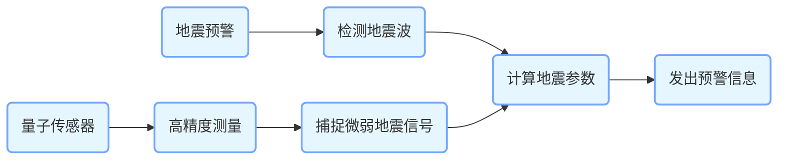

# 如何评估企业的量子传感器地震预警应用

> 关键词：量子传感器、地震预警、企业应用、评估方法、技术指标、经济价值、社会效益

> 摘要：本文围绕如何评估企业的量子传感器地震预警应用展开深入探讨。详细介绍了量子传感器地震预警应用的背景，包括目的、预期读者等内容。阐述了量子传感器及地震预警的核心概念与联系，分析了相关核心算法原理及具体操作步骤，通过数学模型和公式进行理论支撑，并结合实际案例说明。同时，介绍了开发环境搭建、源代码实现与解读等项目实战内容，探讨了该应用的实际场景。还推荐了相关学习资源、开发工具框架以及论文著作。最后总结未来发展趋势与挑战，解答常见问题并提供参考资料，旨在为企业全面、科学地评估量子传感器地震预警应用提供系统的方法和思路。

## 1. 背景介绍 
### 1.1 目的和范围
地震作为一种极具破坏力的自然灾害，给人类的生命和财产安全带来了巨大的威胁。及时、准确的地震预警能够为人们争取宝贵的避险时间，减少损失。量子传感器凭借其高精度、高灵敏度等特性，在地震预警领域展现出了巨大的应用潜力。本文章的目的在于为企业提供一套全面、科学的评估方法，帮助企业判断量子传感器地震预警应用的可行性、有效性和经济性。评估范围涵盖技术性能、经济价值、社会效益等多个方面，从多个维度对企业的量子传感器地震预警应用进行综合考量。

### 1.2 预期读者
本文的预期读者主要包括企业的技术决策者、技术研发人员、投资人和相关领域的研究人员。对于企业技术决策者来说，能够通过本文了解如何评估量子传感器地震预警应用，从而做出合理的决策；技术研发人员可以从中获取相关技术原理和操作步骤，为技术研发提供参考；投资人可以依据评估方法判断该应用的投资价值；相关领域的研究人员则可以在本文的基础上进一步深入研究。

### 1.3 文档结构概述
本文首先介绍量子传感器地震预警应用的背景信息，包括目的、预期读者和文档结构概述等内容。接着阐述量子传感器及地震预警的核心概念与联系，分析核心算法原理及具体操作步骤，并通过数学模型和公式进行理论分析。然后结合项目实战，介绍开发环境搭建、源代码实现与解读等内容。之后探讨该应用的实际场景，推荐相关学习资源、开发工具框架以及论文著作。最后总结未来发展趋势与挑战，解答常见问题并提供参考资料。

### 1.4 术语表
#### 1.4.1 核心术语定义
- **量子传感器**：基于量子力学原理工作的传感器，利用量子态的特性来实现对物理量的高精度测量。
- **地震预警**：在地震发生后，利用地震波传播速度小于电磁波传播速度的特点，在地震波到达之前，提前向可能受灾区域发出警报的技术。
- **灵敏度**：量子传感器对被测量变化的敏感程度，通常用输出变化量与输入变化量的比值来表示。
- **精度**：测量结果与真实值的接近程度，反映了测量的准确程度。

#### 1.4.2 相关概念解释
- **量子态**：量子系统的状态，具有叠加、纠缠等特性，是量子传感器工作的基础。
- **地震波**：地震发生时产生的弹性波，包括纵波（P波）和横波（S波），横波的破坏力通常比纵波大。

#### 1.4.3 缩略词列表
- **P波**：Primary wave，纵波。
- **S波**：Secondary wave，横波。

## 2. 核心概念与联系 
### 2.1 量子传感器原理
量子传感器是基于量子力学原理设计的一类传感器。量子力学描述了微观世界的物理现象，其中一些特性如量子叠加、量子纠缠等为高精度测量提供了可能。以原子干涉仪为例，它利用原子的物质波特性，通过激光操纵原子的量子态，当外界物理量（如加速度、重力等）发生变化时，原子的量子态会发生相应的改变，通过检测这种改变就可以测量出外界物理量的变化。

### 2.2 地震预警原理
地震发生时，会产生两种主要的地震波：纵波（P波）和横波（S波）。纵波传播速度较快，但破坏力相对较小；横波传播速度较慢，但破坏力较大。地震预警系统利用电磁波传播速度远大于地震波传播速度的特点，在地震发生后，通过监测台站检测到纵波，迅速计算地震的相关参数（如震级、震源位置等），然后利用电磁波将预警信息快速传播到可能受灾的区域，在横波到达之前发出警报，为人们争取避险时间。

### 2.3 量子传感器与地震预警的联系
量子传感器的高精度和高灵敏度特性使其在地震预警领域具有独特的优势。传统的地震监测传感器在精度和灵敏度方面存在一定的局限性，而量子传感器能够检测到更微弱的地震信号，提前捕捉到地震的早期信息，从而提高地震预警的时效性和准确性。例如，量子重力仪可以检测到地壳微小的重力变化，这些变化可能是地震发生的先兆，通过对这些变化的监测和分析，可以更早地发现地震的潜在风险。

### 2.4 核心概念架构示意图


## 3. 核心算法原理 & 具体操作步骤 
### 3.1 量子传感器信号处理算法原理
量子传感器输出的信号通常是非常微弱的，并且容易受到噪声的干扰。因此，需要采用一系列的信号处理算法来提取有用的信号信息。其中，滤波算法是一种常用的信号处理方法。以卡尔曼滤波为例，它是一种最优递归滤波器，能够根据系统的状态模型和观测模型，对系统的状态进行最优估计。

以下是卡尔曼滤波算法的Python实现：
```python
import numpy as np

def kalman_filter(z, A, H, Q, R, x0, P0):
    """
    卡尔曼滤波算法实现
    :param z: 观测值序列
    :param A: 状态转移矩阵
    :param H: 观测矩阵
    :param Q: 过程噪声协方差矩阵
    :param R: 观测噪声协方差矩阵
    :param x0: 初始状态估计值
    :param P0: 初始估计误差协方差矩阵
    :return: 状态估计值序列
    """
    n = len(z)
    x_hat = np.zeros((n, len(x0)))
    P = np.zeros((n, len(x0), len(x0)))
    x_hat[0] = x0
    P[0] = P0

    for i in range(1, n):
        # 预测步骤
        x_hat_minus = np.dot(A, x_hat[i - 1])
        P_minus = np.dot(np.dot(A, P[i - 1]), A.T) + Q

        # 更新步骤
        K = np.dot(np.dot(P_minus, H.T), np.linalg.inv(np.dot(np.dot(H, P_minus), H.T) + R))
        x_hat[i] = x_hat_minus + np.dot(K, (z[i] - np.dot(H, x_hat_minus)))
        P[i] = np.dot((np.eye(len(x0)) - np.dot(K, H)), P_minus)

    return x_hat
```

### 3.2 地震预警算法原理
地震预警算法主要包括地震波检测、震级计算和预警信息发布等步骤。其中，地震波检测可以采用阈值检测方法，当传感器检测到的信号超过设定的阈值时，判定为检测到地震波。震级计算可以根据地震波的振幅和周期等参数，利用经验公式进行计算。

以下是一个简单的地震波检测和震级计算的Python实现：
```python
def detect_earthquake_wave(signal, threshold):
    """
    地震波检测函数
    :param signal: 传感器检测到的信号
    :param threshold: 检测阈值
    :return: 是否检测到地震波
    """
    for value in signal:
        if abs(value) > threshold:
            return True
    return False

def calculate_magnitude(amplitude, period):
    """
    震级计算函数
    :param amplitude: 地震波振幅
    :param period: 地震波周期
    :return: 震级
    """
    # 简单的经验公式，实际应用中需要更复杂的模型
    magnitude = np.log10(amplitude) + 1.5 * np.log10(period)
    return magnitude
```

### 3.3 具体操作步骤
1. **量子传感器数据采集**：利用量子传感器对地震相关的物理量（如加速度、重力等）进行实时采集。
2. **信号预处理**：对采集到的原始信号进行滤波、降噪等预处理操作，提高信号的质量。
3. **地震波检测**：使用阈值检测等方法对预处理后的信号进行分析，判断是否检测到地震波。
4. **震级计算**：如果检测到地震波，根据地震波的振幅、周期等参数计算震级。
5. **预警信息发布**：根据震级和震源位置等信息，向可能受灾的区域发布预警信息。

## 4. 数学模型和公式 & 详细讲解 & 举例说明 
### 4.1 量子传感器测量模型
量子传感器的测量模型可以表示为：
$$y = h(x) + n$$
其中，$y$ 是传感器的输出信号，$x$ 是被测量的物理量，$h(x)$ 是传感器的测量函数，$n$ 是测量噪声。在理想情况下，测量函数 $h(x)$ 是线性的，即 $h(x) = kx$，其中 $k$ 是传感器的灵敏度。

例如，对于一个量子加速度传感器，其测量模型可以表示为：
$$y = k a + n$$
其中，$a$ 是加速度，$k$ 是加速度传感器的灵敏度。

### 4.2 卡尔曼滤波数学模型
卡尔曼滤波的数学模型包括状态方程和观测方程。状态方程描述了系统状态的演化过程，观测方程描述了系统状态与观测值之间的关系。

状态方程：
$$x_{k} = A x_{k - 1} + w_{k - 1}$$
其中，$x_{k}$ 是 $k$ 时刻的系统状态，$A$ 是状态转移矩阵，$w_{k - 1}$ 是过程噪声，服从均值为 0、协方差为 $Q$ 的高斯分布。

观测方程：
$$z_{k} = H x_{k} + v_{k}$$
其中，$z_{k}$ 是 $k$ 时刻的观测值，$H$ 是观测矩阵，$v_{k}$ 是观测噪声，服从均值为 0、协方差为 $R$ 的高斯分布。

卡尔曼滤波的核心步骤包括预测和更新。预测步骤：
$$\hat{x}_{k}^{-} = A \hat{x}_{k - 1}$$
$$P_{k}^{-} = A P_{k - 1} A^{T} + Q$$
其中，$\hat{x}_{k}^{-}$ 是 $k$ 时刻的预测状态，$P_{k}^{-}$ 是预测误差协方差矩阵。

更新步骤：
$$K_{k} = P_{k}^{-} H^{T} (H P_{k}^{-} H^{T} + R)^{-1}$$
$$\hat{x}_{k} = \hat{x}_{k}^{-} + K_{k} (z_{k} - H \hat{x}_{k}^{-})$$
$$P_{k} = (I - K_{k} H) P_{k}^{-}$$
其中，$K_{k}$ 是卡尔曼增益，$\hat{x}_{k}$ 是 $k$ 时刻的更新状态，$P_{k}$ 是更新误差协方差矩阵。

### 4.3 震级计算数学模型
震级计算通常采用经验公式，例如里氏震级公式：
$$M = \log_{10} A + 1.5 \log_{10} D + C$$
其中，$M$ 是震级，$A$ 是地震波的最大振幅，$D$ 是观测点到震源的距离，$C$ 是与观测点和震源位置有关的常数。

例如，假设某地震波的最大振幅为 $A = 1000$，观测点到震源的距离为 $D = 100$ km，常数 $C = 3$，则根据里氏震级公式计算的震级为：
$$M = \log_{10} 1000 + 1.5 \log_{10} 100 + 3$$
$$M = 3 + 1.5 \times 2 + 3$$
$$M = 9$$

## 5. 项目实战：代码实际案例和详细解释说明 
### 5.1  开发环境搭建
#### 5.1.1 硬件环境
- **量子传感器**：选择适合地震预警应用的量子传感器，如量子加速度传感器、量子重力仪等。
- **数据采集设备**：用于采集量子传感器输出的信号，如数据采集卡。
- **计算机**：用于运行数据处理和预警算法，建议配置较高的处理器和内存。

#### 5.1.2 软件环境
- **操作系统**：选择 Linux 或 Windows 操作系统。
- **编程语言**：Python，因为 Python 具有丰富的科学计算库和易于使用的特点。
- **开发工具**：可以选择 PyCharm、Jupyter Notebook 等开发工具。
- **相关库**：安装 NumPy、SciPy、Matplotlib 等科学计算和绘图库。

### 5.2  源代码详细实现和代码解读
以下是一个完整的量子传感器地震预警系统的 Python 代码示例：
```python
import numpy as np
import matplotlib.pyplot as plt

# 量子传感器数据采集模拟
def simulate_sensor_data(time_steps, amplitude, frequency, noise_std):
    """
    模拟量子传感器采集的数据
    :param time_steps: 时间步数
    :param amplitude: 信号振幅
    :param frequency: 信号频率
    :param noise_std: 噪声标准差
    :return: 模拟的传感器数据
    """
    time = np.arange(time_steps)
    signal = amplitude * np.sin(2 * np.pi * frequency * time)
    noise = np.random.normal(0, noise_std, time_steps)
    return signal + noise

# 卡尔曼滤波算法实现
def kalman_filter(z, A, H, Q, R, x0, P0):
    """
    卡尔曼滤波算法实现
    :param z: 观测值序列
    :param A: 状态转移矩阵
    :param H: 观测矩阵
    :param Q: 过程噪声协方差矩阵
    :param R: 观测噪声协方差矩阵
    :param x0: 初始状态估计值
    :param P0: 初始估计误差协方差矩阵
    :return: 状态估计值序列
    """
    n = len(z)
    x_hat = np.zeros((n, len(x0)))
    P = np.zeros((n, len(x0), len(x0)))
    x_hat[0] = x0
    P[0] = P0

    for i in range(1, n):
        # 预测步骤
        x_hat_minus = np.dot(A, x_hat[i - 1])
        P_minus = np.dot(np.dot(A, P[i - 1]), A.T) + Q

        # 更新步骤
        K = np.dot(np.dot(P_minus, H.T), np.linalg.inv(np.dot(np.dot(H, P_minus), H.T) + R))
        x_hat[i] = x_hat_minus + np.dot(K, (z[i] - np.dot(H, x_hat_minus)))
        P[i] = np.dot((np.eye(len(x0)) - np.dot(K, H)), P_minus)

    return x_hat

# 地震波检测函数
def detect_earthquake_wave(signal, threshold):
    """
    地震波检测函数
    :param signal: 传感器检测到的信号
    :param threshold: 检测阈值
    :return: 是否检测到地震波
    """
    for value in signal:
        if abs(value) > threshold:
            return True
    return False

# 震级计算函数
def calculate_magnitude(amplitude, period):
    """
    震级计算函数
    :param amplitude: 地震波振幅
    :param period: 地震波周期
    :return: 震级
    """
    # 简单的经验公式，实际应用中需要更复杂的模型
    magnitude = np.log10(amplitude) + 1.5 * np.log10(period)
    return magnitude

# 主函数
def main():
    # 模拟传感器数据
    time_steps = 1000
    amplitude = 10
    frequency = 0.1
    noise_std = 1
    sensor_data = simulate_sensor_data(time_steps, amplitude, frequency, noise_std)

    # 卡尔曼滤波参数设置
    A = np.array([[1]])
    H = np.array([[1]])
    Q = np.array([[0.01]])
    R = np.array([[1]])
    x0 = np.array([0])
    P0 = np.array([[1]])

    # 卡尔曼滤波处理
    filtered_data = kalman_filter(sensor_data, A, H, Q, R, x0, P0)[:, 0]

    # 地震波检测
    threshold = 5
    is_earthquake = detect_earthquake_wave(filtered_data, threshold)

    if is_earthquake:
        # 震级计算
        max_amplitude = np.max(np.abs(filtered_data))
        period = 1 / frequency
        magnitude = calculate_magnitude(max_amplitude, period)
        print(f"检测到地震，震级为: {magnitude}")
    else:
        print("未检测到地震")

    # 绘制原始数据和滤波后的数据
    plt.figure(figsize=(10, 6))
    plt.plot(sensor_data, label='原始数据')
    plt.plot(filtered_data, label='滤波后数据')
    plt.xlabel('时间步数')
    plt.ylabel('信号强度')
    plt.title('量子传感器数据处理')
    plt.legend()
    plt.show()

if __name__ == "__main__":
    main()
```

### 5.3  代码解读与分析
- **模拟传感器数据**：`simulate_sensor_data` 函数用于模拟量子传感器采集的数据，通过生成正弦信号并添加高斯噪声来模拟实际的传感器输出。
- **卡尔曼滤波**：`kalman_filter` 函数实现了卡尔曼滤波算法，对模拟的传感器数据进行滤波处理，去除噪声干扰，提高信号的质量。
- **地震波检测**：`detect_earthquake_wave` 函数使用阈值检测方法判断是否检测到地震波。
- **震级计算**：`calculate_magnitude` 函数根据地震波的振幅和周期计算震级。
- **主函数**：`main` 函数调用上述函数，完成数据模拟、滤波、地震波检测和震级计算等操作，并绘制原始数据和滤波后的数据的图形。

## 6. 实际应用场景 
### 6.1 城市地震预警系统
在城市中部署量子传感器地震预警系统，可以实时监测地震活动，在地震发生时及时向城市居民发出预警信息，为人们争取宝贵的避险时间。例如，在高楼大厦、学校、医院等人员密集场所安装地震预警终端，当接收到预警信息时，自动触发警报系统，提醒人们采取避险措施。

### 6.2 重要基础设施保护
对于一些重要的基础设施，如核电站、水电站、桥梁等，量子传感器地震预警系统可以在地震发生前及时检测到地震信号，自动触发保护机制，如关闭核电站的反应堆、停止水电站的运行、限制桥梁的通行等，减少地震对基础设施的破坏。

### 6.3 地震科学研究
量子传感器的高精度和高灵敏度特性使其能够检测到更微弱的地震信号，为地震科学研究提供了更丰富的数据。研究人员可以利用这些数据深入研究地震的发生机制、地震波的传播规律等，提高对地震的认识和预测能力。

## 7. 工具和资源推荐
### 7.1 学习资源推荐
#### 7.1.1 书籍推荐
- 《量子力学导论》：这本书系统地介绍了量子力学的基本原理和概念，是学习量子传感器原理的基础书籍。
- 《地震学原理》：全面阐述了地震学的基本理论和方法，对于理解地震预警原理有很大的帮助。
- 《信号处理与滤波技术》：详细介绍了信号处理和滤波的相关知识，对于学习量子传感器信号处理算法非常有用。

#### 7.1.2 在线课程
- Coursera 上的“量子力学基础”课程：由知名大学的教授授课，深入浅出地讲解量子力学的基本原理。
- edX 上的“地震学与地震工程”课程：介绍地震学的基本理论和地震工程的应用，帮助学习者了解地震预警的相关知识。
- 中国大学 MOOC 上的“信号与系统”课程：系统地介绍信号与系统的基本概念和分析方法，为学习信号处理算法打下基础。

#### 7.1.3 技术博客和网站
- 量子位：专注于量子计算、量子传感器等领域的技术博客，提供最新的技术资讯和研究成果。
- 地震信息网：提供地震相关的实时信息和研究报告，是了解地震预警应用的重要信息来源。
- IEEE Xplore：收录了大量的电气和电子工程领域的学术论文，其中包括很多关于量子传感器和地震预警的研究论文。

### 7.2 开发工具框架推荐
#### 7.2.1 IDE和编辑器
- PyCharm：一款功能强大的 Python 集成开发环境，提供代码编辑、调试、版本控制等功能，适合开发量子传感器地震预警系统的 Python 代码。
- Jupyter Notebook：一种交互式的开发环境，支持 Python、R 等多种编程语言，方便进行代码演示和数据分析。

#### 7.2.2 调试和性能分析工具
- PySnooper：一个简单易用的 Python 调试工具，可以自动记录函数的执行过程和变量的值，帮助开发者快速定位问题。
- cProfile：Python 内置的性能分析工具，可以统计函数的执行时间和调用次数，帮助开发者优化代码性能。

#### 7.2.3 相关框架和库
- NumPy：Python 的数值计算库，提供了高效的数组操作和数学函数，是进行量子传感器数据处理和地震预警算法实现的基础库。
- SciPy：基于 NumPy 的科学计算库，提供了更多的科学计算工具，如优化算法、信号处理算法等。
- Matplotlib：Python 的绘图库，用于绘制数据可视化图形，方便对量子传感器数据和地震预警结果进行分析和展示。

### 7.3 相关论文著作推荐
#### 7.3.1 经典论文
- “Quantum Sensors”：该论文全面介绍了量子传感器的原理、应用和发展趋势，是量子传感器领域的经典论文。
- “Earthquake Early Warning Systems: Principles and Practice”：详细阐述了地震预警系统的原理和实践，为地震预警应用提供了理论基础。

#### 7.3.2 最新研究成果
- 关注 Nature、Science 等顶级学术期刊上发表的关于量子传感器和地震预警的最新研究成果，了解该领域的前沿动态。

#### 7.3.3 应用案例分析
- 查阅相关的技术报告和案例分析，了解企业在实际应用量子传感器地震预警系统中的经验和教训，为企业的评估和决策提供参考。

## 8. 总结：未来发展趋势与挑战
### 8.1 未来发展趋势
- **技术不断进步**：随着量子技术的不断发展，量子传感器的性能将不断提高，精度和灵敏度将进一步提升，能够检测到更微弱的地震信号，为地震预警提供更准确的信息。
- **与其他技术融合**：量子传感器地震预警系统将与物联网、大数据、人工智能等技术深度融合，实现更智能化的地震预警。例如，利用物联网技术实现传感器的大规模组网，利用大数据技术对海量的地震数据进行分析和挖掘，利用人工智能技术对地震预警算法进行优化。
- **应用范围扩大**：量子传感器地震预警系统的应用范围将不断扩大，不仅在城市和重要基础设施中得到广泛应用，还将在偏远地区、海洋等领域发挥重要作用。

### 8.2 挑战
- **技术成本高**：目前量子传感器的制造成本较高，限制了其大规模应用。如何降低量子传感器的成本，提高其性价比，是未来需要解决的关键问题。
- **数据处理难度大**：量子传感器产生的海量数据需要高效的处理和分析，目前的数据处理技术还不能完全满足需求。如何提高数据处理的效率和准确性，是需要攻克的技术难题。
- **标准和规范不完善**：目前量子传感器地震预警应用的标准和规范还不完善，不同企业和机构的产品和系统之间缺乏统一的接口和标准，不利于系统的集成和互操作性。需要加快制定相关的标准和规范，促进该领域的健康发展。

## 9. 附录：常见问题与解答
### 9.1 量子传感器与传统传感器相比有哪些优势？
量子传感器基于量子力学原理工作，具有高精度、高灵敏度、低噪声等优势。与传统传感器相比，量子传感器能够检测到更微弱的信号，提供更准确的测量结果，在地震预警等对精度要求较高的领域具有独特的优势。

### 9.2 地震预警系统能够完全准确地预测地震吗？
地震预警系统不能完全准确地预测地震。地震的发生具有不确定性，目前的技术还无法提前准确地预测地震的发生时间、地点和震级。地震预警系统是在地震发生后，利用地震波传播速度小于电磁波传播速度的特点，在地震波到达之前提前发出警报，为人们争取一定的避险时间。

### 9.3 如何提高量子传感器地震预警系统的可靠性？
提高量子传感器地震预警系统的可靠性可以从以下几个方面入手：选择高质量的量子传感器，提高传感器的稳定性和可靠性；采用冗余设计，增加传感器的数量，提高系统的容错能力；优化信号处理算法，减少噪声干扰，提高信号的质量；建立完善的监测和维护机制，及时发现和解决系统中出现的问题。

## 10. 扩展阅读 & 参考资料
- [1] Nielsen M A, Chuang I L. Quantum Computation and Quantum Information[M]. Cambridge University Press, 2010.
- [2] Stein S, Wysession M. An Introduction to Seismology, Earthquakes, and Earth Structure[M]. Blackwell Publishing, 2003.
- [3] Oppenheim A V, Schafer R W. Discrete-Time Signal Processing[M]. Prentice Hall, 2010.
- [4] 量子传感器技术发展报告[R]. 中国科学院, 2020.
- [5] 地震预警系统建设指南[R]. 国家地震局, 2019.