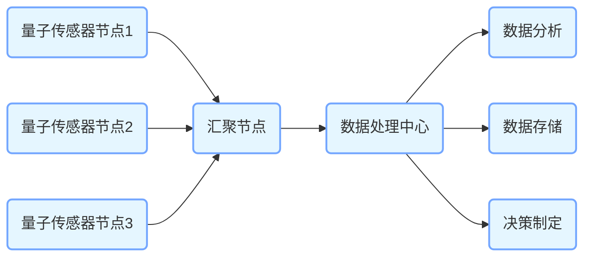

# 如何评估企业的量子传感器网络应用

> 关键词：量子传感器网络、企业应用评估、性能指标、应用场景、技术挑战

> 摘要：本文围绕如何评估企业的量子传感器网络应用展开深入探讨。首先介绍量子传感器网络的背景知识，包括其定义、发展现状等。接着阐述评估企业量子传感器网络应用的核心概念与联系，构建起清晰的评估框架。详细讲解核心算法原理和具体操作步骤，并通过数学模型和公式进一步阐释其内在逻辑。结合项目实战，给出实际代码案例并进行详细解释。分析量子传感器网络在不同企业场景中的实际应用。推荐相关的学习资源、开发工具框架以及论文著作。最后总结量子传感器网络应用的未来发展趋势与挑战，为企业在该领域的应用评估提供全面且深入的参考。

## 1. 背景介绍 
### 1.1 目的和范围
随着量子技术的不断发展，量子传感器网络逐渐成为企业在多个领域寻求突破和创新的重要手段。评估企业的量子传感器网络应用，旨在帮助企业全面了解量子传感器网络在自身业务中的可行性、有效性和潜在价值。本评估涵盖了量子传感器网络的技术性能、应用场景适配性、成本效益、安全可靠性等多个方面，适用于各类有意愿引入或已经应用量子传感器网络的企业。

### 1.2 预期读者
本文的预期读者包括企业的技术决策者、IT 管理人员、技术研发人员，以及对量子传感器网络技术和企业应用评估感兴趣的专业人士。这些读者可以从本文中获取有关量子传感器网络应用评估的系统知识和实用方法，为企业的技术决策和应用实践提供参考。

### 1.3 文档结构概述
本文首先介绍量子传感器网络相关的背景知识，包括术语定义和相关概念解释。接着阐述核心概念与联系，构建评估的理论框架。然后详细讲解核心算法原理和具体操作步骤，通过数学模型和公式进一步分析。结合项目实战，给出实际代码案例并进行解读。分析量子传感器网络在企业中的实际应用场景。推荐相关的学习资源、开发工具框架和论文著作。最后总结未来发展趋势与挑战，并提供常见问题解答和参考资料。

### 1.4 术语表
#### 1.4.1 核心术语定义
- **量子传感器**：基于量子力学原理工作的传感器，利用量子系统的特殊性质（如量子叠加、量子纠缠等）来实现高精度的物理量测量。
- **量子传感器网络**：由多个量子传感器组成的网络系统，这些传感器通过无线或有线通信方式连接，实现数据的采集、传输和处理。
- **量子态**：量子系统的状态，描述了量子系统中粒子的各种物理性质，如位置、动量、自旋等。

#### 1.4.2 相关概念解释
- **量子纠缠**：是指两个或多个量子系统之间存在的一种特殊关联，即使它们在空间上相隔很远，一个系统的状态变化也会瞬间影响到其他系统的状态。
- **量子叠加**：量子系统可以同时处于多个不同的状态的叠加，直到被测量时才会塌缩到一个确定的状态。

#### 1.4.3 缩略词列表
- **QSN**：Quantum Sensor Network，量子传感器网络
- **SNR**：Signal - to - Noise Ratio，信噪比

## 2. 核心概念与联系 

### 核心概念原理
量子传感器网络的核心在于量子传感器的工作原理。量子传感器利用量子态的特性来实现对物理量的测量。例如，基于原子的量子传感器可以利用原子的能级跃迁来测量磁场、重力等物理量。当外界物理量发生变化时，原子的能级结构会相应改变，通过检测原子的能级跃迁信号，就可以精确地测量出物理量的变化。

量子传感器网络的架构包括传感器节点、通信网络和数据处理中心。传感器节点负责采集物理量数据，通信网络将采集到的数据传输到数据处理中心，数据处理中心对数据进行分析和处理，提取有用信息。

### 文本示意图
量子传感器网络的架构可以描述为：多个量子传感器节点分布在不同的监测区域，它们通过无线或有线通信方式连接到汇聚节点，汇聚节点再将数据传输到数据处理中心。数据处理中心对数据进行分析、存储和决策。

### Mermaid 流程图


## 3. 核心算法原理 & 具体操作步骤 

### 核心算法原理
在量子传感器网络中，数据融合算法是一个核心算法。数据融合的目的是将多个传感器节点采集到的数据进行综合处理，提高数据的准确性和可靠性。一种常见的数据融合算法是加权平均算法。

加权平均算法的基本思想是根据每个传感器节点的可信度给其采集的数据分配不同的权重，然后对所有数据进行加权平均得到最终的测量结果。

### Python 源代码实现
```python
# 定义传感器数据和权重列表
sensor_data = [10.2, 10.5, 10.3]
weights = [0.3, 0.4, 0.3]

# 初始化加权和和权重总和
weighted_sum = 0
total_weight = 0

# 计算加权和和权重总和
for i in range(len(sensor_data)):
    weighted_sum += sensor_data[i] * weights[i]
    total_weight += weights[i]

# 计算加权平均值
if total_weight != 0:
    fused_data = weighted_sum / total_weight
else:
    fused_data = 0

print("融合后的数据为:", fused_data)
```

### 具体操作步骤
1. **数据采集**：各个量子传感器节点按照一定的时间间隔采集物理量数据。
2. **数据传输**：将采集到的数据通过通信网络传输到汇聚节点。
3. **权重确定**：根据每个传感器节点的历史数据、精度等信息确定其可信度，进而确定其权重。
4. **数据融合**：使用加权平均算法对汇聚节点接收到的所有数据进行融合处理。
5. **结果输出**：将融合后的数据传输到数据处理中心进行进一步的分析和决策。

## 4. 数学模型和公式 & 详细讲解 & 举例说明 

### 数学模型和公式
加权平均算法的数学模型可以用以下公式表示：

设共有 $n$ 个传感器节点，第 $i$ 个传感器节点采集的数据为 $x_i$，其对应的权重为 $w_i$，则融合后的数据 $y$ 为：

$$y=\frac{\sum_{i = 1}^{n}w_ix_i}{\sum_{i = 1}^{n}w_i}$$

其中，$\sum_{i = 1}^{n}w_i\neq0$。

### 详细讲解
在这个公式中，分子 $\sum_{i = 1}^{n}w_ix_i$ 表示所有传感器数据的加权和，分母 $\sum_{i = 1}^{n}w_i$ 表示所有权重的总和。通过将加权和除以权重总和，得到的结果就是融合后的数据。权重 $w_i$ 反映了第 $i$ 个传感器节点的可信度，可信度越高，权重越大。

### 举例说明
假设有三个量子传感器节点，采集到的数据分别为 $x_1 = 10.2$，$x_2 = 10.5$，$x_3 = 10.3$，对应的权重分别为 $w_1 = 0.3$，$w_2 = 0.4$，$w_3 = 0.3$。

首先计算加权和：

$\sum_{i = 1}^{3}w_ix_i=w_1x_1 + w_2x_2+w_3x_3=0.3\times10.2 + 0.4\times10.5+0.3\times10.3$

$=3.06 + 4.2+3.09 = 10.35$

然后计算权重总和：

$\sum_{i = 1}^{3}w_i=0.3 + 0.4+0.3 = 1$

最后计算融合后的数据：

$y=\frac{\sum_{i = 1}^{3}w_ix_i}{\sum_{i = 1}^{3}w_i}=\frac{10.35}{1}=10.35$

## 5. 项目实战：代码实际案例和详细解释说明 

### 5.1  开发环境搭建
- **硬件环境**：需要准备多个量子传感器节点、汇聚节点和数据处理中心的服务器。量子传感器节点可以选择市面上成熟的产品，如基于原子磁力计的量子磁场传感器。汇聚节点可以使用具有一定数据处理和通信能力的嵌入式设备，如 Raspberry Pi。数据处理中心的服务器可以选择普通的 x86 服务器。
- **软件环境**：在汇聚节点和数据处理中心的服务器上安装 Linux 操作系统，如 Ubuntu。安装 Python 3 环境，用于运行数据处理和融合的代码。同时，安装相应的通信库，如 PySerial 用于串口通信，Socket 用于网络通信。

### 5.2  源代码详细实现和代码解读
以下是一个更完整的量子传感器网络数据采集、传输和融合的代码示例：

```python
import serial
import socket
import time

# 模拟量子传感器节点类
class QuantumSensorNode:
    def __init__(self, port, baudrate):
        self.ser = serial.Serial(port, baudrate)

    def read_data(self):
        try:
            data = self.ser.readline().decode('utf - 8').strip()
            return float(data)
        except Exception as e:
            print(f"读取数据出错: {e}")
            return None

# 模拟汇聚节点类
class AggregationNode:
    def __init__(self, sensors, server_ip, server_port):
        self.sensors = sensors
        self.server_ip = server_ip
        self.server_port = server_port
        self.sock = socket.socket(socket.AF_INET, socket.SOCK_STREAM)

    def connect_to_server(self):
        try:
            self.sock.connect((self.server_ip, self.server_port))
            print("成功连接到数据处理中心")
        except Exception as e:
            print(f"连接数据处理中心出错: {e}")

    def collect_and_send_data(self):
        sensor_data = []
        for sensor in self.sensors:
            data = sensor.read_data()
            if data is not None:
                sensor_data.append(data)
        if sensor_data:
            data_str = ','.join(map(str, sensor_data))
            self.sock.sendall(data_str.encode('utf - 8'))
            print("数据已发送到数据处理中心")

# 模拟数据处理中心类
class DataProcessingCenter:
    def __init__(self, server_port):
        self.server_port = server_port
        self.sock = socket.socket(socket.AF_INET, socket.SOCK_STREAM)
        self.sock.bind(('0.0.0.0', self.server_port))
        self.sock.listen(1)

    def accept_connection(self):
        conn, addr = self.sock.accept()
        print(f"接收到来自 {addr} 的连接")
        return conn

    def receive_and_fuse_data(self, conn):
        data = conn.recv(1024).decode('utf - 8')
        if data:
            sensor_data = list(map(float, data.split(',')))
            weights = [0.3, 0.4, 0.3]  # 假设的权重
            weighted_sum = 0
            total_weight = 0
            for i in range(len(sensor_data)):
                weighted_sum += sensor_data[i] * weights[i]
                total_weight += weights[i]
            if total_weight != 0:
                fused_data = weighted_sum / total_weight
                print(f"融合后的数据为: {fused_data}")
            else:
                print("权重总和为0，无法计算融合数据")
        conn.close()


if __name__ == "__main__":
    # 初始化量子传感器节点
    sensor1 = QuantumSensorNode('/dev/ttyUSB0', 9600)
    sensor2 = QuantumSensorNode('/dev/ttyUSB1', 9600)
    sensor3 = QuantumSensorNode('/dev/ttyUSB2', 9600)
    sensors = [sensor1, sensor2, sensor3]

    # 初始化汇聚节点
    aggregation_node = AggregationNode(sensors, '127.0.0.1', 8888)
    aggregation_node.connect_to_server()

    # 初始化数据处理中心
    data_processing_center = DataProcessingCenter(8888)

    while True:
        aggregation_node.collect_and_send_data()
        conn = data_processing_center.accept_connection()
        data_processing_center.receive_and_fuse_data(conn)
        time.sleep(5)
```

### 5.3  代码解读与分析
- **QuantumSensorNode 类**：模拟量子传感器节点，通过串口读取传感器采集的数据。
- **AggregationNode 类**：模拟汇聚节点，负责收集各个传感器节点的数据，并将数据通过网络发送到数据处理中心。
- **DataProcessingCenter 类**：模拟数据处理中心，接收汇聚节点发送的数据，并使用加权平均算法进行数据融合。
- **主程序**：初始化量子传感器节点、汇聚节点和数据处理中心，然后循环执行数据采集、传输和融合的过程。

## 6. 实际应用场景 
### 工业监测
在工业生产中，量子传感器网络可以用于实时监测设备的运行状态。例如，通过量子振动传感器监测机械设备的振动情况，及时发现设备的故障隐患，避免设备损坏和生产事故的发生。量子传感器网络还可以用于监测工业环境中的温度、压力、湿度等参数，确保生产过程的稳定性和安全性。

### 智能交通
在智能交通领域，量子传感器网络可以用于交通流量监测、车辆定位和自动驾驶等方面。量子磁场传感器可以检测车辆的存在和运动状态，为交通信号控制提供准确的数据支持。量子惯性传感器可以提高车辆的定位精度，为自动驾驶车辆提供更可靠的导航信息。

### 环境监测
量子传感器网络在环境监测方面具有重要应用价值。量子气体传感器可以高精度地检测空气中的有害气体浓度，为环境保护和空气质量监测提供数据支持。量子重力传感器可以用于地质勘探和地震监测，及时发现地质灾害隐患。

### 医疗保健
在医疗保健领域，量子传感器网络可以用于生物医学信号监测。例如，量子磁传感器可以检测人体的微弱磁场信号，为疾病的早期诊断提供新的手段。量子传感器网络还可以用于远程医疗监测，实现对患者的实时健康监测和疾病预警。

## 7. 工具和资源推荐
### 7.1 学习资源推荐
#### 7.1.1 书籍推荐
- 《量子力学原理》：介绍了量子力学的基本原理和概念，是学习量子传感器技术的基础书籍。
- 《传感器网络技术》：详细讲解了传感器网络的架构、协议和应用，对理解量子传感器网络有很大帮助。
- 《量子信息与量子计算》：涉及量子信息和量子计算的前沿知识，对于深入研究量子传感器网络的算法和技术有重要参考价值。

#### 7.1.2 在线课程
- Coursera 上的“量子力学基础”课程：由知名大学的教授授课，系统地介绍了量子力学的基础知识。
- edX 上的“传感器网络与物联网”课程：涵盖了传感器网络的各个方面，包括网络架构、数据处理和应用案例。
- Udemy 上的“量子计算入门”课程：帮助初学者快速了解量子计算的基本概念和应用。

#### 7.1.3 技术博客和网站
- 量子计算领域的专业博客“Quantum Computing Now”：提供了最新的量子计算和量子传感器技术的研究动态和应用案例。
- IEEE 传感器委员会的官方网站：发布了传感器技术的最新研究成果和标准，对量子传感器网络的研究有重要参考价值。
- 中国科学院量子信息与量子科技创新研究院的官方网站：展示了国内量子技术的前沿研究成果和应用案例。

### 7.2 开发工具框架推荐
#### 7.2.1 IDE和编辑器
- PyCharm：一款专业的 Python 集成开发环境，具有代码编辑、调试、版本控制等功能，适合开发量子传感器网络的数据处理和通信代码。
- Visual Studio Code：一款轻量级的代码编辑器，支持多种编程语言，具有丰富的插件扩展功能，方便开发和调试量子传感器网络的相关代码。

#### 7.2.2 调试和性能分析工具
- Wireshark：一款网络协议分析工具，可以用于分析量子传感器网络中的数据传输过程，帮助调试网络通信问题。
- Profiler：Python 内置的性能分析工具，可以用于分析量子传感器网络数据处理代码的性能瓶颈，优化代码性能。

#### 7.2.3 相关框架和库
- NumPy：一个用于科学计算的 Python 库，提供了高效的数组操作和数学函数，在量子传感器网络的数据处理中可以用于实现数据融合算法。
- SciPy：一个基于 NumPy 的科学计算库，提供了更多的科学计算工具，如信号处理、优化算法等，可用于量子传感器网络的数据分析和处理。

### 7.3 相关论文著作推荐
#### 7.3.1 经典论文
- “Quantum Sensors”：该论文全面介绍了量子传感器的基本原理、技术发展和应用前景，是量子传感器领域的经典论文。
- “Wireless Sensor Networks: A Survey”：对无线传感器网络的架构、协议和应用进行了系统的综述，对理解量子传感器网络的网络通信技术有重要参考价值。

#### 7.3.2 最新研究成果
- 每年在 IEEE International Conference on Quantum Computing and Engineering 上发表的研究论文，展示了量子计算和量子传感器技术的最新研究成果。
- Nature 和 Science 等顶级学术期刊上发表的关于量子传感器技术的研究论文，代表了该领域的前沿研究水平。

#### 7.3.3 应用案例分析
- 一些企业和研究机构发布的关于量子传感器网络应用案例的报告，如某汽车制造企业使用量子传感器网络进行车辆故障监测的案例分析，为企业在实际应用中提供了参考和借鉴。

## 8. 总结：未来发展趋势与挑战
### 未来发展趋势
- **技术集成化**：量子传感器网络将与其他先进技术，如人工智能、大数据、云计算等深度融合。通过人工智能算法对量子传感器网络采集的数据进行分析和处理，可以实现更智能的决策和控制。大数据和云计算技术可以提供强大的数据存储和处理能力，支持量子传感器网络在大规模应用中的数据管理。
- **应用拓展化**：量子传感器网络的应用领域将不断拓展，除了工业监测、智能交通、环境监测和医疗保健等领域，还将在能源、金融、国防等领域发挥重要作用。例如，在能源领域，量子传感器网络可以用于监测能源生产和传输过程中的各种参数，提高能源利用效率和安全性。
- **小型化和低成本化**：随着量子技术的不断发展，量子传感器的体积将不断减小，成本将不断降低。这将使得量子传感器网络更容易大规模部署和应用，促进其在更多领域的普及。

### 挑战
- **技术难题**：量子传感器的稳定性和可靠性仍然是一个挑战。量子系统容易受到外界环境的干扰，导致测量结果的误差。如何提高量子传感器的抗干扰能力和测量精度是当前需要解决的关键问题。
- **标准和规范缺失**：目前量子传感器网络的标准和规范还不完善，不同厂家生产的量子传感器和设备之间的兼容性存在问题。这给量子传感器网络的大规模部署和应用带来了困难。
- **人才短缺**：量子传感器网络是一个新兴的领域，涉及量子力学、传感器技术、通信技术等多个学科的知识。目前相关领域的专业人才短缺，制约了量子传感器网络技术的发展和应用。

## 9. 附录：常见问题与解答
### 问题 1：量子传感器网络与传统传感器网络有什么区别？
答：量子传感器网络基于量子力学原理工作，利用量子系统的特殊性质实现高精度的物理量测量。与传统传感器网络相比，量子传感器网络具有更高的灵敏度、分辨率和抗干扰能力。例如，量子磁场传感器可以检测到极其微弱的磁场变化，而传统磁场传感器的灵敏度相对较低。

### 问题 2：量子传感器网络的成本高吗？
答：目前量子传感器网络的成本相对较高，主要原因是量子传感器的制造工艺复杂，需要高精度的设备和技术。但是随着量子技术的不断发展和规模化生产的实现，量子传感器网络的成本有望逐渐降低。

### 问题 3：量子传感器网络的安全性如何？
答：量子传感器网络具有较高的安全性。量子通信技术利用量子态的特性实现信息的安全传输，具有不可窃听、不可复制的特点。同时，量子传感器网络的数据处理和存储也可以采用加密技术，进一步提高数据的安全性。

### 问题 4：如何选择适合企业应用的量子传感器？
答：选择适合企业应用的量子传感器需要考虑多个因素，如测量精度、测量范围、响应时间、稳定性、成本等。企业应根据自身的应用需求和预算，综合评估各种量子传感器的性能指标，选择最适合的产品。

## 10. 扩展阅读 & 参考资料
- [1] Nielsen, M. A., & Chuang, I. L. (2010). Quantum Computation and Quantum Information. Cambridge University Press.
- [2] Akyildiz, I. F., Su, W., Sankarasubramaniam, Y., & Cayirci, E. (2002). Wireless sensor networks: a survey. Computer networks, 38(4), 393 - 422.
- [3] Bock, M., & Uys, H. (2016). Quantum sensors. Nature, 529(7584), 161 - 169.
- [4] 量子计算与量子信息相关学术论文和研究报告，可通过 IEEE Xplore、ACM Digital Library 等学术数据库获取。
- [5] 各大企业和研究机构发布的关于量子传感器网络应用案例的报告和白皮书。