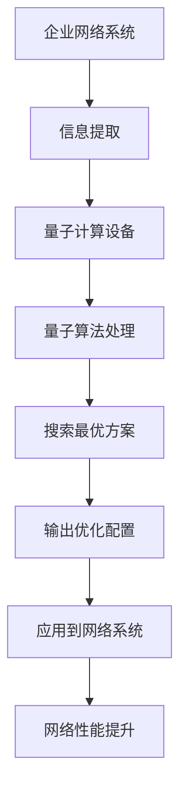

# 如何评估企业的量子计算网络优化应用

> 关键词：量子计算、网络优化、企业应用、评估指标、性能分析

> 摘要：本文旨在探讨如何全面、科学地评估企业的量子计算网络优化应用。随着量子计算技术的不断发展，其在网络优化领域的应用潜力逐渐显现。然而，对于企业而言，准确评估该应用的效果和价值至关重要。文章将从背景介绍入手，阐述量子计算网络优化应用的相关核心概念与联系，深入剖析核心算法原理及具体操作步骤，介绍相关数学模型和公式，通过项目实战案例详细解释实现过程及代码，探讨实际应用场景，推荐相关工具和资源，最后总结未来发展趋势与挑战，并给出常见问题解答和参考资料，帮助企业更好地理解和评估量子计算网络优化应用。

## 1. 背景介绍 
### 1.1 目的和范围
目的在于为企业提供一套全面、系统的评估方法，以确定量子计算网络优化应用在企业中的实际价值和效果。范围涵盖量子计算网络优化应用的各个方面，包括技术原理、性能表现、经济效益、应用场景等，旨在从多个维度对企业的相关应用进行综合评估。

### 1.2 预期读者
本文预期读者包括企业的技术管理人员、网络工程师、量子计算研究人员、投资决策人员等。这些人员对量子计算网络优化应用有一定的兴趣或需求，希望通过本文获取相关评估知识和方法，以指导实际工作或决策。

### 1.3 文档结构概述
本文首先介绍量子计算网络优化应用的背景信息，包括目的、读者和文档结构等。接着阐述核心概念与联系，展示其原理和架构。然后深入讲解核心算法原理及具体操作步骤，并给出相关数学模型和公式。通过项目实战案例详细说明代码实现和解读。探讨实际应用场景，推荐相关工具和资源。最后总结未来发展趋势与挑战，提供常见问题解答和参考资料。

### 1.4 术语表
#### 1.4.1 核心术语定义
- **量子计算**：基于量子力学原理进行信息处理的计算模式，利用量子比特的叠加和纠缠等特性，具有强大的计算能力。
- **网络优化**：通过对网络结构、资源分配、路由选择等方面进行调整和改进，以提高网络性能、效率和可靠性的过程。
- **量子计算网络优化应用**：将量子计算技术应用于网络优化问题的解决，利用量子算法的优势来提高网络优化的效果和效率。

#### 1.4.2 相关概念解释
- **量子比特**：量子计算中的基本信息单位，与经典比特不同，量子比特可以同时处于 0 和 1 的叠加态，从而使量子计算能够并行处理大量信息。
- **量子纠缠**：量子系统中多个量子比特之间存在的一种特殊关联，当一个量子比特的状态发生变化时，其他与之纠缠的量子比特的状态也会瞬间发生相应变化。
- **网络拓扑**：指网络中各个节点和链路的连接方式和布局结构，不同的网络拓扑对网络性能和优化策略有重要影响。

#### 1.4.3 缩略词列表
- **QC**：Quantum Computing（量子计算）
- **QCO**：Quantum Computing Optimization（量子计算优化）
- **NP**：Non-deterministic Polynomial（非确定性多项式）

## 2. 核心概念与联系 

### 2.1 量子计算原理
量子计算基于量子力学的基本原理，主要利用量子比特的叠加和纠缠特性。在经典计算中，比特只能处于 0 或 1 两种状态之一，而量子比特可以同时处于 0 和 1 的叠加态，即 $|\psi\rangle = \alpha|0\rangle + \beta|1\rangle$，其中 $\alpha$ 和 $\beta$ 是复数，且 $|\alpha|^2 + |\beta|^2 = 1$。这种叠加态使得量子计算能够同时处理多个计算任务，从而在某些问题上具有指数级的加速优势。

量子纠缠是指多个量子比特之间存在的一种特殊关联，使得它们的状态不能独立描述，而是相互关联的。例如，两个纠缠的量子比特可以处于 $|\psi\rangle = \frac{1}{\sqrt{2}}(|00\rangle + |11\rangle)$ 的状态，当测量其中一个量子比特时，另一个量子比特的状态也会瞬间确定。

### 2.2 网络优化问题
网络优化问题主要包括网络拓扑优化、资源分配优化、路由选择优化等。这些问题通常具有复杂性和多约束性，传统的计算方法在处理大规模网络优化问题时往往面临计算资源和时间的限制。例如，在路由选择问题中，需要在众多可能的路径中选择最优路径，以满足带宽、延迟等多种约束条件。

### 2.3 量子计算与网络优化的联系
量子计算的强大计算能力为解决网络优化问题提供了新的途径。通过设计合适的量子算法，可以利用量子比特的叠加和纠缠特性，并行地搜索解空间，从而更快地找到最优或近似最优的网络优化方案。例如，量子退火算法可以用于解决网络拓扑优化问题，通过模拟量子系统的退火过程，寻找能量最低的状态，对应于网络拓扑的最优结构。

### 2.4 核心概念原理和架构的文本示意图
量子计算网络优化应用的核心原理和架构可以描述为：企业的网络系统作为输入，包含网络拓扑、流量需求等信息。量子计算设备利用量子算法对这些信息进行处理，通过量子比特的操作和计算，搜索最优的网络优化方案。最终输出优化后的网络配置，如路由表、资源分配方案等。

### 2.5 Mermaid 流程图


## 3. 核心算法原理 & 具体操作步骤 

### 3.1 量子退火算法原理
量子退火算法是一种基于量子力学原理的优化算法，其基本思想是通过模拟量子系统的退火过程，寻找系统的基态，即能量最低的状态。在网络优化问题中，将网络的优化目标转化为量子系统的能量函数，通过量子退火过程，使系统逐渐从高能态向低能态演化，最终找到能量最低的状态，对应于网络优化问题的最优解。

### 3.2 Python 源代码实现量子退火算法示例
```python
import numpy as np
import neal

# 定义网络优化问题的能量函数
def network_energy_function(solution):
    # 这里简单示例，实际应根据具体网络优化问题定义
    return np.sum(solution)

# 生成问题的二进制变量
num_variables = 10
binary_variables = np.random.randint(0, 2, num_variables)

# 定义量子退火器
sampler = neal.SimulatedAnnealingSampler()

# 运行量子退火算法
num_reads = 100
sampleset = sampler.sample_ising({}, {}, num_reads=num_reads)

# 找到能量最低的解
best_solution = sampleset.first.sample
best_energy = sampleset.first.energy

print("Best solution:", best_solution)
print("Best energy:", best_energy)
```

### 3.3 具体操作步骤
1. **问题建模**：将网络优化问题转化为量子系统的能量函数，确定问题的变量和约束条件。
2. **量子算法设计**：选择合适的量子算法，如量子退火算法、量子遗传算法等，并根据问题的特点进行调整和优化。
3. **量子计算设备准备**：连接量子计算设备，如量子退火机、通用量子计算机等，并进行必要的初始化和配置。
4. **运行量子算法**：将问题的能量函数和初始状态输入到量子计算设备中，运行量子算法进行计算。
5. **结果分析**：对量子计算设备输出的结果进行分析和处理，找到最优或近似最优的网络优化方案。

## 4. 数学模型和公式 & 详细讲解 & 举例说明 

### 4.1 网络优化问题的数学模型
以网络路由选择问题为例，假设网络中有 $N$ 个节点，$M$ 条链路，每条链路的带宽为 $b_i$，延迟为 $d_i$，流量需求为 $f$。目标是找到一条从源节点到目标节点的路径，使得路径的延迟最小，同时满足带宽约束。

设 $x_{ij}$ 为二进制变量，表示链路 $(i, j)$ 是否在路径中，$x_{ij} \in \{0, 1\}$。则网络路由选择问题可以建模为以下线性规划问题：

$$
\begin{align*}
\min &\sum_{(i, j) \in E} d_{ij}x_{ij}\\
\text{s.t.} &\sum_{j: (i, j) \in E} x_{ij} - \sum_{j: (j, i) \in E} x_{ji} = 
\begin{cases}
1, & i = s\\
-1, & i = t\\
0, & \text{otherwise}
\end{cases}\\
&\sum_{(i, j) \in E} f x_{ij} \leq b_{ij}, \forall (i, j) \in E\\
&x_{ij} \in \{0, 1\}, \forall (i, j) \in E
\end{align*}
$$

其中，$E$ 是网络中所有链路的集合，$s$ 是源节点，$t$ 是目标节点。

### 4.2 量子算法的数学原理
以量子退火算法为例，其数学原理基于量子系统的哈密顿量。量子系统的哈密顿量 $H$ 描述了系统的能量状态，通过在量子系统中引入一个与时间相关的驱动哈密顿量 $H_D(t)$，使得系统从初始的简单哈密顿量 $H_0$ 逐渐演化到目标哈密顿量 $H_1$，即 $H(t) = (1 - s(t))H_0 + s(t)H_1$，其中 $s(t)$ 是一个随时间变化的函数，$0 \leq s(t) \leq 1$。

在演化过程中，系统的状态 $\psi(t)$ 满足薛定谔方程：

$$
i\hbar\frac{\partial}{\partial t}|\psi(t)\rangle = H(t)|\psi(t)\rangle
$$

通过缓慢地改变 $s(t)$，使得系统在演化过程中始终处于基态，最终得到目标哈密顿量 $H_1$ 的基态，对应于网络优化问题的最优解。

### 4.3 举例说明
假设一个简单的网络有 3 个节点和 3 条链路，链路的延迟分别为 $d_{12} = 2$，$d_{13} = 3$，$d_{23} = 1$，带宽分别为 $b_{12} = 10$，$b_{13} = 15$，$b_{23} = 8$，流量需求为 $f = 5$。源节点为 1，目标节点为 3。

将问题建模为上述线性规划问题，通过量子退火算法求解。首先将线性规划问题转化为量子系统的能量函数，然后利用量子退火算法进行计算。最终得到最优路径为 $1 \to 2 \to 3$，总延迟为 $2 + 1 = 3$，且满足带宽约束。

## 5. 项目实战：代码实际案例和详细解释说明 

### 5.1 开发环境搭建
1. **安装 Python**：确保系统中安装了 Python 3.x 版本。
2. **安装必要的库**：使用 pip 安装相关的库，如 `numpy`、`neal` 等。
```bash
pip install numpy neal
```
3. **配置量子计算设备**：如果使用实际的量子计算设备，需要根据设备的要求进行相应的配置和连接。

### 5.2 源代码详细实现和代码解读
```python
import numpy as np
import neal

# 定义网络拓扑和参数
num_nodes = 3
num_links = 3
link_delays = np.array([2, 3, 1])
link_bandwidths = np.array([10, 15, 8])
flow_demand = 5
source_node = 1
target_node = 3

# 定义网络优化问题的能量函数
def network_energy_function(solution):
    # 计算路径延迟
    path_delay = np.sum(link_delays * solution)
    
    # 检查带宽约束
    bandwidth_violation = np.max(np.sum(flow_demand * solution) - link_bandwidths, 0)
    
    # 能量函数：延迟 + 惩罚项（带宽违反）
    energy = path_delay + 100 * bandwidth_violation
    
    return energy

# 生成问题的二进制变量
binary_variables = np.random.randint(0, 2, num_links)

# 定义量子退火器
sampler = neal.SimulatedAnnealingSampler()

# 运行量子退火算法
num_reads = 100
sampleset = sampler.sample_ising({}, {}, num_reads=num_reads)

# 找到能量最低的解
best_solution = sampleset.first.sample
best_energy = sampleset.first.energy

print("Best solution:", best_solution)
print("Best energy:", best_energy)

# 输出最优路径
optimal_path = []
for i in range(num_links):
    if best_solution[i] == 1:
        optimal_path.append(i)
print("Optimal path:", optimal_path)
```

### 5.3 代码解读与分析
1. **网络拓扑和参数定义**：定义了网络的节点数、链路数、链路延迟、带宽、流量需求、源节点和目标节点等参数。
2. **能量函数定义**：`network_energy_function` 函数计算路径的延迟，并检查带宽约束。如果违反带宽约束，则添加一个惩罚项到能量函数中，以确保找到的解满足带宽要求。
3. **量子退火算法运行**：使用 `neal.SimulatedAnnealingSampler` 模拟量子退火过程，运行算法并获取多个解。
4. **最优解选择**：从所有解中选择能量最低的解作为最优解，并输出最优路径。

## 6. 实际应用场景 
### 6.1 数据中心网络优化
在数据中心网络中，量子计算网络优化应用可以用于优化网络拓扑结构，提高数据传输效率，降低网络延迟。通过量子算法可以快速找到最优的网络配置，实现服务器之间的高效通信。

### 6.2 5G 通信网络优化
5G 通信网络具有高带宽、低延迟、大规模连接等特点，对网络优化提出了更高的要求。量子计算可以用于优化 5G 网络的基站布局、资源分配和路由选择，提高网络的性能和可靠性。

### 6.3 智能交通网络优化
在智能交通网络中，量子计算网络优化应用可以用于优化交通流量分配、路径规划和信号灯控制等。通过实时分析交通数据，利用量子算法快速找到最优的交通管理方案，缓解交通拥堵。

### 6.4 电力网络优化
电力网络的优化对于保障电力供应的稳定性和可靠性至关重要。量子计算可以用于优化电力网络的拓扑结构、潮流分布和故障诊断等，提高电力系统的运行效率和安全性。

## 7. 工具和资源推荐
### 7.1 学习资源推荐
#### 7.1.1 书籍推荐
- 《量子计算与量子信息》：全面介绍了量子计算的基本原理、算法和应用，是量子计算领域的经典教材。
- 《网络优化：连续与离散模型》：详细讲解了网络优化的各种模型和算法，为理解网络优化问题提供了理论基础。

#### 7.1.2 在线课程
- Coursera 上的“量子计算基础”课程：由知名高校的教授授课，系统地介绍了量子计算的基础知识和应用。
- edX 上的“网络优化算法”课程：提供了网络优化算法的深入学习和实践。

#### 7.1.3 技术博客和网站
- Quantum Computing Report：提供量子计算领域的最新研究成果、行业动态和技术分析。
- Network World：专注于网络技术和优化的专业网站，分享网络优化的最佳实践和案例。

### 7.2 开发工具框架推荐
#### 7.2.1 IDE和编辑器
- PyCharm：功能强大的 Python 集成开发环境，提供代码编辑、调试、版本控制等功能。
- Visual Studio Code：轻量级的代码编辑器，支持多种编程语言和插件扩展。

#### 7.2.2 调试和性能分析工具
- cProfile：Python 内置的性能分析工具，用于分析代码的运行时间和性能瓶颈。
- pdb：Python 调试器，帮助开发者定位和解决代码中的问题。

#### 7.2.3 相关框架和库
- Qiskit：IBM 开发的开源量子计算框架，提供量子算法开发、模拟和实验的工具。
- D-Wave Ocean SDK：D-Wave 公司开发的量子退火算法开发工具包，支持量子退火算法的实现和优化。

### 7.3 相关论文著作推荐
#### 7.3.1 经典论文
- “Quantum Computation and Shor's Factoring Algorithm”：介绍了量子计算中的 Shor 算法，对量子计算的发展产生了重要影响。
- “A Survey of Network Optimization Problems and Algorithms”：对网络优化问题和算法进行了全面的综述。

#### 7.3.2 最新研究成果
- 关注 Nature、Science 等顶级学术期刊上关于量子计算和网络优化的最新研究论文，了解领域的前沿动态。

#### 7.3.3 应用案例分析
- 查阅相关的行业报告和研究论文，了解量子计算网络优化应用在不同领域的实际案例和效果。

## 8. 总结：未来发展趋势与挑战
### 8.1 未来发展趋势
- **技术不断进步**：随着量子计算技术的不断发展，量子比特的数量和质量将不断提高，量子算法也将不断优化，为网络优化提供更强大的计算能力。
- **应用范围扩大**：量子计算网络优化应用将在更多领域得到应用，如金融、医疗、工业等，为各行业的发展带来新的机遇。
- **与其他技术融合**：量子计算将与人工智能、大数据、物联网等技术深度融合，形成更强大的技术体系，推动网络优化技术的不断创新。

### 8.2 挑战
- **技术难度大**：量子计算技术仍处于发展阶段，存在量子比特的稳定性、量子噪声等技术难题，需要进一步研究和解决。
- **成本高昂**：量子计算设备的研发和运行成本较高，限制了其在企业中的广泛应用。需要降低成本，提高性价比。
- **人才短缺**：量子计算和网络优化领域的专业人才短缺，需要加强人才培养和引进，提高企业的技术创新能力。

## 9. 附录：常见问题与解答
### 9.1 量子计算网络优化应用对企业的技术要求高吗？
是的，量子计算网络优化应用需要企业具备一定的量子计算和网络优化知识和技术能力。企业需要了解量子计算的基本原理和算法，掌握网络优化的相关模型和方法，并具备相应的开发和实验环境。

### 9.2 量子计算网络优化应用的效果如何评估？
可以从多个维度进行评估，如网络性能指标（延迟、带宽、吞吐量等）、经济效益（成本降低、效率提高等）、技术创新能力（算法优化、方案改进等）等。

### 9.3 量子计算网络优化应用的成本高吗？
目前，量子计算设备的研发和运行成本较高。但随着技术的发展和规模的扩大，成本有望逐渐降低。企业可以根据自身需求和实际情况，选择合适的应用模式和方案，以降低成本。

### 9.4 量子计算网络优化应用的安全性如何保障？
量子计算的安全性是一个重要问题。一方面，量子加密技术可以提供更高的安全性保障；另一方面，企业需要加强对量子计算设备和数据的管理和保护，防止信息泄露和攻击。

## 10. 扩展阅读 & 参考资料
- Nielsen, M. A., & Chuang, I. L. (2010). Quantum Computation and Quantum Information. Cambridge University Press.
- Ahuja, R. K., Magnanti, T. L., & Orlin, J. B. (1993). Network Flows: Theory, Algorithms, and Applications. Prentice Hall.
- Quantum Computing Report: https://www.quantumcomputingreport.com/
- Network World: https://www.networkworld.com/