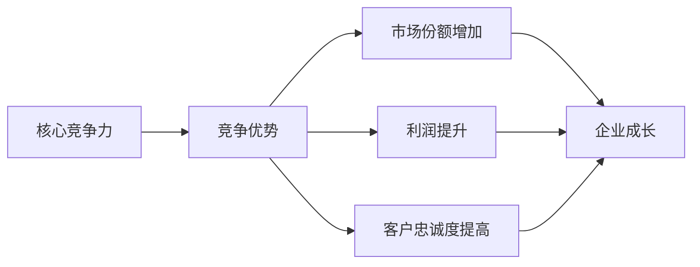
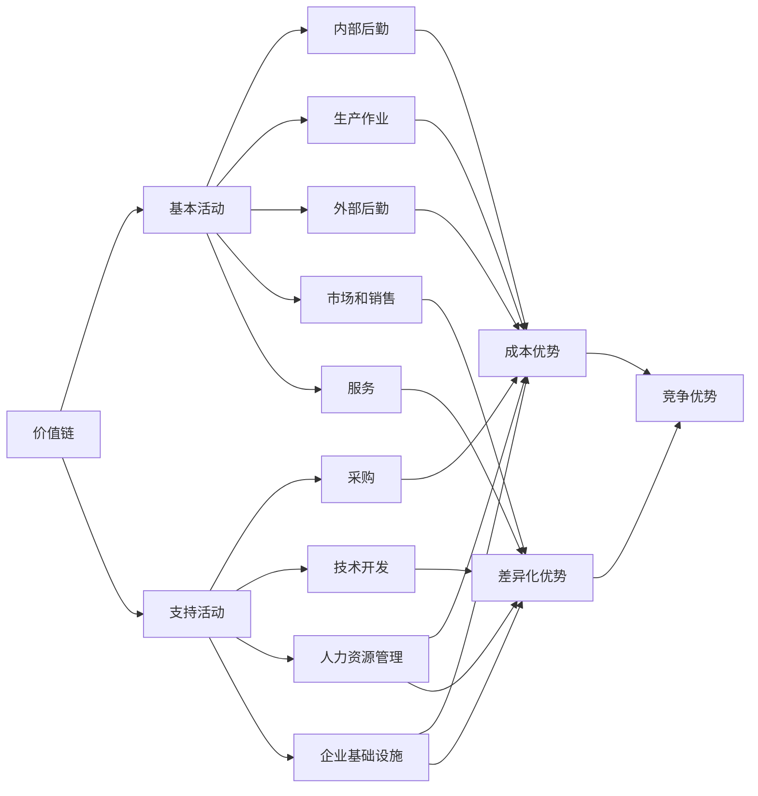

# 如何识别企业的竞争优势

> 关键词：企业竞争优势、识别方法、核心竞争力、价值链分析、市场定位

> 摘要：在当今竞争激烈的商业环境中，识别企业的竞争优势对于企业的生存与发展至关重要。本文旨在深入探讨如何识别企业的竞争优势，通过对相关核心概念的阐述、分析方法的介绍、数学模型的解读以及实际案例的剖析，帮助读者全面了解企业竞争优势的来源和识别途径。同时，还提供了相关的工具和资源推荐，最后对未来企业竞争优势的发展趋势与挑战进行了总结与展望。

## 1. 背景介绍 
### 1.1 目的和范围
本文的目的是为企业管理者、投资者、分析师以及对企业竞争优势感兴趣的人士提供一套系统的方法和思路，帮助他们准确识别企业的竞争优势。范围涵盖了各种类型和规模的企业，包括制造业、服务业、科技企业等，同时涉及不同行业的竞争环境和市场特点。

### 1.2 预期读者
预期读者包括企业高管、战略规划人员、市场营销人员、投资者、金融分析师、商学院学生以及对企业战略和竞争分析有兴趣的专业人士。

### 1.3 文档结构概述
本文首先介绍相关的背景信息，包括目的、读者和文档结构。接着阐述核心概念与联系，包括竞争优势的定义、来源和相关理论。然后详细讲解识别企业竞争优势的核心算法原理和具体操作步骤，并通过数学模型和公式进行进一步的分析。之后通过项目实战案例展示如何在实际中应用这些方法。再介绍企业竞争优势的实际应用场景，以及推荐相关的工具和资源。最后总结未来发展趋势与挑战，并提供常见问题解答和扩展阅读参考资料。

### 1.4 术语表
#### 1.4.1 核心术语定义
- **竞争优势**：企业在市场竞争中相对于竞争对手所具有的优势，能够使其在市场中获得更高的市场份额、利润和客户忠诚度。
- **核心竞争力**：企业所特有的、能够支撑企业长期竞争优势的能力，通常表现为独特的技术、品牌、管理等方面的能力。
- **价值链**：企业为客户创造价值的一系列相互关联的活动，包括研发、生产、营销、销售和售后服务等环节。

#### 1.4.2 相关概念解释
- **可持续竞争优势**：指企业的竞争优势能够在较长时间内持续存在，不易被竞争对手模仿和超越。
- **差异化竞争优势**：企业通过提供与竞争对手不同的产品或服务，满足客户的特殊需求，从而获得竞争优势。
- **成本领先竞争优势**：企业通过降低成本，以低于竞争对手的价格提供产品或服务，从而获得竞争优势。

#### 1.4.3 缩略词列表
- **SWOT**：Strengths（优势）、Weaknesses（劣势）、Opportunities（机会）、Threats（威胁）的缩写，是一种常用的战略分析工具。
- **VRIO**：Value（价值）、Rarity（稀缺性）、Imitability（难以模仿性）、Organization（组织支持）的缩写，是一种用于评估企业资源和能力的框架。

## 2. 核心概念与联系 
### 2.1 竞争优势的定义与来源
竞争优势是企业在市场中脱颖而出的关键因素。从定义上讲，竞争优势是指企业在特定市场环境中，能够比竞争对手更有效地满足客户需求，从而获得更高的市场份额和利润的能力。

竞争优势的来源主要包括以下几个方面：
- **资源优势**：企业拥有的独特资源，如优质的原材料、先进的设备、高素质的人才等，这些资源可以为企业提供成本优势或差异化优势。
- **能力优势**：企业在研发、生产、营销、管理等方面的能力，如强大的研发能力可以使企业推出更具创新性的产品，高效的生产能力可以降低成本。
- **市场优势**：企业在市场中的地位和声誉，如品牌知名度、客户忠诚度等，这些优势可以使企业在市场竞争中更容易获得客户的认可和选择。

### 2.2 核心竞争力与竞争优势的关系
核心竞争力是企业竞争优势的重要支撑。核心竞争力是企业所特有的、能够支撑企业长期竞争优势的能力。它具有价值性、稀缺性、难以模仿性和组织支持性等特点。

核心竞争力与竞争优势的关系可以用以下示意图表示：



核心竞争力通过影响企业的竞争优势，进而促进企业的成长和发展。例如，苹果公司的核心竞争力在于其强大的研发能力和品牌影响力，这使得苹果公司在智能手机市场中具有显著的竞争优势，从而获得了高额的利润和高客户忠诚度，推动了企业的不断发展。

### 2.3 价值链与竞争优势
价值链是企业为客户创造价值的一系列相互关联的活动。迈克尔·波特提出的价值链理论认为，企业的价值创造过程可以分为基本活动和支持活动。基本活动包括内部后勤、生产作业、外部后勤、市场和销售、服务等环节；支持活动包括采购、技术开发、人力资源管理、企业基础设施等环节。

企业的竞争优势可以通过优化价值链上的各个环节来实现。例如，通过提高生产作业环节的效率可以降低成本，通过加强市场和销售环节的能力可以提高产品的市场占有率。价值链与竞争优势的关系可以用以下示意图表示：



通过对价值链的分析，企业可以找出自己在各个环节的优势和劣势，从而有针对性地进行改进和优化，提升企业的竞争优势。

## 3. 核心算法原理 & 具体操作步骤 
### 3.1 SWOT分析算法原理与步骤
SWOT分析是一种常用的战略分析工具，用于评估企业的优势、劣势、机会和威胁。

#### 3.1.1 算法原理
SWOT分析的原理是通过对企业内部环境（优势和劣势）和外部环境（机会和威胁）的分析，帮助企业制定战略。优势和劣势是企业内部的因素，机会和威胁是企业外部的因素。通过对这些因素的综合分析，企业可以明确自己的竞争地位，制定相应的战略。

#### 3.1.2 具体操作步骤
以下是使用Python实现简单的SWOT分析数据整理和输出的代码示例：

```python
# 定义企业的优势、劣势、机会和威胁
strengths = ["强大的研发能力", "优质的产品质量", "良好的品牌形象"]
weaknesses = ["市场渠道较窄", "成本控制能力有待提高", "创新速度有时较慢"]
opportunities = ["新兴市场的增长", "技术创新带来的机遇", "消费者需求的变化"]
threats = ["竞争对手的压力", "经济环境的不确定性", "政策法规的变化"]

# 输出SWOT分析结果
print("SWOT分析结果：")
print("优势（Strengths）：")
for strength in strengths:
    print("- " + strength)
print("劣势（Weaknesses）：")
for weakness in weaknesses:
    print("- " + weakness)
print("机会（Opportunities）：")
for opportunity in opportunities:
    print("- " + opportunity)
print("威胁（Threats）：")
for threat in threats:
    print("- " + threat)
```

在实际操作中，首先要对企业的内部和外部环境进行全面的调研和分析，收集相关的数据和信息。然后将这些信息整理到优势、劣势、机会和威胁四个类别中。最后根据SWOT分析的结果，制定相应的战略，如利用优势抓住机会（SO战略）、克服劣势抓住机会（WO战略）、利用优势应对威胁（ST战略）、减少劣势避免威胁（WT战略）。

### 3.2 VRIO分析算法原理与步骤
VRIO分析是一种用于评估企业资源和能力的框架，通过对资源和能力的价值性、稀缺性、难以模仿性和组织支持性进行分析，判断其是否能够为企业带来竞争优势。

#### 3.2.1 算法原理
VRIO分析的原理是基于资源基础理论，认为企业的竞争优势来源于其独特的资源和能力。通过对资源和能力的四个维度进行评估，可以判断其是否具有价值、是否稀缺、是否难以模仿以及企业是否具备相应的组织支持，从而确定其是否能够为企业带来持续的竞争优势。

#### 3.2.2 具体操作步骤
以下是使用Python实现简单的VRIO分析数据整理和评估的代码示例：

```python
# 定义企业的资源和能力
resources = ["先进的生产设备", "优秀的研发团队", "独特的企业文化"]

# 定义评估函数
def vrio_analysis(resource):
    value = input(f"请评估 {resource} 的价值性（高/中/低）：")
    rarity = input(f"请评估 {resource} 的稀缺性（高/中/低）：")
    imitability = input(f"请评估 {resource} 的难以模仿性（高/中/低）：")
    organization = input(f"请评估企业对 {resource} 的组织支持（高/中/低）：")
    if value == "高" and rarity == "高" and imitability == "高" and organization == "高":
        result = "可持续竞争优势"
    elif value == "高" and rarity == "高" and imitability == "高" and organization != "高":
        result = "未充分利用的竞争优势"
    elif value == "高" and rarity == "高" and imitability != "高":
        result = "暂时竞争优势"
    else:
        result = "没有竞争优势"
    return result

# 进行VRIO分析
for resource in resources:
    print(f"{resource} 的VRIO分析结果：{vrio_analysis(resource)}")
```

在实际操作中，首先要确定企业的关键资源和能力。然后对每个资源和能力的价值性、稀缺性、难以模仿性和组织支持性进行评估。最后根据评估结果判断该资源和能力是否能够为企业带来竞争优势以及竞争优势的可持续性。

## 4. 数学模型和公式 & 详细讲解 & 举例说明 
### 4.1 市场份额模型
市场份额是衡量企业竞争优势的一个重要指标。市场份额可以用以下公式表示：

$$
\text{市场份额} = \frac{\text{企业的销售额}}{\text{市场总销售额}} \times 100\%
$$

#### 4.1.1 详细讲解
市场份额反映了企业在市场中的地位和竞争力。市场份额越高，说明企业在市场中的影响力越大，竞争优势越明显。市场份额的变化可以反映企业竞争优势的动态变化。如果企业的市场份额不断上升，说明企业的竞争优势在增强；反之，如果市场份额不断下降，说明企业的竞争优势在减弱。

#### 4.1.2 举例说明
假设某市场的总销售额为1000万元，企业A的销售额为200万元，企业B的销售额为300万元。则企业A的市场份额为：

$$
\text{企业A的市场份额} = \frac{200}{1000} \times 100\% = 20\%
$$

企业B的市场份额为：

$$
\text{企业B的市场份额} = \frac{300}{1000} \times 100\% = 30\%
$$

从市场份额来看，企业B的竞争优势相对企业A更强。

### 4.2 成本领先模型
成本领先是企业获得竞争优势的一种重要策略。成本领先模型可以用以下公式表示：

$$
\text{成本优势} = \text{竞争对手的平均成本} - \text{企业的成本}
$$

#### 4.2.1 详细讲解
成本优势反映了企业在成本方面相对于竞争对手的优势。成本优势越大，说明企业在成本控制方面做得越好，越能够以较低的价格提供产品或服务，从而获得竞争优势。企业可以通过优化生产流程、降低原材料采购成本、提高生产效率等方式来降低成本，提高成本优势。

#### 4.2.2 举例说明
假设某行业的竞争对手平均成本为每件产品100元，企业C的成本为每件产品80元。则企业C的成本优势为：

$$
\text{企业C的成本优势} = 100 - 80 = 20 \text{（元/件）}
$$

企业C可以利用这20元的成本优势，降低产品价格，吸引更多的客户，从而提高市场份额。

### 4.3 差异化价值模型
差异化是企业获得竞争优势的另一种重要策略。差异化价值模型可以用以下公式表示：

$$
\text{差异化价值} = \text{客户愿意为差异化产品支付的溢价} - \text{实现差异化的成本}
$$

#### 4.2.1 详细讲解
差异化价值反映了企业通过提供差异化产品或服务所获得的额外价值。如果差异化价值大于零，说明企业的差异化策略是有效的，能够为企业带来竞争优势。企业可以通过研发创新、品牌建设、优质服务等方式来实现产品或服务的差异化。

#### 4.2.2 举例说明
假设客户愿意为企业D的差异化产品支付的溢价为每件产品30元，企业D实现差异化的成本为每件产品20元。则企业D的差异化价值为：

$$
\text{企业D的差异化价值} = 30 - 20 = 10 \text{（元/件）}
$$

企业D可以利用这10元的差异化价值，提高产品的利润，增强企业的竞争优势。

## 5. 项目实战：代码实际案例和详细解释说明 
### 5.1  开发环境搭建
在进行企业竞争优势分析的项目实战中，我们可以使用Python作为开发语言，以下是开发环境的搭建步骤：

#### 5.1.1 安装Python
首先，从Python官方网站（https://www.python.org/downloads/）下载并安装Python 3.x版本。安装过程中选择“Add Python to PATH”选项，以便在命令行中可以直接使用Python。

#### 5.1.2 安装必要的库
我们需要安装一些必要的Python库，如pandas、numpy等，用于数据处理和分析。可以使用以下命令进行安装：

```sh
pip install pandas numpy
```

### 5.2  源代码详细实现和代码解读
以下是一个使用Python实现的综合企业竞争优势分析的代码示例：

```python
import pandas as pd
import numpy as np

# 定义企业数据类
class EnterpriseData:
    def __init__(self, name, sales, cost, market_total_sales, competitor_avg_cost, differentiation_premium, differentiation_cost):
        self.name = name
        self.sales = sales
        self.cost = cost
        self.market_total_sales = market_total_sales
        self.competitor_avg_cost = competitor_avg_cost
        self.differentiation_premium = differentiation_premium
        self.differentiation_cost = differentiation_cost

    # 计算市场份额
    def calculate_market_share(self):
        return (self.sales / self.market_total_sales) * 100

    # 计算成本优势
    def calculate_cost_advantage(self):
        return self.competitor_avg_cost - self.cost

    # 计算差异化价值
    def calculate_differentiation_value(self):
        return self.differentiation_premium - self.differentiation_cost

# 定义企业列表
enterprises = [
    EnterpriseData("企业A", 200, 80, 1000, 100, 30, 20),
    EnterpriseData("企业B", 300, 90, 1000, 100, 25, 15)
]

# 创建数据框
data = []
for enterprise in enterprises:
    market_share = enterprise.calculate_market_share()
    cost_advantage = enterprise.calculate_cost_advantage()
    differentiation_value = enterprise.calculate_differentiation_value()
    data.append([enterprise.name, market_share, cost_advantage, differentiation_value])

df = pd.DataFrame(data, columns=["企业名称", "市场份额（%）", "成本优势（元）", "差异化价值（元）"])

# 输出结果
print(df)
```

### 5.3  代码解读与分析
- **EnterpriseData类**：定义了企业数据类，包含企业的名称、销售额、成本、市场总销售额、竞争对手平均成本、差异化溢价和差异化成本等属性。同时，该类还包含了计算市场份额、成本优势和差异化价值的方法。
- **企业列表**：创建了一个包含多个企业数据对象的列表，用于存储不同企业的相关数据。
- **数据处理**：通过遍历企业列表，调用每个企业数据对象的计算方法，计算出市场份额、成本优势和差异化价值，并将结果存储在一个列表中。
- **数据框创建**：使用pandas库的DataFrame函数将计算结果转换为数据框，方便进行数据展示和分析。
- **结果输出**：使用print函数输出数据框，展示每个企业的市场份额、成本优势和差异化价值。

通过这个代码示例，我们可以对不同企业的竞争优势进行量化分析，比较各个企业在市场份额、成本和差异化方面的表现，从而识别出企业的竞争优势。

## 6. 实际应用场景 
### 6.1 企业战略规划
在企业战略规划过程中，识别企业的竞争优势是制定战略的基础。通过对企业竞争优势的分析，企业可以明确自己的核心竞争力所在，从而制定出符合自身实际情况的战略。例如，如果企业具有成本领先的竞争优势，可以选择以低价策略扩大市场份额；如果企业具有差异化的竞争优势，可以选择聚焦高端市场，提高产品的附加值。

### 6.2 投资决策
投资者在进行投资决策时，需要评估企业的竞争优势。具有强大竞争优势的企业通常具有更高的盈利能力和成长潜力，投资风险相对较低。投资者可以通过分析企业的市场份额、成本结构、品牌影响力等因素，识别企业的竞争优势，从而做出更明智的投资决策。

### 6.3 市场竞争分析
企业在参与市场竞争时，需要了解竞争对手的竞争优势。通过对竞争对手竞争优势的分析，企业可以找出自己的差距和不足，制定相应的竞争策略。例如，如果竞争对手具有技术创新的竞争优势，企业可以加大研发投入，提高自身的技术水平；如果竞争对手具有品牌优势，企业可以加强品牌建设，提升品牌知名度和美誉度。

### 6.4 企业并购重组
在企业并购重组过程中，识别目标企业的竞争优势是非常重要的。目标企业的竞争优势可以为并购方带来协同效应，提升并购后的企业竞争力。例如，并购方可以利用目标企业的技术优势、市场渠道优势等，实现资源共享和优势互补，提高企业的整体竞争力。

## 7. 工具和资源推荐
### 7.1 学习资源推荐
#### 7.1.1 书籍推荐
- 《竞争战略》（迈克尔·波特著）：该书是战略管理领域的经典著作，系统地阐述了企业竞争战略的基本理论和方法，对识别企业竞争优势具有重要的指导意义。
- 《基业长青》（詹姆斯·柯林斯、杰里·波勒斯著）：通过对多家优秀企业的研究，揭示了企业长期保持竞争优势的秘诀，为企业管理者提供了宝贵的经验和启示。
- 《创新者的窘境》（克莱顿·克里斯坦森著）：探讨了企业在面临技术创新和市场变革时如何保持竞争优势，对企业的战略决策具有重要的参考价值。

#### 7.1.2 在线课程
- Coursera平台上的“Strategic Management Specialization”：该课程由知名商学院的教授授课，系统地讲解了企业战略管理的理论和实践，包括如何识别企业的竞争优势。
- edX平台上的“Business Strategy”：该课程深入探讨了企业战略的制定和实施，通过案例分析和互动讨论，帮助学员掌握识别企业竞争优势的方法。

#### 7.1.3 技术博客和网站
- 哈佛商业评论（https://hbr.org/）：提供了大量关于企业管理、战略规划、市场营销等方面的文章和研究报告，其中不乏关于企业竞争优势的深入分析和探讨。
- 麦肯锡季刊（https://www.mckinsey.com/）：全球著名的管理咨询公司麦肯锡发布的季刊，包含了许多关于企业战略、竞争优势、数字化转型等方面的前沿研究和实践案例。

### 7.2 开发工具框架推荐
#### 7.2.1 IDE和编辑器
- PyCharm：一款专业的Python集成开发环境，具有代码编辑、调试、版本控制等功能，适合进行企业竞争优势分析的Python代码开发。
- Jupyter Notebook：一种交互式的开发环境，支持Python、R等多种编程语言，方便进行数据处理、分析和可视化，适合对企业竞争优势数据进行探索性分析。

#### 7.2.2 调试和性能分析工具
- pdb：Python内置的调试工具，可以帮助开发者在代码中设置断点，逐步执行代码，查找和解决问题。
- cProfile：Python的性能分析工具，可以分析代码的执行时间和资源消耗情况，帮助开发者优化代码性能。

#### 7.2.3 相关框架和库
- pandas：用于数据处理和分析的Python库，提供了高效的数据结构和数据操作方法，方便对企业竞争优势数据进行清洗、整理和分析。
- numpy：用于科学计算的Python库，提供了高效的数组和矩阵运算功能，在企业竞争优势分析中可以用于数值计算和模型构建。
- matplotlib：用于数据可视化的Python库，可以将企业竞争优势数据以图表的形式展示出来，直观地呈现数据的特征和趋势。

### 7.3 相关论文著作推荐
#### 7.3.1 经典论文
- “The Competitive Advantage of Nations”（Michael Porter）：该论文提出了国家竞争优势理论，对企业竞争优势的研究具有重要的理论基础和启示作用。
- “Resource-Based View of the Firm”（Jay Barney）：该论文阐述了资源基础理论，认为企业的竞争优势来源于其独特的资源和能力，为识别企业竞争优势提供了重要的理论框架。

#### 7.3.2 最新研究成果
- 关注《Strategic Management Journal》、《Academy of Management Journal》等顶级管理学期刊，这些期刊会发表关于企业竞争优势的最新研究成果和前沿理论。

#### 7.3.3 应用案例分析
- 可以参考一些知名企业的案例分析报告，如苹果公司、亚马逊公司、华为公司等，了解这些企业在不同阶段是如何识别和提升自身竞争优势的，从中汲取经验和教训。

## 8. 总结：未来发展趋势与挑战
### 8.1 未来发展趋势
- **数字化转型**：随着信息技术的快速发展，企业的数字化转型将成为未来发展的趋势。数字化技术可以帮助企业优化业务流程、提高生产效率、创新商业模式，从而提升企业的竞争优势。例如，通过大数据分析可以更好地了解客户需求，提供个性化的产品和服务；通过人工智能技术可以实现自动化生产和智能决策。
- **绿色可持续发展**：消费者对环境保护和可持续发展的关注度不断提高，企业的绿色可持续发展将成为竞争优势的重要来源。企业可以通过采用环保材料、降低能源消耗、推广绿色产品等方式，满足消费者的需求，提升企业的社会形象和品牌价值。
- **跨界融合**：不同行业之间的界限越来越模糊，跨界融合将成为未来企业发展的重要趋势。企业可以通过与其他行业的企业合作，整合资源，实现优势互补，创造新的竞争优势。例如，科技企业与传统制造业的融合可以推动智能制造的发展。

### 8.2 挑战
- **技术创新压力**：技术的快速发展要求企业不断进行技术创新，以保持竞争优势。然而，技术创新需要大量的资金、人才和时间投入，对于一些中小企业来说，面临着较大的压力。
- **市场竞争加剧**：随着全球化的发展和市场的开放，企业面临的市场竞争越来越激烈。竞争对手的不断涌现和竞争手段的不断升级，给企业的竞争优势带来了挑战。企业需要不断提升自身的核心竞争力，才能在激烈的市场竞争中立于不败之地。
- **人才短缺**：在数字化转型和技术创新的背景下，企业对高素质的人才需求越来越大。然而，目前市场上相关领域的人才短缺，企业面临着人才招聘和培养的困难。人才的短缺将影响企业的创新能力和竞争优势的提升。

## 9. 附录：常见问题与解答
### 9.1 如何确定企业的核心竞争力？
确定企业的核心竞争力需要综合考虑多个因素。首先，可以从企业的资源和能力入手，分析企业在研发、生产、营销、管理等方面的优势。其次，可以通过市场调研了解客户对企业产品和服务的评价，找出企业的独特价值所在。此外，还可以参考同行业的竞争对手，分析企业与竞争对手的差异，找出企业的竞争优势。最后，通过对企业历史数据的分析和未来发展趋势的预测，判断企业的核心竞争力是否具有可持续性。

### 9.2 竞争优势和核心竞争力有什么区别？
竞争优势是企业在市场竞争中相对于竞争对手所具有的优势，是一种外在的表现。而核心竞争力是企业所特有的、能够支撑企业长期竞争优势的能力，是一种内在的能力。竞争优势可以通过多种方式获得，如成本领先、差异化等；而核心竞争力通常是企业长期积累和培育的结果，具有价值性、稀缺性、难以模仿性和组织支持性等特点。核心竞争力是企业竞争优势的重要支撑，企业的竞争优势是核心竞争力的外在体现。

### 9.3 如何提升企业的竞争优势？
提升企业的竞争优势可以从多个方面入手。首先，要加强企业的核心竞争力建设，通过加大研发投入、培养高素质人才、优化管理流程等方式，提升企业在技术、品牌、管理等方面的能力。其次，要关注市场需求的变化，不断创新产品和服务，满足客户的个性化需求，实现差异化竞争。此外，还可以通过降低成本、提高生产效率等方式，实现成本领先。最后，要加强企业的战略管理，制定合理的发展战略，把握市场机遇，应对市场挑战。

## 10. 扩展阅读 & 参考资料
### 10.1 扩展阅读
- 《蓝海战略》（W. Chan Kim、Renée Mauborgne著）：该书提出了蓝海战略的概念，为企业开拓新市场、创造新的竞争优势提供了新的思路和方法。
- 《从优秀到卓越》（吉姆·柯林斯著）：通过对多家优秀企业的研究，揭示了企业从优秀到卓越的转变过程和关键因素，对企业提升竞争优势具有重要的启示作用。

### 10.2 参考资料
- 迈克尔·波特. 竞争战略[M]. 华夏出版社, 2005.
- 詹姆斯·柯林斯, 杰里·波勒斯. 基业长青[M]. 中信出版社, 2009.
- 克莱顿·克里斯坦森. 创新者的窘境[M]. 中信出版社, 2010.