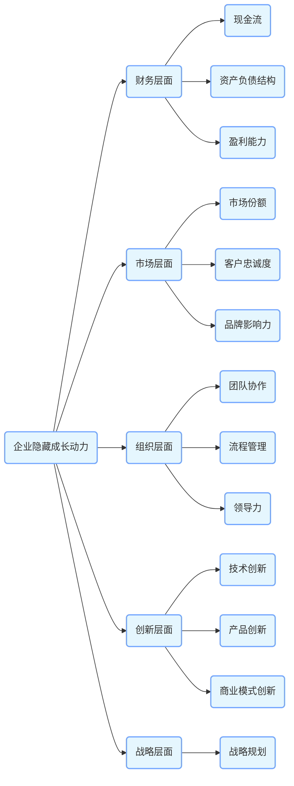

# 如何识别企业的隐藏成长动力

> 关键词：企业成长动力、隐藏动力识别、财务分析、市场洞察、组织能力、创新能力、战略规划

> 摘要：在竞争激烈且复杂多变的商业环境中，企业的成长动力并非都显而易见。识别企业的隐藏成长动力对于投资者、管理者以及其他利益相关者来说至关重要。本文旨在深入探讨如何全面、系统地识别企业的隐藏成长动力，涵盖从财务、市场、组织、创新等多个维度的分析方法和技术，通过实际案例和理论结合的方式，为读者提供具有可操作性的指导和有深度的见解，助力相关人员准确把握企业的潜在发展能力。

## 1. 背景介绍 
### 1.1 目的和范围
本文章的主要目的是帮助读者掌握识别企业隐藏成长动力的方法和技巧。我们将涵盖多个领域和层面，包括企业的财务状况、市场表现、内部组织能力、创新能力以及战略规划等，全面剖析可能隐藏在企业内部的成长动力因素。通过对这些因素的深入分析，读者可以更准确地评估企业的未来发展潜力，为投资决策、企业管理等提供有力支持。

### 1.2 预期读者
本文预期读者包括投资者、企业管理者、财务分析师、市场研究人员以及对企业成长和发展感兴趣的相关人士。对于投资者来说，了解企业的隐藏成长动力有助于他们发现潜在的优质投资标的；企业管理者可以借助这些方法来审视自身企业的优势和不足，从而制定更有效的发展战略；财务分析师和市场研究人员则可以将这些方法应用于专业的研究和分析工作中。

### 1.3 文档结构概述
本文将按照以下结构展开：首先介绍核心概念与联系，阐述与企业隐藏成长动力相关的关键概念及其相互关系；接着详细讲解核心算法原理和具体操作步骤，通过 Python 代码示例展示如何运用数据分析方法来挖掘隐藏成长动力；然后介绍相关的数学模型和公式，并结合具体例子进行说明；之后通过项目实战，给出代码实际案例并进行详细解释；再探讨实际应用场景，说明识别隐藏成长动力在不同场景下的应用；随后推荐相关的工具和资源，包括学习资源、开发工具框架以及相关论文著作；最后总结未来发展趋势与挑战，提供常见问题与解答以及扩展阅读和参考资料。

### 1.4 术语表
#### 1.4.1 核心术语定义
- **隐藏成长动力**：指企业中那些不易被直接观察到，但对企业的长期发展和成长具有重要推动作用的因素。这些因素可能存在于企业的各个层面，如财务、技术、管理、市场等。
- **财务弹性**：企业在面临不确定性和突发情况时，能够及时调整财务策略，获取资金并保持财务稳定的能力。
- **组织能力**：企业内部组织和协调各种资源，实现企业目标的能力，包括团队协作、流程管理、领导力等方面。
- **创新能力**：企业创造新的产品、服务、技术或商业模式的能力，是推动企业持续发展的重要动力。

#### 1.4.2 相关概念解释
- **可持续竞争优势**：企业在市场中相对于竞争对手所具有的长期、稳定的优势，能够为企业带来持续的利润和成长。隐藏成长动力往往是形成可持续竞争优势的关键因素。
- **战略规划**：企业根据自身的愿景、使命和目标，制定的长期发展计划和行动方案。战略规划能够引导企业充分发挥隐藏成长动力，实现可持续发展。

#### 1.4.3 缩略词列表
- **ROE**：净资产收益率（Return on Equity），衡量企业盈利能力的重要指标。
- **EPS**：每股收益（Earnings Per Share），反映企业每股普通股的盈利水平。
- **R&D**：研究与开发（Research and Development），与企业的创新能力密切相关。

## 2. 核心概念与联系 

### 核心概念原理
企业的隐藏成长动力是一个复杂的系统，涉及多个方面的因素。从财务角度来看，企业的现金流状况、资产负债结构、盈利能力等都可能隐藏着成长的潜力。例如，健康的现金流可以为企业的扩张和创新提供资金支持；合理的资产负债结构可以降低企业的财务风险，增强企业的财务弹性。

从市场角度来看，企业的市场份额、客户忠诚度、品牌影响力等都是重要的成长动力来源。拥有较高市场份额的企业往往具有更强的定价能力和规模经济效应；客户忠诚度高的企业可以获得稳定的收入来源，并通过口碑传播吸引新客户。

在组织能力方面，高效的团队协作、良好的流程管理和优秀的领导力能够提高企业的运营效率，促进企业的创新和发展。一个具有创新文化的企业更容易激发员工的创造力，推出新的产品和服务。

创新能力是企业持续成长的关键。通过不断地进行技术创新、产品创新和商业模式创新，企业可以开拓新的市场，满足客户的新需求，从而实现快速增长。

战略规划则是将这些隐藏成长动力整合起来的关键环节。合理的战略规划能够引导企业充分发挥自身的优势，抓住市场机会，实现可持续发展。

### 架构的文本示意图
企业隐藏成长动力的架构可以用以下文本示意图表示：

| 层面 | 因素 | 作用 |
| ---- | ---- | ---- |
| 财务层面 | 现金流、资产负债结构、盈利能力 | 提供资金支持，降低财务风险，保障企业稳定发展 |
| 市场层面 | 市场份额、客户忠诚度、品牌影响力 | 增强市场竞争力，获取稳定收入 |
| 组织层面 | 团队协作、流程管理、领导力 | 提高运营效率，促进创新发展 |
| 创新层面 | 技术创新、产品创新、商业模式创新 | 开拓新市场，满足新需求 |
| 战略层面 | 战略规划 | 整合资源，引导企业实现可持续发展 |

### Mermaid 流程图


## 3. 核心算法原理 & 具体操作步骤 

### 核心算法原理
在识别企业的隐藏成长动力时，我们可以运用数据分析的方法，通过对企业的各种数据进行挖掘和分析，找出潜在的成长因素。例如，我们可以使用回归分析来研究企业的财务指标与企业成长之间的关系，使用聚类分析来对企业的客户群体进行分类，找出具有不同需求和行为特征的客户群体，从而为企业的市场策略提供依据。

### 具体操作步骤
1. **数据收集**：收集企业的财务数据、市场数据、客户数据、运营数据等多方面的数据。这些数据可以来自企业的财务报表、市场调研机构、客户关系管理系统等。
2. **数据清洗**：对收集到的数据进行清洗，去除重复数据、错误数据和缺失数据，确保数据的准确性和完整性。
3. **特征选择**：从清洗后的数据中选择与企业隐藏成长动力相关的特征。例如，在财务数据中，可以选择净资产收益率、每股收益、现金流等特征；在市场数据中，可以选择市场份额、客户满意度等特征。
4. **模型构建**：根据选择的特征，构建相应的数据分析模型。例如，可以使用线性回归模型来研究财务指标与企业成长之间的关系，使用 K-Means 聚类算法来对客户群体进行分类。
5. **模型训练与评估**：使用训练数据对模型进行训练，并使用测试数据对模型进行评估，调整模型的参数，提高模型的准确性和可靠性。
6. **结果分析**：对模型的输出结果进行分析，找出潜在的隐藏成长动力因素，并对这些因素进行深入研究和分析。

### Python 源代码示例
以下是一个使用 Python 进行线性回归分析的示例，研究企业的净资产收益率（ROE）与企业成长（以营业收入增长率表示）之间的关系：

```python
import pandas as pd
from sklearn.linear_model import LinearRegression
from sklearn.model_selection import train_test_split
from sklearn.metrics import mean_squared_error

# 读取数据
data = pd.read_csv('enterprise_data.csv')

# 选择特征和目标变量
X = data[['ROE']]
y = data['Revenue_Growth_Rate']

# 划分训练集和测试集
X_train, X_test, y_train, y_test = train_test_split(X, y, test_size=0.2, random_state=42)

# 构建线性回归模型
model = LinearRegression()

# 训练模型
model.fit(X_train, y_train)

# 预测
y_pred = model.predict(X_test)

# 评估模型
mse = mean_squared_error(y_test, y_pred)
print(f"Mean Squared Error: {mse}")

# 输出模型系数
print(f"Coefficient: {model.coef_[0]}")
print(f"Intercept: {model.intercept_}")
```

在这个示例中，我们首先读取了企业的数据，然后选择了净资产收益率（ROE）作为特征，营业收入增长率作为目标变量。接着，我们将数据划分为训练集和测试集，构建了线性回归模型，并使用训练集对模型进行训练。最后，我们使用测试集对模型进行评估，输出了均方误差、模型系数和截距。

## 4. 数学模型和公式 & 详细讲解 & 举例说明 

### 线性回归模型
线性回归是一种广泛应用的统计分析方法，用于研究自变量与因变量之间的线性关系。其数学模型可以表示为：

$$y = \beta_0 + \beta_1x_1 + \beta_2x_2 + \cdots + \beta_nx_n + \epsilon$$

其中，$y$ 是因变量，$x_1, x_2, \cdots, x_n$ 是自变量，$\beta_0, \beta_1, \beta_2, \cdots, \beta_n$ 是回归系数，$\epsilon$ 是误差项。

在上述的 Python 代码示例中，我们使用了一元线性回归模型，即只有一个自变量（净资产收益率 ROE），其数学模型可以简化为：

$$y = \beta_0 + \beta_1x + \epsilon$$

其中，$y$ 是营业收入增长率，$x$ 是净资产收益率，$\beta_0$ 是截距，$\beta_1$ 是斜率。

### 详细讲解
线性回归的目标是通过最小化误差项的平方和来估计回归系数 $\beta_0, \beta_1, \cdots, \beta_n$。误差项的平方和可以表示为：

$$S(\beta_0, \beta_1, \cdots, \beta_n) = \sum_{i=1}^{m}(y_i - \hat{y}_i)^2$$

其中，$m$ 是样本数量，$y_i$ 是实际观测值，$\hat{y}_i$ 是预测值。

通过最小化 $S(\beta_0, \beta_1, \cdots, \beta_n)$，可以得到回归系数的最优估计值。在 Python 中，`sklearn.linear_model.LinearRegression` 类使用最小二乘法来估计回归系数。

### 举例说明
假设我们有以下一组数据：

| 净资产收益率（ROE） | 营业收入增长率 |
| ---- | ---- |
| 0.1 | 0.05 |
| 0.2 | 0.1 |
| 0.3 | 0.15 |
| 0.4 | 0.2 |
| 0.5 | 0.25 |

我们可以使用上述的线性回归模型来研究净资产收益率与营业收入增长率之间的关系。通过计算，我们可以得到回归系数 $\beta_0 = 0$，$\beta_1 = 0.5$，即营业收入增长率 $y$ 与净资产收益率 $x$ 之间的关系可以表示为 $y = 0.5x$。这意味着净资产收益率每增加 1%，营业收入增长率将增加 0.5%。

## 5. 项目实战：代码实际案例和详细解释说明 

### 5.1  开发环境搭建
为了实现上述的代码示例，我们需要搭建以下开发环境：
1. **Python 环境**：建议使用 Python 3.7 及以上版本。可以从 Python 官方网站（https://www.python.org/downloads/）下载并安装 Python。
2. **开发工具**：可以使用 PyCharm、Jupyter Notebook 等开发工具。PyCharm 是一款功能强大的 Python 集成开发环境（IDE），适合开发大型项目；Jupyter Notebook 则更适合进行数据分析和实验，具有交互式的编程环境。
3. **相关库**：需要安装 `pandas`、`sklearn` 等库。可以使用以下命令进行安装：
```sh
pip install pandas scikit-learn
```

### 5.2  源代码详细实现和代码解读
以下是一个完整的 Python 代码示例，用于识别企业的隐藏成长动力，包括数据收集、数据清洗、特征选择、模型构建、模型训练与评估等步骤：

```python
import pandas as pd
from sklearn.linear_model import LinearRegression
from sklearn.model_selection import train_test_split
from sklearn.metrics import mean_squared_error
from sklearn.preprocessing import StandardScaler

# 数据收集
data = pd.read_csv('enterprise_data.csv')

# 数据清洗
data = data.dropna()  # 去除缺失值
data = data.drop_duplicates()  # 去除重复值

# 特征选择
features = ['ROE', 'EPS', 'Cash_Flow']  # 选择财务特征
target = 'Revenue_Growth_Rate'  # 目标变量

X = data[features]
y = data[target]

# 数据标准化
scaler = StandardScaler()
X_scaled = scaler.fit_transform(X)

# 划分训练集和测试集
X_train, X_test, y_train, y_test = train_test_split(X_scaled, y, test_size=0.2, random_state=42)

# 构建线性回归模型
model = LinearRegression()

# 训练模型
model.fit(X_train, y_train)

# 预测
y_pred = model.predict(X_test)

# 评估模型
mse = mean_squared_error(y_test, y_pred)
print(f"Mean Squared Error: {mse}")

# 输出模型系数
print(f"Coefficients: {model.coef_}")
print(f"Intercept: {model.intercept_}")
```

### 代码解读与分析
1. **数据收集**：使用 `pandas` 库的 `read_csv` 函数读取企业的数据文件 `enterprise_data.csv`。
2. **数据清洗**：使用 `dropna` 函数去除数据中的缺失值，使用 `drop_duplicates` 函数去除重复值，确保数据的准确性和完整性。
3. **特征选择**：选择了净资产收益率（ROE）、每股收益（EPS）和现金流（Cash_Flow）作为特征，营业收入增长率作为目标变量。
4. **数据标准化**：使用 `StandardScaler` 类对特征数据进行标准化处理，将特征数据转换为均值为 0，标准差为 1 的数据，有助于提高模型的训练效果。
5. **划分训练集和测试集**：使用 `train_test_split` 函数将数据划分为训练集和测试集，测试集占总数据的 20%。
6. **模型构建**：使用 `LinearRegression` 类构建线性回归模型。
7. **模型训练**：使用训练集对模型进行训练。
8. **预测**：使用训练好的模型对测试集进行预测。
9. **评估模型**：使用 `mean_squared_error` 函数计算预测值与实际值之间的均方误差，评估模型的性能。
10. **输出模型系数**：输出模型的系数和截距，用于分析特征与目标变量之间的关系。

## 6. 实际应用场景 
### 投资决策
对于投资者来说，识别企业的隐藏成长动力可以帮助他们发现潜在的优质投资标的。通过对企业的财务、市场、组织、创新等方面的分析，投资者可以评估企业的未来发展潜力，选择具有较高成长潜力的企业进行投资。例如，如果一家企业具有良好的现金流、高客户忠诚度、强大的创新能力和合理的战略规划，那么它很可能具有较高的成长潜力，值得投资者关注。

### 企业战略规划
企业管理者可以运用识别隐藏成长动力的方法来审视自身企业的优势和不足，从而制定更有效的发展战略。通过分析企业的财务状况，管理者可以确定企业的资金需求和融资策略；通过了解市场需求和竞争态势，管理者可以制定针对性的市场策略；通过评估企业的组织能力和创新能力，管理者可以采取措施提高企业的运营效率和创新能力。例如，如果企业发现自身在技术创新方面存在不足，那么可以加大研发投入，吸引优秀的技术人才，提高企业的创新能力。

### 风险管理
识别企业的隐藏成长动力也有助于企业进行风险管理。通过对企业的各种潜在风险因素进行分析，企业可以提前采取措施进行防范和应对。例如，如果企业发现自身的资产负债结构不合理，财务风险较高，那么可以采取措施调整资产负债结构，降低财务风险。

### 合作伙伴选择
在选择合作伙伴时，企业可以通过识别对方企业的隐藏成长动力来评估其合作价值。如果对方企业具有较强的成长动力，那么与它合作可能会带来更多的机会和利益。例如，一家科技企业在选择供应商时，可以考虑供应商的创新能力和技术实力，选择具有较高成长潜力的供应商，以确保自身的供应链稳定和创新能力提升。

## 7. 工具和资源推荐
### 7.1 学习资源推荐
#### 7.1.1 书籍推荐
- 《财务报表分析与证券定价》：这本书详细介绍了财务报表分析的方法和技巧，以及如何运用财务报表分析来评估企业的价值和成长潜力。
- 《创新者的窘境》：探讨了企业在创新过程中面临的挑战和机遇，提供了关于如何保持企业创新能力和成长动力的深刻见解。
- 《竞争战略》：作者迈克尔·波特提出了著名的竞争战略理论，对于企业理解市场竞争态势和制定战略规划具有重要的指导意义。

#### 7.1.2 在线课程
- Coursera 平台上的“财务分析基础”课程：该课程由知名大学的教授授课，系统地介绍了财务分析的基本概念、方法和工具。
- edX 平台上的“创新管理与创业”课程：提供了关于创新管理和创业的理论和实践知识，帮助学习者了解如何激发企业的创新能力和成长动力。
- Udemy 平台上的“数据分析实战”课程：通过实际案例，讲解了数据分析的方法和技巧，对于运用数据分析来识别企业隐藏成长动力具有重要的参考价值。

#### 7.1.3 技术博客和网站
- 雪球网：一个专注于投资和财经领域的社区，提供了大量的企业分析和研究报告，对于投资者了解企业的隐藏成长动力具有重要的参考价值。
- 36氪：关注新经济领域的创业和创新，提供了关于新兴企业的最新动态和分析，有助于了解创新型企业的成长动力。
- 艾瑞网：专注于互联网和新经济领域的研究和咨询，提供了关于市场趋势、行业动态等方面的信息，对于企业管理者制定战略规划具有重要的参考价值。

### 7.2 开发工具框架推荐
#### 7.2.1 IDE和编辑器
- PyCharm：一款功能强大的 Python 集成开发环境（IDE），提供了代码编辑、调试、版本控制等一系列功能，适合开发大型的数据分析和机器学习项目。
- Jupyter Notebook：一个交互式的编程环境，适合进行数据分析和实验。它支持多种编程语言，如 Python、R 等，方便用户进行数据探索和可视化。
- Visual Studio Code：一款轻量级的代码编辑器，具有丰富的插件和扩展功能，支持多种编程语言。它可以与 Python 解释器和相关库集成，提供良好的开发体验。

#### 7.2.2 调试和性能分析工具
- `pdb`：Python 内置的调试器，可以帮助开发者逐行调试代码，查找代码中的错误和问题。
- `cProfile`：Python 标准库中的性能分析工具，可以分析代码的执行时间和函数调用情况，帮助开发者找出代码中的性能瓶颈。
- `Py-Spy`：一个跨平台的 Python 性能分析工具，可以实时分析 Python 程序的性能，无需修改代码。

#### 7.2.3 相关框架和库
- `pandas`：一个强大的数据处理和分析库，提供了数据结构（如 DataFrame 和 Series）和数据操作方法，方便用户进行数据清洗、转换和分析。
- `scikit-learn`：一个常用的机器学习库，提供了各种机器学习算法和工具，如分类、回归、聚类等，方便用户构建和训练机器学习模型。
- `matplotlib`：一个用于数据可视化的库，提供了各种绘图函数和工具，方便用户将数据分析结果以直观的图表形式展示出来。

### 7.3 相关论文著作推荐
#### 7.3.1 经典论文
- “Firm Resources and Sustained Competitive Advantage”（《企业资源与持续竞争优势》）：该论文提出了资源基础理论，强调企业的资源和能力是形成持续竞争优势的关键因素，对于理解企业的隐藏成长动力具有重要的理论意义。
- “The Innovator's Dilemma: When New Technologies Cause Great Firms to Fail”（《创新者的窘境：当新技术导致大企业失败》）：探讨了企业在面对新技术和市场变化时所面临的挑战和困境，为企业如何保持创新能力和成长动力提供了重要的启示。

#### 7.3.2 最新研究成果
- 近年来，关于企业成长动力的研究不断涌现，涉及到人工智能、大数据、区块链等新兴技术在企业成长中的应用。例如，一些研究探讨了如何利用人工智能技术分析企业的财务数据和市场数据，挖掘企业的隐藏成长动力；另一些研究关注区块链技术如何提高企业的供应链效率和创新能力。

#### 7.3.3 应用案例分析
- 许多商业杂志和研究机构会发布企业成长的应用案例分析，这些案例可以帮助读者更好地理解如何识别企业的隐藏成长动力，并将相关方法应用到实际中。例如，哈佛商业评论会定期发布一些知名企业的案例研究，分析它们的成长历程和成功经验。

## 8. 总结：未来发展趋势与挑战
### 未来发展趋势
1. **数字化转型加速**：随着信息技术的不断发展，企业的数字化转型将加速。通过数字化技术，企业可以更高效地收集、分析和利用数据，挖掘隐藏成长动力。例如，企业可以利用大数据分析客户的行为和需求，优化产品和服务；利用人工智能技术进行财务预测和风险评估。
2. **创新驱动发展**：创新将成为企业未来发展的核心动力。企业将更加注重技术创新、产品创新和商业模式创新，以满足不断变化的市场需求。同时，创新生态系统将不断完善，企业之间的合作与竞争将更加激烈。
3. **可持续发展成为主流**：在全球气候变化和资源短缺的背景下，可持续发展将成为企业未来发展的主流趋势。企业将更加注重环境保护、社会责任和公司治理，通过可持续发展战略来提升企业的竞争力和成长动力。

### 挑战
1. **数据安全与隐私问题**：在数字化转型过程中，企业需要处理大量的敏感数据，数据安全和隐私问题将成为企业面临的重要挑战。企业需要加强数据安全管理，采取有效的技术和管理措施来保护数据的安全和隐私。
2. **创新难度加大**：随着科技的不断进步，创新的难度也在不断加大。企业需要投入更多的资源和精力来进行研发和创新，同时需要面对技术更新换代快、市场竞争激烈等挑战。
3. **人才短缺**：识别企业的隐藏成长动力需要具备跨领域的知识和技能，如财务分析、市场调研、数据分析、创新管理等。目前，市场上具备这些综合能力的人才相对短缺，企业需要加强人才培养和引进，提高自身的人才素质。

## 9. 附录：常见问题与解答
### 问题 1：如何确定哪些因素是企业的隐藏成长动力？
答：确定企业的隐藏成长动力需要综合考虑多个方面的因素，包括财务、市场、组织、创新等。可以通过数据分析、市场调研、行业研究等方法来挖掘潜在的成长因素。同时，还需要结合企业的战略规划和发展目标，判断哪些因素对企业的长期发展具有重要的推动作用。

### 问题 2：识别企业的隐藏成长动力需要多长时间？
答：识别企业的隐藏成长动力所需的时间取决于多个因素，如数据的获取难度、分析方法的复杂程度、企业的规模和业务复杂度等。一般来说，对于简单的企业，可能需要几天到几周的时间；对于复杂的大型企业，可能需要几个月甚至更长的时间。

### 问题 3：如何验证识别出的隐藏成长动力是否有效？
答：可以通过以下方法来验证识别出的隐藏成长动力是否有效：1. 观察企业的实际发展情况，看是否与预测的成长趋势相符；2. 进行敏感性分析，分析隐藏成长动力因素的变化对企业业绩的影响；3. 与同行业的其他企业进行比较，看该企业在这些因素方面是否具有优势。

### 问题 4：识别企业的隐藏成长动力是否需要专业的知识和技能？
答：识别企业的隐藏成长动力需要一定的专业知识和技能，如财务分析、市场调研、数据分析、创新管理等。但是，对于一些简单的分析方法，非专业人士也可以通过学习和实践来掌握。同时，也可以借助专业的咨询机构和工具来进行分析。

## 10. 扩展阅读 & 参考资料
### 扩展阅读
- 《从0到1：开启商业与未来的秘密》：作者彼得·蒂尔分享了他对创业和创新的深刻见解，对于理解企业的创新和成长动力具有重要的启示。
- 《精益创业》：介绍了精益创业的方法和理念，帮助企业快速验证商业模式，提高创新效率和成功率。
- 《基业长青：企业永续经营的准则》：研究了世界上一些优秀企业的成功经验，探讨了企业如何实现长期的可持续发展。

### 参考资料
1. 相关企业的财务报表和年度报告
2. 市场调研机构发布的行业研究报告
3. 学术期刊上发表的关于企业成长动力的研究论文
4. 专业书籍和在线课程中的相关内容