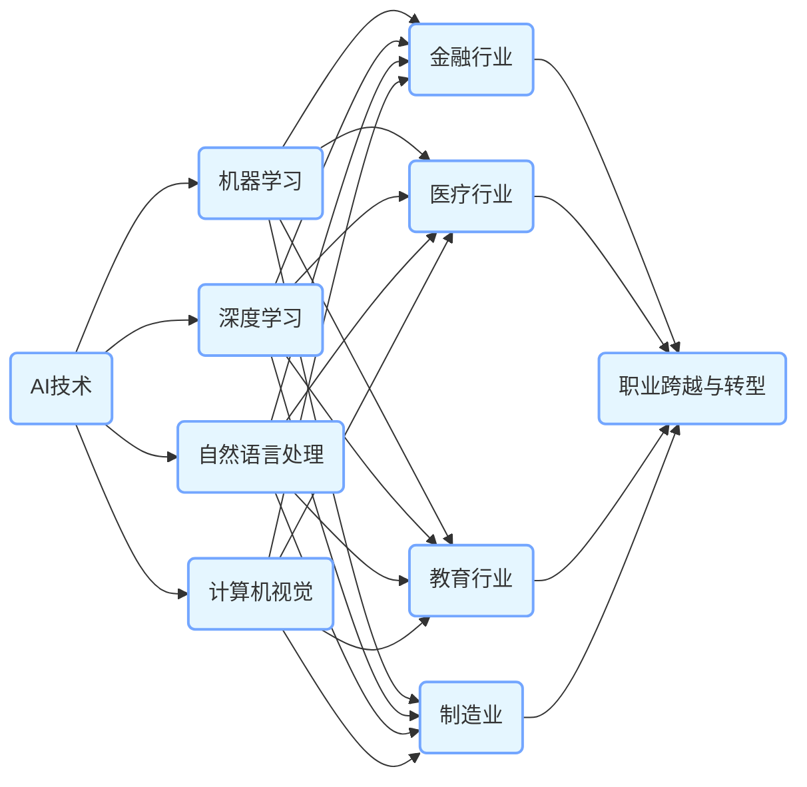

# 如何通过AI技术实现职业的跨越与转型

> 关键词：AI技术、职业跨越、职业转型、技能提升、行业融合

> 摘要：在当今数字化时代，AI技术发展迅猛，深刻地改变了各个行业的格局和就业市场的需求。本文旨在深入探讨如何借助AI技术实现职业的跨越与转型。首先介绍相关背景知识，包括目的、预期读者等；接着阐述AI技术与职业发展的核心概念及联系；详细讲解实现职业跨越与转型的核心算法原理及操作步骤；通过数学模型和公式进行理论分析并举例说明；结合项目实战给出代码案例和解释；探讨实际应用场景；推荐学习、开发等相关工具和资源；最后总结未来发展趋势与挑战，解答常见问题并提供参考资料，为读者提供全面且具有指导意义的职业发展新思路。

## 1. 背景介绍 
### 1.1 目的和范围
本文章的目的在于为面临职业发展瓶颈或希望进入新兴领域的从业者提供全面且具有可操作性的指导，帮助他们借助AI技术实现职业的跨越与转型。范围涵盖了多个行业和不同层次的职业，包括但不限于传统制造业、服务业、金融行业等，以及初级、中级和高级职业阶段的人员。我们将从理论和实践两个层面，深入剖析AI技术在职业发展中的应用和价值，以及如何利用这些技术实现职业目标的转变。

### 1.2 预期读者
预期读者包括对现有职业发展不满意，渴望寻求新机遇的职场人士；即将进入职场，希望提前规划职业方向的高校学生；以及关注行业动态，致力于推动企业数字化转型的企业管理者和决策者。无论您是对AI技术有一定了解，还是刚刚接触这个领域，都能从本文中获得有价值的信息和启发。

### 1.3 文档结构概述
本文将按照以下结构展开：首先介绍背景知识，包括目的、预期读者等；接着阐述AI技术与职业发展的核心概念及联系，通过文本示意图和Mermaid流程图进行直观展示；详细讲解实现职业跨越与转型的核心算法原理及操作步骤，结合Python源代码进行说明；通过数学模型和公式进行理论分析并举例说明；结合项目实战给出代码案例和解释；探讨实际应用场景；推荐学习、开发等相关工具和资源；最后总结未来发展趋势与挑战，解答常见问题并提供参考资料。

### 1.4 术语表
#### 1.4.1 核心术语定义
- **AI技术**：即人工智能技术，是指让计算机模拟人类智能的一系列技术，包括机器学习、深度学习、自然语言处理、计算机视觉等。
- **职业跨越**：指从一个行业或职业领域快速进入到另一个差异较大的行业或职业领域，并取得一定的职业成就。
- **职业转型**：指在原有职业基础上，通过学习新技能、调整职业方向等方式，实现职业的升级或转变。

#### 1.4.2 相关概念解释
- **机器学习**：是一门多领域交叉学科，涉及概率论、统计学、逼近论、凸分析、算法复杂度理论等多门学科。它专门研究计算机怎样模拟或实现人类的学习行为，以获取新的知识或技能，重新组织已有的知识结构使之不断改善自身的性能。
- **深度学习**：是机器学习的一个分支领域，它是一种基于对数据进行表征学习的方法。深度学习通过构建具有很多层的神经网络模型，自动从大量数据中学习到复杂的模式和特征。

#### 1.4.3 缩略词列表
- **ML**：Machine Learning，机器学习
- **DL**：Deep Learning，深度学习
- **NLP**：Natural Language Processing，自然语言处理
- **CV**：Computer Vision，计算机视觉

## 2. 核心概念与联系 
### 核心概念原理
AI技术的核心在于模拟人类的智能行为，通过对大量数据的学习和分析，让计算机能够自动完成一些需要人类智能才能完成的任务。在职业发展中，AI技术可以帮助我们提高工作效率、发现新的职业机会、提升自身的竞争力。

例如，在数据分析领域，机器学习算法可以自动对海量数据进行挖掘和分析，发现数据中的潜在规律和价值，为企业决策提供支持。在客户服务领域，自然语言处理技术可以实现智能客服，自动回答客户的问题，提高客户满意度。

### 架构的文本示意图
AI技术与职业发展的关系可以用以下文本示意图表示：

AI技术包括多个领域，如机器学习、深度学习、自然语言处理、计算机视觉等。这些技术可以应用于不同的行业和职业，如金融、医疗、教育、制造业等。在每个行业中，AI技术可以帮助从业者提高工作效率、提升工作质量、发现新的职业机会。通过学习和掌握AI技术，从业者可以实现职业的跨越与转型，进入到更有发展前景的行业和职业领域。

### Mermaid流程图


## 3. 核心算法原理 & 具体操作步骤 
### 核心算法原理
在利用AI技术实现职业跨越与转型的过程中，机器学习算法起着关键作用。以决策树算法为例，它是一种基于树结构进行决策的算法，每个内部节点是一个属性上的测试，每个分支是一个测试输出，每个叶节点是一个类别或值。

决策树算法的基本思想是通过对数据的学习，构建一棵决策树，使得对于新的数据样本，能够根据决策树的规则进行分类或预测。例如，在职业规划中，我们可以根据个人的技能、经验、兴趣等特征，构建一棵决策树，预测适合个人的职业方向。

### Python源代码详细阐述
```python
from sklearn.datasets import load_iris
from sklearn.model_selection import train_test_split
from sklearn.tree import DecisionTreeClassifier
from sklearn.metrics import accuracy_score

# 加载数据集
iris = load_iris()
X = iris.data
y = iris.target

# 划分训练集和测试集
X_train, X_test, y_train, y_test = train_test_split(X, y, test_size=0.3, random_state=42)

# 创建决策树分类器
clf = DecisionTreeClassifier()

# 训练模型
clf.fit(X_train, y_train)

# 预测
y_pred = clf.predict(X_test)

# 计算准确率
accuracy = accuracy_score(y_test, y_pred)
print(f"Accuracy: {accuracy}")
```
### 具体操作步骤
1. **数据收集**：收集与职业发展相关的数据，如个人的技能、经验、兴趣、行业信息等。
2. **数据预处理**：对收集到的数据进行清洗、转换和归一化等处理，以提高数据的质量和可用性。
3. **特征选择**：从预处理后的数据中选择与职业发展最相关的特征，以减少数据的维度和复杂度。
4. **模型选择**：根据数据的特点和职业发展的需求，选择合适的机器学习模型，如决策树、神经网络、支持向量机等。
5. **模型训练**：使用训练数据对选择的模型进行训练，调整模型的参数，以提高模型的性能。
6. **模型评估**：使用测试数据对训练好的模型进行评估，计算模型的准确率、召回率、F1值等指标，以评估模型的性能。
7. **模型应用**：将训练好的模型应用于实际的职业规划中，根据模型的预测结果，选择适合个人的职业方向。

## 4. 数学模型和公式 & 详细讲解 & 举例说明 
### 决策树算法的数学模型和公式
决策树算法的核心是构建一棵决策树，决策树的构建过程是一个递归的过程，每次选择一个最优的属性进行划分，直到满足停止条件。

决策树的构建过程可以用以下公式表示：
$$
\text{信息增益}(A) = \text{熵}(S) - \sum_{v \in \text{Values}(A)} \frac{|S_v|}{|S|} \text{熵}(S_v)
$$
其中，$S$ 是数据集，$A$ 是属性，$\text{Values}(A)$ 是属性 $A$ 的取值集合，$S_v$ 是属性 $A$ 取值为 $v$ 的数据集。

### 详细讲解
信息增益是决策树算法中用于选择最优属性的指标，它表示在使用属性 $A$ 进行划分后，数据集的不确定性减少的程度。信息增益越大，说明使用属性 $A$ 进行划分后，数据集的不确定性减少得越多，因此属性 $A$ 是一个更好的划分属性。

### 举例说明
假设我们有一个数据集 $S$，包含 10 个样本，其中 6 个样本属于类别 1，4 个样本属于类别 2。我们有两个属性 $A$ 和 $B$，属性 $A$ 有两个取值 $a_1$ 和 $a_2$，属性 $B$ 有三个取值 $b_1$，$b_2$ 和 $b_3$。

首先，计算数据集 $S$ 的熵：
$$
\text{熵}(S) = - \frac{6}{10} \log_2 \frac{6}{10} - \frac{4}{10} \log_2 \frac{4}{10} \approx 0.971
$$
然后，计算使用属性 $A$ 进行划分后的信息增益：
假设 $S_{a_1}$ 包含 4 个样本，其中 3 个样本属于类别 1，1 个样本属于类别 2；$S_{a_2}$ 包含 6 个样本，其中 3 个样本属于类别 1，3 个样本属于类别 2。
$$
\text{熵}(S_{a_1}) = - \frac{3}{4} \log_2 \frac{3}{4} - \frac{1}{4} \log_2 \frac{1}{4} \approx 0.811
$$
$$
\text{熵}(S_{a_2}) = - \frac{3}{6} \log_2 \frac{3}{6} - \frac{3}{6} \log_2 \frac{3}{6} = 1
$$
$$
\text{信息增益}(A) = 0.971 - (\frac{4}{10} \times 0.811 + \frac{6}{10} \times 1) \approx 0.126
$$
接着，计算使用属性 $B$ 进行划分后的信息增益：
假设 $S_{b_1}$ 包含 3 个样本，其中 2 个样本属于类别 1，1 个样本属于类别 2；$S_{b_2}$ 包含 4 个样本，其中 2 个样本属于类别 1，2 个样本属于类别 2；$S_{b_3}$ 包含 3 个样本，其中 2 个样本属于类别 1，1 个样本属于类别 2。
$$
\text{熵}(S_{b_1}) = - \frac{2}{3} \log_2 \frac{2}{3} - \frac{1}{3} \log_2 \frac{1}{3} \approx 0.918
$$
$$
\text{熵}(S_{b_2}) = - \frac{2}{4} \log_2 \frac{2}{4} - \frac{2}{4} \log_2 \frac{2}{4} = 1
$$
$$
\text{熵}(S_{b_3}) = - \frac{2}{3} \log_2 \frac{2}{3} - \frac{1}{3} \log_2 \frac{1}{3} \approx 0.918
$$
$$
\text{信息增益}(B) = 0.971 - (\frac{3}{10} \times 0.918 + \frac{4}{10} \times 1 + \frac{3}{10} \times 0.918) \approx 0.077
$$
由于 $\text{信息增益}(A) > \text{信息增益}(B)$，因此选择属性 $A$ 作为划分属性。

## 5. 项目实战：代码实际案例和详细解释说明 
### 5.1  开发环境搭建
1. **安装Python**：从Python官方网站（https://www.python.org/downloads/）下载并安装Python 3.x版本。
2. **安装必要的库**：使用pip命令安装必要的库，如`scikit-learn`、`pandas`、`numpy`等。
```bash
pip install scikit-learn pandas numpy
```
3. **选择开发工具**：可以选择使用PyCharm、Jupyter Notebook等开发工具。

### 5.2  源代码详细实现和代码解读
以下是一个使用机器学习算法进行职业推荐的代码示例：
```python
import pandas as pd
from sklearn.model_selection import train_test_split
from sklearn.ensemble import RandomForestClassifier
from sklearn.metrics import accuracy_score

# 加载数据集
data = pd.read_csv('career_data.csv')

# 划分特征和标签
X = data.drop('career', axis=1)
y = data['career']

# 划分训练集和测试集
X_train, X_test, y_train, y_test = train_test_split(X, y, test_size=0.3, random_state=42)

# 创建随机森林分类器
clf = RandomForestClassifier()

# 训练模型
clf.fit(X_train, y_train)

# 预测
y_pred = clf.predict(X_test)

# 计算准确率
accuracy = accuracy_score(y_test, y_pred)
print(f"Accuracy: {accuracy}")

# 对新数据进行预测
new_data = pd.DataFrame({
    'skill1': [80],
    'skill2': [70],
    'skill3': [60]
})
new_pred = clf.predict(new_data)
print(f"Predicted career: {new_pred[0]}")
```
### 代码解读与分析
1. **数据加载**：使用`pandas`库的`read_csv`函数加载数据集。
2. **特征和标签划分**：将数据集划分为特征矩阵 $X$ 和标签向量 $y$。
3. **训练集和测试集划分**：使用`train_test_split`函数将数据集划分为训练集和测试集。
4. **模型创建**：使用`RandomForestClassifier`创建随机森林分类器。
5. **模型训练**：使用`fit`方法对模型进行训练。
6. **模型预测**：使用`predict`方法对测试集和新数据进行预测。
7. **准确率计算**：使用`accuracy_score`函数计算模型的准确率。

## 6. 实际应用场景 
### 传统制造业
在传统制造业中，AI技术可以帮助企业实现智能化生产，提高生产效率和质量。例如，通过计算机视觉技术，可以实现对产品质量的自动检测，减少人工检测的误差和成本；通过机器学习算法，可以对生产过程进行优化，提高设备的利用率和生产效率。对于传统制造业的从业者来说，可以通过学习AI技术，转型为智能制造工程师、数据分析师等新兴职业。

### 服务业
在服务业中，AI技术可以帮助企业提高服务质量和效率。例如，在客户服务领域，自然语言处理技术可以实现智能客服，自动回答客户的问题，提高客户满意度；在物流领域，机器学习算法可以对物流路径进行优化，提高物流效率。对于服务业的从业者来说，可以通过学习AI技术，转型为智能客服专员、物流优化分析师等新兴职业。

### 金融行业
在金融行业中，AI技术可以帮助企业进行风险评估、投资决策等。例如，通过机器学习算法，可以对客户的信用风险进行评估，提高贷款审批的效率和准确性；通过深度学习算法，可以对股票市场进行预测，为投资者提供决策支持。对于金融行业的从业者来说，可以通过学习AI技术，转型为金融数据分析师、量化投资分析师等新兴职业。

## 7. 工具和资源推荐
### 7.1 学习资源推荐
#### 7.1.1 书籍推荐
- 《Python机器学习》：这本书详细介绍了Python在机器学习领域的应用，包括数据预处理、模型选择、模型评估等方面的内容。
- 《深度学习》：这本书是深度学习领域的经典著作，由深度学习领域的三位先驱Ian Goodfellow、Yoshua Bengio和Aaron Courville合著，全面介绍了深度学习的理论和实践。
- 《人工智能：一种现代的方法》：这本书是人工智能领域的经典教材，全面介绍了人工智能的各个方面，包括搜索算法、知识表示、推理、机器学习、自然语言处理等。

#### 7.1.2 在线课程
- Coursera上的《机器学习》课程：由Andrew Ng教授主讲，是机器学习领域的经典课程，全面介绍了机器学习的基本概念、算法和应用。
- edX上的《深度学习》课程：由麻省理工学院（MIT）的教授主讲，深入介绍了深度学习的理论和实践。
- 中国大学MOOC上的《人工智能基础》课程：由国内知名高校的教授主讲，系统介绍了人工智能的基本概念、算法和应用。

#### 7.1.3 技术博客和网站
- Medium：一个技术博客平台，上面有很多关于AI技术的优秀文章和教程。
- Towards Data Science：一个专注于数据科学和机器学习的技术博客，上面有很多高质量的文章和教程。
- AI开源社区：一个专注于AI技术的开源社区，上面有很多开源的AI项目和代码。

### 7.2 开发工具框架推荐
#### 7.2.1 IDE和编辑器
- PyCharm：一个专业的Python集成开发环境，提供了丰富的功能和工具，方便开发者进行Python开发。
- Jupyter Notebook：一个交互式的开发环境，支持多种编程语言，方便开发者进行数据分析和机器学习实验。
- Visual Studio Code：一个轻量级的代码编辑器，支持多种编程语言，提供了丰富的插件和扩展，方便开发者进行开发。

#### 7.2.2 调试和性能分析工具
- PySnooper：一个简单易用的Python调试工具，可以帮助开发者快速定位代码中的问题。
- TensorBoard：一个用于可视化深度学习模型训练过程的工具，可以帮助开发者分析模型的性能和训练效果。
- cProfile：Python标准库中的一个性能分析工具，可以帮助开发者分析代码的性能瓶颈。

#### 7.2.3 相关框架和库
- TensorFlow：一个开源的机器学习框架，由Google开发，提供了丰富的工具和接口，方便开发者进行深度学习模型的开发和训练。
- PyTorch：一个开源的深度学习框架，由Facebook开发，提供了动态计算图和丰富的工具和接口，方便开发者进行深度学习模型的开发和训练。
- Scikit-learn：一个开源的机器学习库，提供了丰富的机器学习算法和工具，方便开发者进行机器学习模型的开发和训练。

### 7.3 相关论文著作推荐
#### 7.3.1 经典论文
- 《ImageNet Classification with Deep Convolutional Neural Networks》：这篇论文是深度学习领域的经典论文，提出了AlexNet模型，开创了深度学习在计算机视觉领域的应用。
- 《Long Short-Term Memory》：这篇论文是深度学习领域的经典论文，提出了LSTM模型，解决了循环神经网络中的梯度消失和梯度爆炸问题。
- 《Attention Is All You Need》：这篇论文是深度学习领域的经典论文，提出了Transformer模型，开创了自然语言处理领域的新纪元。

#### 7.3.2 最新研究成果
- 《GPT-3: Language Models are Few-Shot Learners》：这篇论文介绍了OpenAI开发的GPT-3模型，展示了语言模型在少样本学习方面的强大能力。
- 《DALL-E 2: Creating Images from Text》：这篇论文介绍了OpenAI开发的DALL-E 2模型，展示了文本生成图像的强大能力。
- 《AlphaFold: Using AI for scientific discovery》：这篇论文介绍了DeepMind开发的AlphaFold模型，展示了人工智能在蛋白质结构预测方面的强大能力。

#### 7.3.3 应用案例分析
- 《AI in Healthcare: Transforming the Future of Medicine》：这篇文章介绍了AI技术在医疗领域的应用案例，包括疾病诊断、药物研发、医疗影像分析等方面。
- 《AI in Finance: Revolutionizing the Financial Industry》：这篇文章介绍了AI技术在金融领域的应用案例，包括风险评估、投资决策、客户服务等方面。
- 《AI in Manufacturing: Driving the Fourth Industrial Revolution》：这篇文章介绍了AI技术在制造业领域的应用案例，包括智能化生产、质量检测、设备维护等方面。

## 8. 总结：未来发展趋势与挑战
### 未来发展趋势
- **AI技术与各行业的深度融合**：未来，AI技术将与更多的行业深度融合，创造出更多的新兴职业和商业模式。例如，在医疗领域，AI技术将用于疾病诊断、药物研发、医疗影像分析等方面；在教育领域，AI技术将用于个性化学习、智能辅导等方面。
- **AI技术的普及和应用**：随着AI技术的不断发展和普及，越来越多的企业和个人将开始使用AI技术来提高工作效率和竞争力。例如，在企业管理中，AI技术将用于数据分析、决策支持等方面；在个人生活中，AI技术将用于智能家居、智能健康管理等方面。
- **AI技术的创新和发展**：未来，AI技术将不断创新和发展，出现更多的新技术和新方法。例如，量子计算、生物计算等新技术将为AI技术的发展带来新的机遇；强化学习、生成对抗网络等新方法将为AI技术的应用带来新的突破。

### 挑战
- **技术挑战**：AI技术的发展还面临着一些技术挑战，如数据隐私和安全、算法可解释性、模型泛化能力等。这些问题需要进一步的研究和解决。
- **人才挑战**：AI技术的发展需要大量的专业人才，包括算法工程师、数据科学家、机器学习工程师等。目前，AI领域的人才短缺问题比较严重，需要加强人才培养和引进。
- **社会挑战**：AI技术的发展还会带来一些社会挑战，如就业结构调整、伦理道德问题等。这些问题需要政府、企业和社会各方共同努力，采取相应的措施来应对。

## 9. 附录：常见问题与解答
### 问题1：学习AI技术需要具备哪些基础知识？
学习AI技术需要具备一定的数学基础，如线性代数、概率论、统计学等；还需要具备一定的编程基础，如Python语言。此外，对机器学习、深度学习等相关概念和算法有一定的了解也是很有必要的。

### 问题2：如何选择适合自己的AI技术学习路径？
可以根据自己的兴趣和职业目标来选择适合自己的AI技术学习路径。如果对计算机视觉感兴趣，可以选择学习相关的算法和框架，如卷积神经网络、OpenCV等；如果对自然语言处理感兴趣，可以选择学习相关的算法和框架，如循环神经网络、Transformer等。同时，可以参考一些优秀的学习资源和课程，制定合理的学习计划。

### 问题3：AI技术在职业转型中的应用有哪些限制？
AI技术在职业转型中的应用也存在一些限制，如数据质量和数量的限制、算法的局限性、技术的复杂性等。此外，职业转型还需要考虑个人的兴趣、能力、经验等因素，不能仅仅依赖于AI技术。

### 问题4：如何评估AI技术对职业发展的影响？
可以从多个方面评估AI技术对职业发展的影响，如工作效率、工作质量、职业竞争力、职业发展前景等。可以通过实际应用和实践，观察和分析AI技术对工作的影响；也可以参考一些相关的研究报告和数据，了解AI技术在不同行业和职业中的应用情况和发展趋势。

## 10. 扩展阅读 & 参考资料
### 扩展阅读
- 《人类简史：从动物到上帝》：这本书从人类的进化和发展的角度，探讨了人类与技术的关系，对理解AI技术的发展和影响有一定的启发。
- 《未来简史：从智人到神人》：这本书对未来人类的发展和命运进行了大胆的预测和想象，对思考AI技术对人类社会的影响有一定的帮助。
- 《生命3.0：人工智能时代的人类进化》：这本书从生命的角度，探讨了AI技术的发展和影响，对理解AI技术的本质和未来有一定的启示。

### 参考资料
- 《Python机器学习实战》，作者：Sebastian Raschka，出版社：机械工业出版社
- 《深度学习入门：基于Python的理论与实现》，作者：斋藤康毅，出版社：人民邮电出版社
- 《人工智能：现代方法（第3版）》，作者：Stuart J. Russell、Peter Norvig，出版社：清华大学出版社
- Coursera官方网站：https://www.coursera.org/
- edX官方网站：https://www.edx.org/
- 中国大学MOOC官方网站：https://www.icourse163.org/
- Medium官方网站：https://medium.com/
- Towards Data Science官方网站：https://towardsdatascience.com/
- AI开源社区官方网站：https://www.aiforall.org/