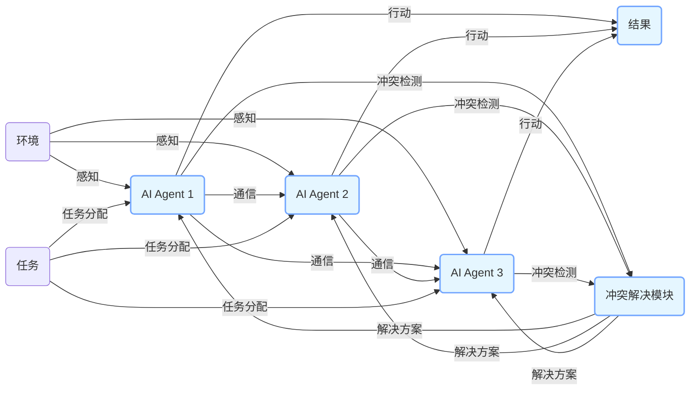

# 实现AI Agent的多Agent协作能力

> 关键词：AI Agent、多Agent协作、智能体通信、协作算法、分布式系统

> 摘要：本文围绕实现AI Agent的多Agent协作能力展开深入探讨。首先介绍了多Agent协作的背景知识，包括目的、预期读者等内容。接着阐述了核心概念与联系，详细讲解了核心算法原理及具体操作步骤，并通过Python代码进行示例。同时给出了相关的数学模型和公式，结合实际例子进行说明。通过项目实战展示了如何搭建开发环境、实现源代码并进行解读分析。探讨了多Agent协作的实际应用场景，推荐了学习、开发工具框架以及相关论文著作等资源。最后总结了未来发展趋势与挑战，提供了常见问题解答及扩展阅读参考资料，旨在为读者全面呈现多Agent协作能力实现的相关知识和技术。

## 1. 背景介绍 
### 1.1 目的和范围
在当今复杂的计算环境和实际应用场景中，单个AI Agent的能力往往存在局限性。实现AI Agent的多Agent协作能力的目的在于整合多个智能体的优势，提高系统的整体性能和智能水平，以应对更加复杂和多样化的任务。本文章的范围涵盖了多Agent协作的基本概念、核心算法、数学模型、实际应用以及相关的开发资源等方面，旨在为读者提供全面而深入的多Agent协作知识体系。

### 1.2 预期读者
本文预期读者包括对人工智能和多Agent系统感兴趣的研究人员、开发者、学生等。对于正在从事相关领域研究的科研人员，本文可提供新的思路和技术参考；对于开发者，可作为实现多Agent协作系统的技术指南；对于学生，则有助于其了解多Agent协作的基础知识和前沿技术。

### 1.3 文档结构概述
本文首先介绍多Agent协作的背景知识，包括目的、预期读者和文档结构等内容。接着阐述核心概念与联系，通过文本示意图和Mermaid流程图进行直观展示。然后详细讲解核心算法原理及具体操作步骤，并给出Python源代码示例。随后介绍数学模型和公式，结合实际例子进行说明。通过项目实战，展示开发环境搭建、源代码实现和代码解读分析。探讨实际应用场景，推荐学习、开发工具框架以及相关论文著作等资源。最后总结未来发展趋势与挑战，提供常见问题解答及扩展阅读参考资料。

### 1.4 术语表
#### 1.4.1 核心术语定义
- **AI Agent（人工智能智能体）**：能够感知环境、进行决策并采取行动的智能实体，具备一定的自主性和智能性。
- **多Agent协作**：多个AI Agent通过相互通信、协调和合作，共同完成一个或多个任务的过程。
- **智能体通信**：AI Agent之间交换信息的过程，是多Agent协作的基础。
- **协作算法**：用于协调多个AI Agent行为的算法，确保它们能够有效地合作完成任务。

#### 1.4.2 相关概念解释
- **分布式系统**：多Agent协作通常在分布式系统中实现，分布式系统由多个独立的计算节点组成，这些节点通过网络进行通信和协作。
- **任务分配**：在多Agent协作中，需要将任务合理地分配给不同的AI Agent，以提高系统的效率和性能。
- **冲突解决**：多个AI Agent在协作过程中可能会产生冲突，需要采用相应的策略来解决这些冲突。

#### 1.4.3 缩略词列表
- **MAS（Multi - Agent System）**：多Agent系统
- **RPC（Remote Procedure Call）**：远程过程调用

## 2. 核心概念与联系 
### 核心概念原理
多Agent协作的核心原理在于多个AI Agent通过通信和协调，共同完成一个或多个任务。每个AI Agent都有自己的感知、决策和行动能力，它们可以根据环境信息和其他智能体的信息进行决策和行动。智能体之间的通信是多Agent协作的关键，通过通信，智能体可以共享信息、协调行动，从而实现协作的目标。

### 架构的文本示意图
多Agent协作系统通常由多个AI Agent、通信模块、任务分配模块和冲突解决模块组成。AI Agent负责感知环境、进行决策和采取行动；通信模块负责智能体之间的信息交换；任务分配模块负责将任务合理地分配给不同的AI Agent；冲突解决模块负责解决智能体之间的冲突。

### Mermaid流程图


该流程图展示了多Agent协作的基本过程。AI Agent从环境中感知信息，通过通信模块进行信息交换，任务分配模块将任务分配给不同的AI Agent，AI Agent采取行动产生结果。同时，冲突解决模块负责检测和解决智能体之间的冲突。

## 3. 核心算法原理 & 具体操作步骤 
### 核心算法原理
在多Agent协作中，常用的算法包括合同网协议、拍卖算法等。这里以合同网协议为例进行介绍。合同网协议是一种基于招标 - 投标 - 中标机制的多Agent协作算法。其基本思想是：当一个智能体有任务需要完成时，它会发布一个招标信息，其他智能体根据自己的能力和资源进行投标，发布招标信息的智能体根据投标信息选择最合适的智能体中标，中标智能体负责完成任务。

### 具体操作步骤
1. **招标阶段**：任务发起智能体（管理者）将任务信息封装成招标信息，并广播给其他智能体（参与者）。
2. **投标阶段**：参与者收到招标信息后，根据自己的能力和资源评估是否能够完成任务，并计算投标信息（如成本、时间等），然后将投标信息发送给管理者。
3. **中标阶段**：管理者收到所有投标信息后，根据一定的评估标准（如最低成本、最短时间等）选择最合适的参与者中标，并将中标信息发送给中标者。
4. **执行阶段**：中标者收到中标信息后，开始执行任务，并在任务执行过程中向管理者汇报任务进展情况。

### Python源代码示例
```python
import random

# 定义智能体类
class Agent:
    def __init__(self, name):
        self.name = name
        self.capability = random.randint(1, 10)  # 随机生成智能体的能力值

    # 接收招标信息并进行投标
    def bid(self, task):
        if self.capability >= task['requirement']:
            cost = random.randint(1, 10)  # 随机生成投标成本
            return {'agent': self.name, 'cost': cost}
        else:
            return None

    # 执行任务
    def execute_task(self, task):
        print(f"{self.name} is executing task {task['id']}")

# 定义任务类
class Task:
    def __init__(self, id, requirement):
        self.id = id
        self.requirement = requirement

# 合同网协议实现
def contract_net_protocol(agents, task):
    # 招标阶段
    print(f"Task {task.id} is being advertised.")
    bids = []
    for agent in agents:
        bid_info = agent.bid(task)
        if bid_info:
            bids.append(bid_info)

    # 中标阶段
    if bids:
        lowest_cost_bid = min(bids, key=lambda x: x['cost'])
        winner_name = lowest_cost_bid['agent']
        winner = next((agent for agent in agents if agent.name == winner_name), None)
        if winner:
            # 执行阶段
            winner.execute_task(task)
    else:
        print("No agent is capable of handling this task.")

# 主程序
if __name__ == "__main__":
    agents = [Agent(f"Agent{i}") for i in range(5)]
    task = Task(1, 5)
    contract_net_protocol(agents, task)
```
在上述代码中，我们定义了`Agent`类和`Task`类，实现了合同网协议的基本流程。`Agent`类包含`bid`方法用于投标和`execute_task`方法用于执行任务，`Task`类表示任务信息。`contract_net_protocol`函数实现了合同网协议的招标、中标和执行阶段。

## 4. 数学模型和公式 & 详细讲解 & 举例说明 
### 数学模型
在多Agent协作中，可以使用博弈论的模型来描述智能体之间的协作和竞争关系。以合同网协议为例，可以将其看作一个不完全信息博弈模型。在这个模型中，每个智能体的策略是投标信息（成本、时间等），收益是中标后获得的奖励减去执行任务的成本。

### 数学公式
设 $A = \{a_1, a_2, \cdots, a_n\}$ 是智能体集合，$T = \{t_1, t_2, \cdots, t_m\}$ 是任务集合。对于每个任务 $t_j \in T$，其需求为 $r_j$。每个智能体 $a_i \in A$ 有自己的能力值 $c_i$ 和投标成本 $b_{ij}$。

- **投标可行性条件**：智能体 $a_i$ 对任务 $t_j$ 投标的可行性条件为 $c_i \geq r_j$。
- **中标决策**：设 $B_j = \{b_{1j}, b_{2j}, \cdots, b_{nj}\}$ 是任务 $t_j$ 的投标成本集合，中标智能体 $a_{k}$ 满足 $b_{kj} = \min(B_j)$。

### 详细讲解
投标可行性条件确保了只有具备足够能力的智能体才能参与投标。中标决策则是选择投标成本最低的智能体作为中标者。在实际应用中，还可以考虑其他因素，如时间、质量等，通过加权求和的方式来综合评估投标信息。

### 举例说明
假设有三个智能体 $A = \{a_1, a_2, a_3\}$，其能力值分别为 $c_1 = 6, c_2 = 4, c_3 = 8$，有一个任务 $t$，其需求为 $r = 5$。智能体 $a_1$ 的投标成本 $b_{1} = 3$，智能体 $a_2$ 由于能力不足不能投标，智能体 $a_3$ 的投标成本 $b_{3} = 2$。根据中标决策，智能体 $a_3$ 中标，因为 $b_{3} = 2 < b_{1} = 3$。

## 5. 项目实战：代码实际案例和详细解释说明 
### 5.1  开发环境搭建
#### 安装Python
首先需要安装Python开发环境，建议使用Python 3.7及以上版本。可以从Python官方网站（https://www.python.org/downloads/）下载并安装。

#### 安装开发工具
推荐使用PyCharm作为开发工具，它是一款功能强大的Python集成开发环境（IDE）。可以从JetBrains官方网站（https://www.jetbrains.com/pycharm/download/）下载并安装。

### 5.2  源代码详细实现和代码解读
以下是一个更完整的多Agent协作的Python代码示例，模拟了一个简单的任务分配和协作过程。

```python
import random

# 定义智能体类
class Agent:
    def __init__(self, name, capability):
        self.name = name
        self.capability = capability
        self.tasks = []  # 智能体当前承担的任务列表

    # 接收招标信息并进行投标
    def bid(self, task):
        if self.capability >= task['requirement']:
            cost = random.randint(1, 10)  # 随机生成投标成本
            time = random.randint(1, 5)  # 随机生成完成任务所需时间
            return {'agent': self.name, 'cost': cost, 'time': time}
        else:
            return None

    # 执行任务
    def execute_task(self, task):
        print(f"{self.name} is executing task {task['id']}")
        self.tasks.append(task)

# 定义任务类
class Task:
    def __init__(self, id, requirement):
        self.id = id
        self.requirement = requirement

# 合同网协议实现
def contract_net_protocol(agents, tasks):
    for task in tasks:
        print(f"Task {task.id} is being advertised.")
        bids = []
        for agent in agents:
            bid_info = agent.bid(task)
            if bid_info:
                bids.append(bid_info)

        # 中标阶段
        if bids:
            # 综合考虑成本和时间进行中标决策
            best_bid = min(bids, key=lambda x: x['cost'] + x['time'])
            winner_name = best_bid['agent']
            winner = next((agent for agent in agents if agent.name == winner_name), None)
            if winner:
                # 执行阶段
                winner.execute_task(task)
        else:
            print(f"No agent is capable of handling task {task.id}.")

# 主程序
if __name__ == "__main__":
    agents = [Agent(f"Agent{i}", random.randint(1, 10)) for i in range(5)]
    tasks = [Task(i, random.randint(1, 8)) for i in range(3)]
    contract_net_protocol(agents, tasks)

    # 输出每个智能体承担的任务
    for agent in agents:
        if agent.tasks:
            task_ids = [task.id for task in agent.tasks]
            print(f"{agent.name} has tasks: {task_ids}")
        else:
            print(f"{agent.name} has no tasks.")
```

### 代码解读与分析
- **智能体类（`Agent`）**：
  - `__init__` 方法：初始化智能体的名称、能力值和当前承担的任务列表。
  - `bid` 方法：根据任务的需求判断智能体是否有能力投标，并随机生成投标成本和完成任务所需时间。
  - `execute_task` 方法：执行任务并将任务添加到智能体的任务列表中。

- **任务类（`Task`）**：
  - `__init__` 方法：初始化任务的ID和需求。

- **合同网协议实现（`contract_net_protocol`）**：
  - 遍历所有任务，对每个任务进行招标、投标和中标操作。
  - 在中标阶段，综合考虑成本和时间进行中标决策，选择最优的投标信息。
  - 如果有合适的中标者，则让中标者执行任务；否则，输出没有智能体能够处理该任务的信息。

- **主程序**：
  - 初始化多个智能体和任务。
  - 调用合同网协议函数进行任务分配和协作。
  - 输出每个智能体承担的任务信息。

## 6. 实际应用场景 
### 智能交通系统
在智能交通系统中，多个智能体可以代表不同的交通参与者，如车辆、交通信号灯等。这些智能体通过协作可以实现交通流量的优化、交通事故的预防等功能。例如，车辆智能体可以实时感知周围的交通状况，并与其他车辆智能体和交通信号灯智能体进行通信，以选择最优的行驶路线和速度。

### 物流配送系统
在物流配送系统中，多个智能体可以代表不同的物流设备和人员，如仓库机器人、运输车辆、快递员等。这些智能体通过协作可以实现货物的高效存储、运输和配送。例如，仓库机器人可以根据订单信息自动将货物从仓库中取出，运输车辆可以根据交通状况和货物需求选择最优的配送路线，快递员可以根据客户的要求进行最后的配送服务。

### 工业制造系统
在工业制造系统中，多个智能体可以代表不同的生产设备和工人。这些智能体通过协作可以实现生产过程的自动化、优化和协调。例如，生产设备智能体可以根据生产计划自动调整生产参数，工人智能体可以根据设备的状态进行维护和操作，从而提高生产效率和产品质量。

### 智能家居系统
在智能家居系统中，多个智能体可以代表不同的家居设备，如灯光、空调、窗帘等。这些智能体通过协作可以实现家居环境的智能化控制。例如，当用户离开家时，智能家居系统可以自动关闭灯光、空调等设备；当用户回家时，系统可以自动打开相应的设备，为用户提供舒适的家居环境。

## 7. 工具和资源推荐
### 7.1 学习资源推荐
#### 7.1.1 书籍推荐
- 《多Agent系统导论》：全面介绍了多Agent系统的基本概念、理论和技术，是学习多Agent系统的经典教材。
- 《人工智能：一种现代的方法》：涵盖了人工智能的各个领域，包括多Agent系统，对多Agent协作的原理和算法有详细的阐述。

#### 7.1.2 在线课程
- Coursera上的“Artificial Intelligence”课程：由知名教授授课，系统地介绍了人工智能的相关知识，包括多Agent系统的内容。
- edX上的“Multi - Agent Systems”课程：专门针对多Agent系统进行讲解，提供了丰富的案例和实践项目。

#### 7.1.3 技术博客和网站
- AI Stack Exchange：一个关于人工智能的问答社区，有很多关于多Agent系统的讨论和解答。
- Medium上的人工智能相关博客：有很多技术专家分享的关于多Agent协作的最新研究成果和实践经验。

### 7.2 开发工具框架推荐
#### 7.2.1 IDE和编辑器
- PyCharm：功能强大的Python集成开发环境，提供了代码编辑、调试、版本控制等功能，适合开发多Agent协作系统。
- Visual Studio Code：轻量级的代码编辑器，支持多种编程语言，有丰富的插件可以扩展功能，也可以用于多Agent系统的开发。

#### 7.2.2 调试和性能分析工具
- PySnooper：一个简单易用的Python调试工具，可以自动记录函数的执行过程和变量的值，方便调试多Agent协作代码。
- cProfile：Python内置的性能分析工具，可以分析代码的执行时间和函数调用情况，帮助优化多Agent系统的性能。

#### 7.2.3 相关框架和库
- Mesa：一个基于Python的多Agent建模和仿真框架，提供了丰富的功能和工具，方便开发者快速搭建多Agent系统。
- JADE（Java Agent DEvelopment Framework）：一个基于Java的多Agent开发框架，支持多种通信协议和协作算法，适用于开发复杂的多Agent系统。

### 7.3 相关论文著作推荐
#### 7.3.1 经典论文
- “Contract Net Protocol: High - Level Communication and Control in a Distributed Problem Solver”：介绍了合同网协议的基本原理和实现方法，是多Agent协作领域的经典论文。
- “Distributed Artificial Intelligence”：对分布式人工智能的概念、理论和技术进行了系统的阐述，对多Agent系统的发展起到了重要的推动作用。

#### 7.3.2 最新研究成果
- 可以通过IEEE Xplore、ACM Digital Library等学术数据库搜索关于多Agent协作的最新研究论文，了解该领域的前沿技术和发展趋势。

#### 7.3.3 应用案例分析
- 可以查阅相关的行业报告和案例分析，了解多Agent协作在智能交通、物流配送、工业制造等领域的实际应用案例和经验教训。

## 8. 总结：未来发展趋势与挑战
### 未来发展趋势
- **与其他技术的融合**：多Agent协作将与区块链、物联网、大数据等技术深度融合，拓展其应用领域和功能。例如，区块链技术可以为多Agent协作提供安全可靠的分布式账本，物联网技术可以为智能体提供更丰富的感知信息，大数据技术可以为智能体的决策提供支持。
- **智能体的自主学习和进化**：未来的智能体将具备更强的自主学习和进化能力，能够根据环境的变化和任务的需求不断调整自己的行为和策略。例如，智能体可以通过强化学习算法不断优化自己的决策过程，提高协作效率。
- **大规模多Agent系统**：随着计算能力的提高和网络技术的发展，将出现大规模的多Agent系统，这些系统可以处理更加复杂和大规模的任务。例如，在智能城市建设中，可以构建一个包含大量智能体的系统，实现城市交通、能源、环境等方面的综合管理。

### 挑战
- **通信和协调问题**：在大规模多Agent系统中，智能体之间的通信和协调将变得更加复杂，需要解决通信延迟、带宽限制、信息一致性等问题。
- **安全和隐私问题**：多Agent协作涉及到大量的信息交换和共享，需要保障信息的安全和隐私。例如，如何防止智能体之间的信息泄露和恶意攻击是一个亟待解决的问题。
- **伦理和法律问题**：随着多Agent系统的广泛应用，将出现一系列伦理和法律问题，如智能体的责任认定、行为规范等。需要建立相应的伦理和法律框架来规范智能体的行为。

## 9. 附录：常见问题与解答
### 问题1：多Agent协作与分布式系统有什么关系？
答：多Agent协作通常在分布式系统中实现，分布式系统为多Agent协作提供了通信和计算的基础。多Agent协作强调智能体之间的协作和交互，而分布式系统更关注系统的分布性和资源共享。

### 问题2：如何选择合适的协作算法？
答：选择合适的协作算法需要考虑任务的性质、智能体的能力和数量、系统的性能要求等因素。例如，对于任务分配问题，可以选择合同网协议、拍卖算法等；对于冲突解决问题，可以选择协商算法、仲裁算法等。

### 问题3：多Agent协作系统的性能如何评估？
答：多Agent协作系统的性能可以从多个方面进行评估，如任务完成时间、任务完成质量、资源利用率、通信开销等。可以根据具体的应用场景和需求选择合适的评估指标。

### 问题4：如何保障多Agent协作系统的安全性？
答：可以采用多种技术手段来保障多Agent协作系统的安全性，如加密技术、身份认证技术、访问控制技术等。同时，需要建立完善的安全管理机制，对系统进行实时监控和维护。

## 10. 扩展阅读 & 参考资料
### 扩展阅读
- 《智能系统中的多Agent理论与应用》：深入探讨了多Agent系统的理论和应用，提供了更多的案例和实践经验。
- 《复杂系统中的多Agent建模与仿真》：介绍了多Agent建模和仿真的方法和技术，有助于读者更好地理解和实现多Agent协作系统。

### 参考资料
- IEEE Transactions on Systems, Man, and Cybernetics: Part A: Systems and Humans
- ACM Transactions on Intelligent Systems and Technology
- 相关的学术会议论文集，如AAMAS（International Conference on Autonomous Agents and Multiagent Systems）等。