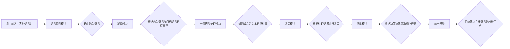

# 实现AI Agent的多语言支持

> 关键词：AI Agent、多语言支持、自然语言处理、翻译技术、国际化、语言模型、本地化

> 摘要：本文围绕实现AI Agent的多语言支持展开深入探讨。首先介绍了实现多语言支持的背景和重要性，包括目的、预期读者等内容。接着阐述了相关核心概念及它们之间的联系，通过文本示意图和Mermaid流程图进行直观展示。详细讲解了实现多语言支持的核心算法原理，并用Python源代码进行说明，同时给出了对应的数学模型和公式。通过项目实战，从开发环境搭建到源代码实现与解读，完整呈现了实现过程。分析了AI Agent多语言支持的实际应用场景，推荐了学习资源、开发工具框架以及相关论文著作。最后总结了未来发展趋势与挑战，并给出常见问题解答和扩展阅读参考资料，旨在为开发者和研究者提供全面的技术指导，推动AI Agent多语言支持技术的发展。

## 1. 背景介绍 
### 1.1 目的和范围
随着全球化的发展，AI Agent在不同国家和地区的应用越来越广泛。实现AI Agent的多语言支持具有重要意义，其目的在于打破语言障碍，让不同语言背景的用户都能顺畅地与AI Agent进行交互，提高AI Agent的通用性和可用性。

本文章的范围涵盖了实现AI Agent多语言支持的各个方面，包括核心概念的阐述、算法原理的分析、实际项目的实现步骤、应用场景的探讨以及相关资源的推荐等。通过全面的介绍，帮助读者深入理解和掌握实现AI Agent多语言支持的技术和方法。

### 1.2 预期读者
本文预期读者主要包括以下几类人群：
- **AI开发者**：希望深入了解和掌握实现AI Agent多语言支持技术的专业开发者，他们可以从本文中获取详细的技术实现细节和实践经验。
- **研究人员**：从事自然语言处理、人工智能等相关领域研究的人员，通过本文可以了解该领域的最新发展动态和技术趋势。
- **产品经理**：负责AI Agent产品规划和设计的人员，有助于他们更好地理解多语言支持的重要性和实现方式，从而制定更合理的产品策略。
- **技术爱好者**：对AI Agent和多语言支持技术感兴趣的广大技术爱好者，通过本文可以初步了解相关知识和技术原理。

### 1.3 文档结构概述
本文将按照以下结构进行详细阐述：
- **核心概念与联系**：介绍与AI Agent多语言支持相关的核心概念，包括自然语言处理、翻译技术等，并展示它们之间的联系。
- **核心算法原理 & 具体操作步骤**：详细讲解实现多语言支持的核心算法原理，并用Python源代码进行说明，同时给出具体的操作步骤。
- **数学模型和公式 & 详细讲解 & 举例说明**：介绍实现多语言支持所涉及的数学模型和公式，并进行详细讲解和举例说明。
- **项目实战：代码实际案例和详细解释说明**：通过实际项目案例，从开发环境搭建到源代码实现与解读，详细介绍实现AI Agent多语言支持的具体过程。
- **实际应用场景**：分析AI Agent多语言支持在不同领域的实际应用场景。
- **工具和资源推荐**：推荐学习资源、开发工具框架以及相关论文著作，帮助读者进一步深入学习和研究。
- **总结：未来发展趋势与挑战**：总结AI Agent多语言支持的未来发展趋势和面临的挑战。
- **附录：常见问题与解答**：解答读者在实现AI Agent多语言支持过程中常见的问题。
- **扩展阅读 & 参考资料**：提供相关的扩展阅读材料和参考资料，方便读者进一步深入学习。

### 1.4 术语表
#### 1.4.1 核心术语定义
- **AI Agent**：即人工智能代理，是一种能够感知环境、进行推理和决策，并采取行动以实现特定目标的智能实体。
- **多语言支持**：指系统或应用程序能够处理和支持多种不同语言的能力，包括语言的输入、处理和输出等。
- **自然语言处理（NLP）**：是计算机科学、人工智能和语言学的交叉领域，旨在让计算机能够理解、处理和生成人类语言。
- **机器翻译**：是利用计算机将一种自然语言转换为另一种自然语言的技术。

#### 1.4.2 相关概念解释
- **国际化（i18n）**：是指在设计和开发软件系统时，使其具有能够适应不同语言、文化和地区的能力，而不需要对软件进行大量修改。
- **本地化（l10n）**：是指在国际化的基础上，对软件进行特定语言和地区的定制，包括翻译界面文本、调整日期和时间格式等。

#### 1.4.3 缩略词列表
- **NLP**：Natural Language Processing（自然语言处理）
- **API**：Application Programming Interface（应用程序编程接口）
- **ML**：Machine Learning（机器学习）
- **DL**：Deep Learning（深度学习）

## 2. 核心概念与联系 

### 核心概念原理
#### AI Agent
AI Agent是一个能够自主感知环境、进行推理和决策，并采取行动以实现特定目标的智能实体。它通常由感知模块、决策模块和行动模块组成。感知模块负责收集环境信息，决策模块根据感知到的信息进行推理和决策，行动模块则根据决策结果采取相应的行动。

#### 多语言支持
多语言支持是指系统或应用程序能够处理和支持多种不同语言的能力。实现多语言支持需要解决语言的识别、翻译、处理和输出等问题。

#### 自然语言处理（NLP）
自然语言处理是计算机科学、人工智能和语言学的交叉领域，旨在让计算机能够理解、处理和生成人类语言。NLP技术包括文本分类、情感分析、机器翻译等。

#### 机器翻译
机器翻译是利用计算机将一种自然语言转换为另一种自然语言的技术。常见的机器翻译方法包括基于规则的机器翻译、基于统计的机器翻译和基于神经网络的机器翻译。

### 架构的文本示意图
```plaintext
AI Agent多语言支持架构

用户输入（多种语言）
|
|-- 语言识别模块
|       |
|       |-- 确定输入语言
|
|-- 翻译模块
|       |
|       |-- 根据输入语言和目标语言进行翻译
|
|-- 自然语言处理模块
|       |
|       |-- 对翻译后的文本进行处理，如语义理解、情感分析等
|
|-- 决策模块
|       |
|       |-- 根据处理结果进行决策
|
|-- 行动模块
|       |
|       |-- 根据决策结果采取相应的行动
|
|-- 输出模块
|       |
|       |-- 将结果以目标语言输出给用户
```

### Mermaid流程图


## 3. 核心算法原理 & 具体操作步骤 

### 语言识别算法原理
语言识别的目的是确定输入文本的语言类型。一种常见的语言识别算法是基于字符频率统计的方法。不同的语言具有不同的字符频率分布，通过统计输入文本中字符的频率，并与已知语言的字符频率分布进行比较，可以确定输入文本的语言类型。

以下是一个简单的Python实现：
```python
import collections

# 已知语言的字符频率分布
language_freq = {
    'en': {
        'a': 0.08167, 'b': 0.01492, 'c': 0.02782, 'd': 0.04253, 'e': 0.12702,
        'f': 0.02228, 'g': 0.02015, 'h': 0.06094, 'i': 0.06966, 'j': 0.00153,
        'k': 0.00772, 'l': 0.04025, 'm': 0.02406, 'n': 0.06749, 'o': 0.07507,
        'p': 0.01929, 'q': 0.00095, 'r': 0.05987, 's': 0.06327, 't': 0.09056,
        'u': 0.02758, 'v': 0.00978, 'w': 0.02360, 'x': 0.00150, 'y': 0.01974,
        'z': 0.00074
    },
    'fr': {
        'a': 0.07636, 'b': 0.00901, 'c': 0.03260, 'd': 0.03669, 'e': 0.14715,
        'f': 0.01066, 'g': 0.00866, 'h': 0.00737, 'i': 0.07529, 'j': 0.00613,
        'k': 0.00074, 'l': 0.05456, 'm': 0.02968, 'n': 0.07095, 'o': 0.05796,
        'p': 0.02521, 'q': 0.01362, 'r': 0.06693, 's': 0.07948, 't': 0.07244,
        'u': 0.06311, 'v': 0.01838, 'w': 0.00049, 'x': 0.00427, 'y': 0.00128,
        'z': 0.00326
    }
}

def language_identification(text):
    text = text.lower()
    freq = collections.Counter(text)
    total_chars = sum(freq.values())
    scores = {}
    for lang, lang_freq in language_freq.items():
        score = 0
        for char, char_freq in lang_freq.items():
            if char in freq:
                score += abs(freq[char] / total_chars - char_freq)
        scores[lang] = score
    return min(scores, key=scores.get)

# 示例使用
text = "Hello, how are you?"
print(language_identification(text))
```

### 翻译算法原理
翻译算法的目的是将一种语言的文本转换为另一种语言的文本。基于神经网络的机器翻译（NMT）是目前最先进的翻译技术之一。NMT使用深度学习模型，如Transformer架构，来学习源语言和目标语言之间的映射关系。

以下是一个使用`transformers`库进行翻译的简单Python示例：
```python
from transformers import AutoTokenizer, AutoModelForSeq2SeqLM

# 加载翻译模型和分词器
tokenizer = AutoTokenizer.from_pretrained("Helsinki-NLP/opus-mt-en-fr")
model = AutoModelForSeq2SeqLM.from_pretrained("Helsinki-NLP/opus-mt-en-fr")

def translate(text):
    # 对输入文本进行分词
    input_ids = tokenizer(text, return_tensors="pt").input_ids
    # 生成翻译结果
    outputs = model.generate(input_ids)
    # 将生成的结果解码为文本
    translated_text = tokenizer.decode(outputs[0], skip_special_tokens=True)
    return translated_text

# 示例使用
text = "Hello, how are you?"
print(translate(text))
```

### 具体操作步骤
1. **语言识别**：使用上述语言识别算法对用户输入的文本进行语言识别，确定输入文本的语言类型。
2. **翻译**：根据输入文本的语言类型和目标语言，使用翻译算法将输入文本翻译为目标语言。
3. **自然语言处理**：对翻译后的文本进行自然语言处理，如语义理解、情感分析等。
4. **决策和行动**：根据自然语言处理的结果进行决策，并采取相应的行动。
5. **输出**：将决策结果以目标语言输出给用户。

## 4. 数学模型和公式 & 详细讲解 & 举例说明 

### 语言识别的数学模型和公式
语言识别的数学模型可以基于字符频率统计。设输入文本为 $T$，文本中字符 $c$ 的出现频率为 $f(c)$，已知语言 $L$ 中字符 $c$ 的频率分布为 $p_L(c)$。则输入文本 $T$ 与语言 $L$ 的相似度得分 $S(T, L)$ 可以定义为：

$$S(T, L) = \sum_{c \in \mathcal{C}} |f(c) - p_L(c)|$$

其中 $\mathcal{C}$ 是字符集。语言识别的目标是找到相似度得分最小的语言，即：

$$\hat{L} = \arg\min_{L \in \mathcal{L}} S(T, L)$$

其中 $\mathcal{L}$ 是已知语言的集合。

### 举例说明
假设输入文本 $T = "Hello, how are you?"$，我们要判断它是英语还是法语。

首先，统计输入文本中字符的频率：
| 字符 | 频率 |
|---|---|
| h | 2/17 |
| e | 1/17 |
| l | 2/17 |
| o | 2/17 |
| , | 1/17 |
|  | 3/17 |
| w | 1/17 |
| a | 1/17 |
| r | 1/17 |
| y | 1/17 |
| u | 1/17 |
| ? | 1/17 |

然后，计算输入文本与英语和法语的相似度得分：

对于英语：
$$S(T, en) = |\frac{2}{17} - 0.06094| + |\frac{1}{17} - 0.12702| + \cdots$$

对于法语：
$$S(T, fr) = |\frac{2}{17} - 0.00737| + |\frac{1}{17} - 0.14715| + \cdots$$

比较 $S(T, en)$ 和 $S(T, fr)$ 的大小，得分小的语言即为输入文本的语言类型。

### 翻译的数学模型和公式
基于神经网络的机器翻译（NMT）使用编码器 - 解码器架构。编码器将源语言文本编码为一个固定长度的向量表示，解码器根据这个向量表示生成目标语言文本。

设源语言文本为 $x = (x_1, x_2, \cdots, x_n)$，目标语言文本为 $y = (y_1, y_2, \cdots, y_m)$。NMT 的目标是最大化条件概率 $P(y|x)$。

在 Transformer 架构中，编码器和解码器都由多个多头自注意力层和前馈神经网络层组成。多头自注意力机制可以计算输入序列中不同位置之间的相关性，其计算公式为：

$$\text{Attention}(Q, K, V) = \text{softmax}(\frac{QK^T}{\sqrt{d_k}})V$$

其中 $Q$、$K$、$V$ 分别是查询矩阵、键矩阵和值矩阵，$d_k$ 是键向量的维度。

## 5. 项目实战：代码实际案例和详细解释说明 

### 5.1  开发环境搭建
#### 安装Python
首先，确保你已经安装了Python 3.x 版本。你可以从 [Python官方网站](https://www.python.org/downloads/) 下载并安装适合你操作系统的Python版本。

#### 创建虚拟环境
为了避免不同项目之间的依赖冲突，建议使用虚拟环境。在命令行中执行以下命令创建并激活虚拟环境：
```bash
# 创建虚拟环境
python -m venv myenv

# 激活虚拟环境（Windows）
myenv\Scripts\activate

# 激活虚拟环境（Linux/Mac）
source myenv/bin/activate
```

#### 安装依赖库
在虚拟环境中安装所需的依赖库，包括 `transformers`、`torch` 等：
```bash
pip install transformers torch
```

### 5.2  源代码详细实现和代码解读
以下是一个完整的实现AI Agent多语言支持的Python代码示例：
```python
from transformers import AutoTokenizer, AutoModelForSeq2SeqLM
import collections

# 已知语言的字符频率分布
language_freq = {
    'en': {
        'a': 0.08167, 'b': 0.01492, 'c': 0.02782, 'd': 0.04253, 'e': 0.12702,
        'f': 0.02228, 'g': 0.02015, 'h': 0.06094, 'i': 0.06966, 'j': 0.00153,
        'k': 0.00772, 'l': 0.04025, 'm': 0.02406, 'n': 0.06749, 'o': 0.07507,
        'p': 0.01929, 'q': 0.00095, 'r': 0.05987, 's': 0.06327, 't': 0.09056,
        'u': 0.02758, 'v': 0.00978, 'w': 0.02360, 'x': 0.00150, 'y': 0.01974,
        'z': 0.00074
    },
    'fr': {
        'a': 0.07636, 'b': 0.00901, 'c': 0.03260, 'd': 0.03669, 'e': 0.14715,
        'f': 0.01066, 'g': 0.00866, 'h': 0.00737, 'i': 0.07529, 'j': 0.00613,
        'k': 0.00074, 'l': 0.05456, 'm': 0.02968, 'n': 0.07095, 'o': 0.05796,
        'p': 0.02521, 'q': 0.01362, 'r': 0.06693, 's': 0.07948, 't': 0.07244,
        'u': 0.06311, 'v': 0.01838, 'w': 0.00049, 'x': 0.00427, 'y': 0.00128,
        'z': 0.00326
    }
}

def language_identification(text):
    text = text.lower()
    freq = collections.Counter(text)
    total_chars = sum(freq.values())
    scores = {}
    for lang, lang_freq in language_freq.items():
        score = 0
        for char, char_freq in lang_freq.items():
            if char in freq:
                score += abs(freq[char] / total_chars - char_freq)
        scores[lang] = score
    return min(scores, key=scores.get)

# 加载翻译模型和分词器
tokenizer_en_fr = AutoTokenizer.from_pretrained("Helsinki-NLP/opus-mt-en-fr")
model_en_fr = AutoModelForSeq2SeqLM.from_pretrained("Helsinki-NLP/opus-mt-en-fr")

tokenizer_fr_en = AutoTokenizer.from_pretrained("Helsinki-NLP/opus-mt-fr-en")
model_fr_en = AutoModelForSeq2SeqLM.from_pretrained("Helsinki-NLP/opus-mt-fr-en")

def translate(text, source_lang, target_lang):
    if source_lang == 'en' and target_lang == 'fr':
        input_ids = tokenizer_en_fr(text, return_tensors="pt").input_ids
        outputs = model_en_fr.generate(input_ids)
        translated_text = tokenizer_en_fr.decode(outputs[0], skip_special_tokens=True)
    elif source_lang == 'fr' and target_lang == 'en':
        input_ids = tokenizer_fr_en(text, return_tensors="pt").input_ids
        outputs = model_fr_en.generate(input_ids)
        translated_text = tokenizer_fr_en.decode(outputs[0], skip_special_tokens=True)
    else:
        translated_text = text
    return translated_text

# 模拟AI Agent交互
def ai_agent_interaction(user_input):
    # 语言识别
    source_lang = language_identification(user_input)
    # 假设目标语言为法语
    target_lang = 'fr' if source_lang == 'en' else 'en'
    # 翻译用户输入
    translated_input = translate(user_input, source_lang, target_lang)
    # 简单的回复逻辑
    response = "Your message has been received: " + translated_input
    # 翻译回复
    translated_response = translate(response, target_lang, source_lang)
    return translated_response

# 示例使用
user_input = "Hello, how are you?"
response = ai_agent_interaction(user_input)
print(response)
```

### 5.3  代码解读与分析
- **语言识别部分**：`language_identification` 函数通过统计输入文本中字符的频率，并与已知语言的字符频率分布进行比较，确定输入文本的语言类型。
- **翻译部分**：使用 `transformers` 库加载预训练的翻译模型和分词器，`translate` 函数根据源语言和目标语言进行文本翻译。
- **AI Agent交互部分**：`ai_agent_interaction` 函数模拟了AI Agent的交互过程，包括语言识别、翻译、生成回复和翻译回复等步骤。

## 6. 实际应用场景 
### 智能客服
在智能客服系统中，实现AI Agent的多语言支持可以让不同语言背景的用户都能方便地与客服进行交流。客服系统可以自动识别用户的语言，将用户的问题翻译为客服人员熟悉的语言，同时将客服人员的回复翻译为用户的语言，提高客服效率和用户满意度。

### 跨境电商
在跨境电商平台中，AI Agent的多语言支持可以帮助商家和消费者进行沟通。消费者可以使用自己的母语浏览商品信息、咨询问题，AI Agent可以自动翻译商家的回复，促进交易的顺利进行。

### 教育领域
在在线教育平台中，AI Agent的多语言支持可以为不同语言背景的学生提供个性化的学习服务。学生可以使用自己的母语提问，AI Agent可以将问题翻译为教师的语言，同时将教师的解答翻译为学生的语言，打破语言障碍，提高学习效果。

### 旅游行业
在旅游行业中，AI Agent的多语言支持可以为游客提供便利。游客可以使用自己的母语查询旅游信息、预订酒店和机票等，AI Agent可以自动翻译相关信息，帮助游客更好地规划旅行。

## 7. 工具和资源推荐
### 7.1 学习资源推荐
#### 7.1.1 书籍推荐
- 《自然语言处理入门》：作者何晗，本书系统地介绍了自然语言处理的基本概念、算法和应用，适合初学者入门。
- 《深度学习》：作者Ian Goodfellow、Yoshua Bengio和Aaron Courville，本书是深度学习领域的经典著作，对理解基于神经网络的机器翻译等技术有很大帮助。
- 《Python自然语言处理》：作者Steven Bird、Ewan Klein和Edward Loper，本书介绍了如何使用Python进行自然语言处理，提供了丰富的代码示例。

#### 7.1.2 在线课程
- Coursera上的“Natural Language Processing Specialization”：由斯坦福大学的教授授课，系统地介绍了自然语言处理的各个方面。
- edX上的“Deep Learning Specialization”：由吴恩达教授授课，深入讲解了深度学习的原理和应用，包括机器翻译等技术。
- 中国大学MOOC上的“自然语言处理”：由国内高校的专家授课，结合中文文本处理，介绍自然语言处理的理论和实践。

#### 7.1.3 技术博客和网站
- Hugging Face Blog：提供了关于自然语言处理和机器学习的最新研究成果和技术文章，特别是关于 `transformers` 库的使用和介绍。
- Towards Data Science：是一个数据科学和人工智能领域的博客平台，有很多关于自然语言处理和机器翻译的优质文章。
- ACL Anthology：是计算语言学协会（ACL）的论文库，包含了自然语言处理领域的大量学术论文。

### 7.2 开发工具框架推荐
#### 7.2.1 IDE和编辑器
- PyCharm：是一款专业的Python集成开发环境，提供了丰富的代码编辑、调试和版本控制等功能。
- Visual Studio Code：是一款轻量级的代码编辑器，支持多种编程语言，通过安装Python扩展可以方便地进行Python开发。
- Jupyter Notebook：是一个交互式的开发环境，适合进行数据探索和模型训练，特别适合初学者。

#### 7.2.2 调试和性能分析工具
- PDB：是Python自带的调试器，可以帮助开发者定位代码中的问题。
- TensorBoard：是TensorFlow的可视化工具，可以用于查看模型的训练过程和性能指标。
- Py-Spy：是一个性能分析工具，可以帮助开发者找出代码中的性能瓶颈。

#### 7.2.3 相关框架和库
- Transformers：是Hugging Face开发的一个自然语言处理库，提供了大量预训练的语言模型和工具，方便进行机器翻译、文本分类等任务。
- Torch：是一个深度学习框架，提供了丰富的神经网络层和优化算法，支持GPU加速。
- NLTK：是一个Python自然语言处理库，提供了丰富的语料库和工具，适合进行自然语言处理的基础研究和开发。

### 7.3 相关论文著作推荐
#### 7.3.1 经典论文
- “Attention Is All You Need”：提出了Transformer架构，是基于神经网络的机器翻译领域的经典论文。
- “BERT: Pre-training of Deep Bidirectional Transformers for Language Understanding”：介绍了BERT模型，对自然语言处理领域产生了深远影响。
- “Neural Machine Translation by Jointly Learning to Align and Translate”：提出了基于注意力机制的神经机器翻译模型。

#### 7.3.2 最新研究成果
- 关注ACL、EMNLP等自然语言处理领域的顶级学术会议，了解最新的研究成果和技术趋势。
- 关注arXiv等预印本平台，获取最新的学术论文。

#### 7.3.3 应用案例分析
- 研究一些知名公司的AI Agent多语言支持的应用案例，如谷歌翻译、微软小冰等，了解他们的技术实现和应用经验。

## 8. 总结：未来发展趋势与挑战
### 未来发展趋势
#### 更精准的语言识别和翻译
随着深度学习技术的不断发展，语言识别和翻译的准确率将不断提高。未来的AI Agent将能够更准确地识别各种语言和方言，提供更自然、流畅的翻译结果。

#### 多模态多语言支持
未来的AI Agent将不仅支持文本的多语言处理，还将支持语音、图像等多模态的多语言交互。用户可以通过语音或图像与AI Agent进行交流，AI Agent能够自动识别和处理不同语言的多模态信息。

#### 个性化多语言服务
未来的AI Agent将能够根据用户的语言习惯、文化背景等因素提供个性化的多语言服务。例如，根据用户的历史交互记录，自动调整翻译风格和回复方式，提高用户体验。

### 挑战
#### 语言多样性和复杂性
世界上存在着数千种语言和方言，每种语言都有其独特的语法、词汇和文化背景。实现AI Agent对所有语言的支持是一个巨大的挑战，需要处理语言的多样性和复杂性。

#### 数据稀缺性
对于一些小语种和方言，相关的语料数据非常稀缺。缺乏足够的训练数据会影响语言识别和翻译模型的性能，如何解决数据稀缺性问题是一个关键挑战。

#### 文化差异
不同的语言和文化之间存在着巨大的差异，包括价值观、习俗、隐喻等。AI Agent在处理多语言文本时，需要考虑这些文化差异，避免出现误解和不当的回复。

## 9. 附录：常见问题与解答
### 问题1：如何提高语言识别的准确率？
- 可以使用更复杂的语言识别算法，如基于深度学习的语言识别模型。
- 增加训练数据的多样性和规模，提高模型的泛化能力。
- 结合上下文信息和语言模型，提高语言识别的准确性。

### 问题2：翻译结果不准确怎么办？
- 尝试使用不同的翻译模型，选择最适合的模型。
- 对翻译模型进行微调，使用特定领域的语料数据进行训练。
- 结合后处理技术，如语言校正和优化，提高翻译结果的质量。

### 问题3：如何处理小语种的多语言支持？
- 收集和整理小语种的语料数据，可以通过众包、爬虫等方式获取。
- 使用迁移学习技术，利用其他语言的模型和数据来帮助小语种的模型训练。
- 与相关的语言专家和机构合作，获取专业的帮助和支持。

## 10. 扩展阅读 & 参考资料
### 扩展阅读
- 《人工智能时代的语言与翻译》：探讨了人工智能技术对语言和翻译领域的影响和变革。
- 《语言与文化》：深入研究了语言和文化之间的关系，对于理解多语言支持中的文化差异有很大帮助。

### 参考资料
- Hugging Face官方文档：https://huggingface.co/docs
- TensorFlow官方文档：https://www.tensorflow.org/api_docs
- NLTK官方文档：https://www.nltk.org/