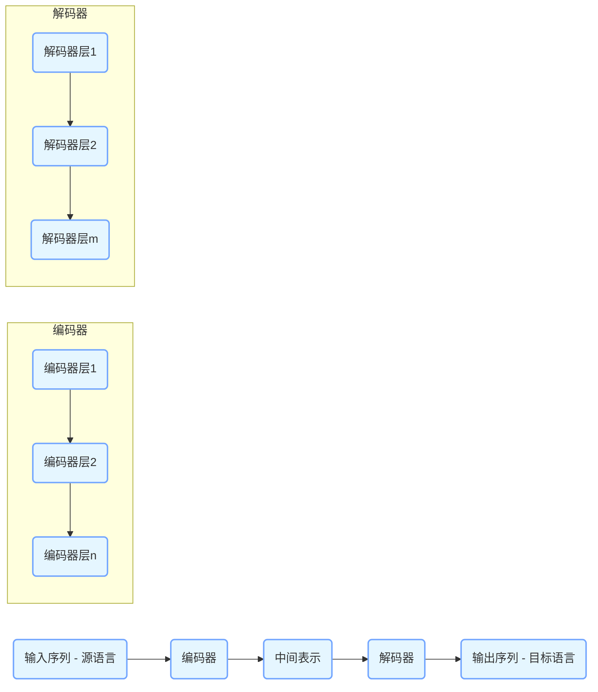

# 实现AI Agent的多语言翻译能力

> 关键词：AI Agent、多语言翻译、自然语言处理、机器翻译、深度学习、Transformer、翻译模型

> 摘要：本文围绕实现AI Agent的多语言翻译能力展开。首先介绍了相关背景知识，包括目的、预期读者、文档结构和术语表。接着阐述了核心概念，如机器翻译的原理和架构，并通过Mermaid流程图进行展示。详细讲解了核心算法原理，使用Python代码进行说明。给出了数学模型和公式，结合具体例子帮助理解。通过项目实战，介绍了开发环境搭建、源代码实现和代码解读。探讨了实际应用场景，推荐了学习资源、开发工具框架和相关论文著作。最后总结了未来发展趋势与挑战，还设有附录解答常见问题并提供扩展阅读和参考资料，旨在为开发者全面介绍实现AI Agent多语言翻译能力的方法和技术。

## 1. 背景介绍 
### 1.1 目的和范围
在全球化的今天，语言交流障碍成为了信息传播和沟通的重要阻碍。实现AI Agent的多语言翻译能力，旨在打破语言壁垒，让不同语言背景的用户能够自由、流畅地交流。本文章的范围涵盖了从多语言翻译的基本概念、核心算法，到实际项目实现的各个方面，同时探讨了其在不同场景下的应用以及未来的发展趋势。

### 1.2 预期读者
本文预期读者包括对自然语言处理、机器翻译、AI Agent开发感兴趣的开发者、研究人员和相关技术爱好者。对于初学者，可以帮助他们了解多语言翻译的基本原理和实现方法；对于有一定经验的开发者，可以作为深入研究和实践的参考资料。

### 1.3 文档结构概述
本文将按照以下结构进行组织：首先介绍相关背景知识，包括目的、预期读者、文档结构和术语表；接着阐述核心概念，如机器翻译的原理和架构，并通过Mermaid流程图进行展示；详细讲解核心算法原理，使用Python代码进行说明；给出数学模型和公式，结合具体例子帮助理解；通过项目实战，介绍开发环境搭建、源代码实现和代码解读；探讨实际应用场景，推荐学习资源、开发工具框架和相关论文著作；最后总结未来发展趋势与挑战，设有附录解答常见问题并提供扩展阅读和参考资料。

### 1.4 术语表
#### 1.4.1 核心术语定义
- **AI Agent**：人工智能代理，是一种能够感知环境、进行决策并采取行动以实现特定目标的智能实体。
- **多语言翻译**：将一种语言的文本或语音转换为另一种或多种语言的过程。
- **机器翻译**：利用计算机技术实现自然语言之间的翻译，是多语言翻译的主要实现方式。
- **深度学习**：一种基于人工神经网络的机器学习方法，在自然语言处理和机器翻译中取得了显著的成果。
- **Transformer**：一种基于自注意力机制的深度学习模型架构，在机器翻译等自然语言处理任务中表现出色。

#### 1.4.2 相关概念解释
- **自然语言处理（NLP）**：研究如何让计算机理解、处理和生成人类语言的领域，机器翻译是NLP的重要应用之一。
- **神经机器翻译（NMT）**：基于神经网络的机器翻译方法，相比传统的统计机器翻译方法，具有更好的翻译质量和泛化能力。
- **自注意力机制**：Transformer模型中的关键技术，能够让模型在处理序列数据时，自动关注序列中不同位置的信息，从而更好地捕捉语言的语义和语法结构。

#### 1.4.3 缩略词列表
- **NLP**：自然语言处理（Natural Language Processing）
- **NMT**：神经机器翻译（Neural Machine Translation）
- **API**：应用程序编程接口（Application Programming Interface）
- **GPU**：图形处理器（Graphics Processing Unit）

## 2. 核心概念与联系 
### 2.1 机器翻译原理
机器翻译的基本原理是将源语言的文本或语音转换为目标语言的文本或语音。传统的机器翻译方法主要基于规则和统计，而现代的机器翻译方法则主要基于深度学习。

基于规则的机器翻译方法需要人工编写大量的语言规则，包括语法规则、词汇规则等。这种方法的优点是翻译结果准确、可控，但缺点是需要大量的人力和时间成本，而且难以处理复杂的语言现象。

基于统计的机器翻译方法通过对大量的平行语料（即源语言和目标语言的对应文本）进行统计分析，学习语言之间的翻译概率。这种方法的优点是能够处理大量的语言数据，翻译结果相对较好，但缺点是需要大量的训练数据，而且对语言的语义和语法理解能力有限。

基于深度学习的机器翻译方法，特别是神经机器翻译（NMT），使用神经网络模型直接学习源语言和目标语言之间的映射关系。这种方法的优点是能够自动学习语言的语义和语法结构，翻译质量高，而且能够处理复杂的语言现象。

### 2.2 核心架构
现代的神经机器翻译系统通常采用Transformer架构。Transformer架构由编码器（Encoder）和解码器（Decoder）组成，编码器负责将源语言的输入序列转换为中间表示，解码器负责根据中间表示生成目标语言的输出序列。

以下是Transformer架构的文本示意图：

```plaintext
输入序列（源语言） -> 编码器（多个编码器层） -> 中间表示 -> 解码器（多个解码器层） -> 输出序列（目标语言）
```

### 2.3 Mermaid流程图


## 3. 核心算法原理 & 具体操作步骤 
### 3.1 自注意力机制
自注意力机制是Transformer架构的核心技术之一，它能够让模型在处理序列数据时，自动关注序列中不同位置的信息。自注意力机制的计算过程如下：

1. 对于输入序列中的每个元素，分别计算其查询向量（Query）、键向量（Key）和值向量（Value）。
2. 计算查询向量和键向量之间的相似度得分。
3. 对相似度得分进行归一化处理，得到注意力权重。
4. 根据注意力权重对值向量进行加权求和，得到每个元素的自注意力输出。

以下是使用Python实现自注意力机制的代码示例：

```python
import torch
import torch.nn as nn
import torch.nn.functional as F

class SelfAttention(nn.Module):
    def __init__(self, input_dim, output_dim):
        super(SelfAttention, self).__init__()
        self.query = nn.Linear(input_dim, output_dim)
        self.key = nn.Linear(input_dim, output_dim)
        self.value = nn.Linear(input_dim, output_dim)

    def forward(self, x):
        Q = self.query(x)
        K = self.key(x)
        V = self.value(x)

        scores = torch.matmul(Q, K.transpose(-2, -1))
        attention_weights = F.softmax(scores, dim=-1)
        output = torch.matmul(attention_weights, V)

        return output
```

### 3.2 多头自注意力机制
为了增强模型的表达能力，Transformer架构中使用了多头自注意力机制。多头自注意力机制将输入的特征向量分成多个头，每个头独立地计算自注意力，然后将所有头的输出拼接起来。

以下是使用Python实现多头自注意力机制的代码示例：

```python
class MultiHeadSelfAttention(nn.Module):
    def __init__(self, input_dim, num_heads):
        super(MultiHeadSelfAttention, self).__init__()
        self.num_heads = num_heads
        self.head_dim = input_dim // num_heads

        self.query = nn.Linear(input_dim, input_dim)
        self.key = nn.Linear(input_dim, input_dim)
        self.value = nn.Linear(input_dim, input_dim)
        self.out = nn.Linear(input_dim, input_dim)

    def forward(self, x):
        batch_size, seq_len, input_dim = x.size()

        Q = self.query(x).view(batch_size, seq_len, self.num_heads, self.head_dim).transpose(1, 2)
        K = self.key(x).view(batch_size, seq_len, self.num_heads, self.head_dim).transpose(1, 2)
        V = self.value(x).view(batch_size, seq_len, self.num_heads, self.head_dim).transpose(1, 2)

        scores = torch.matmul(Q, K.transpose(-2, -1)) / (self.head_dim ** 0.5)
        attention_weights = F.softmax(scores, dim=-1)
        output = torch.matmul(attention_weights, V).transpose(1, 2).contiguous().view(batch_size, seq_len, input_dim)

        return self.out(output)
```

### 3.3 编码器和解码器层
Transformer架构中的编码器和解码器由多个编码器层和解码器层组成。每个编码器层包含一个多头自注意力机制和一个前馈神经网络，每个解码器层包含一个多头自注意力机制、一个编码器 - 解码器注意力机制和一个前馈神经网络。

以下是使用Python实现编码器层和解码器层的代码示例：

```python
class EncoderLayer(nn.Module):
    def __init__(self, input_dim, num_heads, hidden_dim, dropout):
        super(EncoderLayer, self).__init__()
        self.self_attention = MultiHeadSelfAttention(input_dim, num_heads)
        self.norm1 = nn.LayerNorm(input_dim)
        self.dropout1 = nn.Dropout(dropout)

        self.feed_forward = nn.Sequential(
            nn.Linear(input_dim, hidden_dim),
            nn.ReLU(),
            nn.Linear(hidden_dim, input_dim)
        )
        self.norm2 = nn.LayerNorm(input_dim)
        self.dropout2 = nn.Dropout(dropout)

    def forward(self, x):
        attn_output = self.self_attention(x)
        x = self.norm1(x + self.dropout1(attn_output))

        ff_output = self.feed_forward(x)
        x = self.norm2(x + self.dropout2(ff_output))

        return x

class DecoderLayer(nn.Module):
    def __init__(self, input_dim, num_heads, hidden_dim, dropout):
        super(DecoderLayer, self).__init__()
        self.self_attention = MultiHeadSelfAttention(input_dim, num_heads)
        self.norm1 = nn.LayerNorm(input_dim)
        self.dropout1 = nn.Dropout(dropout)

        self.encoder_decoder_attention = MultiHeadSelfAttention(input_dim, num_heads)
        self.norm2 = nn.LayerNorm(input_dim)
        self.dropout2 = nn.Dropout(dropout)

        self.feed_forward = nn.Sequential(
            nn.Linear(input_dim, hidden_dim),
            nn.ReLU(),
            nn.Linear(hidden_dim, input_dim)
        )
        self.norm3 = nn.LayerNorm(input_dim)
        self.dropout3 = nn.Dropout(dropout)

    def forward(self, x, encoder_output):
        attn_output1 = self.self_attention(x)
        x = self.norm1(x + self.dropout1(attn_output1))

        attn_output2 = self.encoder_decoder_attention(x, encoder_output)
        x = self.norm2(x + self.dropout2(attn_output2))

        ff_output = self.feed_forward(x)
        x = self.norm3(x + self.dropout3(ff_output))

        return x
```

### 3.4 完整的Transformer模型
以下是使用Python实现完整的Transformer模型的代码示例：

```python
class Transformer(nn.Module):
    def __init__(self, input_dim, num_heads, hidden_dim, num_layers, dropout):
        super(Transformer, self).__init__()
        self.encoder_layers = nn.ModuleList([EncoderLayer(input_dim, num_heads, hidden_dim, dropout) for _ in range(num_layers)])
        self.decoder_layers = nn.ModuleList([DecoderLayer(input_dim, num_heads, hidden_dim, dropout) for _ in range(num_layers)])
        self.fc = nn.Linear(input_dim, input_dim)

    def forward(self, src, tgt):
        encoder_output = src
        for encoder_layer in self.encoder_layers:
            encoder_output = encoder_layer(encoder_output)

        decoder_output = tgt
        for decoder_layer in self.decoder_layers:
            decoder_output = decoder_layer(decoder_output, encoder_output)

        output = self.fc(decoder_output)
        return output
```

## 4. 数学模型和公式 & 详细讲解 & 举例说明 
### 4.1 自注意力机制的数学公式
自注意力机制的计算过程可以用以下数学公式表示：

$$
\text{Attention}(Q, K, V) = \text{softmax}\left(\frac{QK^T}{\sqrt{d_k}}\right)V
$$

其中，$Q$ 是查询矩阵，$K$ 是键矩阵，$V$ 是值矩阵，$d_k$ 是键向量的维度。

### 4.2 多头自注意力机制的数学公式
多头自注意力机制的计算过程可以用以下数学公式表示：

$$
\text{MultiHead}(Q, K, V) = \text{Concat}(\text{head}_1, \ldots, \text{head}_h)W^O
$$

其中，$\text{head}_i = \text{Attention}(QW_i^Q, KW_i^K, VW_i^V)$，$W_i^Q$、$W_i^K$、$W_i^V$ 是第 $i$ 个头的投影矩阵，$W^O$ 是输出投影矩阵。

### 4.3 举例说明
假设我们有一个输入序列 $x = [x_1, x_2, x_3]$，每个元素的维度为 $d = 4$。我们将使用自注意力机制来计算每个元素的自注意力输出。

1. 计算查询向量、键向量和值向量：

$$
Q = \begin{bmatrix}
q_1 \\
q_2 \\
q_3
\end{bmatrix} = W^Qx
$$

$$
K = \begin{bmatrix}
k_1 \\
k_2 \\
k_3
\end{bmatrix} = W^Kx
$$

$$
V = \begin{bmatrix}
v_1 \\
v_2 \\
v_3
\end{bmatrix} = W^Vx
$$

2. 计算相似度得分：

$$
\text{Scores} = QK^T = \begin{bmatrix}
q_1^Tk_1 & q_1^Tk_2 & q_1^Tk_3 \\
q_2^Tk_1 & q_2^Tk_2 & q_2^Tk_3 \\
q_3^Tk_1 & q_3^Tk_2 & q_3^Tk_3
\end{bmatrix}
$$

3. 对相似度得分进行归一化处理，得到注意力权重：

$$
\text{Attention Weights} = \text{softmax}\left(\frac{\text{Scores}}{\sqrt{d_k}}\right)
$$

4. 根据注意力权重对值向量进行加权求和，得到每个元素的自注意力输出：

$$
\text{Output} = \text{Attention Weights}V = \begin{bmatrix}
\text{Attention}(q_1, K, V) \\
\text{Attention}(q_2, K, V) \\
\text{Attention}(q_3, K, V)
\end{bmatrix}
$$

## 5. 项目实战：代码实际案例和详细解释说明 
### 5.1  开发环境搭建
在进行项目实战之前，我们需要搭建开发环境。以下是搭建开发环境的步骤：

1. **安装Python**：建议使用Python 3.7及以上版本。
2. **安装深度学习框架**：我们将使用PyTorch作为深度学习框架，可以使用以下命令进行安装：
```bash
pip install torch torchvision
```
3. **安装其他依赖库**：我们还需要安装一些其他的依赖库，如`numpy`、`transformers`等，可以使用以下命令进行安装：
```bash
pip install numpy transformers
```

### 5.2  源代码详细实现和代码解读
以下是一个使用`transformers`库实现多语言翻译的代码示例：

```python
from transformers import AutoTokenizer, AutoModelForSeq2SeqLM

# 加载预训练的翻译模型和分词器
model_name = "Helsinki-NLP/opus-mt-en-fr"
tokenizer = AutoTokenizer.from_pretrained(model_name)
model = AutoModelForSeq2SeqLM.from_pretrained(model_name)

# 定义待翻译的文本
input_text = "Hello, how are you?"

# 对输入文本进行分词
input_ids = tokenizer(input_text, return_tensors="pt").input_ids

# 使用模型进行翻译
output_ids = model.generate(input_ids)

# 将输出的ID转换为文本
output_text = tokenizer.decode(output_ids[0], skip_special_tokens=True)

print(f"Input text: {input_text}")
print(f"Translated text: {output_text}")
```

### 5.3  代码解读与分析
1. **加载预训练的翻译模型和分词器**：我们使用`AutoTokenizer`和`AutoModelForSeq2SeqLM`从Hugging Face的模型库中加载预训练的翻译模型和分词器。这里我们选择了一个将英语翻译成法语的模型`Helsinki-NLP/opus-mt-en-fr`。
2. **定义待翻译的文本**：我们定义了一个待翻译的英语文本`"Hello, how are you?"`。
3. **对输入文本进行分词**：使用分词器将输入文本转换为模型可以处理的ID序列。
4. **使用模型进行翻译**：使用模型的`generate`方法对输入的ID序列进行翻译，得到输出的ID序列。
5. **将输出的ID转换为文本**：使用分词器的`decode`方法将输出的ID序列转换为文本。
6. **打印翻译结果**：打印输入文本和翻译后的文本。

## 6. 实际应用场景 
### 6.1 跨语言交流平台
在跨语言交流平台中，AI Agent的多语言翻译能力可以帮助不同语言背景的用户进行实时交流。例如，在国际会议、在线聊天、视频通话等场景中，用户可以输入自己的语言，AI Agent将其翻译成对方的语言，从而实现无障碍交流。

### 6.2 跨境电商
在跨境电商中，AI Agent的多语言翻译能力可以帮助商家和消费者打破语言障碍。商家可以将商品信息、产品描述等翻译成多种语言，方便不同国家和地区的消费者了解商品信息；消费者可以将自己的需求和问题翻译成商家的语言，与商家进行沟通。

### 6.3 智能客服
在智能客服系统中，AI Agent的多语言翻译能力可以帮助客服人员更好地服务不同语言背景的客户。客服人员可以输入自己的语言，AI Agent将其翻译成客户的语言，提高客服效率和服务质量。

### 6.4 教育领域
在教育领域，AI Agent的多语言翻译能力可以帮助学生学习不同语言的知识。例如，在在线学习平台中，学生可以将学习材料翻译成自己的语言，更好地理解和掌握知识；教师可以将教学内容翻译成多种语言，扩大教学范围。

## 7. 工具和资源推荐
### 7.1 学习资源推荐
#### 7.1.1 书籍推荐
- 《深度学习》（Deep Learning）：由Ian Goodfellow、Yoshua Bengio和Aaron Courville所著，是深度学习领域的经典教材，涵盖了深度学习的基本原理、算法和应用。
- 《自然语言处理入门》（Natural Language Processing in Action）：由Hobson Lane、Cole Howard和 Hannes Hapke所著，介绍了自然语言处理的基本概念、技术和应用，适合初学者阅读。
- 《Transformers for Natural Language Processing》：由Denis Rothman所著，详细介绍了Transformer架构及其在自然语言处理中的应用。

#### 7.1.2 在线课程
- Coursera上的“Natural Language Processing Specialization”：由斯坦福大学的Christopher Manning教授等授课，涵盖了自然语言处理的各个方面，包括机器翻译、情感分析等。
- edX上的“Deep Learning Specialization”：由Andrew Ng教授授课，是深度学习领域的经典在线课程，包括神经网络、卷积神经网络、循环神经网络等内容。
- Hugging Face的“Transformers Course”：介绍了Hugging Face的`transformers`库及其在自然语言处理中的应用，包括如何使用预训练模型进行文本分类、机器翻译等任务。

#### 7.1.3 技术博客和网站
- Hugging Face Blog：提供了关于自然语言处理、深度学习和Transformer模型的最新研究成果和技术文章。
- Medium上的Towards Data Science：有许多关于自然语言处理、机器学习和深度学习的高质量技术文章。
- arXiv.org：是一个开放获取的学术文献库，包含了大量关于自然语言处理、机器翻译和深度学习的研究论文。

### 7.2 开发工具框架推荐
#### 7.2.1 IDE和编辑器
- PyCharm：是一款专业的Python集成开发环境，提供了代码编辑、调试、版本控制等功能，适合Python开发。
- Visual Studio Code：是一款轻量级的代码编辑器，支持多种编程语言，有丰富的插件生态系统，适合快速开发和调试。

#### 7.2.2 调试和性能分析工具
- PyTorch Profiler：是PyTorch提供的性能分析工具，可以帮助开发者分析模型的性能瓶颈，优化代码。
- TensorBoard：是TensorFlow提供的可视化工具，也可以与PyTorch结合使用，用于可视化模型的训练过程和性能指标。

#### 7.2.3 相关框架和库
- PyTorch：是一个开源的深度学习框架，提供了丰富的神经网络模块和优化算法，适合深度学习模型的开发和训练。
- Hugging Face Transformers：是一个用于自然语言处理的开源库，提供了大量的预训练模型和工具，方便开发者进行自然语言处理任务。
- SentencePiece：是一个用于文本分词的开源库，支持多种语言和分词算法，在自然语言处理中广泛应用。

### 7.3 相关论文著作推荐
#### 7.3.1 经典论文
- “Attention Is All You Need”：由Vaswani等人发表，提出了Transformer架构，是自然语言处理领域的经典论文。
- “Neural Machine Translation by Jointly Learning to Align and Translate”：由Bahdanau等人发表，提出了注意力机制在神经机器翻译中的应用。

#### 7.3.2 最新研究成果
- 关注arXiv.org上关于自然语言处理、机器翻译和Transformer模型的最新研究论文，了解最新的技术进展。

#### 7.3.3 应用案例分析
- 可以参考一些实际应用案例的论文和报告，了解AI Agent的多语言翻译能力在不同领域的应用效果和经验。

## 8. 总结：未来发展趋势与挑战
### 8.1 未来发展趋势
- **多模态翻译**：未来的AI Agent可能会支持多模态翻译，不仅能够处理文本翻译，还能够处理语音、图像、视频等多种模态的翻译任务。例如，在视频会议中，AI Agent可以实时将发言人的语音翻译成其他语言，并在屏幕上显示翻译结果。
- **个性化翻译**：根据用户的语言习惯、专业领域、文化背景等因素，提供个性化的翻译服务。例如，对于医学专业的用户，AI Agent可以更准确地翻译医学术语和专业文献。
- **低资源语言翻译**：目前的机器翻译技术主要集中在高资源语言（如英语、中文、法语等），未来将更加关注低资源语言的翻译，帮助更多的语言群体打破语言障碍。
- **与其他技术的融合**：AI Agent的多语言翻译能力将与其他技术（如人工智能、物联网、区块链等）深度融合，创造出更多的应用场景和商业价值。例如，在物联网设备中，AI Agent可以实现设备之间的跨语言通信。

### 8.2 挑战
- **语义理解**：虽然深度学习在机器翻译领域取得了很大的进展，但目前的模型仍然难以完全理解语言的语义和语境。特别是在处理一些文化背景、隐喻、习语等复杂的语言现象时，翻译结果可能不够准确。
- **数据质量和数量**：机器翻译模型的性能很大程度上依赖于训练数据的质量和数量。对于低资源语言，很难获取足够的高质量训练数据，这限制了低资源语言翻译的发展。
- **计算资源需求**：训练和运行大规模的深度学习模型需要大量的计算资源，包括GPU、内存等。这对于一些小型企业和开发者来说，可能是一个很大的挑战。
- **隐私和安全**：在多语言翻译过程中，涉及到用户的文本数据，需要保障用户的隐私和数据安全。同时，还需要防止恶意攻击和数据泄露等问题。

## 9. 附录：常见问题与解答
### 9.1 如何选择合适的翻译模型？
选择合适的翻译模型需要考虑以下因素：
- **语言对**：确保模型支持你需要翻译的语言对。
- **翻译质量**：可以参考一些翻译质量评估指标（如BLEU、ROUGE等），或者进行实际测试，选择翻译质量较高的模型。
- **模型大小和速度**：如果对计算资源和响应速度有要求，可以选择较小的模型。

### 9.2 如何提高翻译质量？
提高翻译质量可以从以下几个方面入手：
- **数据增强**：使用更多的训练数据，或者对现有数据进行数据增强，提高模型的泛化能力。
- **模型调优**：对模型的超参数进行调优，如学习率、批次大小等，以提高模型的性能。
- **后处理**：对翻译结果进行后处理，如去除重复、纠正语法错误等，提高翻译的可读性。

### 9.3 如何处理低资源语言的翻译？
处理低资源语言的翻译可以采用以下方法：
- **迁移学习**：利用高资源语言的预训练模型，在低资源语言的少量数据上进行微调。
- **多语言模型**：使用多语言模型，利用其他语言的知识来辅助低资源语言的翻译。
- **数据收集**：尽可能收集更多的低资源语言数据，提高训练数据的质量和数量。

## 10. 扩展阅读 & 参考资料
- Vaswani, A., Shazeer, N., Parmar, N., Uszkoreit, J., Jones, L., Gomez, A. N., ... & Polosukhin, I. (2017). Attention is all you need. Advances in neural information processing systems, 30.
- Bahdanau, D., Cho, K., & Bengio, Y. (2014). Neural machine translation by jointly learning to align and translate. arXiv preprint arXiv:1409.0473.
- Hugging Face官方文档：https://huggingface.co/docs/transformers/index
- PyTorch官方文档：https://pytorch.org/docs/stable/index.html
- 《深度学习》书籍
- 《自然语言处理入门》书籍
- 《Transformers for Natural Language Processing》书籍