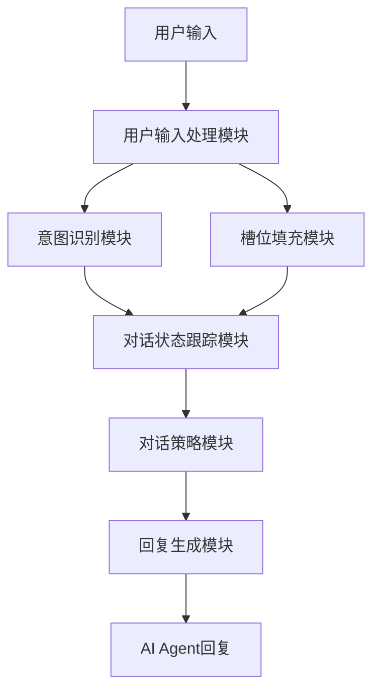

# 实现AI Agent的多轮对话状态跟踪

> 关键词：AI Agent、多轮对话、状态跟踪、对话管理、自然语言处理

> 摘要：本文聚焦于实现AI Agent的多轮对话状态跟踪这一核心主题。在当今智能交互领域，多轮对话是实现高效、自然人机交互的关键。AI Agent的多轮对话状态跟踪能够让系统理解对话的上下文，准确把握用户意图，从而提供更精准、连贯的回复。文章将深入探讨多轮对话状态跟踪的核心概念、算法原理、数学模型，通过项目实战展示具体实现过程，并介绍其实际应用场景、相关工具和资源。最后对未来发展趋势与挑战进行总结，为相关领域的研究和开发提供全面且深入的参考。

## 1. 背景介绍 
### 1.1 目的和范围
随着人工智能技术的飞速发展，智能对话系统的应用越来越广泛，如智能客服、智能助手等。多轮对话是这些系统实现自然交互的重要方式，而状态跟踪则是多轮对话的核心环节。本文的目的在于深入探讨实现AI Agent多轮对话状态跟踪的技术原理和方法，涵盖从基本概念到具体实现的全过程，包括核心算法、数学模型、项目实战等方面。通过本文的阐述，读者将能够全面了解多轮对话状态跟踪的相关知识，并具备实现一个简单多轮对话状态跟踪系统的能力。

### 1.2 预期读者
本文预期读者包括人工智能领域的研究人员、开发者、对自然语言处理和智能对话系统感兴趣的技术爱好者。对于有一定编程基础和机器学习知识的读者，能够更好地理解文中的技术细节和实现方法；而对于初学者，通过本文的学习也能对多轮对话状态跟踪有一个初步的认识和理解。

### 1.3 文档结构概述
本文按照以下结构进行组织：首先介绍多轮对话状态跟踪的背景知识，包括目的、预期读者和文档结构概述等；接着阐述核心概念与联系，通过文本示意图和Mermaid流程图展示其原理和架构；然后详细讲解核心算法原理及具体操作步骤，并用Python源代码进行阐述；再介绍数学模型和公式，并举例说明；之后通过项目实战展示代码实际案例和详细解释；接着介绍多轮对话状态跟踪的实际应用场景；再推荐相关的工具和资源；最后总结未来发展趋势与挑战，并提供常见问题与解答以及扩展阅读和参考资料。

### 1.4 术语表
#### 1.4.1 核心术语定义
- **AI Agent**：人工智能代理，是一种能够感知环境、进行决策并采取行动的智能实体，在对话系统中表现为能够与用户进行交互的智能程序。
- **多轮对话**：用户与AI Agent之间进行的多次交互对话，对话的内容和上下文相互关联，需要系统能够理解和处理这种连贯性。
- **状态跟踪**：在多轮对话过程中，记录和更新对话的状态信息，包括用户意图、对话历史、当前任务等，以便系统能够根据状态信息做出合适的回复。
- **对话管理**：负责管理多轮对话的整个过程，包括状态跟踪、对话策略选择、回复生成等任务。
- **自然语言处理（NLP）**：研究如何让计算机理解和处理人类语言的技术，是实现多轮对话状态跟踪的重要基础。

#### 1.4.2 相关概念解释
- **对话状态**：表示在某一时刻多轮对话的当前情况，包括用户的意图、已提供的信息、当前任务的进展等。对话状态是状态跟踪的核心内容，它随着对话的进行而不断更新。
- **用户意图**：用户通过自然语言表达的想要实现的目标或需求，如查询信息、完成任务、表达情感等。准确识别用户意图是多轮对话状态跟踪的关键任务之一。
- **槽位填充**：在对话中，用户的意图通常需要一些具体的信息来实现，这些信息被称为槽位。槽位填充就是从用户的输入中提取出这些信息，并填充到相应的槽位中，以更新对话状态。

#### 1.4.3 缩略词列表
- **NLP**：Natural Language Processing（自然语言处理）
- **RNN**：Recurrent Neural Network（循环神经网络）
- **LSTM**：Long Short-Term Memory（长短期记忆网络）
- **GRU**：Gated Recurrent Unit（门控循环单元）

## 2. 核心概念与联系 

### 核心概念原理
多轮对话状态跟踪的核心原理是在对话过程中不断地对对话状态进行记录、更新和推理。对话状态可以看作是一个包含多个信息项的状态向量，这些信息项反映了对话的不同方面，如用户意图、槽位信息、对话历史等。在每一轮对话中，系统首先对用户的输入进行自然语言处理，提取出用户意图和槽位信息；然后根据这些信息更新对话状态；最后根据更新后的对话状态生成合适的回复。

### 架构的文本示意图
多轮对话状态跟踪系统的架构主要包括以下几个部分：
1. **用户输入处理模块**：负责接收用户的自然语言输入，并进行预处理，如分词、词性标注、命名实体识别等。
2. **意图识别模块**：根据用户输入的文本，识别用户的意图。可以使用机器学习或深度学习模型来实现，如基于规则的方法、支持向量机、神经网络等。
3. **槽位填充模块**：从用户输入中提取出与用户意图相关的槽位信息。同样可以使用机器学习或深度学习模型来实现。
4. **对话状态跟踪模块**：根据意图识别和槽位填充的结果，更新对话状态。对话状态可以用一个状态向量来表示，每个维度对应一个信息项。
5. **对话策略模块**：根据当前的对话状态，选择合适的对话策略，如询问用户更多信息、提供信息、完成任务等。
6. **回复生成模块**：根据对话策略生成相应的自然语言回复。可以使用模板匹配、基于规则的方法或生成式模型来实现。

### Mermaid流程图


## 3. 核心算法原理 & 具体操作步骤 

### 核心算法原理
多轮对话状态跟踪中常用的算法包括基于规则的方法、基于机器学习的方法和基于深度学习的方法。这里我们重点介绍基于深度学习的方法，特别是使用循环神经网络（RNN）及其变体，如长短期记忆网络（LSTM）和门控循环单元（GRU）。

RNN是一种能够处理序列数据的神经网络，它通过在网络中引入循环结构，使得网络能够记住之前的输入信息。LSTM和GRU是RNN的改进版本，它们通过引入门控机制，解决了RNN中梯度消失和梯度爆炸的问题，能够更好地处理长序列数据。

在多轮对话状态跟踪中，我们可以使用RNN、LSTM或GRU来对对话历史进行建模，从而预测当前的对话状态。具体来说，我们可以将对话历史看作一个序列，每个对话轮次的输入作为序列中的一个元素。通过将这些输入依次输入到RNN、LSTM或GRU中，网络可以学习到对话的上下文信息，并输出当前的对话状态。

### 具体操作步骤
1. **数据准备**：收集多轮对话数据，并进行标注，包括用户意图、槽位信息等。将数据划分为训练集、验证集和测试集。
2. **特征工程**：对对话数据进行预处理，如分词、词性标注、命名实体识别等。将文本数据转换为数值特征，如词向量表示。
3. **模型构建**：使用深度学习框架（如TensorFlow、PyTorch）构建RNN、LSTM或GRU模型。模型的输入为对话历史的特征序列，输出为对话状态的预测。
4. **模型训练**：使用训练集对模型进行训练，通过最小化预测的对话状态与真实对话状态之间的损失函数，优化模型的参数。
5. **模型评估**：使用验证集和测试集对训练好的模型进行评估，计算模型的准确率、召回率、F1值等指标。
6. **模型部署**：将训练好的模型部署到实际的对话系统中，实现多轮对话状态跟踪的功能。

### Python源代码实现
以下是一个使用PyTorch实现的简单LSTM模型进行多轮对话状态跟踪的示例代码：

```python
import torch
import torch.nn as nn
import torch.optim as optim

# 定义LSTM模型
class LSTMStateTracker(nn.Module):
    def __init__(self, input_size, hidden_size, output_size):
        super(LSTMStateTracker, self).__init__()
        self.hidden_size = hidden_size
        self.lstm = nn.LSTM(input_size, hidden_size)
        self.fc = nn.Linear(hidden_size, output_size)

    def forward(self, input):
        lstm_out, _ = self.lstm(input.view(len(input), 1, -1))
        output = self.fc(lstm_out.view(len(input), -1))
        return output

# 数据准备
input_size = 10  # 输入特征的维度
hidden_size = 20  # LSTM隐藏层的维度
output_size = 5  # 对话状态的维度
model = LSTMStateTracker(input_size, hidden_size, output_size)

# 定义损失函数和优化器
criterion = nn.MSELoss()
optimizer = optim.Adam(model.parameters(), lr=0.001)

# 训练数据
train_data = torch.randn(100, input_size)  # 100个对话轮次的输入数据
train_labels = torch.randn(100, output_size)  # 对应的对话状态标签

# 训练模型
num_epochs = 100
for epoch in range(num_epochs):
    optimizer.zero_grad()
    outputs = model(train_data)
    loss = criterion(outputs, train_labels)
    loss.backward()
    optimizer.step()
    if (epoch + 1) % 10 == 0:
        print(f'Epoch [{epoch+1}/{num_epochs}], Loss: {loss.item():.4f}')
```

## 4. 数学模型和公式 & 详细讲解 & 举例说明 

### 数学模型
在多轮对话状态跟踪中，我们可以将对话状态跟踪问题看作一个序列预测问题。设对话历史为 $x_1, x_2, \cdots, x_t$，其中 $x_i$ 表示第 $i$ 轮对话的输入特征。对话状态为 $s_1, s_2, \cdots, s_t$，其中 $s_i$ 表示第 $i$ 轮对话的状态。我们的目标是根据对话历史预测当前的对话状态，即 $s_t = f(x_1, x_2, \cdots, x_t)$。

使用RNN、LSTM或GRU模型进行对话状态跟踪时，模型的输出可以表示为：

对于RNN：
$$h_t = \tanh(W_{hh}h_{t-1} + W_{xh}x_t + b_h)$$
$$s_t = W_{hs}h_t + b_s$$

其中 $h_t$ 是RNN在第 $t$ 时刻的隐藏状态，$W_{hh}$ 和 $W_{xh}$ 是权重矩阵，$b_h$ 是偏置向量，$W_{hs}$ 是输出层的权重矩阵，$b_s$ 是输出层的偏置向量。

对于LSTM：
$$i_t = \sigma(W_{ii}x_t + W_{hi}h_{t-1} + b_i)$$
$$f_t = \sigma(W_{if}x_t + W_{hf}h_{t-1} + b_f)$$
$$o_t = \sigma(W_{io}x_t + W_{ho}h_{t-1} + b_o)$$
$$\tilde{C}_t = \tanh(W_{ic}x_t + W_{hc}h_{t-1} + b_c)$$
$$C_t = f_t \odot C_{t-1} + i_t \odot \tilde{C}_t$$
$$h_t = o_t \odot \tanh(C_t)$$
$$s_t = W_{hs}h_t + b_s$$

其中 $i_t$、$f_t$、$o_t$ 分别是输入门、遗忘门和输出门，$C_t$ 是细胞状态，$\odot$ 表示逐元素相乘，$\sigma$ 是sigmoid函数。

对于GRU：
$$z_t = \sigma(W_{iz}x_t + W_{hz}h_{t-1} + b_z)$$
$$r_t = \sigma(W_{ir}x_t + W_{hr}h_{t-1} + b_r)$$
$$\tilde{h}_t = \tanh(W_{ih}x_t + r_t \odot W_{hh}h_{t-1} + b_h)$$
$$h_t = (1 - z_t) \odot h_{t-1} + z_t \odot \tilde{h}_t$$
$$s_t = W_{hs}h_t + b_s$$

其中 $z_t$ 是更新门，$r_t$ 是重置门。

### 详细讲解
这些公式描述了RNN、LSTM和GRU模型在每一个时间步的计算过程。在RNN中，隐藏状态 $h_t$ 是通过当前输入 $x_t$ 和上一个时间步的隐藏状态 $h_{t-1}$ 计算得到的。LSTM和GRU通过引入门控机制，能够更好地控制信息的流动，从而解决了RNN中梯度消失和梯度爆炸的问题。

在LSTM中，输入门 $i_t$ 控制着新信息的输入，遗忘门 $f_t$ 控制着细胞状态 $C_{t-1}$ 中信息的遗忘，输出门 $o_t$ 控制着细胞状态 $C_t$ 中信息的输出。细胞状态 $C_t$ 可以看作是一个长期记忆，它通过遗忘门和输入门的控制，能够保留有用的信息并更新新的信息。

在GRU中，更新门 $z_t$ 控制着上一个时间步的隐藏状态 $h_{t-1}$ 和当前候选隐藏状态 $\tilde{h}_t$ 的混合比例，重置门 $r_t$ 控制着上一个时间步的隐藏状态 $h_{t-1}$ 对当前候选隐藏状态 $\tilde{h}_t$ 的影响。

### 举例说明
假设我们有一个简单的多轮对话场景，用户想要查询某个城市的天气信息。对话历史如下：
- 用户：我想查询天气。
- AI Agent：请问您想查询哪个城市的天气？
- 用户：北京。

我们可以将用户的输入转换为特征向量 $x_1$ 和 $x_2$，并将其输入到LSTM模型中。模型通过计算得到隐藏状态 $h_1$ 和 $h_2$，并根据隐藏状态输出对话状态 $s_1$ 和 $s_2$。在这个例子中，$s_1$ 可能表示用户的意图是查询天气，但城市信息未知；$s_2$ 可能表示用户的意图是查询北京的天气。

## 5. 项目实战：代码实际案例和详细解释说明 

### 5.1  开发环境搭建
1. **安装Python**：建议使用Python 3.6及以上版本。可以从Python官方网站（https://www.python.org/downloads/）下载并安装。
2. **安装深度学习框架**：这里我们使用PyTorch作为深度学习框架。可以根据自己的CUDA版本和操作系统，从PyTorch官方网站（https://pytorch.org/get-started/locally/）选择合适的安装命令进行安装。
3. **安装其他依赖库**：安装NLTK、Scikit-learn等常用的自然语言处理和机器学习库。可以使用pip命令进行安装：
```sh
pip install nltk scikit-learn
```

### 5.2  源代码详细实现和代码解读
以下是一个完整的多轮对话状态跟踪系统的实现代码：

```python
import torch
import torch.nn as nn
import torch.optim as optim
from sklearn.preprocessing import LabelEncoder
import nltk
from nltk.tokenize import word_tokenize
import numpy as np

# 数据准备
dialogue_data = [
    ("我想查询天气", "查询天气", ""),
    ("北京", "查询天气", "北京")
]

# 意图和槽位编码
intent_encoder = LabelEncoder()
slot_encoder = LabelEncoder()

intents = [data[1] for data in dialogue_data]
slots = [data[2] for data in dialogue_data]

intent_encoder.fit(intents)
slot_encoder.fit(slots)

# 分词和词向量表示
nltk.download('punkt')
vocab = set()
for data in dialogue_data:
    tokens = word_tokenize(data[0])
    vocab.update(tokens)

vocab_size = len(vocab)
word2idx = {word: idx for idx, word in enumerate(vocab)}

# 数据转换为特征向量
input_sequences = []
intent_labels = []
slot_labels = []

for data in dialogue_data:
    tokens = word_tokenize(data[0])
    input_sequence = [word2idx[word] for word in tokens]
    input_sequences.append(input_sequence)
    intent_labels.append(intent_encoder.transform([data[1]])[0])
    slot_labels.append(slot_encoder.transform([data[2]])[0])

# 定义LSTM模型
class LSTMStateTracker(nn.Module):
    def __init__(self, vocab_size, embedding_dim, hidden_size, intent_size, slot_size):
        super(LSTMStateTracker, self).__init__()
        self.embedding = nn.Embedding(vocab_size, embedding_dim)
        self.lstm = nn.LSTM(embedding_dim, hidden_size)
        self.intent_fc = nn.Linear(hidden_size, intent_size)
        self.slot_fc = nn.Linear(hidden_size, slot_size)

    def forward(self, input):
        embedded = self.embedding(input)
        lstm_out, _ = self.lstm(embedded.view(len(input), 1, -1))
        intent_output = self.intent_fc(lstm_out.view(len(input), -1)[-1])
        slot_output = self.slot_fc(lstm_out.view(len(input), -1)[-1])
        return intent_output, slot_output

# 模型参数设置
embedding_dim = 10
hidden_size = 20
intent_size = len(intent_encoder.classes_)
slot_size = len(slot_encoder.classes_)

model = LSTMStateTracker(vocab_size, embedding_dim, hidden_size, intent_size, slot_size)

# 定义损失函数和优化器
criterion_intent = nn.CrossEntropyLoss()
criterion_slot = nn.CrossEntropyLoss()
optimizer = optim.Adam(model.parameters(), lr=0.001)

# 训练模型
num_epochs = 100
for epoch in range(num_epochs):
    for i in range(len(input_sequences)):
        input_sequence = torch.tensor(input_sequences[i], dtype=torch.long)
        intent_label = torch.tensor([intent_labels[i]], dtype=torch.long)
        slot_label = torch.tensor([slot_labels[i]], dtype=torch.long)

        optimizer.zero_grad()
        intent_output, slot_output = model(input_sequence)
        loss_intent = criterion_intent(intent_output.unsqueeze(0), intent_label)
        loss_slot = criterion_slot(slot_output.unsqueeze(0), slot_label)
        loss = loss_intent + loss_slot
        loss.backward()
        optimizer.step()

    if (epoch + 1) % 10 == 0:
        print(f'Epoch [{epoch+1}/{num_epochs}], Loss: {loss.item():.4f}')
```

### 5.3  代码解读与分析
1. **数据准备**：首先定义了一个简单的多轮对话数据集 `dialogue_data`，包含用户输入、意图和槽位信息。然后使用 `LabelEncoder` 对意图和槽位进行编码，将其转换为数值标签。
2. **分词和词向量表示**：使用NLTK的 `word_tokenize` 函数对用户输入进行分词，并构建词汇表 `vocab`。将每个词映射到一个唯一的索引，得到 `word2idx` 字典。
3. **数据转换为特征向量**：将用户输入的文本转换为索引序列 `input_sequences`，并将意图和槽位标签转换为数值标签 `intent_labels` 和 `slot_labels`。
4. **定义LSTM模型**：定义了一个LSTM模型 `LSTMStateTracker`，包含嵌入层、LSTM层和两个全连接层，分别用于预测意图和槽位。
5. **模型训练**：使用交叉熵损失函数分别计算意图和槽位的损失，并将它们相加得到总损失。使用Adam优化器对模型进行训练。

## 6. 实际应用场景 
### 智能客服
在智能客服系统中，多轮对话状态跟踪能够让系统更好地理解用户的问题和需求。例如，当用户咨询某个产品的信息时，系统可能需要询问用户更多的细节，如产品型号、使用场景等。通过状态跟踪，系统能够记住用户之前提供的信息，并根据这些信息进行后续的询问和回答，从而提供更准确、个性化的服务。

### 智能助手
智能助手（如Siri、小爱同学等）需要处理用户的各种请求，包括查询信息、设置提醒、控制设备等。多轮对话状态跟踪可以帮助智能助手理解用户的复杂请求，例如用户可能会先询问某个地点的位置，然后再询问如何到达该地点。通过状态跟踪，智能助手能够连贯地处理这些请求，提供更好的用户体验。

### 智能教育
在智能教育系统中，多轮对话状态跟踪可以用于辅导学生学习。例如，当学生询问某个知识点的问题时，系统可以根据学生的回答和之前的对话历史，提供更有针对性的讲解和练习，帮助学生更好地掌握知识。

### 智能家居控制
在智能家居系统中，用户可以通过语音指令控制各种智能设备。多轮对话状态跟踪可以让系统更好地理解用户的控制意图，例如用户可能会先打开某个房间的灯，然后再调节灯光的亮度。通过状态跟踪，系统能够准确地执行用户的指令，实现智能家居的自动化控制。

## 7. 工具和资源推荐
### 7.1 学习资源推荐
#### 7.1.1 书籍推荐
- 《自然语言处理入门》：作者何晗，本书系统地介绍了自然语言处理的基础知识和常用技术，包括分词、词性标注、命名实体识别、意图识别等，适合初学者入门。
- 《深度学习》：作者Ian Goodfellow、Yoshua Bengio和Aaron Courville，这本书是深度学习领域的经典教材，全面介绍了深度学习的理论和实践，包括神经网络、卷积神经网络、循环神经网络等，对于深入理解多轮对话状态跟踪的算法原理有很大帮助。
- 《Python自然语言处理》：作者Steven Bird、Ewan Klein和Edward Loper，本书详细介绍了使用Python进行自然语言处理的方法和技术，包括NLTK库的使用，对于实际项目的开发有很大的参考价值。

#### 7.1.2 在线课程
- Coursera上的“Natural Language Processing Specialization”：由深度学习领域的知名学者授课，系统地介绍了自然语言处理的各个方面，包括词嵌入、序列模型、注意力机制等，对于学习多轮对话状态跟踪的相关技术非常有帮助。
- edX上的“Deep Learning for Natural Language Processing”：该课程深入介绍了深度学习在自然语言处理中的应用，包括循环神经网络、长短期记忆网络、门控循环单元等，适合有一定机器学习基础的学习者。

#### 7.1.3 技术博客和网站
- Medium上的“Towards Data Science”：该博客上有很多关于自然语言处理和深度学习的技术文章，包括最新的研究成果和实践经验，对于了解多轮对话状态跟踪的前沿技术非常有帮助。
- arXiv.org：这是一个预印本平台，上面有很多关于自然语言处理和人工智能的研究论文，可以及时了解最新的研究动态。

### 7.2 开发工具框架推荐
#### 7.2.1 IDE和编辑器
- PyCharm：是一款专门为Python开发设计的集成开发环境，具有强大的代码编辑、调试和自动补全功能，非常适合开发多轮对话状态跟踪系统。
- Jupyter Notebook：是一个交互式的开发环境，可以将代码、文本、图表等内容集成在一个文档中，方便进行实验和调试。

#### 7.2.2 调试和性能分析工具
- TensorBoard：是TensorFlow提供的一个可视化工具，可以用于可视化模型的训练过程、损失曲线、参数分布等，帮助开发者更好地理解和调试模型。
- PyTorch Profiler：是PyTorch提供的一个性能分析工具，可以用于分析模型的运行时间、内存使用等情况，帮助开发者优化模型的性能。

#### 7.2.3 相关框架和库
- NLTK：是Python中最常用的自然语言处理库，提供了丰富的工具和数据集，包括分词、词性标注、命名实体识别等功能，对于多轮对话状态跟踪中的文本预处理非常有帮助。
- SpaCy：是另一个流行的自然语言处理库，具有高效、易用的特点，提供了多种语言的支持和预训练模型，适合快速开发自然语言处理应用。
- Hugging Face Transformers：是一个基于PyTorch和TensorFlow的深度学习框架，提供了大量的预训练语言模型，如BERT、GPT等，可以用于意图识别、槽位填充等任务。

### 7.3 相关论文著作推荐
#### 7.3.1 经典论文
- “Long Short-Term Memory”：作者Sepp Hochreiter和Jürgen Schmidhuber，这篇论文首次提出了长短期记忆网络（LSTM）的概念，解决了循环神经网络中梯度消失和梯度爆炸的问题，对于多轮对话状态跟踪中的序列建模非常重要。
- “Gated Recurrent Unit”：作者Kyunghyun Cho、Bart van Merriënboer等，这篇论文提出了门控循环单元（GRU），是LSTM的一种简化版本，具有相似的性能和更快的训练速度。

#### 7.3.2 最新研究成果
- 关注自然语言处理领域的顶级会议，如ACL（Association for Computational Linguistics）、EMNLP（Conference on Empirical Methods in Natural Language Processing）等，这些会议上的论文反映了多轮对话状态跟踪领域的最新研究成果。

#### 7.3.3 应用案例分析
- 可以参考一些实际应用多轮对话状态跟踪技术的案例分析，如智能客服系统、智能助手等的开发经验分享，了解如何将理论知识应用到实际项目中。

## 8. 总结：未来发展趋势与挑战
### 未来发展趋势
1. **融合多模态信息**：未来的多轮对话状态跟踪系统将不仅仅依赖于文本信息，还会融合语音、图像、视频等多模态信息，从而提供更加丰富、自然的交互体验。例如，在智能客服系统中，用户可以通过语音描述问题，同时上传相关的图片或视频，系统可以综合这些信息更好地理解用户的需求。
2. **强化学习的应用**：强化学习可以让AI Agent在与用户的交互过程中不断学习和优化对话策略，从而提高对话的效率和质量。未来，强化学习将在多轮对话状态跟踪中得到更广泛的应用，使AI Agent能够更好地适应不同用户的需求和偏好。
3. **知识图谱的结合**：知识图谱可以为多轮对话状态跟踪系统提供丰富的背景知识，帮助系统更好地理解用户的意图和上下文。通过将知识图谱与多轮对话状态跟踪相结合，系统可以提供更加准确、全面的回答，解决一些复杂的问题。
4. **个性化对话**：未来的多轮对话状态跟踪系统将更加注重个性化，根据用户的历史对话记录、偏好、兴趣等信息，为用户提供个性化的对话服务。例如，智能助手可以根据用户的日常习惯，主动推荐相关的信息和服务。

### 挑战
1. **语义理解的准确性**：虽然自然语言处理技术取得了很大的进展，但在语义理解方面仍然存在挑战。用户的语言表达往往具有多样性和歧义性，如何准确地理解用户的意图和槽位信息，是多轮对话状态跟踪面临的一个重要问题。
2. **对话策略的优化**：设计一个合理的对话策略，能够根据不同的对话状态和用户需求，选择合适的回复方式和行动，是多轮对话状态跟踪的关键。然而，对话策略的优化是一个复杂的问题，需要考虑到多种因素，如用户满意度、任务完成率等。
3. **数据的稀缺性和质量**：多轮对话状态跟踪需要大量的标注数据来训练模型，但标注数据的获取是一个耗时、耗力的过程。此外，数据的质量也会影响模型的性能，如何获取高质量的标注数据，是一个亟待解决的问题。
4. **可解释性和透明度**：随着深度学习模型在多轮对话状态跟踪中的广泛应用，模型的可解释性和透明度成为一个重要的问题。用户往往希望了解AI Agent的决策过程和依据，如何让模型的决策过程更加可解释和透明，是未来需要研究的方向。

## 9. 附录：常见问题与解答
### 1. 多轮对话状态跟踪和单轮对话处理有什么区别？
单轮对话处理只考虑当前轮次的用户输入，而不考虑对话的历史信息。多轮对话状态跟踪则需要记录和更新对话的状态信息，包括用户意图、对话历史、当前任务等，以便系统能够根据上下文信息做出合适的回复。

### 2. 如何选择合适的算法进行多轮对话状态跟踪？
选择合适的算法需要考虑多个因素，如数据规模、任务复杂度、计算资源等。基于规则的方法简单易懂，适合处理简单的任务和小规模的数据；基于机器学习的方法可以处理更复杂的任务，但需要大量的标注数据；基于深度学习的方法在处理序列数据和复杂语义方面具有优势，但计算资源需求较大。

### 3. 如何评估多轮对话状态跟踪系统的性能？
可以使用多种指标来评估多轮对话状态跟踪系统的性能，如准确率、召回率、F1值、对话成功率等。准确率和召回率用于评估意图识别和槽位填充的性能，F1值是准确率和召回率的调和平均数，对话成功率用于评估系统在完成任务方面的性能。

### 4. 多轮对话状态跟踪系统在实际应用中可能会遇到哪些问题？
在实际应用中，多轮对话状态跟踪系统可能会遇到语义理解不准确、对话策略不合理、数据质量差等问题。此外，用户的语言表达可能具有多样性和歧义性，系统可能无法准确理解用户的意图，导致对话失败。

## 10. 扩展阅读 & 参考资料
### 扩展阅读
- 《对话系统：从原理到实践》：深入介绍了对话系统的各个方面，包括多轮对话状态跟踪、对话策略设计、回复生成等，对于进一步了解对话系统的技术和应用有很大帮助。
- 《人工智能：一种现代方法》：全面介绍了人工智能的理论和实践，包括自然语言处理、机器学习、知识表示等内容，对于拓宽人工智能领域的知识面非常有帮助。

### 参考资料
- 相关的学术论文和研究报告，可以从IEEE Xplore、ACM Digital Library等学术数据库中获取。
- 开源的多轮对话状态跟踪项目和代码库，如GitHub上的相关项目，可以参考其实现思路和代码结构。