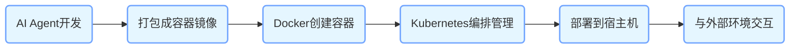

# 容器化部署：简化AI Agent的运维管理

> 关键词：容器化部署、AI Agent、运维管理、Docker、Kubernetes

> 摘要：本文围绕容器化部署如何简化AI Agent的运维管理展开。首先介绍了容器化部署及AI Agent的背景知识，接着阐述相关核心概念与联系，详细讲解核心算法原理与具体操作步骤，探讨数学模型和公式。通过项目实战展示代码案例并进行解读分析，介绍实际应用场景，推荐相关工具和资源。最后总结未来发展趋势与挑战，提供常见问题解答及扩展阅读参考资料，旨在帮助读者全面理解容器化部署对AI Agent运维管理的重要性和实践方法。

## 1. 背景介绍 
### 1.1 目的和范围
目的在于深入探讨容器化部署在简化AI Agent运维管理方面的作用和优势。随着AI技术的快速发展，AI Agent的应用越来越广泛，其运维管理的复杂性也日益增加。容器化部署作为一种轻量级的虚拟化技术，为解决AI Agent运维难题提供了有效的解决方案。本文的范围涵盖了容器化部署的基本原理、与AI Agent的结合方式、相关算法和数学模型，以及实际项目中的应用案例和工具资源推荐等方面。

### 1.2 预期读者
本文预期读者包括AI领域的开发人员、运维工程师、软件架构师、对容器化技术和AI Agent感兴趣的技术爱好者以及相关领域的研究人员。这些读者希望通过本文了解容器化部署如何优化AI Agent的运维管理，掌握相关技术和实践方法，以提升工作效率和技术水平。

### 1.3 文档结构概述
本文首先介绍容器化部署和AI Agent的背景知识，包括目的、预期读者和文档结构概述等内容。接着阐述核心概念与联系，通过文本示意图和Mermaid流程图展示其架构关系。然后详细讲解核心算法原理和具体操作步骤，并结合Python源代码进行说明。之后探讨数学模型和公式，通过举例加深理解。再通过项目实战展示代码案例并进行详细解读分析。介绍实际应用场景，推荐相关工具和资源。最后总结未来发展趋势与挑战，提供常见问题解答及扩展阅读参考资料。

### 1.4 术语表
#### 1.4.1 核心术语定义
- **容器化部署**：将应用程序及其依赖项打包成一个独立的容器，使其可以在不同的环境中运行的技术。
- **AI Agent**：能够感知环境、做出决策并采取行动以实现特定目标的智能实体。
- **Docker**：一种流行的容器化技术，用于创建、部署和运行容器。
- **Kubernetes**：一个开源的容器编排系统，用于自动化容器的部署、扩展和管理。

#### 1.4.2 相关概念解释
- **容器**：容器是一种轻量级的虚拟化技术，它将应用程序及其依赖项打包在一起，提供了隔离的运行环境。
- **镜像**：镜像是容器的模板，包含了应用程序及其依赖项的文件系统和配置信息。
- **编排**：编排是指自动化管理多个容器的过程，包括容器的部署、扩展、负载均衡等。

#### 1.4.3 缩略词列表
- **CPU**：Central Processing Unit，中央处理器
- **GPU**：Graphics Processing Unit，图形处理器
- **RAM**：Random Access Memory，随机存取存储器
- **API**：Application Programming Interface，应用程序编程接口

## 2. 核心概念与联系 
### 核心概念原理
#### 容器化部署原理
容器化部署基于操作系统级虚拟化技术，通过将应用程序及其依赖项打包成一个独立的容器，实现了应用程序的隔离和可移植性。容器共享宿主机的操作系统内核，因此启动速度快、资源占用少。Docker是最常用的容器化技术，它使用镜像来创建容器。镜像包含了应用程序的所有文件和配置信息，用户可以通过Docker命令将镜像部署到不同的环境中。

#### AI Agent原理
AI Agent是一种智能实体，它能够感知环境、做出决策并采取行动以实现特定目标。AI Agent通常由感知模块、决策模块和执行模块组成。感知模块用于获取环境信息，决策模块根据感知信息做出决策，执行模块根据决策采取行动。AI Agent可以基于不同的算法和模型实现，如机器学习、深度学习等。

### 架构的文本示意图
容器化部署与AI Agent的架构关系可以描述如下：AI Agent作为一个应用程序，被打包成容器镜像。Docker负责创建和管理这些容器，将其部署到宿主机上。Kubernetes作为容器编排系统，负责自动化管理多个容器，包括容器的部署、扩展、负载均衡等。容器通过网络与外部环境进行交互，实现AI Agent的感知和执行功能。

### Mermaid流程图


## 3. 核心算法原理 & 具体操作步骤 
### 核心算法原理
#### Docker容器创建算法
Docker创建容器的过程主要包括以下几个步骤：
1. **镜像查找**：Docker首先检查本地是否存在所需的镜像，如果不存在，则从镜像仓库中下载。
2. **容器创建**：Docker根据镜像创建一个新的容器实例，为容器分配独立的文件系统、网络和进程空间。
3. **容器启动**：Docker启动容器中的应用程序，使其开始运行。

#### Kubernetes容器编排算法
Kubernetes的容器编排算法主要基于调度器和控制器实现。调度器负责将容器调度到合适的节点上，控制器负责监控容器的状态并进行相应的调整。Kubernetes的调度算法考虑了多个因素，如节点的资源利用率、容器的资源需求、网络拓扑等。

### 具体操作步骤
#### Docker操作步骤
以下是使用Docker创建和运行容器的Python代码示例：
```python
import docker

# 连接到Docker守护进程
client = docker.from_env()

# 拉取镜像
image_name = "python:3.9"
client.images.pull(image_name)

# 创建容器
container = client.containers.create(
    image=image_name,
    command="python -c 'print(\"Hello, World!\")'",
    detach=True
)

# 启动容器
container.start()

# 获取容器日志
logs = container.logs().decode('utf-8')
print(logs)

# 停止并删除容器
container.stop()
container.remove()
```
#### Kubernetes操作步骤
以下是使用Python的`kubernetes-client`库创建和管理Kubernetes资源的示例代码：
```python
from kubernetes import client, config

# 加载Kubernetes配置
config.load_kube_config()

# 创建一个Pod
v1 = client.CoreV1Api()
pod_manifest = {
    'apiVersion': 'v1',
    'kind': 'Pod',
    'metadata': {
        'name': 'my-pod'
    },
    'spec': {
        'containers': [{
            'image': 'python:3.9',
            'name': 'python-container',
            'command': ['python', '-c', 'print("Hello, Kubernetes!")']
        }]
    }
}
v1.create_namespaced_pod(namespace='default', body=pod_manifest)

# 获取Pod列表
pod_list = v1.list_namespaced_pod(namespace='default')
for pod in pod_list.items:
    print(f"Pod name: {pod.metadata.name}, Status: {pod.status.phase}")

# 删除Pod
v1.delete_namespaced_pod(name='my-pod', namespace='default')
```

## 4. 数学模型和公式 & 详细讲解 & 举例说明 
### 资源分配数学模型
在容器化部署中，资源分配是一个重要的问题。为了优化资源利用率，我们可以使用线性规划模型来进行资源分配。

#### 线性规划模型
假设我们有 $n$ 个容器和 $m$ 种资源，每个容器 $i$ 对资源 $j$ 的需求为 $r_{ij}$，每个节点 $k$ 上资源 $j$ 的可用量为 $c_{jk}$，我们的目标是最大化容器的部署数量。

设 $x_{ik}$ 为一个二进制变量，表示容器 $i$ 是否部署在节点 $k$ 上。则线性规划模型可以表示为：

$$
\begin{align*}
\max &\sum_{i=1}^{n}\sum_{k=1}^{m}x_{ik}\\
\text{s.t.} &\sum_{i=1}^{n}r_{ij}x_{ik} \leq c_{jk}, \quad \forall j = 1, \cdots, m, \forall k = 1, \cdots, m\\
&\sum_{k=1}^{m}x_{ik} \leq 1, \quad \forall i = 1, \cdots, n\\
&x_{ik} \in \{0, 1\}, \quad \forall i = 1, \cdots, n, \forall k = 1, \cdots, m
\end{align*}
$$

#### 详细讲解
- **目标函数**：$\sum_{i=1}^{n}\sum_{k=1}^{m}x_{ik}$ 表示最大化部署的容器数量。
- **约束条件**：
  - $\sum_{i=1}^{n}r_{ij}x_{ik} \leq c_{jk}$ 表示每个节点上的资源使用量不能超过其可用量。
  - $\sum_{k=1}^{m}x_{ik} \leq 1$ 表示每个容器只能部署在一个节点上。
  - $x_{ik} \in \{0, 1\}$ 表示 $x_{ik}$ 是一个二进制变量。

#### 举例说明
假设我们有 2 个容器和 2 个节点，每个容器对 CPU 和内存的需求如下表所示：

| 容器 | CPU 需求 | 内存需求 |
|------|----------|----------|
| 1    | 2        | 4        |
| 2    | 3        | 5        |

每个节点的 CPU 和内存可用量如下表所示：

| 节点 | CPU 可用量 | 内存可用量 |
|------|------------|------------|
| 1    | 5          | 8          |
| 2    | 6          | 10         |

则线性规划模型可以表示为：

$$
\begin{align*}
\max &x_{11} + x_{12} + x_{21} + x_{22}\\
\text{s.t.} &2x_{11} + 3x_{21} \leq 5\\
&2x_{12} + 3x_{22} \leq 6\\
&4x_{11} + 5x_{21} \leq 8\\
&4x_{12} + 5x_{22} \leq 10\\
&x_{11} + x_{12} \leq 1\\
&x_{21} + x_{22} \leq 1\\
&x_{11}, x_{12}, x_{21}, x_{22} \in \{0, 1\}
\end{align*}
$$

通过求解这个线性规划模型，我们可以得到最优的容器部署方案。

## 5. 项目实战：代码实际案例和详细解释说明 
### 5.1  开发环境搭建
#### 安装Docker
1. **Ubuntu系统**：
```bash
sudo apt-get update
sudo apt-get install docker.io
sudo systemctl start docker
sudo systemctl enable docker
```
2. **CentOS系统**：
```bash
sudo yum install -y yum-utils
sudo yum-config-manager --add-repo https://download.docker.com/linux/centos/docker-ce.repo
sudo yum install docker-ce docker-ce-cli containerd.io
sudo systemctl start docker
sudo systemctl enable docker
```

#### 安装Kubernetes
1. **安装kubeadm、kubelet和kubectl**：
```bash
sudo apt-get update
sudo apt-get install -y apt-transport-https ca-certificates curl
sudo curl -fsSLo /usr/share/keyrings/kubernetes-archive-keyring.gpg https://packages.cloud.google.com/apt/doc/apt-key.gpg
echo "deb [signed-by=/usr/share/keyrings/kubernetes-archive-keyring.gpg] https://apt.kubernetes.io/ kubernetes-xenial main" | sudo tee /etc/apt/sources.list.d/kubernetes.list
sudo apt-get update
sudo apt-get install -y kubelet kubeadm kubectl
sudo apt-mark hold kubelet kubeadm kubectl
```
2. **初始化Kubernetes集群**：
```bash
sudo kubeadm init --pod-network-cidr=10.244.0.0/16
mkdir -p $HOME/.kube
sudo cp -i /etc/kubernetes/admin.conf $HOME/.kube/config
sudo chown $(id -u):$(id -g) $HOME/.kube/config
```
3. **安装网络插件**：
```bash
kubectl apply -f https://raw.githubusercontent.com/coreos/flannel/master/Documentation/kube-flannel.yml
```

### 5.2  源代码详细实现和代码解读
#### 构建AI Agent容器镜像
以下是一个简单的AI Agent示例代码，使用Python实现一个基于规则的聊天机器人：
```python
# chatbot.py
responses = {
    "你好": "你好呀！",
    "再见": "再见，祝你有个好心情！"
}

def chatbot(input_text):
    if input_text in responses:
        return responses[input_text]
    else:
        return "我不太理解你的意思。"

if __name__ == "__main__":
    while True:
        user_input = input("请输入你的问题：")
        if user_input.lower() == 'exit':
            break
        print(chatbot(user_input))
```
以下是Dockerfile，用于构建容器镜像：
```Dockerfile
# 使用Python基础镜像
FROM python:3.9

# 设置工作目录
WORKDIR /app

# 复制代码到工作目录
COPY chatbot.py .

# 运行聊天机器人
CMD ["python", "chatbot.py"]
```
构建镜像的命令：
```bash
docker build -t chatbot:1.0 .
```

#### 在Kubernetes中部署AI Agent
以下是Kubernetes的Deployment和Service配置文件：
```yaml
# deployment.yaml
apiVersion: apps/v1
kind: Deployment
metadata:
  name: chatbot-deployment
spec:
  replicas: 3
  selector:
    matchLabels:
      app: chatbot
  template:
    metadata:
      labels:
        app: chatbot
    spec:
      containers:
      - name: chatbot-container
        image: chatbot:1.0
        ports:
        - containerPort: 80

# service.yaml
apiVersion: v1
kind: Service
metadata:
  name: chatbot-service
spec:
  selector:
    app: chatbot
  ports:
    - protocol: TCP
      port: 80
      targetPort: 80
  type: LoadBalancer
```
部署到Kubernetes集群的命令：
```bash
kubectl apply -f deployment.yaml
kubectl apply -f service.yaml
```

### 5.3  代码解读与分析
#### 容器镜像构建
- `FROM python:3.9`：指定基础镜像为Python 3.9。
- `WORKDIR /app`：设置工作目录为 `/app`。
- `COPY chatbot.py .`：将 `chatbot.py` 文件复制到工作目录。
- `CMD ["python", "chatbot.py"]`：指定容器启动时执行的命令。

#### Kubernetes部署
- `Deployment`：定义了应用程序的副本数量、选择器和容器配置。`replicas: 3` 表示创建 3 个副本，以实现高可用性。
- `Service`：将Deployment暴露为一个服务，`type: LoadBalancer` 表示使用负载均衡器将流量分发到不同的副本。

## 6. 实际应用场景 
### 智能客服系统
在智能客服系统中，AI Agent可以自动回答用户的问题，提高客户服务效率。通过容器化部署，可以将AI Agent快速部署到不同的环境中，实现多实例运行，提高系统的并发处理能力。同时，容器化部署还可以方便地进行版本管理和更新，确保AI Agent的性能和功能始终保持最佳状态。

### 智能安防系统
在智能安防系统中，AI Agent可以通过视频监控和图像识别技术，实时监测异常行为并发出警报。容器化部署可以将AI Agent部署到边缘设备上，减少数据传输延迟，提高系统的响应速度。此外，容器化部署还可以实现资源的动态分配，根据实际需求调整AI Agent的计算资源，提高系统的资源利用率。

### 智能物流系统
在智能物流系统中，AI Agent可以通过对物流数据的分析和预测，优化物流路线和配送计划，提高物流效率。容器化部署可以将AI Agent部署到物流节点上，实现分布式计算，提高系统的处理能力。同时，容器化部署还可以方便地与其他物流系统进行集成，实现数据的共享和交互。

## 7. 工具和资源推荐
### 7.1 学习资源推荐
#### 7.1.1 书籍推荐
- 《Docker实战》：全面介绍了Docker的基本原理、使用方法和实践案例，适合初学者学习。
- 《Kubernetes实战》：详细讲解了Kubernetes的核心概念、架构和应用场景，是学习Kubernetes的经典书籍。
- 《Python机器学习》：介绍了Python在机器学习领域的应用，包括算法原理、代码实现和案例分析，对于理解AI Agent的实现原理有很大帮助。

#### 7.1.2 在线课程
- Coursera上的“容器化应用开发与部署”课程：由知名高校和企业的专家授课，系统地介绍了容器化技术的相关知识和实践方法。
- Udemy上的“Kubernetes实战教程”课程：通过实际项目案例，帮助学员掌握Kubernetes的使用和运维技巧。
- 阿里云大学的“AI技术入门”课程：介绍了AI的基本概念、算法和应用场景，为学习AI Agent提供了基础知识。

#### 7.1.3 技术博客和网站
- Docker官方博客：提供了Docker的最新技术动态、实践案例和使用技巧。
- Kubernetes官方文档：是学习Kubernetes的权威资料，包含了详细的文档和教程。
- Medium上的AI相关博客：有很多关于AI Agent、机器学习和深度学习的技术文章和案例分享。

### 7.2 开发工具框架推荐
#### 7.2.1 IDE和编辑器
- Visual Studio Code：一款轻量级的开源代码编辑器，支持多种编程语言和插件，适合开发容器化应用和AI Agent。
- PyCharm：专业的Python集成开发环境，提供了丰富的调试和代码分析工具，方便开发Python代码。
- IntelliJ IDEA：一款功能强大的Java集成开发环境，也支持其他编程语言，适合开发基于Java的容器化应用。

#### 7.2.2 调试和性能分析工具
- Docker Desktop：提供了图形化界面，方便管理和调试Docker容器。
- Kubernetes Dashboard：是Kubernetes的官方图形化管理工具，可用于监控和管理Kubernetes集群。
- Prometheus和Grafana：用于监控和分析容器化应用的性能指标，帮助优化系统性能。

#### 7.2.3 相关框架和库
- Docker SDK for Python：提供了Python接口，方便使用Python代码管理Docker容器。
- Kubernetes-client：是Kubernetes的官方Python客户端库，可用于编写Python脚本管理Kubernetes资源。
- TensorFlow和PyTorch：是流行的深度学习框架，可用于开发AI Agent的机器学习模型。

### 7.3 相关论文著作推荐
#### 7.3.1 经典论文
- “Borg, Omega, and Kubernetes: Lessons Learned from Three Container-Cluster Managers”：介绍了Google的容器集群管理系统Borg、Omega和Kubernetes的设计理念和实践经验。
- “Machine Learning: A Probabilistic Perspective”：从概率的角度介绍了机器学习的基本原理和算法，是机器学习领域的经典著作。

#### 7.3.2 最新研究成果
- 关注ACM SIGOPS、IEEE Transactions on Parallel and Distributed Systems等学术期刊和会议，获取容器化技术和AI Agent的最新研究成果。

#### 7.3.3 应用案例分析
- 阅读各大科技公司的技术博客和开源项目，了解容器化部署和AI Agent在实际应用中的案例和经验分享。

## 8. 总结：未来发展趋势与挑战
### 未来发展趋势
#### 混合云与多云部署
随着企业对云计算的依赖越来越大，混合云与多云部署将成为未来容器化部署的重要趋势。企业可以将AI Agent部署在不同的云平台和数据中心，实现资源的优化配置和高可用性。

#### AI与容器化的深度融合
未来，AI技术将与容器化技术深度融合，实现AI Agent的自动化部署、优化和管理。例如，通过AI算法自动调整容器的资源分配，提高系统的性能和效率。

#### 边缘计算与容器化
边缘计算将成为未来AI Agent应用的重要场景，容器化技术可以将AI Agent部署到边缘设备上，实现数据的本地处理和实时响应。

### 挑战
#### 安全问题
容器化部署和AI Agent的安全问题是一个重要的挑战。容器的隔离性可能存在漏洞，导致数据泄露和恶意攻击。同时，AI Agent的模型和数据也需要保护，防止被篡改和滥用。

#### 资源管理问题
随着AI Agent的复杂度和计算需求不断增加，资源管理将成为一个挑战。如何合理分配资源，提高资源利用率，是需要解决的问题。

#### 兼容性问题
不同的容器化技术和AI框架之间可能存在兼容性问题，如何确保AI Agent在不同的环境中正常运行，是需要考虑的问题。

## 9. 附录：常见问题与解答
### 容器化部署和虚拟机部署有什么区别？
容器化部署和虚拟机部署都是实现应用程序隔离和可移植性的技术，但它们有以下区别：
- **虚拟化层次**：虚拟机是在硬件层进行虚拟化，每个虚拟机都有自己独立的操作系统；而容器是在操作系统层进行虚拟化，多个容器共享宿主机的操作系统内核。
- **资源占用**：虚拟机的资源占用较大，启动速度较慢；而容器的资源占用较小，启动速度快。
- **隔离性**：虚拟机的隔离性较强，不同虚拟机之间完全隔离；而容器的隔离性相对较弱，但可以通过一些技术手段提高隔离性。

### 如何确保容器化部署的安全性？
可以采取以下措施确保容器化部署的安全性：
- **使用安全的基础镜像**：选择官方或经过验证的基础镜像，避免使用来源不明的镜像。
- **定期更新镜像**：及时更新镜像，修复安全漏洞。
- **限制容器权限**：为容器设置最小权限，避免容器拥有过高的权限。
- **网络安全**：使用网络策略限制容器之间的通信，防止网络攻击。

### 如何优化Kubernetes集群的性能？
可以采取以下措施优化Kubernetes集群的性能：
- **合理分配资源**：根据应用程序的需求，合理分配CPU、内存等资源。
- **使用自动伸缩**：使用Horizontal Pod Autoscaler（HPA）和Cluster Autoscaler（CA）实现容器和节点的自动伸缩。
- **优化网络配置**：选择合适的网络插件，优化网络拓扑，减少网络延迟。
- **监控和分析**：使用Prometheus和Grafana等工具监控集群的性能指标，及时发现和解决问题。

## 10. 扩展阅读 & 参考资料
### 扩展阅读
- 《云计算实战》：介绍了云计算的基本概念、架构和应用场景，对于理解容器化部署的背景和意义有很大帮助。
- 《人工智能简史》：回顾了人工智能的发展历程和重要事件，对于了解AI Agent的发展趋势有一定的参考价值。

### 参考资料
- Docker官方文档：https://docs.docker.com/
- Kubernetes官方文档：https://kubernetes.io/docs/
- TensorFlow官方文档：https://www.tensorflow.org/
- PyTorch官方文档：https://pytorch.org/