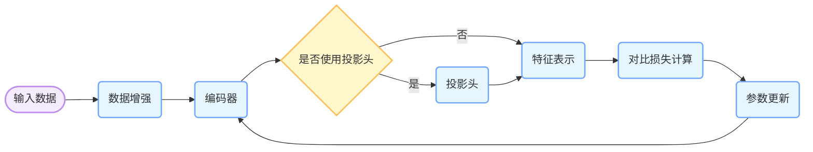

# 对比表示学习:提升特征质量与泛化能力

> 关键词：对比表示学习、特征质量、泛化能力、深度学习、自监督学习

> 摘要：本文深入探讨了对比表示学习这一前沿技术，旨在提升特征质量与泛化能力。首先介绍了对比表示学习的背景，包括目的、预期读者、文档结构和相关术语。接着阐述了核心概念与联系，给出了原理和架构的文本示意图及 Mermaid 流程图。详细讲解了核心算法原理，并用 Python 代码进行了说明。介绍了相关的数学模型和公式，并举例说明。通过项目实战展示了代码的实际应用和详细解释。分析了实际应用场景，推荐了学习资源、开发工具框架和相关论文著作。最后总结了未来发展趋势与挑战，并提供了常见问题解答和扩展阅读参考资料。

## 1. 背景介绍 
### 1.1 目的和范围
在深度学习领域，特征的质量和泛化能力对于模型的性能至关重要。传统的监督学习方法往往需要大量的标注数据，这在实际应用中不仅成本高昂，而且难以获取。对比表示学习作为一种自监督学习方法，通过对比不同样本之间的相似性和差异性来学习特征表示，能够在无监督或少量监督的情况下提升特征质量和泛化能力。本文的目的是全面介绍对比表示学习的原理、算法、应用场景等方面的内容，帮助读者深入理解这一技术，并能够将其应用到实际项目中。

### 1.2 预期读者
本文的预期读者包括深度学习领域的研究人员、工程师、学生等。对于有一定深度学习基础，希望进一步了解自监督学习和特征表示学习的读者，本文将提供有价值的参考。对于初学者，本文也会尽量使用通俗易懂的语言进行讲解，帮助他们逐步建立对对比表示学习的认识。

### 1.3 文档结构概述
本文将按照以下结构进行组织：首先介绍对比表示学习的背景和相关术语，让读者对该领域有一个初步的了解。接着阐述核心概念与联系，包括原理和架构的示意图及流程图，帮助读者建立整体的认知框架。然后详细讲解核心算法原理，并使用 Python 代码进行说明，让读者能够深入理解算法的实现细节。之后介绍相关的数学模型和公式，并举例说明，使读者能够从理论层面进一步掌握对比表示学习。通过项目实战展示代码的实际应用和详细解释，让读者能够将所学知识应用到实际项目中。分析实际应用场景，让读者了解对比表示学习在不同领域的应用价值。推荐学习资源、开发工具框架和相关论文著作，帮助读者进一步深入学习和研究。最后总结未来发展趋势与挑战，并提供常见问题解答和扩展阅读参考资料。

### 1.4 术语表
#### 1.4.1 核心术语定义
- **对比表示学习（Contrastive Representation Learning）**：一种自监督学习方法，通过对比不同样本之间的相似性和差异性来学习特征表示。
- **特征质量（Feature Quality）**：指特征能够准确、有效地表示数据的能力，高质量的特征能够提高模型的性能。
- **泛化能力（Generalization Ability）**：模型在未见过的数据上的表现能力，泛化能力强的模型能够在不同的数据集上取得较好的效果。
- **自监督学习（Self-Supervised Learning）**：一种无需人工标注数据的学习方法，通过利用数据自身的结构和信息来学习特征表示。
- **正样本对（Positive Pairs）**：在对比表示学习中，具有相似特征的样本对。
- **负样本对（Negative Pairs）**：在对比表示学习中，具有不同特征的样本对。

#### 1.4.2 相关概念解释
- **表示学习（Representation Learning）**：旨在自动学习数据的有效表示，以便于后续的机器学习任务。对比表示学习是表示学习的一种具体方法。
- **对比损失（Contrastive Loss）**：用于衡量正样本对和负样本对之间的差异，通过最小化对比损失来学习特征表示。
- **编码器（Encoder）**：将输入数据映射到特征空间的神经网络模型，在对比表示学习中，编码器的作用是学习数据的特征表示。

#### 1.4.3 缩略词列表
- **SSL**：Self-Supervised Learning（自监督学习）
- **CL**：Contrastive Learning（对比学习）
- **MLP**：Multi-Layer Perceptron（多层感知机）

## 2. 核心概念与联系 

### 核心概念原理
对比表示学习的核心思想是通过对比不同样本之间的相似性和差异性来学习特征表示。具体来说，它将输入数据通过编码器映射到特征空间，然后定义一个对比损失函数，该函数鼓励正样本对在特征空间中距离较近，负样本对在特征空间中距离较远。通过最小化对比损失，编码器可以学习到数据的有效特征表示。

### 架构的文本示意图
假设我们有一个输入数据集 $\mathcal{D}=\{x_1,x_2,\cdots,x_n\}$，对比表示学习的架构主要包括以下几个部分：
1. **数据增强模块**：对输入数据进行随机的数据增强操作，如旋转、裁剪、翻转等，得到不同的视图。例如，对于图像数据 $x_i$，经过数据增强后得到 $x_i^a$ 和 $x_i^b$，这两个视图可以看作是正样本对。
2. **编码器**：将输入数据（包括原始数据和增强后的数据）映射到特征空间。设编码器为 $f_{\theta}$，其中 $\theta$ 是编码器的参数。对于输入 $x_i^a$ 和 $x_i^b$，经过编码器后得到特征表示 $z_i^a = f_{\theta}(x_i^a)$ 和 $z_i^b = f_{\theta}(x_i^b)$。
3. **投影头（可选）**：为了进一步优化特征表示，有时会在编码器之后添加一个投影头 $g_{\phi}$，将编码器输出的特征表示映射到一个新的特征空间。即 $h_i^a = g_{\phi}(z_i^a)$ 和 $h_i^b = g_{\phi}(z_i^b)$。
4. **对比损失函数**：计算正样本对和负样本对之间的损失。常见的对比损失函数有 InfoNCE（Info Noise Contrastive Estimation）损失等。通过最小化对比损失，更新编码器和投影头的参数 $\theta$ 和 $\phi$。

### Mermaid 流程图


该流程图展示了对比表示学习的主要流程：首先对输入数据进行数据增强，然后通过编码器得到特征表示。根据是否使用投影头，可能会对特征表示进行进一步的映射。接着计算对比损失，并根据损失更新编码器和投影头的参数，不断迭代优化。

## 3. 核心算法原理 & 具体操作步骤 

### 核心算法原理
对比表示学习的核心算法主要围绕对比损失函数的设计和优化展开。这里以 InfoNCE 损失为例进行介绍。

InfoNCE 损失的基本思想是通过最大化正样本对之间的互信息，同时最小化正样本对与负样本对之间的互信息来学习特征表示。对于一个正样本对 $(z_i^a, z_i^b)$ 和一组负样本对 $\{(z_j^a, z_j^b)\}_{j\neq i}$，InfoNCE 损失定义如下：

$$
\mathcal{L}_{i} = -\log\frac{\exp(\text{sim}(z_i^a, z_i^b)/\tau)}{\sum_{j=1}^{N}\exp(\text{sim}(z_i^a, z_j^b)/\tau)}
$$

其中，$\text{sim}(u, v)$ 表示两个特征向量 $u$ 和 $v$ 之间的相似度，通常使用余弦相似度：

$$
\text{sim}(u, v) = \frac{u^T v}{\|u\|\|v\|}
$$

$\tau$ 是一个温度参数，用于控制损失函数的平滑程度。

### 具体操作步骤
以下是使用 Python 和 PyTorch 实现对比表示学习的具体步骤：

```python
import torch
import torch.nn as nn
import torch.optim as optim
import torch.nn.functional as F

# 定义编码器
class Encoder(nn.Module):
    def __init__(self, input_dim, hidden_dim, output_dim):
        super(Encoder, self).__init__()
        self.fc1 = nn.Linear(input_dim, hidden_dim)
        self.fc2 = nn.Linear(hidden_dim, output_dim)

    def forward(self, x):
        x = F.relu(self.fc1(x))
        x = self.fc2(x)
        return x

# 定义投影头
class ProjectionHead(nn.Module):
    def __init__(self, input_dim, hidden_dim, output_dim):
        super(ProjectionHead, self).__init__()
        self.fc1 = nn.Linear(input_dim, hidden_dim)
        self.fc2 = nn.Linear(hidden_dim, output_dim)

    def forward(self, x):
        x = F.relu(self.fc1(x))
        x = self.fc2(x)
        return x

# 定义 InfoNCE 损失函数
def info_nce_loss(features, tau=0.07):
    batch_size = features.shape[0]
    labels = torch.arange(batch_size).to(features.device)
    similarity_matrix = F.cosine_similarity(features.unsqueeze(1), features.unsqueeze(0), dim=2)
    # 去除对角线元素
    mask = torch.eye(batch_size, dtype=torch.bool).to(features.device)
    similarity_matrix = similarity_matrix[~mask].view(batch_size, -1)
    logits = similarity_matrix / tau
    loss = F.cross_entropy(logits, labels)
    return loss

# 初始化编码器和投影头
input_dim = 100
hidden_dim = 256
output_dim = 128
encoder = Encoder(input_dim, hidden_dim, output_dim)
projection_head = ProjectionHead(output_dim, hidden_dim, output_dim)

# 定义优化器
optimizer = optim.Adam(list(encoder.parameters()) + list(projection_head.parameters()), lr=0.001)

# 模拟输入数据
batch_size = 32
input_data = torch.randn(batch_size, input_dim)

# 训练循环
num_epochs = 100
for epoch in range(num_epochs):
    # 前向传播
    features = encoder(input_data)
    projected_features = projection_head(features)

    # 计算损失
    loss = info_nce_loss(projected_features)

    # 反向传播和参数更新
    optimizer.zero_grad()
    loss.backward()
    optimizer.step()

    if (epoch + 1) % 10 == 0:
        print(f'Epoch [{epoch+1}/{num_epochs}], Loss: {loss.item():.4f}')
```

### 代码解释
1. **编码器和投影头的定义**：`Encoder` 类和 `ProjectionHead` 类分别定义了编码器和投影头的神经网络结构。这里使用了简单的全连接层，实际应用中可以根据具体任务选择更复杂的网络结构。
2. **InfoNCE 损失函数的实现**：`info_nce_loss` 函数实现了 InfoNCE 损失的计算。首先计算特征之间的余弦相似度矩阵，然后去除对角线元素，最后使用交叉熵损失函数计算损失。
3. **训练循环**：在训练循环中，首先将输入数据通过编码器和投影头得到特征表示，然后计算 InfoNCE 损失，最后进行反向传播和参数更新。

## 4. 数学模型和公式 & 详细讲解 & 举例说明 

### 数学模型和公式
#### InfoNCE 损失的推导
InfoNCE 损失的推导基于信息论中的互信息概念。互信息 $I(X; Y)$ 表示两个随机变量 $X$ 和 $Y$ 之间的依赖程度，定义为：

$$
I(X; Y) = \sum_{x,y} p(x,y) \log\frac{p(x,y)}{p(x)p(y)}
$$

在对比表示学习中，我们希望最大化正样本对之间的互信息，同时最小化正样本对与负样本对之间的互信息。InfoNCE 损失通过近似互信息的最大似然估计来实现这一目标。

假设我们有一个正样本对 $(z_i^a, z_i^b)$ 和一组负样本对 $\{(z_j^a, z_j^b)\}_{j\neq i}$，我们可以将其看作一个分类问题，其中正样本对的标签为 1，负样本对的标签为 0。InfoNCE 损失可以看作是这个分类问题的交叉熵损失。

#### 详细讲解
InfoNCE 损失的分子 $\exp(\text{sim}(z_i^a, z_i^b)/\tau)$ 表示正样本对之间的相似度得分，分母 $\sum_{j=1}^{N}\exp(\text{sim}(z_i^a, z_j^b)/\tau)$ 表示正样本对与所有样本对（包括正样本对和负样本对）之间的相似度得分之和。通过取对数和取负号，我们可以将最大化正样本对之间的相似度转化为最小化 InfoNCE 损失。

温度参数 $\tau$ 控制了损失函数的平滑程度。当 $\tau$ 较小时，损失函数对相似度得分的差异更加敏感，模型会更加关注正样本对和负样本对之间的差异；当 $\tau$ 较大时，损失函数对相似度得分的差异更加平滑，模型会更加关注整体的相似度分布。

### 举例说明
假设我们有一个简单的二维特征向量数据集，正样本对为 $(z_1^a = [1, 0], z_1^b = [1, 0])$，负样本对为 $(z_2^a = [0, 1], z_2^b = [0, 1])$。温度参数 $\tau = 0.1$。

首先计算相似度得分：
- $\text{sim}(z_1^a, z_1^b) = \frac{[1, 0]^T [1, 0]}{\|[1, 0]\|\|[1, 0]\|} = 1$
- $\text{sim}(z_1^a, z_2^b) = \frac{[1, 0]^T [0, 1]}{\|[1, 0]\|\|[0, 1]\|} = 0$

然后计算 InfoNCE 损失：
$$
\mathcal{L}_{1} = -\log\frac{\exp(1/0.1)}{\exp(1/0.1) + \exp(0/0.1)} = -\log\frac{\exp(10)}{\exp(10) + 1} \approx 0
$$

这个例子表明，当正样本对之间的相似度很高，负样本对之间的相似度很低时，InfoNCE 损失会趋近于 0。

## 5. 项目实战：代码实际案例和详细解释说明 

### 5.1  开发环境搭建
#### 安装 Python 和 PyTorch
首先，确保你已经安装了 Python 3.x。可以从 Python 官方网站（https://www.python.org/downloads/） 下载并安装。

然后，安装 PyTorch。根据你的 CUDA 版本和操作系统，选择合适的安装命令。例如，如果你使用的是 CUDA 11.3 和 Linux 系统，可以使用以下命令安装：

```sh
pip install torch torchvision torchaudio --extra-index-url https://download.pytorch.org/whl/cu113
```

#### 安装其他依赖库
除了 PyTorch，还需要安装一些其他的依赖库，如 `numpy`、`matplotlib` 等。可以使用以下命令安装：

```sh
pip install numpy matplotlib
```

### 5.2  源代码详细实现和代码解读
以下是一个基于 CIFAR-10 数据集的对比表示学习项目的完整代码：

```python
import torch
import torch.nn as nn
import torch.optim as optim
import torchvision
import torchvision.transforms as transforms
from torch.utils.data import DataLoader

# 定义编码器
class Encoder(nn.Module):
    def __init__(self):
        super(Encoder, self).__init__()
        self.conv1 = nn.Conv2d(3, 64, kernel_size=3, stride=1, padding=1)
        self.relu1 = nn.ReLU()
        self.pool1 = nn.MaxPool2d(kernel_size=2, stride=2)
        self.conv2 = nn.Conv2d(64, 128, kernel_size=3, stride=1, padding=1)
        self.relu2 = nn.ReLU()
        self.pool2 = nn.MaxPool2d(kernel_size=2, stride=2)
        self.fc1 = nn.Linear(128 * 8 * 8, 256)
        self.relu3 = nn.ReLU()
        self.fc2 = nn.Linear(256, 128)

    def forward(self, x):
        x = self.pool1(self.relu1(self.conv1(x)))
        x = self.pool2(self.relu2(self.conv2(x)))
        x = x.view(-1, 128 * 8 * 8)
        x = self.relu3(self.fc1(x))
        x = self.fc2(x)
        return x

# 定义投影头
class ProjectionHead(nn.Module):
    def __init__(self):
        super(ProjectionHead, self).__init__()
        self.fc1 = nn.Linear(128, 256)
        self.relu = nn.ReLU()
        self.fc2 = nn.Linear(256, 128)

    def forward(self, x):
        x = self.relu(self.fc1(x))
        x = self.fc2(x)
        return x

# 定义 InfoNCE 损失函数
def info_nce_loss(features, tau=0.07):
    batch_size = features.shape[0]
    labels = torch.arange(batch_size).to(features.device)
    similarity_matrix = F.cosine_similarity(features.unsqueeze(1), features.unsqueeze(0), dim=2)
    # 去除对角线元素
    mask = torch.eye(batch_size, dtype=torch.bool).to(features.device)
    similarity_matrix = similarity_matrix[~mask].view(batch_size, -1)
    logits = similarity_matrix / tau
    loss = F.cross_entropy(logits, labels)
    return loss

# 数据增强
transform = transforms.Compose([
    transforms.RandomResizedCrop(32),
    transforms.RandomHorizontalFlip(),
    transforms.ToTensor(),
    transforms.Normalize((0.5, 0.5, 0.5), (0.5, 0.5, 0.5))
])

# 加载 CIFAR-10 数据集
trainset = torchvision.datasets.CIFAR10(root='./data', train=True,
                                        download=True, transform=transform)
trainloader = DataLoader(trainset, batch_size=32, shuffle=True)

# 初始化编码器和投影头
encoder = Encoder()
projection_head = ProjectionHead()

# 定义优化器
optimizer = optim.Adam(list(encoder.parameters()) + list(projection_head.parameters()), lr=0.001)

# 训练循环
num_epochs = 10
device = torch.device("cuda" if torch.cuda.is_available() else "cpu")
encoder.to(device)
projection_head.to(device)

for epoch in range(num_epochs):
    running_loss = 0.0
    for i, data in enumerate(trainloader, 0):
        inputs, _ = data
        inputs = inputs.to(device)

        # 前向传播
        features = encoder(inputs)
        projected_features = projection_head(features)

        # 计算损失
        loss = info_nce_loss(projected_features)

        # 反向传播和参数更新
        optimizer.zero_grad()
        loss.backward()
        optimizer.step()

        running_loss += loss.item()
        if (i + 1) % 100 == 0:
            print(f'Epoch [{epoch+1}/{num_epochs}], Step [{i+1}/{len(trainloader)}], Loss: {running_loss / 100:.4f}')
            running_loss = 0.0

print('Finished Training')
```

### 5.3  代码解读与分析
#### 编码器和投影头
- **编码器**：`Encoder` 类定义了一个简单的卷积神经网络，用于将输入的图像数据映射到特征空间。它包含两个卷积层、两个池化层和两个全连接层。
- **投影头**：`ProjectionHead` 类定义了一个简单的全连接神经网络，用于将编码器输出的特征表示映射到一个新的特征空间。

#### 数据增强
使用 `torchvision.transforms` 模块对输入的图像数据进行随机裁剪、水平翻转、归一化等操作，得到不同的视图，作为正样本对。

#### 训练循环
在训练循环中，首先将输入数据通过编码器和投影头得到特征表示，然后计算 InfoNCE 损失，最后进行反向传播和参数更新。通过多次迭代训练，编码器和投影头的参数不断优化，从而学习到数据的有效特征表示。

## 6. 实际应用场景 
### 计算机视觉领域
- **图像分类**：在图像分类任务中，对比表示学习可以用于预训练模型，通过学习图像的特征表示，提高模型在分类任务上的性能。例如，在 ImageNet 数据集上进行对比表示学习预训练，然后在其他图像分类数据集上进行微调，可以显著提高模型的准确率。
- **目标检测**：对比表示学习可以帮助模型学习到目标的特征表示，提高目标检测的精度。例如，在检测不同类别的物体时，通过对比不同物体的特征表示，模型可以更好地区分不同的物体。
- **图像检索**：在图像检索任务中，对比表示学习可以将图像映射到特征空间，通过计算特征之间的相似度来进行图像检索。例如，用户输入一张查询图像，系统可以通过对比查询图像和数据库中图像的特征表示，找到最相似的图像。

### 自然语言处理领域
- **文本分类**：对比表示学习可以用于学习文本的特征表示，提高文本分类的性能。例如，在情感分析任务中，通过对比不同情感的文本特征表示，模型可以更好地判断文本的情感倾向。
- **语义相似度计算**：在语义相似度计算任务中，对比表示学习可以将文本映射到特征空间，通过计算特征之间的相似度来判断文本的语义相似度。例如，在问答系统中，通过对比用户问题和候选答案的特征表示，找到最相似的答案。
- **机器翻译**：对比表示学习可以帮助模型学习到不同语言之间的语义关系，提高机器翻译的质量。例如，在翻译任务中，通过对比源语言和目标语言的文本特征表示，模型可以更好地理解语言之间的对应关系。

### 音频处理领域
- **语音识别**：对比表示学习可以用于学习语音的特征表示，提高语音识别的准确率。例如，在语音识别任务中，通过对比不同语音片段的特征表示，模型可以更好地区分不同的语音内容。
- **音频分类**：在音频分类任务中，对比表示学习可以帮助模型学习到音频的特征表示，提高音频分类的性能。例如，在音乐分类任务中，通过对比不同音乐风格的音频特征表示，模型可以更好地判断音乐的风格。

## 7. 工具和资源推荐
### 7.1 学习资源推荐
#### 7.1.1 书籍推荐
- 《深度学习》（Deep Learning）：由 Ian Goodfellow、Yoshua Bengio 和 Aaron Courville 合著，是深度学习领域的经典教材，涵盖了深度学习的基本概念、算法和应用。
- 《动手学深度学习》（Dive into Deep Learning）：由 Aston Zhang、Zachary C. Lipton、Mu Li 和 Alexander J. Smola 合著，提供了丰富的代码示例和实践项目，适合初学者快速上手深度学习。

#### 7.1.2 在线课程
- Coursera 上的“深度学习专项课程”（Deep Learning Specialization）：由 Andrew Ng 教授授课，包括五门课程，涵盖了深度学习的各个方面，是学习深度学习的优质课程。
- edX 上的“使用 PyTorch 进行深度学习”（Introduction to Deep Learning with PyTorch）：介绍了如何使用 PyTorch 进行深度学习开发，适合有一定编程基础的学习者。

#### 7.1.3 技术博客和网站
- arXiv.org：是一个预印本服务器，提供了大量的计算机科学和机器学习领域的研究论文，是获取最新研究成果的重要渠道。
- Medium 上的 Towards Data Science：是一个专注于数据科学和机器学习的技术博客，提供了许多高质量的技术文章和教程。

### 7.2 开发工具框架推荐
#### 7.2.1 IDE和编辑器
- PyCharm：是一款专门为 Python 开发设计的集成开发环境（IDE），提供了丰富的功能和插件，适合开发大型的 Python 项目。
- Jupyter Notebook：是一个交互式的开发环境，适合进行数据探索和模型实验，支持 Python、R 等多种编程语言。

#### 7.2.2 调试和性能分析工具
- PyTorch Profiler：是 PyTorch 提供的性能分析工具，可以帮助开发者分析模型的运行时间、内存使用等情况，优化模型性能。
- TensorBoard：是 TensorFlow 提供的可视化工具，也可以与 PyTorch 结合使用，用于可视化模型的训练过程和性能指标。

#### 7.2.3 相关框架和库
- PyTorch：是一个开源的深度学习框架，提供了丰富的深度学习模型和工具，支持 GPU 加速，易于使用和扩展。
- torchvision：是 PyTorch 的计算机视觉库，提供了常用的数据集、模型和图像变换工具，方便进行计算机视觉任务的开发。

### 7.3 相关论文著作推荐
#### 7.3.1 经典论文
- “A Simple Framework for Contrastive Learning of Visual Representations”（SimCLR）：提出了一种简单而有效的对比表示学习框架，在计算机视觉领域取得了很好的效果。
- “Momentum Contrast for Unsupervised Visual Representation Learning”（MoCo）：提出了一种基于动量对比的无监督视觉表示学习方法，解决了对比学习中的负样本选择问题。

#### 7.3.2 最新研究成果
- 关注 arXiv 上关于对比表示学习的最新论文，了解该领域的最新研究动态和技术进展。

#### 7.3.3 应用案例分析
- 阅读相关的技术博客和会议论文，了解对比表示学习在不同领域的应用案例和实践经验。

## 8. 总结：未来发展趋势与挑战
### 未来发展趋势
- **多模态对比表示学习**：将对比表示学习应用于多模态数据，如图像、文本、音频等，学习不同模态数据之间的关联和特征表示，提高模型的综合性能。
- **自监督预训练与微调的结合**：将对比表示学习作为自监督预训练的方法，在大规模无标注数据上进行预训练，然后在小规模有标注数据上进行微调，提高模型在特定任务上的性能。
- **对比表示学习与强化学习的结合**：将对比表示学习应用于强化学习中，学习环境的特征表示，提高智能体的决策能力和学习效率。

### 挑战
- **计算资源需求**：对比表示学习通常需要大量的计算资源和时间，尤其是在处理大规模数据集时，如何提高计算效率是一个挑战。
- **负样本选择**：在对比学习中，负样本的选择对模型的性能有很大影响，如何选择合适的负样本是一个需要解决的问题。
- **模型可解释性**：对比表示学习学习到的特征表示往往是高维的、抽象的，如何解释这些特征表示的含义和作用是一个挑战。

## 9. 附录：常见问题与解答
### 对比表示学习与传统监督学习有什么区别？
传统监督学习需要大量的标注数据，通过最小化预测值与真实标签之间的损失来学习模型。而对比表示学习是一种自监督学习方法，通过对比不同样本之间的相似性和差异性来学习特征表示，无需人工标注数据。

### 对比表示学习中的温度参数有什么作用？
温度参数 $\tau$ 控制了对比损失函数的平滑程度。当 $\tau$ 较小时，损失函数对相似度得分的差异更加敏感，模型会更加关注正样本对和负样本对之间的差异；当 $\tau$ 较大时，损失函数对相似度得分的差异更加平滑，模型会更加关注整体的相似度分布。

### 如何选择合适的编码器和投影头？
编码器和投影头的选择应根据具体的任务和数据集来确定。一般来说，编码器可以选择卷积神经网络（CNN）、循环神经网络（RNN）等适合处理不同类型数据的网络结构。投影头可以选择简单的全连接网络，用于进一步优化特征表示。

## 10. 扩展阅读 & 参考资料
- Goodfellow, I., Bengio, Y., & Courville, A. (2016). Deep Learning. MIT Press.
- Zhang, A., Lipton, Z. C., Li, M., & Smola, A. J. (2020). Dive into Deep Learning.
- Chen, T., Kornblith, S., Norouzi, M., & Hinton, G. (2020). A Simple Framework for Contrastive Learning of Visual Representations. arXiv preprint arXiv:2002.05709.
- He, K., Fan, H., Wu, Y., Xie, S., & Girshick, R. (2020). Momentum Contrast for Unsupervised Visual Representation Learning. In Proceedings of the IEEE/CVF Conference on Computer Vision and Pattern Recognition (pp. 9729-9738).