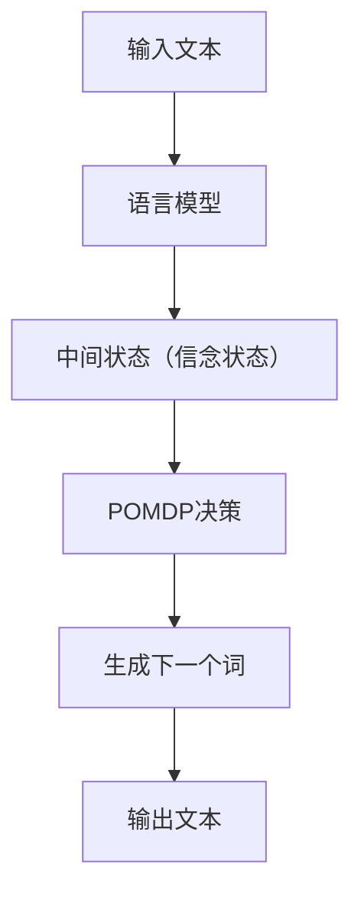

# 将POMDP引入语言模型推理过程的可能性

> 关键词：POMDP、语言模型推理、部分可观测马尔可夫决策过程、不确定性处理、强化学习

> 摘要：本文深入探讨了将部分可观测马尔可夫决策过程（POMDP）引入语言模型推理过程的可能性。首先介绍了研究的背景、目的、预期读者和文档结构，详细解释了相关术语。接着阐述了POMDP和语言模型推理的核心概念及其联系，并给出了原理和架构的文本示意图与Mermaid流程图。通过Python代码详细讲解了核心算法原理和具体操作步骤，同时给出了数学模型和公式并举例说明。在项目实战部分，进行了开发环境搭建，给出了源代码实现和详细解读。分析了POMDP在语言模型推理中的实际应用场景，推荐了学习资源、开发工具框架和相关论文著作。最后总结了未来发展趋势与挑战，提供了常见问题解答和扩展阅读参考资料。

## 1. 背景介绍 
### 1.1 目的和范围
近年来，语言模型在自然语言处理领域取得了显著进展，如GPT系列等大型语言模型在文本生成、问答系统等任务中表现出色。然而，语言模型在推理过程中仍然面临一些挑战，例如对不确定性的处理能力不足。部分可观测马尔可夫决策过程（POMDP）是一种用于处理不确定性决策问题的强大工具。本研究的目的是探讨将POMDP引入语言模型推理过程的可能性，以提高语言模型处理不确定性的能力，改善推理效果。研究范围涵盖了POMDP和语言模型推理的基本概念、核心算法原理、数学模型，以及通过项目实战验证可行性，并分析实际应用场景。

### 1.2 预期读者
本文预期读者包括自然语言处理领域的研究人员、人工智能开发者、对语言模型和强化学习感兴趣的学生和专业人士。这些读者需要具备一定的概率论、机器学习和编程语言（如Python）的基础知识。

### 1.3 文档结构概述
本文将按照以下结构展开：首先介绍相关背景和术语，然后阐述POMDP和语言模型推理的核心概念与联系，接着讲解核心算法原理和具体操作步骤，给出数学模型和公式并举例说明。通过项目实战展示代码实现和详细解读，分析实际应用场景。推荐学习资源、开发工具框架和相关论文著作。最后总结未来发展趋势与挑战，提供常见问题解答和扩展阅读参考资料。

### 1.4 术语表
#### 1.4.1 核心术语定义
- **部分可观测马尔可夫决策过程（POMDP）**：是一个离散时间的随机控制过程，用于在部分可观测的环境中进行决策。在POMDP中，智能体不能直接观测到环境的真实状态，只能通过观测值来推断状态。
- **语言模型推理**：指语言模型根据输入的文本信息，通过内部的计算和处理，生成相应的输出文本的过程。
- **状态（State）**：在POMDP中，状态表示环境的一种可能情况。在语言模型推理中，状态可以表示文本的上下文信息等。
- **动作（Action）**：智能体在每个时间步可以采取的操作。在语言模型推理中，动作可以是选择下一个生成的词等。
- **观测（Observation）**：智能体在每个时间步接收到的关于环境的信息。在语言模型推理中，观测可以是输入的文本等。

#### 1.4.2 相关概念解释
- **马尔可夫性质**：指系统的未来状态只依赖于当前状态，而与过去的状态无关。POMDP是马尔可夫决策过程（MDP）的扩展，考虑了部分可观测的情况。
- **策略（Policy）**：是一个从状态到动作的映射，表示智能体在不同状态下应该采取的动作。在POMDP中，策略通常是基于信念状态（对真实状态的概率分布）来制定的。
- **信念状态（Belief State）**：由于环境是部分可观测的，智能体无法确定真实状态，只能通过观测值来估计状态的概率分布，这个概率分布就是信念状态。

#### 1.4.3 缩略词列表
- **POMDP**：Partially Observable Markov Decision Process（部分可观测马尔可夫决策过程）
- **MDP**：Markov Decision Process（马尔可夫决策过程）

## 2. 核心概念与联系 

### 2.1 POMDP核心概念
POMDP可以用一个六元组 $\langle S, A, T, Z, O, R \rangle$ 来表示，其中：
- $S$ 是有限的状态集合，表示环境的所有可能状态。
- $A$ 是有限的动作集合，智能体可以采取的动作。
- $T: S \times A \times S \to [0, 1]$ 是状态转移函数，表示在状态 $s$ 采取动作 $a$ 后转移到状态 $s'$ 的概率，即 $T(s, a, s') = P(s_{t+1} = s' | s_t = s, a_t = a)$。
- $Z$ 是有限的观测集合，智能体接收到的观测值。
- $O: S \times A \times Z \to [0, 1]$ 是观测函数，表示在状态 $s$ 采取动作 $a$ 后接收到观测 $z$ 的概率，即 $O(s, a, z) = P(z_{t+1} = z | s_{t+1} = s', a_t = a)$。
- $R: S \times A \to \mathbb{R}$ 是奖励函数，表示在状态 $s$ 采取动作 $a$ 后获得的即时奖励。

### 2.2 语言模型推理核心概念
语言模型的目标是根据输入的文本序列 $x_1, x_2, \cdots, x_n$ 预测下一个词 $x_{n+1}$ 的概率分布 $P(x_{n+1} | x_1, x_2, \cdots, x_n)$。常见的语言模型有基于统计的n-gram模型和基于深度学习的神经网络模型（如循环神经网络RNN、长短时记忆网络LSTM、Transformer等）。

### 2.3 核心概念联系
在语言模型推理过程中，存在许多不确定性。例如，输入的文本可能不完整、有歧义，或者语言本身具有多样性。POMDP可以用于处理这些不确定性。我们可以将语言模型的上下文信息看作POMDP中的状态，生成下一个词的操作看作动作，输入的文本和生成的中间结果看作观测。通过POMDP的框架，语言模型可以在不确定的环境中做出更合理的决策，选择最优的生成词。

### 2.4 原理和架构的文本示意图
```plaintext
输入文本 -> 语言模型 -> 中间状态（信念状态） -> POMDP决策 -> 生成下一个词 -> 输出文本
```

### 2.5 Mermaid流程图


## 3. 核心算法原理 & 具体操作步骤 

### 3.1 POMDP解决算法原理
解决POMDP问题的一种常见方法是基于值迭代的算法。值迭代的目标是找到一个最优策略，使得智能体在长期内获得最大的累积奖励。具体步骤如下：
1. 初始化信念状态 $b_0$ 和值函数 $V^0(b) = 0$ 对于所有的信念状态 $b$。
2. 对于每个迭代步骤 $k$：
    - 对于每个信念状态 $b$ 和动作 $a$，计算 $Q^k(b, a)$：
$$Q^k(b, a) = \sum_{s \in S} b(s) R(s, a) + \gamma \sum_{z \in Z} O(s, a, z) \sum_{s' \in S} T(s, a, s') V^{k-1}(b')$$
其中 $\gamma$ 是折扣因子，$b'$ 是在采取动作 $a$ 并接收到观测 $z$ 后更新的信念状态。
    - 更新值函数 $V^k(b) = \max_{a \in A} Q^k(b, a)$。
3. 重复步骤2直到值函数收敛。

### 3.2 具体操作步骤
以下是将POMDP引入语言模型推理的具体操作步骤：
1. **定义状态、动作和观测**：
    - 状态 $S$ 可以表示语言模型的上下文信息，例如当前输入文本的词向量表示。
    - 动作 $A$ 是语言模型可以生成的所有可能的词。
    - 观测 $Z$ 可以是输入的文本和生成的中间结果。
2. **初始化信念状态**：根据初始输入文本，估计初始的信念状态 $b_0$。
3. **循环进行推理**：
    - 在每个时间步 $t$：
        - 根据当前的信念状态 $b_t$ 和值函数 $V$，选择最优动作 $a_t$（即下一个生成的词）。
        - 执行动作 $a_t$，得到观测 $z_{t+1}$（即生成的词和可能的新输入文本）。
        - 根据观测 $z_{t+1}$ 更新信念状态 $b_{t+1}$。
        - 更新值函数 $V$。
4. **输出最终结果**：当达到终止条件（如生成了指定长度的文本）时，输出最终生成的文本。

### 3.3 Python代码实现
```python
import numpy as np

# 定义POMDP参数
S = [0, 1]  # 状态集合
A = [0, 1]  # 动作集合
Z = [0, 1]  # 观测集合

# 状态转移函数
T = np.array([
    [[0.7, 0.3], [0.3, 0.7]],  # 动作0
    [[0.4, 0.6], [0.6, 0.4]]   # 动作1
])

# 观测函数
O = np.array([
    [[0.8, 0.2], [0.2, 0.8]],  # 动作0
    [[0.7, 0.3], [0.3, 0.7]]   # 动作1
])

# 奖励函数
R = np.array([
    [1, -1],  # 状态0
    [-1, 1]   # 状态1
])

# 折扣因子
gamma = 0.9

# 初始化信念状态
b = np.array([0.5, 0.5])

# 值迭代算法
def value_iteration():
    V = np.zeros(len(S))
    for k in range(100):
        Q = np.zeros((len(S), len(A)))
        for s in range(len(S)):
            for a in range(len(A)):
                q = R[s, a]
                for z in range(len(Z)):
                    for s_prime in range(len(S)):
                        b_prime = update_belief(b, a, z)
                        q += gamma * O[s_prime, a, z] * T[s, a, s_prime] * V[s_prime]
                Q[s, a] = q
        V = np.max(Q, axis=1)
    return V

# 更新信念状态
def update_belief(b, a, z):
    b_prime = np.zeros(len(S))
    for s_prime in range(len(S)):
        numerator = 0
        for s in range(len(S)):
            numerator += b[s] * T[s, a, s_prime] * O[s_prime, a, z]
        b_prime[s_prime] = numerator
    b_prime /= np.sum(b_prime)
    return b_prime

# 运行值迭代算法
V = value_iteration()
print("Value function:", V)
```

## 4. 数学模型和公式 & 详细讲解 & 举例说明 

### 4.1 信念状态更新公式
在POMDP中，信念状态的更新是根据贝叶斯定理进行的。给定当前信念状态 $b_t(s)$，动作 $a_t$ 和观测 $z_{t+1}$，更新后的信念状态 $b_{t+1}(s')$ 可以通过以下公式计算：
$$b_{t+1}(s') = \frac{O(s', a_t, z_{t+1}) \sum_{s \in S} T(s, a_t, s') b_t(s)}{\sum_{s'' \in S} O(s'', a_t, z_{t+1}) \sum_{s \in S} T(s, a_t, s'') b_t(s)}$$

### 4.2 值函数更新公式
值函数 $V(b)$ 表示在信念状态 $b$ 下，智能体按照最优策略行动所能获得的最大累积奖励。值函数的更新公式为：
$$V^k(b) = \max_{a \in A} \left[ \sum_{s \in S} b(s) R(s, a) + \gamma \sum_{z \in Z} O(s, a, z) \sum_{s' \in S} T(s, a, s') V^{k-1}(b') \right]$$

### 4.3 举例说明
假设我们有一个简单的语言模型推理场景，状态 $S = \{s_0, s_1\}$ 表示两种不同的上下文，动作 $A = \{a_0, a_1\}$ 表示生成两个不同的词，观测 $Z = \{z_0, z_1\}$。初始信念状态 $b_0 = [0.6, 0.4]$。
- 状态转移函数 $T$：
$$T(s_0, a_0, s_0) = 0.7, T(s_0, a_0, s_1) = 0.3$$
$$T(s_0, a_1, s_0) = 0.4, T(s_0, a_1, s_1) = 0.6$$
$$T(s_1, a_0, s_0) = 0.3, T(s_1, a_0, s_1) = 0.7$$
$$T(s_1, a_1, s_0) = 0.6, T(s_1, a_1, s_1) = 0.4$$
- 观测函数 $O$：
$$O(s_0, a_0, z_0) = 0.8, O(s_0, a_0, z_1) = 0.2$$
$$O(s_0, a_1, z_0) = 0.7, O(s_0, a_1, z_1) = 0.3$$
$$O(s_1, a_0, z_0) = 0.2, O(s_1, a_0, z_1) = 0.8$$
$$O(s_1, a_1, z_0) = 0.3, O(s_1, a_1, z_1) = 0.7$$
- 奖励函数 $R$：
$$R(s_0, a_0) = 1, R(s_0, a_1) = -1$$
$$R(s_1, a_0) = -1, R(s_1, a_1) = 1$$
- 折扣因子 $\gamma = 0.9$。

假设智能体采取动作 $a_0$ 并接收到观测 $z_0$，则更新后的信念状态 $b_1$ 为：
$$b_1(s_0) = \frac{O(s_0, a_0, z_0) \sum_{s \in S} T(s, a_0, s_0) b_0(s)}{\sum_{s'' \in S} O(s'', a_0, z_0) \sum_{s \in S} T(s, a_0, s'') b_0(s)}$$
$$b_1(s_1) = 1 - b_1(s_0)$$

通过不断迭代更新信念状态和值函数，智能体可以找到最优策略，从而在语言模型推理中做出更好的决策。

## 5. 项目实战：代码实际案例和详细解释说明 

### 5.1  开发环境搭建
为了实现将POMDP引入语言模型推理的项目，我们需要搭建以下开发环境：
- **操作系统**：可以选择Linux、Windows或macOS。
- **编程语言**：Python 3.x
- **Python库**：
    - `numpy`：用于数值计算。
    - `torch`：用于深度学习模型的构建和训练（如果使用基于深度学习的语言模型）。
    - `scikit-learn`：用于数据处理和模型评估。

可以使用以下命令安装所需的Python库：
```sh
pip install numpy torch scikit-learn
```

### 5.2  源代码详细实现和代码解读
以下是一个更完整的将POMDP引入语言模型推理的代码示例：
```python
import numpy as np
import torch
import torch.nn as nn

# 定义简单的语言模型
class SimpleLanguageModel(nn.Module):
    def __init__(self, vocab_size, embedding_dim, hidden_dim):
        super(SimpleLanguageModel, self).__init__()
        self.embedding = nn.Embedding(vocab_size, embedding_dim)
        self.rnn = nn.RNN(embedding_dim, hidden_dim, batch_first=True)
        self.fc = nn.Linear(hidden_dim, vocab_size)

    def forward(self, x):
        embedded = self.embedding(x)
        output, _ = self.rnn(embedded)
        logits = self.fc(output)
        return logits

# 定义POMDP参数
vocab_size = 10  # 词汇表大小
embedding_dim = 20
hidden_dim = 30

# 初始化语言模型
model = SimpleLanguageModel(vocab_size, embedding_dim, hidden_dim)

# 定义状态、动作和观测
S = [i for i in range(vocab_size)]  # 状态集合
A = [i for i in range(vocab_size)]  # 动作集合
Z = [i for i in range(vocab_size)]  # 观测集合

# 状态转移函数（简化示例）
T = np.eye(vocab_size)

# 观测函数（简化示例）
O = np.eye(vocab_size)

# 奖励函数（简化示例）
R = np.ones((vocab_size, vocab_size))

# 折扣因子
gamma = 0.9

# 初始化信念状态
b = np.ones(vocab_size) / vocab_size

# 值迭代算法
def value_iteration():
    V = np.zeros(vocab_size)
    for k in range(100):
        Q = np.zeros((vocab_size, vocab_size))
        for s in range(vocab_size):
            for a in range(vocab_size):
                q = R[s, a]
                for z in range(vocab_size):
                    for s_prime in range(vocab_size):
                        b_prime = update_belief(b, a, z)
                        q += gamma * O[s_prime, a, z] * T[s, a, s_prime] * V[s_prime]
                Q[s, a] = q
        V = np.max(Q, axis=1)
    return V

# 更新信念状态
def update_belief(b, a, z):
    b_prime = np.zeros(vocab_size)
    for s_prime in range(vocab_size):
        numerator = 0
        for s in range(vocab_size):
            numerator += b[s] * T[s, a, s_prime] * O[s_prime, a, z]
        b_prime[s_prime] = numerator
    b_prime /= np.sum(b_prime)
    return b_prime

# 运行值迭代算法
V = value_iteration()

# 语言模型推理过程
input_text = torch.tensor([[1, 2, 3]], dtype=torch.long)
output = model(input_text)
probs = torch.softmax(output, dim=-1)
next_word_index = torch.argmax(probs, dim=-1).item()

# 根据POMDP选择动作
action = np.argmax([np.dot(b, R[:, a]) + gamma * np.sum([O[s, a, z] * np.sum(T[:, a, s] * V) for z in Z for s in S]) for a in A])

print("Next word index from language model:", next_word_index)
print("Action selected by POMDP:", action)
```

### 5.3  代码解读与分析
- **语言模型定义**：`SimpleLanguageModel` 是一个简单的基于RNN的语言模型，用于生成下一个词的概率分布。
- **POMDP参数定义**：定义了状态、动作和观测集合，以及状态转移函数、观测函数和奖励函数。
- **值迭代算法**：`value_iteration` 函数实现了POMDP的值迭代算法，用于计算最优值函数。
- **信念状态更新**：`update_belief` 函数根据贝叶斯定理更新信念状态。
- **语言模型推理**：输入文本经过语言模型生成下一个词的概率分布，然后选择概率最大的词作为下一个生成的词。
- **POMDP决策**：根据当前的信念状态和值函数，选择最优动作。

通过将POMDP引入语言模型推理过程，我们可以综合考虑语言模型的输出和环境的不确定性，做出更合理的决策。

## 6. 实际应用场景 
### 6.1 智能对话系统
在智能对话系统中，用户的输入可能存在歧义或不完整。将POMDP引入语言模型推理过程可以帮助系统更好地处理这些不确定性，选择更合适的回复。例如，当用户询问“那个东西多少钱”时，系统可以根据上下文和历史对话信息，利用POMDP的决策机制选择更准确的回答，如询问“您说的是哪个东西呢”或直接给出可能的物品价格。

### 6.2 机器翻译
在机器翻译中，源语言的句子可能有多种不同的理解方式。POMDP可以用于处理这种不确定性，在翻译过程中选择最优的翻译方案。例如，对于一些具有多义词的句子，系统可以根据上下文和信念状态，选择最符合语境的翻译。

### 6.3 文本生成
在文本生成任务中，如故事创作、诗歌生成等，语言模型需要在不同的生成路径中做出选择。POMDP可以帮助模型考虑到不同选择的长期影响，生成更连贯、更有逻辑性的文本。例如，在故事创作中，模型可以根据当前的情节和读者的反馈，利用POMDP选择下一个情节发展的方向。

## 7. 工具和资源推荐
### 7.1 学习资源推荐
#### 7.1.1 书籍推荐
- 《Artificial Intelligence: A Modern Approach》：这是一本经典的人工智能教材，涵盖了POMDP、语言模型等多个领域的知识。
- 《Reinforcement Learning: An Introduction》：详细介绍了强化学习的基本概念和算法，包括POMDP的相关内容。
- 《Natural Language Processing with Python》：介绍了Python在自然语言处理中的应用，包括语言模型的实现。

#### 7.1.2 在线课程
- Coursera上的“Reinforcement Learning Specialization”：由著名学者Richard Sutton授课，深入讲解了强化学习的理论和实践。
- edX上的“Natural Language Processing”：提供了自然语言处理的全面介绍，包括语言模型的原理和应用。

#### 7.1.3 技术博客和网站
- Medium上的“Towards Data Science”：有许多关于人工智能、机器学习和自然语言处理的高质量文章。
- arXiv.org：可以找到最新的学术研究论文，包括POMDP和语言模型相关的研究。

### 7.2 开发工具框架推荐
#### 7.2.1 IDE和编辑器
- PyCharm：是一款专业的Python集成开发环境，提供了丰富的代码编辑、调试和分析功能。
- Jupyter Notebook：适合进行交互式的代码开发和实验，方便展示和分享代码。

#### 7.2.2 调试和性能分析工具
- TensorBoard：用于可视化深度学习模型的训练过程和性能指标。
- cProfile：Python自带的性能分析工具，可以帮助找出代码中的性能瓶颈。

#### 7.2.3 相关框架和库
- OpenAI Gym：提供了一系列强化学习的环境和工具，方便进行POMDP的实验和开发。
- Hugging Face Transformers：是一个流行的自然语言处理库，包含了许多预训练的语言模型。

### 7.3 相关论文著作推荐
#### 7.3.1 经典论文
- “A Survey of POMDP Solvers”：对POMDP的求解算法进行了全面的综述。
- “Attention Is All You Need”：介绍了Transformer架构，是现代语言模型的基础。

#### 7.3.2 最新研究成果
- 可以在arXiv.org上搜索最新的关于POMDP和语言模型结合的研究论文。

#### 7.3.3 应用案例分析
- 一些会议论文集（如ACL、EMNLP等）中会有关于POMDP在语言模型推理中的应用案例分析。

## 8. 总结：未来发展趋势与挑战
### 8.1 未来发展趋势
- **多模态融合**：将POMDP引入语言模型推理过程可以与多模态信息（如图像、音频）相结合，进一步提高模型的理解和决策能力。例如，在智能对话系统中，结合图像信息可以更好地理解用户的意图。
- **强化学习与深度学习的深度融合**：随着强化学习和深度学习技术的不断发展，两者的融合将更加深入。POMDP作为强化学习的一种扩展，将与深度学习的语言模型更好地结合，实现更智能的推理和决策。
- **实际应用的拓展**：POMDP在语言模型推理中的应用将拓展到更多的领域，如智能医疗、金融风险评估等。在这些领域中，处理不确定性和做出合理决策是非常重要的。

### 8.2 挑战
- **计算复杂度**：POMDP的求解算法通常具有较高的计算复杂度，特别是在状态和动作空间较大的情况下。如何降低计算复杂度，提高算法的效率是一个挑战。
- **数据获取和标注**：在实际应用中，获取和标注用于训练POMDP和语言模型的数据是一个困难的问题。需要开发更有效的数据采集和标注方法。
- **模型可解释性**：将POMDP引入语言模型推理过程可能会增加模型的复杂性，降低模型的可解释性。如何提高模型的可解释性，让用户更好地理解模型的决策过程是一个重要的挑战。

## 9. 附录：常见问题与解答
### 9.1 POMDP和MDP有什么区别？
MDP假设智能体可以完全观测到环境的状态，而POMDP考虑了部分可观测的情况，智能体只能通过观测值来推断状态。因此，POMDP比MDP更复杂，求解难度也更大。

### 9.2 如何选择合适的奖励函数？
奖励函数的选择取决于具体的应用场景和任务目标。一般来说，奖励函数应该能够反映智能体的行为是否符合预期。例如，在语言模型推理中，奖励函数可以根据生成的文本的质量（如语法正确性、语义连贯性等）来设计。

### 9.3 POMDP求解算法有哪些？
常见的POMDP求解算法包括值迭代算法、策略迭代算法、基于采样的算法（如Monte Carlo Tree Search）等。不同的算法适用于不同的场景，需要根据具体情况选择合适的算法。

## 10. 扩展阅读 & 参考资料
- Kaelbling, L. P., Littman, M. L., & Cassandra, A. R. (1998). Planning and acting in partially observable stochastic domains. Artificial intelligence, 101(1-2), 99-134.
- Vaswani, A., Shazeer, N., Parmar, N., Uszkoreit, J., Jones, L., Gomez, A. N., ... & Polosukhin, I. (2017). Attention is all you need. Advances in neural information processing systems, 5998-6008.
- Goodfellow, I. J., Bengio, Y., & Courville, A. (2016). Deep learning. MIT press.