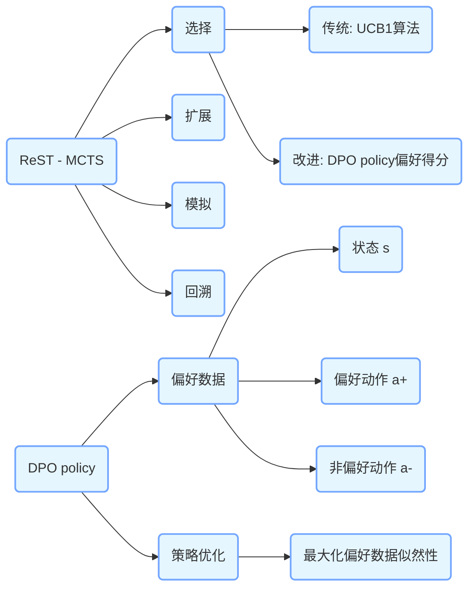

# 将ReST - MCTS改为使用DPO policy的未来工作

> 关键词：ReST - MCTS、DPO policy、蒙特卡罗树搜索、策略优化、未来工作

> 摘要：本文围绕将ReST - MCTS（基于随机搜索树的蒙特卡罗树搜索）改为使用DPO policy（直接偏好优化策略）的未来工作展开。首先介绍相关背景，包括研究目的、预期读者和文档结构等。接着阐述核心概念，分析ReST - MCTS和DPO policy的原理及联系。然后讲解核心算法原理与操作步骤，通过Python代码详细说明。同时给出数学模型和公式，并举例说明。之后进行项目实战，包括开发环境搭建、代码实现与解读。还探讨了实际应用场景，推荐了学习资源、开发工具和相关论文。最后总结未来发展趋势与挑战，解答常见问题并提供扩展阅读和参考资料。

## 1. 背景介绍 
### 1.1 目的和范围
将ReST - MCTS改为使用DPO policy具有重要的研究和应用价值。ReST - MCTS是一种强大的搜索算法，在很多决策问题中表现出色，但它可能存在收敛速度慢、对复杂环境适应性不足等问题。DPO policy作为一种新兴的策略优化方法，能够直接利用人类偏好信息进行策略学习，有望为ReST - MCTS带来新的活力。本工作的目的在于探索如何将DPO policy融入ReST - MCTS，提高其性能和适应性。范围涵盖理论分析、算法设计、代码实现以及实际应用验证等多个方面。

### 1.2 预期读者
本文预期读者包括人工智能领域的研究人员、程序员、软件架构师以及对蒙特卡罗树搜索和策略优化感兴趣的技术爱好者。对于想要深入了解算法改进和应用的专业人士，本文提供了详细的技术分析和实践指导；对于初学者，也可以通过本文初步了解相关领域的核心概念和方法。

### 1.3 文档结构概述
本文共分为十个部分。第一部分为背景介绍，阐述研究目的、预期读者和文档结构。第二部分讲解核心概念与联系，分析ReST - MCTS和DPO policy的原理和关系。第三部分介绍核心算法原理与具体操作步骤，并用Python代码详细说明。第四部分给出数学模型和公式，进行详细讲解并举例。第五部分进行项目实战，包括开发环境搭建、代码实现与解读。第六部分探讨实际应用场景。第七部分推荐学习资源、开发工具和相关论文。第八部分总结未来发展趋势与挑战。第九部分为附录，解答常见问题。第十部分提供扩展阅读和参考资料。

### 1.4 术语表
#### 1.4.1 核心术语定义
- **ReST - MCTS**：基于随机搜索树的蒙特卡罗树搜索，是一种用于解决决策问题的搜索算法，通过在状态空间中进行随机采样和树搜索来找到最优策略。
- **DPO policy**：直接偏好优化策略，是一种利用人类偏好信息进行策略学习的方法，通过最大化偏好数据的似然性来优化策略。
- **蒙特卡罗树搜索（MCTS）**：一种通用的搜索算法，通过模拟大量的随机游戏来估计每个动作的价值，从而选择最优动作。
- **策略优化**：通过调整策略参数，使策略在给定环境中获得更好的性能。

#### 1.4.2 相关概念解释
- **随机搜索树**：一种用于组织搜索空间的树结构，节点表示状态，边表示动作。在ReST - MCTS中，随机搜索树用于记录搜索过程中的信息。
- **人类偏好信息**：人类对不同策略或行为的偏好，例如更喜欢某个动作序列或某个策略的输出。DPO policy利用这些偏好信息来优化策略。
- **似然性**：在统计学中，似然性表示在给定模型参数下，观察到的数据出现的概率。在DPO policy中，通过最大化偏好数据的似然性来优化策略。

#### 1.4.3 缩略词列表
- **ReST - MCTS**：Random Search Tree - Monte Carlo Tree Search
- **DPO**：Direct Preference Optimization
- **MCTS**：Monte Carlo Tree Search

## 2. 核心概念与联系 

### 2.1 ReST - MCTS原理
ReST - MCTS是蒙特卡罗树搜索的一种变体，它结合了随机搜索树的思想。其基本原理是在状态空间中构建一棵搜索树，每个节点表示一个状态，边表示动作。算法通过四个主要步骤进行迭代：选择、扩展、模拟和回溯。

- **选择**：从根节点开始，根据一定的选择策略（如UCB1算法）选择一条路径，直到到达一个未完全扩展的节点。
- **扩展**：在未完全扩展的节点上，随机选择一个未被访问过的动作，创建一个新的子节点。
- **模拟**：从新创建的子节点开始，进行随机模拟游戏，直到达到终止状态，得到一个模拟结果。
- **回溯**：将模拟结果回溯到搜索树的根节点，更新每个节点的统计信息（如访问次数和累计奖励）。

### 2.2 DPO policy原理
DPO policy是一种直接利用人类偏好信息进行策略优化的方法。其核心思想是通过最大化偏好数据的似然性来调整策略参数。给定一组偏好数据 $\{(s_i, a_i^+, a_i^-)\}$，其中 $s_i$ 是状态，$a_i^+$ 是人类偏好的动作，$a_i^-$ 是人类不偏好的动作。DPO policy的目标是使策略在状态 $s_i$ 下选择 $a_i^+$ 的概率大于选择 $a_i^-$ 的概率。

### 2.3 两者联系
将ReST - MCTS改为使用DPO policy的核心思路是利用DPO policy来指导ReST - MCTS的动作选择。在ReST - MCTS的选择步骤中，传统方法通常使用UCB1等算法来平衡探索和利用。而引入DPO policy后，可以根据DPO policy计算每个动作的偏好得分，优先选择偏好得分高的动作，从而提高搜索效率和策略性能。

### 2.4 文本示意图
```plaintext
ReST - MCTS
├── 选择
│   ├── 传统：UCB1算法
│   └── 改进：DPO policy偏好得分
├── 扩展
├── 模拟
└── 回溯

DPO policy
├── 偏好数据
│   ├── 状态 s
│   ├── 偏好动作 a+
│   └── 非偏好动作 a-
└── 策略优化
    └── 最大化偏好数据似然性
```

### 2.5 Mermaid流程图


## 3. 核心算法原理 & 具体操作步骤 

### 3.1 传统ReST - MCTS算法原理
传统ReST - MCTS算法的核心在于通过迭代的方式在搜索树中进行搜索。以下是Python代码实现：

```python
import math
import random

class Node:
    def __init__(self, state, parent=None):
        self.state = state
        self.parent = parent
        self.children = []
        self.visits = 0
        self.reward = 0

    def is_fully_expanded(self):
        return len(self.children) == len(self.get_legal_actions())

    def get_legal_actions(self):
        # 这里需要根据具体问题实现合法动作的获取
        return [i for i in range(3)]

    def expand(self):
        legal_actions = self.get_legal_actions()
        unvisited_actions = [action for action in legal_actions if action not in [child.action for child in self.children]]
        action = random.choice(unvisited_actions)
        next_state = self.get_next_state(action)
        child = Node(next_state, self)
        child.action = action
        self.children.append(child)
        return child

    def get_next_state(self, action):
        # 这里需要根据具体问题实现状态转移
        return self.state

    def simulate(self):
        # 随机模拟游戏直到终止状态
        current_state = self.state
        while not self.is_terminal_state(current_state):
            action = random.choice(self.get_legal_actions())
            current_state = self.get_next_state(action)
        return self.get_reward(current_state)

    def is_terminal_state(self, state):
        # 这里需要根据具体问题判断终止状态
        return False

    def get_reward(self, state):
        # 这里需要根据具体问题计算奖励
        return random.random()

    def backpropagate(self, reward):
        self.visits += 1
        self.reward += reward
        if self.parent:
            self.parent.backpropagate(reward)

    def ucb1(self):
        if self.visits == 0:
            return float('inf')
        return (self.reward / self.visits) + math.sqrt(2 * math.log(self.parent.visits) / self.visits)

    def best_child(self):
        return max(self.children, key=lambda child: child.ucb1())


def rest_mcts(root_state, num_simulations):
    root = Node(root_state)
    for _ in range(num_simulations):
        node = root
        # 选择
        while node.is_fully_expanded() and node.children:
            node = node.best_child()
        # 扩展
        if not node.is_fully_expanded():
            node = node.expand()
        # 模拟
        reward = node.simulate()
        # 回溯
        node.backpropagate(reward)
    return max(root.children, key=lambda child: child.visits).action


# 示例调用
root_state = 0
num_simulations = 100
best_action = rest_mcts(root_state, num_simulations)
print(f"Best action: {best_action}")
```

### 3.2 引入DPO policy的改进算法原理
引入DPO policy后，在选择步骤中，我们根据DPO policy计算每个动作的偏好得分，优先选择偏好得分高的动作。以下是改进后的Python代码：

```python
import math
import random
import torch
import torch.nn as nn
import torch.optim as optim

# 定义DPO policy网络
class DPOPolicy(nn.Module):
    def __init__(self, input_size, output_size):
        super(DPOPolicy, self).__init__()
        self.fc1 = nn.Linear(input_size, 64)
        self.fc2 = nn.Linear(64, output_size)

    def forward(self, x):
        x = torch.relu(self.fc1(x))
        x = self.fc2(x)
        return torch.softmax(x, dim=-1)


class Node:
    def __init__(self, state, parent=None):
        self.state = state
        self.parent = parent
        self.children = []
        self.visits = 0
        self.reward = 0

    def is_fully_expanded(self):
        return len(self.children) == len(self.get_legal_actions())

    def get_legal_actions(self):
        # 这里需要根据具体问题实现合法动作的获取
        return [i for i in range(3)]

    def expand(self):
        legal_actions = self.get_legal_actions()
        unvisited_actions = [action for action in legal_actions if action not in [child.action for child in self.children]]
        action = random.choice(unvisited_actions)
        next_state = self.get_next_state(action)
        child = Node(next_state, self)
        child.action = action
        self.children.append(child)
        return child

    def get_next_state(self, action):
        # 这里需要根据具体问题实现状态转移
        return self.state

    def simulate(self):
        # 随机模拟游戏直到终止状态
        current_state = self.state
        while not self.is_terminal_state(current_state):
            action = random.choice(self.get_legal_actions())
            current_state = self.get_next_state(action)
        return self.get_reward(current_state)

    def is_terminal_state(self, state):
        # 这里需要根据具体问题判断终止状态
        return False

    def get_reward(self, state):
        # 这里需要根据具体问题计算奖励
        return random.random()

    def backpropagate(self, reward):
        self.visits += 1
        self.reward += reward
        if self.parent:
            self.parent.backpropagate(reward)

    def dpo_score(self, dpo_policy):
        state_tensor = torch.tensor([self.state], dtype=torch.float32)
        action_probs = dpo_policy(state_tensor)
        scores = []
        for action in self.get_legal_actions():
            scores.append(action_probs[0][action].item())
        return scores

    def best_child_dpo(self, dpo_policy):
        scores = self.dpo_score(dpo_policy)
        legal_actions = self.get_legal_actions()
        best_action_index = scores.index(max(scores))
        best_action = legal_actions[best_action_index]
        for child in self.children:
            if child.action == best_action:
                return child


def rest_mcts_dpo(root_state, num_simulations, dpo_policy):
    root = Node(root_state)
    for _ in range(num_simulations):
        node = root
        # 选择
        while node.is_fully_expanded() and node.children:
            node = node.best_child_dpo(dpo_policy)
        # 扩展
        if not node.is_fully_expanded():
            node = node.expand()
        # 模拟
        reward = node.simulate()
        # 回溯
        node.backpropagate(reward)
    return max(root.children, key=lambda child: child.visits).action


# 示例调用
root_state = 0
num_simulations = 100
input_size = 1
output_size = 3
dpo_policy = DPOPolicy(input_size, output_size)
best_action = rest_mcts_dpo(root_state, num_simulations, dpo_policy)
print(f"Best action with DPO: {best_action}")
```

### 3.3 具体操作步骤
1. **初始化DPO policy网络**：定义一个神经网络作为DPO policy，初始化网络参数。
2. **收集偏好数据**：通过人类标注或其他方式收集偏好数据 $\{(s_i, a_i^+, a_i^-)\}$。
3. **训练DPO policy**：使用偏好数据训练DPO policy网络，最大化偏好数据的似然性。
4. **运行改进的ReST - MCTS**：在ReST - MCTS的选择步骤中，使用DPO policy计算每个动作的偏好得分，选择偏好得分高的动作。
5. **迭代优化**：不断收集新的偏好数据，更新DPO policy网络，重复步骤3 - 4，直到策略性能达到满意的水平。

## 4. 数学模型和公式 & 详细讲解 & 举例说明 

### 4.1 DPO policy的数学模型
DPO policy的目标是最大化偏好数据的似然性。给定一组偏好数据 $\{(s_i, a_i^+, a_i^-)\}$，设策略 $\pi(a|s)$ 表示在状态 $s$ 下选择动作 $a$ 的概率。则DPO policy的目标函数可以表示为：

$$
\max_{\theta} \sum_{i=1}^{N} \log \left( \frac{\pi_{\theta}(a_i^+|s_i)}{\pi_{\theta}(a_i^+|s_i) + \pi_{\theta}(a_i^-|s_i)} \right)
$$

其中，$\theta$ 是策略网络的参数，$N$ 是偏好数据的数量。

### 4.2 详细讲解
- **分子 $\pi_{\theta}(a_i^+|s_i)$**：表示在状态 $s_i$ 下，策略 $\pi_{\theta}$ 选择人类偏好动作 $a_i^+$ 的概率。
- **分母 $\pi_{\theta}(a_i^+|s_i) + \pi_{\theta}(a_i^-|s_i)$**：表示在状态 $s_i$ 下，策略 $\pi_{\theta}$ 选择人类偏好动作 $a_i^+$ 或非偏好动作 $a_i^-$ 的概率之和。
- **对数似然项 $\log \left( \frac{\pi_{\theta}(a_i^+|s_i)}{\pi_{\theta}(a_i^+|s_i) + \pi_{\theta}(a_i^-|s_i)} \right)$**：衡量了策略 $\pi_{\theta}$ 在状态 $s_i$ 下对人类偏好动作 $a_i^+$ 的偏好程度。通过最大化这个对数似然项的总和，我们可以使策略更倾向于选择人类偏好的动作。

### 4.3 举例说明
假设我们有一个简单的决策问题，状态空间 $S = \{0, 1\}$，动作空间 $A = \{0, 1\}$。我们收集了一组偏好数据：$\{(0, 0, 1), (1, 1, 0)\}$。

设策略 $\pi_{\theta}$ 是一个简单的神经网络，输入为状态 $s$，输出为每个动作的概率。我们可以使用PyTorch来实现这个策略网络：

```python
import torch
import torch.nn as nn
import torch.optim as optim

class DPOPolicy(nn.Module):
    def __init__(self, input_size, output_size):
        super(DPOPolicy, self).__init__()
        self.fc1 = nn.Linear(input_size, 64)
        self.fc2 = nn.Linear(64, output_size)

    def forward(self, x):
        x = torch.relu(self.fc1(x))
        x = self.fc2(x)
        return torch.softmax(x, dim=-1)


input_size = 1
output_size = 2
dpo_policy = DPOPolicy(input_size, output_size)
optimizer = optim.Adam(dpo_policy.parameters(), lr=0.001)

preference_data = [(0, 0, 1), (1, 1, 0)]

for epoch in range(100):
    total_loss = 0
    for s, a_plus, a_minus in preference_data:
        state_tensor = torch.tensor([s], dtype=torch.float32)
        action_probs = dpo_policy(state_tensor)
        prob_a_plus = action_probs[0][a_plus]
        prob_a_minus = action_probs[0][a_minus]
        loss = -torch.log(prob_a_plus / (prob_a_plus + prob_a_minus))
        total_loss += loss

    optimizer.zero_grad()
    total_loss.backward()
    optimizer.step()

    if epoch % 10 == 0:
        print(f"Epoch {epoch}, Loss: {total_loss.item()}")
```

在这个例子中，我们通过最大化偏好数据的似然性来训练DPO policy网络。随着训练的进行，策略网络会逐渐更倾向于选择人类偏好的动作。

## 5. 项目实战：代码实际案例和详细解释说明 

### 5.1  开发环境搭建
#### 5.1.1 安装Python
首先，确保你已经安装了Python 3.6或更高版本。你可以从Python官方网站（https://www.python.org/downloads/）下载并安装Python。

#### 5.1.2 安装必要的库
我们需要安装一些必要的Python库，如`torch`、`numpy`等。可以使用以下命令进行安装：
```bash
pip install torch numpy
```

### 5.2  源代码详细实现和代码解读
以下是一个完整的项目实战代码，结合了ReST - MCTS和DPO policy：

```python
import math
import random
import torch
import torch.nn as nn
import torch.optim as optim


# 定义DPO policy网络
class DPOPolicy(nn.Module):
    def __init__(self, input_size, output_size):
        super(DPOPolicy, self).__init__()
        self.fc1 = nn.Linear(input_size, 64)
        self.fc2 = nn.Linear(64, output_size)

    def forward(self, x):
        x = torch.relu(self.fc1(x))
        x = self.fc2(x)
        return torch.softmax(x, dim=-1)


class Node:
    def __init__(self, state, parent=None):
        self.state = state
        self.parent = parent
        self.children = []
        self.visits = 0
        self.reward = 0

    def is_fully_expanded(self):
        return len(self.children) == len(self.get_legal_actions())

    def get_legal_actions(self):
        # 这里需要根据具体问题实现合法动作的获取
        return [i for i in range(3)]

    def expand(self):
        legal_actions = self.get_legal_actions()
        unvisited_actions = [action for action in legal_actions if action not in [child.action for child in self.children]]
        action = random.choice(unvisited_actions)
        next_state = self.get_next_state(action)
        child = Node(next_state, self)
        child.action = action
        self.children.append(child)
        return child

    def get_next_state(self, action):
        # 这里需要根据具体问题实现状态转移
        return self.state

    def simulate(self):
        # 随机模拟游戏直到终止状态
        current_state = self.state
        while not self.is_terminal_state(current_state):
            action = random.choice(self.get_legal_actions())
            current_state = self.get_next_state(action)
        return self.get_reward(current_state)

    def is_terminal_state(self, state):
        # 这里需要根据具体问题判断终止状态
        return False

    def get_reward(self, state):
        # 这里需要根据具体问题计算奖励
        return random.random()

    def backpropagate(self, reward):
        self.visits += 1
        self.reward += reward
        if self.parent:
            self.parent.backpropagate(reward)

    def dpo_score(self, dpo_policy):
        state_tensor = torch.tensor([self.state], dtype=torch.float32)
        action_probs = dpo_policy(state_tensor)
        scores = []
        for action in self.get_legal_actions():
            scores.append(action_probs[0][action].item())
        return scores

    def best_child_dpo(self, dpo_policy):
        scores = self.dpo_score(dpo_policy)
        legal_actions = self.get_legal_actions()
        best_action_index = scores.index(max(scores))
        best_action = legal_actions[best_action_index]
        for child in self.children:
            if child.action == best_action:
                return child


def rest_mcts_dpo(root_state, num_simulations, dpo_policy):
    root = Node(root_state)
    for _ in range(num_simulations):
        node = root
        # 选择
        while node.is_fully_expanded() and node.children:
            node = node.best_child_dpo(dpo_policy)
        # 扩展
        if not node.is_fully_expanded():
            node = node.expand()
        # 模拟
        reward = node.simulate()
        # 回溯
        node.backpropagate(reward)
    return max(root.children, key=lambda child: child.visits).action


# 训练DPO policy
def train_dpo_policy(dpo_policy, preference_data, num_epochs=100, lr=0.001):
    optimizer = optim.Adam(dpo_policy.parameters(), lr=lr)
    for epoch in range(num_epochs):
        total_loss = 0
        for s, a_plus, a_minus in preference_data:
            state_tensor = torch.tensor([s], dtype=torch.float32)
            action_probs = dpo_policy(state_tensor)
            prob_a_plus = action_probs[0][a_plus]
            prob_a_minus = action_probs[0][a_minus]
            loss = -torch.log(prob_a_plus / (prob_a_plus + prob_a_minus))
            total_loss += loss

        optimizer.zero_grad()
        total_loss.backward()
        optimizer.step()

        if epoch % 10 == 0:
            print(f"Epoch {epoch}, Loss: {total_loss.item()}")
    return dpo_policy


# 示例调用
root_state = 0
num_simulations = 100
input_size = 1
output_size = 3
dpo_policy = DPOPolicy(input_size, output_size)

# 模拟偏好数据
preference_data = [(0, 0, 1), (0, 0, 2), (1, 1, 0), (1, 1, 2), (2, 2, 0), (2, 2, 1)]
dpo_policy = train_dpo_policy(dpo_policy, preference_data)

best_action = rest_mcts_dpo(root_state, num_simulations, dpo_policy)
print(f"Best action with DPO: {best_action}")
```

### 5.3  代码解读与分析
#### 5.3.1 DPO policy网络
`DPOPolicy`类定义了一个简单的神经网络，用于表示DPO policy。它包含两个全连接层，输入为状态，输出为每个动作的概率。

#### 5.3.2 Node类
`Node`类表示搜索树中的节点，包含状态、父节点、子节点、访问次数和累计奖励等信息。其中，`dpo_score`方法用于计算每个动作的偏好得分，`best_child_dpo`方法用于根据偏好得分选择最优子节点。

#### 5.3.3 rest_mcts_dpo函数
`rest_mcts_dpo`函数实现了改进后的ReST - MCTS算法，在选择步骤中使用DPO policy计算偏好得分，选择偏好得分高的动作。

#### 5.3.4 train_dpo_policy函数
`train_dpo_policy`函数用于训练DPO policy网络，通过最大化偏好数据的似然性来调整网络参数。

#### 5.3.5 示例调用
在示例调用部分，我们首先定义了一些模拟的偏好数据，然后训练DPO policy网络。最后，使用训练好的DPO policy运行改进后的ReST - MCTS算法，得到最优动作。

## 6. 实际应用场景 
### 6.1 游戏领域
在游戏中，将ReST - MCTS改为使用DPO policy可以提高游戏AI的性能。例如，在棋类游戏中，人类玩家可以提供对不同走法的偏好信息，通过DPO policy将这些偏好信息融入ReST - MCTS的搜索过程，使游戏AI能够更快地找到最优走法，并且更符合人类的游戏风格。

### 6.2 机器人控制
在机器人控制领域，ReST - MCTS常用于路径规划和动作决策。引入DPO policy后，可以根据人类对不同动作的偏好，如安全性、效率等，优化机器人的决策策略。例如，在机器人导航中，人类可以标注不同路径的偏好，让机器人优先选择更安全、更高效的路径。

### 6.3 资源分配
在资源分配问题中，如云计算中的任务调度、物流中的货物分配等，ReST - MCTS可以用于寻找最优的分配方案。结合DPO policy，通过收集人类对不同分配方案的偏好信息，可以使资源分配方案更符合人类的需求和期望。

### 6.4 推荐系统
在推荐系统中，ReST - MCTS可以用于搜索最优的推荐策略。使用DPO policy可以根据用户对不同推荐结果的偏好，调整推荐策略，提高推荐的准确性和用户满意度。例如，在电影推荐中，用户可以表达对不同类型电影的偏好，通过DPO policy将这些偏好信息融入ReST - MCTS的搜索过程，为用户提供更个性化的电影推荐。

## 7. 工具和资源推荐
### 7.1 学习资源推荐
#### 7.1.1 书籍推荐
- 《人工智能：一种现代方法》（Artificial Intelligence: A Modern Approach）：这本书是人工智能领域的经典教材，涵盖了蒙特卡罗树搜索、策略优化等多个方面的内容，对理解ReST - MCTS和DPO policy的原理和应用有很大帮助。
- 《强化学习：原理与Python实现》（Reinforcement Learning: An Introduction）：详细介绍了强化学习的基本概念和算法，包括蒙特卡罗方法和策略优化，是学习ReST - MCTS和DPO policy的重要参考书籍。

#### 7.1.2 在线课程
- Coursera上的“强化学习专项课程”（Reinforcement Learning Specialization）：由知名教授授课，系统地介绍了强化学习的理论和实践，包括蒙特卡罗树搜索和策略优化等内容。
- edX上的“人工智能基础”（Fundamentals of Artificial Intelligence）：该课程涵盖了人工智能的多个领域，对理解ReST - MCTS和DPO policy的背景和应用有一定的帮助。

#### 7.1.3 技术博客和网站
- OpenAI博客（https://openai.com/blog/）：OpenAI是人工智能领域的领先研究机构，其博客上经常发布关于最新研究成果和技术进展的文章，包括DPO policy等相关内容。
- Medium上的人工智能相关博客：Medium上有很多人工智能领域的技术博客，其中一些博主会分享关于蒙特卡罗树搜索和策略优化的经验和见解。

### 7.2 开发工具框架推荐
#### 7.2.1 IDE和编辑器
- PyCharm：一款专业的Python集成开发环境，提供了丰富的代码编辑、调试和项目管理功能，适合开发基于Python的ReST - MCTS和DPO policy项目。
- Visual Studio Code：一款轻量级的代码编辑器，支持多种编程语言和插件，可用于快速开发和调试Python代码。

#### 7.2.2 调试和性能分析工具
- PyTorch调试工具：PyTorch提供了一些调试工具，如`torch.utils.bottleneck`和`torch.autograd.profiler`，可以帮助我们分析代码的性能瓶颈和调试模型。
- TensorBoard：TensorBoard是一个可视化工具，可以用于可视化模型的训练过程和性能指标，帮助我们更好地理解和优化DPO policy网络。

#### 7.2.3 相关框架和库
- PyTorch：一个开源的深度学习框架，提供了丰富的神经网络模型和优化算法，非常适合实现DPO policy网络。
- NumPy：一个用于科学计算的Python库，提供了高效的数组操作和数学函数，在ReST - MCTS和DPO policy的实现中经常会用到。

### 7.3 相关论文著作推荐
#### 7.3.1 经典论文
- “A Survey of Monte Carlo Tree Search Methods”：该论文对蒙特卡罗树搜索方法进行了全面的综述，介绍了MCTS的基本原理、算法变体和应用领域，是学习ReST - MCTS的重要参考文献。
- “Direct Preference Optimization: Your Language Model is Secretly a Reward Model”：这篇论文首次提出了DPO policy的概念和方法，详细介绍了DPO policy的原理和训练算法。

#### 7.3.2 最新研究成果
- 关注顶级人工智能会议（如NeurIPS、ICML、AAAI等）上的相关论文，这些会议上经常会发布关于蒙特卡罗树搜索和策略优化的最新研究成果。
- 关注预印本平台（如arXiv）上的相关论文，这些论文通常是最新的研究成果，还未经过同行评审。

#### 7.3.3 应用案例分析
- 一些学术期刊和会议论文会发表关于ReST - MCTS和DPO policy在实际应用中的案例分析，通过阅读这些案例分析，我们可以了解如何将理论方法应用到实际问题中。

## 8. 总结：未来发展趋势与挑战
### 8.1 未来发展趋势
#### 8.1.1 与其他技术的融合
将ReST - MCTS和DPO policy与其他技术（如深度学习、强化学习、进化算法等）进行融合，可能会产生更强大的算法和模型。例如，结合深度学习的表示学习能力和DPO policy的偏好优化能力，可以使ReST - MCTS在复杂环境中更好地进行搜索和决策。

#### 8.1.2 应用领域的拓展
随着技术的不断发展，ReST - MCTS和DPO policy的应用领域可能会进一步拓展。除了游戏、机器人控制、资源分配和推荐系统等领域，还可能应用于医疗、金融、交通等更多领域，为解决实际问题提供更有效的方法。

#### 8.1.3 自适应和在线学习
未来的研究可能会关注如何使ReST - MCTS和DPO policy具有自适应和在线学习的能力。即在运行过程中，能够根据环境的变化和新的偏好信息，实时调整策略，提高算法的灵活性和适应性。

### 8.2 挑战
#### 8.2.1 偏好数据的收集和标注
DPO policy需要大量的偏好数据来进行训练，而偏好数据的收集和标注是一个耗时、费力且成本较高的过程。如何高效地收集和标注偏好数据，以及如何处理偏好数据中的噪声和不一致性，是需要解决的问题。

#### 8.2.2 计算资源的需求
ReST - MCTS和DPO policy的计算复杂度较高，特别是在大规模问题和复杂环境中，需要大量的计算资源和时间。如何优化算法的计算效率，减少计算资源的需求，是一个重要的挑战。

#### 8.2.3 策略的可解释性
随着算法的复杂性增加，策略的可解释性变得越来越重要。在实际应用中，用户需要了解算法为什么做出某个决策，以及决策的依据是什么。如何提高ReST - MCTS和DPO policy的可解释性，是未来研究的一个方向。

## 9. 附录：常见问题与解答
### 9.1 为什么要将ReST - MCTS改为使用DPO policy？
ReST - MCTS在一些复杂问题中可能存在收敛速度慢、对复杂环境适应性不足等问题。DPO policy能够直接利用人类偏好信息进行策略学习，将其引入ReST - MCTS可以提高搜索效率和策略性能，使算法更符合人类的需求和期望。

### 9.2 DPO policy的训练数据从哪里来？
DPO policy的训练数据可以通过多种方式获取，如人类标注、用户反馈、模拟生成等。在实际应用中，可以根据具体问题选择合适的方法来收集偏好数据。

### 9.3 如何评估ReST - MCTS和DPO policy的性能？
可以使用多种指标来评估ReST - MCTS和DPO policy的性能，如平均奖励、胜率、收敛速度等。在不同的应用场景中，可以选择合适的指标来进行评估。

### 9.4 ReST - MCTS和DPO policy的计算复杂度如何？
ReST - MCTS的计算复杂度主要取决于搜索树的规模和模拟次数，而DPO policy的计算复杂度主要取决于神经网络的规模和训练数据的数量。在大规模问题和复杂环境中，两者的计算复杂度都较高，需要进行优化。

## 10. 扩展阅读 & 参考资料
### 10.1 扩展阅读
- 阅读相关的学术论文和研究报告，深入了解ReST - MCTS和DPO policy的理论和应用。
- 参与相关的技术论坛和社区，与其他研究者和开发者交流经验和见解。

### 10.2 参考资料
- Sutton, R. S., & Barto, A. G. (2018). Reinforcement Learning: An Introduction. MIT Press.
- Browne, C. B., Powley, E., Whitehouse, D., Lucas, S. M., Cowling, P. I., Rohlfshagen, P., ... & Colton, S. (2012). A survey of Monte Carlo tree search methods. IEEE Transactions on Computational Intelligence and AI in Games, 4(1), 1-43.
- Rafailov, R., Brown, N., & Ba, J. (2023). Direct Preference Optimization: Your Language Model is Secretly a Reward Model. arXiv preprint arXiv:2305.18290.