# 层次化图注意力模型在多尺度推理中的优势

> 关键词：层次化图注意力模型、多尺度推理、图神经网络、注意力机制、推理优势

> 摘要：本文旨在深入探讨层次化图注意力模型在多尺度推理中的优势。首先介绍了相关背景知识，包括研究目的、预期读者、文档结构和术语表。接着阐述了核心概念与联系，通过文本示意图和 Mermaid 流程图展示其架构原理。详细讲解了核心算法原理并给出 Python 源代码示例，同时介绍了相关数学模型和公式。通过项目实战，展示了代码的实际案例和详细解释。分析了该模型在实际应用场景中的表现，推荐了学习资源、开发工具框架和相关论文著作。最后总结了未来发展趋势与挑战，并给出常见问题的解答和扩展阅读的参考资料。通过全面的分析，揭示了层次化图注意力模型在多尺度推理中所具备的显著优势。

## 1. 背景介绍 
### 1.1 目的和范围
在当今复杂的信息处理和数据分析领域，多尺度推理是一个关键且具有挑战性的任务。多尺度推理要求模型能够同时处理不同尺度的信息，从微观的细节特征到宏观的整体模式，以实现更准确、更全面的推理。传统的模型在处理多尺度信息时往往存在局限性，难以有效地捕捉不同尺度之间的关系。

层次化图注意力模型作为一种新兴的技术，为多尺度推理提供了新的解决方案。本文的目的是深入研究层次化图注意力模型在多尺度推理中的优势，探讨其原理、算法、应用场景等方面，为相关领域的研究和实践提供理论支持和技术指导。

本文的范围涵盖了层次化图注意力模型的基本概念、核心算法、数学模型，以及在实际项目中的应用案例。同时，还将介绍相关的学习资源、开发工具和研究成果，为读者提供一个全面的学习和研究平台。

### 1.2 预期读者
本文的预期读者包括以下几类人群：
- **研究人员**：对图神经网络、多尺度推理等领域感兴趣的科研人员，希望通过本文了解层次化图注意力模型的最新研究进展和优势，为自己的研究工作提供参考。
- **工程师**：从事数据分析、机器学习、人工智能等领域的工程师，希望学习层次化图注意力模型的实现方法和应用技巧，将其应用到实际项目中，提高模型的性能和效果。
- **学生**：相关专业的本科生和研究生，希望通过本文了解层次化图注意力模型的基本原理和应用场景，拓宽自己的知识面和视野。

### 1.3 文档结构概述
本文的文档结构如下：
- **核心概念与联系**：介绍层次化图注意力模型和多尺度推理的核心概念，通过文本示意图和 Mermaid 流程图展示其架构原理和相互关系。
- **核心算法原理 & 具体操作步骤**：详细讲解层次化图注意力模型的核心算法原理，并给出 Python 源代码示例，帮助读者理解算法的实现过程。
- **数学模型和公式 & 详细讲解 & 举例说明**：介绍层次化图注意力模型的数学模型和相关公式，通过具体的例子详细讲解公式的应用和意义。
- **项目实战：代码实际案例和详细解释说明**：通过一个实际的项目案例，展示层次化图注意力模型在多尺度推理中的应用，包括开发环境搭建、源代码实现和代码解读。
- **实际应用场景**：分析层次化图注意力模型在不同领域的实际应用场景，如计算机视觉、自然语言处理、社交网络分析等。
- **工具和资源推荐**：推荐相关的学习资源、开发工具框架和论文著作，帮助读者进一步深入学习和研究层次化图注意力模型。
- **总结：未来发展趋势与挑战**：总结层次化图注意力模型在多尺度推理中的优势，分析其未来的发展趋势和面临的挑战。
- **附录：常见问题与解答**：解答读者在学习和使用层次化图注意力模型过程中常见的问题。
- **扩展阅读 & 参考资料**：提供相关的扩展阅读材料和参考资料，方便读者进一步深入学习和研究。

### 1.4 术语表
#### 1.4.1 核心术语定义
- **图注意力模型（Graph Attention Model）**：一种基于图结构的神经网络模型，通过注意力机制来学习图中节点之间的关系，从而对图数据进行表示和推理。
- **层次化图注意力模型（Hierarchical Graph Attention Model）**：在图注意力模型的基础上，引入层次化结构，能够同时处理不同尺度的图信息，实现多尺度推理。
- **多尺度推理（Multi-scale Reasoning）**：指模型能够同时处理不同尺度的信息，从微观的细节特征到宏观的整体模式，以实现更准确、更全面的推理。
- **注意力机制（Attention Mechanism）**：一种在神经网络中用于自动分配注意力权重的机制，能够让模型更加关注重要的信息，提高模型的性能和效果。

#### 1.4.2 相关概念解释
- **图（Graph）**：由节点（Node）和边（Edge）组成的一种数据结构，用于表示对象之间的关系。在图数据中，节点通常表示对象，边表示对象之间的关系。
- **图神经网络（Graph Neural Network）**：一种专门用于处理图数据的神经网络模型，通过消息传递机制来学习图中节点和边的特征表示。
- **尺度（Scale）**：在多尺度推理中，尺度指的是信息的粒度或范围。不同尺度的信息可以提供不同层次的特征，有助于模型更全面地理解数据。

#### 1.4.3 缩略词列表
- **GNN**：Graph Neural Network，图神经网络
- **GAT**：Graph Attention Network，图注意力网络
- **HGAT**：Hierarchical Graph Attention Network，层次化图注意力网络

## 2. 核心概念与联系 
### 2.1 层次化图注意力模型的核心概念
层次化图注意力模型是一种基于图结构的神经网络模型，它结合了图注意力机制和层次化结构，能够有效地处理不同尺度的图信息。

图注意力机制是该模型的核心组成部分，它允许模型在处理图数据时，自动为每个节点的邻居节点分配不同的注意力权重。具体来说，对于每个节点 $i$，模型会计算它与邻居节点 $j$ 之间的注意力系数 $\alpha_{ij}$，该系数表示节点 $i$ 对邻居节点 $j$ 的关注程度。注意力系数的计算通常基于节点的特征表示，通过一个可学习的函数来实现。

层次化结构则是指模型将图数据划分为不同的层次，每个层次包含不同尺度的图信息。在较低的层次中，图的节点和边更加细化，包含更多的细节信息；而在较高的层次中，图的节点和边更加抽象，包含更多的宏观信息。通过层次化结构，模型可以同时处理不同尺度的信息，从而实现多尺度推理。

### 2.2 多尺度推理的核心概念
多尺度推理是指模型能够同时处理不同尺度的信息，以实现更准确、更全面的推理。在实际应用中，不同尺度的信息往往包含不同层次的特征，这些特征对于推理任务都具有重要的作用。

例如，在计算机视觉领域，一张图像可以包含不同尺度的物体和特征。微观尺度上，图像可能包含物体的纹理、边缘等细节特征；宏观尺度上，图像可能包含物体的整体形状、布局等信息。多尺度推理模型需要能够同时捕捉这些不同尺度的特征，并将它们融合起来，以实现对图像的准确理解和分析。

### 2.3 核心概念的联系
层次化图注意力模型与多尺度推理之间存在着紧密的联系。层次化图注意力模型的层次化结构使得它能够自然地处理不同尺度的图信息，而图注意力机制则可以帮助模型在不同尺度之间进行有效的信息传递和融合。

具体来说，在层次化图注意力模型中，较低层次的图表示包含更多的细节信息，而较高层次的图表示包含更多的宏观信息。通过图注意力机制，模型可以在不同层次之间进行信息传递，将较低层次的细节信息传递到较高层次，同时将较高层次的宏观信息反馈到较低层次。这样，模型就可以在不同尺度之间进行有效的推理，提高推理的准确性和全面性。

### 2.4 文本示意图和 Mermaid 流程图
#### 2.4.1 文本示意图
层次化图注意力模型的层次化结构可以用以下文本示意图表示：

```plaintext
Level 3: Global Graph (Macro-scale)
   |
   | (Aggregation)
   v
Level 2: Intermediate Graph (Mid-scale)
   |
   | (Aggregation)
   v
Level 1: Local Graph (Micro-scale)
```

在这个示意图中，Level 1 表示最低层次的局部图，包含最详细的信息；Level 2 表示中间层次的图，包含中等尺度的信息；Level 3 表示最高层次的全局图，包含最宏观的信息。不同层次之间通过聚合操作进行信息传递。

#### 2.4.2 Mermaid 流程图

```mermaid
graph LR
    classDef startend fill:#F5EBFF,stroke:#BE8FED,stroke-width:2px
    classDef process fill:#E5F6FF,stroke:#73A6FF,stroke-width:2px
    
    A([Input Graph]):::startend --> B(Local Graph Generation):::process
    B --> C(Local Graph Attention):::process
    C --> D(Intermediate Graph Aggregation):::process
    D --> E(Intermediate Graph Attention):::process
    E --> F(Global Graph Aggregation):::process
    F --> G(Global Graph Attention):::process
    G --> H([Output Result]):::startend
```


这个流程图展示了层次化图注意力模型的处理流程。首先，输入图数据被转换为局部图；然后，在局部图上进行注意力计算；接着，通过聚合操作将局部图信息传递到中间层次的图，并在中间层次的图上进行注意力计算；最后，将中间层次的图信息传递到全局图，并在全局图上进行注意力计算，最终输出推理结果。

## 3. 核心算法原理 & 具体操作步骤 
### 3.1 图注意力机制的原理
图注意力机制是层次化图注意力模型的核心组成部分，它允许模型在处理图数据时，自动为每个节点的邻居节点分配不同的注意力权重。

对于一个图 $G=(V, E)$，其中 $V$ 是节点集合，$E$ 是边集合。每个节点 $i \in V$ 都有一个特征向量 $h_i$。图注意力机制的核心是计算节点 $i$ 对其邻居节点 $j$ 的注意力系数 $\alpha_{ij}$，该系数表示节点 $i$ 对邻居节点 $j$ 的关注程度。

注意力系数的计算通常基于以下步骤：
1. 首先，将节点 $i$ 和邻居节点 $j$ 的特征向量进行拼接，得到一个新的向量 $[h_i || h_j]$。
2. 然后，将拼接后的向量通过一个可学习的线性变换 $W$，得到一个新的向量 $W[h_i || h_j]$。
3. 接着，将变换后的向量通过一个非线性激活函数 $\sigma$，得到一个标量 $e_{ij}=\sigma(a^T W[h_i || h_j])$，其中 $a$ 是一个可学习的注意力向量。
4. 最后，对所有邻居节点的 $e_{ij}$ 进行 softmax 归一化，得到注意力系数 $\alpha_{ij}=\frac{\exp(e_{ij})}{\sum_{k \in N(i)} \exp(e_{ik})}$，其中 $N(i)$ 是节点 $i$ 的邻居节点集合。

得到注意力系数后，节点 $i$ 的更新特征向量 $h_i'$ 可以通过以下公式计算：
$$h_i'=\sigma\left(\sum_{j \in N(i)} \alpha_{ij} W h_j\right)$$

### 3.2 层次化图注意力模型的算法原理
层次化图注意力模型在图注意力机制的基础上，引入了层次化结构。具体来说，模型将图数据划分为不同的层次，每个层次包含不同尺度的图信息。

在较低的层次中，图的节点和边更加细化，包含更多的细节信息；而在较高的层次中，图的节点和边更加抽象，包含更多的宏观信息。不同层次之间通过聚合操作进行信息传递。

层次化图注意力模型的算法步骤如下：
1. **局部图生成**：将输入图数据划分为多个局部图，每个局部图包含一定范围内的节点和边。
2. **局部图注意力计算**：在每个局部图上应用图注意力机制，计算每个节点的更新特征向量。
3. **中间层次图聚合**：将局部图的信息聚合到中间层次的图中。聚合操作可以通过平均池化、最大池化等方法实现。
4. **中间层次图注意力计算**：在中间层次的图上应用图注意力机制，计算每个节点的更新特征向量。
5. **全局图聚合**：将中间层次图的信息聚合到全局图中。
6. **全局图注意力计算**：在全局图上应用图注意力机制，计算最终的节点特征向量。
7. **输出结果**：根据最终的节点特征向量进行推理，输出推理结果。

### 3.3 Python 源代码实现
以下是一个简单的 Python 代码示例，展示了如何实现层次化图注意力模型的局部图注意力计算部分：

```python
import torch
import torch.nn as nn
import torch.nn.functional as F

class GraphAttentionLayer(nn.Module):
    def __init__(self, in_features, out_features, dropout, alpha, concat=True):
        super(GraphAttentionLayer, self).__init__()
        self.dropout = dropout
        self.in_features = in_features
        self.out_features = out_features
        self.alpha = alpha
        self.concat = concat

        self.W = nn.Parameter(torch.zeros(size=(in_features, out_features)))
        nn.init.xavier_uniform_(self.W.data, gain=1.414)
        self.a = nn.Parameter(torch.zeros(size=(2*out_features, 1)))
        nn.init.xavier_uniform_(self.a.data, gain=1.414)

        self.leakyrelu = nn.LeakyReLU(self.alpha)

    def forward(self, input, adj):
        h = torch.mm(input, self.W)
        N = h.size()[0]

        a_input = torch.cat([h.repeat(1, N).view(N * N, -1), h.repeat(N, 1)], dim=1).view(N, -1, 2 * self.out_features)
        e = self.leakyrelu(torch.matmul(a_input, self.a).squeeze(2))

        zero_vec = -9e15*torch.ones_like(e)
        attention = torch.where(adj > 0, e, zero_vec)
        attention = F.softmax(attention, dim=1)
        attention = F.dropout(attention, self.dropout, training=self.training)
        h_prime = torch.matmul(attention, h)

        if self.concat:
            return F.elu(h_prime)
        else:
            return h_prime

# 示例使用
in_features = 10
out_features = 20
dropout = 0.5
alpha = 0.2
concat = True

gat_layer = GraphAttentionLayer(in_features, out_features, dropout, alpha, concat)

# 随机生成输入特征和邻接矩阵
input_features = torch.randn(5, in_features)
adj_matrix = torch.randint(0, 2, (5, 5))

output = gat_layer(input_features, adj_matrix)
print(output.shape)
```

### 3.4 具体操作步骤
以下是使用层次化图注意力模型进行多尺度推理的具体操作步骤：
1. **数据准备**：准备图数据，包括节点特征和邻接矩阵。
2. **模型初始化**：初始化层次化图注意力模型的参数，包括图注意力层的权重和注意力向量。
3. **局部图生成**：将输入图数据划分为多个局部图。
4. **局部图注意力计算**：在每个局部图上应用图注意力机制，计算每个节点的更新特征向量。
5. **中间层次图聚合**：将局部图的信息聚合到中间层次的图中。
6. **中间层次图注意力计算**：在中间层次的图上应用图注意力机制，计算每个节点的更新特征向量。
7. **全局图聚合**：将中间层次图的信息聚合到全局图中。
8. **全局图注意力计算**：在全局图上应用图注意力机制，计算最终的节点特征向量。
9. **推理**：根据最终的节点特征向量进行推理，输出推理结果。
10. **模型训练**：使用训练数据对模型进行训练，调整模型的参数，以提高模型的性能。

## 4. 数学模型和公式 & 详细讲解 & 举例说明 
### 4.1 图注意力机制的数学模型和公式
#### 4.1.1 注意力系数的计算
如前所述，图注意力机制的核心是计算节点 $i$ 对其邻居节点 $j$ 的注意力系数 $\alpha_{ij}$。具体公式如下：

$$e_{ij}=\sigma(a^T W[h_i || h_j])$$

$$\alpha_{ij}=\frac{\exp(e_{ij})}{\sum_{k \in N(i)} \exp(e_{ik})}$$

其中，$h_i$ 和 $h_j$ 分别是节点 $i$ 和邻居节点 $j$ 的特征向量，$W$ 是一个可学习的线性变换矩阵，$a$ 是一个可学习的注意力向量，$\sigma$ 是一个非线性激活函数，通常使用 LeakyReLU 函数。

#### 4.1.2 节点特征更新
得到注意力系数后，节点 $i$ 的更新特征向量 $h_i'$ 可以通过以下公式计算：

$$h_i'=\sigma\left(\sum_{j \in N(i)} \alpha_{ij} W h_j\right)$$

### 4.2 层次化图注意力模型的数学模型和公式
#### 4.2.1 局部图注意力计算
在局部图注意力计算中，对于每个局部图 $G_l=(V_l, E_l)$，其中 $V_l$ 是局部图的节点集合，$E_l$ 是局部图的边集合。每个节点 $i \in V_l$ 的更新特征向量 $h_{i,l}'$ 可以通过以下公式计算：

$$h_{i,l}'=\sigma\left(\sum_{j \in N_l(i)} \alpha_{ij,l} W_l h_{j,l}\right)$$

其中，$N_l(i)$ 是节点 $i$ 在局部图 $G_l$ 中的邻居节点集合，$\alpha_{ij,l}$ 是节点 $i$ 对邻居节点 $j$ 在局部图 $G_l$ 中的注意力系数，$W_l$ 是局部图的可学习线性变换矩阵。

#### 4.2.2 中间层次图聚合
中间层次图聚合是将局部图的信息聚合到中间层次的图中。假设中间层次的图 $G_m=(V_m, E_m)$，其中 $V_m$ 是中间层次图的节点集合，$E_m$ 是中间层次图的边集合。中间层次图的节点特征向量 $h_{i,m}$ 可以通过以下公式计算：

$$h_{i,m}=\text{Aggregate}\left(\{h_{j,l} | j \in \text{Related}(i)\}\right)$$

其中，$\text{Related}(i)$ 是与节点 $i$ 相关的局部图节点集合，$\text{Aggregate}$ 是聚合函数，通常使用平均池化、最大池化等方法。

#### 4.2.3 全局图聚合
全局图聚合是将中间层次图的信息聚合到全局图中。假设全局图 $G_g=(V_g, E_g)$，其中 $V_g$ 是全局图的节点集合，$E_g$ 是全局图的边集合。全局图的节点特征向量 $h_{i,g}$ 可以通过以下公式计算：

$$h_{i,g}=\text{Aggregate}\left(\{h_{j,m} | j \in \text{Related}(i)\}\right)$$

其中，$\text{Related}(i)$ 是与节点 $i$ 相关的中间层次图节点集合，$\text{Aggregate}$ 是聚合函数。

### 4.3 详细讲解
#### 4.3.1 注意力系数的意义
注意力系数 $\alpha_{ij}$ 表示节点 $i$ 对邻居节点 $j$ 的关注程度。在计算注意力系数时，模型会根据节点的特征向量自动分配注意力权重，使得模型能够更加关注重要的邻居节点。

例如，在一个社交网络中，节点表示用户，边表示用户之间的关系。如果一个用户的特征向量与另一个用户的特征向量相似度较高，那么模型会为这两个用户之间的边分配较高的注意力系数，意味着该用户更关注这个邻居用户的信息。

#### 4.3.2 层次化结构的作用
层次化结构使得模型能够同时处理不同尺度的信息。较低层次的图包含更多的细节信息，而较高层次的图包含更多的宏观信息。通过层次化结构，模型可以在不同尺度之间进行信息传递和融合，从而提高推理的准确性和全面性。

例如，在一个图像分割任务中，较低层次的图可以表示图像的局部区域，包含图像的纹理、边缘等细节信息；而较高层次的图可以表示图像的整体结构，包含图像的物体形状、布局等宏观信息。通过层次化图注意力模型，模型可以将这些不同尺度的信息融合起来，实现更准确的图像分割。

### 4.4 举例说明
假设我们有一个简单的图，包含 4 个节点，节点特征向量分别为：

$$h_1 = [1, 2, 3]^T$$
$$h_2 = [4, 5, 6]^T$$
$$h_3 = [7, 8, 9]^T$$
$$h_4 = [10, 11, 12]^T$$

邻接矩阵为：

$$A = \begin{bmatrix}
0 & 1 & 1 & 0 \\
1 & 0 & 1 & 0 \\
1 & 1 & 0 & 1 \\
0 & 0 & 1 & 0
\end{bmatrix}$$

假设可学习的线性变换矩阵 $W$ 和注意力向量 $a$ 已经初始化。

首先，计算节点 $1$ 对邻居节点 $2$ 和 $3$ 的注意力系数：

1. 计算 $e_{12}$ 和 $e_{13}$：
   - 拼接特征向量：$[h_1 || h_2] = [1, 2, 3, 4, 5, 6]^T$，$[h_1 || h_3] = [1, 2, 3, 7, 8, 9]^T$。
   - 线性变换：$W[h_1 || h_2]$ 和 $W[h_1 || h_3]$。
   - 计算 $e_{12}=\sigma(a^T W[h_1 || h_2])$ 和 $e_{13}=\sigma(a^T W[h_1 || h_3])$。
2. 计算注意力系数：
   - $\alpha_{12}=\frac{\exp(e_{12})}{\exp(e_{12}) + \exp(e_{13})}$
   - $\alpha_{13}=\frac{\exp(e_{13})}{\exp(e_{12}) + \exp(e_{13})}$

然后，更新节点 $1$ 的特征向量：

$$h_1'=\sigma\left(\alpha_{12} W h_2 + \alpha_{13} W h_3\right)$$

通过以上步骤，我们可以看到如何使用图注意力机制来更新节点的特征向量。在层次化图注意力模型中，我们可以在不同层次的图上重复这个过程，并进行信息聚合，从而实现多尺度推理。

## 5. 项目实战：代码实际案例和详细解释说明 
### 5.1 开发环境搭建
#### 5.1.1 安装 Python
首先，确保你已经安装了 Python 3.6 或更高版本。你可以从 Python 官方网站（https://www.python.org/downloads/）下载并安装 Python。

#### 5.1.2 安装必要的库
我们需要安装一些必要的 Python 库，包括 PyTorch、NumPy、Matplotlib 等。可以使用以下命令进行安装：

```bash
pip install torch numpy matplotlib
```

#### 5.1.3 准备数据集
在本项目中，我们使用一个简单的图数据集来演示层次化图注意力模型的应用。你可以使用一些公开的图数据集，如 Cora、Citeseer 等，也可以自己生成一个简单的图数据集。

### 5.2 源代码详细实现和代码解读
#### 5.2.1 定义图注意力层
```python
import torch
import torch.nn as nn
import torch.nn.functional as F

class GraphAttentionLayer(nn.Module):
    def __init__(self, in_features, out_features, dropout, alpha, concat=True):
        super(GraphAttentionLayer, self).__init__()
        self.dropout = dropout
        self.in_features = in_features
        self.out_features = out_features
        self.alpha = alpha
        self.concat = concat

        self.W = nn.Parameter(torch.zeros(size=(in_features, out_features)))
        nn.init.xavier_uniform_(self.W.data, gain=1.414)
        self.a = nn.Parameter(torch.zeros(size=(2*out_features, 1)))
        nn.init.xavier_uniform_(self.a.data, gain=1.414)

        self.leakyrelu = nn.LeakyReLU(self.alpha)

    def forward(self, input, adj):
        h = torch.mm(input, self.W)
        N = h.size()[0]

        a_input = torch.cat([h.repeat(1, N).view(N * N, -1), h.repeat(N, 1)], dim=1).view(N, -1, 2 * self.out_features)
        e = self.leakyrelu(torch.matmul(a_input, self.a).squeeze(2))

        zero_vec = -9e15*torch.ones_like(e)
        attention = torch.where(adj > 0, e, zero_vec)
        attention = F.softmax(attention, dim=1)
        attention = F.dropout(attention, self.dropout, training=self.training)
        h_prime = torch.matmul(attention, h)

        if self.concat:
            return F.elu(h_prime)
        else:
            return h_prime
```

**代码解读**：
- `__init__` 方法：初始化图注意力层的参数，包括可学习的线性变换矩阵 $W$ 和注意力向量 $a$。
- `forward` 方法：实现图注意力层的前向传播过程。具体步骤包括：
  1. 对输入特征进行线性变换：$h = \text{input} \times W$。
  2. 计算注意力系数：通过拼接特征向量、线性变换和非线性激活函数计算 $e_{ij}$，然后进行 softmax 归一化得到注意力系数 $\alpha_{ij}$。
  3. 根据注意力系数更新节点特征向量：$h_prime = \text{attention} \times h$。

#### 5.2.2 定义层次化图注意力模型
```python
class HierarchicalGraphAttentionNetwork(nn.Module):
    def __init__(self, nfeat, nhid, nclass, dropout, alpha, nheads):
        super(HierarchicalGraphAttentionNetwork, self).__init__()
        self.dropout = dropout

        self.attentions = [GraphAttentionLayer(nfeat, nhid, dropout=dropout, alpha=alpha, concat=True) for _ in range(nheads)]
        for i, attention in enumerate(self.attentions):
            self.add_module('attention_{}'.format(i), attention)

        self.out_att = GraphAttentionLayer(nhid * nheads, nclass, dropout=dropout, alpha=alpha, concat=False)

    def forward(self, x, adj):
        x = F.dropout(x, self.dropout, training=self.training)
        x = torch.cat([att(x, adj) for att in self.attentions], dim=1)
        x = F.dropout(x, self.dropout, training=self.training)
        x = F.elu(self.out_att(x, adj))
        return F.log_softmax(x, dim=1)
```

**代码解读**：
- `__init__` 方法：初始化层次化图注意力模型的参数，包括多个图注意力层和一个输出层。
- `forward` 方法：实现模型的前向传播过程。具体步骤包括：
  1. 对输入特征进行 dropout 处理。
  2. 通过多个图注意力层进行特征提取，并将输出结果拼接起来。
  3. 再次进行 dropout 处理。
  4. 通过输出层进行特征变换，并使用 log_softmax 函数进行分类。

#### 5.2.3 训练模型
```python
# 初始化模型
nfeat = 10
nhid = 20
nclass = 2
dropout = 0.5
alpha = 0.2
nheads = 3

model = HierarchicalGraphAttentionNetwork(nfeat, nhid, nclass, dropout, alpha, nheads)

# 定义损失函数和优化器
criterion = nn.NLLLoss()
optimizer = torch.optim.Adam(model.parameters(), lr=0.005, weight_decay=5e-4)

# 生成随机数据
input_features = torch.randn(5, nfeat)
adj_matrix = torch.randint(0, 2, (5, 5))
labels = torch.randint(0, nclass, (5,))

# 训练模型
for epoch in range(100):
    model.train()
    optimizer.zero_grad()
    output = model(input_features, adj_matrix)
    loss = criterion(output, labels)
    loss.backward()
    optimizer.step()

    if epoch % 10 == 0:
        print(f'Epoch {epoch}: Loss = {loss.item()}')
```

**代码解读**：
- 初始化模型：根据定义的参数初始化层次化图注意力模型。
- 定义损失函数和优化器：使用负对数似然损失函数和 Adam 优化器。
- 生成随机数据：生成随机的输入特征、邻接矩阵和标签。
- 训练模型：通过多次迭代训练模型，每次迭代中计算损失、反向传播和更新参数。

### 5.3 代码解读与分析
#### 5.3.1 图注意力层的优势
图注意力层的优势在于它能够自动为每个节点的邻居节点分配不同的注意力权重，从而让模型更加关注重要的邻居节点。通过注意力机制，模型可以自适应地捕捉图中节点之间的关系，提高模型的性能和效果。

#### 5.3.2 层次化结构的作用
层次化结构使得模型能够同时处理不同尺度的信息。在较低的层次中，模型可以捕捉局部的细节信息；而在较高的层次中，模型可以捕捉全局的宏观信息。通过层次化结构，模型可以将不同尺度的信息融合起来，实现更准确、更全面的推理。

#### 5.3.3 模型训练的注意事项
在模型训练过程中，需要注意以下几点：
- **学习率**：学习率的选择对模型的训练效果有很大影响。如果学习率过大，模型可能会无法收敛；如果学习率过小，模型的训练速度会很慢。
- **正则化**：为了防止模型过拟合，可以使用正则化方法，如 L2 正则化。
- **训练轮数**：训练轮数的选择也很重要。如果训练轮数过少，模型可能无法充分学习数据的特征；如果训练轮数过多，模型可能会过拟合。

## 6. 实际应用场景 
### 6.1 计算机视觉
#### 6.1.1 图像分割
在图像分割任务中，层次化图注意力模型可以将图像表示为一个图，其中节点表示图像的像素或区域，边表示节点之间的关系。通过层次化结构，模型可以同时处理不同尺度的图像信息，从微观的像素特征到宏观的物体形状，从而实现更准确的图像分割。

例如，在医学图像分割中，层次化图注意力模型可以帮助医生更准确地分割出病变区域，提高诊断的准确性。

#### 6.1.2 目标检测
在目标检测任务中，层次化图注意力模型可以用于捕捉目标之间的关系和上下文信息。通过层次化结构，模型可以在不同尺度上对目标进行建模，从而提高目标检测的精度和召回率。

例如，在自动驾驶领域，层次化图注意力模型可以帮助车辆更准确地检测出周围的物体，如行人、车辆、交通标志等，提高驾驶的安全性。

### 6.2 自然语言处理
#### 6.2.1 文本分类
在文本分类任务中，层次化图注意力模型可以将文本表示为一个图，其中节点表示单词或句子，边表示节点之间的语义关系。通过层次化结构，模型可以同时处理不同尺度的文本信息，从微观的单词特征到宏观的句子结构，从而提高文本分类的准确性。

例如，在新闻分类任务中，层次化图注意力模型可以帮助我们更准确地将新闻文章分类到不同的类别中，如政治、经济、体育等。

#### 6.2.2 机器翻译
在机器翻译任务中，层次化图注意力模型可以用于捕捉源语言和目标语言之间的语义关系。通过层次化结构，模型可以在不同尺度上对句子进行建模，从而提高机器翻译的质量。

例如，在中英文翻译中，层次化图注意力模型可以帮助我们更准确地翻译句子，保留句子的语义和语法结构。

### 6.3 社交网络分析
#### 6.3.1 用户行为预测
在社交网络分析中，层次化图注意力模型可以将社交网络表示为一个图，其中节点表示用户，边表示用户之间的关系。通过层次化结构，模型可以同时处理不同尺度的社交网络信息，从微观的用户行为到宏观的社交群体结构，从而实现更准确的用户行为预测。

例如，在电商平台中，层次化图注意力模型可以帮助我们预测用户的购买行为，为用户提供个性化的推荐服务。

#### 6.3.2 社区发现
在社交网络分析中，社区发现是一个重要的任务。层次化图注意力模型可以用于发现社交网络中的社区结构。通过层次化结构，模型可以在不同尺度上对社交网络进行分析，从而发现不同层次的社区结构。

例如，在社交媒体平台中，层次化图注意力模型可以帮助我们发现用户之间的兴趣社区，为用户提供更精准的社交推荐。

## 7. 工具和资源推荐
### 7.1 学习资源推荐
#### 7.1.1 书籍推荐
- 《图神经网络：基础、前沿与应用》：本书全面介绍了图神经网络的基础理论、算法和应用，包括图注意力模型等相关内容。
- 《深度学习》：这本书是深度学习领域的经典著作，对神经网络的原理和应用进行了详细的介绍，为学习图注意力模型提供了坚实的理论基础。

#### 7.1.2 在线课程
- Coursera 上的“Graph Neural Networks”课程：该课程由知名学者授课，系统地介绍了图神经网络的知识，包括图注意力模型的原理和实现。
- 哔哩哔哩上的一些图神经网络相关的视频教程：这些教程通常由国内的研究者或工程师制作，内容生动易懂，适合初学者学习。

#### 7.1.3 技术博客和网站
- Medium 上的图神经网络相关博客：Medium 上有很多关于图神经网络的优秀博客文章，涵盖了图注意力模型的最新研究进展和应用案例。
- 图神经网络官方网站：一些图神经网络的开源项目有自己的官方网站，上面提供了详细的文档和教程，如 PyTorch Geometric 的官方网站。

### 7.2 开发工具框架推荐
#### 7.2.1 IDE和编辑器
- PyCharm：一款功能强大的 Python 集成开发环境，提供了代码编辑、调试、版本控制等一系列功能，适合开发图注意力模型相关的项目。
- Jupyter Notebook：一种交互式的开发环境，适合进行代码的实验和演示。在 Jupyter Notebook 中，你可以方便地编写和运行 Python 代码，并可视化结果。

#### 7.2.2 调试和性能分析工具
- PyTorch Profiler：PyTorch 提供的性能分析工具，可以帮助你分析模型的运行时间、内存使用等情况，找出性能瓶颈。
- TensorBoard：一个可视化工具，可以帮助你可视化模型的训练过程，如损失曲线、准确率曲线等，方便你调试模型。

#### 7.2.3 相关框架和库
- PyTorch Geometric：一个基于 PyTorch 的图神经网络库，提供了丰富的图神经网络模型和工具，包括图注意力模型的实现。
- DGL（Deep Graph Library）：一个开源的图神经网络框架，支持多种深度学习框架，提供了高效的图数据处理和模型训练功能。

### 7.3 相关论文著作推荐
#### 7.3.1 经典论文
- “Graph Attention Networks”：这篇论文首次提出了图注意力网络（GAT），为图注意力模型的发展奠定了基础。
- “Hierarchical Graph Representation Learning with Differentiable Pooling”：这篇论文提出了一种层次化图表示学习的方法，结合了图注意力机制和池化操作，实现了多尺度的图表示学习。

#### 7.3.2 最新研究成果
- 每年的顶级学术会议，如 NeurIPS、ICML、CVPR 等，都会发表很多关于图神经网络和图注意力模型的最新研究成果。你可以关注这些会议的论文，了解该领域的最新动态。
- arXiv 预印本平台上也有很多关于图注意力模型的最新研究论文，你可以及时获取这些论文，跟踪研究进展。

#### 7.3.3 应用案例分析
- 一些实际应用案例的论文，如在计算机视觉、自然语言处理、社交网络分析等领域应用图注意力模型的论文，可以帮助你了解图注意力模型在实际场景中的应用方法和效果。

## 8. 总结：未来发展趋势与挑战
### 8.1 层次化图注意力模型在多尺度推理中的优势总结
层次化图注意力模型在多尺度推理中具有以下显著优势：
- **多尺度信息处理能力**：通过层次化结构，模型能够同时处理不同尺度的图信息，从微观的细节特征到宏观的整体模式，从而实现更准确、更全面的推理。
- **自适应注意力机制**：图注意力机制允许模型自动为每个节点的邻居节点分配不同的注意力权重，使得模型能够更加关注重要的信息，提高模型的性能和效果。
- **信息传递和融合能力**：层次化图注意力模型可以在不同层次之间进行有效的信息传递和融合，将较低层次的细节信息传递到较高层次，同时将较高层次的宏观信息反馈到较低层次，增强了模型的推理能力。

### 8.2 未来发展趋势
#### 8.2.1 模型架构的创新
未来，研究人员可能会提出更多创新的层次化图注意力模型架构，以进一步提高模型的性能和效果。例如，结合其他神经网络结构，如卷积神经网络、循环神经网络等，构建更加复杂和强大的模型。

#### 8.2.2 应用领域的拓展
层次化图注意力模型在计算机视觉、自然语言处理、社交网络分析等领域已经取得了很好的应用效果。未来，该模型可能会在更多领域得到应用，如生物信息学、金融分析、交通规划等。

#### 8.2.3 与其他技术的融合
层次化图注意力模型可能会与其他技术进行融合，如强化学习、生成对抗网络等，以实现更加复杂和智能的任务。例如，在自动驾驶领域，将层次化图注意力模型与强化学习相结合，实现智能的决策和控制。

### 8.3 面临的挑战
#### 8.3.1 计算资源的需求
层次化图注意力模型通常需要大量的计算资源，特别是在处理大规模图数据时。如何在有限的计算资源下提高模型的训练和推理效率，是一个亟待解决的问题。

#### 8.3.2 数据质量和标注问题
图数据的质量和标注对模型的性能有很大影响。在实际应用中，图数据可能存在噪声、缺失值等问题，而且标注图数据往往需要大量的人力和时间。如何处理这些数据质量和标注问题，是一个挑战。

#### 8.3.3 可解释性问题
图注意力模型的可解释性是一个重要的问题。由于模型的复杂性，很难解释模型是如何做出决策的。如何提高模型的可解释性，让用户更好地理解模型的推理过程，是一个需要研究的方向。

## 9. 附录：常见问题与解答
### 9.1 层次化图注意力模型与传统图神经网络有什么区别？
传统图神经网络通常只考虑单一尺度的图信息，而层次化图注意力模型引入了层次化结构，能够同时处理不同尺度的图信息。通过层次化结构，模型可以在不同尺度之间进行信息传递和融合，从而提高推理的准确性和全面性。

### 9.2 如何选择合适的注意力机制？
选择合适的注意力机制需要考虑具体的应用场景和数据特点。常见的注意力机制包括点积注意力、加性注意力等。在实际应用中，可以通过实验比较不同注意力机制的性能，选择最适合的注意力机制。

### 9.3 层次化图注意力模型的训练时间会很长吗？
层次化图注意力模型的训练时间通常会比传统模型长，特别是在处理大规模图数据时。这是因为模型需要在不同层次的图上进行多次计算，并且需要更新大量的参数。为了缩短训练时间，可以采用一些优化方法，如批量归一化、学习率调整等。

### 9.4 如何评估层次化图注意力模型的性能？
评估层次化图注意力模型的性能可以使用一些常见的评估指标，如准确率、召回率、F1 值等。具体选择哪些评估指标需要根据具体的应用场景和任务来确定。在评估时，需要使用测试数据集对模型进行评估，以确保评估结果的客观性和准确性。

## 10. 扩展阅读 & 参考资料
### 10.1 扩展阅读
- 关于图神经网络的最新研究动态和技术发展趋势的文章，可以关注相关的学术期刊和会议，如 Journal of Artificial Intelligence Research、NeurIPS、ICML 等。
- 一些关于多尺度推理的研究论文，了解多尺度推理的不同方法和应用场景。

### 10.2 参考资料
- “Graph Attention Networks”：https://arxiv.org/abs/1710.10903
- “Hierarchical Graph Representation Learning with Differentiable Pooling”：https://arxiv.org/abs/1806.08804
- PyTorch Geometric 官方文档：https://pytorch-geometric.readthedocs.io/en/latest/
- DGL 官方文档：https://docs.dgl.ai/