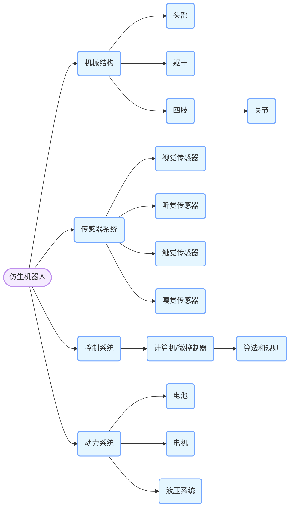

# 巴菲特 - 芒格的仿生机器人投资：下一代智能制造的核心

> 关键词：巴菲特-芒格、仿生机器人、智能制造、投资策略、人工智能、机器人技术、工业未来

> 摘要：本文围绕巴菲特 - 芒格的仿生机器人投资展开深入探讨，揭示其作为下一代智能制造核心的重要意义。首先介绍了文章的背景信息，包括目的、预期读者、文档结构和相关术语。接着阐述了仿生机器人的核心概念、原理和架构，以及相关算法和数学模型。通过实际项目案例详细展示了仿生机器人的开发和应用，分析了其在不同领域的实际应用场景。同时推荐了学习仿生机器人相关知识的工具和资源，涵盖书籍、在线课程、开发工具等。最后总结了仿生机器人的未来发展趋势与挑战，并对常见问题进行了解答，提供了扩展阅读和参考资料，为读者全面了解这一新兴领域提供了系统的知识体系。

## 1. 背景介绍 

### 1.1 目的和范围
本文旨在深入剖析巴菲特 - 芒格的仿生机器人投资行为，探究仿生机器人为何成为下一代智能制造的核心。通过对仿生机器人的技术原理、市场应用、投资价值等多方面的分析，帮助读者全面了解这一新兴领域。同时，结合实际案例和相关数据，为投资者、科技爱好者和行业从业者提供有价值的参考，以便更好地把握未来智能制造的发展趋势。

### 1.2 预期读者
- **投资者**：希望从巴菲特 - 芒格的投资视角出发，寻找有潜力的投资机会，了解仿生机器人领域的投资价值和风险。
- **科技爱好者**：对前沿科技充满好奇，想要深入了解仿生机器人的技术原理、发展现状和未来前景。
- **行业从业者**：包括智能制造、机器人技术、人工智能等领域的专业人士，期望通过本文获取行业最新动态，为自身的技术研发和业务拓展提供思路。

### 1.3 文档结构概述
本文将按照以下结构展开：首先介绍仿生机器人的背景信息，包括目的、读者群体和文档结构；接着阐述仿生机器人的核心概念、联系以及相关算法原理和数学模型；通过实际项目案例展示仿生机器人的开发和应用过程；分析仿生机器人在不同领域的实际应用场景；推荐学习和开发仿生机器人所需的工具和资源；最后总结仿生机器人的未来发展趋势与挑战，解答常见问题并提供扩展阅读和参考资料。

### 1.4 术语表
#### 1.4.1 核心术语定义
- **仿生机器人**：是一种模仿生物的形态、结构和功能而设计制造的机器人。它结合了生物学、机械工程、电子工程、计算机科学等多学科知识，旨在实现与生物相似的行为和能力。
- **智能制造**：是一种基于新一代信息技术，贯穿于设计、生产、管理、服务等制造活动各个环节，具有信息深度自感知、智慧优化自决策、精准控制自执行等功能的先进制造过程、系统与模式的总称。
- **人工智能**：是研究、开发用于模拟、延伸和扩展人的智能的理论、方法、技术及应用系统的一门新的技术科学。在仿生机器人中，人工智能技术用于实现机器人的自主决策、学习和适应能力。

#### 1.4.2 相关概念解释
- **机器人技术**：涉及机器人的设计、制造、控制、感知等多个方面的技术。在仿生机器人中，机器人技术是实现机器人物理结构和基本运动功能的基础。
- **传感器技术**：用于感知机器人周围的环境信息，如视觉传感器、听觉传感器、触觉传感器等。仿生机器人通过传感器获取环境信息，以便做出相应的决策和行动。
- **机器学习**：是人工智能的一个分支，通过让计算机从数据中学习模式和规律，从而实现预测和决策。在仿生机器人中，机器学习技术可用于机器人的自主学习和适应环境的能力。

#### 1.4.3 缩略词列表
- **AI**：Artificial Intelligence，人工智能
- **ML**：Machine Learning，机器学习
- **IoT**：Internet of Things，物联网

## 2. 核心概念与联系 

### 仿生机器人的原理和架构

仿生机器人的设计灵感来源于自然界中的生物，其原理是通过模仿生物的形态、结构和功能，实现机器人的智能化和自主化。仿生机器人的架构主要包括以下几个部分：

#### 机械结构
机械结构是仿生机器人的物理基础，它模仿生物的骨骼、肌肉和关节等结构，实现机器人的运动功能。例如，仿人机器人的机械结构通常包括头部、躯干、四肢等部分，每个部分都由多个关节连接，能够实现类似人类的运动姿态。

#### 传感器系统
传感器系统用于感知机器人周围的环境信息，包括视觉、听觉、触觉、嗅觉等多种传感器。这些传感器将环境信息转换为电信号，传输给机器人的控制系统。例如，视觉传感器可以帮助机器人识别物体的形状、颜色和位置，触觉传感器可以感知物体的硬度、温度等信息。

#### 控制系统
控制系统是仿生机器人的大脑，它接收传感器系统传来的环境信息，进行分析和处理，并根据预设的算法和规则，控制机器人的运动和行为。控制系统通常采用计算机或微控制器实现，它可以实现机器人的自主决策、学习和适应能力。

#### 动力系统
动力系统为仿生机器人提供能量，使其能够实现运动和工作。动力系统通常包括电池、电机、液压系统等，不同类型的仿生机器人根据其设计要求和应用场景，选择不同的动力系统。

### 文本示意图
```plaintext
仿生机器人
|-- 机械结构
|   |-- 头部
|   |-- 躯干
|   |-- 四肢
|       |-- 关节
|-- 传感器系统
|   |-- 视觉传感器
|   |-- 听觉传感器
|   |-- 触觉传感器
|   |-- 嗅觉传感器
|-- 控制系统
|   |-- 计算机/微控制器
|   |   |-- 算法和规则
|-- 动力系统
|   |-- 电池
|   |-- 电机
|   |-- 液压系统
```

### Mermaid 流程图


### 核心概念之间的联系
仿生机器人的各个核心概念之间相互关联、相互依存。机械结构为传感器系统、控制系统和动力系统提供了物理支撑和运动基础；传感器系统为控制系统提供了环境信息，使机器人能够感知周围的世界；控制系统根据传感器传来的信息，通过预设的算法和规则，控制动力系统驱动机械结构实现机器人的运动和行为。同时，人工智能技术贯穿于仿生机器人的各个环节，为机器人的智能化和自主化提供了支持。例如，机器学习算法可以帮助机器人从传感器数据中学习环境模式和规律，从而实现自主决策和适应环境的能力。

## 3. 核心算法原理 & 具体操作步骤 

### 运动控制算法
运动控制算法是仿生机器人实现运动功能的关键。常见的运动控制算法包括PID控制算法、模糊控制算法和神经网络控制算法等。下面以PID控制算法为例，详细阐述其原理和Python实现。

#### PID控制算法原理
PID（Proportional - Integral - Derivative）控制算法是一种经典的反馈控制算法，它根据系统的误差（设定值与实际值之间的差值）来调整控制量，使系统的输出尽可能接近设定值。PID控制算法的公式如下：

$$u(t) = K_p e(t) + K_i \int_{0}^{t} e(\tau) d\tau + K_d \frac{de(t)}{dt}$$

其中，$u(t)$ 是控制量，$e(t)$ 是误差，$K_p$ 是比例系数，$K_i$ 是积分系数，$K_d$ 是微分系数。

#### Python实现
```python
class PIDController:
    def __init__(self, Kp, Ki, Kd):
        self.Kp = Kp
        self.Ki = Ki
        self.Kd = Kd
        self.prev_error = 0
        self.integral = 0

    def update(self, setpoint, current_value, dt):
        error = setpoint - current_value
        self.integral += error * dt
        derivative = (error - self.prev_error) / dt
        output = self.Kp * error + self.Ki * self.integral + self.Kd * derivative
        self.prev_error = error
        return output

# 示例使用
Kp = 1.0
Ki = 0.1
Kd = 0.01
pid = PIDController(Kp, Ki, Kd)
setpoint = 50
current_value = 20
dt = 0.1
output = pid.update(setpoint, current_value, dt)
print(f"PID输出: {output}")
```

#### 具体操作步骤
1. **初始化PID控制器**：设置比例系数 $K_p$、积分系数 $K_i$ 和微分系数 $K_d$，并初始化误差积分和上一次误差。
2. **获取当前误差**：计算设定值与实际值之间的差值。
3. **计算积分项**：将当前误差乘以时间间隔 $dt$，并累加到误差积分中。
4. **计算微分项**：计算当前误差与上一次误差的差值，并除以时间间隔 $dt$。
5. **计算控制量**：根据PID公式计算控制量。
6. **更新上一次误差**：将当前误差保存为上一次误差。

### 路径规划算法
路径规划算法用于为仿生机器人规划从起点到终点的最优路径。常见的路径规划算法包括A*算法、Dijkstra算法和RRT算法等。下面以A*算法为例，详细阐述其原理和Python实现。

#### A*算法原理
A*算法是一种启发式搜索算法，它结合了Dijkstra算法的广度优先搜索和贪心最佳优先搜索的优点，通过评估每个节点的代价函数 $f(n) = g(n) + h(n)$ 来选择最优路径。其中，$g(n)$ 是从起点到节点 $n$ 的实际代价，$h(n)$ 是从节点 $n$ 到终点的预估代价。

#### Python实现
```python
import heapq

def heuristic(a, b):
    # 曼哈顿距离作为启发式函数
    return abs(a[0] - b[0]) + abs(a[1] - b[1])

def a_star(graph, start, goal):
    open_list = []
    heapq.heappush(open_list, (0, start))
    came_from = {}
    g_score = {node: float('inf') for node in graph}
    g_score[start] = 0
    f_score = {node: float('inf') for node in graph}
    f_score[start] = heuristic(start, goal)

    while open_list:
        _, current = heapq.heappop(open_list)
        if current == goal:
            path = []
            while current in came_from:
                path.append(current)
                current = came_from[current]
            path.append(start)
            path.reverse()
            return path

        for neighbor in graph[current]:
            tentative_g_score = g_score[current] + 1
            if tentative_g_score < g_score[neighbor]:
                came_from[neighbor] = current
                g_score[neighbor] = tentative_g_score
                f_score[neighbor] = tentative_g_score + heuristic(neighbor, goal)
                heapq.heappush(open_list, (f_score[neighbor], neighbor))

    return None

# 示例使用
graph = {
    (0, 0): [(0, 1), (1, 0)],
    (0, 1): [(0, 0), (0, 2), (1, 1)],
    (0, 2): [(0, 1), (1, 2)],
    (1, 0): [(0, 0), (1, 1)],
    (1, 1): [(0, 1), (1, 0), (1, 2)],
    (1, 2): [(0, 2), (1, 1)]
}
start = (0, 0)
goal = (1, 2)
path = a_star(graph, start, goal)
print(f"路径: {path}")
```

#### 具体操作步骤
1. **初始化**：创建开放列表和关闭列表，将起点加入开放列表，并初始化起点的 $g$ 值和 $f$ 值。
2. **选择节点**：从开放列表中选择 $f$ 值最小的节点作为当前节点。
3. **检查终点**：如果当前节点是终点，则路径规划完成，回溯路径。
4. **扩展节点**：遍历当前节点的所有邻居节点，计算邻居节点的 $g$ 值和 $f$ 值。
5. **更新节点信息**：如果邻居节点不在开放列表中，则将其加入开放列表；如果邻居节点已经在开放列表中，且新的 $g$ 值更小，则更新其 $g$ 值和 $f$ 值，并更新其父节点。
6. **重复步骤2 - 5**：直到开放列表为空或找到终点。

## 4. 数学模型和公式 & 详细讲解 & 举例说明 

### 运动学模型
运动学模型用于描述仿生机器人的运动学特性，包括位置、速度和加速度等。常见的运动学模型包括正运动学模型和逆运动学模型。

#### 正运动学模型
正运动学模型是指已知机器人各关节的角度，求解机器人末端执行器的位置和姿态。以二自由度平面机器人为例，其正运动学模型可以用以下公式表示：

$$x = l_1 \cos(\theta_1) + l_2 \cos(\theta_1 + \theta_2)$$
$$y = l_1 \sin(\theta_1) + l_2 \sin(\theta_1 + \theta_2)$$

其中，$x$ 和 $y$ 是末端执行器的位置坐标，$l_1$ 和 $l_2$ 是机器人各连杆的长度，$\theta_1$ 和 $\theta_2$ 是各关节的角度。

#### 举例说明
假设二自由度平面机器人的连杆长度 $l_1 = 1$ 和 $l_2 = 1$，关节角度 $\theta_1 = \frac{\pi}{4}$ 和 $\theta_2 = \frac{\pi}{4}$，则末端执行器的位置坐标为：

$$x = 1 \cos(\frac{\pi}{4}) + 1 \cos(\frac{\pi}{4} + \frac{\pi}{4}) \approx 0.707 + 0 = 0.707$$
$$y = 1 \sin(\frac{\pi}{4}) + 1 \sin(\frac{\pi}{4} + \frac{\pi}{4}) \approx 0.707 + 1 = 1.707$$

#### 逆运动学模型
逆运动学模型是指已知机器人末端执行器的位置和姿态，求解机器人各关节的角度。对于二自由度平面机器人，其逆运动学模型可以通过以下步骤求解：

1. 计算 $\theta_2$：
$$\cos(\theta_2) = \frac{x^2 + y^2 - l_1^2 - l_2^2}{2 l_1 l_2}$$
$$\sin(\theta_2) = \pm \sqrt{1 - \cos^2(\theta_2)}$$
$$\theta_2 = \arctan2(\sin(\theta_2), \cos(\theta_2))$$

2. 计算 $\theta_1$：
$$\beta = \arctan2(y, x)$$
$$\alpha = \arctan2(l_2 \sin(\theta_2), l_1 + l_2 \cos(\theta_2))$$
$$\theta_1 = \beta - \alpha$$

#### 举例说明
假设二自由度平面机器人的连杆长度 $l_1 = 1$ 和 $l_2 = 1$，末端执行器的位置坐标 $x = 0.707$ 和 $y = 1.707$，则：

1. 计算 $\theta_2$：
$$\cos(\theta_2) = \frac{0.707^2 + 1.707^2 - 1^2 - 1^2}{2 \times 1 \times 1} \approx 0.707$$
$$\sin(\theta_2) = \sqrt{1 - 0.707^2} \approx 0.707$$
$$\theta_2 = \arctan2(0.707, 0.707) = \frac{\pi}{4}$$

2. 计算 $\theta_1$：
$$\beta = \arctan2(1.707, 0.707) \approx 1.107$$
$$\alpha = \arctan2(1 \times 0.707, 1 + 1 \times 0.707) \approx 0.393$$
$$\theta_1 = 1.107 - 0.393 = \frac{\pi}{4}$$

### 动力学模型
动力学模型用于描述仿生机器人的动力学特性，包括力、力矩和能量等。常见的动力学模型包括牛顿 - 欧拉法和拉格朗日法。

#### 牛顿 - 欧拉法
牛顿 - 欧拉法是基于牛顿第二定律和欧拉方程来建立机器人的动力学模型。对于一个 $n$ 自由度的机器人，其动力学方程可以表示为：

$$M(q) \ddot{q} + C(q, \dot{q}) \dot{q} + G(q) = \tau$$

其中，$M(q)$ 是惯性矩阵，$C(q, \dot{q})$ 是科里奥利力和离心力矩阵，$G(q)$ 是重力向量，$\tau$ 是关节驱动力矩向量，$q$ 是关节角度向量，$\dot{q}$ 是关节角速度向量，$\ddot{q}$ 是关节角加速度向量。

#### 举例说明
以单自由度旋转关节机器人为例，其动力学方程可以简化为：

$$I \ddot{\theta} + b \dot{\theta} + m g l \sin(\theta) = \tau$$

其中，$I$ 是转动惯量，$b$ 是阻尼系数，$m$ 是机器人的质量，$g$ 是重力加速度，$l$ 是质心到关节的距离，$\theta$ 是关节角度，$\tau$ 是关节驱动力矩。

#### 拉格朗日法
拉格朗日法是基于拉格朗日方程来建立机器人的动力学模型。拉格朗日方程可以表示为：

$$\frac{d}{dt} \left( \frac{\partial L}{\partial \dot{q}_i} \right) - \frac{\partial L}{\partial q_i} = \tau_i$$

其中，$L = T - V$ 是拉格朗日函数，$T$ 是机器人的动能，$V$ 是机器人的势能，$q_i$ 是第 $i$ 个关节的角度，$\dot{q}_i$ 是第 $i$ 个关节的角速度，$\tau_i$ 是第 $i$ 个关节的驱动力矩。

#### 举例说明
对于单自由度旋转关节机器人，其动能 $T = \frac{1}{2} I \dot{\theta}^2$，势能 $V = m g l (1 - \cos(\theta))$，则拉格朗日函数 $L = \frac{1}{2} I \dot{\theta}^2 - m g l (1 - \cos(\theta))$。代入拉格朗日方程可得：

$$I \ddot{\theta} - m g l \sin(\theta) = \tau$$

## 5. 项目实战：代码实际案例和详细解释说明 

### 5.1 开发环境搭建
#### 硬件环境
- **计算机**：建议使用性能较好的计算机，如Intel Core i7及以上处理器，16GB及以上内存。
- **机器人平台**：可以选择开源的机器人平台，如Arduino、Raspberry Pi等，也可以使用专业的机器人开发套件。
- **传感器**：根据项目需求选择合适的传感器，如视觉传感器、触觉传感器、加速度传感器等。

#### 软件环境
- **操作系统**：建议使用Linux或Windows操作系统。
- **编程语言**：Python是开发仿生机器人的常用编程语言，建议安装Python 3.7及以上版本。
- **开发框架**：可以使用ROS（Robot Operating System）作为机器人开发框架，它提供了丰富的工具和库，方便机器人的开发和调试。

### 5.2 源代码详细实现和代码解读
#### 项目需求
开发一个简单的仿生机器人，实现避障功能。

#### 代码实现
```python
import RPi.GPIO as GPIO
import time

# 定义超声波传感器引脚
TRIG = 23
ECHO = 24

# 定义电机控制引脚
IN1 = 17
IN2 = 18
IN3 = 22
IN4 = 27

# 设置GPIO模式
GPIO.setmode(GPIO.BCM)

# 设置超声波传感器引脚为输入输出模式
GPIO.setup(TRIG, GPIO.OUT)
GPIO.setup(ECHO, GPIO.IN)

# 设置电机控制引脚为输出模式
GPIO.setup(IN1, GPIO.OUT)
GPIO.setup(IN2, GPIO.OUT)
GPIO.setup(IN3, GPIO.OUT)
GPIO.setup(IN4, GPIO.OUT)

def distance():
    # 发送触发信号
    GPIO.output(TRIG, True)
    time.sleep(0.00001)
    GPIO.output(TRIG, False)

    StartTime = time.time()
    StopTime = time.time()

    # 记录超声波发射时间
    while GPIO.input(ECHO) == 0:
        StartTime = time.time()

    # 记录超声波接收时间
    while GPIO.input(ECHO) == 1:
        StopTime = time.time()

    # 计算超声波传播时间
    TimeElapsed = StopTime - StartTime
    # 计算距离
    distance = (TimeElapsed * 34300) / 2

    return distance

def forward():
    GPIO.output(IN1, True)
    GPIO.output(IN2, False)
    GPIO.output(IN3, True)
    GPIO.output(IN4, False)

def backward():
    GPIO.output(IN1, False)
    GPIO.output(IN2, True)
    GPIO.output(IN3, False)
    GPIO.output(IN4, True)

def left():
    GPIO.output(IN1, False)
    GPIO.output(IN2, True)
    GPIO.output(IN3, True)
    GPIO.output(IN4, False)

def right():
    GPIO.output(IN1, True)
    GPIO.output(IN2, False)
    GPIO.output(IN3, False)
    GPIO.output(IN4, True)

def stop():
    GPIO.output(IN1, False)
    GPIO.output(IN2, False)
    GPIO.output(IN3, False)
    GPIO.output(IN4, False)

try:
    while True:
        dist = distance()
        print(f"距离: {dist} cm")
        if dist < 20:
            backward()
            time.sleep(1)
            left()
            time.sleep(1)
        else:
            forward()
        time.sleep(0.1)

except KeyboardInterrupt:
    print("程序终止")
    GPIO.cleanup()
```

#### 代码解读
1. **导入库**：导入RPi.GPIO库用于控制GPIO引脚，导入time库用于时间控制。
2. **定义引脚**：定义超声波传感器和电机控制的引脚。
3. **设置GPIO模式**：设置GPIO模式为BCM模式。
4. **设置引脚模式**：将超声波传感器的触发引脚设置为输出模式，回声引脚设置为输入模式；将电机控制引脚设置为输出模式。
5. **定义距离测量函数**：通过发送触发信号和接收回声信号，计算超声波传播时间，从而计算出距离。
6. **定义电机控制函数**：定义前进、后退、左转、右转和停止等电机控制函数。
7. **主循环**：在主循环中不断测量距离，根据距离判断是否需要避障，并控制电机的运动。
8. **异常处理**：当用户按下Ctrl + C时，程序终止，并清理GPIO引脚。

### 5.3 代码解读与分析
#### 优点
- **简单易懂**：代码结构清晰，逻辑简单，适合初学者学习。
- **可扩展性**：可以根据需要添加更多的传感器和功能，如视觉传感器、语音识别等。
- **实时性**：通过不断测量距离，能够实时响应障碍物的出现，实现避障功能。

#### 缺点
- **精度有限**：超声波传感器的测量精度有限，可能会受到环境因素的影响。
- **缺乏智能决策**：代码只是简单地根据距离判断是否避障，缺乏智能决策能力，无法应对复杂的环境。

#### 改进方向
- **使用更精确的传感器**：可以使用激光雷达、深度相机等更精确的传感器，提高距离测量的精度。
- **引入人工智能算法**：可以引入机器学习、深度学习等人工智能算法，实现智能决策和自主导航。

## 6. 实际应用场景 
### 工业制造
在工业制造领域，仿生机器人可以模拟人类的操作动作，实现高精度、高效率的生产任务。例如，仿生机械臂可以模仿人类手臂的运动，进行零部件的装配、焊接和搬运等工作，提高生产效率和产品质量。同时，仿生机器人还可以在危险环境中代替人类工作，如高温、高压、有毒等环境，保障工人的安全。

### 医疗保健
在医疗保健领域，仿生机器人可以用于手术辅助、康复治疗和护理等方面。例如，仿生手术机器人可以通过精确的操作，减少手术创伤和并发症，提高手术的成功率。仿生康复机器人可以根据患者的病情和康复需求，提供个性化的康复训练方案，帮助患者恢复身体功能。此外，仿生护理机器人可以为老年人和残疾人提供日常生活帮助，如照顾起居、陪伴聊天等。

### 物流配送
在物流配送领域，仿生机器人可以实现货物的自动分拣、搬运和配送。例如，仿生AGV（Automated Guided Vehicle）可以在仓库中自动导航，将货物从货架上搬运到指定位置，提高物流效率。仿生无人机可以实现货物的空中配送，缩短配送时间，提高配送的灵活性。

### 家庭服务
在家庭服务领域，仿生机器人可以为家庭提供清洁、安保、娱乐等服务。例如，仿生扫地机器人可以自动清扫地面，保持家庭环境的清洁。仿生安保机器人可以实时监控家庭环境，发现异常情况及时报警。仿生娱乐机器人可以陪伴儿童玩耍、讲故事，为家庭带来欢乐。

### 军事国防
在军事国防领域，仿生机器人可以用于侦察、排雷、攻击等任务。例如，仿生侦察机器人可以模仿昆虫或动物的外形和行为，潜入敌方阵地进行侦察。仿生排雷机器人可以在危险区域进行排雷作业，减少人员伤亡。仿生攻击机器人可以携带武器，对敌方目标进行攻击。

## 7. 工具和资源推荐
### 7.1 学习资源推荐
#### 7.1.1 书籍推荐
- 《机器人学导论》：本书全面介绍了机器人学的基本概念、理论和方法，包括运动学、动力学、控制理论等方面的内容，是学习机器人学的经典教材。
- 《人工智能：一种现代的方法》：本书系统地介绍了人工智能的基本概念、算法和应用，包括搜索算法、机器学习、自然语言处理等方面的内容，是学习人工智能的权威书籍。
- 《Python机器人编程实战》：本书结合Python编程语言和ROS开发框架，介绍了机器人编程的基本方法和实践技巧，适合初学者学习。

#### 7.1.2 在线课程
- Coursera上的“机器人学基础”课程：该课程由宾夕法尼亚大学的教授授课，介绍了机器人学的基本概念、运动学、动力学和控制理论等方面的内容。
- edX上的“人工智能导论”课程：该课程由麻省理工学院的教授授课，介绍了人工智能的基本概念、算法和应用，包括搜索算法、机器学习、自然语言处理等方面的内容。
- Udemy上的“Python机器人编程入门”课程：该课程结合Python编程语言和ROS开发框架，介绍了机器人编程的基本方法和实践技巧，适合初学者学习。

#### 7.1.3 技术博客和网站
- 机器人之家（https://www.robotbase.cn/）：提供机器人行业的最新动态、技术文章和产品评测等内容。
- 机器之心（https://www.alizhizhen.com/）：专注于人工智能和机器人领域的技术报道和分析，提供前沿的技术文章和研究成果。
- ROS官方网站（https://www.ros.org/）：提供ROS开发框架的官方文档、教程和社区资源，是学习和开发ROS的重要平台。

### 7.2 开发工具框架推荐
#### 7.2.1 IDE和编辑器
- PyCharm：是一款专业的Python集成开发环境，提供代码编辑、调试、版本控制等功能，适合Python开发。
- Visual Studio Code：是一款轻量级的代码编辑器，支持多种编程语言，具有丰富的插件和扩展功能，适合快速开发。
- Eclipse：是一款开源的集成开发环境，支持多种编程语言和开发框架，具有强大的插件和扩展功能，适合大型项目开发。

#### 7.2.2 调试和性能分析工具
- GDB：是一款开源的调试工具，支持多种编程语言，可用于调试程序的运行时错误。
- Valgrind：是一款开源的内存调试和性能分析工具，可用于检测内存泄漏、内存越界等问题。
- ROS Profiler：是ROS开发框架自带的性能分析工具，可用于分析ROS节点的性能和资源使用情况。

#### 7.2.3 相关框架和库
- ROS（Robot Operating System）：是一个开源的机器人开发框架，提供了丰富的工具和库，方便机器人的开发和调试。
- OpenCV：是一个开源的计算机视觉库，提供了图像处理、特征提取、目标检测等功能，可用于机器人的视觉感知。
- PyTorch：是一个开源的深度学习框架，提供了丰富的深度学习模型和算法，可用于机器人的智能决策和学习。

### 7.3 相关论文著作推荐
#### 7.3.1 经典论文
- "A Mathematical Introduction to Robotic Manipulation" by Richard M. Murray, Zexiang Li, and S. Shankar Sastry：本书是机器人操作领域的经典著作，介绍了机器人运动学、动力学和控制理论的数学基础。
- "Probabilistic Robotics" by Sebastian Thrun, Wolfram Burgard, and Dieter Fox：本书是机器人概率推理领域的经典著作，介绍了机器人定位、建图和导航的概率方法。
- "Neural Networks and Deep Learning" by Michael Nielsen：本书是深度学习领域的经典著作，介绍了神经网络和深度学习的基本概念、算法和应用。

#### 7.3.2 最新研究成果
- 每年的IEEE International Conference on Robotics and Automation (ICRA)、International Conference on Intelligent Robots and Systems (IROS)等会议上会发表大量关于仿生机器人和智能制造的最新研究成果。
- 相关学术期刊如《Journal of Field Robotics》、《Autonomous Robots》等也会刊登仿生机器人和智能制造领域的最新研究论文。

#### 7.3.3 应用案例分析
- 《机器人应用案例集》：本书收集了大量机器人在工业制造、医疗保健、物流配送等领域的应用案例，分析了机器人的应用场景、技术方案和实施效果。
- 各大科技公司的官方博客和技术报告中也会分享仿生机器人和智能制造的应用案例，如谷歌、微软、亚马逊等公司。

## 8. 总结：未来发展趋势与挑战
### 未来发展趋势
#### 智能化
未来的仿生机器人将具备更高的智能化水平，能够通过机器学习、深度学习等人工智能技术，实现自主学习、自主决策和自主适应环境的能力。例如，仿生机器人可以通过对环境数据的学习和分析，自动调整自身的行为和策略，以更好地完成任务。

#### 柔性化
未来的仿生机器人将更加注重柔性化设计，模仿生物的柔软性和灵活性。柔性仿生机器人可以更好地适应复杂的环境和任务需求，如在狭小空间内作业、与人进行亲密接触等。例如，柔性机械臂可以像人类手臂一样灵活弯曲和伸展，完成更加精细的操作任务。

#### 微型化
未来的仿生机器人将朝着微型化方向发展，开发出尺寸更小、功能更强的微型仿生机器人。微型仿生机器人可以在微观领域发挥重要作用，如医疗诊断、生物检测、微观制造等。例如，微型机器人可以进入人体内部，进行疾病诊断和治疗。

#### 集群化
未来的仿生机器人将实现集群化协作，多个仿生机器人可以通过无线通信和协同算法，实现群体智能和协作任务。例如，一群仿生无人机可以协同完成大面积的搜索和监测任务，提高工作效率和准确性。

### 挑战
#### 技术瓶颈
目前，仿生机器人在传感器技术、人工智能算法、动力系统等方面还存在技术瓶颈。例如，传感器的精度和可靠性还需要进一步提高，人工智能算法的计算效率和可解释性还需要进一步优化，动力系统的能量密度和续航能力还需要进一步增强。

#### 伦理道德问题
随着仿生机器人的智能化和自主化程度不断提高，伦理道德问题也日益凸显。例如，仿生机器人的决策和行为可能会对人类的安全和利益造成影响，如何确保仿生机器人的行为符合人类的伦理道德标准是一个亟待解决的问题。

#### 法律监管问题
目前，针对仿生机器人的法律监管还不完善，缺乏相应的法律法规和标准规范。例如，在仿生机器人造成人身伤害或财产损失时，如何确定责任主体和赔偿方式是一个需要解决的问题。

#### 社会就业问题
仿生机器人的广泛应用可能会对社会就业结构产生影响，导致一些传统职业的消失和新职业的出现。如何应对仿生机器人带来的社会就业问题，促进就业结构的调整和升级是一个需要关注的问题。

## 9. 附录：常见问题与解答
### 问题1：仿生机器人和传统机器人有什么区别？
答：仿生机器人是模仿生物的形态、结构和功能而设计制造的机器人，它具有更高的灵活性、适应性和智能化水平。传统机器人则是基于传统的机械设计和控制理论，通常具有固定的形态和功能，灵活性和适应性相对较差。

### 问题2：仿生机器人的应用前景如何？
答：仿生机器人的应用前景非常广阔，涉及工业制造、医疗保健、物流配送、家庭服务、军事国防等多个领域。随着技术的不断发展和进步，仿生机器人的应用范围将会不断扩大，为人类的生产和生活带来更多的便利和效益。

### 问题3：学习仿生机器人需要具备哪些知识和技能？
答：学习仿生机器人需要具备机械工程、电子工程、计算机科学、生物学等多学科的知识和技能。具体包括机器人运动学、动力学、控制理论、传感器技术、人工智能算法等方面的知识，以及编程、电路设计、机械设计等方面的技能。

### 问题4：如何选择适合自己的仿生机器人开发平台？
答：选择适合自己的仿生机器人开发平台需要考虑以下几个因素：
- **功能需求**：根据自己的项目需求，选择具有相应功能的开发平台。
- **易用性**：选择易于使用和学习的开发平台，降低开发难度和成本。
- **社区支持**：选择具有活跃社区支持的开发平台，方便获取技术支持和资源共享。
- **成本**：根据自己的预算，选择合适的开发平台。

### 问题5：仿生机器人的安全性如何保障？
答：保障仿生机器人的安全性需要从多个方面入手：
- **技术层面**：采用可靠的传感器和控制系统，确保机器人的行为可控。同时，设计安全机制和故障诊断系统，及时发现和处理异常情况。
- **法律层面**：制定相关的法律法规和标准规范，明确仿生机器人的安全要求和责任主体。
- **伦理层面**：加强对仿生机器人研发和应用的伦理审查，确保机器人的行为符合人类的伦理道德标准。

## 10. 扩展阅读 & 参考资料
### 扩展阅读
- 《机器人时代：人类与机器共舞的未来》：本书探讨了机器人技术的发展对人类社会的影响，以及人类如何与机器人共存和合作。
- 《奇点临近》：本书提出了“奇点”的概念，探讨了人工智能和机器人技术的发展将如何导致人类社会的巨大变革。
- 《失控：全人类的最终命运和结局》：本书介绍了分布式系统、自组织、进化等概念，对理解仿生机器人的发展具有重要的启示作用。

### 参考资料
- IEEE Robotics and Automation Society官方网站：提供机器人领域的最新研究成果、会议信息和技术标准等。
- 国际机器人联合会（IFR）官方网站：提供全球机器人市场的统计数据和行业报告。
- 各高校和科研机构的学术数据库：如IEEE Xplore、ACM Digital Library等，可获取机器人领域的学术论文和研究报告。