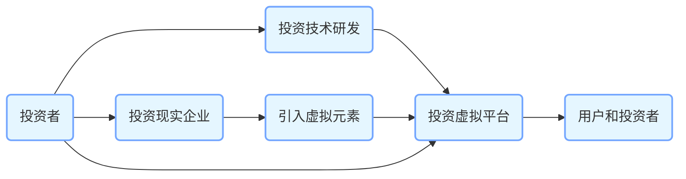

# 巴菲特 - 芒格的元宇宙经济观：虚拟与现实的融合投资

> 关键词：巴菲特；芒格；元宇宙经济观；虚拟与现实融合；投资策略

> 摘要：本文深入探讨了巴菲特 - 芒格的元宇宙经济观，分析了在元宇宙这一新兴领域中虚拟与现实融合投资的相关概念、原理、算法以及实际应用场景。从背景介绍出发，阐述核心概念与联系，详细讲解核心算法原理及操作步骤，结合数学模型和公式进行理论分析，并通过项目实战案例加深理解。同时，介绍了元宇宙投资的实际应用场景、推荐了相关工具和资源，最后总结未来发展趋势与挑战，解答常见问题并提供扩展阅读和参考资料，旨在为投资者和相关从业者提供全面的元宇宙投资知识体系。

## 1. 背景介绍 
### 1.1 目的和范围
随着科技的飞速发展，元宇宙概念逐渐走进大众视野，成为投资领域的热门话题。巴菲特和芒格作为投资界的传奇人物，他们的投资理念和观点一直备受关注。本文的目的是探讨巴菲特 - 芒格的元宇宙经济观，分析在元宇宙环境下虚拟与现实融合投资的可行性、策略和潜在风险。研究范围涵盖元宇宙的核心概念、相关技术、经济模型以及实际投资案例等方面。

### 1.2 预期读者
本文预期读者包括对元宇宙投资感兴趣的投资者、金融从业者、科技爱好者以及相关领域的研究人员。通过阅读本文，读者可以了解巴菲特 - 芒格的投资理念在元宇宙领域的应用，掌握虚拟与现实融合投资的基本方法和技巧。

### 1.3 文档结构概述
本文将按照以下结构展开：首先介绍元宇宙相关的背景知识，包括核心概念和联系；接着阐述核心算法原理和具体操作步骤，结合数学模型进行理论分析；然后通过项目实战案例详细说明元宇宙投资的实际操作；之后介绍元宇宙投资的实际应用场景；推荐相关的工具和资源；最后总结未来发展趋势与挑战，解答常见问题并提供扩展阅读和参考资料。

### 1.4 术语表
#### 1.4.1 核心术语定义
- **元宇宙**：是一个平行于现实世界的虚拟世界，人们可以在其中进行社交、娱乐、工作、学习等活动，通过虚拟现实（VR）、增强现实（AR）等技术实现沉浸式体验。
- **虚拟与现实融合投资**：将资金投入到既涉及虚拟世界元素又与现实世界有紧密联系的项目或资产中，以获取投资回报。
- **巴菲特 - 芒格投资理念**：强调价值投资，注重公司的内在价值、财务状况和长期发展潜力，通过深入研究和分析做出投资决策。

#### 1.4.2 相关概念解释
- **虚拟现实（VR）**：利用计算机技术生成一个模拟环境，用户通过佩戴 VR 设备进入该环境，获得身临其境的感觉。
- **增强现实（AR）**：将虚拟信息与现实场景相结合，通过 AR 设备（如智能手机、智能眼镜等）呈现给用户，增强用户对现实世界的感知。
- **区块链技术**：一种去中心化的分布式账本技术，具有不可篡改、安全可靠等特点，在元宇宙中可用于资产确权、交易记录等方面。

#### 1.4.3 缩略词列表
- **VR**：Virtual Reality（虚拟现实）
- **AR**：Augmented Reality（增强现实）
- **NFT**：Non - Fungible Token（非同质化代币）

## 2. 核心概念与联系 

### 核心概念原理
元宇宙的核心原理是构建一个虚拟的数字世界，这个世界与现实世界相互关联、相互影响。在元宇宙中，用户可以拥有自己的虚拟身份、虚拟资产，并进行各种虚拟活动。虚拟与现实融合投资则是基于元宇宙的发展，将投资目光投向那些能够在虚拟世界和现实世界之间架起桥梁的项目。

巴菲特 - 芒格的投资理念强调价值投资，即寻找那些被低估的、具有长期发展潜力的资产。在元宇宙领域，这意味着要寻找那些具有真实应用场景、能够产生实际经济效益的虚拟项目或与元宇宙相关的现实企业。

### 架构的文本示意图
元宇宙经济体系可以看作是一个多层次的架构，底层是支撑元宇宙运行的技术基础设施，包括 VR/AR 技术、区块链技术、云计算等；中间层是各种虚拟平台和应用，如虚拟社交平台、虚拟游戏、虚拟电商等；上层则是用户和投资者，他们在元宇宙中进行各种活动和投资。

虚拟与现实融合投资则贯穿于整个架构中，投资者可以在底层投资技术研发企业，在中间层投资有潜力的虚拟平台和应用，同时也可以关注那些将虚拟元素引入现实业务的企业。

### Mermaid 流程图


## 3. 核心算法原理 & 具体操作步骤 

### 核心算法原理
在元宇宙投资中，我们可以借鉴巴菲特 - 芒格的价值投资理念，通过分析项目的内在价值来进行投资决策。以下是一个简单的基于财务指标的价值评估算法示例：

假设我们要评估一个元宇宙相关企业的价值，我们可以使用以下公式：

企业价值 $V$ = 预期未来现金流现值 + 无形资产价值 - 负债

预期未来现金流现值可以通过折现现金流（DCF）模型来计算：

$PV = \sum_{t = 1}^{n}\frac{CF_t}{(1 + r)^t}$

其中，$PV$ 是预期未来现金流现值，$CF_t$ 是第 $t$ 期的预期现金流，$r$ 是折现率，$n$ 是预测期数。

无形资产价值可以考虑企业的品牌价值、技术专利、用户资源等因素，通过市场调研和专业评估来确定。

### 具体操作步骤
以下是使用 Python 实现上述算法的示例代码：

```python
import numpy as np

def calculate_dcf(cash_flows, discount_rate):
    """
    计算折现现金流现值
    :param cash_flows: 预期未来现金流列表
    :param discount_rate: 折现率
    :return: 折现现金流现值
    """
    n = len(cash_flows)
    present_values = []
    for t in range(n):
        present_value = cash_flows[t] / ((1 + discount_rate) ** (t + 1))
        present_values.append(present_value)
    return np.sum(present_values)

# 示例数据
cash_flows = [100, 120, 150, 180, 200]  # 预期未来 5 年的现金流
discount_rate = 0.1  # 折现率为 10%
intangible_value = 500  # 无形资产价值
liabilities = 200  # 负债

# 计算折现现金流现值
dcf = calculate_dcf(cash_flows, discount_rate)

# 计算企业价值
enterprise_value = dcf + intangible_value - liabilities

print(f"企业价值: {enterprise_value}")
```

### 代码解释
1. `calculate_dcf` 函数：该函数接受预期未来现金流列表和折现率作为输入，通过循环计算每一期现金流的现值，并将它们相加得到折现现金流现值。
2. 示例数据：定义了预期未来 5 年的现金流、折现率、无形资产价值和负债。
3. 计算折现现金流现值：调用 `calculate_dcf` 函数计算折现现金流现值。
4. 计算企业价值：根据公式计算企业价值，并将结果打印输出。

## 4. 数学模型和公式 & 详细讲解 & 举例说明 

### 折现现金流（DCF）模型
折现现金流模型是一种常用的估值方法，其基本原理是将未来的现金流折现到当前时刻，以反映资金的时间价值。公式如下：

$$PV = \sum_{t = 1}^{n}\frac{CF_t}{(1 + r)^t}$$

其中：
- $PV$：预期未来现金流现值
- $CF_t$：第 $t$ 期的预期现金流
- $r$：折现率
- $n$：预测期数

### 详细讲解
折现率 $r$ 反映了投资者对资金时间价值和投资风险的预期。一般来说，折现率越高，未来现金流的现值越低，说明投资者对风险的要求越高。

预测期数 $n$ 是根据企业的发展阶段和市场情况来确定的。对于处于成长阶段的企业，预测期数可以适当延长；对于成熟企业，预测期数可以相对较短。

### 举例说明
假设一家元宇宙游戏公司，预计未来 3 年的现金流分别为 200 万元、300 万元和 400 万元，折现率为 15%。则该公司预期未来现金流现值为：

$$PV=\frac{200}{(1 + 0.15)^1}+\frac{300}{(1 + 0.15)^2}+\frac{400}{(1 + 0.15)^3}$$

$$PV=\frac{200}{1.15}+\frac{300}{1.3225}+\frac{400}{1.520875}$$

$$PV\approx173.91 + 226.80+262.98 = 663.69$$（万元）

如果该公司的无形资产价值为 500 万元，负债为 100 万元，则该公司的企业价值为：

$V = 663.69+500 - 100 = 1063.69$（万元）

## 5. 项目实战：代码实际案例和详细解释说明 

### 5.1  开发环境搭建
为了实现元宇宙投资分析的项目实战，我们需要搭建以下开发环境：
- **Python 环境**：建议使用 Python 3.7 及以上版本。可以从 Python 官方网站（https://www.python.org/downloads/）下载并安装。
- **开发工具**：推荐使用 PyCharm 或 Jupyter Notebook。PyCharm 是一款功能强大的 Python 集成开发环境，适合进行大型项目的开发；Jupyter Notebook 则适合进行交互式数据分析和代码演示。
- **必要的库**：安装 `numpy`、`pandas` 等常用的数据分析库。可以使用以下命令进行安装：
```sh
pip install numpy pandas
```

### 5.2  源代码详细实现和代码解读
以下是一个更复杂的元宇宙投资分析项目的示例代码，该代码模拟了对多个元宇宙相关企业的投资决策过程：

```python
import numpy as np
import pandas as pd

# 定义企业类
class Company:
    def __init__(self, name, cash_flows, discount_rate, intangible_value, liabilities):
        self.name = name
        self.cash_flows = cash_flows
        self.discount_rate = discount_rate
        self.intangible_value = intangible_value
        self.liabilities = liabilities

    def calculate_dcf(self):
        n = len(self.cash_flows)
        present_values = []
        for t in range(n):
            present_value = self.cash_flows[t] / ((1 + self.discount_rate) ** (t + 1))
            present_values.append(present_value)
        return np.sum(present_values)

    def calculate_enterprise_value(self):
        dcf = self.calculate_dcf()
        return dcf + self.intangible_value - self.liabilities

# 创建企业列表
companies = [
    Company("MetaverseGame1", [200, 300, 400], 0.15, 500, 100),
    Company("MetaversePlatform1", [300, 400, 500], 0.12, 800, 200),
    Company("MetaverseTech1", [100, 150, 200], 0.18, 300, 50)
]

# 计算每个企业的价值
results = []
for company in companies:
    enterprise_value = company.calculate_enterprise_value()
    results.append({
        "公司名称": company.name,
        "企业价值": enterprise_value
    })

# 将结果转换为 DataFrame 并排序
df = pd.DataFrame(results)
df = df.sort_values(by="企业价值", ascending=False)

print(df)
```

### 5.3  代码解读与分析
1. **企业类 `Company`**：定义了一个企业类，包含企业的名称、预期未来现金流、折现率、无形资产价值和负债等属性。类中定义了两个方法：`calculate_dcf` 用于计算折现现金流现值，`calculate_enterprise_value` 用于计算企业价值。
2. **创建企业列表**：创建了三个元宇宙相关企业的实例，并将它们存储在一个列表中。
3. **计算企业价值**：遍历企业列表，调用每个企业的 `calculate_enterprise_value` 方法计算企业价值，并将结果存储在一个列表中。
4. **结果展示**：将结果转换为 `pandas` 的 `DataFrame` 格式，并按照企业价值进行降序排序，最后打印输出。

通过这个项目实战，我们可以对多个元宇宙相关企业进行价值评估，并根据评估结果做出投资决策。

## 6. 实际应用场景 
### 虚拟房地产投资
在元宇宙中，虚拟房地产是一种热门的投资资产。投资者可以购买虚拟土地、建筑物等，并通过开发、租赁或转售来获取收益。例如，在某些元宇宙平台上，一块热门地段的虚拟土地价格可能会不断上涨，投资者可以通过长期持有获得资产增值。

### 虚拟品牌和IP投资
随着元宇宙的发展，虚拟品牌和 IP 的价值也逐渐凸显。投资者可以投资有潜力的虚拟品牌和 IP，通过授权、合作等方式实现商业变现。比如，一些知名的虚拟偶像、虚拟角色可以通过广告代言、周边产品销售等方式创造收益。

### 现实企业的元宇宙转型投资
许多现实企业也在积极探索元宇宙领域，通过引入虚拟元素来提升业务竞争力。投资者可以关注这些企业的转型项目，投资那些有成功转型潜力的企业。例如，传统的零售企业可以通过创建虚拟购物场景，吸引更多的消费者，提高销售额。

### 元宇宙技术研发投资
元宇宙的发展离不开各种技术的支持，如 VR/AR 技术、区块链技术、人工智能等。投资者可以投资那些在元宇宙技术研发方面具有领先优势的企业，分享技术发展带来的红利。

## 7. 工具和资源推荐
### 7.1 学习资源推荐
#### 7.1.1 书籍推荐
- 《元宇宙通证》：本书深入探讨了元宇宙的经济体系和通证机制，对于理解元宇宙的经济原理有很大帮助。
- 《价值投资：从格雷厄姆到巴菲特》：介绍了价值投资的理论和方法，是学习巴菲特 - 芒格投资理念的经典书籍。
- 《虚拟现实：从概念到实践》：详细介绍了虚拟现实技术的原理、应用和发展趋势，对于了解元宇宙的技术基础有重要意义。

#### 7.1.2 在线课程
- Coursera 上的“区块链基础”课程：帮助学习者了解区块链技术的基本原理和应用，这是元宇宙中资产确权和交易的重要技术支撑。
- edX 上的“人工智能基础”课程：学习人工智能的基本概念和算法，了解其在元宇宙中的应用场景。
- Udemy 上的“元宇宙开发实战”课程：通过实际项目案例，学习如何开发元宇宙相关的应用程序。

#### 7.1.3 技术博客和网站
- 元宇宙前线（https://www.metaversefrontier.com/）：提供元宇宙领域的最新资讯、技术动态和行业分析。
- 巴伦周刊（https://www.barrons.com/）：关注金融市场和投资领域，有关于元宇宙投资的相关报道和分析。
- 36氪（https://36kr.com/）：涵盖科技、商业等多个领域，有许多关于元宇宙的深度报道和研究文章。

### 7.2 开发工具框架推荐
#### 7.2.1 IDE和编辑器
- PyCharm：功能强大的 Python 集成开发环境，提供代码编辑、调试、版本控制等多种功能，适合进行元宇宙投资分析和开发。
- Visual Studio Code：轻量级的代码编辑器，支持多种编程语言和插件扩展，可用于开发元宇宙相关的前端和后端应用。
- Unity：一款跨平台的游戏开发引擎，广泛应用于元宇宙虚拟场景的开发。

#### 7.2.2 调试和性能分析工具
- Py-Spy：用于 Python 代码的性能分析工具，可以帮助开发者找出代码中的性能瓶颈。
- Chrome DevTools：浏览器自带的调试工具，可用于调试元宇宙前端应用的代码和性能。
- Unity Profiler：Unity 引擎自带的性能分析工具，可用于优化元宇宙虚拟场景的性能。

#### 7.2.3 相关框架和库
- TensorFlow：开源的机器学习框架，可用于开发元宇宙中的人工智能应用，如图像识别、自然语言处理等。
- Web3.py：Python 库，用于与以太坊区块链进行交互，可用于元宇宙中的资产交易和智能合约开发。
- Three.js：JavaScript 库，用于创建和展示 3D 图形，可用于开发元宇宙的前端虚拟场景。

### 7.3 相关论文著作推荐
#### 7.3.1 经典论文
- 《The Metaverse and How It Will Revolutionize Everything》：探讨了元宇宙的概念、发展趋势和对社会的影响。
- 《Value Investing: A Fundamental Approach to Security Analysis》：阐述了价值投资的基本理论和方法，是价值投资领域的经典论文。
- 《Blockchain Technology and Its Applications in the Metaverse》：研究了区块链技术在元宇宙中的应用场景和优势。

#### 7.3.2 最新研究成果
- 《Metaverse Economics: A New Frontier in Digital Finance》：分析了元宇宙的经济体系和金融模式，探讨了元宇宙投资的新机遇和挑战。
- 《The Impact of Virtual Reality on Consumer Behavior in the Metaverse》：研究了虚拟现实技术对元宇宙中消费者行为的影响，为企业的市场策略提供参考。
- 《AI - Driven Innovation in the Metaverse》：探讨了人工智能技术在元宇宙中的创新应用和发展趋势。

#### 7.3.3 应用案例分析
- 《Case Studies of Successful Metaverse Investments》：分析了一些成功的元宇宙投资案例，总结了投资经验和策略。
- 《How Traditional Companies Are Transforming into the Metaverse》：介绍了传统企业向元宇宙转型的成功案例，为企业的转型提供借鉴。
- 《The Business Model of Virtual Brands in the Metaverse》：研究了元宇宙中虚拟品牌的商业模式和盈利途径。

## 8. 总结：未来发展趋势与挑战
### 未来发展趋势
- **技术融合加速**：VR/AR、区块链、人工智能等技术将不断融合，推动元宇宙的发展。例如，区块链技术将为元宇宙中的资产交易提供更安全、透明的环境；人工智能技术将为元宇宙带来更智能的交互体验。
- **应用场景拓展**：元宇宙的应用场景将不断拓展，除了游戏、社交等领域，还将涉及教育、医疗、工业等多个领域。例如，在教育领域，元宇宙可以提供沉浸式的学习环境，提高学习效果。
- **投资规模扩大**：随着元宇宙的发展，越来越多的投资者将关注这一领域，投资规模将不断扩大。虚拟房地产、虚拟品牌等资产的价值将进一步提升。

### 挑战
- **技术瓶颈**：目前，VR/AR 技术的体验还不够完美，存在分辨率低、眩晕感等问题；区块链技术的性能和可扩展性也有待提高。这些技术瓶颈将制约元宇宙的发展。
- **监管难题**：元宇宙是一个新兴领域，相关的法律法规还不完善，监管难度较大。例如，虚拟资产的产权界定、交易监管等问题需要进一步解决。
- **伦理和社会问题**：元宇宙的发展可能会带来一些伦理和社会问题，如虚拟世界与现实世界的界限模糊、隐私泄露等。如何平衡虚拟世界和现实世界的关系，保障用户的权益，是需要解决的重要问题。

## 9. 附录：常见问题与解答
### 问题 1：元宇宙投资的风险大吗？
解答：元宇宙投资具有一定的风险。一方面，元宇宙是一个新兴领域，技术发展和市场需求存在不确定性；另一方面，相关的法律法规还不完善，监管风险较高。但是，如果投资者能够深入研究项目的基本面，选择有潜力的投资标的，并合理控制风险，也可以获得较高的回报。

### 问题 2：如何判断一个元宇宙项目是否有投资价值？
解答：可以从以下几个方面判断一个元宇宙项目的投资价值：
- **技术实力**：项目团队的技术水平和研发能力是关键，如是否掌握核心技术、是否有成功的技术应用案例等。
- **商业模型**：项目的商业模型是否清晰、可行，是否有明确的盈利途径。
- **市场需求**：项目所针对的市场需求是否真实、广泛，是否有足够的用户群体。
- **团队背景**：项目团队的成员背景和经验是否丰富，是否有相关领域的专业知识和管理经验。

### 问题 3：巴菲特和芒格对元宇宙投资持什么态度？
解答：截至目前，巴菲特和芒格并没有明确表达对元宇宙投资的态度。但是，从他们一贯的投资理念来看，他们更倾向于投资那些具有稳定现金流、真实盈利能力和长期发展潜力的企业。在元宇宙领域，他们可能会关注那些有实际应用场景、能够产生实际经济效益的项目。

## 10. 扩展阅读 & 参考资料
### 扩展阅读
- 《元宇宙改变一切》
- 《区块链革命：比特币底层技术如何改变货币、商业和世界》
- 《人工智能：现代方法》

### 参考资料
- 相关企业的财务报表和年报
- 行业研究报告，如艾瑞咨询、Gartner 等机构发布的元宇宙相关报告
- 学术期刊论文，如《ACM Transactions on Multimedia Computing, Communications, and Applications》《IEEE Transactions on Virtual Reality and 3D User Interfaces》等期刊上的相关研究论文。