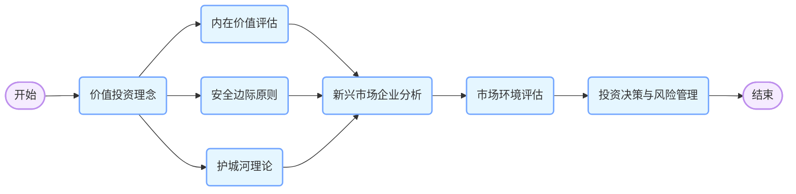

# 巴菲特 - 芒格的新兴市场投资策略：机遇与风险的平衡

> 关键词：巴菲特、芒格、新兴市场、投资策略、机遇、风险、平衡

> 摘要：本文深入探讨了巴菲特 - 芒格的新兴市场投资策略，旨在剖析在新兴市场中如何平衡机遇与风险。通过对背景的介绍，阐述投资的目的、范围以及相关术语；详细讲解核心概念与联系，揭示投资策略的原理和架构；分析核心算法原理及具体操作步骤，以 Python 代码示例展示决策逻辑；运用数学模型和公式进行理论支撑并举例说明；结合项目实战给出代码案例及解读；探讨实际应用场景；推荐相关工具和资源；最后总结未来发展趋势与挑战，解答常见问题并提供参考资料，帮助投资者更好地理解和运用巴菲特 - 芒格的投资理念在新兴市场中实现收益最大化。

## 1. 背景介绍 
### 1.1 目的和范围
巴菲特和芒格作为投资界的传奇人物，他们的投资理念和策略一直备受关注。新兴市场由于其高增长潜力和独特的市场环境，吸引了众多投资者的目光。本文的目的在于深入研究巴菲特 - 芒格的投资智慧在新兴市场的应用，分析在新兴市场投资过程中如何把握机遇并有效控制风险。研究范围涵盖新兴市场的各个领域，包括但不限于金融、科技、消费等行业，同时涉及不同地区的新兴市场，如亚洲、非洲、拉丁美洲等。

### 1.2 预期读者
本文预期读者包括专业投资者、投资机构从业者、金融领域的研究人员以及对投资感兴趣的普通大众。无论是希望借鉴巴菲特 - 芒格投资策略的专业人士，还是想要了解新兴市场投资基本原理的初学者，都能从本文中获取有价值的信息。

### 1.3 文档结构概述
本文首先介绍背景信息，包括目的、范围、预期读者和术语表。接着阐述核心概念与联系，通过文本示意图和 Mermaid 流程图展示投资策略的原理和架构。然后详细讲解核心算法原理和具体操作步骤，以 Python 代码示例说明。之后运用数学模型和公式进行理论分析并举例。再通过项目实战给出代码案例及解读。探讨实际应用场景，推荐相关工具和资源。最后总结未来发展趋势与挑战，解答常见问题并提供参考资料。

### 1.4 术语表
#### 1.4.1 核心术语定义
- **新兴市场**：指发展中国家或地区的金融市场，具有较高的经济增长潜力，但同时也伴随着较高的风险和不确定性。
- **内在价值**：企业在其剩余寿命中可以产生的现金流量的折现值，是巴菲特 - 芒格投资决策的重要依据。
- **安全边际**：指股票的市场价格低于其内在价值的差额，是投资时保护本金的重要原则。

#### 1.4.2 相关概念解释
- **价值投资**：一种投资策略，强调通过分析公司的基本面，寻找被市场低估的股票，并长期持有以获取价值回归带来的收益。
- **护城河理论**：指企业所拥有的可持续竞争优势，如同城堡周围的护城河一样，保护企业免受竞争对手的侵蚀。

#### 1.4.3 缩略词列表
- **GDP**：国内生产总值（Gross Domestic Product）
- **PE**：市盈率（Price - Earnings Ratio）
- **ROE**：净资产收益率（Return on Equity）

## 2. 核心概念与联系 

### 核心概念原理
巴菲特 - 芒格的新兴市场投资策略基于价值投资理念。他们认为，无论在何种市场环境下，包括新兴市场，都应该寻找具有内在价值的企业进行投资。内在价值的评估主要基于企业的财务状况、竞争优势、管理团队等因素。在新兴市场中，由于市场的不成熟和信息的不充分，准确评估企业的内在价值更为困难，但也意味着更多的投资机会。

安全边际是投资的重要原则。在新兴市场，市场波动较大，股票价格可能会出现大幅波动。通过设定安全边际，可以降低投资风险，保护本金。例如，当股票价格低于其内在价值一定比例时，才考虑买入。

护城河理论在新兴市场同样重要。新兴市场的竞争环境可能更加激烈，企业需要拥有强大的竞争优势才能在市场中生存和发展。这些竞争优势可以是品牌、技术、成本等方面的优势。

### 架构的文本示意图
```plaintext
巴菲特 - 芒格新兴市场投资策略架构

              价值投资理念
                  |
                  |
         内在价值评估  -  安全边际原则  -  护城河理论
                  |
                  |
      新兴市场企业分析  -  市场环境评估
                  |
                  |
           投资决策与风险管理
```

### Mermaid 流程图


## 3. 核心算法原理 & 具体操作步骤 

### 核心算法原理
在新兴市场中，评估企业的内在价值是投资决策的核心。一种常用的方法是现金流折现法（DCF）。现金流折现法的基本原理是将企业未来的现金流量按照一定的折现率折现到当前，得到企业的内在价值。

具体来说，假设企业在未来 $n$ 年的现金流量分别为 $CF_1, CF_2, \cdots, CF_n$，折现率为 $r$，则企业的内在价值 $V$ 可以表示为：

$$V = \sum_{i = 1}^{n} \frac{CF_i}{(1 + r)^i} + \frac{TV}{(1 + r)^n}$$

其中，$TV$ 是企业在第 $n$ 年末的终值。

### 具体操作步骤
1. **收集数据**：收集企业的财务报表、行业报告、市场数据等信息，以便估算未来的现金流量。
2. **预测现金流量**：根据企业的历史数据和行业发展趋势，预测未来 $n$ 年的现金流量。
3. **确定折现率**：折现率反映了投资的风险和机会成本。一般来说，可以使用资本资产定价模型（CAPM）来确定折现率：

$$r = R_f + \beta (R_m - R_f)$$

其中，$R_f$ 是无风险利率，$\beta$ 是企业的贝塔系数，$R_m$ 是市场收益率。

4. **计算终值**：终值可以使用永续增长模型来计算：

$$TV = \frac{CF_{n + 1}}{r - g}$$

其中，$CF_{n + 1}$ 是第 $n + 1$ 年的现金流量，$g$ 是企业的永续增长率。

5. **计算内在价值**：将预测的现金流量和终值按照折现率折现到当前，得到企业的内在价值。

6. **比较市场价格和内在价值**：如果市场价格低于内在价值，且存在一定的安全边际，则考虑买入该股票。

### Python 源代码示例
```python
import numpy as np

def dcf_valuation(cash_flows, discount_rate, growth_rate, terminal_year):
    """
    计算企业的内在价值
    :param cash_flows: 未来各年的现金流量列表
    :param discount_rate: 折现率
    :param growth_rate: 永续增长率
    :param terminal_year: 预测的最后一年
    :return: 企业的内在价值
    """
    # 计算预测期内的现金流量现值
    present_value = 0
    for i in range(terminal_year):
        present_value += cash_flows[i] / (1 + discount_rate) ** (i + 1)
    
    # 计算终值
    terminal_cash_flow = cash_flows[-1] * (1 + growth_rate)
    terminal_value = terminal_cash_flow / (discount_rate - growth_rate)
    terminal_value_pv = terminal_value / (1 + discount_rate) ** terminal_year
    
    # 计算内在价值
    intrinsic_value = present_value + terminal_value_pv
    return intrinsic_value

# 示例数据
cash_flows = [100, 120, 140, 160, 180]
discount_rate = 0.1
growth_rate = 0.05
terminal_year = len(cash_flows)

# 计算内在价值
intrinsic_value = dcf_valuation(cash_flows, discount_rate, growth_rate, terminal_year)
print(f"企业的内在价值为: {intrinsic_value}")
```

## 4. 数学模型和公式 & 详细讲解 & 举例说明 

### 现金流折现法（DCF）公式
$$V = \sum_{i = 1}^{n} \frac{CF_i}{(1 + r)^i} + \frac{TV}{(1 + r)^n}$$

- **详细讲解**：
    - $\sum_{i = 1}^{n} \frac{CF_i}{(1 + r)^i}$ 表示预测期内各年现金流量的现值之和。$CF_i$ 是第 $i$ 年的现金流量，$r$ 是折现率，$i$ 表示年份。
    - $\frac{TV}{(1 + r)^n}$ 表示终值的现值。$TV$ 是企业在第 $n$ 年末的终值。

### 资本资产定价模型（CAPM）公式
$$r = R_f + \beta (R_m - R_f)$$

- **详细讲解**：
    - $R_f$ 是无风险利率，通常可以使用国债收益率来近似代替。
    - $\beta$ 是企业的贝塔系数，反映了企业股票相对于市场的波动性。
    - $R_m$ 是市场收益率，通常可以使用股票市场指数的收益率来近似代替。

### 永续增长模型公式
$$TV = \frac{CF_{n + 1}}{r - g}$$

- **详细讲解**：
    - $CF_{n + 1}$ 是第 $n + 1$ 年的现金流量。
    - $r$ 是折现率。
    - $g$ 是企业的永续增长率，一般取值在 $2\% - 5\%$ 之间。

### 举例说明
假设一家新兴市场企业未来 5 年的现金流量分别为 100 万元、120 万元、140 万元、160 万元、180 万元。无风险利率 $R_f$ 为 $3\%$，市场收益率 $R_m$ 为 $10\%$，企业的贝塔系数 $\beta$ 为 1.2。企业的永续增长率 $g$ 为 $4\%$。

1. **计算折现率**：
    - 根据 CAPM 公式，$r = R_f + \beta (R_m - R_f) = 0.03 + 1.2 \times (0.1 - 0.03) = 0.114$

2. **计算终值**：
    - 第 6 年的现金流量 $CF_6 = CF_5 \times (1 + g) = 180 \times (1 + 0.04) = 187.2$ 万元
    - 根据永续增长模型，$TV = \frac{CF_6}{r - g} = \frac{187.2}{0.114 - 0.04} = 2529.73$ 万元

3. **计算内在价值**：
    - 预测期内现金流量的现值：
        - $PV_1 = \frac{100}{(1 + 0.114)^1} = 89.77$ 万元
        - $PV_2 = \frac{120}{(1 + 0.114)^2} = 96.78$ 万元
        - $PV_3 = \frac{140}{(1 + 0.114)^3} = 101.74$ 万元
        - $PV_4 = \frac{160}{(1 + 0.114)^4} = 104.73$ 万元
        - $PV_5 = \frac{180}{(1 + 0.114)^5} = 106.07$ 万元
    - 终值的现值：$PV_{TV} = \frac{2529.73}{(1 + 0.114)^5} = 1487.44$ 万元
    - 内在价值 $V = PV_1 + PV_2 + PV_3 + PV_4 + PV_5 + PV_{TV} = 89.77 + 96.78 + 101.74 + 104.73 + 106.07 + 1487.44 = 1986.53$ 万元

## 5. 项目实战：代码实际案例和详细解释说明 

### 5.1  开发环境搭建
- **操作系统**：可以选择 Windows、Linux 或 macOS。
- **Python 版本**：建议使用 Python 3.7 及以上版本。
- **开发工具**：可以使用 PyCharm、Jupyter Notebook 等。
- **安装依赖库**：在命令行中执行以下命令安装所需的库：
```bash
pip install numpy pandas matplotlib
```

### 5.2  源代码详细实现和代码解读
```python
import numpy as np
import pandas as pd
import matplotlib.pyplot as plt

def calculate_discount_rate(rf, beta, rm):
    """
    计算折现率
    :param rf: 无风险利率
    :param beta: 贝塔系数
    :param rm: 市场收益率
    :return: 折现率
    """
    return rf + beta * (rm - rf)

def calculate_terminal_value(cash_flow, discount_rate, growth_rate):
    """
    计算终值
    :param cash_flow: 最后一年的现金流量
    :param discount_rate: 折现率
    :param growth_rate: 永续增长率
    :return: 终值
    """
    return cash_flow * (1 + growth_rate) / (discount_rate - growth_rate)

def calculate_intrinsic_value(cash_flows, discount_rate, growth_rate):
    """
    计算企业的内在价值
    :param cash_flows: 未来各年的现金流量列表
    :param discount_rate: 折现率
    :param growth_rate: 永续增长率
    :return: 企业的内在价值
    """
    present_value = 0
    n = len(cash_flows)
    for i in range(n):
        present_value += cash_flows[i] / (1 + discount_rate) ** (i + 1)
    
    terminal_value = calculate_terminal_value(cash_flows[-1], discount_rate, growth_rate)
    terminal_value_pv = terminal_value / (1 + discount_rate) ** n
    
    intrinsic_value = present_value + terminal_value_pv
    return intrinsic_value

# 示例数据
rf = 0.03
beta = 1.2
rm = 0.1
growth_rate = 0.04
cash_flows = [100, 120, 140, 160, 180]

# 计算折现率
discount_rate = calculate_discount_rate(rf, beta, rm)

# 计算内在价值
intrinsic_value = calculate_intrinsic_value(cash_flows, discount_rate, growth_rate)

# 打印结果
print(f"折现率: {discount_rate}")
print(f"企业的内在价值: {intrinsic_value}")

# 绘制现金流量图
years = np.arange(1, len(cash_flows) + 1)
plt.plot(years, cash_flows, marker='o')
plt.xlabel('年份')
plt.ylabel('现金流量')
plt.title('企业未来现金流量')
plt.grid(True)
plt.show()
```

### 5.3  代码解读与分析
- **calculate_discount_rate 函数**：该函数根据 CAPM 公式计算折现率。输入参数为无风险利率 $rf$、贝塔系数 $\beta$ 和市场收益率 $rm$，返回计算得到的折现率。
- **calculate_terminal_value 函数**：该函数根据永续增长模型计算终值。输入参数为最后一年的现金流量 $cash_flow$、折现率 $discount_rate$ 和永续增长率 $growth_rate$，返回计算得到的终值。
- **calculate_intrinsic_value 函数**：该函数计算企业的内在价值。首先计算预测期内各年现金流量的现值之和，然后计算终值的现值，最后将两者相加得到企业的内在价值。
- **主程序部分**：定义了示例数据，调用上述函数计算折现率和内在价值，并打印结果。同时，使用 matplotlib 库绘制了企业未来现金流量的折线图，以便直观地观察现金流量的变化趋势。

## 6. 实际应用场景 
### 股票投资
在新兴市场的股票投资中，投资者可以运用巴菲特 - 芒格的投资策略，寻找具有内在价值的企业股票。通过评估企业的财务状况、竞争优势等因素，确定企业的内在价值，并与市场价格进行比较。如果市场价格低于内在价值，且存在一定的安全边际，则可以考虑买入该股票。例如，在亚洲新兴市场中，一些消费类企业由于其稳定的现金流和品牌优势，可能具有较高的内在价值，投资者可以通过深入研究和分析，选择合适的投资时机。

### 私募股权投资
在私募股权投资领域，巴菲特 - 芒格的投资理念同样适用。投资者可以在新兴市场中寻找具有高增长潜力的初创企业或成长型企业进行投资。在投资过程中，注重企业的商业模式、管理团队和市场前景等因素，评估企业的内在价值。同时，通过与企业管理层的沟通和合作，帮助企业实现价值增长。例如，在非洲新兴市场，一些科技初创企业在移动支付、电子商务等领域具有创新的商业模式，投资者可以通过私募股权投资的方式参与企业的发展，分享企业成长带来的收益。

### 基金投资
对于基金投资者来说，可以选择投资专注于新兴市场的基金产品。这些基金通常由专业的基金经理管理，他们会运用巴菲特 - 芒格的投资策略，在新兴市场中筛选优质的投资标的。投资者可以根据自己的风险偏好和投资目标，选择不同类型的基金产品。例如，一些新兴市场的价值型基金，会重点投资那些被市场低估的企业股票，以获取价值回归带来的收益。

## 7. 工具和资源推荐
### 7.1 学习资源推荐
#### 7.1.1 书籍推荐
- 《聪明的投资者》（The Intelligent Investor）：本杰明·格雷厄姆著，这本书是价值投资的经典之作，巴菲特称其为有史以来最伟大的投资著作。
- 《巴菲特致股东的信：股份公司教程》（Letters to Shareholders of Berkshire Hathaway）：沃伦·巴菲特著，书中收录了巴菲特历年致股东的信，包含了他的投资理念、策略和对企业的分析方法。
- 《穷查理宝典：查理·芒格的智慧箴言录》（Poor Charlie's Almanack: The Wit and Wisdom of Charles T. Munger）：彼得·考夫曼编著，全面介绍了查理·芒格的投资理念、思维方式和人生哲学。

#### 7.1.2 在线课程
- Coursera 平台上的“投资学原理”课程：由知名大学的教授授课，系统地介绍了投资学的基本原理和方法。
- edX 平台上的“价值投资分析”课程：深入讲解了价值投资的理论和实践，通过案例分析帮助学员掌握价值投资的技巧。

#### 7.1.3 技术博客和网站
- Seeking Alpha：提供全球金融市场的分析和评论，包括新兴市场的投资机会和风险分析。
- GuruFocus：专注于价值投资领域，提供企业财务数据、估值分析和投资策略等方面的信息。

### 7.2 开发工具框架推荐
#### 7.2.1 IDE和编辑器
- PyCharm：一款专业的 Python 集成开发环境，具有强大的代码编辑、调试和智能提示功能。
- Jupyter Notebook：一个交互式的编程环境，适合进行数据分析和可视化，方便用户进行投资模型的开发和验证。

#### 7.2.2 调试和性能分析工具
- PDB：Python 内置的调试器，可以帮助用户定位代码中的问题。
- cProfile：Python 标准库中的性能分析工具，可以分析代码的运行时间和资源消耗情况。

#### 7.2.3 相关框架和库
- NumPy：一个用于科学计算的 Python 库，提供了高效的数组操作和数学函数。
- Pandas：一个用于数据处理和分析的 Python 库，提供了灵活的数据结构和数据操作方法。
- Matplotlib：一个用于数据可视化的 Python 库，可以绘制各种类型的图表，帮助用户直观地展示数据和分析结果。

### 7.3 相关论文著作推荐
#### 7.3.1 经典论文
- Fama, E. F., & French, K. R. (1992). The cross - section of expected stock returns. The Journal of Finance, 47(2), 427 - 465. 该论文提出了著名的 Fama - French 三因子模型，对股票收益率的影响因素进行了深入研究。
- Graham, B., & Dodd, D. L. (1934). Security Analysis. 这本经典著作奠定了价值投资的理论基础，对企业的财务分析和估值方法进行了系统阐述。

#### 7.3.2 最新研究成果
- Asness, C. S., Frazzini, A., & Pedersen, L. H. (2019). Quality minus junk. The Journal of Financial Economics, 131(3), 578 - 601. 该论文研究了质量因子在投资中的应用，为投资者提供了新的投资思路。

#### 7.3.3 应用案例分析
- McKinsey Global Institute. (2019). Lions on the move II: Realizing the potential of Africa's economies. 该报告对非洲新兴市场的经济发展和投资机会进行了深入分析，提供了丰富的案例和数据。

## 8. 总结：未来发展趋势与挑战
### 未来发展趋势
- **新兴市场的增长潜力**：随着全球经济的发展和技术的进步，新兴市场将继续保持较高的增长速度。特别是在科技、消费、医疗等领域，新兴市场的需求将不断增加，为投资者带来更多的机会。
- **数字化转型的加速**：新兴市场的企业将加快数字化转型的步伐，利用互联网、大数据、人工智能等技术提升企业的竞争力。这将为投资者带来新的投资热点，如数字经济、金融科技等领域。
- **可持续投资的兴起**：越来越多的投资者开始关注企业的社会责任和可持续发展。在新兴市场，可持续投资将成为未来的发展趋势，投资者将更加倾向于投资那些具有良好环境、社会和治理（ESG）表现的企业。

### 挑战
- **政治和政策风险**：新兴市场的政治环境和政策稳定性相对较差，可能会对投资产生不利影响。例如，政策的变化、政治动荡等因素可能导致企业的经营环境恶化，投资者的权益受到损害。
- **市场波动和不确定性**：新兴市场的市场波动较大，股票价格可能会出现大幅波动。同时，由于信息的不充分和市场的不成熟，投资者面临的不确定性也较高。
- **文化和法律差异**：不同地区的新兴市场具有不同的文化和法律背景，投资者需要了解和适应这些差异。例如，在一些新兴市场，商业习惯和法律制度与发达国家存在较大差异，这可能会增加投资的难度和风险。

## 9. 附录：常见问题与解答
### 问题 1：在新兴市场中，如何准确评估企业的内在价值？
答：在新兴市场中，评估企业的内在价值需要综合考虑多种因素。首先，要收集企业的财务报表、行业报告、市场数据等信息，以便对企业的基本面进行分析。其次，可以使用现金流折现法（DCF）等方法对企业的内在价值进行估算。此外，还需要考虑企业的竞争优势、管理团队、市场前景等因素，对估算结果进行调整和验证。

### 问题 2：新兴市场的投资风险较高，如何有效控制风险？
答：可以通过以下几种方式有效控制新兴市场的投资风险：一是设定安全边际，即在股票价格低于其内在价值一定比例时才考虑买入；二是进行分散投资，投资于不同行业、不同地区的企业，降低单一投资的风险；三是关注政治和政策变化，及时调整投资策略；四是加强对企业的研究和分析，选择具有较强竞争力和抗风险能力的企业进行投资。

### 问题 3：巴菲特 - 芒格的投资策略在新兴市场是否适用？
答：巴菲特 - 芒格的投资策略在新兴市场仍然适用。虽然新兴市场具有一些独特的特点，如市场波动较大、信息不充分等，但价值投资的基本理念是普遍适用的。在新兴市场中，投资者同样可以通过寻找具有内在价值的企业，设定安全边际，关注企业的护城河等方式进行投资，实现收益最大化和风险最小化。

## 10. 扩展阅读 & 参考资料
### 扩展阅读
- 《投资最重要的事》（The Most Important Thing Illuminated: Uncommon Sense for the Thoughtful Investor）：霍华德·马克斯著，书中介绍了投资中的重要原则和思维方式，对投资者具有重要的启示作用。
- 《金融炼金术》（The Alchemy of Finance）：乔治·索罗斯著，探讨了金融市场的运行规律和投资者的行为模式。

### 参考资料
- Buffett, W. E. (Annual Reports of Berkshire Hathaway).
- Munger, C. T. (Speeches and Interviews).
- World Bank. (World Development Indicators).
- International Monetary Fund. (World Economic Outlook).