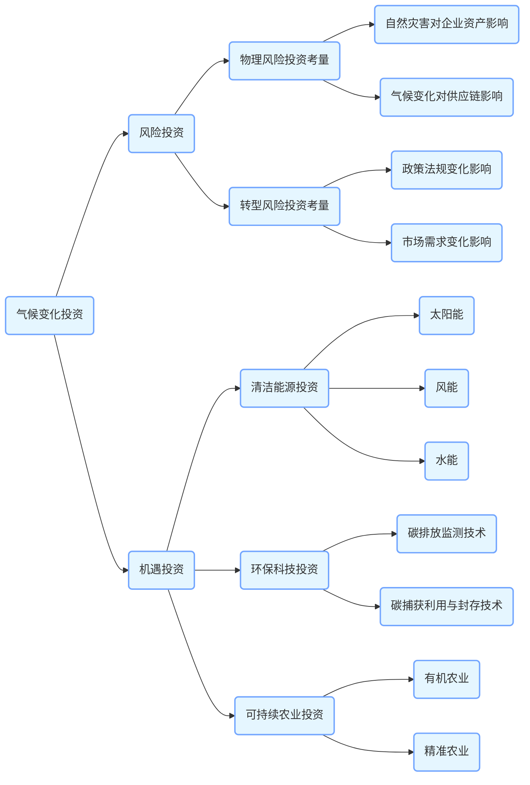

# 巴菲特 - 芒格的气候变化投资观：风险与机遇并存

> 关键词：巴菲特、芒格、气候变化投资、风险、机遇、投资策略

> 摘要：本文深入探讨了巴菲特 - 芒格的气候变化投资观，阐述了在气候变化背景下投资所面临的风险与蕴含的机遇。通过对核心概念的剖析、算法原理的讲解、数学模型的分析，结合实际项目案例，详细解读了如何在这一领域进行有效投资。同时介绍了相关的应用场景、工具资源，最后总结了未来发展趋势与挑战，并解答了常见问题。

## 1. 背景介绍 

### 1.1 目的和范围
本文旨在全面解析巴菲特和芒格对于气候变化投资的观点，探究在气候变化这一全球性议题下投资活动所面临的复杂局面。不仅要分析其中存在的风险，如政策变动、环境灾害对企业价值的影响，还要挖掘潜在的机遇，例如清洁能源、环保科技等领域的投资潜力。通过对这些内容的研究，为投资者提供在气候变化投资领域的思路和策略，同时明确文章将涵盖从理论到实践的多个层面，包括概念解释、算法应用、实际案例分析等。

### 1.2 预期读者
预期读者主要包括对投资领域感兴趣的专业投资者、金融从业者，他们希望从巴菲特和芒格的投资理念中获取关于气候变化投资的灵感和方法。同时，也适合关注可持续发展和环境保护的企业管理者、研究人员，以及对经济和环境问题有一定兴趣的普通大众，帮助他们了解气候变化投资的相关知识和动态。

### 1.3 文档结构概述
本文将按照以下结构展开：首先介绍核心概念与联系，清晰界定气候变化投资相关的基本概念，并阐述它们之间的内在逻辑关系。接着讲解核心算法原理和具体操作步骤，通过 Python 代码展示如何进行相关投资分析。然后介绍数学模型和公式，结合实际例子详细说明其应用。之后通过项目实战，展示代码实际案例并进行详细解释。再探讨实际应用场景，说明气候变化投资在不同领域的具体应用。随后推荐相关的工具和资源，包括学习资源、开发工具框架以及相关论文著作。最后总结未来发展趋势与挑战，解答常见问题，并提供扩展阅读和参考资料。

### 1.4 术语表

#### 1.4.1 核心术语定义
- **气候变化投资**：指投资者将资金投入到与应对气候变化相关的项目、企业或资产中，旨在获取经济回报的同时，为减缓气候变化、适应气候变化的影响做出贡献。
- **风险投资**：在气候变化投资领域，风险投资是指向具有高风险但同时可能带来高回报的与气候变化相关的新兴企业或项目提供资金支持的投资方式。
- **机遇投资**：侧重于发现和投资因气候变化而产生的新的商业机会和市场需求，如清洁能源、环保技术等领域的投资。

#### 1.4.2 相关概念解释
- **碳排放权交易**：一种市场机制，政府设定碳排放总量上限，然后将排放权分配给企业。企业可以在市场上交易这些排放权，如果企业的排放量低于分配的额度，可以将剩余的排放权出售；反之，则需要购买额外的排放权。
- **可再生能源**：指在自然界中可以不断再生、永续利用的能源，具有取之不尽、用之不竭的特点，主要包括太阳能、风能、水能、生物质能、地热能和海洋能等。

#### 1.4.3 缩略词列表
- **ESG**：Environmental, Social and Governance 的缩写，即环境、社会和公司治理，是一种关注企业环境、社会和治理绩效的投资理念和评价标准。
- **CCUS**：Carbon Capture, Utilization and Storage 的缩写，即碳捕获、利用与封存，是指将二氧化碳从工业或相关能源的源分离出来，运输到一个地点加以利用或封存，以实现二氧化碳减排的技术。

## 2. 核心概念与联系 

### 核心概念原理
气候变化投资的核心原理基于对气候变化这一全球性问题的认识。随着全球气候变暖，极端天气事件增多、海平面上升等问题对人类社会和经济发展构成了严峻挑战。这促使政府、企业和社会各界采取行动来应对气候变化，从而催生了一系列与气候变化相关的产业和市场。

从投资角度来看，气候变化带来了风险和机遇两个方面。风险方面，气候变化可能导致企业面临物理风险，如自然灾害对企业资产和生产设施的破坏；还可能面临转型风险，如政策法规的变化促使企业向低碳经济转型，如果企业不能及时适应，可能会遭受经济损失。机遇方面，应对气候变化的需求推动了清洁能源、节能环保、碳减排技术等领域的发展，为投资者提供了新的投资方向和潜在的高回报机会。

### 架构的文本示意图
```plaintext
气候变化投资
|-- 风险投资
|   |-- 物理风险投资考量
|   |   |-- 自然灾害对企业资产影响
|   |   |-- 气候变化对供应链影响
|   |-- 转型风险投资考量
|   |   |-- 政策法规变化影响
|   |   |-- 市场需求变化影响
|-- 机遇投资
|   |-- 清洁能源投资
|   |   |-- 太阳能
|   |   |-- 风能
|   |   |-- 水能
|   |-- 环保科技投资
|   |   |-- 碳排放监测技术
|   |   |-- 碳捕获利用与封存技术
|   |-- 可持续农业投资
|       |-- 有机农业
|       |-- 精准农业
```

### Mermaid 流程图


## 3. 核心算法原理 & 具体操作步骤 

### 核心算法原理
在气候变化投资中，一个重要的算法是风险 - 回报评估算法。该算法的核心思想是综合考虑投资项目的风险和潜在回报，以确定投资的可行性和价值。具体来说，通过对项目的各种风险因素（如物理风险、转型风险）和回报因素（如预期收益、市场增长潜力）进行量化分析，计算出一个综合的评估指标。

### Python 代码实现
```python
import numpy as np

# 定义风险和回报因素的权重
risk_weights = {
    "physical_risk": 0.4,
    "transition_risk": 0.3,
    "market_risk": 0.3
}

return_weights = {
    "expected_return": 0.6,
    "market_growth": 0.4
}

def calculate_risk_score(physical_risk, transition_risk, market_risk):
    """
    计算风险得分
    :param physical_risk: 物理风险评估值
    :param transition_risk: 转型风险评估值
    :param market_risk: 市场风险评估值
    :return: 风险得分
    """
    risk_score = (physical_risk * risk_weights["physical_risk"] +
                  transition_risk * risk_weights["transition_risk"] +
                  market_risk * risk_weights["market_risk"])
    return risk_score

def calculate_return_score(expected_return, market_growth):
    """
    计算回报得分
    :param expected_return: 预期回报率
    :param market_growth: 市场增长率
    :return: 回报得分
    """
    return_score = (expected_return * return_weights["expected_return"] +
                    market_growth * return_weights["market_growth"])
    return return_score

def investment_evaluation(physical_risk, transition_risk, market_risk, expected_return, market_growth):
    """
    投资评估
    :param physical_risk: 物理风险评估值
    :param transition_risk: 转型风险评估值
    :param market_risk: 市场风险评估值
    :param expected_return: 预期回报率
    :param market_growth: 市场增长率
    :return: 综合评估得分
    """
    risk_score = calculate_risk_score(physical_risk, transition_risk, market_risk)
    return_score = calculate_return_score(expected_return, market_growth)
    evaluation_score = return_score - risk_score
    return evaluation_score

# 示例数据
physical_risk = 0.3
transition_risk = 0.2
market_risk = 0.1
expected_return = 0.15
market_growth = 0.2

# 进行投资评估
score = investment_evaluation(physical_risk, transition_risk, market_risk, expected_return, market_growth)
print(f"投资综合评估得分: {score}")
```

### 具体操作步骤
1. **数据收集**：收集投资项目的相关数据，包括物理风险评估值、转型风险评估值、市场风险评估值、预期回报率和市场增长率等。
2. **权重设定**：根据投资策略和风险偏好，设定风险因素和回报因素的权重。
3. **风险得分计算**：使用 `calculate_risk_score` 函数计算项目的风险得分。
4. **回报得分计算**：使用 `calculate_return_score` 函数计算项目的回报得分。
5. **综合评估**：使用 `investment_evaluation` 函数计算项目的综合评估得分，得分越高表示投资的可行性和价值越高。

## 4. 数学模型和公式 & 详细讲解 & 举例说明 

### 数学模型和公式
#### 风险得分计算公式
设物理风险评估值为 $P$，转型风险评估值为 $T$，市场风险评估值为 $M$，风险因素的权重分别为 $w_P$、$w_T$、$w_M$，则风险得分 $R$ 的计算公式为：
$$R = w_P \times P + w_T \times T + w_M \times M$$

#### 回报得分计算公式
设预期回报率为 $E$，市场增长率为 $G$，回报因素的权重分别为 $w_E$、$w_G$，则回报得分 $S$ 的计算公式为：
$$S = w_E \times E + w_G \times G$$

#### 综合评估得分计算公式
综合评估得分 $V$ 等于回报得分减去风险得分，即：
$$V = S - R$$

### 详细讲解
- **风险得分**：风险得分是对投资项目所面临的各种风险的综合量化。不同的风险因素根据其重要性赋予不同的权重，通过加权求和的方式得到最终的风险得分。权重的设定反映了投资者对不同风险因素的关注程度。
- **回报得分**：回报得分是对投资项目潜在回报的量化评估。预期回报率和市场增长率是衡量回报的重要指标，同样通过加权求和的方式计算回报得分。
- **综合评估得分**：综合评估得分综合考虑了投资项目的风险和回报，得分越高表示投资的性价比越高。投资者可以根据综合评估得分来比较不同投资项目的优劣，做出投资决策。

### 举例说明
假设一个投资项目的物理风险评估值 $P = 0.3$，转型风险评估值 $T = 0.2$，市场风险评估值 $M = 0.1$，预期回报率 $E = 0.15$，市场增长率 $G = 0.2$。风险因素的权重 $w_P = 0.4$，$w_T = 0.3$，$w_M = 0.3$，回报因素的权重 $w_E = 0.6$，$w_G = 0.4$。

首先计算风险得分：
$$R = 0.4 \times 0.3 + 0.3 \times 0.2 + 0.3 \times 0.1 = 0.12 + 0.06 + 0.03 = 0.21$$

然后计算回报得分：
$$S = 0.6 \times 0.15 + 0.4 \times 0.2 = 0.09 + 0.08 = 0.17$$

最后计算综合评估得分：
$$V = 0.17 - 0.21 = -0.04$$

由于综合评估得分小于 0，说明该投资项目的风险大于回报，可能不是一个理想的投资选择。

## 5. 项目实战：代码实际案例和详细解释说明 

### 5.1 开发环境搭建
- **Python 安装**：确保系统中安装了 Python 3.x 版本。可以从 Python 官方网站（https://www.python.org/downloads/）下载并安装。
- **IDE 选择**：推荐使用 PyCharm 作为集成开发环境。可以从 JetBrains 官方网站（https://www.jetbrains.com/pycharm/download/）下载并安装。
- **依赖库安装**：在命令行中使用以下命令安装所需的依赖库：
```sh
pip install numpy
```

### 5.2 源代码详细实现和代码解读
```python
import numpy as np

# 定义风险和回报因素的权重
risk_weights = {
    "physical_risk": 0.4,
    "transition_risk": 0.3,
    "market_risk": 0.3
}

return_weights = {
    "expected_return": 0.6,
    "market_growth": 0.4
}

def calculate_risk_score(physical_risk, transition_risk, market_risk):
    """
    计算风险得分
    :param physical_risk: 物理风险评估值
    :param transition_risk: 转型风险评估值
    :param market_risk: 市场风险评估值
    :return: 风险得分
    """
    risk_score = (physical_risk * risk_weights["physical_risk"] +
                  transition_risk * risk_weights["transition_risk"] +
                  market_risk * risk_weights["market_risk"])
    return risk_score

def calculate_return_score(expected_return, market_growth):
    """
    计算回报得分
    :param expected_return: 预期回报率
    :param market_growth: 市场增长率
    :return: 回报得分
    """
    return_score = (expected_return * return_weights["expected_return"] +
                    market_growth * return_weights["market_growth"])
    return return_score

def investment_evaluation(physical_risk, transition_risk, market_risk, expected_return, market_growth):
    """
    投资评估
    :param physical_risk: 物理风险评估值
    :param transition_risk: 转型风险评估值
    :param market_risk: 市场风险评估值
    :param expected_return: 预期回报率
    :param market_growth: 市场增长率
    :return: 综合评估得分
    """
    risk_score = calculate_risk_score(physical_risk, transition_risk, market_risk)
    return_score = calculate_return_score(expected_return, market_growth)
    evaluation_score = return_score - risk_score
    return evaluation_score

# 示例数据
physical_risk = 0.3
transition_risk = 0.2
market_risk = 0.1
expected_return = 0.15
market_growth = 0.2

# 进行投资评估
score = investment_evaluation(physical_risk, transition_risk, market_risk, expected_return, market_growth)
print(f"投资综合评估得分: {score}")
```
#### 代码解读
1. **导入库**：`import numpy as np` 导入了 NumPy 库，虽然在这个简单的代码中没有直接使用 NumPy 的功能，但在更复杂的数据分析和计算中可能会用到。
2. **定义权重**：`risk_weights` 和 `return_weights` 分别定义了风险因素和回报因素的权重，这些权重可以根据实际情况进行调整。
3. **计算风险得分**：`calculate_risk_score` 函数根据输入的物理风险、转型风险和市场风险评估值，结合风险因素的权重，计算出风险得分。
4. **计算回报得分**：`calculate_return_score` 函数根据输入的预期回报率和市场增长率，结合回报因素的权重，计算出回报得分。
5. **投资评估**：`investment_evaluation` 函数调用 `calculate_risk_score` 和 `calculate_return_score` 函数，计算出综合评估得分。
6. **示例数据和评估**：定义了示例数据，并调用 `investment_evaluation` 函数进行投资评估，最后打印出综合评估得分。

### 5.3 代码解读与分析
- **优点**：代码结构清晰，模块化程度高，每个函数的功能明确，便于维护和扩展。通过定义权重的方式，可以灵活调整不同风险因素和回报因素的重要性，适应不同的投资策略和风险偏好。
- **局限性**：代码中的风险评估和回报计算是基于简单的加权求和方法，可能无法全面准确地反映投资项目的实际情况。实际投资中，风险和回报的影响因素更为复杂，需要考虑更多的变量和因素。此外，代码中使用的示例数据是固定的，实际应用中需要根据具体项目收集和处理数据。

## 6. 实际应用场景 
### 清洁能源领域投资
在清洁能源领域，气候变化投资有着广泛的应用。随着全球对减少碳排放、应对气候变化的需求不断增加，太阳能、风能、水能等清洁能源项目成为了投资热点。投资者可以通过投资清洁能源发电企业、参与清洁能源项目的建设和运营等方式，获取经济回报的同时，为减少碳排放做出贡献。例如，巴菲特旗下的伯克希尔·哈撒韦公司就对风能和太阳能项目进行了大量投资，不仅获得了稳定的收益，还推动了清洁能源产业的发展。

### 环保科技领域投资
环保科技领域也是气候变化投资的重要方向。随着环保要求的不断提高，碳排放监测技术、碳捕获利用与封存技术等环保科技得到了快速发展。投资者可以投资相关的科技企业，支持这些技术的研发和应用。例如，一些企业通过研发先进的碳排放监测设备，帮助企业准确监测和管理碳排放，这些企业具有较大的市场潜力和投资价值。

### 可持续农业领域投资
可持续农业在应对气候变化方面也发挥着重要作用。有机农业、精准农业等可持续农业模式可以减少农业生产中的碳排放，提高农业资源的利用效率。投资者可以投资可持续农业企业，支持农业的绿色发展。例如，一些企业通过推广有机肥料和生物防治技术，减少了化学农药和化肥的使用，降低了农业对环境的影响，同时也提高了农产品的质量和安全性，受到了市场的欢迎。

### 基础设施建设领域投资
在基础设施建设领域，气候变化投资可以用于建设更具抗灾能力和可持续性的基础设施。例如，在沿海地区建设防潮堤、在城市中建设雨水收集和处理系统等，以应对气候变化带来的自然灾害风险。投资者可以参与这些基础设施项目的投资和建设，为社会的可持续发展做出贡献。

## 7. 工具和资源推荐

### 7.1 学习资源推荐

#### 7.1.1 书籍推荐
- 《气候经济与人类未来》：作者比尔·盖茨，这本书深入探讨了气候变化对经济和人类社会的影响，以及应对气候变化的技术和经济解决方案，为投资者提供了关于气候变化投资的宏观视角。
- 《可持续投资：环境、社会和治理投资策略与实践》：详细介绍了可持续投资的概念、方法和实践案例，包括气候变化投资的相关内容，适合对可持续投资感兴趣的投资者阅读。
- 《投资最重要的事》：作者霍华德·马克斯，虽然这本书没有专门针对气候变化投资，但其中的投资理念和风险管理方法对气候变化投资具有重要的指导意义。

#### 7.1.2 在线课程
- Coursera 平台上的“气候变化经济学”课程：由知名大学的教授授课，系统介绍了气候变化经济学的基本原理和方法，帮助学习者了解气候变化对经济的影响以及相关的政策和投资策略。
- edX 平台上的“可持续金融与投资”课程：该课程聚焦于可持续金融领域，包括气候变化投资的相关内容，通过案例分析和实践项目，让学习者掌握可持续投资的技能和方法。

#### 7.1.3 技术博客和网站
- 碳信息披露项目（CDP）网站：提供了全球企业的碳排放数据和相关信息，是了解企业气候变化表现和投资机会的重要资源。
- 彭博新能源财经（BNEF）网站：专注于新能源和气候变化领域的研究和分析，提供了丰富的市场数据、行业报告和专家观点，对气候变化投资具有重要的参考价值。
- 国际金融公司（IFC）博客：IFC 是世界银行集团的成员之一，其博客发布了关于可持续投资和气候变化融资的最新动态和研究成果，为投资者提供了前沿的信息和思路。

### 7.2 开发工具框架推荐

#### 7.2.1 IDE和编辑器
- PyCharm：是一款专业的 Python 集成开发环境，具有强大的代码编辑、调试和项目管理功能，适合开发与气候变化投资分析相关的 Python 代码。
- Jupyter Notebook：是一个开源的交互式笔记本，支持多种编程语言，包括 Python。它可以方便地进行数据探索、可视化和代码演示，非常适合进行气候变化投资数据分析和模型验证。

#### 7.2.2 调试和性能分析工具
- Py-Spy：是一个用于分析 Python 代码性能的工具，可以实时监测 Python 程序的 CPU 使用率和函数调用情况，帮助开发者找出代码中的性能瓶颈。
- pdb：是 Python 内置的调试器，可以在代码中设置断点，逐步执行代码，查看变量的值和程序的执行流程，方便调试和排查问题。

#### 7.2.3 相关框架和库
- Pandas：是一个强大的数据分析库，提供了高效的数据结构和数据处理工具，适合处理和分析气候变化投资相关的数据。
- NumPy：是 Python 科学计算的基础库，提供了高效的多维数组对象和数学函数，可用于进行数值计算和模型实现。
- Scikit-learn：是一个机器学习库，提供了丰富的机器学习算法和工具，可用于构建气候变化投资的预测模型和风险评估模型。

### 7.3 相关论文著作推荐

#### 7.3.1 经典论文
- “The Stern Review on the Economics of Climate Change”：这篇报告由英国经济学家尼古拉斯·斯特恩撰写，全面分析了气候变化对全球经济的影响，并提出了应对气候变化的经济策略，是气候变化经济学领域的经典之作。
- “Investing in a Time of Climate Change”：该论文探讨了在气候变化背景下的投资策略和风险管理方法，为投资者提供了重要的理论指导。

#### 7.3.2 最新研究成果
- 定期关注《Nature Climate Change》《Science》等顶级学术期刊上的相关研究论文，这些论文反映了气候变化投资领域的最新研究成果和前沿动态。
- 国际组织和研究机构发布的报告，如联合国环境规划署（UNEP）发布的《全球可持续金融报告》，提供了关于气候变化投资的最新政策和市场趋势分析。

#### 7.3.3 应用案例分析
- 世界银行发布的一些项目案例报告，展示了在不同国家和地区开展的气候变化投资项目的实施情况和经验教训，为投资者提供了实际的参考案例。
- 一些知名投资机构的研究报告，如贝莱德（BlackRock）发布的关于气候变化投资的案例分析，介绍了他们在该领域的投资实践和策略。

## 8. 总结：未来发展趋势与挑战

### 未来发展趋势
- **政策推动**：随着全球对气候变化问题的关注度不断提高，各国政府将出台更多的政策和法规来推动应对气候变化的行动，这将为气候变化投资提供更有利的政策环境。例如，一些国家可能会加大对清洁能源的补贴力度，推动碳排放权交易市场的发展等。
- **技术创新**：清洁能源、环保科技等领域的技术创新将不断涌现，为气候变化投资带来更多的机遇。例如，太阳能电池技术的不断进步将降低太阳能发电的成本，提高其市场竞争力；碳捕获利用与封存技术的突破将有助于减少工业碳排放。
- **投资者意识提高**：越来越多的投资者将认识到气候变化投资的重要性和潜力，将资金投入到相关领域。同时，投资者对企业的环境、社会和治理（ESG）表现也将更加关注，促使企业更加积极地应对气候变化。
- **市场规模扩大**：随着政策推动、技术创新和投资者意识提高，气候变化投资的市场规模将不断扩大。预计未来几年，清洁能源、环保科技等领域的投资将持续增长，成为全球投资的热点之一。

### 挑战
- **风险评估难度大**：气候变化投资面临的风险复杂多样，包括物理风险、转型风险、市场风险等，且这些风险之间相互关联，难以准确评估。例如，自然灾害对企业资产的影响可能会受到地理环境、企业应对措施等多种因素的影响，难以进行精确的量化分析。
- **技术不确定性**：虽然清洁能源、环保科技等领域的技术发展迅速，但仍然存在一定的不确定性。一些新技术可能在实际应用中面临成本高、效率低等问题，需要进一步的研发和改进。例如，碳捕获利用与封存技术目前还处于发展阶段，其大规模应用还面临技术和经济上的挑战。
- **政策不稳定**：气候变化政策受到政治、经济等多种因素的影响，存在一定的不稳定性。政策的变化可能会对气候变化投资项目的收益和可行性产生重大影响。例如，一些国家可能会因为政治原因调整对清洁能源的补贴政策，导致相关企业的盈利受到影响。
- **市场竞争激烈**：随着气候变化投资市场的不断扩大，越来越多的投资者和企业将进入该领域，市场竞争将日益激烈。这可能会导致投资回报率下降，项目的获取难度增加。例如，在清洁能源领域，众多企业纷纷进入市场，可能会导致产能过剩，价格竞争加剧。

## 9. 附录：常见问题与解答

### 问题 1：气候变化投资的回报如何保障？
解答：气候变化投资的回报保障需要综合考虑多个因素。首先，选择具有良好发展前景的领域和项目，如清洁能源、环保科技等，这些领域受到政策支持和市场需求的推动，具有较大的增长潜力。其次，进行充分的风险评估和管理，降低投资风险。例如，通过多元化投资分散风险，选择具有抗风险能力的企业和项目。此外，关注企业的基本面和财务状况，选择具有盈利能力和可持续发展能力的企业进行投资。

### 问题 2：如何评估气候变化投资项目的风险？
解答：评估气候变化投资项目的风险可以从多个方面入手。物理风险方面，可以考虑项目所在地的自然灾害风险、气候变化对项目资产和生产设施的影响等。转型风险方面，关注政策法规的变化对项目的影响，以及企业向低碳经济转型的能力。市场风险方面，分析市场需求的变化、行业竞争态势等因素。可以使用一些定量和定性的方法进行评估，如本文介绍的风险 - 回报评估算法，同时结合专家意见和行业研究报告进行综合判断。

### 问题 3：气候变化投资与传统投资有什么区别？
解答：气候变化投资与传统投资的主要区别在于投资的关注点和目标不同。传统投资主要关注企业的财务绩效和市场竞争力，而气候变化投资不仅关注财务回报，还关注企业的环境影响和可持续发展能力。气候变化投资更注重投资项目对减缓气候变化、适应气候变化影响的贡献，通常投资于清洁能源、环保科技、可持续农业等与应对气候变化相关的领域。此外，气候变化投资还需要考虑气候变化带来的风险和机遇，如政策风险、物理风险等。

### 问题 4：个人投资者如何参与气候变化投资？
解答：个人投资者可以通过多种方式参与气候变化投资。可以购买相关的基金产品，如清洁能源基金、可持续投资基金等，通过基金间接投资于气候变化相关的企业和项目。也可以直接投资于气候变化相关的上市公司股票，选择具有良好发展前景的企业进行投资。此外，还可以参与一些众筹项目，支持一些小型的气候变化投资项目。在参与投资之前，个人投资者需要充分了解相关的投资知识和风险，根据自己的风险承受能力和投资目标做出合理的投资决策。

## 10. 扩展阅读 & 参考资料
### 扩展阅读
- 《低碳经济》：深入探讨了低碳经济的发展模式和路径，为气候变化投资提供了更广阔的视野。
- 《绿色金融》：介绍了绿色金融的概念、理论和实践，包括气候变化投资在金融领域的应用和创新。
- 《可持续发展报告》：许多企业和组织发布的可持续发展报告，展示了他们在应对气候变化方面的实践和成果，可供投资者参考。

### 参考资料
- 联合国气候变化框架公约（UNFCCC）官方网站：提供了关于全球气候变化政策和国际合作的最新信息。
- 国际能源署（IEA）发布的报告：包含了全球能源市场和气候变化相关的统计数据和分析报告。
- 学术数据库，如 Web of Science、IEEE Xplore 等，可搜索到关于气候变化投资的学术研究论文。 