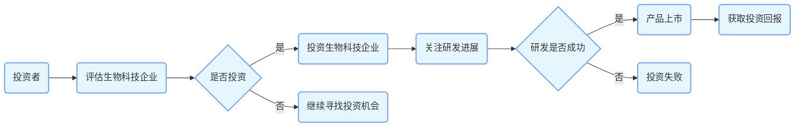

# 巴菲特 - 芒格的生物科技投资观：高风险高回报的平衡

> 关键词：巴菲特，芒格，生物科技投资，高风险高回报，投资平衡

> 摘要：本文深入探讨了巴菲特和芒格的生物科技投资观，着重分析生物科技投资中高风险与高回报的特性以及如何实现两者的平衡。从背景介绍入手，阐述生物科技投资领域的相关概念，详细讲解核心算法原理、数学模型，通过实际项目案例展示投资实践，介绍生物科技投资的应用场景和可用工具资源，最后总结该领域未来发展趋势与挑战，并解答常见问题。

## 1. 背景介绍 
### 1.1 目的和范围
本文章的主要目的是剖析巴菲特和芒格对于生物科技投资的观点，尤其是他们如何看待生物科技投资中高风险与高回报的关系，并探讨实现平衡的方法。范围涵盖生物科技投资的核心概念、算法原理、数学模型、实际案例以及未来发展趋势等方面，旨在为投资者提供全面且深入的参考，帮助他们在生物科技投资领域做出更明智的决策。

### 1.2 预期读者
预期读者包括对投资领域有兴趣的个人投资者、专业投资机构的从业者、金融研究人员以及关注生物科技行业发展的人士。这些读者希望通过了解巴菲特和芒格的投资理念，学习如何在生物科技投资中应对高风险并获取高回报。

### 1.3 文档结构概述
本文将按照以下结构展开：首先介绍生物科技投资相关的核心概念及其联系，接着阐述核心算法原理和具体操作步骤，再讲解数学模型和公式并举例说明，然后通过项目实战展示代码实际案例和详细解释，之后分析生物科技投资的实际应用场景，推荐相关的工具和资源，最后总结未来发展趋势与挑战，解答常见问题并提供扩展阅读和参考资料。

### 1.4 术语表
#### 1.4.1 核心术语定义
- **生物科技投资**：指投资者将资金投入到生物科技相关的企业、项目或研究中，期望通过生物科技的发展和应用获得经济回报。
- **高风险高回报**：在投资领域，高风险意味着投资面临较大的不确定性和可能的损失，而高回报则表示如果投资成功，将获得较高的收益。生物科技投资由于其技术研发的不确定性、市场竞争的激烈性等因素，具有典型的高风险高回报特征。
- **投资平衡**：在生物科技投资中，通过合理的资产配置、风险评估和投资策略，使投资在高风险和高回报之间达到一种相对稳定的状态，以实现长期的投资目标。

#### 1.4.2 相关概念解释
- **生物科技**：利用生物体（包括微生物、动物细胞、植物细胞）或其组成部分（细胞器和酶）来生产有用物质，或为人类提供某种服务的技术。在生物科技投资中，涉及的领域包括生物医药、生物农业、生物制造等。
- **研发管线**：生物科技企业拥有的一系列处于不同研发阶段的产品或项目。研发管线的丰富程度和质量是评估生物科技企业投资价值的重要指标之一。

#### 1.4.3 缩略词列表
- **FDA**：美国食品药品监督管理局（Food and Drug Administration），在生物医药领域，FDA的审批结果对生物科技企业的产品上市和投资价值有重大影响。
- **NDA**：新药申请（New Drug Application），是生物制药公司向FDA提交的申请，以获得新药上市的批准。

## 2. 核心概念与联系 
### 核心概念原理
生物科技投资的核心在于对生物科技企业的研发能力、产品前景和市场潜力进行评估。生物科技行业的特点是研发周期长、投入大、风险高，但一旦研发成功，产品可能带来巨大的市场价值和利润。

从研发角度看，生物科技企业需要进行大量的基础研究和临床试验，以验证产品的安全性和有效性。例如，一款新药的研发可能需要经历数年甚至数十年的时间，投入数亿美元的资金。在这个过程中，存在着诸多不确定性，如研发失败、临床试验结果不理想、监管审批不通过等。

从市场角度看，生物科技产品的市场需求受到多种因素的影响，如疾病的发病率、患者的支付能力、医保政策等。如果一款生物科技产品能够满足市场的迫切需求，并且具有良好的性价比，那么它将有可能获得高额的回报。

### 架构的文本示意图
```plaintext
生物科技投资
|-- 投资主体（投资者）
|   |-- 个人投资者
|   |-- 投资机构
|-- 投资对象（生物科技企业）
|   |-- 生物医药企业
|   |   |-- 创新药研发企业
|   |   |-- 仿制药企业
|   |-- 生物农业企业
|   |-- 生物制造企业
|-- 投资评估因素
|   |-- 研发能力
|   |   |-- 研发团队
|   |   |-- 研发管线
|   |-- 市场潜力
|   |   |-- 疾病需求
|   |   |-- 市场竞争
|   |-- 财务状况
|   |   |-- 资产负债表
|   |   |-- 利润表
|-- 投资风险
|   |-- 研发风险
|   |   |-- 技术难题
|   |   |-- 临床试验失败
|   |-- 市场风险
|   |   |-- 市场需求变化
|   |   |-- 竞争加剧
|   |-- 监管风险
|   |   |-- 审批不通过
|   |   |-- 政策变化
|-- 投资回报
|   |-- 产品上市销售
|   |-- 企业并购
|   |-- 股票增值
```

### Mermaid 流程图


## 3. 核心算法原理 & 具体操作步骤 
### 核心算法原理
在生物科技投资中，我们可以使用一种基于多因素评估的算法来评估投资的风险和回报。该算法的核心思想是综合考虑生物科技企业的研发能力、市场潜力和财务状况等因素，计算出一个综合评分，以此来判断投资的可行性。

具体来说，我们可以为每个评估因素设定一个权重，然后根据企业在各个因素上的表现进行打分，最后将各个因素的得分乘以相应的权重并求和，得到综合评分。

### Python 源代码实现
```python
# 定义评估因素及其权重
factors = {
    "研发能力": 0.4,
    "市场潜力": 0.3,
    "财务状况": 0.3
}

# 定义生物科技企业的评估得分
company_scores = {
    "研发能力": 80,
    "市场潜力": 70,
    "财务状况": 60
}

# 计算综合评分
def calculate_composite_score(factors, scores):
    composite_score = 0
    for factor, weight in factors.items():
        score = scores.get(factor, 0)
        composite_score += weight * score
    return composite_score

# 计算企业的综合评分
composite_score = calculate_composite_score(factors, company_scores)
print(f"企业的综合评分: {composite_score}")
```

### 具体操作步骤
1. **确定评估因素和权重**：根据生物科技投资的特点和投资者的偏好，确定需要评估的因素，如研发能力、市场潜力、财务状况等，并为每个因素设定相应的权重。
2. **收集企业数据**：收集生物科技企业在各个评估因素上的数据，如研发团队的资质、研发管线的进展、市场需求的预测、企业的财务报表等。
3. **进行打分**：根据收集到的数据，对企业在各个评估因素上的表现进行打分。打分可以采用主观评估或客观数据相结合的方法。
4. **计算综合评分**：使用上述算法，将各个因素的得分乘以相应的权重并求和，得到企业的综合评分。
5. **做出投资决策**：根据企业的综合评分，结合投资者的风险承受能力和投资目标，做出投资决策。

## 4. 数学模型和公式 & 详细讲解 & 举例说明 
### 数学模型和公式
设评估因素有 $n$ 个，分别为 $F_1, F_2, \cdots, F_n$，对应的权重为 $w_1, w_2, \cdots, w_n$，且 $\sum_{i=1}^{n} w_i = 1$。企业在各个评估因素上的得分分别为 $s_1, s_2, \cdots, s_n$，则企业的综合评分 $S$ 可以表示为：

$$S = \sum_{i=1}^{n} w_i s_i$$

### 详细讲解
这个数学模型的核心思想是通过加权求和的方式，将多个评估因素综合为一个单一的评分。权重 $w_i$ 表示每个评估因素在整体评估中的重要程度，得分 $s_i$ 表示企业在该评估因素上的表现。通过调整权重，可以根据投资者的偏好和投资策略，突出某些评估因素的重要性。

### 举例说明
假设我们有三个评估因素：研发能力（权重 $w_1 = 0.4$）、市场潜力（权重 $w_2 = 0.3$）和财务状况（权重 $w_3 = 0.3$）。一家生物科技企业在这三个评估因素上的得分分别为 $s_1 = 80$，$s_2 = 70$，$s_3 = 60$。则该企业的综合评分 $S$ 为：

$$S = 0.4 \times 80 + 0.3 \times 70 + 0.3 \times 60$$
$$S = 32 + 21 + 18$$
$$S = 71$$

根据这个综合评分，投资者可以对该企业的投资价值有一个初步的判断。如果投资者设定的投资门槛为综合评分不低于 70 分，那么该企业符合投资要求。

## 5. 项目实战：代码实际案例和详细解释说明 
### 5.1  开发环境搭建
- **操作系统**：推荐使用 Windows、Linux 或 macOS 操作系统。
- **Python 版本**：建议使用 Python 3.7 及以上版本。
- **开发工具**：可以使用 PyCharm、VS Code 等集成开发环境（IDE）。
- **所需库**：本项目主要使用 Python 的内置库，无需额外安装其他库。

### 5.2  源代码详细实现和代码解读
```python
# 定义评估因素及其权重
factors = {
    "研发能力": 0.4,
    "市场潜力": 0.3,
    "财务状况": 0.3
}

# 定义生物科技企业的评估得分
company_scores = {
    "研发能力": 80,
    "市场潜力": 70,
    "财务状况": 60
}

# 计算综合评分
def calculate_composite_score(factors, scores):
    composite_score = 0
    for factor, weight in factors.items():
        score = scores.get(factor, 0)
        composite_score += weight * score
    return composite_score

# 计算企业的综合评分
composite_score = calculate_composite_score(factors, company_scores)
print(f"企业的综合评分: {composite_score}")
```

### 代码解读与分析
1. **定义评估因素及其权重**：
    - `factors` 字典存储了评估因素及其对应的权重。在这个例子中，研发能力的权重为 0.4，市场潜力的权重为 0.3，财务状况的权重为 0.3。
2. **定义生物科技企业的评估得分**：
    - `company_scores` 字典存储了企业在各个评估因素上的得分。这里假设企业在研发能力上得分为 80，市场潜力上得分为 70，财务状况上得分为 60。
3. **计算综合评分的函数**：
    - `calculate_composite_score` 函数接受两个参数：`factors` 和 `scores`。在函数内部，通过遍历 `factors` 字典，获取每个评估因素的权重和企业在该因素上的得分，然后将权重和得分相乘并累加到 `composite_score` 中。最后返回综合评分。
4. **计算企业的综合评分并输出结果**：
    - 调用 `calculate_composite_score` 函数，传入 `factors` 和 `company_scores`，得到企业的综合评分，并将结果打印输出。

## 6. 实际应用场景 
### 生物医药研发投资
在生物医药研发领域，投资者可以使用上述评估方法来选择具有投资价值的生物制药企业。例如，投资者可以关注企业的研发管线，评估其在研药物的创新性、市场需求和竞争优势。同时，考虑企业的财务状况，确保其有足够的资金支持研发工作。通过综合评估，投资者可以选择那些研发能力强、市场潜力大且财务状况稳定的企业进行投资。

### 生物农业投资
生物农业领域包括转基因作物、生物肥料、生物农药等。投资者可以评估生物农业企业的研发能力，如是否拥有先进的生物技术和创新的产品。同时，考虑市场潜力，如产品的市场需求、价格竞争力等。通过对这些因素的综合评估，投资者可以在生物农业领域找到具有投资潜力的企业。

### 生物制造投资
生物制造是利用生物技术生产各种生物产品的过程。投资者可以关注生物制造企业的技术水平、生产效率和产品质量。评估企业的研发能力，看其是否能够不断推出新的产品和改进生产工艺。同时，考虑市场潜力，如产品的应用领域、市场份额等。通过综合评估，投资者可以在生物制造领域做出明智的投资决策。

## 7. 工具和资源推荐
### 7.1 学习资源推荐
#### 7.1.1 书籍推荐
- 《聪明的投资者》（The Intelligent Investor）：作者是本杰明·格雷厄姆（Benjamin Graham），这本书是价值投资的经典之作，对投资者的思维方式和投资策略有很大的启发。
- 《巴菲特致股东的信：股份公司教程》（Letters to Shareholders of Berkshire Hathaway）：作者是沃伦·巴菲特（Warren Buffett），这本书收录了巴菲特多年来致股东的信，从中可以学习到巴菲特的投资理念和方法。
- 《生物科技投资》（Biotech Investing）：这本书专门介绍了生物科技投资的相关知识，包括生物科技行业的特点、投资策略、风险评估等。

#### 7.1.2 在线课程
- Coursera 上的“投资学原理”（Principles of Investing）课程：该课程由知名教授授课，涵盖了投资领域的基本原理和方法。
- edX 上的“生物科技创业与投资”（Biotech Entrepreneurship and Investing）课程：该课程介绍了生物科技创业和投资的相关知识，适合对生物科技投资感兴趣的学习者。

#### 7.1.3 技术博客和网站
- Seeking Alpha：这是一个知名的投资研究网站，提供了大量的投资分析文章和研究报告，包括生物科技投资领域的内容。
- BioSpace：这是一个专注于生物科技行业的网站，提供了生物科技企业的新闻、动态、研发进展等信息，对投资者了解生物科技行业有很大的帮助。

### 7.2 开发工具框架推荐
#### 7.2.1 IDE和编辑器
- PyCharm：是一款专门为 Python 开发设计的集成开发环境，具有强大的代码编辑、调试和分析功能。
- VS Code：是一款轻量级的代码编辑器，支持多种编程语言，具有丰富的插件生态系统，可以满足不同的开发需求。

#### 7.2.2 调试和性能分析工具
- pdb：是 Python 的内置调试工具，可以帮助开发者在代码中设置断点、单步执行代码等，方便调试程序。
- cProfile：是 Python 的性能分析工具，可以分析代码的运行时间和函数调用次数，帮助开发者找出代码中的性能瓶颈。

#### 7.2.3 相关框架和库
- Pandas：是一个用于数据处理和分析的 Python 库，提供了丰富的数据结构和数据分析工具，可用于处理生物科技企业的财务数据和市场数据。
- NumPy：是一个用于科学计算的 Python 库，提供了高效的多维数组对象和数学函数，可用于生物科技投资中的数据计算和模型构建。

### 7.3 相关论文著作推荐
#### 7.3.1 经典论文
- “The Pricing of Options and Corporate Liabilities”（期权定价与公司负债）：作者是费舍尔·布莱克（Fischer Black）和迈伦·斯科尔斯（Myron Scholes），这篇论文提出了著名的布莱克 - 斯科尔斯期权定价模型，对金融领域的定价理论产生了深远的影响。
- “Efficient Capital Markets: A Review of Theory and Empirical Work”（有效资本市场：理论与实证研究综述）：作者是尤金·法玛（Eugene F. Fama），这篇论文提出了有效市场假说，对投资领域的理论和实践产生了重要的影响。

#### 7.3.2 最新研究成果
- 可以关注《Nature Biotechnology》《Science Translational Medicine》等生物科技领域的顶级期刊，这些期刊发表了生物科技领域的最新研究成果和技术进展。
- 还可以关注金融领域的顶级期刊，如《Journal of Finance》《Review of Financial Studies》等，这些期刊发表了投资领域的最新研究成果和理论模型。

#### 7.3.3 应用案例分析
- 可以参考一些投资机构或研究机构发布的生物科技投资案例分析报告，了解他们在生物科技投资中的决策过程和经验教训。
- 还可以关注一些成功的生物科技企业的发展历程和融资情况，从中学习他们的商业模式和发展策略。

## 8. 总结：未来发展趋势与挑战
### 未来发展趋势
- **技术创新加速**：随着基因编辑、人工智能、大数据等技术的不断发展，生物科技领域的技术创新将不断加速。新的治疗方法、诊断技术和生物产品将不断涌现，为生物科技投资带来更多的机会。
- **个性化医疗兴起**：个性化医疗是根据患者的基因信息、生理特征和疾病状况，为其提供个性化的治疗方案。随着基因测序技术的不断进步和成本的不断降低，个性化医疗将成为生物科技领域的一个重要发展方向，也将为生物科技投资带来新的机遇。
- **国际化合作加强**：生物科技研发是一个全球性的事业，需要各国科研人员和企业的合作。未来，生物科技领域的国际化合作将不断加强，跨国研发、跨国投资和跨国并购将更加频繁。

### 挑战
- **技术风险**：生物科技研发具有较高的技术风险，许多研发项目可能会因为技术难题而失败。投资者需要具备较强的技术判断能力，才能识别出有潜力的研发项目。
- **监管风险**：生物科技产品的研发和上市需要经过严格的监管审批，监管政策的变化可能会对生物科技企业的发展产生重大影响。投资者需要密切关注监管政策的变化，及时调整投资策略。
- **市场竞争激烈**：生物科技领域是一个竞争激烈的行业，许多企业都在争夺市场份额。投资者需要评估企业的市场竞争力，选择那些具有核心竞争力和市场优势的企业进行投资。

## 9. 附录：常见问题与解答
### 问题 1：生物科技投资的风险真的很高吗？
解答：是的，生物科技投资的风险相对较高。生物科技研发具有不确定性，研发周期长、投入大，很多研发项目可能会失败。此外，生物科技产品的市场需求也存在不确定性，受到疾病发病率、患者支付能力、医保政策等多种因素的影响。

### 问题 2：如何降低生物科技投资的风险？
解答：可以通过以下方法降低生物科技投资的风险：
- 进行充分的尽职调查，了解生物科技企业的研发能力、市场潜力和财务状况。
- 分散投资，不要把所有的资金都投入到一家生物科技企业或一个研发项目中。
- 关注监管政策的变化，及时调整投资策略。

### 问题 3：巴菲特和芒格为什么对生物科技投资持谨慎态度？
解答：巴菲特和芒格是价值投资者，他们更注重企业的内在价值和长期稳定性。生物科技行业的研发风险较高，很多企业的未来盈利具有不确定性，这与他们的投资理念不太相符。此外，生物科技行业的技术更新换代较快，需要投资者具备较强的技术判断能力，这也增加了投资的难度。

## 10. 扩展阅读 & 参考资料
### 扩展阅读
- 《创新者的窘境》（The Innovator's Dilemma）：作者是克莱顿·克里斯坦森（Clayton M. Christensen），这本书探讨了企业在面对技术创新时的困境和应对策略，对生物科技企业的发展和投资有一定的启示。
- 《黑天鹅：如何应对不可预知的未来》（The Black Swan: The Impact of the Highly Improbable）：作者是纳西姆·尼古拉斯·塔勒布（Nassim Nicholas Taleb），这本书介绍了黑天鹅事件的概念和影响，提醒投资者要关注投资中的不确定性和风险。

### 参考资料
- 巴菲特和芒格历年的股东大会发言和致股东的信。
- 生物科技行业的研究报告和统计数据，如 EvaluatePharma 的年度报告。
- 金融和投资领域的学术期刊和研究论文，如《Journal of Financial Economics》《Journal of Financial and Quantitative Analysis》等。