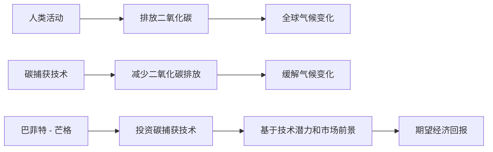

# 巴菲特 - 芒格的碳捕获技术投资：应对气候变化的关键

> 关键词：巴菲特、芒格、碳捕获技术、气候变化、投资、能源转型、可持续发展

> 摘要：本文聚焦于巴菲特和芒格对碳捕获技术的投资，深入探讨这一投资行为在应对气候变化中的关键作用。首先介绍相关背景，包括目的范围、预期读者等。接着阐述碳捕获技术的核心概念与联系，详细讲解其核心算法原理及具体操作步骤。通过数学模型和公式进一步剖析该技术，结合项目实战案例加深理解。探讨碳捕获技术的实际应用场景，推荐相关学习资源、开发工具和论文著作。最后总结碳捕获技术未来的发展趋势与挑战，为读者全面呈现碳捕获技术在应对气候变化以及投资领域的重要意义。

## 1. 背景介绍 
### 1.1 目的和范围
本文章旨在全面深入地探讨巴菲特 - 芒格对碳捕获技术投资的相关情况，以及碳捕获技术在应对气候变化方面的关键作用。范围涵盖碳捕获技术的基本原理、发展现状、投资价值、实际应用场景，以及其在全球应对气候变化战略中的地位和影响等多个方面。通过对这些内容的分析，为读者提供一个系统且清晰的认知框架，帮助读者理解碳捕获技术投资与气候变化应对之间的紧密联系。

### 1.2 预期读者
本文预期读者包括对投资领域感兴趣的专业人士，如投资者、基金经理、金融分析师等，他们可以从文章中了解到碳捕获技术投资的潜在价值和风险。同时，关注气候变化和可持续发展的科研人员、政策制定者也能从中获取关于碳捕获技术的详细信息，为相关研究和政策制定提供参考。此外，对能源转型和新兴技术有好奇心的普通读者也能通过本文拓宽知识面，增强对全球气候变化问题的认识。

### 1.3 文档结构概述
本文首先在背景介绍部分说明目的、预期读者和文档结构，为读者提供整体的阅读指引。接着深入讲解碳捕获技术的核心概念与联系，让读者对该技术有一个基本的认识。然后详细阐述核心算法原理及具体操作步骤，并结合数学模型和公式进行理论剖析。通过项目实战案例，展示碳捕获技术在实际中的应用和实现方式。探讨该技术的实际应用场景，分析其在不同领域的价值。推荐相关的工具和资源，帮助读者进一步深入学习。最后总结碳捕获技术未来的发展趋势与挑战，并提供常见问题解答和扩展阅读参考资料。

### 1.4 术语表
#### 1.4.1 核心术语定义
- **碳捕获技术（Carbon Capture Technology）**：指将工业生产、能源利用等过程中产生的二氧化碳（$CO_2$）捕获并分离出来，然后进行储存或再利用的一系列技术手段。
- **气候变化（Climate Change）**：指气候平均状态随时间的变化，通常表现为气温、降水、风速等气候要素的长期变化，主要是由人类活动排放温室气体导致的全球气候变暖等现象。
- **投资（Investment）**：指投资者为了获取预期收益，将资金投入到特定的项目、资产或企业中的经济行为。
- **可持续发展（Sustainable Development）**：指既满足当代人的需求，又不损害后代人满足其需求的能力的发展模式，强调经济、社会和环境的协调发展。
- **能源转型（Energy Transition）**：指能源体系从传统的化石能源为主向清洁能源和可再生能源为主的转变过程。

#### 1.4.2 相关概念解释
- **温室气体（Greenhouse Gases）**：指大气中能够吸收和重新辐射红外辐射的气体，主要包括二氧化碳（$CO_2$）、甲烷（$CH_4$）、氧化亚氮（$N_2O$）等。这些气体的排放会导致地球表面温度升高，引发全球气候变化。
- **碳封存（Carbon Sequestration）**：是碳捕获技术的一个重要环节，指将捕获的二氧化碳长期储存于地下地质构造（如枯竭的油气田、深部咸水层等）或海洋中，以减少大气中二氧化碳的浓度。
- **碳循环（Carbon Cycle）**：指碳元素在地球的大气、陆地、海洋和生物等各个圈层之间的循环过程。碳捕获技术可以在一定程度上干预碳循环，减少人为活动对碳循环的干扰。

#### 1.4.3 缩略词列表
- **CCS（Carbon Capture and Storage）**：碳捕获与封存，是一种将二氧化碳从工业和能源相关源捕获并安全存储在地下的技术。
- **CCUS（Carbon Capture, Utilization and Storage）**：碳捕获、利用与封存，在 CCS 的基础上增加了对捕获二氧化碳的再利用环节。

## 2. 核心概念与联系 

### 碳捕获技术的原理
碳捕获技术的基本原理是通过物理、化学或生物等方法，将工业生产、能源利用等过程中产生的二氧化碳从混合气体中分离出来。常见的碳捕获方法包括燃烧前捕获、燃烧后捕获和富氧燃烧捕获。

- **燃烧前捕获（Pre - combustion Capture）**：在燃料燃烧之前，将燃料中的碳转化为二氧化碳并分离出来。例如，在煤气化联合循环（IGCC）发电系统中，煤炭首先被气化，生成合成气（主要成分是一氧化碳和氢气），然后通过水煤气变换反应将一氧化碳转化为二氧化碳，最后采用物理或化学吸收法将二氧化碳分离出来。
- **燃烧后捕获（Post - combustion Capture）**：在燃料燃烧后，从燃烧产生的烟气中分离二氧化碳。这种方法适用于大多数现有的化石燃料发电厂和工业锅炉。常用的分离技术包括化学吸收法（如使用胺类溶液吸收二氧化碳）、物理吸附法（如使用活性炭、分子筛等吸附剂吸附二氧化碳）和膜分离法（利用具有选择性透过性的膜分离二氧化碳）。
- **富氧燃烧捕获（Oxy - fuel Combustion Capture）**：使用纯氧或高浓度氧气代替空气进行燃烧，燃烧产物主要是二氧化碳和水蒸气，经过冷凝去除水蒸气后，可得到高纯度的二氧化碳。

### 碳捕获技术与气候变化的联系
全球气候变化的主要原因是人类活动排放的大量温室气体，其中二氧化碳是最主要的温室气体之一。碳捕获技术可以有效地减少二氧化碳的排放，从而缓解全球气候变暖的趋势。通过捕获工业和能源领域产生的二氧化碳，并将其安全地储存或再利用，可以降低大气中二氧化碳的浓度，减缓气候变化的速度。

### 巴菲特 - 芒格投资与碳捕获技术的联系
巴菲特和芒格作为投资界的传奇人物，他们对碳捕获技术的投资反映了对该技术未来发展潜力的看好。一方面，碳捕获技术在应对气候变化方面具有重要的战略意义，随着全球对气候变化问题的关注度不断提高，政府和企业对碳减排的需求也越来越迫切，碳捕获技术市场具有广阔的发展前景。另一方面，投资碳捕获技术也符合巴菲特和芒格长期投资、价值投资的理念，他们相信该技术在未来能够为投资者带来可观的经济回报。

### 文本示意图
碳捕获技术与气候变化、投资之间的联系可以用以下文本示意图表示：

人类活动排放二氧化碳 -> 导致全球气候变化 -> 碳捕获技术减少二氧化碳排放 -> 缓解气候变化

巴菲特 - 芒格投资碳捕获技术 -> 基于技术发展潜力和市场前景 -> 期望获得经济回报

### Mermaid 流程图


## 3. 核心算法原理 & 具体操作步骤 

### 化学吸收法的核心算法原理
化学吸收法是燃烧后碳捕获技术中应用最广泛的方法之一，其核心原理是利用碱性吸收剂与二氧化碳发生化学反应，将二氧化碳从烟气中吸收下来。以胺类吸收剂为例，其化学反应过程如下：

#### 吸收过程
在吸收塔中，含有二氧化碳的烟气与胺类吸收剂溶液接触，二氧化碳与胺发生化学反应，生成氨基甲酸盐。以一乙醇胺（MEA）为例，反应方程式为：

$2RNH_2 + CO_2 + H_2O \rightleftharpoons (RNH_3)_2CO_3$

$RNH_2 + CO_2 \rightleftharpoons RNHCOO^- + H^+$

其中，$RNH_2$ 表示胺类吸收剂。

#### 解吸过程
吸收了二氧化碳的富液进入解吸塔，通过加热使氨基甲酸盐分解，释放出二氧化碳，同时使吸收剂再生。反应方程式为：

$(RNH_3)_2CO_3 \rightleftharpoons 2RNH_2 + CO_2 + H_2O$

$RNHCOO^- + H^+ \rightleftharpoons RNH_2 + CO_2$

### 具体操作步骤的 Python 代码实现
以下是一个简化的化学吸收法碳捕获过程的 Python 代码示例，用于模拟吸收和解吸过程中二氧化碳的吸收量和解吸量。

```python
# 定义吸收剂的相关参数
MEA_concentration = 30  # 一乙醇胺（MEA）的质量分数，%
gas_flow_rate = 1000  # 烟气的流量，m^3/h
CO2_concentration_in_gas = 0.1  # 烟气中二氧化碳的体积分数
absorption_efficiency = 0.9  # 吸收塔的吸收效率
desorption_efficiency = 0.95  # 解吸塔的解吸效率

# 计算进入吸收塔的二氧化碳流量
CO2_flow_rate_in = gas_flow_rate * CO2_concentration_in_gas  # m^3/h

# 计算吸收塔中被吸收的二氧化碳流量
CO2_flow_rate_absorbed = CO2_flow_rate_in * absorption_efficiency  # m^3/h

# 计算解吸塔中解吸出的二氧化碳流量
CO2_flow_rate_desorbed = CO2_flow_rate_absorbed * desorption_efficiency  # m^3/h

# 输出结果
print(f"进入吸收塔的二氧化碳流量: {CO2_flow_rate_in} m^3/h")
print(f"吸收塔中被吸收的二氧化碳流量: {CO2_flow_rate_absorbed} m^3/h")
print(f"解吸塔中解吸出的二氧化碳流量: {CO2_flow_rate_desorbed} m^3/h")
```

### 代码解释
1. **参数定义**：首先定义了吸收剂的浓度、烟气流量、烟气中二氧化碳的浓度、吸收塔和解吸塔的效率等参数。
2. **计算进入吸收塔的二氧化碳流量**：根据烟气流量和二氧化碳浓度计算进入吸收塔的二氧化碳流量。
3. **计算吸收塔中被吸收的二氧化碳流量**：根据吸收塔的吸收效率计算被吸收的二氧化碳流量。
4. **计算解吸塔中解吸出的二氧化碳流量**：根据解吸塔的解吸效率计算解吸出的二氧化碳流量。
5. **输出结果**：将计算得到的结果输出，方便用户查看。

## 4. 数学模型和公式 & 详细讲解 & 举例说明 

### 化学吸收法的数学模型
化学吸收法的数学模型主要基于质量守恒定律和化学反应动力学原理。在吸收塔中，二氧化碳的吸收过程可以用以下质量守恒方程描述：

$\frac{dC_{CO_2}}{dt} = -kC_{CO_2}C_{absorbent}$

其中，$C_{CO_2}$ 是二氧化碳的浓度，$C_{absorbent}$ 是吸收剂的浓度，$k$ 是反应速率常数。

在解吸塔中，二氧化碳的解吸过程可以用类似的方程描述：

$\frac{dC_{CO_2}}{dt} = k'dC_{carbamate}$

其中，$C_{carbamate}$ 是氨基甲酸盐的浓度，$k'$ 是解吸反应速率常数。

### 详细讲解
上述数学模型描述了二氧化碳在吸收和解吸过程中的浓度变化。在吸收过程中，二氧化碳的浓度随着时间的推移而降低，这是因为二氧化碳与吸收剂发生化学反应被吸收。反应速率常数 $k$ 取决于反应温度、吸收剂种类和浓度等因素。在解吸过程中，氨基甲酸盐的浓度随着时间的推移而降低，二氧化碳的浓度升高，这是因为氨基甲酸盐分解释放出二氧化碳。解吸反应速率常数 $k'$ 也受到温度、压力等因素的影响。

### 举例说明
假设在一个吸收塔中，初始二氧化碳浓度为 $C_{CO_2}^0 = 0.1$ mol/L，吸收剂浓度为 $C_{absorbent}^0 = 1$ mol/L，反应速率常数 $k = 0.1$ L/(mol·s)。根据上述数学模型，我们可以计算不同时间下二氧化碳的浓度。

根据质量守恒方程，我们可以得到：

$\frac{dC_{CO_2}}{C_{CO_2}C_{absorbent}} = -kdt$

对两边进行积分：

$\int_{C_{CO_2}^0}^{C_{CO_2}}\frac{dC_{CO_2}}{C_{CO_2}C_{absorbent}} = -k\int_0^t dt$

假设吸收剂浓度在反应过程中变化不大，可近似认为 $C_{absorbent} \approx C_{absorbent}^0$，则：

$\frac{1}{C_{absorbent}^0}\ln\frac{C_{CO_2}}{C_{CO_2}^0} = -kt$

$C_{CO_2} = C_{CO_2}^0e^{-kC_{absorbent}^0t}$

当 $t = 10$ s 时，$C_{CO_2} = 0.1e^{-0.1\times1\times10} = 0.1e^{-1} \approx 0.0368$ mol/L。

## 5. 项目实战：代码实际案例和详细解释说明 

### 5.1  开发环境搭建
为了实现一个完整的碳捕获技术模拟项目，我们可以使用 Python 语言和一些常用的科学计算库，如 NumPy、Pandas 和 Matplotlib。以下是搭建开发环境的步骤：

1. **安装 Python**：从 Python 官方网站（https://www.python.org/downloads/）下载并安装 Python 3.x 版本。
2. **安装虚拟环境（可选）**：为了避免不同项目之间的依赖冲突，建议使用虚拟环境。可以使用 `venv` 或 `conda` 来创建虚拟环境。例如，使用 `venv` 创建虚拟环境的命令如下：

```bash
python -m venv carbon_capture_env
source carbon_capture_env/bin/activate  # 在 Linux/Mac 上激活虚拟环境
carbon_capture_env\Scripts\activate  # 在 Windows 上激活虚拟环境
```

3. **安装所需库**：使用 `pip` 安装 NumPy、Pandas 和 Matplotlib 等库。

```bash
pip install numpy pandas matplotlib
```

### 5.2  源代码详细实现和代码解读
以下是一个更完整的碳捕获技术模拟项目的 Python 代码示例，用于模拟不同工况下碳捕获过程中二氧化碳的吸收和解吸情况，并绘制相关曲线。

```python
import numpy as np
import pandas as pd
import matplotlib.pyplot as plt

# 定义参数
MEA_concentration = 30  # 一乙醇胺（MEA）的质量分数，%
gas_flow_rate = 1000  # 烟气的流量，m^3/h
CO2_concentration_in_gas_list = np.linspace(0.05, 0.2, 10)  # 烟气中二氧化碳的体积分数列表
absorption_efficiency = 0.9  # 吸收塔的吸收效率
desorption_efficiency = 0.95  # 解吸塔的解吸效率
time_steps = 100  # 模拟的时间步数
time_interval = 1  # 时间间隔，s

# 初始化结果列表
CO2_flow_rate_in_list = []
CO2_flow_rate_absorbed_list = []
CO2_flow_rate_desorbed_list = []

# 循环模拟不同二氧化碳浓度下的情况
for CO2_concentration_in_gas in CO2_concentration_in_gas_list:
    CO2_flow_rate_in = gas_flow_rate * CO2_concentration_in_gas  # m^3/h
    CO2_flow_rate_absorbed = CO2_flow_rate_in * absorption_efficiency  # m^3/h
    CO2_flow_rate_desorbed = CO2_flow_rate_absorbed * desorption_efficiency  # m^3/h

    CO2_flow_rate_in_list.append(CO2_flow_rate_in)
    CO2_flow_rate_absorbed_list.append(CO2_flow_rate_absorbed)
    CO2_flow_rate_desorbed_list.append(CO2_flow_rate_desorbed)

# 创建 DataFrame 存储结果
results = pd.DataFrame({
    'CO2_concentration_in_gas': CO2_concentration_in_gas_list,
    'CO2_flow_rate_in': CO2_flow_rate_in_list,
    'CO2_flow_rate_absorbed': CO2_flow_rate_absorbed_list,
    'CO2_flow_rate_desorbed': CO2_flow_rate_desorbed_list
})

# 绘制曲线
plt.figure(figsize=(10, 6))
plt.plot(results['CO2_concentration_in_gas'], results['CO2_flow_rate_in'], label='CO2 flow rate in')
plt.plot(results['CO2_concentration_in_gas'], results['CO2_flow_rate_absorbed'], label='CO2 flow rate absorbed')
plt.plot(results['CO2_concentration_in_gas'], results['CO2_flow_rate_desorbed'], label='CO2 flow rate desorbed')
plt.xlabel('CO2 concentration in gas')
plt.ylabel('CO2 flow rate (m^3/h)')
plt.title('Carbon capture process simulation')
plt.legend()
plt.grid(True)
plt.show()
```

### 5.3  代码解读与分析
1. **参数定义**：定义了吸收剂浓度、烟气流量、二氧化碳浓度列表、吸收塔和解吸塔的效率、模拟时间步数和时间间隔等参数。
2. **循环模拟**：通过循环遍历不同的二氧化碳浓度，计算进入吸收塔的二氧化碳流量、吸收塔中被吸收的二氧化碳流量和解吸塔中解吸出的二氧化碳流量，并将结果存储在列表中。
3. **数据存储**：使用 Pandas 的 DataFrame 存储模拟结果，方便后续分析和处理。
4. **绘制曲线**：使用 Matplotlib 绘制不同二氧化碳浓度下进入吸收塔、被吸收和解吸出的二氧化碳流量曲线，直观地展示碳捕获过程的变化情况。

从代码的运行结果可以看出，随着烟气中二氧化碳浓度的增加，进入吸收塔的二氧化碳流量、被吸收的二氧化碳流量和解吸出的二氧化碳流量都相应增加。这表明在一定范围内，提高烟气中二氧化碳的浓度可以增加碳捕获的效率。

## 6. 实际应用场景 
### 电力行业
在电力行业，碳捕获技术可以应用于燃煤发电厂、燃气发电厂等。通过在发电厂中安装碳捕获设备，捕获燃烧产生的二氧化碳，可以显著减少发电厂的二氧化碳排放。例如，美国的 Petra Nova 碳捕获项目是世界上最大的商业规模碳捕获项目之一，该项目位于得克萨斯州的一个燃煤发电厂，每年可以捕获并封存超过 100 万吨的二氧化碳。

### 工业领域
在工业领域，碳捕获技术可以应用于钢铁、水泥、化工等行业。这些行业是二氧化碳排放的大户，通过采用碳捕获技术，可以有效降低其碳排放强度。例如，在钢铁生产过程中，通过在高炉煤气中捕获二氧化碳，可以减少钢铁生产的碳足迹。在水泥生产中，碳捕获技术可以捕获水泥窑排放的二氧化碳，实现水泥行业的低碳发展。

### 石油和天然气行业
在石油和天然气行业，碳捕获技术可以用于提高石油采收率（EOR）。将捕获的二氧化碳注入到油藏中，可以增加油藏的压力，提高石油的采收率。同时，注入的二氧化碳可以被永久封存于油藏中，实现碳减排和提高石油产量的双重目标。例如，加拿大的 Weyburn - Midale 二氧化碳封存项目是世界上最早的大规模二氧化碳封存项目之一，该项目将二氧化碳注入到油藏中，既提高了石油采收率，又实现了二氧化碳的永久封存。

### 碳循环利用
除了碳封存，捕获的二氧化碳还可以进行再利用，实现碳循环。例如，二氧化碳可以用于生产化学品、燃料、建筑材料等。通过将二氧化碳转化为有用的产品，可以减少对化石资源的依赖，同时实现碳减排的目标。例如，一些科研团队正在研究利用二氧化碳和氢气合成甲醇的技术，甲醇可以作为燃料或化工原料使用。

## 7. 工具和资源推荐
### 7.1 学习资源推荐
#### 7.1.1 书籍推荐
- 《气候变化科学：现状与未来趋势》：本书全面介绍了气候变化的科学原理、影响和应对策略，对于理解碳捕获技术在应对气候变化中的作用具有重要的参考价值。
- 《碳捕获与封存技术》：详细介绍了碳捕获与封存技术的原理、方法和应用案例，是学习碳捕获技术的经典教材。
- 《能源转型：从化石能源到清洁能源》：探讨了能源转型的背景、挑战和机遇，以及碳捕获技术在能源转型中的地位和作用。

#### 7.1.2 在线课程
- Coursera 上的 “Climate Change Science and Solutions”：由知名大学的教授授课，系统地介绍了气候变化的科学知识和应对措施，包括碳捕获技术。
- edX 上的 “Carbon Capture and Storage”：专门讲解碳捕获与封存技术的原理、技术和政策，适合对该技术感兴趣的学习者。

#### 7.1.3 技术博客和网站
- 国际能源署（IEA）官网（https://www.iea.org/）：提供了关于能源政策、技术和市场的最新信息，包括碳捕获技术的发展动态。
- 全球碳捕集与封存研究院（GCCSI）官网（https://www.globalccsinstitute.com/）：专注于碳捕获与封存技术的研究和推广，提供了丰富的技术资料和案例分析。
- 能源与气候智库（ECIU）博客（https://eciu.net/）：发布关于能源和气候变化的最新研究成果和观点，对碳捕获技术的讨论具有一定的参考价值。

### 7.2 开发工具框架推荐
#### 7.2.1 IDE和编辑器
- PyCharm：一款功能强大的 Python 集成开发环境（IDE），提供了代码编辑、调试、版本控制等一系列功能，适合开发碳捕获技术相关的 Python 项目。
- Visual Studio Code：一款轻量级的代码编辑器，支持多种编程语言，通过安装相关插件可以实现 Python 开发的高效工作流。

#### 7.2.2 调试和性能分析工具
- PDB：Python 自带的调试工具，可以帮助开发者逐行调试代码，查找代码中的错误。
- cProfile：Python 的性能分析工具，可以分析代码的运行时间和函数调用情况，帮助开发者优化代码性能。

#### 7.2.3 相关框架和库
- NumPy：Python 的科学计算库，提供了高效的数组操作和数学函数，在碳捕获技术的数值模拟中具有重要的应用。
- Pandas：Python 的数据处理和分析库，用于处理和分析碳捕获技术模拟过程中的数据。
- Matplotlib：Python 的绘图库，可以绘制各种类型的图表，直观地展示碳捕获技术的模拟结果。

### 7.3 相关论文著作推荐
#### 7.3.1 经典论文
- “Carbon Capture and Storage: A Key Technology for Mitigating Climate Change”：该论文系统地介绍了碳捕获与封存技术的原理、技术和政策，是碳捕获技术领域的经典论文之一。
- “The Role of Carbon Capture and Storage in a Low - Carbon Energy Future”：探讨了碳捕获与封存技术在低碳能源未来中的作用和发展前景。

#### 7.3.2 最新研究成果
- 可以通过学术数据库，如 IEEE Xplore、ACM Digital Library、ScienceDirect 等，搜索关于碳捕获技术的最新研究论文，了解该领域的前沿动态。

#### 7.3.3 应用案例分析
- 可以参考国际能源署（IEA）、全球碳捕集与封存研究院（GCCSI）等机构发布的碳捕获技术应用案例报告，深入了解该技术在实际项目中的应用情况和经验教训。

## 8. 总结：未来发展趋势与挑战
### 未来发展趋势
- **技术创新**：未来碳捕获技术将不断创新和发展，提高捕获效率，降低成本。例如，开发新型的吸收剂、吸附剂和膜材料，提高二氧化碳的分离效率；采用先进的工艺和设备，降低碳捕获过程的能耗和物耗。
- **大规模应用**：随着全球对气候变化问题的关注度不断提高，碳捕获技术将得到更广泛的应用。越来越多的发电厂、工业企业和石油天然气公司将采用碳捕获技术，实现碳减排目标。同时，碳捕获项目的规模也将不断扩大，从试点项目向商业规模项目发展。
- **碳循环利用**：碳捕获技术将与碳循环利用技术相结合，实现二氧化碳的资源化利用。例如，将捕获的二氧化碳转化为化学品、燃料、建筑材料等，提高资源利用效率，减少对化石资源的依赖。
- **国际合作**：碳捕获技术的发展需要国际合作。各国将加强在碳捕获技术研发、示范和推广方面的合作，共同应对气候变化挑战。例如，通过国际组织和多边合作机制，共享技术经验和资源，推动碳捕获技术的全球发展。

### 挑战
- **成本问题**：目前碳捕获技术的成本较高，限制了其大规模应用。降低碳捕获技术的成本是未来发展的关键。需要通过技术创新、规模经济和政策支持等手段，降低碳捕获设备的投资成本和运行成本。
- **技术可靠性**：碳捕获技术还存在一些技术可靠性问题，如吸收剂的降解、设备的腐蚀等。提高碳捕获技术的可靠性和稳定性是确保其长期运行的关键。需要加强技术研发和工程实践，解决技术可靠性问题。
- **政策支持**：碳捕获技术的发展需要政策支持。政府需要制定相关的政策和法规，鼓励企业采用碳捕获技术，如碳税、碳排放权交易等。同时，政府还需要加大对碳捕获技术研发和示范项目的资金投入，推动技术的发展和应用。
- **公众接受度**：碳捕获技术的大规模应用还面临公众接受度的问题。一些公众对碳捕获技术的安全性和环境影响存在疑虑。需要加强公众宣传和教育，提高公众对碳捕获技术的认识和接受度。

## 9. 附录：常见问题与解答
### 1. 碳捕获技术是否能够完全解决气候变化问题？
碳捕获技术是应对气候变化的重要手段之一，但不能完全解决气候变化问题。气候变化是一个复杂的全球性问题，需要综合采取多种措施，如提高能源效率、发展可再生能源、改变生活方式等。碳捕获技术可以减少工业和能源领域的二氧化碳排放，为实现全球碳减排目标提供重要支持。

### 2. 碳捕获技术的成本有多高？
碳捕获技术的成本因技术类型、应用场景和规模等因素而异。目前，碳捕获技术的成本相对较高，一般在几十美元到上百美元每吨二氧化碳。随着技术的不断进步和规模的扩大，碳捕获技术的成本有望逐渐降低。

### 3. 碳捕获技术是否安全？
碳捕获技术在安全方面已经进行了大量的研究和实践。在碳捕获、运输和封存过程中，采取了一系列的安全措施，确保二氧化碳的安全处理和储存。例如，在碳封存过程中，选择合适的地质构造进行储存，并进行严格的监测和管理，以防止二氧化碳泄漏。

### 4. 碳捕获技术对环境有哪些影响？
碳捕获技术的主要目的是减少二氧化碳排放，对环境具有积极的影响。然而，碳捕获技术本身也可能对环境产生一些影响，如能源消耗、化学物质的使用等。在发展碳捕获技术的过程中，需要充分考虑其环境影响，并采取相应的措施进行控制和管理。

## 10. 扩展阅读 & 参考资料
### 扩展阅读
- 《可再生能源与可持续发展》：深入探讨了可再生能源在可持续发展中的作用，与碳捕获技术共同构成了应对气候变化的重要手段。
- 《能源经济学》：介绍了能源市场的经济原理和政策，对于理解碳捕获技术的经济可行性和市场前景具有重要的参考价值。

### 参考资料
- 国际能源署（IEA）发布的相关报告和数据。
- 全球碳捕集与封存研究院（GCCSI）的技术资料和案例分析。
- 相关学术期刊上发表的关于碳捕获技术的研究论文。
- 政府部门发布的关于气候变化和能源政策的文件和法规。