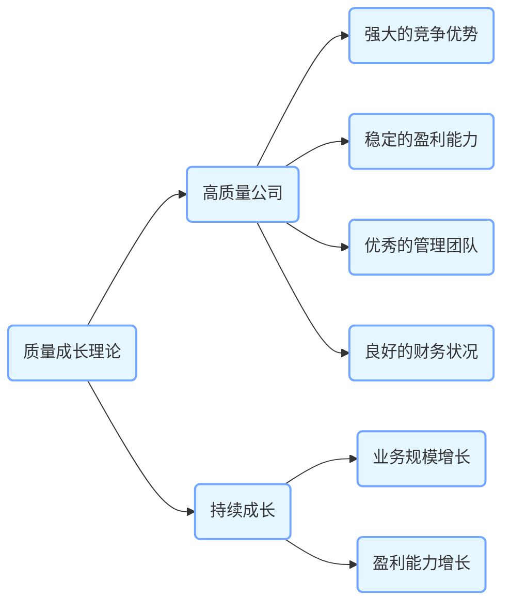

# 巴菲特 - 芒格的质量成长理论：寻找高质量且能持续成长的公司

> 关键词：巴菲特 - 芒格、质量成长理论、高质量公司、持续成长、价值投资

> 摘要：本文深入探讨了巴菲特 - 芒格的质量成长理论，旨在揭示如何寻找高质量且能持续成长的公司。首先介绍了该理论的背景，包括目的、预期读者、文档结构和相关术语。接着阐述了核心概念及其联系，分析了核心算法原理和具体操作步骤，并运用数学模型和公式进行详细讲解。通过项目实战案例，展示了该理论在实际中的应用。同时，探讨了该理论的实际应用场景，推荐了相关的学习资源、开发工具框架和论文著作。最后总结了未来发展趋势与挑战，提供了常见问题解答和扩展阅读参考资料，帮助读者全面理解和运用这一理论进行投资决策。

## 1. 背景介绍 
### 1.1 目的和范围
巴菲特和芒格作为投资界的传奇人物，他们的投资理念和策略一直备受关注。质量成长理论是他们投资体系中的重要组成部分，其目的在于帮助投资者识别那些具有高质量和持续成长潜力的公司，从而实现长期的投资回报。本文的范围将涵盖质量成长理论的各个方面，包括核心概念、算法原理、数学模型、实际应用等，旨在为投资者提供一个全面深入的理解。

### 1.2 预期读者
本文预期读者包括对价值投资感兴趣的个人投资者、金融专业人士、投资研究人员以及希望学习巴菲特 - 芒格投资理念的人群。无论是初学者还是有一定投资经验的人士，都能从本文中获得有价值的信息和启示。

### 1.3 文档结构概述
本文将按照以下结构进行阐述：首先介绍核心概念与联系，帮助读者建立对质量成长理论的基本认识；接着详细讲解核心算法原理和具体操作步骤，使读者了解如何运用该理论进行公司分析；然后通过数学模型和公式进一步深化对理论的理解，并举例说明；之后通过项目实战案例展示理论的实际应用；再探讨实际应用场景；推荐相关的工具和资源；最后总结未来发展趋势与挑战，解答常见问题并提供扩展阅读参考资料。

### 1.4 术语表
#### 1.4.1 核心术语定义
- **质量成长理论**：巴菲特 - 芒格提出的一种投资理论，强调寻找那些具有高质量业务和持续成长潜力的公司进行投资。
- **高质量公司**：具有强大的竞争优势、稳定的盈利能力、优秀的管理团队和良好的财务状况的公司。
- **持续成长**：公司在较长时间内能够保持业务规模、盈利能力等方面的稳定增长。
- **价值投资**：一种投资策略，通过分析公司的内在价值，寻找被低估的股票进行投资。

#### 1.4.2 相关概念解释
- **竞争优势**：公司在市场中相对于竞争对手所具有的独特优势，如品牌优势、技术优势、成本优势等。
- **护城河**：巴菲特提出的概念，指公司抵御竞争对手的能力，类似于城堡周围的护城河，保护公司的盈利能力。
- **自由现金流**：公司在满足运营和资本支出后剩余的现金流量，反映了公司的实际盈利能力和财务健康状况。

#### 1.4.3 缩略词列表
- **ROE**：净资产收益率（Return on Equity），衡量公司运用自有资本的效率。
- **EPS**：每股收益（Earnings Per Share），反映公司的盈利能力。
- **PEG**：市盈率相对盈利增长比率（Price/Earnings to Growth Ratio），用于评估股票的估值是否合理。

## 2. 核心概念与联系 

### 核心概念原理
巴菲特 - 芒格的质量成长理论基于价值投资的基本理念，认为投资者应该关注公司的内在价值，而不是短期的市场波动。高质量公司通常具有以下特点：
1. **强大的竞争优势**：拥有独特的产品或服务，能够在市场中占据领先地位，抵御竞争对手的挑战。例如，可口可乐公司的品牌优势使其在饮料市场具有极高的知名度和忠诚度，其他竞争对手难以与之抗衡。
2. **稳定的盈利能力**：公司能够持续地创造利润，并且利润增长具有一定的稳定性。这可以通过分析公司的财务报表，如净利润、毛利率、净利率等指标来评估。
3. **优秀的管理团队**：一个好的管理团队能够制定合理的战略规划，有效地运营公司，应对各种挑战。例如，苹果公司的史蒂夫·乔布斯和蒂姆·库克，他们的领导能力和创新精神为公司的发展奠定了坚实的基础。
4. **良好的财务状况**：公司具有健康的资产负债表，充足的现金流，能够应对各种风险。例如，拥有较低的负债率和较高的自由现金流的公司，在经济不景气时更具抗风险能力。

持续成长是指公司在未来一段时间内能够保持业务规模和盈利能力的增长。这需要公司具备不断创新、拓展市场的能力。例如，亚马逊公司通过不断拓展业务领域，从最初的在线书店发展成为全球最大的电子商务和云计算服务提供商之一。

### 架构的文本示意图
```plaintext
质量成长理论
|-- 高质量公司
|   |-- 强大的竞争优势
|   |-- 稳定的盈利能力
|   |-- 优秀的管理团队
|   |-- 良好的财务状况
|-- 持续成长
|   |-- 业务规模增长
|   |-- 盈利能力增长
```

### Mermaid 流程图


## 3. 核心算法原理 & 具体操作步骤 

### 核心算法原理
在寻找高质量且能持续成长的公司时，可以通过一系列的财务指标和分析方法来评估公司的质量和成长潜力。以下是一些常用的指标和算法：

#### 净资产收益率（ROE）
ROE 是衡量公司运用自有资本的效率的重要指标，计算公式为：
$$ROE = \frac{净利润}{净资产} \times 100\%$$
一般来说，ROE 越高，说明公司利用自有资本创造利润的能力越强。巴菲特和芒格通常会关注 ROE 持续保持在 15% 以上的公司。

#### 每股收益（EPS）增长率
EPS 增长率反映了公司每股收益的增长情况，计算公式为：
$$EPS增长率 = \frac{本期EPS - 上期EPS}{上期EPS} \times 100\%$$
持续的 EPS 增长表明公司的盈利能力在不断提升。

#### 市盈率相对盈利增长比率（PEG）
PEG 用于评估股票的估值是否合理，计算公式为：
$$PEG = \frac{市盈率}{EPS增长率}$$
一般认为，PEG 小于 1 时，股票可能被低估；PEG 大于 1 时，股票可能被高估。

### 具体操作步骤

#### 步骤 1：筛选公司
首先，根据一些基本的条件筛选出可能符合要求的公司。例如，可以选择市值较大、行业地位较高的公司。可以使用金融数据平台，如东方财富、同花顺等，设置筛选条件进行初步筛选。

#### 步骤 2：财务分析
对筛选出的公司进行详细的财务分析，计算上述提到的财务指标。可以使用 Python 进行数据获取和计算，以下是一个简单的示例代码：

```python
import pandas as pd
import yfinance as yf

# 定义要分析的公司股票代码
ticker = 'AAPL'

# 获取公司财务数据
data = yf.Ticker(ticker).financials

# 计算 ROE
net_income = data.loc['Net Income']
total_equity = yf.Ticker(ticker).balance_sheet.loc['Total Stockholder Equity']
roe = (net_income / total_equity) * 100

# 计算 EPS 增长率
eps = yf.Ticker(ticker).earnings_per_share
eps_growth_rate = ((eps - eps.shift(1)) / eps.shift(1)) * 100

# 计算市盈率
price = yf.Ticker(ticker).history(period='1d')['Close'].values[0]
pe_ratio = price / eps

# 计算 PEG
peg = pe_ratio / eps_growth_rate

print(f"ROE: {roe}")
print(f"EPS 增长率: {eps_growth_rate}")
print(f"市盈率: {pe_ratio}")
print(f"PEG: {peg}")
```

#### 步骤 3：定性分析
除了财务分析，还需要对公司进行定性分析。这包括评估公司的竞争优势、管理团队、行业前景等。可以通过阅读公司的年报、行业研究报告、新闻报道等获取相关信息。

#### 步骤 4：综合评估
综合财务分析和定性分析的结果，对公司进行全面评估。如果公司在财务指标和定性方面都表现出色，那么它可能是一个高质量且能持续成长的公司。

## 4. 数学模型和公式 & 详细讲解 & 举例说明 

### 数学模型和公式
#### 内在价值模型
巴菲特和芒格认为，股票的内在价值是其未来现金流的折现值。可以使用以下公式计算公司的内在价值：
$$V = \sum_{t=1}^{n} \frac{FCF_t}{(1 + r)^t}$$
其中，$V$ 表示公司的内在价值，$FCF_t$ 表示第 $t$ 年的自由现金流，$r$ 表示折现率，$n$ 表示预测的年数。

#### 安全边际
安全边际是指股票的内在价值与市场价格之间的差距。计算公式为：
$$安全边际 = \frac{内在价值 - 市场价格}{内在价值} \times 100\%$$
安全边际越大，投资的风险越小。

### 详细讲解
#### 内在价值模型
内在价值模型的核心思想是，公司的价值取决于其未来能够产生的现金流。自由现金流是公司在满足运营和资本支出后剩余的现金流量，是公司真正能够分配给股东的现金。折现率是考虑了资金的时间价值和投资风险的因素，通常可以使用公司的加权平均资本成本（WACC）作为折现率。

#### 安全边际
安全边际是价值投资的重要概念，它为投资者提供了一定的缓冲空间。当股票的市场价格低于其内在价值时，投资者可以以较低的价格买入股票，从而降低投资风险。

### 举例说明
假设一家公司预计未来 5 年的自由现金流分别为 1000 万元、1200 万元、1400 万元、1600 万元和 1800 万元，折现率为 10%。则该公司的内在价值为：
$$V = \frac{1000}{(1 + 0.1)^1} + \frac{1200}{(1 + 0.1)^2} + \frac{1400}{(1 + 0.1)^3} + \frac{1600}{(1 + 0.1)^4} + \frac{1800}{(1 + 0.1)^5}$$
```python
import numpy as np

fcf = np.array([1000, 1200, 1400, 1600, 1800])
r = 0.1
years = np.arange(1, len(fcf) + 1)
intrinsic_value = np.sum(fcf / (1 + r) ** years)
print(f"公司的内在价值: {intrinsic_value} 万元")
```
假设该公司的市场价格为 5000 万元，则安全边际为：
$$安全边际 = \frac{intrinsic_value - 5000}{intrinsic_value} \times 100\%$$
```python
market_price = 5000
safety_margin = ((intrinsic_value - market_price) / intrinsic_value) * 100
print(f"安全边际: {safety_margin}%")
```

## 5. 项目实战：代码实际案例和详细解释说明 

### 5.1 开发环境搭建
#### 安装 Python
首先，需要安装 Python 环境。可以从 Python 官方网站（https://www.python.org/downloads/）下载适合自己操作系统的 Python 版本，并按照安装向导进行安装。

#### 安装必要的库
使用以下命令安装项目所需的库：
```sh
pip install pandas yfinance
```
- `pandas`：用于数据处理和分析。
- `yfinance`：用于获取金融数据。

### 5.2 源代码详细实现和代码解读
以下是一个完整的 Python 代码示例，用于寻找高质量且能持续成长的公司：

```python
import pandas as pd
import yfinance as yf

def analyze_company(ticker):
    try:
        # 获取公司财务数据
        data = yf.Ticker(ticker).financials
        balance_sheet = yf.Ticker(ticker).balance_sheet

        # 计算 ROE
        net_income = data.loc['Net Income']
        total_equity = balance_sheet.loc['Total Stockholder Equity']
        roe = (net_income / total_equity) * 100

        # 计算 EPS 增长率
        eps = yf.Ticker(ticker).earnings_per_share
        eps_growth_rate = ((eps - eps.shift(1)) / eps.shift(1)) * 100

        # 计算市盈率
        price = yf.Ticker(ticker).history(period='1d')['Close'].values[0]
        pe_ratio = price / eps

        # 计算 PEG
        peg = pe_ratio / eps_growth_rate

        # 评估公司质量和成长潜力
        if roe.mean() > 15 and eps_growth_rate.mean() > 0 and peg.mean() < 1:
            print(f"{ticker} 可能是一个高质量且能持续成长的公司。")
            print(f"ROE 平均值: {roe.mean()}")
            print(f"EPS 增长率平均值: {eps_growth_rate.mean()}")
            print(f"PEG 平均值: {peg.mean()}")
        else:
            print(f"{ticker} 不太符合高质量且持续成长的标准。")

    except Exception as e:
        print(f"分析 {ticker} 时出现错误: {e}")

# 要分析的公司列表
tickers = ['AAPL', 'MSFT', 'GOOG']

for ticker in tickers:
    analyze_company(ticker)
```

### 5.3 代码解读与分析
- **函数定义**：`analyze_company` 函数接受一个股票代码作为参数，用于分析该公司的质量和成长潜力。
- **数据获取**：使用 `yfinance` 库获取公司的财务数据、资产负债表、每股收益和股票价格。
- **指标计算**：计算 ROE、EPS 增长率、市盈率和 PEG 等指标。
- **评估判断**：根据 ROE 平均值大于 15%、EPS 增长率平均值大于 0 和 PEG 平均值小于 1 的条件，判断公司是否符合高质量且持续成长的标准。
- **循环分析**：对给定的公司列表进行循环分析，输出分析结果。

## 6. 实际应用场景 
### 个人投资
对于个人投资者来说，巴菲特 - 芒格的质量成长理论可以帮助他们选择优质的股票进行长期投资。通过运用该理论分析公司的质量和成长潜力，投资者可以避免盲目跟风和短期投机，实现资产的稳健增值。例如，个人投资者可以使用上述的分析方法，筛选出那些具有高 ROE、持续 EPS 增长和低 PEG 的公司，然后进行深入研究，选择合适的时机买入股票。

### 基金管理
基金经理可以运用质量成长理论构建投资组合。通过寻找高质量且能持续成长的公司，基金经理可以提高基金的业绩表现。例如，一些价值型基金通常会遵循巴菲特 - 芒格的投资理念，选择具有强大竞争优势和稳定成长潜力的公司进行投资。

### 企业战略规划
企业管理者可以借鉴质量成长理论，评估自身企业的竞争力和成长潜力。通过分析公司的财务状况、竞争优势和市场前景，企业管理者可以制定合理的战略规划，提升企业的质量和成长能力。例如，企业可以通过加强研发投入、拓展市场渠道等方式，提高自身的竞争优势和盈利能力。

## 7. 工具和资源推荐
### 7.1 学习资源推荐
#### 7.1.1 书籍推荐
- 《聪明的投资者》（The Intelligent Investor）：本杰明·格雷厄姆著，价值投资的经典之作，巴菲特称这本书是他投资生涯的启蒙读物。
- 《巴菲特致股东的信：股份公司教程》（Letters to Shareholders of Berkshire Hathaway）：沃伦·巴菲特著，通过巴菲特致股东的信，深入了解他的投资理念和方法。
- 《穷查理宝典：查理·芒格的智慧箴言录》（Poor Charlie's Almanack: The Wit and Wisdom of Charles T. Munger）：彼得·考夫曼编著，全面介绍了查理·芒格的投资思想和人生智慧。

#### 7.1.2 在线课程
- Coursera 上的“价值投资基础”（Foundations of Value Investing）课程，由专业教授讲解价值投资的基本原理和方法。
- edX 上的“金融市场”（Financial Markets）课程，涵盖了金融市场的各个方面，包括投资策略和公司分析。

#### 7.1.3 技术博客和网站
- 雪球网（https://xueqiu.com/）：国内知名的投资社区，提供股票分析、投资策略分享等内容。
- Seeking Alpha（https://seekingalpha.com/）：全球领先的投资研究平台，有大量的专业分析师和投资者分享投资观点和研究报告。

### 7.2 开发工具框架推荐
#### 7.2.1 IDE和编辑器
- PyCharm：一款专业的 Python 集成开发环境，具有强大的代码编辑、调试和项目管理功能。
- Jupyter Notebook：一个交互式的开发环境，适合进行数据分析和代码演示。

#### 7.2.2 调试和性能分析工具
- `pdb`：Python 内置的调试器，可以帮助开发者定位代码中的问题。
- `cProfile`：Python 的性能分析工具，可以分析代码的运行时间和函数调用情况。

#### 7.2.3 相关框架和库
- `pandas`：用于数据处理和分析，提供了丰富的数据结构和函数。
- `yfinance`：用于获取金融数据，支持多种金融市场和数据类型。
- `scikit-learn`：机器学习库，可以用于构建预测模型，辅助投资决策。

### 7.3 相关论文著作推荐
#### 7.3.1 经典论文
- 《证券分析》（Security Analysis）：本杰明·格雷厄姆和戴维·多德著，价值投资的奠基之作，提出了许多重要的投资理念和分析方法。
- 《有效市场假说》（Efficient Market Hypothesis）：尤金·法玛著，探讨了市场效率和股票价格的形成机制。

#### 7.3.2 最新研究成果
- 可以关注《金融研究》《经济研究》等专业学术期刊，获取关于价值投资和公司分析的最新研究成果。
- 一些知名大学的商学院和研究机构也会发布相关的研究报告，可以通过他们的官方网站获取。

#### 7.3.3 应用案例分析
- 《价值投资案例集》：收集了大量的价值投资案例，分析了不同公司的投资价值和投资策略。
- 一些金融媒体和投资机构会发布投资案例分析报告，可以通过网络搜索获取。

## 8. 总结：未来发展趋势与挑战
### 未来发展趋势
#### 科技驱动的投资分析
随着科技的不断发展，人工智能、大数据等技术将在投资分析中得到更广泛的应用。例如，通过大数据分析可以获取更多的公司信息和市场数据，人工智能算法可以帮助投资者更准确地评估公司的质量和成长潜力。

#### 全球投资机会增加
随着全球化的推进，投资者将有更多的机会投资于全球范围内的公司。巴菲特 - 芒格的质量成长理论可以应用于不同国家和地区的公司分析，帮助投资者寻找具有潜力的投资标的。

#### 可持续投资的兴起
越来越多的投资者开始关注公司的社会责任和可持续发展能力。未来，高质量且能持续成长的公司不仅要具备良好的财务状况和竞争优势，还要在环境保护、社会公益等方面表现出色。

### 挑战
#### 市场不确定性增加
全球经济和政治环境的不确定性增加，如贸易摩擦、疫情等，会对公司的经营和发展产生影响。投资者需要更加敏锐地捕捉市场变化，及时调整投资策略。

#### 数据质量和可靠性
在使用大数据和人工智能进行投资分析时，数据的质量和可靠性是关键。不准确或不完整的数据可能会导致错误的分析结果，影响投资决策。

#### 竞争加剧
随着价值投资理念的普及，越来越多的投资者开始关注高质量且能持续成长的公司，这将导致这些公司的股票价格被高估，投资机会减少。投资者需要更加深入地挖掘潜在的投资标的，提高分析能力和判断力。

## 9. 附录：常见问题与解答
### 问题 1：如何确定公司的折现率？
解答：折现率的确定通常需要考虑公司的风险水平和市场利率。可以使用公司的加权平均资本成本（WACC）作为折现率，WACC 的计算公式为：
$$WACC = \frac{E}{V} \times r_e + \frac{D}{V} \times r_d \times (1 - T)$$
其中，$E$ 表示公司的股权价值，$D$ 表示公司的债务价值，$V = E + D$ 表示公司的总价值，$r_e$ 表示股权成本，$r_d$ 表示债务成本，$T$ 表示公司的所得税税率。

### 问题 2：ROE 越高越好吗？
解答：一般来说，ROE 越高说明公司利用自有资本创造利润的能力越强，但并不是 ROE 越高就一定越好。有些公司可能通过高负债来提高 ROE，但这也会增加公司的财务风险。因此，在分析 ROE 时，还需要结合公司的资产负债结构和现金流情况进行综合评估。

### 问题 3：PEG 指标有什么局限性？
解答：PEG 指标虽然可以在一定程度上评估股票的估值是否合理，但它也有一些局限性。例如，PEG 指标假设公司的未来 EPS 增长率是稳定的，但实际上公司的业绩增长可能会受到多种因素的影响，具有不确定性。此外，PEG 指标没有考虑公司的资产质量、竞争优势等因素。因此，在使用 PEG 指标时，需要结合其他指标和方法进行综合分析。

## 10. 扩展阅读 & 参考资料
### 扩展阅读
- 《投资最重要的事》（The Most Important Thing Illuminated: Uncommon Sense for the Thoughtful Investor）：霍华德·马克斯著，深入探讨了投资中的风险管理和价值判断。
- 《金融炼金术》（The Alchemy of Finance）：乔治·索罗斯著，介绍了索罗斯的投资哲学和反身性理论。

### 参考资料
- 沃伦·巴菲特历年致股东的信，可从伯克希尔·哈撒韦公司官方网站获取。
- 查理·芒格在各种演讲和访谈中的言论，可通过网络搜索和相关书籍获取。
- 金融数据平台如东方财富、同花顺等提供的公司财务数据和市场信息。