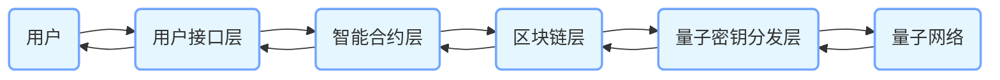

# 巴菲特 - 芒格的量子加密货币投资：未来金融的安全基石

> 关键词：巴菲特、芒格、量子加密货币、金融安全、投资策略、区块链、未来金融

> 摘要：本文深入探讨了巴菲特 - 芒格的量子加密货币投资理念及其在未来金融领域的重要性。通过分析量子加密货币的核心概念、算法原理、数学模型等，结合项目实战案例，阐述其作为未来金融安全基石的潜力。同时，介绍了相关的应用场景、工具资源，最后总结了其未来发展趋势与挑战，并解答常见问题。旨在为读者全面呈现量子加密货币投资在金融领域的关键作用和前景。

## 1. 背景介绍 
### 1.1 目的和范围
本文旨在全面剖析巴菲特 - 芒格的量子加密货币投资理念，深入研究量子加密货币的技术原理和投资价值，探讨其在未来金融体系中作为安全基石的可能性和重要性。范围涵盖量子加密货币的基本概念、核心算法、数学模型、实际应用场景，以及相关的工具资源和未来发展趋势等多个方面。

### 1.2 预期读者
本文预期读者包括金融投资领域的专业人士，如投资经理、分析师、交易员等；对新兴金融科技和加密货币感兴趣的学者和研究人员；以及希望了解未来金融发展趋势的普通投资者和金融爱好者。

### 1.3 文档结构概述
本文首先介绍背景信息，包括目的、预期读者和文档结构。接着阐述量子加密货币的核心概念与联系，包括原理和架构的文本示意图及 Mermaid 流程图。然后详细讲解核心算法原理和具体操作步骤，并用 Python 源代码进行说明。随后介绍数学模型和公式，通过举例加深理解。再通过项目实战案例，展示代码实现和解读。之后探讨实际应用场景，推荐相关工具和资源。最后总结未来发展趋势与挑战，解答常见问题并提供扩展阅读和参考资料。

### 1.4 术语表
#### 1.4.1 核心术语定义
- **量子加密货币**：基于量子力学原理和区块链技术的加密货币，利用量子特性实现更高的安全性和隐私保护。
- **巴菲特 - 芒格投资理念**：以价值投资为核心，注重长期投资和企业基本面分析的投资哲学。
- **区块链**：一种去中心化的分布式账本技术，通过密码学算法保证数据的不可篡改和透明性。
- **量子密钥分发**：利用量子力学的特性，在通信双方之间安全地分发密钥，确保通信的安全性。
- **哈希函数**：一种将任意长度的输入转换为固定长度输出的函数，常用于数据的完整性验证和加密。

#### 1.4.2 相关概念解释
- **量子力学**：研究微观世界物理现象的理论，其特性如量子纠缠、量子叠加等为量子加密货币的安全性提供了基础。
- **去中心化**：在区块链网络中，没有中心化的管理机构，所有节点共同参与数据的验证和存储，提高了系统的可靠性和抗攻击性。
- **智能合约**：一种自动执行的合约，其条款以代码的形式存储在区块链上，当满足预设条件时自动执行。

#### 1.4.3 缩略词列表
- **QKD**：Quantum Key Distribution，量子密钥分发
- **PoW**：Proof of Work，工作量证明
- **PoS**：Proof of Stake，权益证明
- **BTC**：Bitcoin，比特币
- **ETH**：Ethereum，以太坊

## 2. 核心概念与联系 
### 2.1 量子加密货币的原理
量子加密货币结合了量子力学和区块链技术的优势。量子力学的特性如量子纠缠和量子叠加，使得量子密钥分发具有极高的安全性。在量子加密货币中，量子密钥用于保护用户的私钥，防止私钥被窃取或破解。

区块链技术则提供了去中心化的账本系统，确保交易的透明性和不可篡改。每一笔交易都被记录在区块链上，通过密码学算法进行验证和存储。

### 2.2 量子加密货币的架构
量子加密货币的架构主要包括以下几个部分：
- **量子密钥分发层**：负责在用户之间安全地分发量子密钥。
- **区块链层**：存储交易记录和用户账户信息，保证数据的不可篡改和透明性。
- **智能合约层**：实现自动执行的合约，提高交易的效率和安全性。
- **用户接口层**：提供用户与量子加密货币系统的交互界面，方便用户进行交易和管理账户。

### 2.3 文本示意图
```plaintext
量子加密货币系统架构

|---------------------|
| 用户接口层         |
|---------------------|
| 智能合约层         |
|---------------------|
| 区块链层           |
|---------------------|
| 量子密钥分发层     |
|---------------------|
```

### 2.4 Mermaid 流程图


## 3. 核心算法原理 & 具体操作步骤 
### 3.1 量子密钥分发算法
量子密钥分发的核心算法是基于量子力学的特性，如量子纠缠和量子叠加。其中，BB84 协议是一种经典的量子密钥分发协议，其原理如下：

1. 发送方（Alice）随机选择一组量子比特的状态（如水平、垂直、对角线等），并将其发送给接收方（Bob）。
2. Bob 随机选择一组测量基（如水平 - 垂直、对角线 - 反对角线）对接收到的量子比特进行测量。
3. Alice 和 Bob 通过经典通信信道公开他们选择的测量基，但不公开测量结果。
4. 他们只保留测量基选择相同的量子比特的测量结果，这些结果就构成了他们的共享密钥。

### 3.2 Python 代码实现 BB84 协议
```python
import random

# 定义量子比特状态
HORIZONTAL = 0
VERTICAL = 1
DIAGONAL = 2
ANTIDIAGONAL = 3

# 定义测量基
LINEAR_BASIS = 0
DIAGONAL_BASIS = 1

# 生成随机量子比特序列
def generate_qubits(length):
    qubits = []
    for _ in range(length):
        qubit = random.randint(0, 3)
        qubits.append(qubit)
    return qubits

# 生成随机测量基序列
def generate_bases(length):
    bases = []
    for _ in range(length):
        basis = random.randint(0, 1)
        bases.append(basis)
    return bases

# 测量量子比特
def measure_qubits(qubits, bases):
    measurements = []
    for qubit, basis in zip(qubits, bases):
        if basis == LINEAR_BASIS:
            if qubit in [HORIZONTAL, VERTICAL]:
                measurements.append(qubit)
            else:
                measurements.append(random.choice([HORIZONTAL, VERTICAL]))
        else:
            if qubit in [DIAGONAL, ANTIDIAGONAL]:
                measurements.append(qubit)
            else:
                measurements.append(random.choice([DIAGONAL, ANTIDIAGONAL]))
    return measurements

# 筛选相同测量基的结果
def sift_keys(alice_bases, bob_bases, alice_measurements, bob_measurements):
    alice_key = []
    bob_key = []
    for i in range(len(alice_bases)):
        if alice_bases[i] == bob_bases[i]:
            alice_key.append(alice_measurements[i])
            bob_key.append(bob_measurements[i])
    return alice_key, bob_key

# 主函数
def main():
    length = 100
    alice_qubits = generate_qubits(length)
    alice_bases = generate_bases(length)
    bob_bases = generate_bases(length)
    bob_measurements = measure_qubits(alice_qubits, bob_bases)
    alice_measurements = measure_qubits(alice_qubits, alice_bases)
    alice_key, bob_key = sift_keys(alice_bases, bob_bases, alice_measurements, bob_measurements)
    print("Alice's key:", alice_key)
    print("Bob's key:", bob_key)

if __name__ == "__main__":
    main()
```

### 3.3 具体操作步骤
1. **初始化**：用户（Alice 和 Bob）分别生成随机的量子比特序列和测量基序列。
2. **发送量子比特**：Alice 将量子比特发送给 Bob。
3. **测量量子比特**：Bob 使用自己的测量基对接收到的量子比特进行测量。
4. **公开测量基**：Alice 和 Bob 通过经典通信信道公开他们选择的测量基。
5. **筛选密钥**：他们只保留测量基选择相同的量子比特的测量结果，得到共享密钥。

## 4. 数学模型和公式 & 详细讲解 & 举例说明 
### 4.1 量子力学基础公式
#### 4.1.1 量子比特的表示
量子比特可以用二维希尔伯特空间中的向量表示，如水平状态 $|0\rangle$ 和垂直状态 $|1\rangle$：
$$|0\rangle = \begin{bmatrix} 1 \\ 0 \end{bmatrix}, |1\rangle = \begin{bmatrix} 0 \\ 1 \end{bmatrix}$$

量子比特的一般状态可以表示为：
$$|\psi\rangle = \alpha|0\rangle + \beta|1\rangle$$
其中，$\alpha$ 和 $\beta$ 是复数，满足 $|\alpha|^2 + |\beta|^2 = 1$。

#### 4.1.2 量子测量
量子测量是将量子态投影到某个基上的操作。例如，在水平 - 垂直基下测量量子态 $|\psi\rangle$，得到 $|0\rangle$ 的概率为 $|\alpha|^2$，得到 $|1\rangle$ 的概率为 $|\beta|^2$。

### 4.2 区块链中的哈希函数
哈希函数是区块链中用于保证数据完整性和安全性的重要工具。常见的哈希函数如 SHA - 256，它将任意长度的输入转换为 256 位的输出。

哈希函数具有以下特性：
- **确定性**：相同的输入总是产生相同的输出。
- **高效性**：计算哈希值的速度很快。
- **抗碰撞性**：很难找到两个不同的输入产生相同的哈希值。

### 4.3 举例说明
假设 Alice 要发送一个量子比特 $|\psi\rangle = \frac{1}{\sqrt{2}}|0\rangle + \frac{1}{\sqrt{2}}|1\rangle$ 给 Bob。Bob 选择水平 - 垂直基进行测量，根据量子测量的原理，他得到 $|0\rangle$ 的概率为 $(\frac{1}{\sqrt{2}})^2 = \frac{1}{2}$，得到 $|1\rangle$ 的概率也为 $\frac{1}{2}$。

在区块链中，假设一个交易记录的内容为 “Alice 向 Bob 转账 100 量子加密货币”，经过 SHA - 256 哈希函数处理后，得到一个 256 位的哈希值。如果交易记录被篡改，哪怕只是一个字符的改变，哈希值也会发生很大的变化，从而可以检测到数据的篡改。

## 5. 项目实战：代码实际案例和详细解释说明 
### 5.1  开发环境搭建
#### 5.1.1 安装 Python
首先，确保你已经安装了 Python 3.x 版本。可以从 Python 官方网站（https://www.python.org/downloads/） 下载并安装。

#### 5.1.2 安装必要的库
在命令行中使用以下命令安装必要的库：
```sh
pip install numpy
```

### 5.2  源代码详细实现和代码解读
以下是一个简单的量子加密货币交易模拟代码：

```python
import hashlib
import random

# 定义用户类
class User:
    def __init__(self, name):
        self.name = name
        self.balance = 1000
        self.private_key = random.randint(1, 1000000)
        self.public_key = hashlib.sha256(str(self.private_key).encode()).hexdigest()

    def transfer(self, recipient, amount):
        if self.balance >= amount:
            self.balance -= amount
            recipient.balance += amount
            transaction = f"{self.name} 向 {recipient.name} 转账 {amount} 量子加密货币"
            transaction_hash = hashlib.sha256(transaction.encode()).hexdigest()
            print(f"交易成功，交易哈希值: {transaction_hash}")
        else:
            print("余额不足，交易失败")

# 主函数
def main():
    alice = User("Alice")
    bob = User("Bob")
    alice.transfer(bob, 200)
    print(f"Alice 的余额: {alice.balance}")
    print(f"Bob 的余额: {bob.balance}")

if __name__ == "__main__":
    main()
```

### 5.3  代码解读与分析
- **User 类**：定义了用户的基本信息，包括姓名、余额、私钥和公钥。私钥是随机生成的，公钥是通过对私钥进行 SHA - 256 哈希处理得到的。
- **transfer 方法**：实现了用户之间的转账功能。首先检查用户的余额是否足够，如果足够则进行转账操作，并生成交易记录和交易哈希值。
- **main 函数**：创建了两个用户 Alice 和 Bob，然后 Alice 向 Bob 转账 200 量子加密货币，最后打印出两个用户的余额。

## 6. 实际应用场景 
### 6.1 跨境支付
量子加密货币的高安全性和去中心化特性使得它在跨境支付领域具有很大的应用潜力。传统的跨境支付需要经过多个中间机构，手续繁琐、费用高、交易时间长。而量子加密货币可以实现点对点的交易，无需中间机构，大大提高了交易效率和降低了成本。

### 6.2 金融资产交易
在金融资产交易中，如股票、债券、期货等，量子加密货币可以提供更高的安全性和隐私保护。智能合约的应用可以实现自动执行的交易，减少人为干预，提高交易的透明度和公正性。

### 6.3 供应链金融
在供应链金融中，量子加密货币可以用于跟踪和管理供应链中的资金流动。通过区块链技术，可以实现供应链信息的共享和透明，降低供应链金融的风险。

### 6.4 身份验证和授权
量子加密货币的量子密钥分发技术可以用于身份验证和授权。用户的私钥可以作为身份的唯一标识，通过量子密钥的安全分发，确保用户身份的真实性和安全性。

## 7. 工具和资源推荐
### 7.1 学习资源推荐
#### 7.1.1 书籍推荐
- 《量子计算与量子信息》（Michael A. Nielsen 和 Isaac L. Chuang 著）：全面介绍了量子计算和量子信息的基本原理和技术。
- 《区块链技术指南》（陈纯 等著）：深入讲解了区块链的技术原理、应用场景和发展趋势。
- 《价值投资：从格雷厄姆到巴菲特》（Bruce C. N. Greenwald 等著）：介绍了巴菲特 - 芒格的价值投资理念和方法。

#### 7.1.2 在线课程
- Coursera 上的 “Quantum Computing for Everyone”：由知名高校教授授课，适合初学者了解量子计算的基本概念。
- edX 上的 “Blockchain and Cryptocurrencies”：系统讲解了区块链和加密货币的技术原理和应用。

#### 7.1.3 技术博客和网站
- Medium 上的 “Crypto Medium”：分享了最新的加密货币技术和行业动态。
- Bitcoin Magazine：专注于比特币和区块链技术的新闻和分析。

### 7.2 开发工具框架推荐
#### 7.2.1 IDE和编辑器
- PyCharm：一款功能强大的 Python 集成开发环境，适合开发量子加密货币相关的 Python 代码。
- Visual Studio Code：轻量级的代码编辑器，支持多种编程语言，具有丰富的插件扩展功能。

#### 7.2.2 调试和性能分析工具
- pdb：Python 内置的调试工具，用于调试 Python 代码。
- cProfile：Python 标准库中的性能分析工具，用于分析代码的性能瓶颈。

#### 7.2.3 相关框架和库
- Qiskit：IBM 开发的开源量子计算框架，提供了量子算法和量子电路的开发工具。
- Ethereum Web3.py：用于与以太坊区块链进行交互的 Python 库。

### 7.3 相关论文著作推荐
#### 7.3.1 经典论文
- “Quantum Cryptography Based on Bell's Theorem”（Charles H. Bennett 和 Gilles Brassard 著）：提出了基于贝尔定理的量子密码学方案。
- “Bitcoin: A Peer - to - Peer Electronic Cash System”（Satoshi Nakamoto 著）：比特币的白皮书，介绍了比特币的技术原理和设计理念。

#### 7.3.2 最新研究成果
- 关注 IEEE Transactions on Information Theory、ACM Transactions on Computer - System Security 等学术期刊，获取量子加密货币和区块链领域的最新研究成果。

#### 7.3.3 应用案例分析
- 可以参考一些知名企业的区块链应用案例，如 IBM Food Trust、Maersk 的区块链航运解决方案等，了解量子加密货币在实际应用中的经验和挑战。

## 8. 总结：未来发展趋势与挑战
### 8.1 未来发展趋势
- **技术融合**：量子加密货币将与人工智能、物联网等技术深度融合，创造出更多的应用场景和商业机会。
- **监管完善**：随着量子加密货币的发展，监管机构将出台更加完善的法律法规，规范市场秩序，保护投资者权益。
- **应用普及**：量子加密货币将逐渐被大众接受和应用，成为未来金融体系的重要组成部分。

### 8.2 挑战
- **技术难题**：量子技术的实现和应用仍然面临许多技术难题，如量子比特的稳定性、量子通信的距离限制等。
- **安全风险**：尽管量子加密货币具有较高的安全性，但仍然面临黑客攻击、量子计算破解等安全风险。
- **市场波动**：量子加密货币市场的价格波动较大，投资者需要具备较强的风险承受能力。

## 9. 附录：常见问题与解答
### 9.1 量子加密货币与传统加密货币有什么区别？
量子加密货币利用量子力学的特性实现更高的安全性和隐私保护，而传统加密货币主要基于数学密码学。量子加密货币的量子密钥分发技术可以提供无条件的安全性，而传统加密货币的密码学算法可能会被未来的量子计算破解。

### 9.2 巴菲特 - 芒格为什么会关注量子加密货币投资？
巴菲特 - 芒格一直关注具有长期投资价值的资产。量子加密货币作为未来金融的新兴领域，具有巨大的发展潜力。其高安全性和去中心化特性符合他们对投资标的的要求，可能为投资者带来长期的回报。

### 9.3 量子加密货币投资有哪些风险？
量子加密货币投资面临技术风险、市场风险和监管风险等。技术上，量子技术的发展可能不如预期，导致量子加密货币的安全性受到威胁。市场上，价格波动较大，投资者可能面临较大的损失。监管方面，政策的不确定性可能影响量子加密货币的发展和投资价值。

## 10. 扩展阅读 & 参考资料
### 10.1 扩展阅读
- 《量子金融：未来金融的新范式》
- 《区块链革命：比特币背后的技术如何改变货币、商业和世界》

### 10.2 参考资料
- 相关学术期刊论文
- 行业报告和白皮书
- 官方网站和技术文档