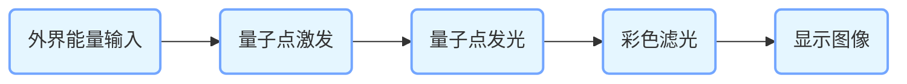

# 巴菲特 - 芒格的量子点显示技术投资：新一代显示产业的引领者

> 关键词：巴菲特-芒格、量子点显示技术、新一代显示产业、投资、技术原理、应用场景

> 摘要：本文聚焦于巴菲特 - 芒格对量子点显示技术的投资，深入剖析量子点显示技术作为新一代显示产业引领者的相关情况。首先介绍背景知识，包括目的、预期读者等；接着阐述核心概念与联系，涵盖量子点显示技术原理和架构；详细讲解核心算法原理及操作步骤，并给出数学模型和公式；通过项目实战展示代码案例；分析实际应用场景；推荐学习、开发工具及相关论文著作；最后总结未来发展趋势与挑战，解答常见问题并提供扩展阅读和参考资料，旨在全面解读这一投资背后的技术和产业价值。

## 1. 背景介绍 
### 1.1 目的和范围
本文旨在全面探讨巴菲特 - 芒格对量子点显示技术的投资行为及其背后的意义。我们将深入研究量子点显示技术的原理、应用、市场前景等方面，分析该投资对新一代显示产业的推动作用。范围涵盖量子点显示技术的基本概念、技术原理、算法实现、实际应用案例，以及与之相关的学习资源、开发工具和研究成果等。通过对这些内容的研究，我们试图揭示量子点显示技术在未来显示产业中的重要地位，以及巴菲特 - 芒格投资决策的战略眼光。

### 1.2 预期读者
本文预期读者包括对投资领域感兴趣的人士，尤其是关注科技产业投资的投资者；从事显示技术研究和开发的专业人员，他们可以从技术原理和应用案例中获取有价值的信息；对新一代显示产业发展趋势感兴趣的行业分析师和研究人员，以便他们更好地了解行业动态和市场前景；以及相关专业的学生，为他们提供深入学习量子点显示技术的参考资料。

### 1.3 文档结构概述
本文共分为十个部分。第一部分是背景介绍，阐述文章的目的、预期读者、文档结构概述和术语表；第二部分介绍核心概念与联系，包括量子点显示技术的原理和架构，并提供文本示意图和 Mermaid 流程图；第三部分详细讲解核心算法原理和具体操作步骤，通过 Python 源代码进行阐述；第四部分给出数学模型和公式，并进行详细讲解和举例说明；第五部分是项目实战，包括开发环境搭建、源代码详细实现和代码解读；第六部分分析实际应用场景；第七部分推荐学习、开发工具和相关论文著作；第八部分总结未来发展趋势与挑战；第九部分是附录，解答常见问题；第十部分提供扩展阅读和参考资料。

### 1.4 术语表
#### 1.4.1 核心术语定义
- **量子点显示技术**：是一种基于量子点材料的新型显示技术。量子点是一种纳米级的半导体颗粒，当受到光或电的激发时，会发出特定波长的光，其发光颜色可以通过改变量子点的尺寸来精确控制。
- **巴菲特 - 芒格投资**：指由沃伦·巴菲特（Warren Buffett）和查理·芒格（Charlie Munger）领导的伯克希尔·哈撒韦公司（Berkshire Hathaway）所进行的投资活动。他们以长期价值投资理念而闻名，注重投资具有可持续竞争优势和良好财务状况的企业。
- **新一代显示产业**：指区别于传统显示技术（如液晶显示、等离子显示）的新兴显示技术产业，包括量子点显示、有机发光二极管（OLED）显示、微型发光二极管（Micro - LED）显示等。这些技术具有更高的亮度、对比度、色域等性能优势。

#### 1.4.2 相关概念解释
- **量子限域效应**：当量子点的尺寸小于其激子玻尔半径时，电子和空穴的运动受到限制，导致其能级离散化。这种效应使得量子点的光学和电学性质与宏观材料有很大不同，是量子点显示技术能够精确控制发光颜色的基础。
- **色域**：指显示设备能够显示的颜色范围。色域越广，显示设备能够呈现的颜色就越丰富、越逼真。量子点显示技术具有较高的色域覆盖率，能够提供更加鲜艳、生动的色彩表现。

#### 1.4.3 缩略词列表
- **QLED**：量子点发光二极管（Quantum - dot Light - Emitting Diode），是量子点显示技术的一种应用形式。
- **OLED**：有机发光二极管（Organic Light - Emitting Diode），是另一种常见的新一代显示技术。
- **LCD**：液晶显示（Liquid Crystal Display），是传统的显示技术。

## 2. 核心概念与联系 
### 量子点显示技术原理
量子点显示技术的核心在于量子点材料的独特光学性质。量子点是由少数原子组成的纳米级半导体颗粒，其尺寸通常在 1 - 100 纳米之间。当量子点受到外界能量（如光或电）的激发时，电子会从低能级跃迁到高能级，形成激发态。当电子从高能级回到低能级时，会释放出特定波长的光，其发光颜色取决于量子点的尺寸。较小的量子点发出蓝光，中等尺寸的量子点发出绿光，较大的量子点发出红光。

### 架构示意图
下面是量子点显示技术的简单架构示意图：

```plaintext
外界能量源（光或电） --> 量子点层 --> 彩色滤光片 --> 显示面板
```

外界能量源（如背光源发出的光或电流）激发量子点层中的量子点，使其发出特定颜色的光。这些光经过彩色滤光片进一步过滤和调整，最终在显示面板上呈现出清晰、鲜艳的图像。

### Mermaid 流程图


这个流程图展示了量子点显示技术的基本工作流程。首先，外界能量输入激发量子点，使其发光。然后，发出的光经过彩色滤光片的过滤和调整，最终在显示设备上呈现出图像。

## 3. 核心算法原理 & 具体操作步骤 
### 核心算法原理
在量子点显示技术中，一个重要的算法原理是对量子点发光颜色的精确控制。这涉及到根据所需显示的颜色，计算出需要激发的量子点尺寸和数量。我们可以通过以下步骤来实现：

1. **颜色模型转换**：将需要显示的颜色从 RGB（红、绿、蓝）颜色模型转换为更适合计算的颜色模型，如 HSV（色相、饱和度、明度）颜色模型。
2. **量子点尺寸计算**：根据转换后的颜色信息，计算出能够发出该颜色光的量子点尺寸。这可以通过量子点的光学特性曲线来实现，该曲线描述了量子点尺寸与发光波长之间的关系。
3. **量子点数量计算**：根据所需显示的亮度和对比度，计算出需要激发的量子点数量。

### Python 源代码实现
```python
import numpy as np

# 颜色模型转换：RGB 到 HSV
def rgb_to_hsv(r, g, b):
    r, g, b = r / 255.0, g / 255.0, b / 255.0
    cmax = max(r, g, b)
    cmin = min(r, g, b)
    delta = cmax - cmin

    if delta == 0:
        h = 0
    elif cmax == r:
        h = (60 * (((g - b) / delta) % 6))
    elif cmax == g:
        h = (60 * (((b - r) / delta) + 2))
    else:
        h = (60 * (((r - g) / delta) + 4))

    if cmax == 0:
        s = 0
    else:
        s = (delta / cmax)

    v = cmax

    return h, s, v

# 量子点尺寸计算（简化模型）
def calculate_quantum_dot_size(h):
    # 这里使用一个简单的线性模型来模拟量子点尺寸与色相的关系
    # 实际应用中需要更复杂的光学特性曲线
    min_size = 1  # 最小量子点尺寸
    max_size = 10  # 最大量子点尺寸
    size = (h / 360) * (max_size - min_size) + min_size
    return size

# 量子点数量计算（简化模型）
def calculate_quantum_dot_number(v):
    # 这里使用一个简单的线性模型来模拟量子点数量与明度的关系
    min_number = 100  # 最小量子点数量
    max_number = 1000  # 最大量子点数量
    number = (v) * (max_number - min_number) + min_number
    return number

# 示例颜色
r = 255
g = 0
b = 0

# 颜色模型转换
h, s, v = rgb_to_hsv(r, g, b)

# 量子点尺寸计算
dot_size = calculate_quantum_dot_size(h)

# 量子点数量计算
dot_number = calculate_quantum_dot_number(v)

print(f"所需量子点尺寸: {dot_size} 纳米")
print(f"所需量子点数量: {dot_number} 个")
```

### 具体操作步骤
1. **输入颜色信息**：首先，我们需要输入需要显示的颜色的 RGB 值。在上述代码中，我们使用了一个示例颜色 `(255, 0, 0)`，表示红色。
2. **颜色模型转换**：调用 `rgb_to_hsv` 函数将 RGB 颜色转换为 HSV 颜色模型。这一步是为了方便后续的计算，因为 HSV 颜色模型更适合描述颜色的色相、饱和度和明度。
3. **量子点尺寸计算**：根据转换后的色相值，调用 `calculate_quantum_dot_size` 函数计算出能够发出该颜色光的量子点尺寸。
4. **量子点数量计算**：根据转换后的明度值，调用 `calculate_quantum_dot_number` 函数计算出需要激发的量子点数量。
5. **输出结果**：最后，将计算得到的量子点尺寸和数量输出。

## 4. 数学模型和公式 & 详细讲解 & 举例说明 
### 颜色模型转换公式
#### RGB 到 HSV 转换公式
设 RGB 颜色值分别为 $R$, $G$, $B$，且 $R,G,B\in[0,255]$。首先将其转换为归一化值 $r = \frac{R}{255}$, $g = \frac{G}{255}$, $b = \frac{B}{255}$。

- **计算最大值 $C_{max}$ 和最小值 $C_{min}$**
$$C_{max}=\max(r,g,b)$$
$$C_{min}=\min(r,g,b)$$

- **计算色相 $H$**
如果 $C_{max}=C_{min}$，则 $H = 0$；
如果 $C_{max}=r$，则 $H = 60\times\left(\frac{g - b}{C_{max}-C_{min}}\bmod 6\right)$；
如果 $C_{max}=g$，则 $H = 60\times\left(\frac{b - r}{C_{max}-C_{min}}+2\right)$；
如果 $C_{max}=b$，则 $H = 60\times\left(\frac{r - g}{C_{max}-C_{min}}+4\right)$。

- **计算饱和度 $S$**
如果 $C_{max}=0$，则 $S = 0$；否则，$S=\frac{C_{max}-C_{min}}{C_{max}}$。

- **计算明度 $V$**
$$V = C_{max}$$

#### 举例说明
假设我们有一个 RGB 颜色值 $(255, 0, 0)$。首先将其归一化：$r = 1$, $g = 0$, $b = 0$。

- 计算最大值和最小值：$C_{max}=1$, $C_{min}=0$。
- 计算色相：因为 $C_{max}=r$，所以 $H = 60\times\left(\frac{0 - 0}{1 - 0}\bmod 6\right)=0$。
- 计算饱和度：$S=\frac{1 - 0}{1}=1$。
- 计算明度：$V = 1$。

### 量子点尺寸计算模型
在实际应用中，量子点的发光波长 $\lambda$ 与量子点尺寸 $d$ 之间的关系可以通过实验测量得到一个光学特性曲线。为了简化计算，我们可以使用一个线性模型：

$$d = \frac{H}{360}(d_{max}-d_{min})+d_{min}$$

其中，$H$ 是色相值，$d_{min}$ 和 $d_{max}$ 分别是最小和最大量子点尺寸。

#### 举例说明
假设 $d_{min}=1$ 纳米，$d_{max}=10$ 纳米，$H = 0$。则量子点尺寸 $d=\frac{0}{360}(10 - 1)+1 = 1$ 纳米。

### 量子点数量计算模型
量子点数量 $N$ 与明度 $V$ 之间的关系可以使用一个线性模型：

$$N = V(N_{max}-N_{min})+N_{min}$$

其中，$N_{min}$ 和 $N_{max}$ 分别是最小和最大量子点数量。

#### 举例说明
假设 $N_{min}=100$ 个，$N_{max}=1000$ 个，$V = 1$。则量子点数量 $N = 1\times(1000 - 100)+100 = 1000$ 个。

## 5. 项目实战：代码实际案例和详细解释说明 
### 5.1  开发环境搭建
#### 安装 Python
首先，我们需要安装 Python 开发环境。可以从 Python 官方网站（https://www.python.org/downloads/）下载适合你操作系统的 Python 版本，并按照安装向导进行安装。

#### 安装必要的库
在本项目中，我们只使用了 Python 的内置库 `numpy`，因此可以使用以下命令安装：
```sh
pip install numpy
```

### 5.2  源代码详细实现和代码解读
```python
import numpy as np

# 颜色模型转换：RGB 到 HSV
def rgb_to_hsv(r, g, b):
    r, g, b = r / 255.0, g / 255.0, b / 255.0
    cmax = max(r, g, b)
    cmin = min(r, g, b)
    delta = cmax - cmin

    if delta == 0:
        h = 0
    elif cmax == r:
        h = (60 * (((g - b) / delta) % 6))
    elif cmax == g:
        h = (60 * (((b - r) / delta) + 2))
    else:
        h = (60 * (((r - g) / delta) + 4))

    if cmax == 0:
        s = 0
    else:
        s = (delta / cmax)

    v = cmax

    return h, s, v

# 量子点尺寸计算（简化模型）
def calculate_quantum_dot_size(h):
    # 这里使用一个简单的线性模型来模拟量子点尺寸与色相的关系
    # 实际应用中需要更复杂的光学特性曲线
    min_size = 1  # 最小量子点尺寸
    max_size = 10  # 最大量子点尺寸
    size = (h / 360) * (max_size - min_size) + min_size
    return size

# 量子点数量计算（简化模型）
def calculate_quantum_dot_number(v):
    # 这里使用一个简单的线性模型来模拟量子点数量与明度的关系
    min_number = 100  # 最小量子点数量
    max_number = 1000  # 最大量子点数量
    number = (v) * (max_number - min_number) + min_number
    return number

# 示例颜色
r = 255
g = 0
b = 0

# 颜色模型转换
h, s, v = rgb_to_hsv(r, g, b)

# 量子点尺寸计算
dot_size = calculate_quantum_dot_size(h)

# 量子点数量计算
dot_number = calculate_quantum_dot_number(v)

print(f"所需量子点尺寸: {dot_size} 纳米")
print(f"所需量子点数量: {dot_number} 个")
```

### 代码解读与分析
#### `rgb_to_hsv` 函数
这个函数的作用是将 RGB 颜色模型转换为 HSV 颜色模型。首先，将 RGB 值归一化到 $[0, 1]$ 范围。然后，计算最大值 $C_{max}$ 和最小值 $C_{min}$，并根据它们的差值计算色相 $H$、饱和度 $S$ 和明度 $V$。

#### `calculate_quantum_dot_size` 函数
该函数根据色相值 $H$ 计算量子点的尺寸。使用一个简单的线性模型，将色相值映射到量子点尺寸的范围内。

#### `calculate_quantum_dot_number` 函数
这个函数根据明度值 $V$ 计算需要激发的量子点数量。同样使用一个简单的线性模型，将明度值映射到量子点数量的范围内。

#### 主程序部分
在主程序中，我们定义了一个示例颜色 `(255, 0, 0)`，然后调用 `rgb_to_hsv` 函数将其转换为 HSV 颜色模型。接着，分别调用 `calculate_quantum_dot_size` 和 `calculate_quantum_dot_number` 函数计算量子点的尺寸和数量，并将结果输出。

## 6. 实际应用场景 
### 消费电子领域
#### 电视
量子点显示技术在电视领域具有广泛的应用。与传统的液晶电视相比，量子点电视具有更高的色域覆盖率、更高的亮度和对比度，能够呈现出更加鲜艳、逼真的色彩。例如，三星等品牌已经推出了多款量子点电视产品，受到了消费者的广泛关注。

#### 智能手机
随着消费者对手机显示效果的要求越来越高，量子点显示技术也逐渐应用于智能手机领域。量子点屏幕能够提供更加清晰、细腻的图像显示，同时具有更低的功耗，延长手机的续航时间。

### 专业显示领域
#### 医疗显示
在医疗领域，对显示设备的准确性和清晰度要求非常高。量子点显示技术能够提供高分辨率、高对比度的图像显示，有助于医生更准确地观察和诊断病情。例如，在医学影像诊断中，量子点显示器可以更清晰地显示X光、CT、MRI等影像。

#### 设计和影视制作
对于设计师和影视制作人员来说，准确的色彩还原是非常重要的。量子点显示技术的高色域和精准的色彩表现能够满足他们对色彩的严格要求，使他们能够更真实地呈现自己的作品。

### 汽车显示领域
#### 车载显示器
随着汽车智能化的发展，车载显示器的重要性越来越凸显。量子点显示技术可以应用于汽车仪表盘、中控显示屏等，提供更加清晰、生动的信息显示。同时，量子点显示技术具有较好的抗干扰能力和稳定性，能够适应汽车复杂的使用环境。

## 7. 工具和资源推荐
### 7.1 学习资源推荐
#### 7.1.1 书籍推荐
- 《量子点物理与器件》：本书详细介绍了量子点的物理性质、制备方法和应用，对于深入理解量子点显示技术的原理具有重要的参考价值。
- 《显示技术原理》：全面介绍了各种显示技术的原理和发展，包括量子点显示技术，适合初学者系统学习显示技术知识。

#### 7.1.2 在线课程
- Coursera 上的“Nanotechnology: A Maker's Course”：该课程涵盖了纳米技术的基础知识，包括量子点的相关内容，通过在线视频、作业和讨论等方式，帮助学习者深入了解量子点技术。
- edX 上的“Introduction to Display Technology”：这门课程介绍了各种显示技术的原理和应用，包括量子点显示技术，由专业的教授授课，内容丰富、系统。

#### 7.1.3 技术博客和网站
- IEEE Spectrum：这是电气和电子工程师协会（IEEE）的官方网站，提供了大量关于电子技术、显示技术等方面的最新研究成果和技术动态，其中也包括量子点显示技术的相关文章。
- Display Daily：专注于显示技术领域的新闻和分析，及时报道量子点显示技术的市场动态、产品发布等信息。

### 7.2 开发工具框架推荐
#### 7.2.1 IDE和编辑器
- PyCharm：是一款专门为 Python 开发设计的集成开发环境（IDE），具有强大的代码编辑、调试和分析功能，适合开发量子点显示技术相关的 Python 代码。
- Visual Studio Code：是一款轻量级的代码编辑器，支持多种编程语言，具有丰富的插件扩展功能，可以方便地进行代码开发和调试。

#### 7.2.2 调试和性能分析工具
- Py-Spy：是一个用于 Python 代码性能分析的工具，可以实时监控 Python 程序的运行状态，找出性能瓶颈，帮助优化代码。
- PDB：是 Python 内置的调试器，可以在代码中设置断点，逐步执行代码，查看变量的值和程序的执行流程，方便调试代码。

#### 7.2.3 相关框架和库
- NumPy：是 Python 中用于科学计算的基础库，提供了高效的数组操作和数学函数，在量子点显示技术的算法实现中经常会用到。
- Matplotlib：是 Python 中用于数据可视化的库，可以将量子点显示技术中的计算结果以图表的形式展示出来，方便分析和理解。

### 7.3 相关论文著作推荐
#### 7.3.1 经典论文
- “Colloidal Quantum Dots for Display and Lighting Applications”：该论文详细介绍了量子点在显示和照明领域的应用，对量子点显示技术的发展具有重要的指导意义。
- “Quantum - dot - based light - emitting diodes”：阐述了量子点发光二极管的原理和制备方法，是研究量子点显示技术的经典文献。

#### 7.3.2 最新研究成果
- 定期关注《Nature》、《Science》等顶级学术期刊，这些期刊经常发表关于量子点显示技术的最新研究成果，包括新的材料、制备方法和应用等方面。
- IEEE Transactions on Electron Devices 等专业期刊也会刊登量子点显示技术的前沿研究论文，反映该领域的最新动态。

#### 7.3.3 应用案例分析
- 可以参考一些行业报告和市场研究机构的分析报告，了解量子点显示技术在实际应用中的案例和效果。例如，市场研究公司 IDC、Omdia 等会发布关于显示技术市场的研究报告，其中包含量子点显示技术的应用案例和市场份额分析。

## 8. 总结：未来发展趋势与挑战
### 未来发展趋势
#### 技术创新
随着材料科学和纳米技术的不断发展，量子点显示技术将不断创新。未来可能会出现新型的量子点材料，具有更高的发光效率、更好的稳定性和更精确的颜色控制。同时，量子点显示技术与其他显示技术（如 OLED、Micro - LED）的融合也将成为发展趋势，以实现更高性能的显示效果。

#### 市场拓展
量子点显示技术在消费电子、专业显示、汽车显示等领域的应用将不断拓展。随着消费者对显示效果的要求越来越高，量子点显示产品的市场需求将持续增长。同时，随着技术的成熟和成本的降低，量子点显示技术有望在更多的领域得到应用，如智能穿戴设备、虚拟现实/增强现实设备等。

#### 产业升级
巴菲特 - 芒格的投资将推动量子点显示产业的升级和发展。一方面，投资将促进企业加大研发投入，提高技术水平和产品质量；另一方面，投资也将推动产业整合，形成更加完善的产业链，提高产业的竞争力。

### 挑战
#### 成本问题
目前，量子点显示技术的生产成本相对较高，这限制了其市场普及。未来需要通过技术创新和产业规模化来降低成本，提高产品的性价比。

#### 环境和安全问题
量子点材料中可能含有一些重金属元素，如镉等，这些元素对环境和人体健康可能存在一定的风险。因此，需要加强对量子点材料的环境和安全评估，开发环保型的量子点材料。

#### 竞争压力
量子点显示技术面临着来自其他显示技术（如 OLED、Micro - LED）的竞争压力。这些技术也在不断发展和创新，具有各自的优势。量子点显示技术需要不断提升自身的竞争力，以在市场竞争中占据一席之地。

## 9. 附录：常见问题与解答
### 问题 1：量子点显示技术与 OLED 显示技术有什么区别？
解答：量子点显示技术和 OLED 显示技术都是新一代显示技术，但它们有一些区别。量子点显示技术通常基于液晶显示技术，通过量子点材料来提高显示效果，具有高色域、高亮度等优点；而 OLED 显示技术是自发光显示技术，具有对比度高、响应速度快、可柔性显示等优点。在成本方面，量子点显示技术相对较低；在显示效果方面，OLED 在对比度和视角方面表现更好。

### 问题 2：量子点显示技术是否对眼睛有害？
解答：一般来说，量子点显示技术对眼睛是安全的。量子点显示技术能够提供更自然、更舒适的视觉体验，减少眼睛疲劳。不过，如果长时间盯着高亮度的显示屏幕，无论使用何种显示技术，都可能对眼睛造成一定的伤害。因此，在使用显示设备时，应注意合理用眼，避免长时间连续使用。

### 问题 3：巴菲特 - 芒格为什么会投资量子点显示技术？
解答：巴菲特 - 芒格以长期价值投资理念而闻名，他们投资量子点显示技术可能是基于以下考虑。首先，量子点显示技术具有广阔的市场前景，随着消费者对显示效果的要求不断提高，量子点显示产品的市场需求将持续增长。其次，量子点显示技术具有一定的技术优势，能够提供更高的色域、亮度和对比度，具有较强的竞争力。最后，他们可能看好相关企业的发展潜力，认为这些企业具有可持续的竞争优势和良好的财务状况。

## 10. 扩展阅读 & 参考资料
### 扩展阅读
- 《投资最重要的事》：虽然这本书主要讨论投资理念和策略，但可以帮助读者更好地理解巴菲特 - 芒格的投资决策过程。
- 《量子物理史话》：深入了解量子物理的基础知识，有助于更好地理解量子点显示技术的原理。

### 参考资料
- 各显示技术企业的官方网站，如三星、LG 等，获取关于量子点显示技术产品的详细信息。
- 行业报告和市场研究机构的分析报告，如 IDC、Omdia 等，了解量子点显示技术的市场动态和发展趋势。
- 学术期刊和会议论文，如《Nature》、《Science》、IEEE Transactions on Electron Devices 等，获取量子点显示技术的最新研究成果。