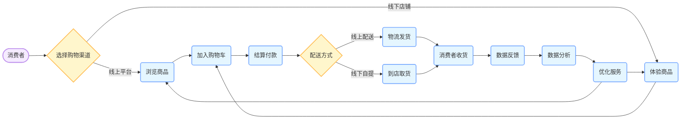

# 巴菲特 - 芒格看新零售：传统与创新的融合

> 关键词：巴菲特、芒格、新零售、传统零售、创新融合、零售模式、商业策略
> 摘要：本文深入探讨了巴菲特和芒格视角下新零售中传统与创新融合的问题。首先介绍了背景信息，包括目的、预期读者等内容。接着阐述了新零售的核心概念及其与传统零售的联系，剖析了核心算法原理和具体操作步骤，并用数学模型进行解释。通过项目实战案例展示了新零售的实际应用，分析了新零售在不同场景下的应用情况。推荐了相关的学习资源、开发工具和论文著作。最后总结了未来发展趋势与挑战，解答常见问题并提供扩展阅读资料，旨在为读者全面解读新零售中传统与创新融合的内涵及发展方向。

## 1. 背景介绍 
### 1.1 目的和范围
本文的目的在于深入探讨巴菲特和芒格对新零售的看法，分析在新零售领域中传统零售与创新元素是如何融合的。我们将研究新零售的核心概念、算法原理、数学模型，通过实际案例展示其应用，推荐相关的学习资源和工具，总结未来发展趋势与挑战。范围涵盖了新零售的各个方面，包括线上线下融合、数据驱动的运营、新技术的应用等，旨在为读者提供一个全面且深入的关于新零售中传统与创新融合的知识体系。

### 1.2 预期读者
本文预期读者包括零售行业从业者、创业者、投资者、对商业和科技感兴趣的学生以及研究人员。对于零售行业从业者，希望能帮助他们在实际工作中更好地理解和应用新零售的理念和方法；创业者可以从中获取创新思路和商业模式参考；投资者能借助本文对新零售项目进行更准确的评估；学生和研究人员则可以将其作为学习和研究新零售领域的重要资料。

### 1.3 文档结构概述
本文将按照以下结构展开：首先介绍新零售的核心概念与传统零售的联系，用示意图和流程图进行直观展示；接着阐述核心算法原理和具体操作步骤，通过 Python 代码详细说明；然后讲解数学模型和公式，并举例说明；之后进行项目实战，包括开发环境搭建、源代码实现和代码解读；分析新零售的实际应用场景；推荐相关的学习资源、开发工具和论文著作；最后总结未来发展趋势与挑战，解答常见问题并提供扩展阅读资料。

### 1.4 术语表
#### 1.4.1 核心术语定义
- **新零售**：是一种以消费者体验为中心，通过运用大数据、人工智能等先进技术手段，对商品的生产、流通与销售过程进行升级改造，进而重塑业态结构与生态圈，并对线上服务、线下体验以及现代物流进行深度融合的零售新模式。
- **传统零售**：指的是在互联网技术广泛应用之前，主要通过实体店铺进行商品销售的零售模式，包括超市、百货商店、专卖店等。
- **线上线下融合**：将线上的电子商务平台与线下的实体店铺相结合，实现商品信息、会员体系、营销活动等方面的互通，为消费者提供无缝的购物体验。
- **数据驱动**：在零售运营中，依靠收集、分析和利用各种数据（如消费者行为数据、销售数据、库存数据等）来指导决策和优化业务流程。

#### 1.4.2 相关概念解释
- **全渠道零售**：与新零售类似，强调通过多种渠道（如线上网站、移动应用、线下门店、社交媒体等）为消费者提供一致的购物体验，但新零售更注重技术的应用和商业模式的创新。
- **智慧零售**：利用物联网、人工智能等技术，实现零售场景的智能化，如智能货架、自助结算、智能客服等，提高运营效率和消费者体验。

#### 1.4.3 缩略词列表
- **O2O**：Online to Offline，即线上到线下，指将线上的营销、推广等活动与线下的消费场景相结合。
- **AI**：Artificial Intelligence，人工智能，在新零售中可用于消费者画像分析、智能推荐、库存管理等。
- **Big Data**：大数据，用于收集和分析海量的消费者和业务数据，为零售决策提供支持。

## 2. 核心概念与联系 
### 核心概念原理
新零售的核心原理在于打破传统零售线上线下的界限，实现两者的深度融合。传统零售以实体店铺为主要销售渠道，消费者在店铺内直接接触和购买商品。而新零售则借助互联网技术和大数据分析，将线上的便捷性和线下的体验感相结合。

线上平台可以提供丰富的商品信息、个性化的推荐和便捷的购物流程，同时收集消费者的行为数据。线下店铺则可以提供真实的商品体验、即时的购物服务和快速的物流配送。通过数据的共享和协同，线上线下可以实现商品库存、价格、促销活动等信息的同步，为消费者提供一致的购物体验。

### 架构的文本示意图
新零售的架构可以分为以下几个层次：
1. **数据层**：包括消费者数据（如基本信息、购买记录、浏览行为等）、商品数据（如库存、价格、属性等）和运营数据（如销售数据、营销活动效果等）。这些数据通过各种渠道收集，并存储在数据库中。
2. **技术层**：运用大数据分析、人工智能、物联网等技术对数据进行处理和挖掘。例如，通过机器学习算法进行消费者画像分析和商品推荐，利用物联网技术实现智能货架和库存管理。
3. **业务层**：包括线上电子商务平台、线下实体店铺、物流配送系统等。线上平台负责商品展示、销售和客户服务，线下店铺提供商品体验和自提点，物流配送系统确保商品及时准确地送达消费者手中。
4. **用户层**：即消费者，他们可以通过线上线下多种渠道进行购物，享受个性化的服务和便捷的购物体验。

### Mermaid 流程图


该流程图展示了新零售的购物流程。消费者可以选择线上平台或线下店铺进行购物，经过浏览、加入购物车、结算付款等环节后，根据配送方式选择线上配送或线下自提。购物完成后，数据反馈给系统进行分析，以优化服务，为消费者提供更好的购物体验。

## 3. 核心算法原理 & 具体操作步骤 
### 核心算法原理
在新零售中，一个重要的算法是基于用户行为的商品推荐算法。其原理是通过收集用户的历史行为数据（如浏览记录、购买记录、收藏记录等），分析用户的兴趣偏好，然后根据这些偏好为用户推荐相关的商品。

常用的推荐算法有基于内容的推荐、协同过滤推荐和混合推荐。基于内容的推荐是根据商品的属性（如类别、品牌、价格等）和用户的历史偏好进行匹配，为用户推荐属性相似的商品。协同过滤推荐则是根据用户之间的行为相似性，找到与目标用户兴趣相似的其他用户，然后将这些用户喜欢的商品推荐给目标用户。混合推荐则结合了基于内容的推荐和协同过滤推荐的优点，提高推荐的准确性。

### Python 代码详细阐述
以下是一个简单的基于协同过滤的商品推荐算法的 Python 实现：

```python
import numpy as np
from sklearn.metrics.pairwise import cosine_similarity

# 假设有 5 个用户和 6 个商品，用户的购买记录用矩阵表示
user_item_matrix = np.array([
    [1, 0, 1, 0, 0, 1],
    [0, 1, 0, 1, 1, 0],
    [1, 0, 1, 0, 0, 0],
    [0, 1, 0, 1, 0, 1],
    [1, 1, 0, 0, 1, 0]
])

# 计算用户之间的相似度
user_similarity = cosine_similarity(user_item_matrix)

# 定义一个函数来进行商品推荐
def recommend_items(user_id, top_n=3):
    # 获取目标用户的相似度向量
    target_user_similarity = user_similarity[user_id]
    # 找到与目标用户最相似的用户
    similar_users = np.argsort(target_user_similarity)[::-1][1:top_n + 1]
    # 初始化推荐商品列表
    recommended_items = []
    # 遍历相似用户的购买记录
    for user in similar_users:
        for item in range(user_item_matrix.shape[1]):
            if user_item_matrix[user][item] == 1 and user_item_matrix[user_id][item] == 0:
                recommended_items.append(item)
    # 去除重复的推荐商品
    recommended_items = list(set(recommended_items))
    return recommended_items

# 选择一个用户进行商品推荐
target_user_id = 0
recommended_items = recommend_items(target_user_id)
print(f"为用户 {target_user_id} 推荐的商品编号为：{recommended_items}")
```

### 具体操作步骤
1. **数据收集**：收集用户的历史行为数据，如浏览记录、购买记录等，并将其整理成用户 - 商品矩阵。
2. **相似度计算**：使用合适的相似度度量方法（如余弦相似度）计算用户之间的相似度。
3. **找到相似用户**：根据相似度排序，找到与目标用户最相似的其他用户。
4. **推荐商品**：遍历相似用户的购买记录，找出目标用户没有购买过的商品，并推荐给目标用户。

## 4. 数学模型和公式 & 详细讲解 & 举例说明 
### 数学模型和公式
#### 余弦相似度
在协同过滤推荐算法中，常用余弦相似度来计算用户之间的相似度。余弦相似度的公式为：

$$
\text{cosine}(u, v) = \frac{\mathbf{u} \cdot \mathbf{v}}{\|\mathbf{u}\| \|\mathbf{v}\|}
$$

其中，$\mathbf{u}$ 和 $\mathbf{v}$ 分别表示两个用户的向量表示，$\mathbf{u} \cdot \mathbf{v}$ 是向量的点积，$\|\mathbf{u}\|$ 和 $\|\mathbf{v}\|$ 分别是向量的模。

#### 推荐得分计算
在基于协同过滤的推荐中，为了给商品计算推荐得分，可以使用以下公式：

$$
\text{score}(i, u) = \sum_{v \in N(u)} \text{sim}(u, v) \cdot r_{v, i}
$$

其中，$\text{score}(i, u)$ 表示商品 $i$ 对用户 $u$ 的推荐得分，$N(u)$ 是与用户 $u$ 相似的用户集合，$\text{sim}(u, v)$ 是用户 $u$ 和用户 $v$ 之间的相似度，$r_{v, i}$ 是用户 $v$ 对商品 $i$ 的评分。

### 详细讲解
#### 余弦相似度
余弦相似度衡量的是两个向量之间的夹角余弦值，取值范围在 $[-1, 1]$ 之间。当余弦值为 1 时，表示两个向量完全相同；当余弦值为 -1 时，表示两个向量完全相反；当余弦值为 0 时，表示两个向量相互垂直。在协同过滤中，我们使用余弦相似度来衡量用户之间的兴趣相似度，余弦值越接近 1，表示两个用户的兴趣越相似。

#### 推荐得分计算
推荐得分计算的公式是通过将与目标用户相似的用户对商品的评分进行加权求和得到的。权重是用户之间的相似度，相似度越高，该用户的评分对推荐得分的影响越大。

### 举例说明
假设有三个用户 $A$、$B$、$C$ 和三个商品 $X$、$Y$、$Z$，用户的评分矩阵如下：

| 用户 | 商品 X | 商品 Y | 商品 Z |
| ---- | ---- | ---- | ---- |
| A | 5 | 3 | 0 |
| B | 4 | 2 | 1 |
| C | 0 | 1 | 5 |

首先计算用户 $A$ 和用户 $B$ 的余弦相似度：

$\mathbf{A} = [5, 3, 0]$，$\mathbf{B} = [4, 2, 1]$

$\|\mathbf{A}\| = \sqrt{5^2 + 3^2 + 0^2} = \sqrt{34}$

$\|\mathbf{B}\| = \sqrt{4^2 + 2^2 + 1^2} = \sqrt{21}$

$\mathbf{A} \cdot \mathbf{B} = 5 \times 4 + 3 \times 2 + 0 \times 1 = 26$

$\text{cosine}(A, B) = \frac{26}{\sqrt{34} \times \sqrt{21}} \approx 0.96$

假设我们要为用户 $A$ 推荐商品 $Z$，与用户 $A$ 相似的用户有 $B$ 和 $C$，用户 $B$ 对商品 $Z$ 的评分为 1，用户 $C$ 对商品 $Z$ 的评分为 5，用户 $A$ 和用户 $B$ 的相似度为 0.96，用户 $A$ 和用户 $C$ 的相似度为 0.2。则商品 $Z$ 对用户 $A$ 的推荐得分计算如下：

$\text{score}(Z, A) = 0.96 \times 1 + 0.2 \times 5 = 1.96$

## 5. 项目实战：代码实际案例和详细解释说明 
### 5.1 开发环境搭建
#### 操作系统
可以选择 Windows、Linux 或 macOS 操作系统，建议使用 Linux 系统，因为它在开发和部署方面具有更好的稳定性和兼容性。

#### 编程语言和框架
- **Python**：作为主要的编程语言，Python 具有丰富的库和工具，适合进行数据处理、算法实现和机器学习。
- **Flask**：一个轻量级的 Web 框架，用于搭建 Web 应用程序，方便实现用户界面和交互。
- **Pandas**：用于数据处理和分析，能够高效地处理和操作数据。
- **Scikit-learn**：提供了各种机器学习算法和工具，用于实现商品推荐算法。

#### 数据库
可以选择 MySQL 或 MongoDB 作为数据库，用于存储用户信息、商品信息和购买记录等数据。

#### 安装步骤
1. 安装 Python：从 Python 官方网站下载并安装 Python 3.x 版本。
2. 安装 Flask：使用 pip 命令安装 Flask：`pip install flask`
3. 安装 Pandas：`pip install pandas`
4. 安装 Scikit-learn：`pip install scikit-learn`
5. 安装数据库：根据选择的数据库，按照相应的官方文档进行安装和配置。

### 5.2 源代码详细实现和代码解读
以下是一个简单的基于 Flask 的新零售商品推荐系统的代码实现：

```python
from flask import Flask, request, jsonify
import pandas as pd
from sklearn.metrics.pairwise import cosine_similarity

app = Flask(__name__)

# 模拟用户 - 商品矩阵
user_item_matrix = pd.DataFrame({
    'user1': [1, 0, 1, 0, 0],
    'user2': [0, 1, 0, 1, 0],
    'user3': [1, 0, 0, 0, 1],
    'user4': [0, 0, 1, 0, 0],
    'user5': [0, 1, 0, 0, 0]
}, index=['item1', 'item2', 'item3', 'item4', 'item5'])

# 计算用户之间的相似度
user_similarity = cosine_similarity(user_item_matrix.T)

# 定义商品推荐函数
def recommend_items(user_id, top_n=3):
    target_user_index = user_item_matrix.columns.get_loc(user_id)
    target_user_similarity = user_similarity[target_user_index]
    similar_users_indices = target_user_similarity.argsort()[::-1][1:top_n + 1]
    similar_users = [user_item_matrix.columns[i] for i in similar_users_indices]
    recommended_items = []
    for user in similar_users:
        for item in user_item_matrix.index:
            if user_item_matrix.loc[item, user] == 1 and user_item_matrix.loc[item, user_id] == 0:
                recommended_items.append(item)
    recommended_items = list(set(recommended_items))
    return recommended_items

@app.route('/recommend', methods=['GET'])
def get_recommendations():
    user_id = request.args.get('user_id')
    if user_id not in user_item_matrix.columns:
        return jsonify({'error': 'User not found'}), 404
    recommended_items = recommend_items(user_id)
    return jsonify({'recommended_items': recommended_items})

if __name__ == '__main__':
    app.run(debug=True)
```

### 代码解读与分析
1. **导入必要的库**：导入 Flask、Pandas 和 Scikit-learn 等库，用于搭建 Web 应用、数据处理和相似度计算。
2. **模拟用户 - 商品矩阵**：使用 Pandas 的 DataFrame 模拟用户 - 商品矩阵，存储用户的购买记录。
3. **计算用户之间的相似度**：使用 Scikit-learn 的 `cosine_similarity` 函数计算用户之间的余弦相似度。
4. **定义商品推荐函数**：根据用户的 ID，找到与该用户最相似的其他用户，然后根据相似用户的购买记录推荐商品。
5. **定义 API 接口**：使用 Flask 定义一个 `/recommend` 的 API 接口，接收用户 ID 作为参数，返回推荐的商品列表。
6. **启动应用程序**：使用 `app.run(debug=True)` 启动 Flask 应用程序，开启调试模式。

### 代码运行和测试
1. 保存上述代码为 `app.py`。
2. 在终端中运行 `python app.py` 启动应用程序。
3. 打开浏览器或使用工具（如 Postman）访问 `http://127.0.0.1:5000/recommend?user_id=user1`，即可获取为用户 `user1` 推荐的商品列表。

## 6. 实际应用场景 
### 线上电商平台
在线上电商平台中，新零售的应用非常广泛。通过大数据分析和人工智能算法，电商平台可以为用户提供个性化的商品推荐，提高用户的购物体验和购买转化率。例如，淘宝和京东等电商平台会根据用户的浏览历史、购买记录、搜索关键词等信息，为用户推荐相关的商品。同时，电商平台还可以实现线上线下的融合，用户可以在线上下单，选择到线下门店自提商品，或者享受线下门店的售后服务。

### 线下实体店铺
线下实体店铺也可以通过引入新零售的理念和技术，提升自身的竞争力。例如，一些超市和便利店会安装智能货架和自助结算设备，实现商品的自动补货和快速结算。同时，店铺可以通过收集消费者的行为数据，了解消费者的需求和偏好，优化商品陈列和营销策略。此外，线下店铺还可以与线上平台合作，开展线上线下一体化的营销活动，吸引更多的消费者。

### 生鲜零售
生鲜零售是新零售的一个重要应用场景。由于生鲜产品的特殊性，对物流配送和保鲜要求较高。新零售模式下的生鲜零售企业通过建立冷链物流体系和前置仓模式，实现了生鲜产品的快速配送。例如，盒马鲜生通过线上线下融合的模式，为消费者提供新鲜的生鲜产品和餐饮服务。消费者可以在盒马鲜生的线上平台下单，也可以到线下门店选购商品，享受 30 分钟送达的服务。

### 无人零售
无人零售是新零售的一种创新模式，通过使用人工智能、物联网等技术，实现了无人值守的购物体验。无人零售店铺通常配备了智能货架、摄像头、传感器等设备，消费者可以通过手机扫码进入店铺，自主选购商品，然后通过手机支付完成结算。无人零售模式降低了人力成本，提高了运营效率，同时也为消费者提供了更加便捷的购物方式。例如，便利蜂的无人便利店在一些城市已经得到了广泛的应用。

## 7. 工具和资源推荐
### 7.1 学习资源推荐
#### 7.1.1 书籍推荐
- 《新零售：低价高效的数据赋能之路》：作者是阿里研究院，本书深入探讨了新零售的概念、模式和发展趋势，结合阿里巴巴的实践案例，为读者提供了全面的新零售知识体系。
- 《零售的哲学》：作者是铃木敏文，这本书以 7 - 11 便利店的发展历程为例，阐述了零售行业的经营理念和策略，对理解新零售的本质和运营有很大的帮助。
- 《人工智能时代的商业新趋势》：介绍了人工智能在商业领域的应用，包括新零售中的数据挖掘、智能推荐等技术，适合对技术和商业结合感兴趣的读者。

#### 7.1.2 在线课程
- Coursera 上的 “Retail Analytics” 课程：该课程由美国知名大学的教授授课，涵盖了零售数据分析的各个方面，包括数据收集、清洗、分析和可视化等，帮助学习者掌握零售数据分析的方法和工具。
- edX 上的 “New Retail: Transforming the Retail Industry” 课程：讲解了新零售的概念、技术和商业模式，通过实际案例分析，让学习者了解新零售的发展趋势和应用场景。
- 阿里云大学的 “新零售实战营” 课程：结合阿里云的技术和解决方案，介绍了新零售的实践经验和操作方法，适合从事新零售相关工作的人员学习。

#### 7.1.3 技术博客和网站
- 阿里研究院官网：发布了大量关于新零售的研究报告和行业动态，是了解新零售前沿信息的重要渠道。
- 亿邦动力网：专注于电商和零售行业的资讯和研究，提供了丰富的新零售案例和分析文章。
- 36氪：报道了众多科技和商业领域的创新项目和趋势，其中包括新零售领域的最新动态和创业公司介绍。

### 7.2 开发工具框架推荐
#### 7.2.1 IDE和编辑器
- PyCharm：是一款专业的 Python 集成开发环境，提供了丰富的代码编辑、调试和部署功能，适合开发新零售相关的 Python 项目。
- Visual Studio Code：是一款轻量级的代码编辑器，支持多种编程语言和插件扩展，具有良好的代码编辑体验和团队协作功能。
- Jupyter Notebook：是一个交互式的开发环境，适合进行数据探索、分析和可视化，常用于新零售中的数据分析和机器学习任务。

#### 7.2.2 调试和性能分析工具
- Flask Debugtoolbar：是 Flask 框架的一个调试工具，提供了详细的请求信息、性能分析和 SQL 查询分析等功能，方便开发者调试和优化 Flask 应用程序。
- Py-Spy：是一个用于分析 Python 程序性能的工具，可以实时监控程序的 CPU 使用率、函数调用时间等信息，帮助开发者找出性能瓶颈。
- Chrome DevTools：是 Chrome 浏览器自带的开发者工具，提供了网络分析、性能分析、调试等功能，适合调试 Web 应用程序。

#### 7.2.3 相关框架和库
- TensorFlow：是一个开源的机器学习框架，提供了丰富的深度学习模型和工具，可用于新零售中的图像识别、语音识别、智能推荐等任务。
- PyTorch：也是一个流行的深度学习框架，具有简洁的 API 和高效的计算性能，广泛应用于学术界和工业界的机器学习研究和开发。
- Django：是一个功能强大的 Python Web 框架，提供了丰富的组件和工具，适合开发大型的新零售 Web 应用程序。

### 7.3 相关论文著作推荐
#### 7.3.1 经典论文
- “Amazon.com Recommendations: Item-to-Item Collaborative Filtering”：这篇论文介绍了亚马逊的基于物品的协同过滤推荐算法，是协同过滤推荐领域的经典之作，对新零售中的商品推荐算法有重要的参考价值。
- “Deep Learning for Content-Based Image Retrieval: A Comprehensive Study”：探讨了深度学习在基于内容的图像检索中的应用，可用于新零售中的商品图像搜索和推荐。
- “The Long Tail: Why the Future of Business Is Selling Less of More”：提出了 “长尾理论”，对理解新零售中的商品销售策略和市场结构有很大的启发。

#### 7.3.2 最新研究成果
- 近年来，关于新零售的研究主要集中在人工智能、大数据、物联网等技术在零售行业的应用。例如，一些研究探讨了如何利用深度学习算法提高商品推荐的准确性，如何通过物联网技术实现供应链的智能化管理等。可以通过学术数据库（如 IEEE Xplore、ACM Digital Library 等）搜索相关的最新研究论文。

#### 7.3.3 应用案例分析
- 可以参考一些知名企业的新零售应用案例分析，如阿里巴巴的盒马鲜生、腾讯的智慧零售解决方案、苏宁的线上线下融合模式等。这些案例分析通常会详细介绍企业的商业模式、技术应用和运营策略，对实际项目的开展有很大的借鉴意义。

## 8. 总结：未来发展趋势与挑战
### 未来发展趋势
#### 技术创新驱动
随着人工智能、物联网、区块链等技术的不断发展，新零售将迎来更多的技术创新。例如，人工智能将在商品推荐、客户服务、供应链管理等方面发挥更加重要的作用；物联网技术将实现商品的实时监控和智能补货；区块链技术将提高供应链的透明度和可信度。

#### 全渠道融合加深
未来，线上线下的融合将更加深入，消费者可以在不同的渠道之间自由切换，享受无缝的购物体验。例如，消费者可以在线上浏览商品，然后到线下门店体验和购买；也可以在线下门店试穿商品，然后在线上下单购买。同时，全渠道的营销和服务也将更加个性化和精准化。

#### 绿色可持续发展
消费者对环保和可持续发展的关注度越来越高，未来新零售将更加注重绿色可持续发展。例如，零售企业将采用更加环保的包装材料，推广绿色消费理念，减少能源消耗和环境污染。

#### 社交化和社区化
社交网络和社区平台在消费者购物决策中扮演着越来越重要的角色。未来新零售将与社交化和社区化相结合，通过社交平台进行商品推广和营销，建立消费者社区，增强消费者之间的互动和分享。

### 挑战
#### 数据安全和隐私保护
新零售依赖大量的消费者数据进行运营和决策，数据安全和隐私保护成为了一个重要的挑战。零售企业需要采取有效的措施来保护消费者的数据安全，防止数据泄露和滥用。

#### 技术应用成本
引入新技术需要投入大量的资金和人力，对于一些小型零售企业来说，技术应用成本可能是一个难以承受的负担。因此，如何降低技术应用成本，提高技术应用的性价比，是新零售发展面临的一个挑战。

#### 人才短缺
新零售的发展需要具备跨学科知识和技能的人才，如数据分析、人工智能、市场营销等。目前，市场上这类人才相对短缺，如何培养和吸引优秀的人才，是零售企业面临的一个重要问题。

#### 传统零售转型困难
传统零售企业在向新零售转型的过程中，面临着组织结构、运营模式、技术能力等方面的挑战。如何顺利实现转型，是传统零售企业需要解决的一个关键问题。

## 9. 附录：常见问题与解答
### 1. 新零售与传统零售的区别是什么？
新零售与传统零售的主要区别在于融合了线上线下渠道、运用了先进的技术手段和强调数据驱动的运营。传统零售主要依靠实体店铺进行销售，而新零售通过线上平台和线下门店的结合，为消费者提供更加便捷和个性化的购物体验。同时，新零售利用大数据、人工智能等技术对商品的生产、流通和销售过程进行优化，提高运营效率和决策的准确性。

### 2. 新零售需要哪些技术支持？
新零售需要多种技术支持，包括大数据分析、人工智能、物联网、区块链等。大数据分析用于收集和分析消费者的行为数据，为精准营销和商品推荐提供支持；人工智能用于实现智能客服、图像识别、预测分析等功能；物联网技术用于实现商品的实时监控和智能补货；区块链技术用于提高供应链的透明度和可信度。

### 3. 如何衡量新零售项目的成功？
可以从多个方面衡量新零售项目的成功，如销售额增长、客户满意度提高、运营成本降低、市场份额扩大等。同时，还可以关注一些关键指标，如客户转化率、复购率、客单价等。此外，技术应用的效果和创新能力也是衡量新零售项目成功的重要因素。

### 4. 传统零售企业如何向新零售转型？
传统零售企业向新零售转型可以从以下几个方面入手：首先，建立线上渠道，开展电子商务业务；其次，引入先进的技术手段，如大数据分析、人工智能等，优化运营流程和决策；然后，加强线上线下的融合，实现商品信息、会员体系、营销活动等方面的互通；最后，培养和吸引具备新零售知识和技能的人才，推动企业的转型发展。

### 5. 新零售中的数据安全如何保障？
保障新零售中的数据安全可以采取以下措施：首先，建立完善的数据安全管理制度，明确数据的使用和访问权限；其次，采用先进的技术手段，如数据加密、访问控制、防火墙等，保护数据的安全；然后，加强员工的安全意识培训，防止内部人员泄露数据；最后，定期进行数据安全评估和审计，及时发现和解决安全隐患。

## 10. 扩展阅读 & 参考资料
### 扩展阅读
- 《第四次零售革命》：作者是刘强东和杜爽，本书探讨了零售行业的发展趋势和变革方向，对理解新零售的未来发展有很大的帮助。
- 《智能商业》：作者是曾鸣，介绍了智能商业的概念和模式，以及如何利用互联网和大数据实现商业的智能化升级，与新零售的发展密切相关。
- 《未来呼啸而来》：探讨了科技发展对社会和商业的影响，包括人工智能、物联网、区块链等技术在零售行业的应用前景，为读者提供了更广阔的视野。

### 参考资料
- 阿里研究院的相关研究报告，如《新零售研究报告》《中国便利店发展报告》等。
- 各大电商平台和零售企业的官方网站和新闻稿，了解他们在新零售领域的实践和创新。
- 学术期刊和会议论文，如《Journal of Retailing》《International Journal of Retail & Distribution Management》等，获取最新的研究成果和学术观点。

以上就是关于“巴菲特 - 芒格看新零售：传统与创新的融合”的详细内容，希望对读者有所帮助。通过本文的介绍，读者可以全面了解新零售的核心概念、算法原理、实际应用和未来发展趋势，为在零售行业的实践和研究提供参考。