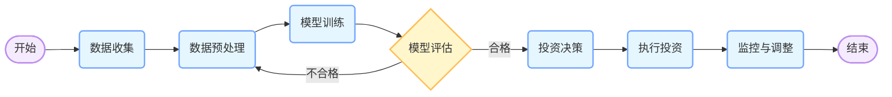

# 巴菲特如何看待人工智能在投资中的应用

> 关键词：巴菲特、人工智能、投资应用、价值投资、市场分析

> 摘要：本文深入探讨了巴菲特对人工智能在投资中应用的看法。首先介绍了相关背景，包括目的范围、预期读者等。接着阐述了人工智能和投资的核心概念及联系，分析了人工智能在投资中应用的核心算法原理和具体操作步骤，并用数学模型和公式进行详细讲解。通过项目实战案例展示了人工智能在投资中的实际运用，探讨了其实际应用场景。还推荐了相关的学习资源、开发工具和论文著作。最后总结了人工智能在投资领域的未来发展趋势与挑战，解答了常见问题并提供了扩展阅读和参考资料，旨在全面剖析巴菲特观点下人工智能在投资中的应用。

## 1. 背景介绍 
### 1.1 目的和范围
本文的目的在于深入探究巴菲特对人工智能在投资领域应用的观点，并全面分析人工智能在投资过程中所起到的作用和面临的挑战。我们将范围限定在投资领域，着重探讨人工智能在市场分析、投资决策、风险评估等方面的应用，同时结合巴菲特一贯秉持的价值投资理念，分析人工智能与传统投资方法的融合与冲突。

### 1.2 预期读者
预期读者主要包括投资领域的专业人士，如基金经理、投资顾问等，他们希望通过了解巴菲特的观点和人工智能的应用，优化自己的投资策略。同时，也面向对投资和人工智能感兴趣的业余投资者，帮助他们更好地理解投资市场的新趋势。此外，计算机科学领域中关注人工智能在金融领域应用的研究者和开发者也能从本文中获得有价值的信息。

### 1.3 文档结构概述
本文将按照以下结构展开：首先介绍相关背景知识，包括目的、读者群体和文档结构等。接着阐述人工智能和投资的核心概念以及它们之间的联系，并通过示意图和流程图进行展示。然后详细讲解人工智能在投资中应用的核心算法原理和具体操作步骤，同时运用数学模型和公式进行分析。通过项目实战案例，展示人工智能在投资中的实际应用过程和效果。之后探讨人工智能在投资中的实际应用场景。再推荐相关的学习资源、开发工具和论文著作。最后总结人工智能在投资领域的未来发展趋势与挑战，解答常见问题并提供扩展阅读和参考资料。

### 1.4 术语表
#### 1.4.1 核心术语定义
- **人工智能（Artificial Intelligence）**：是指让计算机系统能够模拟人类智能的一系列技术和方法，包括机器学习、深度学习、自然语言处理等，使计算机能够完成需要人类智能才能完成的任务。
- **价值投资（Value Investing）**：由本杰明·格雷厄姆（Benjamin Graham）提出，巴菲特是其坚定的践行者。价值投资强调通过分析公司的基本面，如财务状况、盈利能力、竞争优势等，寻找被市场低估的股票，并长期持有。
- **机器学习（Machine Learning）**：是人工智能的一个分支，它让计算机通过数据学习模式和规律，而无需明确的编程指令。常见的机器学习算法包括决策树、支持向量机、神经网络等。
- **深度学习（Deep Learning）**：是机器学习的一种特殊形式，基于人工神经网络，尤其是深度神经网络，能够自动从大量数据中学习复杂的模式和特征。

#### 1.4.2 相关概念解释
- **市场效率假说（Efficient Market Hypothesis）**：该假说认为金融市场中的资产价格已经反映了所有可用的信息，因此投资者很难通过分析历史数据或其他公开信息来获得超额收益。
- **量化投资（Quantitative Investing）**：利用数学模型和计算机算法进行投资决策的方法，通过对大量数据的分析和处理，寻找投资机会并进行资产配置。

#### 1.4.3 缩略词列表
- **AI**：Artificial Intelligence（人工智能）
- **ML**：Machine Learning（机器学习）
- **DL**：Deep Learning（深度学习）
- **EMH**：Efficient Market Hypothesis（市场效率假说）

## 2. 核心概念与联系 
### 核心概念原理
#### 人工智能原理
人工智能的核心原理是模拟人类的智能行为，通过数据驱动的方式让计算机系统学习和决策。机器学习是实现人工智能的重要手段，它通过让计算机从数据中学习模式和规律，从而对未知数据进行预测和分类。深度学习则是机器学习的高级形式，它利用多层神经网络自动提取数据中的复杂特征，在图像识别、自然语言处理等领域取得了巨大的成功。

#### 投资原理
投资的核心原理是通过合理的资产配置，在风险和收益之间寻求平衡。价值投资强调寻找被市场低估的资产，通过长期持有来获得资产价值的增长。投资者需要对公司的基本面进行深入分析，包括财务报表、行业前景、管理团队等，以评估公司的内在价值。

### 架构的文本示意图
```plaintext
投资领域
├── 传统投资方法
│   ├── 基本面分析
│   │   ├── 财务报表分析
│   │   ├── 行业研究
│   │   └── 管理层评估
│   └── 技术分析
│       ├── 价格走势分析
│       └── 成交量分析
├── 人工智能应用
│   ├── 数据收集
│   │   ├── 市场数据
│   │   ├── 公司财务数据
│   │   └── 新闻资讯
│   ├── 数据预处理
│   │   ├── 清洗
│   │   ├── 归一化
│   │   └── 特征提取
│   ├── 模型训练
│   │   ├── 机器学习算法
│   │   │   ├── 决策树
│   │   │   ├── 支持向量机
│   │   │   └── 随机森林
│   │   └── 深度学习算法
│   │       ├── 神经网络
│   │       └── 循环神经网络
│   └── 投资决策
│       ├── 股票筛选
│       ├── 资产配置
│       └── 风险评估
```

### Mermaid 流程图


## 3. 核心算法原理 & 具体操作步骤 
### 核心算法原理
#### 线性回归算法
线性回归是一种基本的机器学习算法，用于建立自变量和因变量之间的线性关系。在投资领域，线性回归可以用于预测股票价格、分析公司财务指标之间的关系等。其数学模型可以表示为：
$$y = \beta_0 + \beta_1x_1 + \beta_2x_2 + \cdots + \beta_nx_n + \epsilon$$
其中，$y$ 是因变量，$x_1, x_2, \cdots, x_n$ 是自变量，$\beta_0, \beta_1, \cdots, \beta_n$ 是回归系数，$\epsilon$ 是误差项。

#### 决策树算法
决策树是一种基于树结构进行决策的算法，每个内部节点表示一个属性上的测试，每个分支表示一个测试输出，每个叶节点表示一个类别或值。在投资中，决策树可以用于股票筛选、风险评估等。决策树的构建过程是通过递归地选择最优属性进行划分，直到满足终止条件。

#### 神经网络算法
神经网络是一种模仿人类神经系统的计算模型，由大量的神经元组成。在深度学习中，神经网络通常具有多层结构，能够自动学习数据中的复杂特征。在投资领域，神经网络可以用于预测股票价格走势、分析市场情绪等。

### 具体操作步骤
#### 数据收集
首先需要收集与投资相关的数据，包括市场数据（如股票价格、成交量等）、公司财务数据（如营业收入、净利润等）、新闻资讯等。可以通过金融数据提供商、公司年报、新闻网站等渠道获取数据。

#### 数据预处理
收集到的数据可能存在缺失值、异常值等问题，需要进行数据预处理。具体步骤包括：
- **数据清洗**：去除缺失值和异常值。
- **归一化**：将数据缩放到相同的尺度，避免某些特征对模型的影响过大。
- **特征提取**：从原始数据中提取有价值的特征，如计算技术指标、构建文本特征等。

#### 模型训练
选择合适的算法进行模型训练。以线性回归为例，Python 代码如下：
```python
import numpy as np
from sklearn.linear_model import LinearRegression

# 假设我们有一些自变量 X 和因变量 y
X = np.array([[1], [2], [3], [4], [5]])
y = np.array([2, 4, 6, 8, 10])

# 创建线性回归模型
model = LinearRegression()

# 训练模型
model.fit(X, y)

# 预测新数据
new_X = np.array([[6]])
prediction = model.predict(new_X)
print("预测结果:", prediction)
```
#### 模型评估
使用测试数据对训练好的模型进行评估，常用的评估指标包括均方误差（MSE）、决定系数（$R^2$）等。根据评估结果，可以对模型进行调整和优化。

#### 投资决策
根据模型的预测结果，进行投资决策，如选择合适的股票进行投资、确定资产配置比例等。

## 4. 数学模型和公式 & 详细讲解 & 举例说明 
### 线性回归模型
#### 数学公式
线性回归模型的一般形式为：
$$y = \beta_0 + \beta_1x_1 + \beta_2x_2 + \cdots + \beta_nx_n + \epsilon$$
其中，$y$ 是因变量，$x_1, x_2, \cdots, x_n$ 是自变量，$\beta_0, \beta_1, \cdots, \beta_n$ 是回归系数，$\epsilon$ 是误差项。回归系数可以通过最小二乘法来估计，即最小化误差平方和：
$$\min_{\beta_0, \beta_1, \cdots, \beta_n} \sum_{i=1}^{m} (y_i - (\beta_0 + \beta_1x_{i1} + \beta_2x_{i2} + \cdots + \beta_nx_{in}))^2$$
其中，$m$ 是样本数量。

#### 详细讲解
线性回归模型假设自变量和因变量之间存在线性关系，通过求解回归系数来确定这种关系。回归系数表示自变量对因变量的影响程度，正的系数表示正相关，负的系数表示负相关。误差项 $\epsilon$ 表示模型无法解释的部分，通常假设其服从均值为 0 的正态分布。

#### 举例说明
假设我们要预测某公司的股票价格 $y$ 与公司的营业收入 $x_1$ 和净利润 $x_2$ 之间的关系。我们收集了 10 个样本数据，如下表所示：

| 样本编号 | 营业收入 $x_1$ | 净利润 $x_2$ | 股票价格 $y$ |
|----------|----------------|--------------|--------------|
| 1        | 100            | 10           | 20           |
| 2        | 120            | 12           | 22           |
| 3        | 130            | 13           | 23           |
| 4        | 150            | 15           | 25           |
| 5        | 160            | 16           | 26           |
| 6        | 180            | 18           | 28           |
| 7        | 200            | 20           | 30           |
| 8        | 220            | 22           | 32           |
| 9        | 230            | 23           | 33           |
| 10       | 250            | 25           | 35           |

使用 Python 代码进行线性回归分析：
```python
import numpy as np
from sklearn.linear_model import LinearRegression

# 自变量
X = np.array([[100, 10], [120, 12], [130, 13], [150, 15], [160, 16],
              [180, 18], [200, 20], [220, 22], [230, 23], [250, 25]])
# 因变量
y = np.array([20, 22, 23, 25, 26, 28, 30, 32, 33, 35])

# 创建线性回归模型
model = LinearRegression()

# 训练模型
model.fit(X, y)

# 回归系数
print("回归系数:", model.coef_)
print("截距:", model.intercept_)

# 预测新数据
new_X = np.array([[260, 26]])
prediction = model.predict(new_X)
print("预测结果:", prediction)
```

### 逻辑回归模型
#### 数学公式
逻辑回归用于处理二分类问题，其输出是一个概率值。逻辑回归的数学模型可以表示为：
$$P(y = 1|x) = \frac{1}{1 + e^{-(\beta_0 + \beta_1x_1 + \beta_2x_2 + \cdots + \beta_nx_n)}}$$
其中，$P(y = 1|x)$ 表示在给定自变量 $x$ 的情况下，因变量 $y$ 为 1 的概率。

#### 详细讲解
逻辑回归通过将线性回归的输出通过逻辑函数（也称为 sigmoid 函数）进行转换，将输出值映射到 [0, 1] 区间，从而得到一个概率值。逻辑回归的目标是找到一组回归系数，使得模型对训练数据的预测概率最大。

#### 举例说明
假设我们要根据某公司的财务指标预测该公司是否会破产（$y = 1$ 表示破产，$y = 0$ 表示不破产）。我们收集了 20 个样本数据，使用 Python 代码进行逻辑回归分析：
```python
import numpy as np
from sklearn.linear_model import LogisticRegression

# 自变量
X = np.random.rand(20, 3)
# 因变量
y = np.random.randint(0, 2, 20)

# 创建逻辑回归模型
model = LogisticRegression()

# 训练模型
model.fit(X, y)

# 预测新数据
new_X = np.random.rand(1, 3)
prediction = model.predict(new_X)
print("预测结果:", prediction)
```

## 5. 项目实战：代码实际案例和详细解释说明 
### 5.1  开发环境搭建
#### 安装 Python
首先需要安装 Python 环境，建议使用 Python 3.7 及以上版本。可以从 Python 官方网站（https://www.python.org/downloads/）下载安装包进行安装。

#### 安装必要的库
在投资项目中，常用的库包括 `pandas`、`numpy`、`scikit-learn`、`tensorflow` 等。可以使用 `pip` 命令进行安装：
```sh
pip install pandas numpy scikit-learn tensorflow
```

### 5.2  源代码详细实现和代码解读
#### 股票价格预测项目
以下是一个使用线性回归模型预测股票价格的示例代码：
```python
import pandas as pd
import numpy as np
from sklearn.linear_model import LinearRegression
from sklearn.model_selection import train_test_split
import matplotlib.pyplot as plt

# 读取股票数据
data = pd.read_csv('stock_data.csv')

# 提取特征和标签
X = data[['Open', 'High', 'Low', 'Volume']].values
y = data['Close'].values

# 划分训练集和测试集
X_train, X_test, y_train, y_test = train_test_split(X, y, test_size=0.2, random_state=42)

# 创建线性回归模型
model = LinearRegression()

# 训练模型
model.fit(X_train, y_train)

# 预测测试集数据
y_pred = model.predict(X_test)

# 绘制预测结果和真实结果的对比图
plt.plot(y_test, label='True Values')
plt.plot(y_pred, label='Predicted Values')
plt.xlabel('Samples')
plt.ylabel('Stock Price')
plt.title('Stock Price Prediction')
plt.legend()
plt.show()
```

#### 代码解读
1. **数据读取**：使用 `pandas` 库的 `read_csv` 函数读取股票数据文件。
2. **特征提取**：从数据中提取开盘价、最高价、最低价和成交量作为特征，收盘价作为标签。
3. **数据集划分**：使用 `train_test_split` 函数将数据集划分为训练集和测试集，测试集占比为 20%。
4. **模型创建和训练**：创建线性回归模型，并使用训练集数据进行训练。
5. **预测和可视化**：使用训练好的模型对测试集数据进行预测，并使用 `matplotlib` 库绘制预测结果和真实结果的对比图。

### 5.3  代码解读与分析
#### 优点
- **简单易懂**：线性回归模型是一种基本的机器学习模型，易于理解和实现。
- **可解释性强**：回归系数可以解释自变量对因变量的影响程度，便于投资者进行决策。

#### 缺点
- **线性假设**：线性回归模型假设自变量和因变量之间存在线性关系，对于复杂的非线性关系可能无法很好地拟合。
- **容易过拟合**：如果特征过多或模型过于复杂，可能会导致过拟合，即在训练集上表现良好，但在测试集上表现不佳。

## 6. 实际应用场景 
### 市场分析
人工智能可以对大量的市场数据进行分析，包括股票价格、成交量、宏观经济数据等，挖掘数据中的潜在规律和趋势。例如，通过分析历史数据，预测股票价格的走势，帮助投资者制定投资策略。

### 投资决策
人工智能可以根据投资者的风险偏好、投资目标等因素，为投资者提供个性化的投资建议。例如，使用机器学习算法对股票进行筛选，选择具有潜力的股票进行投资。

### 风险评估
人工智能可以对投资组合的风险进行评估，识别潜在的风险因素。例如，通过分析市场波动、行业竞争等因素，评估投资组合的风险水平，并提供相应的风险控制建议。

### 情绪分析
人工智能可以对新闻资讯、社交媒体等文本数据进行情绪分析，了解市场参与者的情绪和预期。例如，通过分析新闻报道中的情感倾向，判断市场的乐观或悲观情绪，为投资决策提供参考。

## 7. 工具和资源推荐
### 7.1 学习资源推荐
#### 7.1.1 书籍推荐
- 《Python 数据分析实战》：介绍了使用 Python 进行数据分析的基本方法和技巧，包括数据清洗、可视化、机器学习等。
- 《机器学习实战》：通过实际案例介绍了机器学习的各种算法和应用，适合初学者入门。
- 《深度学习》：由深度学习领域的三位顶尖专家编写，系统地介绍了深度学习的理论和实践。

#### 7.1.2 在线课程
- Coursera 上的《机器学习》课程：由斯坦福大学教授 Andrew Ng 授课，是机器学习领域的经典课程。
- edX 上的《深度学习》课程：由百度首席科学家吴恩达等人授课，深入介绍了深度学习的原理和应用。
- 中国大学 MOOC 上的《Python 语言程序设计》课程：适合初学者学习 Python 编程语言。

#### 7.1.3 技术博客和网站
- 机器之心：专注于人工智能领域的技术资讯和研究成果，提供了大量的优质文章和案例。
- 算法之心：分享机器学习、深度学习等领域的算法原理和实现代码，适合技术爱好者深入学习。
- Kaggle：一个数据科学竞赛平台，提供了丰富的数据集和竞赛项目，可以锻炼数据分析和机器学习能力。

### 7.2 开发工具框架推荐
#### 7.2.1 IDE和编辑器
- PyCharm：一款专业的 Python 集成开发环境，提供了丰富的代码编辑、调试和部署功能。
- Jupyter Notebook：一种交互式的开发环境，适合进行数据分析和模型实验，支持多种编程语言。
- Visual Studio Code：一款轻量级的代码编辑器，支持多种编程语言和插件扩展，适合快速开发和调试。

#### 7.2.2 调试和性能分析工具
- PDB：Python 自带的调试工具，可以帮助开发者定位和解决代码中的问题。
- TensorBoard：TensorFlow 提供的可视化工具，可以用于监控模型的训练过程和性能指标。
- cProfile：Python 自带的性能分析工具，可以分析代码的运行时间和内存使用情况。

#### 7.2.3 相关框架和库
- Pandas：用于数据处理和分析的 Python 库，提供了高效的数据结构和数据操作方法。
- NumPy：用于科学计算的 Python 库，提供了高效的数组和矩阵运算功能。
- Scikit-learn：用于机器学习的 Python 库，提供了各种机器学习算法和工具。
- TensorFlow：由 Google 开发的深度学习框架，支持大规模的分布式训练和部署。

### 7.3 相关论文著作推荐
#### 7.3.1 经典论文
- 《A Machine Learning Approach to Stock Price Prediction》：介绍了使用机器学习算法进行股票价格预测的方法和实验结果。
- 《Deep Learning for Financial Applications》：探讨了深度学习在金融领域的应用，包括股票价格预测、风险评估等。
- 《The Efficient Market Hypothesis and Its Critics》：对市场效率假说进行了深入的分析和批判。

#### 7.3.2 最新研究成果
- 《Artificial Intelligence in Finance: Applications and Implications》：研究了人工智能在金融领域的最新应用和发展趋势。
- 《Machine Learning in Investment Management》：探讨了机器学习在投资管理中的应用，包括投资组合优化、风险控制等。

#### 7.3.3 应用案例分析
- 《Case Studies in Algorithmic Trading》：通过实际案例介绍了算法交易的应用和实践经验。
- 《Data-Driven Investment Strategies》：分析了数据驱动的投资策略在实际投资中的应用和效果。

## 8. 总结：未来发展趋势与挑战
### 未来发展趋势
#### 融合发展
人工智能将与传统投资方法进一步融合，形成更加完善的投资体系。例如，将人工智能的数据分析能力与价值投资的基本面分析相结合，提高投资决策的准确性和可靠性。

#### 个性化服务
随着人工智能技术的不断发展，投资服务将更加个性化。人工智能可以根据投资者的风险偏好、投资目标、资产状况等因素，为投资者提供定制化的投资方案。

#### 自动化交易
自动化交易将成为未来投资的重要趋势。人工智能可以实时监测市场数据，根据预设的策略自动进行交易，提高交易效率和响应速度。

### 挑战
#### 数据质量和安全
人工智能需要大量的高质量数据进行训练和学习，但金融数据往往存在噪声、缺失值等问题，影响模型的性能。同时，金融数据的安全也是一个重要问题，需要采取有效的措施保护数据的隐私和安全。

#### 模型解释性
深度学习等复杂的人工智能模型往往具有较高的预测准确率，但模型的解释性较差。在投资领域，投资者需要了解模型的决策过程和依据，以便做出合理的投资决策。

#### 监管和合规
人工智能在投资领域的应用需要遵守相关的法律法规和监管要求。如何确保人工智能的应用符合监管要求，是一个需要解决的问题。

## 9. 附录：常见问题与解答
### 问题 1：巴菲特是否看好人工智能在投资中的应用？
巴菲特对人工智能在投资中的应用持谨慎态度。他认为虽然人工智能可以处理大量的数据和信息，但投资不仅仅是数据分析，还需要考虑公司的基本面、管理层的能力、行业的竞争格局等因素。他更强调价值投资的理念，注重对公司内在价值的评估。

### 问题 2：人工智能在投资中能完全替代人类吗？
目前来看，人工智能在投资中还不能完全替代人类。虽然人工智能可以处理大量的数据和信息，进行快速的分析和决策，但投资决策还需要考虑人类的经验、判断力和情感因素。人类可以从宏观的角度进行思考，把握市场的整体趋势，而人工智能往往只能基于历史数据进行预测。

### 问题 3：如何评估人工智能投资模型的性能？
可以使用多种指标来评估人工智能投资模型的性能，如均方误差（MSE）、决定系数（$R^2$）、准确率、召回率等。同时，还需要考虑模型的稳定性和泛化能力，即在不同的数据集和市场环境下的表现。

## 10. 扩展阅读 & 参考资料
### 扩展阅读
- 《聪明的投资者》：本杰明·格雷厄姆的经典著作，是价值投资的必读之书。
- 《金融炼金术》：乔治·索罗斯的著作，介绍了他的投资哲学和实践经验。
- 《漫步华尔街》：伯顿·马尔基尔的著作，对市场效率假说进行了深入的探讨。

### 参考资料
- 各金融数据提供商的官方网站，如 Wind、东方财富等。
- 学术数据库，如 IEEE Xplore、ACM Digital Library 等。
- 相关的行业报告和研究机构的网站。