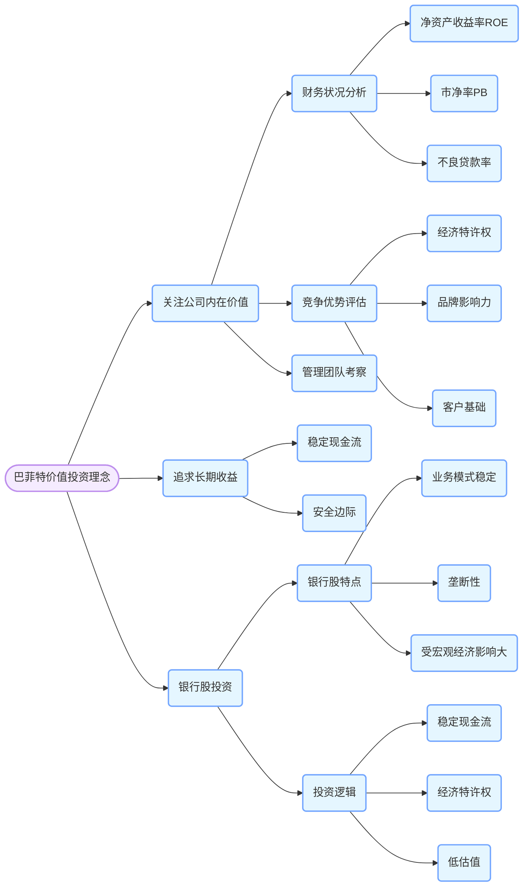

# 巴菲特如何看待银行股投资

> 关键词：巴菲特、银行股投资、价值投资、金融分析、投资策略、风险管理、长期收益

> 摘要：本文旨在深入探讨巴菲特对银行股投资的看法。通过对巴菲特投资理念的背景介绍，剖析其看待银行股的核心概念与投资逻辑。详细阐述相关的核心算法原理及操作步骤，借助数学模型和公式加深理解。结合实际的项目实战案例，分析其投资银行股的具体操作和决策依据。探讨银行股投资在实际中的应用场景，推荐相关的学习资源、开发工具及论文著作。最后总结银行股投资的未来发展趋势与挑战，解答常见问题并提供扩展阅读和参考资料，帮助投资者全面了解巴菲特投资银行股的智慧与策略。

## 1. 背景介绍 
### 1.1 目的和范围
本文的目的在于全面解析巴菲特对银行股投资的观点和策略。通过研究巴菲特多年来在银行股投资领域的实践和言论，深入挖掘其投资背后的逻辑和决策依据。范围涵盖巴菲特的投资理念、对银行股基本面的分析方法、投资银行股的具体案例以及对未来银行股投资趋势的展望等方面，为投资者提供系统且深入的参考。

### 1.2 预期读者
本文预期读者包括对价值投资感兴趣的个人投资者、金融行业从业者、金融专业的学生以及关注巴菲特投资理念的研究人员。无论是希望学习投资技巧的新手，还是寻求深入理解投资策略的专业人士，都能从本文中获取有价值的信息。

### 1.3 文档结构概述
本文将按照以下结构展开：首先介绍相关背景知识，包括目的、预期读者和术语表。接着阐述巴菲特看待银行股投资的核心概念与联系，通过示意图和流程图进行直观展示。然后详细讲解核心算法原理和具体操作步骤，并给出Python源代码示例。再通过数学模型和公式进一步解释投资逻辑，结合实际案例进行说明。之后进行项目实战，包括开发环境搭建、源代码实现和代码解读。探讨银行股投资的实际应用场景，推荐相关的工具和资源。最后总结未来发展趋势与挑战，解答常见问题并提供扩展阅读和参考资料。

### 1.4 术语表
#### 1.4.1 核心术语定义
- **价值投资**：一种基于公司内在价值进行投资的策略，投资者通过分析公司的财务状况、竞争优势等因素，寻找被低估的股票进行投资，以获取长期收益。
- **银行股**：指在证券市场上交易的银行类上市公司的股票。
- **净资产收益率（ROE）**：衡量公司盈利能力的重要指标，计算公式为净利润与平均净资产的比率，反映股东权益的收益水平。
- **市净率（PB）**：股票价格与每股净资产的比率，用于评估股票的估值水平。
- **不良贷款率**：银行不良贷款占总贷款余额的比例，反映银行资产质量的重要指标。

#### 1.4.2 相关概念解释
- **经济特许权**：巴菲特提出的概念，指公司具有的一种特殊优势，使其能够在市场竞争中获得超出正常水平的利润，例如品牌优势、专利技术、垄断地位等。
- **安全边际**：投资者在购买股票时，为了降低风险，以低于股票内在价值的价格买入，这个价格与内在价值之间的差值就是安全边际。

#### 1.4.3 缩略词列表
- **ROE**：净资产收益率（Return on Equity）
- **PB**：市净率（Price-to-Book Ratio）

## 2. 核心概念与联系 

### 巴菲特的价值投资理念
巴菲特是价值投资的坚定践行者，他认为股票不仅仅是一张凭证，更是公司所有权的一部分。投资者应该关注公司的内在价值，而不是股票价格的短期波动。在选择投资标的时，巴菲特注重公司的长期竞争优势、稳定的现金流和优秀的管理团队。

### 银行股的特点与巴菲特的投资逻辑
银行作为金融行业的核心，具有特殊的经济地位。银行股的特点包括：业务模式相对稳定、具有一定的垄断性、受宏观经济环境影响较大等。巴菲特投资银行股的逻辑主要基于以下几点：
- **稳定的现金流**：银行通过吸收存款和发放贷款等业务，能够产生稳定的现金流。这符合巴菲特对投资标的现金流要求，稳定的现金流为公司的持续发展和股东回报提供了保障。
- **经济特许权**：一些大型银行具有广泛的分支机构、强大的品牌影响力和客户基础，形成了一定的经济特许权。这种特许权使得银行在市场竞争中具有优势，能够获得稳定的利润。
- **低估值**：巴菲特注重在股票被低估时买入，银行股由于受到宏观经济环境、监管政策等因素的影响，有时会出现估值较低的情况。当银行股的市净率、市盈率等指标低于其历史平均水平时，巴菲特认为这是一个投资机会。

### 核心概念原理和架构的文本示意图
```plaintext
巴菲特价值投资理念
|
|-- 关注公司内在价值
|   |-- 财务状况分析
|   |   |-- 净资产收益率（ROE）
|   |   |-- 市净率（PB）
|   |   |-- 不良贷款率
|   |-- 竞争优势评估
|   |   |-- 经济特许权
|   |   |-- 品牌影响力
|   |   |-- 客户基础
|   |-- 管理团队考察
|
|-- 追求长期收益
|   |-- 稳定现金流
|   |-- 安全边际
|
|-- 银行股投资
|   |-- 银行股特点
|   |   |-- 业务模式稳定
|   |   |-- 垄断性
|   |   |-- 受宏观经济影响大
|   |-- 投资逻辑
|   |   |-- 稳定现金流
|   |   |-- 经济特许权
|   |   |-- 低估值
```

### Mermaid 流程图


## 3. 核心算法原理 & 具体操作步骤 

### 核心算法原理
巴菲特投资银行股的核心算法原理基于对银行股内在价值的评估。内在价值的评估主要通过对银行的财务指标进行分析，包括净资产收益率（ROE）、市净率（PB）、不良贷款率等。同时，还需要考虑银行的竞争优势、管理团队等因素。

### 具体操作步骤
1. **筛选银行股**：从众多银行股中筛选出具有一定规模和市场影响力的银行。可以通过市值、营业收入等指标进行初步筛选。
2. **财务分析**：对筛选出的银行股进行详细的财务分析，计算ROE、PB、不良贷款率等指标，并与同行业平均水平进行比较。
3. **竞争优势评估**：分析银行的竞争优势，包括品牌影响力、客户基础、业务创新能力等。评估银行是否具有经济特许权。
4. **管理团队考察**：了解银行的管理团队，包括管理层的经验、决策能力、诚信度等。一个优秀的管理团队能够带领银行取得良好的业绩。
5. **估值判断**：根据财务分析和竞争优势评估的结果，判断银行股的估值是否合理。如果银行股的估值低于其内在价值，且具有一定的安全边际，则可以考虑投资。

### Python源代码示例
```python
import pandas as pd
import yfinance as yf

# 筛选银行股
def select_bank_stocks():
    # 假设我们从雅虎财经获取银行股列表
    bank_stocks = ['JPM', 'BAC', 'WFC', 'C']  # 示例银行股代码
    return bank_stocks

# 财务分析
def financial_analysis(ticker):
    stock = yf.Ticker(ticker)
    financials = stock.financials
    balance_sheet = stock.balance_sheet
    income_statement = stock.income_stmt

    # 计算ROE
    net_income = income_statement.loc['Net Income'].iloc[0]
    average_equity = (balance_sheet.loc['Total Stockholder Equity'].iloc[0] + balance_sheet.loc['Total Stockholder Equity'].iloc[1]) / 2
    roe = net_income / average_equity

    # 计算PB
    market_cap = stock.info['marketCap']
    book_value = balance_sheet.loc['Total Stockholder Equity'].iloc[0]
    pb = market_cap / book_value

    # 假设不良贷款率数据可以从其他数据源获取
    # bad_loan_ratio = get_bad_loan_ratio(ticker)

    return roe, pb

# 主函数
def main():
    bank_stocks = select_bank_stocks()
    for stock in bank_stocks:
        roe, pb = financial_analysis(stock)
        print(f"Stock: {stock}, ROE: {roe}, PB: {pb}")

if __name__ == "__main__":
    main()
```

### 代码解释
- `select_bank_stocks` 函数：用于筛选银行股，这里简单地列出了几个示例银行股代码。在实际应用中，可以从金融数据提供商获取更全面的银行股列表。
- `financial_analysis` 函数：对单个银行股进行财务分析，计算ROE和PB。ROE的计算是通过净利润除以平均净资产得到，PB的计算是通过市值除以账面价值得到。
- `main` 函数：主函数，调用 `select_bank_stocks` 和 `financial_analysis` 函数，对筛选出的银行股进行财务分析，并打印结果。

## 4. 数学模型和公式 & 详细讲解 & 举例说明 

### 净资产收益率（ROE）
净资产收益率（ROE）是衡量公司盈利能力的重要指标，计算公式为：
$$ROE = \frac{净利润}{平均净资产}$$

详细讲解：ROE反映了股东权益的收益水平，ROE越高，说明公司运用自有资本的效率越高，盈利能力越强。在分析银行股时，ROE是一个重要的参考指标。一般来说，ROE持续稳定在15%以上的银行具有较强的盈利能力。

举例说明：假设某银行的净利润为100亿元，平均净资产为500亿元，则该银行的ROE为：
$$ROE = \frac{100}{500} = 0.2 = 20\%$$

### 市净率（PB）
市净率（PB）是衡量股票估值水平的指标，计算公式为：
$$PB = \frac{股票价格}{每股净资产}$$

详细讲解：PB反映了市场对公司净资产的估值。PB越低，说明股票的估值越低，投资价值可能越高。在分析银行股时，PB是一个重要的估值指标。一般来说，银行股的PB在1倍左右较为合理。

举例说明：假设某银行的股票价格为10元，每股净资产为8元，则该银行的PB为：
$$PB = \frac{10}{8} = 1.25$$

### 不良贷款率
不良贷款率是衡量银行资产质量的重要指标，计算公式为：
$$不良贷款率 = \frac{不良贷款余额}{总贷款余额}$$

详细讲解：不良贷款率反映了银行贷款资产的风险程度。不良贷款率越高，说明银行的资产质量越差，面临的风险越大。在分析银行股时，不良贷款率是一个重要的风险指标。一般来说，银行的不良贷款率控制在2%以内较为理想。

举例说明：假设某银行的不良贷款余额为10亿元，总贷款余额为500亿元，则该银行的不良贷款率为：
$$不良贷款率 = \frac{10}{500} = 0.02 = 2\%$$

### 综合评估模型
在实际投资中，需要综合考虑ROE、PB、不良贷款率等多个指标，构建综合评估模型。例如，可以通过加权平均的方法，计算银行股的综合得分：
$$综合得分 = w_1 \times ROE + w_2 \times \frac{1}{PB} + w_3 \times (1 - 不良贷款率)$$
其中，$w_1$、$w_2$、$w_3$ 为各指标的权重，且 $w_1 + w_2 + w_3 = 1$。

详细讲解：综合得分越高，说明银行股的投资价值越高。通过调整各指标的权重，可以根据不同的投资偏好和市场环境，对银行股进行综合评估。

举例说明：假设 $w_1 = 0.4$，$w_2 = 0.3$，$w_3 = 0.3$，某银行的ROE为20%，PB为1.25，不良贷款率为2%，则该银行的综合得分计算如下：
$$综合得分 = 0.4 \times 0.2 + 0.3 \times \frac{1}{1.25} + 0.3 \times (1 - 0.02)$$
$$= 0.08 + 0.24 + 0.294$$
$$= 0.614$$

## 5. 项目实战：代码实际案例和详细解释说明 

### 5.1  开发环境搭建
- **Python环境**：安装Python 3.x版本，可以从Python官方网站（https://www.python.org/downloads/）下载安装。
- **开发工具**：推荐使用PyCharm或Jupyter Notebook作为开发工具。PyCharm是一款专业的Python集成开发环境，提供了丰富的功能和工具；Jupyter Notebook是一个交互式的开发环境，适合进行数据分析和代码演示。
- **第三方库**：安装 `pandas`、`yfinance` 等第三方库。可以使用以下命令进行安装：
```sh
pip install pandas yfinance
```

### 5.2  源代码详细实现和代码解读
```python
import pandas as pd
import yfinance as yf

# 筛选银行股
def select_bank_stocks():
    # 从雅虎财经获取银行股列表
    bank_stocks = ['JPM', 'BAC', 'WFC', 'C']  # 示例银行股代码
    return bank_stocks

# 财务分析
def financial_analysis(ticker):
    stock = yf.Ticker(ticker)
    financials = stock.financials
    balance_sheet = stock.balance_sheet
    income_statement = stock.income_stmt

    # 计算ROE
    net_income = income_statement.loc['Net Income'].iloc[0]
    average_equity = (balance_sheet.loc['Total Stockholder Equity'].iloc[0] + balance_sheet.loc['Total Stockholder Equity'].iloc[1]) / 2
    roe = net_income / average_equity

    # 计算PB
    market_cap = stock.info['marketCap']
    book_value = balance_sheet.loc['Total Stockholder Equity'].iloc[0]
    pb = market_cap / book_value

    # 假设不良贷款率数据可以从其他数据源获取
    # bad_loan_ratio = get_bad_loan_ratio(ticker)

    return roe, pb

# 综合评估
def comprehensive_evaluation(roe, pb):
    # 假设权重
    w1 = 0.4
    w2 = 0.3
    w3 = 0.3  # 由于不良贷款率数据未获取，这里暂不考虑

    score = w1 * roe + w2 * (1 / pb)
    return score

# 主函数
def main():
    bank_stocks = select_bank_stocks()
    results = []
    for stock in bank_stocks:
        roe, pb = financial_analysis(stock)
        score = comprehensive_evaluation(roe, pb)
        results.append({
            'Stock': stock,
            'ROE': roe,
            'PB': pb,
            'Score': score
        })

    df = pd.DataFrame(results)
    print(df)

if __name__ == "__main__":
    main()
```

### 代码解读
1. **`select_bank_stocks` 函数**：该函数用于筛选银行股，返回一个包含银行股代码的列表。在实际应用中，可以从金融数据提供商获取更全面的银行股列表。
2. **`financial_analysis` 函数**：该函数对单个银行股进行财务分析，计算ROE和PB。通过 `yfinance` 库获取银行股的财务数据，包括净利润、净资产等，然后根据公式计算ROE和PB。
3. **`comprehensive_evaluation` 函数**：该函数对银行股进行综合评估，根据ROE和PB计算综合得分。这里假设了各指标的权重，在实际应用中可以根据需要进行调整。
4. **`main` 函数**：主函数，调用 `select_bank_stocks`、`financial_analysis` 和 `comprehensive_evaluation` 函数，对筛选出的银行股进行财务分析和综合评估，并将结果存储在DataFrame中打印输出。

### 5.3  代码解读与分析
通过上述代码，我们可以对银行股进行初步的财务分析和综合评估。但是，需要注意的是，代码中存在一些局限性：
- **数据获取的局限性**：`yfinance` 库获取的数据可能存在延迟或不准确的情况，特别是不良贷款率等数据，可能需要从其他数据源获取。
- **指标的局限性**：仅考虑了ROE和PB两个指标，没有考虑不良贷款率等其他重要指标。在实际投资中，需要综合考虑更多的因素。
- **权重的主观性**：综合评估模型中各指标的权重是假设的，具有一定的主观性。在实际应用中，需要根据不同的投资偏好和市场环境进行调整。

## 6. 实际应用场景 
### 个人投资者
对于个人投资者来说，巴菲特的银行股投资策略可以作为参考。个人投资者可以通过分析银行股的财务指标、竞争优势等因素，选择具有投资价值的银行股进行长期投资。例如，在市场低迷时，一些银行股的估值可能会下降，个人投资者可以利用这个机会，以较低的价格买入具有稳定盈利能力和良好资产质量的银行股，等待市场回升时获得收益。

### 机构投资者
机构投资者如基金公司、保险公司等，通常会进行大规模的资产配置。巴菲特的银行股投资策略可以帮助机构投资者优化资产配置，降低投资风险。机构投资者可以通过对银行股的深入研究，选择不同类型的银行股进行投资，分散投资风险。例如，同时投资大型国有银行和中小股份制银行，以平衡收益和风险。

### 金融研究机构
金融研究机构可以借鉴巴菲特的投资理念和分析方法，对银行股市场进行研究和分析。通过对银行股的财务数据、行业动态等进行深入研究，为投资者提供专业的投资建议和研究报告。例如，金融研究机构可以定期发布银行股投资分析报告，为投资者提供最新的市场信息和投资策略。

## 7. 工具和资源推荐
### 7.1 学习资源推荐
#### 7.1.1 书籍推荐
- 《聪明的投资者》（The Intelligent Investor）：作者本杰明·格雷厄姆（Benjamin Graham），是价值投资领域的经典著作，对巴菲特的投资理念产生了深远影响。
- 《巴菲特致股东的信：股份公司教程》（The Essays of Warren Buffett: Lessons for Corporate America）：收录了巴菲特历年致股东的信，通过这些信件可以深入了解巴菲特的投资思想和管理理念。
- 《金融炼金术》（The Alchemy of Finance）：作者乔治·索罗斯（George Soros），虽然主要讲述的是宏观经济和金融市场的投资策略，但对理解金融行业和银行股投资也有一定的启发。

#### 7.1.2 在线课程
- Coursera平台上的“Financial Markets”课程：由耶鲁大学教授罗伯特·席勒（Robert Shiller）授课，介绍了金融市场的基本原理和投资策略。
- edX平台上的“Investment Management”课程：由哥伦比亚大学教授授课，深入讲解了投资管理的理论和实践。

#### 7.1.3 技术博客和网站
- 雪球网（https://xueqiu.com/）：国内知名的财经社区，提供股票、基金等金融产品的资讯和交流平台，有很多关于银行股投资的讨论和分析。
- Seeking Alpha（https://seekingalpha.com/）：国外知名的金融投资网站，提供股票分析、投资策略等内容，有很多专业的分析师和投资者分享对银行股的看法。

### 7.2 开发工具框架推荐
#### 7.2.1 IDE和编辑器
- PyCharm：专业的Python集成开发环境，提供了丰富的功能和工具，适合进行Python编程和数据分析。
- Jupyter Notebook：交互式的开发环境，适合进行数据分析和代码演示，方便用户进行代码的编写、运行和可视化展示。

#### 7.2.2 调试和性能分析工具
- PyCharm自带的调试工具：可以帮助用户调试Python代码，定位和解决代码中的问题。
- `cProfile` 模块：Python标准库中的性能分析工具，可以帮助用户分析代码的性能瓶颈，优化代码效率。

#### 7.2.3 相关框架和库
- `pandas`：用于数据处理和分析的Python库，提供了高效的数据结构和数据操作方法，方便用户对金融数据进行处理和分析。
- `yfinance`：用于获取金融数据的Python库，可以从雅虎财经获取股票的历史数据、财务数据等。

### 7.3 相关论文著作推荐
#### 7.3.1 经典论文
- “The Capital Asset Pricing Model: Theory and Evidence”：由威廉·夏普（William Sharpe）等人撰写，是资本资产定价模型（CAPM）的经典论文，对理解金融市场的风险和收益关系有重要意义。
- “Efficient Capital Markets: A Review of Theory and Empirical Work”：由尤金·法玛（Eugene F. Fama）撰写，对有效市场假说进行了系统的阐述和实证研究。

#### 7.3.2 最新研究成果
- 关注《Journal of Financial Economics》、《Review of Financial Studies》等金融领域的顶级学术期刊，这些期刊会发表关于银行股投资、金融市场等方面的最新研究成果。

#### 7.3.3 应用案例分析
- 可以参考一些金融研究机构发布的关于银行股投资的案例分析报告，了解实际投资中如何运用各种分析方法和策略进行银行股投资。

## 8. 总结：未来发展趋势与挑战
### 未来发展趋势
- **数字化转型**：随着科技的不断发展，银行将加快数字化转型的步伐。数字化银行将提供更加便捷、高效的金融服务，降低运营成本，提高客户满意度。这将为银行股带来新的发展机遇。
- **金融监管加强**：为了维护金融稳定，各国政府将加强对金融行业的监管。银行将面临更加严格的监管要求，这将促使银行加强风险管理，提高资产质量。长期来看，这将有利于银行股的稳定发展。
- **国际化发展**：随着经济全球化的深入，银行将加快国际化发展的步伐。银行将拓展海外市场，加强国际业务合作，提高国际竞争力。这将为银行股带来更广阔的发展空间。

### 挑战
- **宏观经济不确定性**：全球经济增长面临不确定性，宏观经济环境的变化将对银行的经营业绩产生影响。例如，经济衰退可能导致银行的不良贷款率上升，盈利能力下降。
- **金融科技竞争**：金融科技公司的崛起给传统银行带来了竞争压力。金融科技公司通过创新的金融服务模式和技术手段，吸引了部分客户资源。银行需要加快数字化转型，提升自身的竞争力。
- **利率市场化**：利率市场化的推进将导致银行的利差收窄，盈利能力受到挑战。银行需要加强风险管理，优化资产负债结构，提高中间业务收入占比。

## 9. 附录：常见问题与解答
### 问题1：巴菲特投资银行股的长期收益如何？
解答：巴菲特投资银行股的长期收益表现出色。例如，他长期持有富国银行等银行股，获得了丰厚的回报。通过价值投资的策略，巴菲特在银行股投资中注重公司的内在价值和长期发展，取得了较好的投资效果。

### 问题2：银行股投资的风险有哪些？
解答：银行股投资的风险主要包括宏观经济风险、信用风险、利率风险、政策风险等。宏观经济衰退可能导致银行的不良贷款率上升，信用风险增加；利率波动可能影响银行的利差收入；政策变化可能对银行的业务和经营产生影响。

### 问题3：如何判断银行股的估值是否合理？
解答：可以通过分析银行股的市净率（PB）、市盈率（PE）等估值指标，并与同行业平均水平进行比较。同时，还需要考虑银行的盈利能力、资产质量、竞争优势等因素。如果银行股的估值低于其内在价值，且具有一定的安全边际，则可以认为其估值较为合理。

### 问题4：巴菲特投资银行股的决策依据是什么？
解答：巴菲特投资银行股的决策依据主要包括公司的内在价值、竞争优势、管理团队、稳定的现金流等因素。他注重在股票被低估时买入，通过长期持有获得收益。同时，他也会关注银行的资产质量、风险管理能力等方面。

## 10. 扩展阅读 & 参考资料
### 扩展阅读
- 《投资最重要的事》（The Most Important Thing Illuminated）：作者霍华德·马克斯（Howard Marks），讲述了投资中的重要原则和策略，对理解价值投资有一定的帮助。
- 《漫步华尔街》（A Random Walk Down Wall Street）：作者伯顿·马尔基尔（Burton G. Malkiel），介绍了股票市场的投资理论和实践，对投资者有一定的启发。

### 参考资料
- 巴菲特历年致股东的信：可以从伯克希尔·哈撒韦公司的官方网站（https://www.berkshirehathaway.com/）获取。
- 金融数据来源：雅虎财经（https://finance.yahoo.com/）、东方财富网（https://www.eastmoney.com/）等。